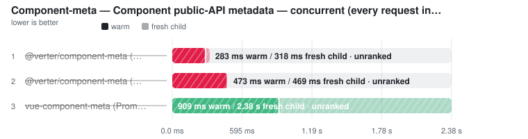

# Vue Toolchain Benchmarks

Reference-anchored performance and compatibility testing for Vue compilers,
typecheckers, formatters, linters, language servers and bundlers. Measured on one
Linux CI runner per dispatch and committed back here.

This project has two equally important outputs:

1. **Apples-to-apples performance comparisons.** A candidate is timed against
   the official or established reference for the same work. Different targets,
   artifacts, threading modes and cache states are disclosed; materially
   different work is separated or left unranked.
2. **Actionable tooling-gap findings.** Executable gates and confirmation
   plants expose missing transforms, invalid output, skipped files and semantic
   differences. The timing stays visible when useful, but incomplete work
   cannot become a performance win.

The goal is not a leaderboard. It is reproducible evidence about both
performance and compatibility, with Vue and the relevant established toolchain
as the reference point.

This page is the **landing view**: one chart and a compact ranking per main
group. Every group links its full page under [`docs/`](docs/) — all tables,
per-row notes, raw runs, validation plants and the memory probe — generated
from the JSON snapshots in [`results/benchmarks/`](results/benchmarks/) and
[`results/real_world/`](results/real_world/).

<!-- RESULTS_INDEX_START -->

**Results index** — compact charts below; every group links its full page under [`docs/`](docs/):

- **[Compiler](#compiler)** — [docs/compiler.md](docs/compiler.md)
- **[Typecheck](#typecheck)** — [docs/typecheck.md](docs/typecheck.md)
- **[Format](#format)** — [docs/format.md](docs/format.md)
- **[Lint](#lint)** — [docs/lint.md](docs/lint.md)
- **[Component-meta](#component-meta)** — [docs/component-meta.md](docs/component-meta.md)
- **[LSP and IDE operations](#lsp-and-ide-operations)** — [docs/lsp.md](docs/lsp.md)
- **[Real-world projects](#real-world-projects)** — [docs/real-world.md](docs/real-world.md)
- **Memory** — [docs/memory.md](docs/memory.md)
- **Methodology** — [docs/methodology.md](docs/methodology.md) · [docs/how-to-read.md](docs/how-to-read.md)

<!-- RESULTS_INDEX_END -->

## What is compared

<!-- WHAT_IS_COMPARED_START -->

| Group | Measured in the published run |
| --- | --- |
| **[Compiler](docs/compiler.md)** | [`@vue/compiler-sfc`](https://github.com/vuejs/core) · [`@vue/compiler-sfc-36`](https://github.com/vuejs/core) · [`@vizejs/native`](https://github.com/ubugeeei-prod/vize) · [`@fervid/napi`](https://github.com/phoenix-ru/fervid) · [`@verter/native`](https://github.com/pikax/verter) · `@vue-jsx-vapor/compiler-rs` · `vue-jsx-vapor` · `@vue/babel-plugin-jsx` |
| **[Typecheck](docs/typecheck.md)** | [`vue-tsc`](https://github.com/vuejs/language-tools) · [`typescript-native-bridge`](https://github.com/johnsoncodehk/typescript-native-bridge) · [`golar`](https://github.com/auvred/golar) · [`vize`](https://github.com/ubugeeei-prod/vize) · [`verter-tsc`](https://github.com/pikax/verter) |
| **[Format](docs/format.md)** | [`prettier`](https://github.com/prettier/prettier) · [`oxfmt`](https://github.com/oxc-project/oxc) · [`vize`](https://github.com/ubugeeei-prod/vize) · [`@biomejs/biome`](https://github.com/biomejs/biome) |
| **[Lint](docs/lint.md)** | [`eslint-plugin-vue`](https://github.com/vuejs/eslint-plugin-vue) · [`vize`](https://github.com/ubugeeei-prod/vize) · [`@biomejs/biome`](https://github.com/biomejs/biome) · [`oxlint`](https://github.com/oxc-project/oxc) · [`@verter/native`](https://github.com/pikax/verter) |
| **[Component-meta](docs/component-meta.md)** | [`vue-component-meta`](https://github.com/vuejs/language-tools) · [`@verter/component-meta`](https://github.com/pikax/verter) · [`vize`](https://github.com/ubugeeei-prod/vize) |
| **[LSP and IDE operations](docs/lsp.md)** | [`@vue/language-server`](https://github.com/vuejs/language-tools) · [`vize`](https://github.com/ubugeeei-prod/vize) · [`verter-lsp`](https://github.com/pikax/verter) |
| **[Real-world projects](docs/real-world.md)** | 9 pinned checkouts — each project's own test / build / typecheck vs plugin swaps (`unplugin-vue` · `@vizejs/vite-plugin` · `@verter/unplugin`); bundle / HMR across `@vitejs/plugin-vue` · `unplugin-vue` · `@vizejs/vite-plugin` · `@verter/unplugin` · `vue-loader` · `@vizejs/rspack-plugin` |
| **[Memory](docs/memory.md)** | same tools, isolated resource probe — plus the **Peak RSS** column on every timing table |

<!-- WHAT_IS_COMPARED_END -->

## How to read

Median of measured runs; Compiler and Component-meta show a separately sampled
**Fresh child** column plus primary **Warm**; IDE operations show **Cold** and
**Warm**. **⚠** failed a
validation gate (shown, unranked) · **❌** error · **⏭** skipped. Each timing
table carries a **Peak RSS** column instead of a separate memory chart.
Details: [docs/how-to-read.md](docs/how-to-read.md) ·
[docs/methodology.md](docs/methodology.md).

Published numbers are **Linux CI only**; local runs are for comparison on your
own box, never against the published charts.

<!-- RUN_META_START -->

## This run

- **Generated:** 2026-09-12T11:01:27.224Z
- **Fixture:** `fixtures/200` (200 files)
- **Runs / warmups:** 5 / 1
- **Runner:** Linux · linux/x64 · 4 CPUs · AMD EPYC 7763 64-Core Processor · 15.6 GB · Node v22.23.2
- **Commit:** [`d4906cb`](https://github.com/pikax/vue-benchmarks/commit/d4906cbe77791d01e3e55b298b0bff7476ea561a)
- **CI run:** https://github.com/pikax/vue-benchmarks/actions/runs/34689529541

<!-- RUN_META_END -->

## Quick start

```bash
corepack enable && pnpm install   # Node 22+, pnpm 12 (pinned in package.json)
pnpm generate                     # fixtures
pnpm bench                        # full local bench (5 runs, 1 warmup)
pnpm confirm                      # validity plants
pnpm docs                         # regenerate README + docs/ from the published results JSON
pnpm docs:local                   # same, but also include your local runs (banner-disclosed)
```

More commands: [docs/methodology.md](docs/methodology.md#quick-start).

## Results

<!-- BENCHMARK_RESULTS_START -->

> Generated 2026-09-12 from the latest published **Linux** JSON snapshot in `results/benchmarks/`. Numbers are reference-only; re-run on your hardware for local relevance.
> Median of measured runs; **Peak RSS** column: memory for the same row (timed session where sampled there, isolated probe otherwise). ⚠ failed a validation gate (bracketed, unranked). How to read: [docs/how-to-read.md](docs/how-to-read.md).

### Compiler

> 📄 **[Full results →](docs/compiler.md)** — every table, per-row notes, raw runs, validation plants and the isolated memory probe.

<picture>
  <source media="(prefers-color-scheme: dark)" srcset="docs/charts/readme-compiler-vdom-production-sourcemap-off-raw-sfc-compilatio-1ec7hu9-dark.svg">
  
</picture>

| Tool | Fresh child | **Warm (primary)** | vs fastest | Peak RSS |
| --- | ---: | ---: | ---: | ---: |
| [Vue compiler-sfc 3.5 reference (raw render, 1T)](https://github.com/vuejs/core) | 542.6 ms | **242.0 ms** | 1.00x | – |
| [Vize compileSfcBatchWithResults (raw render)](https://github.com/ubugeeei-prod/vize) ⚠ | (24.7 ms) | (22.7 ms) | not ranked | (18.4 MB) |
| [Verter compileMany (first-admission stateless raw render)](https://github.com/pikax/verter) ⚠ | (124.7 ms) | (117.0 ms) | not ranked | (36.2 MB) |

> ⚠ rows failed a validation gate (time bracketed, unranked); errors, skips and per-row notes: [full results](docs/compiler.md).

<picture>
  <source media="(prefers-color-scheme: dark)" srcset="docs/charts/readme-compiler-vdom-production-sourcemap-off-sfc-compilation-wi-1n1ebc6-dark.svg">
  
</picture>

| Tool | Fresh child | **Warm (primary)** | vs fastest | Peak RSS |
| --- | ---: | ---: | ---: | ---: |
| [Vue compiler-sfc 3.5 reference (render + CSS, 1T)](https://github.com/vuejs/core) | 634.3 ms | **285.5 ms** | 1.00x | 66.0 MB |
| [Vize compileSfc loop (full SFC, 1T)](https://github.com/ubugeeei-prod/vize) ⚠ | (68.4 ms) | (66.6 ms) | not ranked | (16.3 MB) |
| [Vize compileSfcBatchWithResults (render + CSS, Rayon batch)](https://github.com/ubugeeei-prod/vize) ⚠ | (25.6 ms) | (23.6 ms) | not ranked | (18.6 MB) |
| [fervid compileSync (1T)](https://github.com/phoenix-ru/fervid) ⚠ | (63.7 ms) | (61.5 ms) | not ranked | (15.9 MB) |
| [fervid compileAsync (4-thread libuv pool)](https://github.com/phoenix-ru/fervid) ⚠ | (27.5 ms) | (27.6 ms) | not ranked | – |
| [Verter compileMany + processStyle (render + CSS)](https://github.com/pikax/verter) ⚠ | (135.5 ms) | (124.3 ms) | not ranked | (38.1 MB) |

> ⚠ rows failed a validation gate (time bracketed, unranked); errors, skips and per-row notes: [full results](docs/compiler.md).

<picture>
  <source media="(prefers-color-scheme: dark)" srcset="docs/charts/readme-compiler-vapor-production-sourcemap-off-raw-sfc-compilati-1uzi4el-dark.svg">
  
</picture>

| Tool | Fresh child | **Warm (primary)** | vs fastest | Peak RSS |
| --- | ---: | ---: | ---: | ---: |
| [Vue compiler-sfc 3.6 reference (raw render, 1T)](https://github.com/vuejs/core) ⚠ | (892.7 ms) | (410.9 ms) | not ranked | – |
| [Vize compileSfcBatchWithResults (raw render)](https://github.com/ubugeeei-prod/vize) ⚠ | (24.3 ms) | (23.0 ms) | not ranked | (18.7 MB) |
| [Verter compileMany (first-admission stateless raw render)](https://github.com/pikax/verter) ⚠ | (123.5 ms) | (117.8 ms) | not ranked | (35.9 MB) |

> ⚠ rows failed a validation gate (time bracketed, unranked); errors, skips and per-row notes: [full results](docs/compiler.md).

<picture>
  <source media="(prefers-color-scheme: dark)" srcset="docs/charts/readme-compiler-vapor-production-sourcemap-off-sfc-compilation-w-02joyyi-dark.svg">
  
</picture>

| Tool | Fresh child | **Warm (primary)** | vs fastest | Peak RSS |
| --- | ---: | ---: | ---: | ---: |
| [Vue compiler-sfc 3.6 reference (render + CSS, 1T)](https://github.com/vuejs/core) ⚠ | (992.4 ms) | (481.6 ms) | not ranked | (78.9 MB) |
| [Vize compileSfc loop (full SFC, 1T)](https://github.com/ubugeeei-prod/vize) ⚠ | (69.2 ms) | (66.7 ms) | not ranked | (16.1 MB) |
| [Vize compileSfcBatchWithResults (render + CSS, Rayon batch)](https://github.com/ubugeeei-prod/vize) ⚠ | (25.6 ms) | (23.5 ms) | not ranked | (18.7 MB) |
| [Verter compileMany + processStyle (render + CSS)](https://github.com/pikax/verter) ⚠ | (132.3 ms) | (126.6 ms) | not ranked | (38.2 MB) |

> ⚠ rows failed a validation gate (time bracketed, unranked); errors, skips and per-row notes: [full results](docs/compiler.md).

Development builds, sourcemap cells, the single-file size ladder and the repeated-input study: [full results](docs/compiler.md).

JSX compile (vue-jsx-vapor vs Babel) is ranked per codegen target on the [Compiler page](docs/compiler.md).

### Typecheck

> 📄 **[Full results →](docs/typecheck.md)** — every table, per-row notes, raw runs, validation plants and the isolated memory probe.

<picture>
  <source media="(prefers-color-scheme: dark)" srcset="docs/charts/readme-typecheck-typecheck-dark.svg">
  
</picture>

| Tool | **Median** | vs fastest | Peak RSS |
| --- | ---: | ---: | ---: |
| [verter-tsc](https://github.com/pikax/verter) | **1.19 s** | 1.00x | 212.4 MB |
| [Vize](https://github.com/ubugeeei-prod/vize) | **1.63 s** | 1.36x | 216.3 MB |
| [Golar typecheck](https://github.com/auvred/golar) | **1.66 s** | 1.39x | 386.0 MB |
| [Golar (lint+check)](https://github.com/auvred/golar) | **1.68 s** | 1.41x | – |
| [vue-tsc (N)](https://github.com/johnsoncodehk/typescript-native-bridge) | **2.41 s** | 2.01x | – |
| [vue-tsc (JS)](https://github.com/vuejs/language-tools) | **5.14 s** | 4.31x | 352.1 MB |

> Errors, skips and per-row notes: [full results](docs/typecheck.md).

**Correctness (plant suite, one tsconfig):**

<picture>
  <source media="(prefers-color-scheme: dark)" srcset="docs/charts/typecheck-all-wall-dark.svg">
  
</picture>

| Tool | **Median** | Avg | vs fastest | Peak RSS |
| --- | ---: | ---: | ---: | ---: |
| verter-tsc | **514 ms** | 513 ms | 1.00x | 85.2 + 155.7 = **240.9 MB** |
| golar | **666 ms** | 674 ms | 1.30x | **368.3 MB** |
| vize | **815 ms** | 821 ms | 1.59x | 73.8 + 467.0 = **540.8 MB** |
| vue-tsc | **2.20 s** | 2.20 s | 4.27x | **345.9 MB** |

Peak RSS is the separate memory pass, split `tool + tsgo/tsc = total` when the checker spawns a TypeScript engine; in-process engines cannot be split.

<picture>
  <source media="(prefers-color-scheme: dark)" srcset="docs/charts/typecheck-all-pass-dark.svg">
  
</picture>

| Tool | **Pass rate** | pass / plants | ⚠ needed opt-in |
| --- | ---: | ---: | ---: |
| vue-tsc | **95%** | 147 / 154 | 5 |
| golar | **94%** | 145 / 154 | 5 |
| vize | **92%** | 142 / 154 | – |
| verter-tsc | **81%** | 125 / 154 | – |

An unclaimed capability is a **gap and counts as a fail** — every tool is scored over the same full plant set, on what it actually reported. Skip is reserved for a missing binary/engine. **⚠ needed opt-in** counts the inheritAttrs/root-shape plants a tool only scored with `vueCompilerOptions.fallthroughAttributes`: not a pass, and still in the denominator.

### Format

> 📄 **[Full results →](docs/format.md)** — every table, per-row notes, raw runs, validation plants and the isolated memory probe.

<picture>
  <source media="(prefers-color-scheme: dark)" srcset="docs/charts/readme-format-format-dark.svg">
  
</picture>

| Tool | **Median** | vs fastest | Peak RSS |
| --- | ---: | ---: | ---: |
| [Vize](https://github.com/ubugeeei-prod/vize) | **129.9 ms** | 1.00x | 68.0 MB |
| [Oxfmt](https://github.com/oxc-project/oxc) | **3.20 s** | 24.63x | 683.8 MB |
| [Prettier](https://github.com/prettier/prettier) | **3.73 s** | 28.75x | 189.0 MB |
| [Biome format](https://github.com/biomejs/biome) ⚠ | (100.6 ms) | not ranked | (92.7 MB) |

> ⚠ rows failed a validation gate (time bracketed, unranked); errors, skips and per-row notes: [full results](docs/format.md).

### Lint

> 📄 **[Full results →](docs/lint.md)** — every table, per-row notes, raw runs, validation plants and the isolated memory probe.

<picture>
  <source media="(prefers-color-scheme: dark)" srcset="docs/charts/readme-lint-lint-vue-sfc-lint-fresh-cli-process-dark.svg">
  
</picture>

| Tool | **Median** | vs fastest | Peak RSS |
| --- | ---: | ---: | ---: |
| [eslint-plugin-vue (CLI)](https://github.com/vuejs/eslint-plugin-vue) | **3.23 s** | 1.00x | – |
| [Vize lint (1T)](https://github.com/ubugeeei-prod/vize) ⚠ | (112.7 ms) | not ranked | – |
| [Vize lint (default threads)](https://github.com/ubugeeei-prod/vize) ⚠ | (81.9 ms) | not ranked | (69.3 MB) |
| [Biome lint (1T)](https://github.com/biomejs/biome) ⚠ | (326.1 ms) | not ranked | – |
| [Biome lint (default threads)](https://github.com/biomejs/biome) ⚠ | (172.1 ms) | not ranked | (101.9 MB) |
| [Oxlint (1T)](https://github.com/oxc-project/oxc) ⚠ | (74.2 ms) | not ranked | – |
| [Oxlint (default threads)](https://github.com/oxc-project/oxc) ⚠ | (66.9 ms) | not ranked | (98.9 MB) |

> ⚠ rows failed a validation gate (time bracketed, unranked); errors, skips and per-row notes: [full results](docs/lint.md).

<picture>
  <source media="(prefers-color-scheme: dark)" srcset="docs/charts/readme-lint-lint-vue-sfc-lint-in-process-apis-dark.svg">
  
</picture>

| Tool | **Median** | vs fastest | Peak RSS |
| --- | ---: | ---: | ---: |
| [eslint-plugin-vue (1T)](https://github.com/vuejs/eslint-plugin-vue) | **1.68 s** | 1.00x | 186.5 MB |
| [eslint-plugin-vue (4 workers)](https://github.com/vuejs/eslint-plugin-vue) | **3.62 s** | 2.16x | – |
| [Verter host lint](https://github.com/pikax/verter) ⚠ | (151.1 ms) | not ranked | (31.8 MB) |

> ⚠ rows failed a validation gate (time bracketed, unranked); errors, skips and per-row notes: [full results](docs/lint.md).

### Component-meta

> 📄 **[Full results →](docs/component-meta.md)** — every table, per-row notes, raw runs, validation plants and the isolated memory probe.

<picture>
  <source media="(prefers-color-scheme: dark)" srcset="docs/charts/readme-component-meta-component-meta-component-public-api-metada-1w86g8z-dark.svg">
  
</picture>

| Tool | Fresh child | **Warm (primary)** | vs fastest |
| --- | ---: | ---: | ---: |
| [vue-component-meta (Promise.all)](https://github.com/vuejs/language-tools) ⚠ | (2.38 s) | (908.6 ms) | not ranked |
| [@verter/component-meta (Promise.all)](https://github.com/pikax/verter) ⚠ | (469.5 ms) | (472.8 ms) | not ranked |
| [@verter/component-meta (getComponentMetaBatch)](https://github.com/pikax/verter) ⚠ | (318.4 ms) | (283.3 ms) | not ranked |

> ⚠ rows failed a validation gate (time bracketed, unranked); errors, skips and per-row notes: [full results](docs/component-meta.md).

<picture>
  <source media="(prefers-color-scheme: dark)" srcset="docs/charts/readme-component-meta-component-meta-component-public-api-metadata-dark.svg">
  
</picture>

| Tool | Fresh child | **Warm (primary)** | vs fastest | Peak RSS |
| --- | ---: | ---: | ---: | ---: |
| [vue-component-meta](https://github.com/vuejs/language-tools) ⚠ | (2.38 s) | (910.3 ms) | not ranked | (247.6 MB) |
| [@verter/component-meta](https://github.com/pikax/verter) ⚠ | (468.5 ms) | (470.7 ms) | not ranked | (91.5 MB) |

> ⚠ rows failed a validation gate (time bracketed, unranked); errors, skips and per-row notes: [full results](docs/component-meta.md).

### LSP and IDE operations

> 📄 **[Full results →](docs/lsp.md)** — every table, per-row notes, raw runs, validation plants and the isolated memory probe.

<picture>
  <source media="(prefers-color-scheme: dark)" srcset="docs/charts/readme-lsp-lsp-dark.svg">
  
</picture>

| Tool | **Median** | vs fastest | Peak RSS |
| --- | ---: | ---: | ---: |
| [Verter](https://github.com/pikax/verter) | **293.8 ms** | 1.00x | 112.9 + 120.7 = 233.6 MB |
| [Vize](https://github.com/ubugeeei-prod/vize) | **381.0 ms** | 1.30x | 74.4 + 193.9 = 268.3 MB |
| [Volar (N)](https://github.com/johnsoncodehk/typescript-native-bridge) | **410.3 ms** | 1.40x | – |
| [Volar (JS)](https://github.com/vuejs/language-tools) | **1.19 s** | 4.04x | 292.5 + 261.8 = 554.3 MB |

> Errors, skips and per-row notes: [full results](docs/lsp.md).

<picture>
  <source media="(prefers-color-scheme: dark)" srcset="docs/charts/readme-lsp-typing-loop-dark.svg">
  
</picture>

| Tool | **Median** | vs fastest |
| --- | ---: | ---: |
| [Vize](https://github.com/ubugeeei-prod/vize) | **147.3 ms** | 1.00x |
| [Volar (JS)](https://github.com/vuejs/language-tools) | **417.8 ms** | 2.84x |
| [Volar (N)](https://github.com/johnsoncodehk/typescript-native-bridge) | **449.8 ms** | 3.05x |
| [Verter](https://github.com/pikax/verter) | **521.8 ms** | 3.54x |

> Errors, skips and per-row notes: [full results](docs/lsp.md).

Per-operation IDE latency (initialize, completion, hover, navigation, edit loop — Cold and Warm) is ranked on the [LSP page](docs/lsp.md).

<!-- BENCHMARK_RESULTS_END -->

## Real-world projects

<!-- REAL_WORLD_RESULTS_START -->

> Auto-updated 2026-09-12 from the **Benchmark (real-world)** workflow — pinned checkouts of third-party Vue projects, each project's **own** test / build / typecheck. Ranked **within** a corpus, never across.

📄 **[Main numbers with charts → docs/real-world.md](docs/real-world.md)** · full per-project reports:

[ant-design-vue](docs/real-world/ant-design-vue.md) · [element-plus](docs/real-world/element-plus.md) · [hoppscotch](docs/real-world/hoppscotch.md) · [naive-ui](docs/real-world/naive-ui.md) · [nuxt-ui](docs/real-world/nuxt-ui.md) · [primevue](docs/real-world/primevue.md) · [quasar](docs/real-world/quasar.md) · [vue-vben-admin](docs/real-world/vue-vben-admin.md) · [vuetify](docs/real-world/vuetify.md)

<!-- REAL_WORLD_RESULTS_END -->

## Contributing

See [CONTRIBUTING.md](./CONTRIBUTING.md). Security reports: [SECURITY.md](./SECURITY.md).

## License

[MIT](./LICENSE)
