# Vue Toolchain Benchmarks

Throughput of Vue compilers, typecheckers, formatters, linters, language servers and bundlers. Measured on one Linux CI runner per dispatch and committed back here.

This page is the **landing view**: a bar chart and a 3-column ranking (median · vs fastest) for the surfaces people actually compare. Every chart links a full report — all tables, notes, raw runs, tool versions, runner — in [`docs/results/`](docs/results/). Memory lives in [MEMORY.md](MEMORY.md). Methodology: [docs/methodology.md](docs/methodology.md).

<!-- RESULTS_INDEX_START -->

**Results index** — charts below; every entry links its FULL report (tables, methodology, per-row notes, raw runs, environment) in [`docs/results/`](docs/results/):

- **[Reference results](#reference-results)** — [how to read](docs/results/notes-benchmark.md) · [bench](docs/results/bench-Linux-200-bench.md)
- **[Typecheck confirmation](#typecheck-confirmation)** — [full matrix](docs/typecheck.md)
- **[IDE operation results](#ide-operation-results)** — [how to read](docs/results/notes-ide.md) · [ide ops](docs/results/ide-win32.md)
- **[Real-world project results](#real-world-project-results)** — [how to read](docs/results/notes-real-world.md) · [element-plus](docs/results/real-world-Linux-element-plus.md) · [hoppscotch](docs/results/real-world-Linux-hoppscotch.md) · [naive-ui](docs/results/real-world-Linux-naive-ui.md) · [nuxt-ui](docs/results/real-world-Linux-nuxt-ui.md) · [primevue](docs/results/real-world-Linux-primevue.md) · [quasar](docs/results/real-world-Linux-quasar.md) · [vue-vben-admin](docs/results/real-world-Linux-vue-vben-admin.md) · [vuetify](docs/results/real-world-Linux-vuetify.md)
- **[Memory](#memory)** — [MEMORY.md](MEMORY.md)

<!-- RESULTS_INDEX_END -->

## What is compared

| Surface | Tools |
| --- | --- |
| **SFC compile** | `@vue/compiler-sfc` 3.5 & 3.6 · Vize · Verter · [fervid](https://github.com/phoenix-ru/fervid) (unranked — see caveats) |
| **Typecheck** | `vue-tsc` (JS + TNB/tsgo) · golar · Vize · `verter-tsc` |
| **Format / lint** | Prettier · Oxfmt · Vize · eslint-plugin-vue · Verter · Biome / Oxlint (script-only, unranked) |
| **Meta / LSP / IDE** | vue-component-meta · Verter · Volar (JS + TNB) · Vize |
| **Bundle / HMR / project** | Vite 8 · Vite 7 · Rolldown · Rspack · webpack 5, each × its Vue plugin; plus a project's own build / test / typecheck / LSP |
| **Memory** | same tools, isolated probe — [MEMORY.md](MEMORY.md) |

Real-world rows use pinned checkouts (Element Plus, Naive UI, Vuetify, PrimeVue, Quasar, Ant Design Vue, Hoppscotch, Vue Vben Admin, Nuxt UI). Ranked **within** a corpus, never across. Details: [Real-world corpora](docs/methodology.md#real-world-corpora).

## How to read

Median of warmed runs. **⚠** failed a work gate (shown, unranked) · **❌** error · **⏭** skipped. Struck names on a chart are the same gate. IDE charts show **cold** (first request) and **warm** (cached) bars per tool. Why a fast or official tool can be unranked (Biome, Oxlint, noisy series, no lockfile): [docs/how-to-read.md](docs/how-to-read.md).

<!-- RUN_META_START -->

## This run

- **Date:** 2026-08-16 (`2026-08-16T09:16:08.702Z`)
- **Runner:** Linux · linux/x64 · 4 CPUs · AMD EPYC 9V74 80-Core Processor
- **Fixture:** `fixtures/200` (200 SFCs)
- **Runs / warmups:** 5 / 1
- **CI run:** https://github.com/pikax/vue-benchmarks/actions/runs/31938354532

<!-- RUN_META_END -->

## Quick start

```bash
corepack enable && pnpm install   # Node 22+, pnpm 10
pnpm generate                     # fixtures
pnpm bench                        # full local bench (5 runs, 1 warmup)
```

Published numbers are **Linux only**; local runs are for comparison on your own box, never against the charts below. More commands: [docs/methodology.md](docs/methodology.md#quick-start).

## Reference results

**Before reading the numbers — five caveats the charts will not tell you:**

| Caveat | Effect on the tables |
| --- | --- |
| [`verter-tsc` is the only checker not silent on a clean corpus](docs/methodology.md#caveat-verter-tsc-is-the-only-checker-that-is-not-silent-on-a-clean-corpus) | It emits 442 diagnostics on 200 files (every other ranked checker: 0) and ranks 1st in its class on the smaller corpus. Passes the work gate; not bracketed. |
| [Vize's tsgo/Corsa backend sometimes never starts](docs/methodology.md#caveat-vizes-type-checking-backend-sometimes-never-starts-and-the-row-still-answers) | Non-deterministic. When it fires, the row was measured with the type-checking backend absent. Look for `⚠ BACKEND FALLBACK` in Notes. |
| [Volar's memory excludes its tsserver half; its timing includes it](docs/methodology.md#caveat-volars-lsp-memory-row-is-not-the-whole-of-volar-but-the-lsp-timing-row-is) | Volar's memory row covers one of its two processes; its latency rows include both. Vize and Verter are single-process, so their rows cover the whole tool. |
| [The TNB engine swap fails an IDE completion resolve](docs/methodology.md#caveat-the-tnb-engine-swap-fails-an-ide-completion-resolve-operation) | TNB passes the typecheck work gate. On the IDE surface, resolving an auto-import completion item errors in the tsgo half. |
| [fervid is measured but unranked — 11% of its output for this corpus is not valid JavaScript](docs/methodology.md#caveat-fervid-is-measured-but-unranked--11-of-its-output-for-this-corpus-is-not-valid-javascript) | `@fervid/napi` 0.4.1 emits doubly-parenthesised arrow params for multi-binding `v-for` (`((item, index)) =>`), so 22/200 timed fixtures compile to unparseable JS. Its compile times are shown in brackets, unranked. Vue 3.5/3.6, Vize and Verter all emit parseable output for 200/200. Re-checked every run — a fixed release clears the bracket automatically. |

Four surfaces (`jsx-compile`, `format`, `lint`, `component-meta`) also have [no artifact census](docs/methodology.md#artifact-column--fast-vs-did-less) — their rankings are provisional.

<!-- BENCHMARK_RESULTS_START -->

> Auto-updated 2026-08-19 from the **Benchmark** workflow (rolldown-style: measure on CI → commit README on `main` with `[skip ci]`).
> Numbers are reference-only; re-run on your hardware for local relevance.
> Every measured run is warmed (>= 1 discarded pass); the ranking metric is the median. There is no cold column.

> 📄 **[Full details →](docs/results/bench-Linux-200-bench.md)** — methodology, per-row notes and raw runs (22 collapsed block(s) moved out of this page).
> Cache-demo (not ranking): [full report](docs/results/bench-Linux-200-repeated-cache-demo.md).

<!-- notes: notes-benchmark.md -->

> 📖 **[How to read these tables →](docs/results/notes-benchmark.md)** — ranking rules, standing notes and the tools legend shared by every block in this section.

#### Ubuntu/Linux · bench

<!-- source: bench-Linux-200-bench.md -->

### SFC compile (unique contents)

Files: **200** · Bytes: **285,701**

| Tool | Version |
| --- | --- |
| [@vue/compiler-sfc 3.6](https://github.com/vuejs/core) | [3.6.0-rc.4](https://www.npmjs.com/package/@vue/compiler-sfc/v/3.6.0-rc.4) · 2026-08-14 |
| [@vizejs/native](https://github.com/ubugeeei-prod/vize) | [0.347.7](https://www.npmjs.com/package/@vizejs/native/v/0.347.7) · 2026-08-11 |
| [vize](https://github.com/ubugeeei-prod/vize) | [0.347.7](https://www.npmjs.com/package/vize/v/0.347.7) · 2026-08-11 |
| [@vue/compiler-sfc](https://github.com/vuejs/core) | [3.5.41](https://www.npmjs.com/package/@vue/compiler-sfc/v/3.5.41) · 2026-08-05 |
| [@verter/native](https://github.com/pikax/verter) | [0.0.1-beta.3](https://www.npmjs.com/package/@verter/native/v/0.0.1-beta.3) · 2026-07-27 |
| [@fervid/napi](https://github.com/phoenix-ru/fervid) | [0.4.1](https://www.npmjs.com/package/@fervid/napi/v/0.4.1) · 2025-06-15 |

#### VDOM · production · sourcemap off

Target: `vdom` · Environment: `production` · Source map: `off`

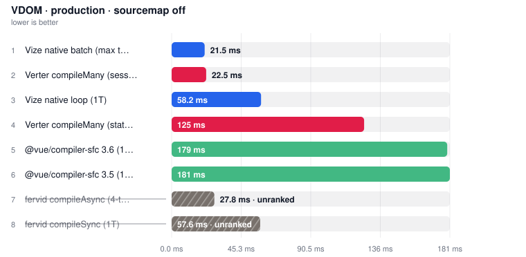

| Tool | **Median** | vs fastest |
| --- | ---: | ---: |
| [Vize native batch (max threads)](https://github.com/ubugeeei-prod/vize) | **22.8 ms** | 1.00x |
| [Verter compileMany (session cache)](https://github.com/pikax/verter) | **24.6 ms** | 1.08x |
| [Vize native loop (1T)](https://github.com/ubugeeei-prod/vize) | **55.9 ms** | 2.45x |
| [Verter compileMany (stateless)](https://github.com/pikax/verter) | **124.3 ms** | 5.45x |
| [@vue/compiler-sfc 3.5 (1T)](https://github.com/vuejs/core) | **177.9 ms** | 7.79x |
| [@vue/compiler-sfc 3.6 (1T)](https://github.com/vuejs/core) | **182.2 ms** | 7.98x |
| [fervid compileSync (1T)](https://github.com/phoenix-ru/fervid) ⚠ | (57.4 ms) | not ranked |
| [fervid compileAsync (4-thread libuv pool)](https://github.com/phoenix-ru/fervid) ⚠ | (26.2 ms) | not ranked |

#### VAPOR · production · sourcemap off

Target: `vapor` · Environment: `production` · Source map: `off`

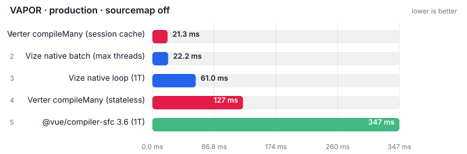

| Tool | **Median** | vs fastest |
| --- | ---: | ---: |
| [Verter compileMany (session cache)](https://github.com/pikax/verter) | **19.1 ms** | 1.00x |
| [Vize native batch (max threads)](https://github.com/ubugeeei-prod/vize) | **20.1 ms** | 1.05x |
| [Vize native loop (1T)](https://github.com/ubugeeei-prod/vize) | **57.2 ms** | 2.99x |
| [Verter compileMany (stateless)](https://github.com/pikax/verter) | **120.5 ms** | 6.30x |
| [@vue/compiler-sfc 3.6 (1T)](https://github.com/vuejs/core) | **300.3 ms** | 15.69x |
| [@vue/compiler-sfc 3.5 (vapor)](https://github.com/vuejs/core) ⏭ | skipped | – |
| [fervid (vapor)](https://github.com/phoenix-ru/fervid) ⏭ | skipped | – |

#### Peak RSS

> Isolated from timing. Full probe (min/max/avg, CPU): [MEMORY.md](MEMORY.md).

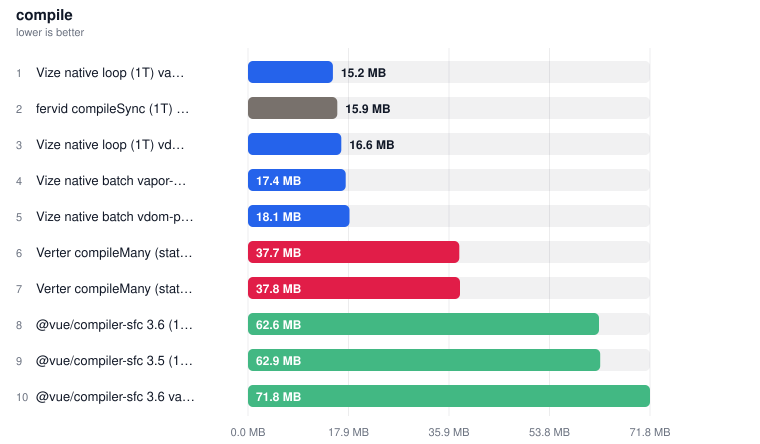

| Tool | **Peak RSS** |
| --- | ---: |
| [Vize native loop (1T) vapor-prod](https://github.com/ubugeeei-prod/vize) | 15.3 MB |
| [fervid compileSync (1T) vdom-prod](https://github.com/phoenix-ru/fervid) | 16.1 MB |
| [Vize native loop (1T) vdom-prod](https://github.com/ubugeeei-prod/vize) | 16.8 MB |
| [Vize native batch vapor-prod](https://github.com/ubugeeei-prod/vize) | 17.5 MB |
| [Vize native batch vdom-prod](https://github.com/ubugeeei-prod/vize) | 18.1 MB |
| [Verter compileMany (stateless) vdom-prod](https://github.com/pikax/verter) | 38.2 MB |
| [Verter compileMany (stateless) vapor-prod](https://github.com/pikax/verter) | 38.2 MB |
| [@vue/compiler-sfc 3.6 (1T) vdom-prod](https://github.com/vuejs/core) | 62.9 MB |
| [@vue/compiler-sfc 3.5 (1T) vdom-prod](https://github.com/vuejs/core) | 63.5 MB |
| [@vue/compiler-sfc 3.6 vapor (1T) vapor-prod](https://github.com/vuejs/core) | 71.5 MB |

### Typecheck

Files: **200** · Bytes: **285,701**

| Tool | Version |
| --- | --- |
| [vue-tsc](https://github.com/vuejs/language-tools) | [3.3.10](https://www.npmjs.com/package/vue-tsc/v/3.3.10) · 2026-08-15 |
| [typescript-native-bridge (TNB)](https://github.com/johnsoncodehk/typescript-native-bridge) | [6.0.3-bridge.13.tsgo.7.0.2](https://www.npmjs.com/package/typescript-native-bridge/v/6.0.3-bridge.13.tsgo.7.0.2) · 2026-08-13 |
| [vize](https://github.com/ubugeeei-prod/vize) | [0.347.7](https://www.npmjs.com/package/vize/v/0.347.7) · 2026-08-11 |
| [verter-tsc](https://github.com/pikax/verter) | [0.0.1-beta.3](https://www.npmjs.com/package/verter-tsc/v/0.0.1-beta.3) · 2026-07-27 |
| [@golar/vue](https://github.com/auvred/golar) | [0.1.10](https://www.npmjs.com/package/@golar/vue/v/0.1.10) · 2026-07-19 |
| [golar](https://github.com/auvred/golar) | [0.1.10](https://www.npmjs.com/package/golar/v/0.1.10) · 2026-07-19 |
| [typescript](https://github.com/microsoft/TypeScript) | [6.0.3](https://www.npmjs.com/package/typescript/v/6.0.3) · 2026-04-16 |

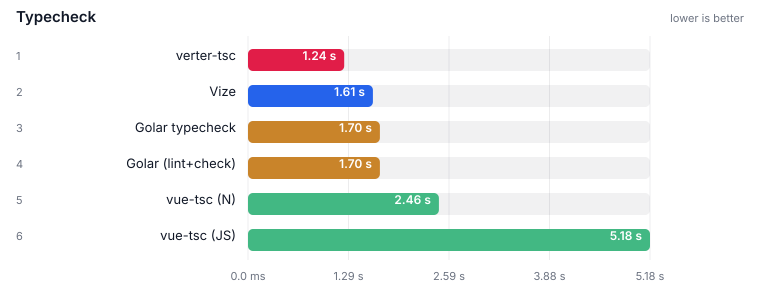

| Tool | **Median** | vs fastest |
| --- | ---: | ---: |
| [verter-tsc](https://github.com/pikax/verter) | **1.09 s** | 1.00x |
| [Golar (lint+check)](https://github.com/auvred/golar) | **1.57 s** | 1.43x |
| [Golar typecheck](https://github.com/auvred/golar) | **1.58 s** | 1.45x |
| [Vize](https://github.com/ubugeeei-prod/vize) | **1.64 s** | 1.50x |
| [vue-tsc (N)](https://github.com/johnsoncodehk/typescript-native-bridge) | **2.27 s** | 2.08x |
| [vue-tsc (JS)](https://github.com/vuejs/language-tools) | **4.85 s** | 4.44x |

#### Peak RSS

> Isolated from timing. Full probe (min/max/avg, CPU): [MEMORY.md](MEMORY.md).

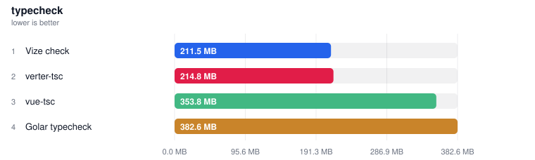

| Tool | **Peak RSS** |
| --- | ---: |
| [verter-tsc](https://github.com/pikax/verter) | 79.5 MB |
| [Vize check](https://github.com/ubugeeei-prod/vize) | 204.6 MB |
| [Golar typecheck](https://github.com/auvred/golar) | 373.7 MB |
| [vue-tsc](https://github.com/vuejs/language-tools) | 354.8 MB |

### Format

Files: **200** · Bytes: **285,701**

| Tool | Version |
| --- | --- |
| [@biomejs/biome](https://github.com/biomejs/biome) | [2.5.8](https://www.npmjs.com/package/@biomejs/biome/v/2.5.8) · 2026-08-11 |
| [vize](https://github.com/ubugeeei-prod/vize) | [0.347.7](https://www.npmjs.com/package/vize/v/0.347.7) · 2026-08-11 |
| [oxfmt](https://github.com/oxc-project/oxc) | [0.63.0](https://www.npmjs.com/package/oxfmt/v/0.63.0) · 2026-08-10 |
| [prettier](https://github.com/prettier/prettier) | [3.9.6](https://www.npmjs.com/package/prettier/v/3.9.6) · 2026-07-21 |

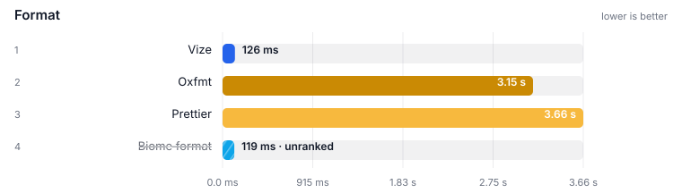

| Tool | **Median** | vs fastest |
| --- | ---: | ---: |
| [Vize](https://github.com/ubugeeei-prod/vize) | **125.9 ms** | 1.00x |
| [Oxfmt](https://github.com/oxc-project/oxc) | **3.15 s** | 25.05x |
| [Prettier](https://github.com/prettier/prettier) | **3.66 s** | 29.07x |
| [Biome format](https://github.com/biomejs/biome) ⚠ | (119.2 ms) | not ranked |

#### Peak RSS

> Isolated from timing. Full probe (min/max/avg, CPU): [MEMORY.md](MEMORY.md).

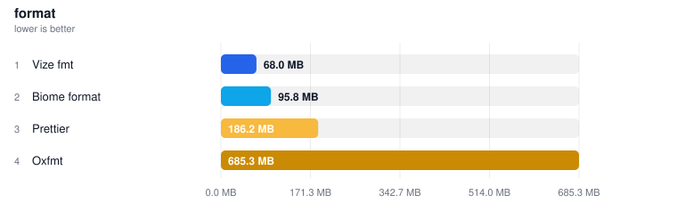

| Tool | **Peak RSS** |
| --- | ---: |
| [Vize fmt](https://github.com/ubugeeei-prod/vize) | 67.8 MB |
| [Biome format](https://github.com/biomejs/biome) | 95.1 MB |
| [Prettier](https://github.com/prettier/prettier) | 188.8 MB |
| [Oxfmt](https://github.com/oxc-project/oxc) | 697.3 MB |

### Lint

Files: **200** · Bytes: **285,701**

| Tool | Version |
| --- | --- |
| [@biomejs/biome](https://github.com/biomejs/biome) | [2.5.8](https://www.npmjs.com/package/@biomejs/biome/v/2.5.8) · 2026-08-11 |
| [vize](https://github.com/ubugeeei-prod/vize) | [0.347.7](https://www.npmjs.com/package/vize/v/0.347.7) · 2026-08-11 |
| [oxlint](https://github.com/oxc-project/oxc) | [1.78.0](https://www.npmjs.com/package/oxlint/v/1.78.0) · 2026-08-10 |
| [@verter/native](https://github.com/pikax/verter) | [0.0.1-beta.3](https://www.npmjs.com/package/@verter/native/v/0.0.1-beta.3) · 2026-07-27 |
| [eslint-plugin-vue](https://github.com/vuejs/eslint-plugin-vue) | [10.10.0](https://www.npmjs.com/package/eslint-plugin-vue/v/10.10.0) · 2026-07-20 |

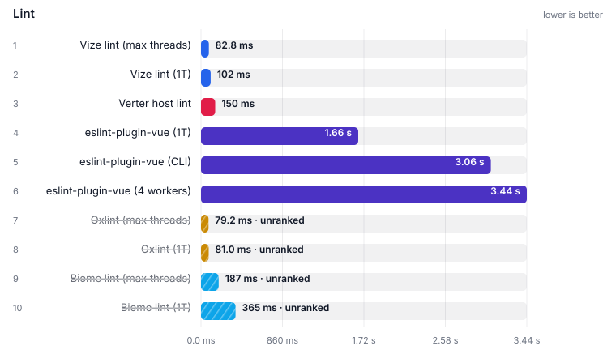

| Tool | **Median** | vs fastest |
| --- | ---: | ---: |
| [Vize lint (max threads)](https://github.com/ubugeeei-prod/vize) | **82.8 ms** | 1.00x |
| [Vize lint (1T)](https://github.com/ubugeeei-prod/vize) | **101.8 ms** | 1.23x |
| [Verter host lint](https://github.com/pikax/verter) | **149.7 ms** | 1.81x |
| [eslint-plugin-vue (1T)](https://github.com/vuejs/eslint-plugin-vue) | **1.66 s** | 20.10x |
| [eslint-plugin-vue (CLI)](https://github.com/vuejs/eslint-plugin-vue) | **3.06 s** | 37.03x |
| [eslint-plugin-vue (4 workers)](https://github.com/vuejs/eslint-plugin-vue) | **3.44 s** | 41.62x |
| [Biome lint (1T)](https://github.com/biomejs/biome) ⚠ | (364.9 ms) | not ranked |
| [Biome lint (max threads)](https://github.com/biomejs/biome) ⚠ | (186.9 ms) | not ranked |
| [Oxlint (1T)](https://github.com/oxc-project/oxc) ⚠ | (81.0 ms) | not ranked |
| [Oxlint (max threads)](https://github.com/oxc-project/oxc) ⚠ | (79.2 ms) | not ranked |

#### Peak RSS

> Isolated from timing. Full probe (min/max/avg, CPU): [MEMORY.md](MEMORY.md).

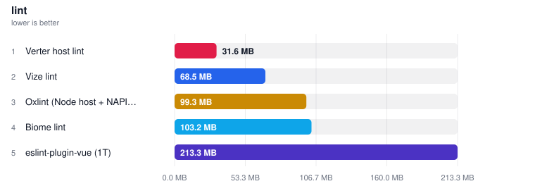

| Tool | **Peak RSS** |
| --- | ---: |
| [Verter host lint](https://github.com/pikax/verter) | 31.6 MB |
| [Vize lint](https://github.com/ubugeeei-prod/vize) | 68.1 MB |
| [Oxlint (Node host + NAPI addon)](https://github.com/oxc-project/oxc) | 100.4 MB |
| [Biome lint](https://github.com/biomejs/biome) | 102.8 MB |
| [eslint-plugin-vue (1T)](https://github.com/vuejs/eslint-plugin-vue) | 213.7 MB |

### Component-meta

Files: **100** · Bytes: **142,771**

| Tool | Version |
| --- | --- |
| [vue-component-meta](https://github.com/vuejs/language-tools) | [3.3.10](https://www.npmjs.com/package/vue-component-meta/v/3.3.10) · 2026-08-15 |
| [vize](https://github.com/ubugeeei-prod/vize) | [0.347.7](https://www.npmjs.com/package/vize/v/0.347.7) · 2026-08-11 |
| [@verter/component-meta](https://github.com/pikax/verter) | [0.0.1-beta.3](https://www.npmjs.com/package/@verter/component-meta/v/0.0.1-beta.3) · 2026-07-27 |

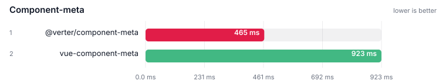

| Tool | **Median** | vs fastest |
| --- | ---: | ---: |
| [@verter/component-meta](https://github.com/pikax/verter) | **464.5 ms** | 1.00x |
| [vue-component-meta](https://github.com/vuejs/language-tools) | **922.9 ms** | 1.99x |
| [Vize component-meta](https://github.com/ubugeeei-prod/vize) ⏭ | skipped | – |

#### Peak RSS

> Isolated from timing. Full probe (min/max/avg, CPU): [MEMORY.md](MEMORY.md).

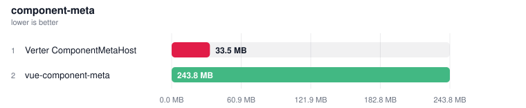

| Tool | **Peak RSS** |
| --- | ---: |
| [Verter ComponentMetaHost](https://github.com/pikax/verter) | 33.5 MB |
| [vue-component-meta](https://github.com/vuejs/language-tools) | 248.3 MB |

### LSP (editor language server)

Files: **1** · Bytes: **745**

| Tool | Version |
| --- | --- |
| [@vue/language-server](https://github.com/vuejs/language-tools) | [3.3.10](https://www.npmjs.com/package/@vue/language-server/v/3.3.10) · 2026-08-15 |
| [@vue/typescript-plugin](https://github.com/vuejs/language-tools) | [3.3.10](https://www.npmjs.com/package/@vue/typescript-plugin/v/3.3.10) · 2026-08-15 |
| [typescript-native-bridge (TNB)](https://github.com/johnsoncodehk/typescript-native-bridge) | [6.0.3-bridge.13.tsgo.7.0.2](https://www.npmjs.com/package/typescript-native-bridge/v/6.0.3-bridge.13.tsgo.7.0.2) · 2026-08-13 |
| [vize](https://github.com/ubugeeei-prod/vize) | [0.347.7](https://www.npmjs.com/package/vize/v/0.347.7) · 2026-08-11 |
| [verter-lsp](https://github.com/pikax/verter) | [0.0.1-beta.3](https://www.npmjs.com/package/verter-lsp/v/0.0.1-beta.3) · 2026-07-27 |
| [typescript-language-server](https://github.com/typescript-language-server/typescript-language-server) | [5.3.0](https://www.npmjs.com/package/typescript-language-server/v/5.3.0) · 2026-05-21 |

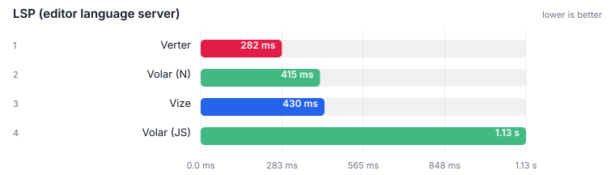

| Tool | **Median** | vs fastest |
| --- | ---: | ---: |
| [Verter](https://github.com/pikax/verter) | **281.9 ms** | 1.00x |
| [Volar (N)](https://github.com/johnsoncodehk/typescript-native-bridge) | **414.5 ms** | 1.47x |
| [Vize](https://github.com/ubugeeei-prod/vize) | **430.0 ms** | 1.53x |
| [Volar (JS)](https://github.com/vuejs/language-tools) | **1.13 s** | 4.00x |

#### Peak RSS

> Isolated from timing. Full probe (min/max/avg, CPU): [MEMORY.md](MEMORY.md).

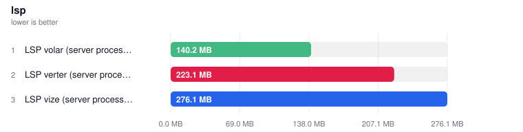

| Tool | **Peak RSS** |
| --- | ---: |
| [LSP verter (server process, npm 0.0.1-beta.3)](https://github.com/pikax/verter) | 32.3 MB |
| [LSP vize (server process, Node shim)](https://github.com/ubugeeei-prod/vize) | 73.6 MB |
| [LSP volar (server process)](https://github.com/vuejs/language-tools) | 140.7 MB |


<!-- BENCHMARK_RESULTS_END -->

<!-- TYPECHECK_CONFIRM_START -->

## Typecheck confirmation

> 📄 **[Full matrix →](docs/typecheck.md)** — plants, documented gaps, per-plant time/memory. **142** plants. Generated 2026-08-19T12:36:13.372Z.

### All plants (one tsconfig)

One spawn per tool over every plant. Pass rate is a **percentage** of scored plants.

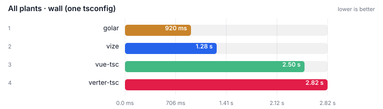

| Tool | **Wall** | vs fastest |
| --- | ---: | ---: |
| golar | **814 ms** | 1.00x |
| vize | **1.20 s** | 1.48x |
| vue-tsc | **2.02 s** | 2.48x |
| verter-tsc | **2.69 s** | 3.30x |

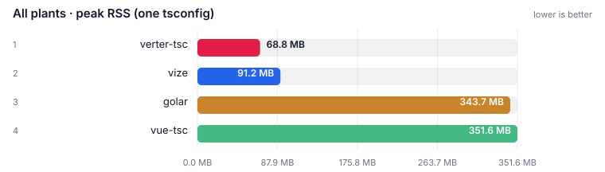

| Tool | **Peak RSS** |
| --- | ---: |
| verter-tsc | **68.8 MB** |
| vize | **91.2 MB** |
| golar | **343.7 MB** |
| vue-tsc | **351.6 MB** |

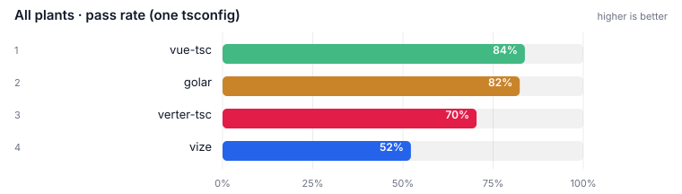

| Tool | **Pass rate** | pass / scored | skipped |
| --- | ---: | ---: | ---: |
| vue-tsc | **84%** | 119 / 142 | 0 |
| golar | **82%** | 117 / 142 | 0 |
| verter-tsc | **76%** | 108 / 142 | 0 |
| vize | **52%** | 71 / 136 | 6 |

**vize** scored 136 of 142 (6 skipped). Skips are capability gaps, not fails — Vize does not claim `strict-component-attrs` (undeclared component attrs under `strictTemplates`).

<!-- TYPECHECK_CONFIRM_END -->


## IDE operation results

Per-operation editor benchmarks from the `ide` job (`scripts/ide-bench.mjs`). Ranked **per operation**, never pooled — `didOpen→diagnostics` and `foldingRange` differ by orders of magnitude and answer unrelated questions. Not comparable to the timing tables above: different job, different load profile.

Servers here are Volar, **Volar on the TNB/tsgo tsdk**, Vize and Verter. Three caveats apply to these tables specifically:

- **`Volar (TNB / tsgo tsdk)` errors resolving an auto-import completion** — `Debug Failure. False expression. at getCompletionEntryCodeActionsAndSourceDisplay`. Stock Volar resolves the same item. [Details](docs/methodology.md#caveat-the-tnb-engine-swap-fails-an-ide-completion-resolve-operation).
- **Vize may answer with its tsgo backend absent**, with no error in the LSP traffic. [Details](docs/methodology.md#caveat-vizes-type-checking-backend-sometimes-never-starts-and-the-row-still-answers).
- **Both Volar rows are two processes**, charged the slower half on every operation; Vize and Verter are one. [Details](docs/methodology.md#caveat-volars-lsp-memory-row-is-not-the-whole-of-volar-but-the-lsp-timing-row-is).

<!-- IDE_RESULTS_START -->

> Auto-updated 2026-08-19 from the **Benchmark** workflow (`ide` job — per-operation editor benchmarks).
> Ranked **per operation**, never pooled: `didOpen→diagnostics` and `foldingRange` answer unrelated questions.
> Same-VM rule holds within the job; these numbers are not comparable to the timing tables above.
> **⚠ unranked** is a noise or work gate, not “the official tool is unofficial”. A series with CV > 50% is too noisy to rank.
> Each stacked bar is **warm** (solid, cached request) then **cold** (pale remainder = first-request extra). Ranking uses **Cold**; vs-fastest-cold sits next to it.

> IDE scale: [full report](docs/results/ide-scale-Linux.md).
> 📄 **[Full details →](docs/results/ide-win32.md)** — methodology, per-row notes and raw runs (69 collapsed block(s) moved out of this page).

<!-- notes: notes-ide.md -->

> 📖 **[How to read these tables →](docs/results/notes-ide.md)** — ranking rules, standing notes and the tools legend shared by every block in this section.

#### Windows · ide ops

<!-- source: ide-win32.md -->

### IDE · initialize

| Tool | Version |
| --- | --- |
| [@vue/language-server](https://github.com/vuejs/language-tools) | [3.3.10](https://www.npmjs.com/package/@vue/language-server/v/3.3.10) · 2026-08-15 |
| [@vue/typescript-plugin](https://github.com/vuejs/language-tools) | [3.3.10](https://www.npmjs.com/package/@vue/typescript-plugin/v/3.3.10) · 2026-08-15 |
| [typescript-native-bridge (TNB)](https://github.com/johnsoncodehk/typescript-native-bridge) | [6.0.3-bridge.13.tsgo.7.0.2](https://www.npmjs.com/package/typescript-native-bridge/v/6.0.3-bridge.13.tsgo.7.0.2) · 2026-08-13 |
| [vize](https://github.com/ubugeeei-prod/vize) | [0.347.7](https://www.npmjs.com/package/vize/v/0.347.7) · 2026-08-11 |
| [verter-lsp](https://github.com/pikax/verter) | [0.0.1-beta.3](https://www.npmjs.com/package/verter-lsp/v/0.0.1-beta.3) · 2026-07-27 |
| [typescript-language-server](https://github.com/typescript-language-server/typescript-language-server) | [5.3.0](https://www.npmjs.com/package/typescript-language-server/v/5.3.0) · 2026-05-21 |

#### LSP initialize

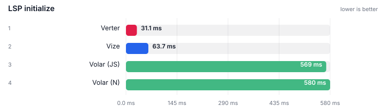

| Tool | **Median** | vs fastest |
| --- | ---: | ---: |
| [Verter](https://github.com/pikax/verter) | **31.1 ms** | 1.00x |
| [Vize](https://github.com/ubugeeei-prod/vize) | **63.7 ms** | 2.05x |
| [Volar (JS)](https://github.com/vuejs/language-tools) | **569.3 ms** | 18.29x |
| [Volar (N)](https://github.com/johnsoncodehk/typescript-native-bridge) | **580.4 ms** | 18.64x |

### IDE · completion

#### Completion: script member

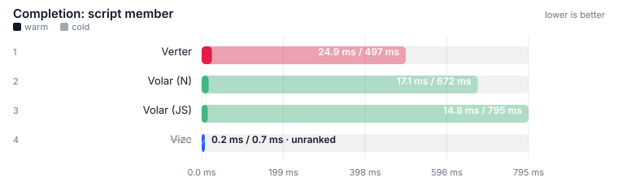

| Tool | **Cold** | vs fastest cold | **Warm** |
| --- | ---: | ---: | ---: |
| [Verter](https://github.com/pikax/verter) | **496.7 ms** | 1.00x | **24.9 ms** |
| [Volar (N)](https://github.com/johnsoncodehk/typescript-native-bridge) | **671.6 ms** | 1.35x | **17.1 ms** |
| [Volar (JS)](https://github.com/vuejs/language-tools) | **795.1 ms** | 1.60x | **14.8 ms** |
| [Vize](https://github.com/ubugeeei-prod/vize) ⚠ | (0.7 ms) | not ranked | (0.2 ms) |

### IDE · template interpolation

#### Hover (template interpolation)

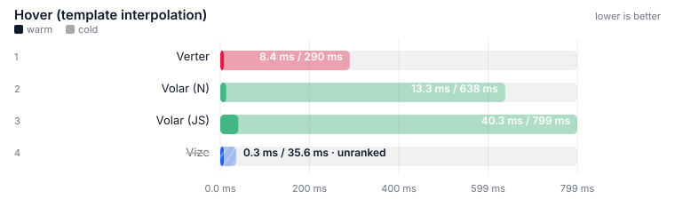

| Tool | **Cold** | vs fastest cold | **Warm** |
| --- | ---: | ---: | ---: |
| [Verter](https://github.com/pikax/verter) | **289.9 ms** | 1.00x | **8.4 ms** |
| [Volar (N)](https://github.com/johnsoncodehk/typescript-native-bridge) | **638.0 ms** | 2.20x | **13.3 ms** |
| [Volar (JS)](https://github.com/vuejs/language-tools) | **799.2 ms** | 2.76x | **40.3 ms** |
| [Vize](https://github.com/ubugeeei-prod/vize) ⚠ | (35.6 ms) | not ranked | (0.3 ms) |

### IDE · smoke

#### Hover (script setup)

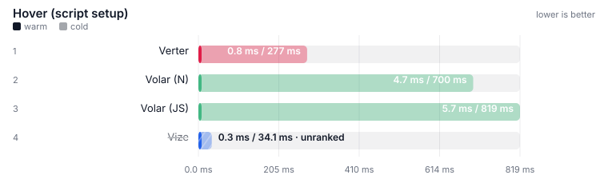

| Tool | **Cold** | vs fastest cold | **Warm** |
| --- | ---: | ---: | ---: |
| [Verter](https://github.com/pikax/verter) | **276.9 ms** | 1.00x | **0.8 ms** |
| [Volar (N)](https://github.com/johnsoncodehk/typescript-native-bridge) | **700.1 ms** | 2.53x | **4.7 ms** |
| [Volar (JS)](https://github.com/vuejs/language-tools) | **819.3 ms** | 2.96x | **5.7 ms** |
| [Vize](https://github.com/ubugeeei-prod/vize) ⚠ | (34.1 ms) | not ranked | (0.3 ms) |

### IDE · navigation

#### Definition: imported fn (script)

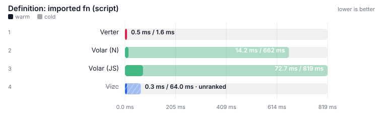

| Tool | **Cold** | vs fastest cold | **Warm** |
| --- | ---: | ---: | ---: |
| [Verter](https://github.com/pikax/verter) | **1.6 ms** | 1.00x | **0.5 ms** |
| [Volar (N)](https://github.com/johnsoncodehk/typescript-native-bridge) | **662.4 ms** | 412.48x | **14.2 ms** |
| [Volar (JS)](https://github.com/vuejs/language-tools) | **818.5 ms** | 509.65x | **72.7 ms** |
| [Vize](https://github.com/ubugeeei-prod/vize) ⚠ | (64.0 ms) | not ranked | (0.3 ms) |

### IDE · edit-loop

#### Edit plants type error -> reported

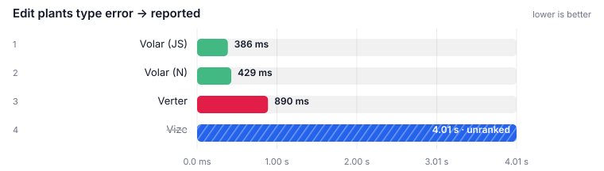

| Tool | **Median** | vs fastest |
| --- | ---: | ---: |
| [Volar (JS)](https://github.com/vuejs/language-tools) | **386.0 ms** | 1.00x |
| [Volar (N)](https://github.com/johnsoncodehk/typescript-native-bridge) | **429.2 ms** | 1.11x |
| [Verter](https://github.com/pikax/verter) | **890.2 ms** | 2.31x |
| [Vize](https://github.com/ubugeeei-prod/vize) ⚠ | (4.01 s) | not ranked |


<!-- IDE_RESULTS_END -->

## Real-world project results

Pinned third-party Vue checkouts, **one job per project**. Ranked within a corpus, never across — Naive UI's demo SFCs are not PrimeVue's published components. Full compile / bundle / HMR / lint tables: each project's report. The generated `fixtures/N` corpus remains the primary ranking corpus.

<!-- REAL_WORLD_RESULTS_START -->

> Auto-updated 2026-08-19 from the **Benchmark (real-world)** workflow — one job per project, every surface and every tool inside it.
> Corpora are pinned checkouts of third-party open-source Vue projects. Sources are unmodified; every table names its ref and resolved commit SHA.
> **Rank within a corpus, never across it.** The corpora differ in size and in kind — library source, application source, and documentation demos are not the same code.
> The generated `fixtures/N` corpus remains the primary ranking corpus; these tables exist to catch what a designed corpus cannot.
> Landing view is the project's **own** typecheck / test / build (plugin swaps included). Harness SFC compile of extracted files stays in the full report. Unranked tools are listed under the table with the gate that dropped them.
> **⚠ unranked** is a gate, not a ranking of the official toolchain. A project that ships **no lockfile** at the pinned ref (Naive UI, Ant Design Vue) cannot be installed frozen, so every typecheck / test / build / lsp row on that corpus is unranked equally — including vue-tsc.


<!-- notes: notes-real-world.md -->

> 📖 **[How to read these tables →](docs/results/notes-real-world.md)** — ranking rules, standing notes and the tools legend shared by every block in this section.

# element-plus

<!-- source: real-world-Linux-element-plus.md -->

> 📄 **[Full details →](docs/results/real-world-Linux-element-plus.md)** — methodology, per-row notes and raw runs (41 collapsed block(s) moved out of this page).

## Project test suite — element-plus:components

Files: **162** · Bytes: **765,295**

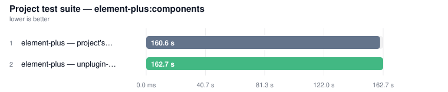

| Tool | **Median** | vs fastest |
| --- | ---: | ---: |
| element-plus — project's own toolchain (baseline) | **142.00 s** | 1.00x |
| element-plus — unplugin-vue | **142.83 s** | 1.01x |

**Not ranked**

- **[element-plus — @vizejs/vite-plugin](https://github.com/ubugeeei-prod/vize)**: FAILED TEST-COUNT GATE — passed 2047 tests where the project's own toolchain passed 2533; failed 434 test(s) where the project's own toolchain failed 0 — a failing test is not a faster test.
- **[element-plus — @verter/unplugin](https://github.com/pikax/verter)**: FAILED TEST-COUNT GATE — passed 527 tests where the project's own toolchain passed 2533; failed 30 test(s) where the project's own toolchain failed 0 — a failing test is not a faster test.


# hoppscotch

<!-- source: real-world-Linux-hoppscotch.md -->

> 📄 **[Full details →](docs/results/real-world-Linux-hoppscotch.md)** — methodology, per-row notes and raw runs (46 collapsed block(s) moved out of this page).

## Project test suite — hoppscotch:common

Files: **293** · Bytes: **1,978,501**

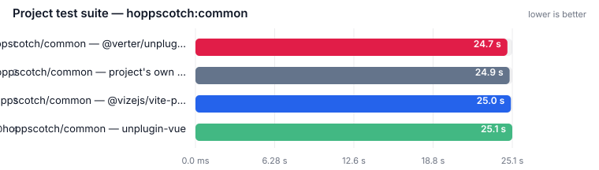

| Tool | **Median** | vs fastest |
| --- | ---: | ---: |
| [@hoppscotch/common — @verter/unplugin](https://github.com/pikax/verter) | **24.71 s** | 1.00x |
| @hoppscotch/common — project's own toolchain (baseline) | **24.89 s** | 1.01x |
| [@hoppscotch/common — @vizejs/vite-plugin](https://github.com/ubugeeei-prod/vize) | **24.99 s** | 1.01x |
| @hoppscotch/common — unplugin-vue | **25.10 s** | 1.02x |

## Project build (own config) — hoppscotch:common

Files: **293** · Bytes: **1,978,501**

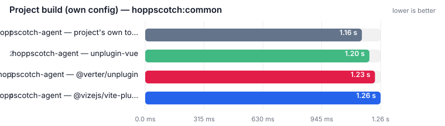

| Tool | **Median** | vs fastest |
| --- | ---: | ---: |
| [hoppscotch-agent — @vizejs/vite-plugin](https://github.com/ubugeeei-prod/vize) | **1.68 s** | 1.00x |
| hoppscotch-agent — unplugin-vue | **1.70 s** | 1.01x |
| hoppscotch-agent — project's own toolchain (baseline) | **1.73 s** | 1.03x |
| [hoppscotch-agent — @verter/unplugin](https://github.com/pikax/verter) | **1.82 s** | 1.08x |

## Project typecheck (own tsconfig) — hoppscotch:common

Files: **293** · Bytes: **1,978,501**

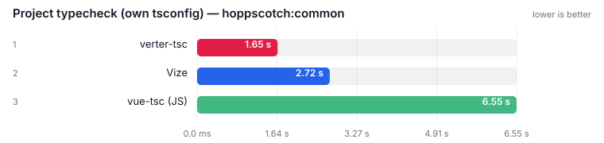

| Tool | **Median** | vs fastest |
| --- | ---: | ---: |
| [verter-tsc](https://github.com/pikax/verter) | **1.65 s** | 1.00x |
| [Vize](https://github.com/ubugeeei-prod/vize) | **2.72 s** | 1.65x |
| [vue-tsc (JS)](https://github.com/vuejs/language-tools) | **6.55 s** | 3.97x |

**Not ranked**

- **[vue-tsc (N)](https://github.com/johnsoncodehk/typescript-native-bridge)**: FAILED PROGRAM-CONSTRUCTION GATE — at least one measured run exited 2 reporting 1 diagnostic(s) across 1 file(s).
- **[Golar typecheck](https://github.com/auvred/golar)**: skipped


# naive-ui

<!-- source: real-world-Linux-naive-ui.md -->

> 📄 **[Full details →](docs/results/real-world-Linux-naive-ui.md)** — methodology, per-row notes and raw runs (45 collapsed block(s) moved out of this page).

## Project test suite — naive-ui:demos

Files: **1,682** · Bytes: **1,751,750**

**Not ranked** — NO LOCKFILE: naive-ui ships no lockfile at the pinned ref, so its install cannot be frozen and the dependency set is whatever resolved when fetch ran.

## Project typecheck (own tsconfig) — naive-ui:demos

Files: **1,682** · Bytes: **1,751,750**

**Not ranked**

- **[vue-tsc (JS)](https://github.com/vuejs/language-tools)**: UNRANKED — NO LOCKFILE: naive-ui ships no lockfile at the pinned ref, so its install cannot be frozen and the dependency set is whatever resolved when fetch ran.
- **[vue-tsc (N)](https://github.com/johnsoncodehk/typescript-native-bridge)**: UNRANKED — NO LOCKFILE: naive-ui ships no lockfile at the pinned ref, so its install cannot be frozen and the dependency set is whatever resolved when fetch ran.
- **[verter-tsc](https://github.com/pikax/verter)**: UNRANKED — NO LOCKFILE: naive-ui ships no lockfile at the pinned ref, so its install cannot be frozen and the dependency set is whatever resolved when fetch ran.
- **[Vize](https://github.com/ubugeeei-prod/vize)**: UNRANKED — NO LOCKFILE: naive-ui ships no lockfile at the pinned ref, so its install cannot be frozen and the dependency set is whatever resolved when fetch ran.
- **[Golar typecheck](https://github.com/auvred/golar)**: skipped


# nuxt-ui

<!-- source: real-world-Linux-nuxt-ui.md -->

> 📄 **[Full details →](docs/results/real-world-Linux-nuxt-ui.md)** — methodology, per-row notes and raw runs (45 collapsed block(s) moved out of this page).

## Project test suite — nuxt-ui:runtime

Files: **187** · Bytes: **1,014,900**

**Not ranked**

- **@nuxt/ui — project's own toolchain (baseline)**: errored
- **@nuxt/ui — unplugin-vue**: errored
- **[@nuxt/ui — @vizejs/vite-plugin](https://github.com/ubugeeei-prod/vize)**: errored
- **[@nuxt/ui — @verter/unplugin](https://github.com/pikax/verter)**: errored

## Project typecheck (own tsconfig) — nuxt-ui:runtime

Files: **187** · Bytes: **1,014,900**

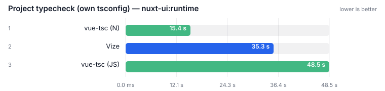

| Tool | **Median** | vs fastest |
| --- | ---: | ---: |
| [vue-tsc (N)](https://github.com/johnsoncodehk/typescript-native-bridge) | **15.45 s** | 1.00x |
| [Vize](https://github.com/ubugeeei-prod/vize) | **35.28 s** | 2.28x |
| [vue-tsc (JS)](https://github.com/vuejs/language-tools) | **48.55 s** | 3.14x |

**Not ranked**

- **[verter-tsc](https://github.com/pikax/verter)**: FAILED PROGRAM-CONSTRUCTION GATE — at least one measured run exited 2 reporting 0 diagnostic(s) across 0 file(s).
- **[Golar typecheck](https://github.com/auvred/golar)**: skipped


# primevue

<!-- source: real-world-Linux-primevue.md -->

> 📄 **[Full details →](docs/results/real-world-Linux-primevue.md)** — methodology, per-row notes and raw runs (45 collapsed block(s) moved out of this page).

## Project test suite — primevue:components

Files: **279** · Bytes: **1,721,906**

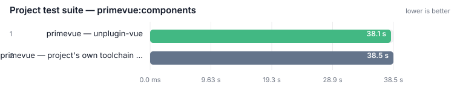

| Tool | **Median** | vs fastest |
| --- | ---: | ---: |
| primevue — unplugin-vue | **38.13 s** | 1.00x |
| primevue — project's own toolchain (baseline) | **38.51 s** | 1.01x |

**Not ranked**

- **[primevue — @vizejs/vite-plugin](https://github.com/ubugeeei-prod/vize)**: FAILED TEST-COUNT GATE — passed 6 tests where the project's own toolchain passed 403. Measured but UNRANKED: a suite that passes fewer tests finishes sooner, and that is not a speed result.
- **[primevue — @verter/unplugin](https://github.com/pikax/verter)**: FAILED TEST-COUNT GATE — passed 252 tests where the project's own toolchain passed 403; failed 23 test(s) where the project's own toolchain failed 5 — a failing test is not a faster test.

## Project typecheck (own tsconfig) — primevue:components

Files: **279** · Bytes: **1,721,906**

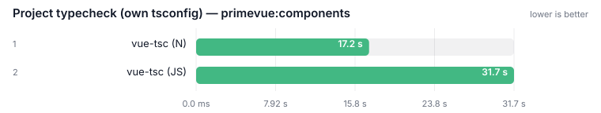

| Tool | **Median** | vs fastest |
| --- | ---: | ---: |
| [vue-tsc (N)](https://github.com/johnsoncodehk/typescript-native-bridge) | **17.24 s** | 1.00x |
| [vue-tsc (JS)](https://github.com/vuejs/language-tools) | **31.69 s** | 1.84x |

**Not ranked**

- **[verter-tsc](https://github.com/pikax/verter)**: FAILED PROGRAM-CONSTRUCTION GATE — at least one measured run exited 2 reporting 0 diagnostic(s) across 0 file(s).
- **[Vize](https://github.com/ubugeeei-prod/vize)**: FAILED DIAGNOSTIC-CENSUS GATE — reported 0 diagnostics against the baseline's 1683 (under half).
- **[Golar typecheck](https://github.com/auvred/golar)**: skipped


# quasar

<!-- source: real-world-Linux-quasar.md -->

> 📄 **[Full details →](docs/results/real-world-Linux-quasar.md)** — methodology, per-row notes and raw runs (41 collapsed block(s) moved out of this page).

## Project test suite — quasar:playground

Files: **252** · Bytes: **1,565,611**

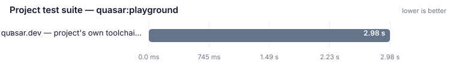

| Tool | **Median** | vs fastest |
| --- | ---: | ---: |
| quasar.dev — project's own toolchain (baseline) | **2.98 s** | 1.00x |

**Not ranked**

- **quasar.dev — unplugin-vue**: a generated config that imports the project's real config and replaces only the Vue plugin · extends vitest.config.
- **[quasar.dev — @vizejs/vite-plugin](https://github.com/ubugeeei-prod/vize)**: a generated config that imports the project's real config and replaces only the Vue plugin · extends vitest.config.
- **[quasar.dev — @verter/unplugin](https://github.com/pikax/verter)**: a generated config that imports the project's real config and replaces only the Vue plugin · extends vitest.config.

## Project typecheck (own tsconfig) — quasar:playground

Files: **252** · Bytes: **1,565,611**

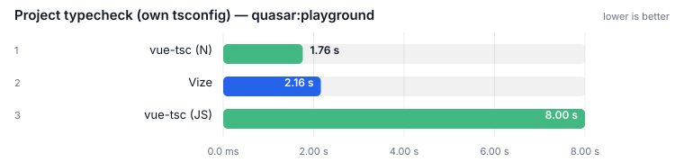

| Tool | **Median** | vs fastest |
| --- | ---: | ---: |
| [vue-tsc (N)](https://github.com/johnsoncodehk/typescript-native-bridge) | **1.76 s** | 1.00x |
| [Vize](https://github.com/ubugeeei-prod/vize) | **2.16 s** | 1.23x |
| [vue-tsc (JS)](https://github.com/vuejs/language-tools) | **8.00 s** | 4.55x |

**Not ranked**

- **[verter-tsc](https://github.com/pikax/verter)**: FAILED DIAGNOSTIC-CENSUS GATE — the baseline reported 0 diagnostics and exited 0, so a checker that agrees must also exit 0; this row exited 1 while reporting 11 diagnostic(s) against a clean reference — a non-zero exit …
- **[Golar typecheck](https://github.com/auvred/golar)**: skipped


# vue-vben-admin

<!-- source: real-world-Linux-vue-vben-admin.md -->

> 📄 **[Full details →](docs/results/real-world-Linux-vue-vben-admin.md)** — methodology, per-row notes and raw runs (41 collapsed block(s) moved out of this page).

## Project test suite — vue-vben-admin:core-ui

Files: **330** · Bytes: **933,224**

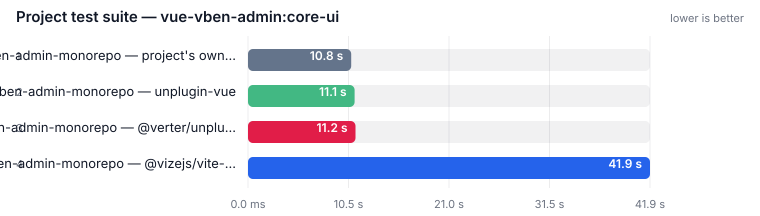

| Tool | **Median** | vs fastest |
| --- | ---: | ---: |
| vben-admin-monorepo — project's own toolchain (baseline) | **6.54 s** | 1.00x |
| vben-admin-monorepo — unplugin-vue | **6.57 s** | 1.00x |
| [vben-admin-monorepo — @verter/unplugin](https://github.com/pikax/verter) | **6.76 s** | 1.03x |
| [vben-admin-monorepo — @vizejs/vite-plugin](https://github.com/ubugeeei-prod/vize) | **28.37 s** | 4.34x |

## Project typecheck (own tsconfig) — vue-vben-admin:core-ui

Files: **330** · Bytes: **933,224**

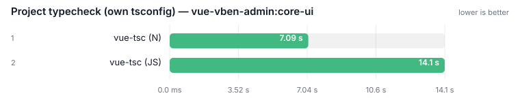

| Tool | **Median** | vs fastest |
| --- | ---: | ---: |
| [vue-tsc (N)](https://github.com/johnsoncodehk/typescript-native-bridge) | **7.09 s** | 1.00x |
| [vue-tsc (JS)](https://github.com/vuejs/language-tools) | **14.07 s** | 1.98x |

**Not ranked**

- **[verter-tsc](https://github.com/pikax/verter)**: FAILED DIAGNOSTIC-CENSUS GATE — the baseline reported 0 diagnostics and exited 0, so a checker that agrees must also exit 0; this row exited 1 while reporting 156 diagnostic(s) against a clean reference — a non-zero exit…
- **[Vize](https://github.com/ubugeeei-prod/vize)**: FAILED DIAGNOSTIC-CENSUS GATE — the baseline reported 0 diagnostics and exited 0, so a checker that agrees must also exit 0; this row exited 1 while reporting 20 diagnostic(s) against a clean reference — a non-zero exit …
- **[Golar typecheck](https://github.com/auvred/golar)**: skipped


# vuetify

<!-- source: real-world-Linux-vuetify.md -->

> 📄 **[Full details →](docs/results/real-world-Linux-vuetify.md)** — methodology, per-row notes and raw runs (45 collapsed block(s) moved out of this page).

## Project test suite — vuetify:docs

Files: **1,246** · Bytes: **2,032,022**

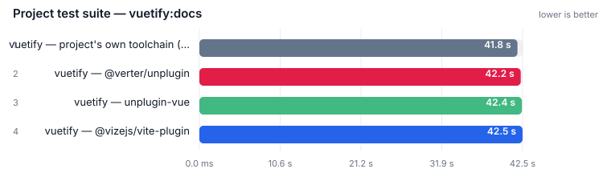

| Tool | **Median** | vs fastest |
| --- | ---: | ---: |
| vuetify — project's own toolchain (baseline) | **41.81 s** | 1.00x |
| [vuetify — @verter/unplugin](https://github.com/pikax/verter) | **42.24 s** | 1.01x |
| vuetify — unplugin-vue | **42.38 s** | 1.01x |
| [vuetify — @vizejs/vite-plugin](https://github.com/ubugeeei-prod/vize) | **42.48 s** | 1.02x |

## Project typecheck (own tsconfig) — vuetify:docs

Files: **1,246** · Bytes: **2,032,022**

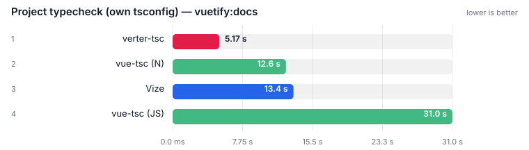

| Tool | **Median** | vs fastest |
| --- | ---: | ---: |
| [verter-tsc](https://github.com/pikax/verter) | **5.17 s** | 1.00x |
| [vue-tsc (N)](https://github.com/johnsoncodehk/typescript-native-bridge) | **12.56 s** | 2.43x |
| [Vize](https://github.com/ubugeeei-prod/vize) | **13.39 s** | 2.59x |
| [vue-tsc (JS)](https://github.com/vuejs/language-tools) | **31.01 s** | 6.00x |

**Not ranked**

- **[Golar typecheck](https://github.com/auvred/golar)**: skipped


<!-- REAL_WORLD_RESULTS_END -->

## Memory

<!-- MEMORY_SUMMARY_START -->

> Auto-updated 2026-08-19 from the **Benchmark** workflow (`memory` job). Peak RSS; isolated from timing.
> Peak RSS for compile / typecheck / format / lint / component-meta / LSP sits next to those timing tables. Full probe (every surface, min/max/avg, CPU): [MEMORY.md](MEMORY.md) · source `memory-linux-100.md`.

<!-- MEMORY_SUMMARY_END -->

## Contributing

See [CONTRIBUTING.md](./CONTRIBUTING.md). Security reports: [SECURITY.md](./SECURITY.md).

## License

[MIT](./LICENSE)
