# Vue Toolchain Benchmarks

Reference-anchored performance and compatibility testing for Vue compilers,
typecheckers, formatters, linters, language servers and bundlers. Measured on one
Linux CI runner per dispatch and committed back here.

This project has two equally important outputs:

1. **Apples-to-apples performance comparisons.** A candidate is timed against
   the official or established reference for the same work. For SFC compilation,
   that reference is Vue's official compiler. Different targets, artifacts,
   threading modes and cache states are disclosed; materially different work is
   separated or left unranked.
2. **Actionable tooling-gap findings.** Executable gates and confirmation cases
   expose missing transforms, invalid output, skipped files, incomplete source
   maps, semantic differences and integration failures. The timing stays visible
   when useful, but incomplete work cannot become a performance win. Upgrade
   audits re-run these checks so a fixed limitation clears automatically.

The goal is not a leaderboard between Vize and Verter. It is to give maintainers
of new Vue tooling reproducible evidence about both performance and compatibility,
with Vue and the relevant established toolchain as the reference point.

This page is the **landing view**: a bar chart and compact ranking (median · vs reference, or vs fastest where no reference is declared) for the surfaces people actually compare. Compile is explicitly anchored to Vue. Every chart links a full report — all tables, notes, raw runs, tool versions, runner — in [`docs/results/`](docs/results/). Memory lives in [MEMORY.md](MEMORY.md). Methodology: [docs/methodology.md](docs/methodology.md).

<!-- RESULTS_INDEX_START -->

**Results index** — charts below; every entry links its FULL report (tables, methodology, per-row notes, raw runs, environment) in [`docs/results/`](docs/results/):

- **[Reference results](#reference-results)** — [how to read](docs/results/notes-benchmark.md) · [bench](docs/results/bench-Linux-200-bench.md)
- **[Typecheck confirmation](#typecheck-confirmation)** — [full matrix](docs/typecheck.md)
- **[IDE operation results](#ide-operation-results)** — [how to read](docs/results/notes-ide.md) · [ide ops](docs/results/ide-Linux.md)
- **[Real-world project results](#real-world-project-results)** — [how to read](docs/results/notes-real-world.md) · [element-plus](docs/results/real-world-Linux-element-plus.md) · [hoppscotch](docs/results/real-world-Linux-hoppscotch.md) · [naive-ui](docs/results/real-world-Linux-naive-ui.md) · [nuxt-ui](docs/results/real-world-Linux-nuxt-ui.md) · [quasar](docs/results/real-world-Linux-quasar.md) · [vue-vben-admin](docs/results/real-world-Linux-vue-vben-admin.md) · [vuetify](docs/results/real-world-Linux-vuetify.md)
- **[Memory](#memory)** — [MEMORY.md](MEMORY.md)

<!-- RESULTS_INDEX_END -->

## What is compared

| Surface                    | Tools                                                                                                                       |
| -------------------------- | --------------------------------------------------------------------------------------------------------------------------- |
| **Compiler**               | `@vue/compiler-sfc` 3.5 & 3.6 · Vize · Verter · [fervid](https://github.com/phoenix-ru/fervid) (validity-gated)             |
| **Typecheck**              | `vue-tsc` (JS + TNB/tsgo) · golar · Vize · `verter-tsc`                                                                     |
| **Format / lint**          | Prettier · Oxfmt · Vize · eslint-plugin-vue · Verter · Biome / Oxlint (script-only, unranked)                               |
| **Meta / LSP / IDE**       | vue-component-meta · Verter · Volar (JS + TNB) · Vize                                                                       |
| **Bundle / HMR / project** | Vite 8 · Vite 7 · Rolldown · Rspack · webpack 5, each × its Vue plugin; plus a project's own build / test / typecheck / LSP |
| **Memory**                 | same tools, isolated probe — [MEMORY.md](MEMORY.md)                                                                         |

Real-world rows use pinned checkouts (Element Plus, Naive UI, Vuetify, PrimeVue, Quasar, Ant Design Vue, Hoppscotch, Vue Vben Admin, Nuxt UI). Ranked **within** a corpus, never across. Details: [Real-world corpora](docs/methodology.md#real-world-corpora).

## How to read

Median of measured runs. Compiler charts show separately sampled **Fresh child**
and primary **Warm** workloads; IDE charts show first-request and repeated-request
Cold/Warm. Other throughput surfaces remain warm-only. **⚠** failed a work gate
(shown, unranked) · **❌** error · **⏭** skipped. Struck chart names carry the
same gate. Why a fast or official tool can be unranked (Biome, Oxlint, noisy
series, no lockfile): [docs/how-to-read.md](docs/how-to-read.md).

<!-- RUN_META_START -->

## This run

- **Date:** 2026-08-19 (`2026-08-19T18:37:25.414Z`)
- **Runner:** Linux · linux/x64 · 4 CPUs · AMD EPYC 7763 64-Core Processor
- **Fixture:** `fixtures/200` (200 SFCs)
- **Runs / warmups:** 5 / 1
- **CI run:** https://github.com/pikax/vue-benchmarks/actions/runs/32287835178

<!-- RUN_META_END -->

## Quick start

```bash
corepack enable && pnpm install   # Node 22+, pnpm 10
pnpm generate                     # fixtures
pnpm audit:compiler-capabilities  # source maps, CSS/style APIs and upgrade-sensitive behavior
pnpm audit:compiler-validity      # exact-entrypoint runtime compiler semantics
pnpm bench                        # full local bench (5 runs, 1 warmup)
```

Published numbers are **Linux only**; local runs are for comparison on your own box, never against the charts below. More commands: [docs/methodology.md](docs/methodology.md#quick-start).

## Reference results

**Before reading the numbers — five caveats the charts will not tell you:**

| Caveat                                                                                                                                                                    | Effect on the tables                                                                                                                                                                                                                                                                                          |
| ------------------------------------------------------------------------------------------------------------------------------------------------------------------------- | ------------------------------------------------------------------------------------------------------------------------------------------------------------------------------------------------------------------------------------------------------------------------------------------------------------- |
| [`verter-tsc` is the only checker not silent on a clean corpus](docs/methodology.md#caveat-verter-tsc-is-the-only-checker-that-is-not-silent-on-a-clean-corpus)           | It emits 442 diagnostics on 200 files (every other ranked checker: 0) and ranks 1st in its class on the smaller corpus. Passes the work gate; not bracketed.                                                                                                                                                  |
| [Vize's tsgo/Corsa backend sometimes never starts](docs/methodology.md#caveat-vizes-type-checking-backend-sometimes-never-starts-and-the-row-still-answers)               | Non-deterministic. When it fires, the row was measured with the type-checking backend absent. Look for `⚠ BACKEND FALLBACK` in Notes.                                                                                                                                                                         |
| [Volar's memory excludes its tsserver half; its timing includes it](docs/methodology.md#caveat-volars-lsp-memory-row-is-not-the-whole-of-volar-but-the-lsp-timing-row-is) | Volar's memory row covers one of its two processes; its latency rows include both. Vize and Verter are single-process, so their rows cover the whole tool.                                                                                                                                                    |
| [The TNB engine swap fails an IDE completion resolve](docs/methodology.md#caveat-the-tnb-engine-swap-fails-an-ide-completion-resolve-operation)                           | TNB passes the typecheck work gate. On the IDE surface, resolving an auto-import completion item errors in the tsgo half.                                                                                                                                                                                     |
| [fervid is measured but validity-gated on every run](docs/methodology.md#caveat-fervid-is-measured-but-validity-gated-on-every-run)                                       | The pinned `@fervid/napi` currently emits invalid arrow parameters for some multi-binding `v-for` inputs. Every compiler's generated output is re-parsed in each selected target/environment cell; current failure counts live in the generated report, and a fixed release clears the bracket automatically. |

Two surfaces (`format`, `lint`) still have [no per-timed-run artifact census](docs/methodology.md#artifact-column--fast-vs-did-less), so their rankings remain provisional even though both now have mandatory exact-row semantic plants and file/work coverage gates. JSX records generated code bytes; component-meta records materialised metadata members.

<!-- BENCHMARK_RESULTS_START -->

> Most tables were generated 2026-08-19 from the latest published **Linux benchmark artifact**. The Compiler block is a local Windows run from a dirty worktree on 2026-08-20. It is not attributable to commit `ca167f8` alone; the next clean Linux Benchmark workflow replaces it.
> Numbers are reference-only; re-run on your hardware for local relevance.
> Warm is the Compiler ranking metric after >= 1 discarded pass. Compiler additionally publishes Fresh-child medians for the first timed row workload; imports/setup are excluded, the OS page cache is not flushed, and the delta is not treated as initialization overhead.

> 📄 **[Full details →](docs/results/bench-Linux-200-bench.md)** — methodology, per-row notes and raw runs (22 collapsed block(s) moved out of this page).
> Repeated-input study (not ranking): [full report](docs/results/bench-Linux-200-repeated-cache-demo.md).

<!-- notes: notes-benchmark.md -->

> 📖 **[How to read these tables →](docs/results/notes-benchmark.md)** — ranking rules, standing notes and the tools legend shared by every block in this section.

#### Windows · Compiler (local dirty-worktree run)

<!-- source: compiler-win32-current.md + compiler-memory-win32-current.md -->

- Runner: **local Windows · win32/x64 · AMD Ryzen 9 7950X · Node 26.5.0**
- Timing: **200 SFCs · 5 Fresh-child runs · 5 Warm runs · 1 discarded warmup**
- Resource probe: **200 SFCs · 3 isolated samples per row**

<!-- COMPILER_RESULTS_START -->

### Compiler

Files: **200** · Bytes: **285,701**

| Package | Version |
| --- | --- |
| vue | 3.5.41 |
| vue-36 | 3.6.0-rc.4 |
| @vue/compiler-sfc | 3.5.41 |
| @vue/compiler-sfc-36 | 3.6.0-rc.4 |
| vize | 0.350.2 |
| @vizejs/native | 0.350.2 |
| @verter/native | 0.0.1-beta.3 |
| @fervid/napi | 0.4.1 |

> 📄 **[Complete Compiler data →](docs/compiler.md)** — full tables, raw timing samples, validation plants, execution order, adapter-parity evidence, and the isolated resource-probe samples.
> Fresh and Warm share one combined bar per tool: the internal boundary is the faster measurement and the full endpoint is the slower measurement. The two timings are not added.

#### VDOM · production · sourcemap off

Target: `vdom` · Environment: `production` · Source map: `off`

##### Raw SFC compilation — identical changed inputs; no output-cache reuse

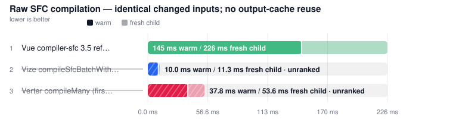

| Tool | **Fresh child** | vs Vue fresh child | **Warm (primary)** | vs Vue warm |
| --- | ---: | ---: | ---: | ---: |
| [Vue compiler-sfc 3.5 reference (raw render, 1T)](https://github.com/vuejs/core) | 226.3 ms | 1.00x | **145.2 ms** | 1.00x |
| [Vize compileSfcBatchWithResults (raw render)](https://github.com/ubugeeei-prod/vize) ⚠ | (11.3 ms) | not ranked | (10.0 ms) | not ranked |
| [Verter compileMany (first-admission stateless raw render)](https://github.com/pikax/verter) ⚠ | (53.6 ms) | not ranked | (37.8 ms) | not ranked |

##### SFC compilation with CSS — script, template and style changed

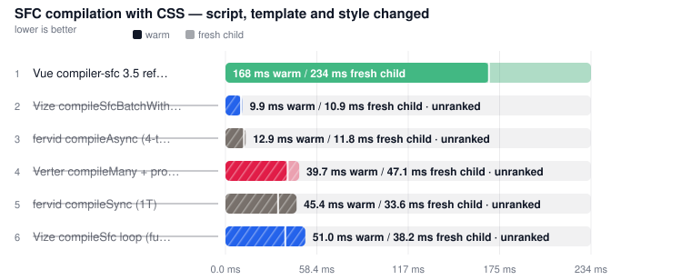

| Tool | **Fresh child** | vs Vue fresh child | **Warm (primary)** | vs Vue warm |
| --- | ---: | ---: | ---: | ---: |
| [Vue compiler-sfc 3.5 reference (render + CSS, 1T)](https://github.com/vuejs/core) | 233.5 ms | 1.00x | **168.3 ms** | 1.00x |
| [Vize compileSfc loop (full SFC, 1T)](https://github.com/ubugeeei-prod/vize) ⚠ | (38.2 ms) | not ranked | (51.0 ms) | not ranked |
| [Vize compileSfcBatchWithResults (render + CSS, Rayon batch)](https://github.com/ubugeeei-prod/vize) ⚠ | (10.9 ms) | not ranked | (9.9 ms) | not ranked |
| [fervid compileSync (1T)](https://github.com/phoenix-ru/fervid) ⚠ | (33.6 ms) | not ranked | (45.4 ms) | not ranked |
| [fervid compileAsync (4-thread libuv pool)](https://github.com/phoenix-ru/fervid) ⚠ | (11.8 ms) | not ranked | (12.9 ms) | not ranked |
| [Verter compileMany + processStyle (render + CSS)](https://github.com/pikax/verter) ⚠ | (47.1 ms) | not ranked | (39.7 ms) | not ranked |

#### VAPOR · production · sourcemap off

Target: `vapor` · Environment: `production` · Source map: `off`

##### Raw SFC compilation — identical changed inputs; no output-cache reuse

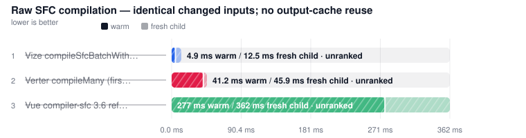

| Tool | **Fresh child** | vs Vue fresh child | **Warm (primary)** | vs Vue warm |
| --- | ---: | ---: | ---: | ---: |
| [Vue compiler-sfc 3.6 reference (raw render, 1T)](https://github.com/vuejs/core) ⚠ | (361.7 ms) | not ranked | (277.3 ms) | not ranked |
| [Vize compileSfcBatchWithResults (raw render)](https://github.com/ubugeeei-prod/vize) ⚠ | (12.5 ms) | not ranked | (4.9 ms) | not ranked |
| [Verter compileMany (first-admission stateless raw render)](https://github.com/pikax/verter) ⚠ | (45.9 ms) | not ranked | (41.2 ms) | not ranked |

##### SFC compilation with CSS — script, template and style changed

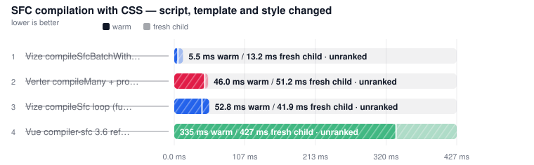

| Tool | **Fresh child** | vs Vue fresh child | **Warm (primary)** | vs Vue warm |
| --- | ---: | ---: | ---: | ---: |
| [Vue compiler-sfc 3.6 reference (render + CSS, 1T)](https://github.com/vuejs/core) ⚠ | (426.9 ms) | not ranked | (335.2 ms) | not ranked |
| [Vize compileSfc loop (full SFC, 1T)](https://github.com/ubugeeei-prod/vize) ⚠ | (41.9 ms) | not ranked | (52.8 ms) | not ranked |
| [Vize compileSfcBatchWithResults (render + CSS, Rayon batch)](https://github.com/ubugeeei-prod/vize) ⚠ | (13.2 ms) | not ranked | (5.5 ms) | not ranked |
| [fervid (vapor)](https://github.com/phoenix-ru/fervid) ⏭ | skipped | – | – | – |
| [Verter compileMany + processStyle (render + CSS)](https://github.com/pikax/verter) ⚠ | (51.2 ms) | not ranked | (46.0 ms) | not ranked |

#### Peak RSS

> Isolated from timing. In-process rows show tool-attributed RSS delta from the worker's GC baseline; CLI rows show the child/process-tree RSS. Full probe (min/max/avg, CPU): [MEMORY.md](MEMORY.md).

#### Raw SFC compilation — identical style-free inputs

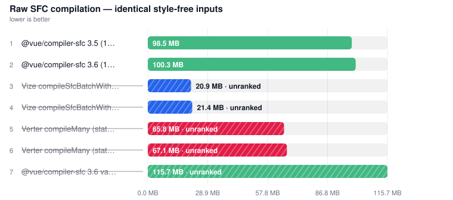

| Tool | **Peak RSS** |
| --- | ---: |
| [@vue/compiler-sfc 3.5 (1T) vdom-prod](https://github.com/vuejs/core) | 98.5 MB |
| [@vue/compiler-sfc 3.6 (1T) vdom-prod](https://github.com/vuejs/core) | 100.3 MB |
| [Vize compileSfcBatchWithResults (raw style-free render, Rayon global pool) vapor-prod ⚠ INVALID](https://github.com/ubugeeei-prod/vize) | 20.9 MB |
| [Vize compileSfcBatchWithResults (raw style-free render, Rayon global pool) vdom-prod ⚠ INVALID](https://github.com/ubugeeei-prod/vize) | 21.4 MB |
| [Verter compileMany (stateless raw render) vapor-prod ⚠ INVALID](https://github.com/pikax/verter) | 65.8 MB |
| [Verter compileMany (stateless raw render) vdom-prod ⚠ INVALID](https://github.com/pikax/verter) | 67.1 MB |
| [@vue/compiler-sfc 3.6 vapor (1T) vapor-prod ⚠ INVALID](https://github.com/vuejs/core) | 115.7 MB |

#### SFC compilation with CSS — styles included

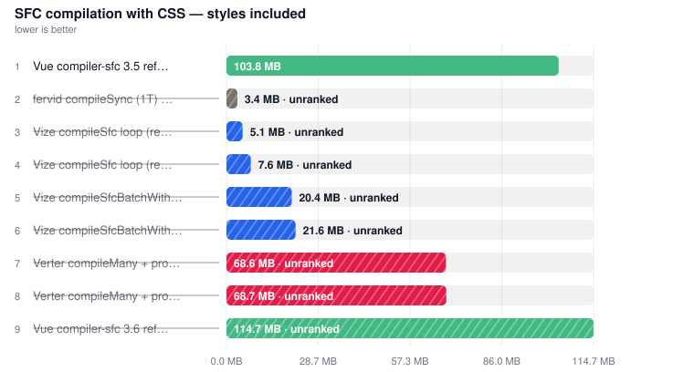

| Tool | **Peak RSS** |
| --- | ---: |
| [Vue compiler-sfc 3.5 reference (render + CSS, 1T) vdom-prod](https://github.com/vuejs/core) | 103.8 MB |
| [fervid compileSync (1T) vdom-prod ⚠ INVALID](https://github.com/phoenix-ru/fervid) | 3.4 MB |
| [Vize compileSfc loop (render + CSS, 1T) vapor-prod ⚠ INVALID](https://github.com/ubugeeei-prod/vize) | 5.1 MB |
| [Vize compileSfc loop (render + CSS, 1T) vdom-prod ⚠ INVALID](https://github.com/ubugeeei-prod/vize) | 7.6 MB |
| [Vize compileSfcBatchWithResults (render + CSS, Rayon global pool) vapor-prod ⚠ INVALID](https://github.com/ubugeeei-prod/vize) | 20.4 MB |
| [Vize compileSfcBatchWithResults (render + CSS, Rayon global pool) vdom-prod ⚠ INVALID](https://github.com/ubugeeei-prod/vize) | 21.6 MB |
| [Verter compileMany + processStyle (render + CSS) vdom-prod ⚠ INVALID](https://github.com/pikax/verter) | 68.6 MB |
| [Verter compileMany + processStyle (render + CSS) vapor-prod ⚠ INVALID](https://github.com/pikax/verter) | 68.7 MB |
| [Vue compiler-sfc 3.6 reference (render + CSS, 1T) vapor-prod ⚠ INVALID](https://github.com/vuejs/core) | 114.7 MB |
<!-- COMPILER_RESULTS_END -->


#### Ubuntu/Linux · bench

<!-- source: bench-Linux-200-bench.md -->

### Typecheck

Files: **200** · Bytes: **285,701**

| Tool                                                                                        | Version                                                                                                                        |
| ------------------------------------------------------------------------------------------- | ------------------------------------------------------------------------------------------------------------------------------ |
| [vize](https://github.com/ubugeeei-prod/vize)                                               | [0.350.2](https://www.npmjs.com/package/vize/v/0.350.2) · 2026-08-19                                                           |
| [vue-tsc](https://github.com/vuejs/language-tools)                                          | [3.3.10](https://www.npmjs.com/package/vue-tsc/v/3.3.10) · 2026-08-15                                                          |
| [typescript-native-bridge (TNB)](https://github.com/johnsoncodehk/typescript-native-bridge) | [6.0.3-bridge.13.tsgo.7.0.2](https://www.npmjs.com/package/typescript-native-bridge/v/6.0.3-bridge.13.tsgo.7.0.2) · 2026-08-13 |
| [verter-tsc](https://github.com/pikax/verter)                                               | [0.0.1-beta.3](https://www.npmjs.com/package/verter-tsc/v/0.0.1-beta.3) · 2026-07-27                                           |
| [@golar/vue](https://github.com/auvred/golar)                                               | [0.1.10](https://www.npmjs.com/package/@golar/vue/v/0.1.10) · 2026-07-19                                                       |
| [golar](https://github.com/auvred/golar)                                                    | [0.1.10](https://www.npmjs.com/package/golar/v/0.1.10) · 2026-07-19                                                            |
| [typescript](https://github.com/microsoft/TypeScript)                                       | [6.0.3](https://www.npmjs.com/package/typescript/v/6.0.3) · 2026-04-16                                                         |


| Tool                                                                     | **Median** | vs fastest |
| ------------------------------------------------------------------------ | ---------: | ---------: |
| [verter-tsc](https://github.com/pikax/verter)                            | **1.24 s** |      1.00x |
| [Vize](https://github.com/ubugeeei-prod/vize)                            | **1.61 s** |      1.30x |
| [Golar typecheck](https://github.com/auvred/golar)                       | **1.70 s** |      1.37x |
| [Golar (lint+check)](https://github.com/auvred/golar)                    | **1.70 s** |      1.37x |
| [vue-tsc (N)](https://github.com/johnsoncodehk/typescript-native-bridge) | **2.46 s** |      1.99x |
| [vue-tsc (JS)](https://github.com/vuejs/language-tools)                  | **5.18 s** |      4.19x |

#### Peak RSS

> Isolated from timing. Full probe (min/max/avg, CPU): [MEMORY.md](MEMORY.md).


| Tool                                                | **Peak RSS** |
| --------------------------------------------------- | -----------: |
| [Vize check](https://github.com/ubugeeei-prod/vize) |     211.5 MB |
| [verter-tsc](https://github.com/pikax/verter)       |     214.8 MB |
| [Golar typecheck](https://github.com/auvred/golar)  |     382.6 MB |
| [vue-tsc](https://github.com/vuejs/language-tools)  |     353.8 MB |

### Format

Files: **200** · Bytes: **285,701**

| Tool                                               | Version                                                                    |
| -------------------------------------------------- | -------------------------------------------------------------------------- |
| [vize](https://github.com/ubugeeei-prod/vize)      | [0.350.2](https://www.npmjs.com/package/vize/v/0.350.2) · 2026-08-19       |
| [oxfmt](https://github.com/oxc-project/oxc)        | [0.64.0](https://www.npmjs.com/package/oxfmt/v/0.64.0) · 2026-08-18        |
| [@biomejs/biome](https://github.com/biomejs/biome) | [2.5.9](https://www.npmjs.com/package/@biomejs/biome/v/2.5.9) · 2026-08-17 |
| [prettier](https://github.com/prettier/prettier)   | [3.9.6](https://www.npmjs.com/package/prettier/v/3.9.6) · 2026-07-21       |


| Tool                                               |   **Median** | vs fastest |
| -------------------------------------------------- | -----------: | ---------: |
| [Vize](https://github.com/ubugeeei-prod/vize)      | **127.6 ms** |      1.00x |
| [Oxfmt](https://github.com/oxc-project/oxc)        |   **3.27 s** |     25.66x |
| [Prettier](https://github.com/prettier/prettier)   |   **3.78 s** |     29.60x |
| [Biome format](https://github.com/biomejs/biome) ⚠ |   (116.3 ms) | not ranked |

#### Peak RSS

> Isolated from timing. Full probe (min/max/avg, CPU): [MEMORY.md](MEMORY.md).


| Tool                                              | **Peak RSS** |
| ------------------------------------------------- | -----------: |
| [Vize fmt](https://github.com/ubugeeei-prod/vize) |      68.0 MB |
| [Biome format](https://github.com/biomejs/biome)  |      95.8 MB |
| [Prettier](https://github.com/prettier/prettier)  |     186.2 MB |
| [Oxfmt](https://github.com/oxc-project/oxc)       |     685.3 MB |

### Lint

Files: **200** · Bytes: **285,701**

#### Peak RSS

> Isolated from timing. Full probe (min/max/avg, CPU): [MEMORY.md](MEMORY.md).


| Tool                                                                  | **Peak RSS** |
| --------------------------------------------------------------------- | -----------: |
| [Verter host lint](https://github.com/pikax/verter)                   |      31.6 MB |
| [Vize lint](https://github.com/ubugeeei-prod/vize)                    |      68.5 MB |
| [Oxlint (Node host + NAPI addon)](https://github.com/oxc-project/oxc) |      99.3 MB |
| [Biome lint](https://github.com/biomejs/biome)                        |     103.2 MB |
| [eslint-plugin-vue (1T)](https://github.com/vuejs/eslint-plugin-vue)  |     213.3 MB |

### Component-meta

Files: **100** · Bytes: **142,771**

| Tool                                                          | Version                                                                                          |
| ------------------------------------------------------------- | ------------------------------------------------------------------------------------------------ |
| [vize](https://github.com/ubugeeei-prod/vize)                 | [0.350.2](https://www.npmjs.com/package/vize/v/0.350.2) · 2026-08-19                             |
| [vue-component-meta](https://github.com/vuejs/language-tools) | [3.3.10](https://www.npmjs.com/package/vue-component-meta/v/3.3.10) · 2026-08-15                 |
| [@verter/component-meta](https://github.com/pikax/verter)     | [0.0.1-beta.3](https://www.npmjs.com/package/@verter/component-meta/v/0.0.1-beta.3) · 2026-07-27 |


| Tool                                                           |   **Median** | vs fastest |
| -------------------------------------------------------------- | -----------: | ---------: |
| [@verter/component-meta](https://github.com/pikax/verter)      | **469.1 ms** |      1.00x |
| [vue-component-meta](https://github.com/vuejs/language-tools)  |   **1.32 s** |      2.82x |
| [Vize component-meta](https://github.com/ubugeeei-prod/vize) ⏭ |      skipped |          – |

#### Peak RSS

> Isolated from timing. Full probe (min/max/avg, CPU): [MEMORY.md](MEMORY.md).


| Tool                                                          | **Peak RSS** |
| ------------------------------------------------------------- | -----------: |
| [Verter ComponentMetaHost](https://github.com/pikax/verter)   |      33.5 MB |
| [vue-component-meta](https://github.com/vuejs/language-tools) |     243.8 MB |

### LSP (editor language server)

Files: **1** · Bytes: **745**

| Tool                                                                                                   | Version                                                                                                                        |
| ------------------------------------------------------------------------------------------------------ | ------------------------------------------------------------------------------------------------------------------------------ |
| [vize](https://github.com/ubugeeei-prod/vize)                                                          | [0.350.2](https://www.npmjs.com/package/vize/v/0.350.2) · 2026-08-19                                                           |
| [@vue/language-server](https://github.com/vuejs/language-tools)                                        | [3.3.10](https://www.npmjs.com/package/@vue/language-server/v/3.3.10) · 2026-08-15                                             |
| [@vue/typescript-plugin](https://github.com/vuejs/language-tools)                                      | [3.3.10](https://www.npmjs.com/package/@vue/typescript-plugin/v/3.3.10) · 2026-08-15                                           |
| [typescript-native-bridge (TNB)](https://github.com/johnsoncodehk/typescript-native-bridge)            | [6.0.3-bridge.13.tsgo.7.0.2](https://www.npmjs.com/package/typescript-native-bridge/v/6.0.3-bridge.13.tsgo.7.0.2) · 2026-08-13 |
| [verter-lsp](https://github.com/pikax/verter)                                                          | [0.0.1-beta.3](https://www.npmjs.com/package/verter-lsp/v/0.0.1-beta.3) · 2026-07-27                                           |
| [typescript-language-server](https://github.com/typescript-language-server/typescript-language-server) | [5.3.0](https://www.npmjs.com/package/typescript-language-server/v/5.3.0) · 2026-05-21                                         |


| Tool                                                                   |   **Median** | vs fastest |
| ---------------------------------------------------------------------- | -----------: | ---------: |
| [Verter](https://github.com/pikax/verter)                              | **303.1 ms** |      1.00x |
| [Vize](https://github.com/ubugeeei-prod/vize)                          | **355.7 ms** |      1.17x |
| [Volar (N)](https://github.com/johnsoncodehk/typescript-native-bridge) | **459.9 ms** |      1.52x |
| [Volar (JS)](https://github.com/vuejs/language-tools)                  |   **1.22 s** |      4.04x |

#### Peak RSS

> Isolated from timing. Full probe (min/max/avg, CPU): [MEMORY.md](MEMORY.md).


| Tool                                                                             | **Peak RSS** |
| -------------------------------------------------------------------------------- | -----------: |
| [LSP verter (server process, npm 0.0.1-beta.3)](https://github.com/pikax/verter) |     223.1 MB |
| [LSP volar (server process)](https://github.com/vuejs/language-tools)            |     140.2 MB |
| [LSP vize (server process, Node shim)](https://github.com/ubugeeei-prod/vize)    |     276.1 MB |

<!-- BENCHMARK_RESULTS_END -->

<!-- TYPECHECK_CONFIRM_START -->

## Typecheck confirmation

> 📄 **[Full matrix →](docs/typecheck.md)** — plants, documented gaps, per-plant time/memory. **142** plants. Generated 2026-08-19T18:33:13.434Z.

### All plants (one tsconfig)

One spawn per tool over every plant. Pass rate is a **percentage** of scored plants.


| Tool       | **Median** |    Avg | vs fastest |
| ---------- | ---------: | -----: | ---------: |
| vize       | **603 ms** | 602 ms |      1.00x |
| verter-tsc | **755 ms** | 756 ms |      1.25x |
| golar      | **915 ms** | 913 ms |      1.52x |
| vue-tsc    | **3.18 s** | 3.17 s |      5.28x |


| Tool       |     Tool | tsgo / tsc |    **Total** |
| ---------- | -------: | ---------: | -----------: |
| verter-tsc |  81.6 MB |   141.9 MB | **223.5 MB** |
| vue-tsc    | 340.1 MB |          — | **340.1 MB** |
| golar      | 353.5 MB |          — | **353.5 MB** |
| vize       |  72.3 MB |   319.6 MB | **392.0 MB** |

Engine is a **child** `tsgo` / native `tsc` / `tsserver`. vue-tsc, golar, and vize host the checker **in-process** — Peak RSS is that process's high-water mark (Tool = Total, engine —).


| Tool       | **Pass rate** | pass / scored | skipped |
| ---------- | ------------: | ------------: | ------: |
| vue-tsc    |       **84%** |     119 / 142 |       0 |
| golar      |       **82%** |     117 / 142 |       0 |
| verter-tsc |       **70%** |     100 / 142 |       0 |
| vize       |       **52%** |      71 / 136 |       6 |

**vize** scored 136 of 142 (6 skipped). Skips are capability gaps, not fails — Vize does not claim `strict-component-attrs` (undeclared component attrs under `strictTemplates`).

<!-- TYPECHECK_CONFIRM_END -->

## IDE operation results

Per-operation editor benchmarks from the `ide` job (`scripts/ide-bench.mjs`). Ranked **per operation**, never pooled — `didOpen→diagnostics` and `foldingRange` differ by orders of magnitude and answer unrelated questions. Not comparable to the timing tables above: different job, different load profile.

Servers here are Volar, **Volar on the TNB/tsgo tsdk**, Vize and Verter. Three caveats apply to these tables specifically:

- **`Volar (TNB / tsgo tsdk)` errors resolving an auto-import completion** — `Debug Failure. False expression. at getCompletionEntryCodeActionsAndSourceDisplay`. Stock Volar resolves the same item. [Details](docs/methodology.md#caveat-the-tnb-engine-swap-fails-an-ide-completion-resolve-operation).
- **Vize may answer with its tsgo backend absent**, with no error in the LSP traffic. [Details](docs/methodology.md#caveat-vizes-type-checking-backend-sometimes-never-starts-and-the-row-still-answers).
- **Both Volar rows are two processes**, charged the slower half on every operation; Vize and Verter are one. [Details](docs/methodology.md#caveat-volars-lsp-memory-row-is-not-the-whole-of-volar-but-the-lsp-timing-row-is).

<!-- IDE_RESULTS_START -->

> Auto-updated 2026-08-19 from the **Benchmark** workflow (`ide` job — per-operation editor benchmarks).
> Ranked **per operation**, never pooled: `didOpen→diagnostics` and `foldingRange` answer unrelated questions.
> Same-VM rule holds within the job; these numbers are not comparable to the timing tables above.
> **⚠ unranked** is a noise or work gate, not “the official tool is unofficial”. A series with CV > 50% is too noisy to rank.
> Each chart row combines **Warm** (solid, repeated request) and **Cold** (pale, first request) in one range bar. The segment boundary marks the faster value and the full endpoint marks the slower value; the values are not additive. Ranking uses **Cold**; vs-fastest-cold sits next to it.

> 📄 **[Full details →](docs/results/ide-Linux.md)** — methodology, per-row notes and raw runs (82 collapsed block(s) moved out of this page).
> IDE scale: [full report](docs/results/ide-scale-Linux.md).

<!-- notes: notes-ide.md -->

> 📖 **[How to read these tables →](docs/results/notes-ide.md)** — ranking rules, standing notes and the tools legend shared by every block in this section.

#### Ubuntu/Linux · ide ops

<!-- source: ide-Linux.md -->

### IDE · initialize

| Tool                                                                                                   | Version                                                                                                                        |
| ------------------------------------------------------------------------------------------------------ | ------------------------------------------------------------------------------------------------------------------------------ |
| [vize](https://github.com/ubugeeei-prod/vize)                                                          | [0.350.2](https://www.npmjs.com/package/vize/v/0.350.2) · 2026-08-19                                                           |
| [@vue/language-server](https://github.com/vuejs/language-tools)                                        | [3.3.10](https://www.npmjs.com/package/@vue/language-server/v/3.3.10) · 2026-08-15                                             |
| [@vue/typescript-plugin](https://github.com/vuejs/language-tools)                                      | [3.3.10](https://www.npmjs.com/package/@vue/typescript-plugin/v/3.3.10) · 2026-08-15                                           |
| [typescript-native-bridge (TNB)](https://github.com/johnsoncodehk/typescript-native-bridge)            | [6.0.3-bridge.13.tsgo.7.0.2](https://www.npmjs.com/package/typescript-native-bridge/v/6.0.3-bridge.13.tsgo.7.0.2) · 2026-08-13 |
| [verter-lsp](https://github.com/pikax/verter)                                                          | [0.0.1-beta.3](https://www.npmjs.com/package/verter-lsp/v/0.0.1-beta.3) · 2026-07-27                                           |
| [typescript-language-server](https://github.com/typescript-language-server/typescript-language-server) | [5.3.0](https://www.npmjs.com/package/typescript-language-server/v/5.3.0) · 2026-05-21                                         |

#### LSP initialize

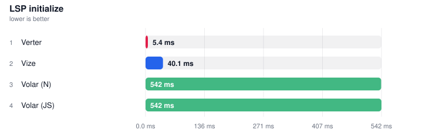

| Tool                                                                   |   **Median** | vs fastest |
| ---------------------------------------------------------------------- | -----------: | ---------: |
| [Verter](https://github.com/pikax/verter)                              |   **5.4 ms** |      1.00x |
| [Vize](https://github.com/ubugeeei-prod/vize)                          |  **40.1 ms** |      7.46x |
| [Volar (N)](https://github.com/johnsoncodehk/typescript-native-bridge) | **541.7 ms** |    100.61x |
| [Volar (JS)](https://github.com/vuejs/language-tools)                  | **542.4 ms** |    100.74x |

### IDE · completion

#### Completion: script member

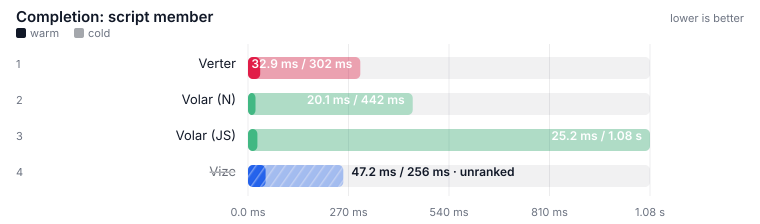

| Tool                                                                   |     **Cold** | vs fastest cold |    **Warm** |
| ---------------------------------------------------------------------- | -----------: | --------------: | ----------: |
| [Verter](https://github.com/pikax/verter)                              | **301.8 ms** |           1.00x | **32.9 ms** |
| [Volar (N)](https://github.com/johnsoncodehk/typescript-native-bridge) | **442.4 ms** |           1.47x | **20.1 ms** |
| [Volar (JS)](https://github.com/vuejs/language-tools)                  |   **1.08 s** |           3.59x | **25.2 ms** |
| [Vize](https://github.com/ubugeeei-prod/vize) ⚠                        |   (256.0 ms) |      not ranked |   (47.2 ms) |

#### Peak RSS (process tree)

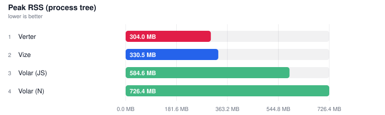

| Tool                                                                   | **Peak RSS** |
| ---------------------------------------------------------------------- | -----------: |
| [Verter](https://github.com/pikax/verter)                              |     304.0 MB |
| [Vize](https://github.com/ubugeeei-prod/vize)                          |     330.5 MB |
| [Volar (JS)](https://github.com/vuejs/language-tools)                  |     584.6 MB |
| [Volar (N)](https://github.com/johnsoncodehk/typescript-native-bridge) |     726.4 MB |

### IDE · template interpolation

#### Hover (template interpolation)

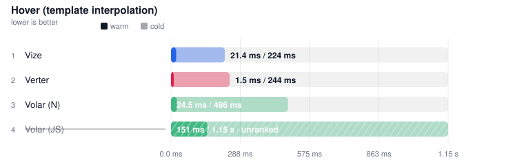

| Tool                                                                   |     **Cold** | vs fastest cold |    **Warm** |
| ---------------------------------------------------------------------- | -----------: | --------------: | ----------: |
| [Vize](https://github.com/ubugeeei-prod/vize)                          | **223.5 ms** |           1.00x | **21.4 ms** |
| [Verter](https://github.com/pikax/verter)                              | **243.8 ms** |           1.09x |  **1.5 ms** |
| [Volar (N)](https://github.com/johnsoncodehk/typescript-native-bridge) | **485.6 ms** |           2.17x | **24.5 ms** |
| [Volar (JS)](https://github.com/vuejs/language-tools) ⚠                |     (1.15 s) |      not ranked |  (150.7 ms) |

#### Peak RSS (process tree)

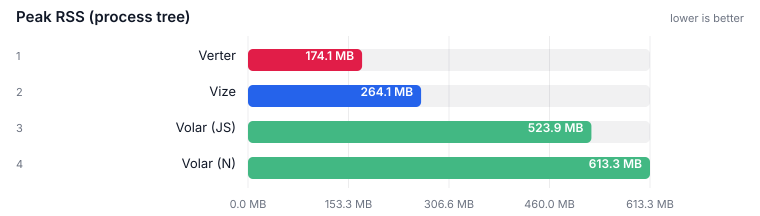

| Tool                                                                   | **Peak RSS** |
| ---------------------------------------------------------------------- | -----------: |
| [Verter](https://github.com/pikax/verter)                              |     174.1 MB |
| [Vize](https://github.com/ubugeeei-prod/vize)                          |     264.1 MB |
| [Volar (JS)](https://github.com/vuejs/language-tools)                  |     523.9 MB |
| [Volar (N)](https://github.com/johnsoncodehk/typescript-native-bridge) |     613.3 MB |

### IDE · smoke

#### Hover (script setup)

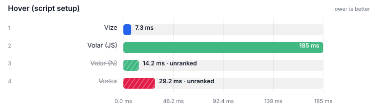

| Tool                                                                   |     **Cold** | vs fastest cold |     **Warm** |
| ---------------------------------------------------------------------- | -----------: | --------------: | -----------: |
| [Vize](https://github.com/ubugeeei-prod/vize)                          | **232.8 ms** |           1.00x |  **25.4 ms** |
| [Volar (N)](https://github.com/johnsoncodehk/typescript-native-bridge) | **480.8 ms** |           2.07x |  **18.6 ms** |
| [Volar (JS)](https://github.com/vuejs/language-tools)                  |   **1.10 s** |           4.72x | **176.1 ms** |
| [Verter](https://github.com/pikax/verter) ⚠                            |   (250.9 ms) |      not ranked |     (0.9 ms) |

### IDE · navigation

#### Definition: imported fn (script)

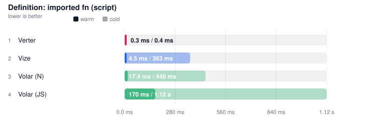

| Tool                                                                   |     **Cold** | vs fastest cold |     **Warm** |
| ---------------------------------------------------------------------- | -----------: | --------------: | -----------: |
| [Verter](https://github.com/pikax/verter)                              |   **0.4 ms** |           1.00x |   **0.3 ms** |
| [Vize](https://github.com/ubugeeei-prod/vize)                          | **363.4 ms** |         850.11x |   **4.5 ms** |
| [Volar (N)](https://github.com/johnsoncodehk/typescript-native-bridge) | **448.3 ms** |        1048.49x |  **17.4 ms** |
| [Volar (JS)](https://github.com/vuejs/language-tools)                  |   **1.12 s** |        2614.81x | **170.1 ms** |

#### Peak RSS (process tree)

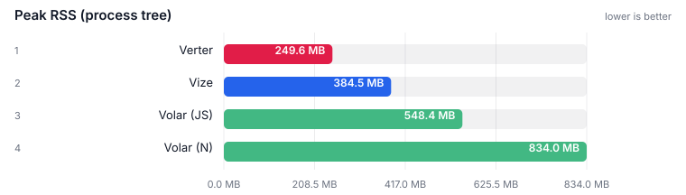

| Tool                                                                   | **Peak RSS** |
| ---------------------------------------------------------------------- | -----------: |
| [Verter](https://github.com/pikax/verter)                              |     249.6 MB |
| [Vize](https://github.com/ubugeeei-prod/vize)                          |     384.5 MB |
| [Volar (JS)](https://github.com/vuejs/language-tools)                  |     548.4 MB |
| [Volar (N)](https://github.com/johnsoncodehk/typescript-native-bridge) |     834.0 MB |

### IDE · edit-loop

#### Edit plants type error -> reported

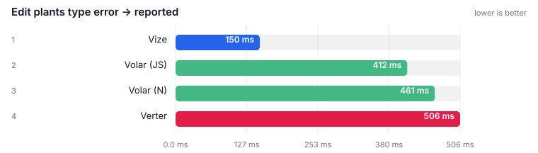

| Tool                                                                   |   **Median** | vs fastest |
| ---------------------------------------------------------------------- | -----------: | ---------: |
| [Vize](https://github.com/ubugeeei-prod/vize)                          |  **68.7 ms** |      1.00x |
| [Volar (JS)](https://github.com/vuejs/language-tools)                  | **393.6 ms** |      5.73x |
| [Volar (N)](https://github.com/johnsoncodehk/typescript-native-bridge) | **455.1 ms** |      6.62x |
| [Verter](https://github.com/pikax/verter)                              | **499.8 ms** |      7.27x |

#### Peak RSS (process tree)

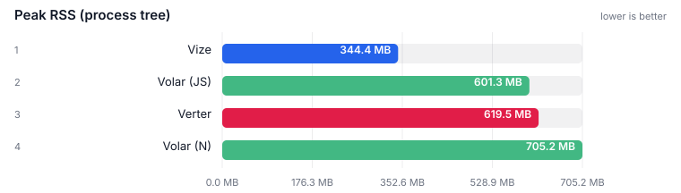

| Tool                                                                   | **Peak RSS** |
| ---------------------------------------------------------------------- | -----------: |
| [Vize](https://github.com/ubugeeei-prod/vize)                          |     344.4 MB |
| [Volar (JS)](https://github.com/vuejs/language-tools)                  |     601.3 MB |
| [Verter](https://github.com/pikax/verter)                              |     619.5 MB |
| [Volar (N)](https://github.com/johnsoncodehk/typescript-native-bridge) |     705.2 MB |

### IDE · Peak RSS (process tree)

#### Peak RSS (process tree)

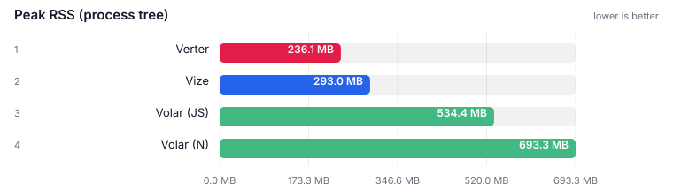

| Tool                                                                   | **Peak RSS** |
| ---------------------------------------------------------------------- | -----------: |
| [Verter](https://github.com/pikax/verter)                              |     236.1 MB |
| [Vize](https://github.com/ubugeeei-prod/vize)                          |     293.0 MB |
| [Volar (JS)](https://github.com/vuejs/language-tools)                  |     534.4 MB |
| [Volar (N)](https://github.com/johnsoncodehk/typescript-native-bridge) |     693.3 MB |

<!-- IDE_RESULTS_END -->

## Real-world project results

Pinned third-party Vue checkouts, **one job per project**. Ranked within a corpus, never across — Naive UI's demo SFCs are not PrimeVue's published components. Full compile / bundle / HMR / lint tables: each project's report. The generated `fixtures/N` corpus remains the primary ranking corpus.

<!-- REAL_WORLD_RESULTS_START -->

> Auto-updated 2026-08-19 from the **Benchmark (real-world)** workflow — one job per project, every surface and every tool inside it.
> Corpora are pinned checkouts of third-party open-source Vue projects. Sources are unmodified; every table names its ref and resolved commit SHA.
> **Rank within a corpus, never across it.** The corpora differ in size and in kind — library source, application source, and documentation demos are not the same code.
> The generated `fixtures/N` corpus remains the primary ranking corpus; these tables exist to catch what a designed corpus cannot.
> Landing view is the project's **own** typecheck / test / build (plugin swaps included). Harness compilation of extracted SFCs stays in the full report. Unranked tools are listed under the table with the gate that dropped them.
> **⚠ unranked** is a gate, not a ranking of the official toolchain. A project that ships **no lockfile** at the pinned ref (Naive UI, Ant Design Vue) cannot be installed frozen, so every typecheck / test / build / lsp row on that corpus is unranked equally — including vue-tsc.

<!-- notes: notes-real-world.md -->

> 📖 **[How to read these tables →](docs/results/notes-real-world.md)** — ranking rules, standing notes and the tools legend shared by every block in this section.

# element-plus

<!-- source: real-world-Linux-element-plus.md -->

> 📄 **[Full details →](docs/results/real-world-Linux-element-plus.md)** — methodology, per-row notes and raw runs (46 collapsed block(s) moved out of this page).

## Project test suite — element-plus:components

Files: **162** · Bytes: **765,295**


| Tool                                              |   **Median** | vs fastest |
| ------------------------------------------------- | -----------: | ---------: |
| element-plus — project's own toolchain (baseline) | **160.55 s** |      1.00x |
| element-plus — unplugin-vue                       | **162.66 s** |      1.01x |

**Not ranked**

- **[element-plus — @vizejs/vite-plugin](https://github.com/ubugeeei-prod/vize)**: FAILED TEST-COUNT GATE — passed 2047 tests where the project's own toolchain passed 2533; failed 434 test(s) where the project's own toolchain failed 0 — a failing test is not a faster test.
- **[element-plus — @verter/unplugin](https://github.com/pikax/verter)**: FAILED TEST-COUNT GATE — passed 527 tests where the project's own toolchain passed 2533; failed 30 test(s) where the project's own toolchain failed 0 — a failing test is not a faster test.

### Peak RSS

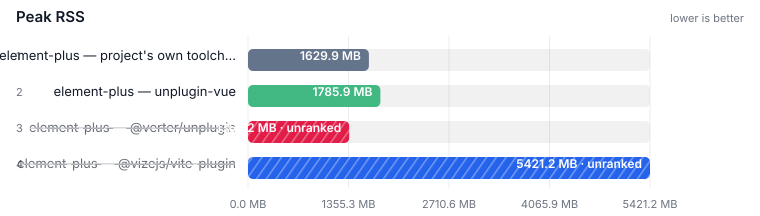

| Tool                                                                          | **Peak RSS** |
| ----------------------------------------------------------------------------- | -----------: |
| [element-plus — @verter/unplugin](https://github.com/pikax/verter) ⚠          |    1365.2 MB |
| element-plus — project's own toolchain (baseline)                             |    1629.9 MB |
| element-plus — unplugin-vue                                                   |    1785.9 MB |
| [element-plus — @vizejs/vite-plugin](https://github.com/ubugeeei-prod/vize) ⚠ |    5421.2 MB |

**Not ranked**

- **[element-plus — @verter/unplugin](https://github.com/pikax/verter)**: unranked
- **[element-plus — @vizejs/vite-plugin](https://github.com/ubugeeei-prod/vize)**: unranked

## Project typecheck (own tsconfig) — element-plus:components

Files: **162** · Bytes: **765,295**

### JavaScript TypeScript engine — ranked alone

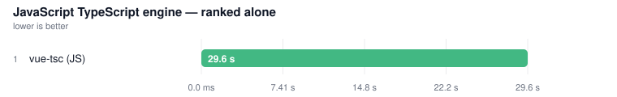

| Tool                                                    |  **Median** | vs fastest |
| ------------------------------------------------------- | ----------: | ---------: |
| [vue-tsc (JS)](https://github.com/vuejs/language-tools) | **29.62 s** |      1.00x |

### Peak RSS

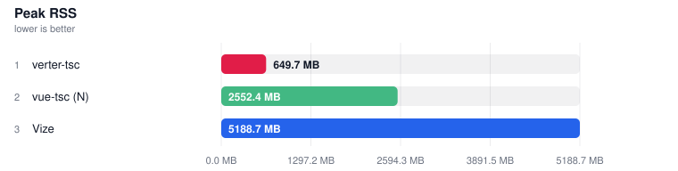

| Tool                                                    | **Peak RSS** |
| ------------------------------------------------------- | -----------: |
| [vue-tsc (JS)](https://github.com/vuejs/language-tools) |    1916.7 MB |

### Native tsgo engines — ranked together

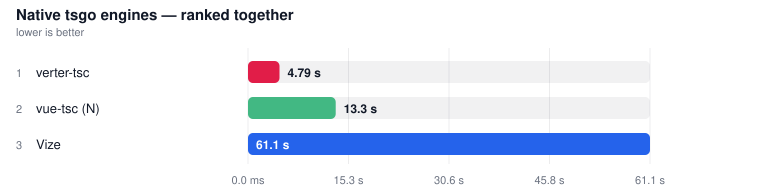

| Tool                                                                     |  **Median** | vs fastest |
| ------------------------------------------------------------------------ | ----------: | ---------: |
| [verter-tsc](https://github.com/pikax/verter)                            |  **4.79 s** |      1.00x |
| [vue-tsc (N)](https://github.com/johnsoncodehk/typescript-native-bridge) | **13.34 s** |      2.79x |
| [Vize](https://github.com/ubugeeei-prod/vize)                            | **61.13 s** |     12.77x |

**Not ranked**

- **[Golar typecheck](https://github.com/auvred/golar)**: skipped

### Peak RSS


| Tool                                                                     | **Peak RSS** |
| ------------------------------------------------------------------------ | -----------: |
| [verter-tsc](https://github.com/pikax/verter)                            |     649.7 MB |
| [vue-tsc (N)](https://github.com/johnsoncodehk/typescript-native-bridge) |    2552.4 MB |
| [Vize](https://github.com/ubugeeei-prod/vize)                            |    5188.7 MB |

# hoppscotch

<!-- source: real-world-Linux-hoppscotch.md -->

> 📄 **[Full details →](docs/results/real-world-Linux-hoppscotch.md)** — methodology, per-row notes and raw runs (46 collapsed block(s) moved out of this page).

## Project test suite — hoppscotch:common

Files: **293** · Bytes: **1,978,501**


| Tool                                                                              |  **Median** | vs fastest |
| --------------------------------------------------------------------------------- | ----------: | ---------: |
| @hoppscotch/common — project's own toolchain (baseline)                           | **20.20 s** |      1.00x |
| @hoppscotch/common — unplugin-vue                                                 | **20.28 s** |      1.00x |
| [@hoppscotch/common — @verter/unplugin](https://github.com/pikax/verter)          | **20.29 s** |      1.00x |
| [@hoppscotch/common — @vizejs/vite-plugin](https://github.com/ubugeeei-prod/vize) | **20.40 s** |      1.01x |

### Peak RSS

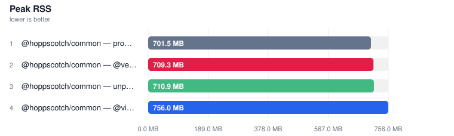

| Tool                                                                              | **Peak RSS** |
| --------------------------------------------------------------------------------- | -----------: |
| @hoppscotch/common — project's own toolchain (baseline)                           |     701.5 MB |
| [@hoppscotch/common — @verter/unplugin](https://github.com/pikax/verter)          |     709.3 MB |
| @hoppscotch/common — unplugin-vue                                                 |     710.9 MB |
| [@hoppscotch/common — @vizejs/vite-plugin](https://github.com/ubugeeei-prod/vize) |     756.0 MB |

## Project build (own config) — hoppscotch:common

Files: **293** · Bytes: **1,978,501**


| Tool                                                                            | **Median** | vs fastest |
| ------------------------------------------------------------------------------- | ---------: | ---------: |
| hoppscotch-agent — project's own toolchain (baseline)                           | **1.16 s** |      1.00x |
| hoppscotch-agent — unplugin-vue                                                 | **1.20 s** |      1.03x |
| [hoppscotch-agent — @verter/unplugin](https://github.com/pikax/verter)          | **1.23 s** |      1.05x |
| [hoppscotch-agent — @vizejs/vite-plugin](https://github.com/ubugeeei-prod/vize) | **1.26 s** |      1.08x |

### Peak RSS

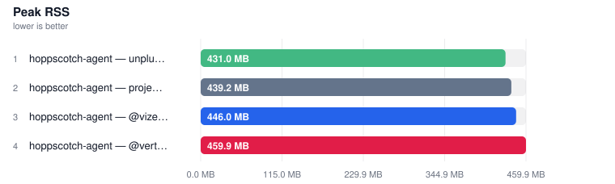

| Tool                                                                            | **Peak RSS** |
| ------------------------------------------------------------------------------- | -----------: |
| hoppscotch-agent — unplugin-vue                                                 |     431.0 MB |
| hoppscotch-agent — project's own toolchain (baseline)                           |     439.2 MB |
| [hoppscotch-agent — @vizejs/vite-plugin](https://github.com/ubugeeei-prod/vize) |     446.0 MB |
| [hoppscotch-agent — @verter/unplugin](https://github.com/pikax/verter)          |     459.9 MB |

## Project typecheck (own tsconfig) — hoppscotch:common

Files: **293** · Bytes: **1,978,501**

### JavaScript TypeScript engine — ranked alone

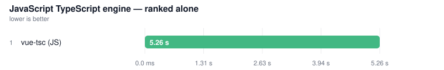

| Tool                                                    | **Median** | vs fastest |
| ------------------------------------------------------- | ---------: | ---------: |
| [vue-tsc (JS)](https://github.com/vuejs/language-tools) | **5.26 s** |      1.00x |

### Peak RSS

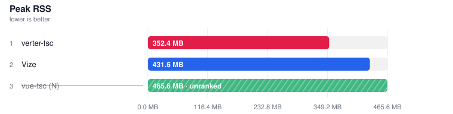

| Tool                                                    | **Peak RSS** |
| ------------------------------------------------------- | -----------: |
| [vue-tsc (JS)](https://github.com/vuejs/language-tools) |     628.3 MB |

### Native tsgo engines — ranked together

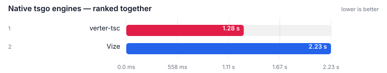

| Tool                                          | **Median** | vs fastest |
| --------------------------------------------- | ---------: | ---------: |
| [verter-tsc](https://github.com/pikax/verter) | **1.28 s** |      1.00x |
| [Vize](https://github.com/ubugeeei-prod/vize) | **2.23 s** |      1.75x |

**Not ranked**

- **[vue-tsc (N)](https://github.com/johnsoncodehk/typescript-native-bridge)**: FAILED PROGRAM-CONSTRUCTION GATE — at least one measured run exited 2 reporting 1 diagnostic(s) across 1 file(s).
- **[Golar typecheck](https://github.com/auvred/golar)**: skipped

### Peak RSS


| Tool                                                                       | **Peak RSS** |
| -------------------------------------------------------------------------- | -----------: |
| [verter-tsc](https://github.com/pikax/verter)                              |     352.4 MB |
| [Vize](https://github.com/ubugeeei-prod/vize)                              |     431.6 MB |
| [vue-tsc (N)](https://github.com/johnsoncodehk/typescript-native-bridge) ⚠ |     465.6 MB |

**Not ranked**

- **[vue-tsc (N)](https://github.com/johnsoncodehk/typescript-native-bridge)**: unranked

# naive-ui

<!-- source: real-world-Linux-naive-ui.md -->

> 📄 **[Full details →](docs/results/real-world-Linux-naive-ui.md)** — methodology, per-row notes and raw runs (45 collapsed block(s) moved out of this page).

## Project test suite — naive-ui:demos

Files: **1,682** · Bytes: **1,751,750**

**Not ranked** — NO LOCKFILE: naive-ui ships no lockfile at the pinned ref, so its install cannot be frozen and the dependency set is whatever resolved when fetch ran.

### Peak RSS

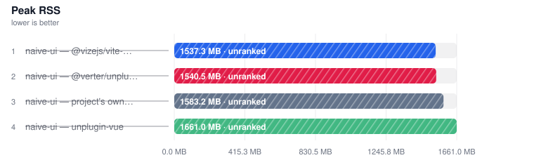

| Tool                                                                      | **Peak RSS** |
| ------------------------------------------------------------------------- | -----------: |
| [naive-ui — @vizejs/vite-plugin](https://github.com/ubugeeei-prod/vize) ⚠ |    1537.3 MB |
| [naive-ui — @verter/unplugin](https://github.com/pikax/verter) ⚠          |    1540.5 MB |
| naive-ui — project's own toolchain (baseline) ⚠                           |    1583.2 MB |
| naive-ui — unplugin-vue ⚠                                                 |    1661.0 MB |

**Not ranked**

- **[naive-ui — @vizejs/vite-plugin](https://github.com/ubugeeei-prod/vize)**: unranked
- **[naive-ui — @verter/unplugin](https://github.com/pikax/verter)**: unranked
- **naive-ui — project's own toolchain (baseline)**: unranked
- **naive-ui — unplugin-vue**: unranked

## Project typecheck (own tsconfig) — naive-ui:demos

Files: **1,682** · Bytes: **1,751,750**

### JavaScript TypeScript engine — ranked alone

**Not ranked** — NO LOCKFILE: naive-ui ships no lockfile at the pinned ref, so its install cannot be frozen and the dependency set is whatever resolved when fetch ran.

### Peak RSS

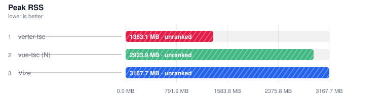

| Tool                                                      | **Peak RSS** |
| --------------------------------------------------------- | -----------: |
| [vue-tsc (JS)](https://github.com/vuejs/language-tools) ⚠ |    2487.2 MB |

**Not ranked**

- **[vue-tsc (JS)](https://github.com/vuejs/language-tools)**: unranked

### Native tsgo engines — ranked together

**Not ranked**

- **[vue-tsc (N)](https://github.com/johnsoncodehk/typescript-native-bridge)**: UNRANKED — NO LOCKFILE: naive-ui ships no lockfile at the pinned ref, so its install cannot be frozen and the dependency set is whatever resolved when fetch ran.
- **[verter-tsc](https://github.com/pikax/verter)**: UNRANKED — NO LOCKFILE: naive-ui ships no lockfile at the pinned ref, so its install cannot be frozen and the dependency set is whatever resolved when fetch ran.
- **[Vize](https://github.com/ubugeeei-prod/vize)**: UNRANKED — NO LOCKFILE: naive-ui ships no lockfile at the pinned ref, so its install cannot be frozen and the dependency set is whatever resolved when fetch ran.
- **[Golar typecheck](https://github.com/auvred/golar)**: skipped

### Peak RSS


| Tool                                                                       | **Peak RSS** |
| -------------------------------------------------------------------------- | -----------: |
| [verter-tsc](https://github.com/pikax/verter) ⚠                            |    1363.1 MB |
| [vue-tsc (N)](https://github.com/johnsoncodehk/typescript-native-bridge) ⚠ |    2923.9 MB |
| [Vize](https://github.com/ubugeeei-prod/vize) ⚠                            |    3167.7 MB |

**Not ranked**

- **[verter-tsc](https://github.com/pikax/verter)**: unranked
- **[vue-tsc (N)](https://github.com/johnsoncodehk/typescript-native-bridge)**: unranked
- **[Vize](https://github.com/ubugeeei-prod/vize)**: unranked

# nuxt-ui

<!-- source: real-world-Linux-nuxt-ui.md -->

> 📄 **[Full details →](docs/results/real-world-Linux-nuxt-ui.md)** — methodology, per-row notes and raw runs (45 collapsed block(s) moved out of this page).

## Project test suite — nuxt-ui:runtime

Files: **187** · Bytes: **1,014,900**

**Not ranked**

- **@nuxt/ui — project's own toolchain (baseline)**: errored
- **@nuxt/ui — unplugin-vue**: errored
- **[@nuxt/ui — @vizejs/vite-plugin](https://github.com/ubugeeei-prod/vize)**: errored
- **[@nuxt/ui — @verter/unplugin](https://github.com/pikax/verter)**: errored

## Project typecheck (own tsconfig) — nuxt-ui:runtime

Files: **187** · Bytes: **1,014,900**

### JavaScript TypeScript engine — ranked alone


| Tool                                                    |  **Median** | vs fastest |
| ------------------------------------------------------- | ----------: | ---------: |
| [vue-tsc (JS)](https://github.com/vuejs/language-tools) | **43.09 s** |      1.00x |

### Peak RSS

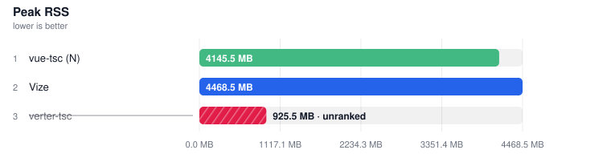

| Tool                                                    | **Peak RSS** |
| ------------------------------------------------------- | -----------: |
| [vue-tsc (JS)](https://github.com/vuejs/language-tools) |    3377.2 MB |

### Native tsgo engines — ranked together

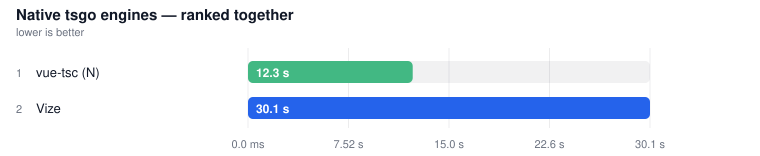

| Tool                                                                     |  **Median** | vs fastest |
| ------------------------------------------------------------------------ | ----------: | ---------: |
| [vue-tsc (N)](https://github.com/johnsoncodehk/typescript-native-bridge) | **12.33 s** |      1.00x |
| [Vize](https://github.com/ubugeeei-prod/vize)                            | **30.09 s** |      2.44x |

**Not ranked**

- **[verter-tsc](https://github.com/pikax/verter)**: FAILED PROGRAM-CONSTRUCTION GATE — at least one measured run exited 2 reporting 0 diagnostic(s) across 0 file(s).
- **[Golar typecheck](https://github.com/auvred/golar)**: skipped

### Peak RSS


| Tool                                                                     | **Peak RSS** |
| ------------------------------------------------------------------------ | -----------: |
| [verter-tsc](https://github.com/pikax/verter) ⚠                          |     925.5 MB |
| [vue-tsc (N)](https://github.com/johnsoncodehk/typescript-native-bridge) |    4145.5 MB |
| [Vize](https://github.com/ubugeeei-prod/vize)                            |    4468.5 MB |

**Not ranked**

- **[verter-tsc](https://github.com/pikax/verter)**: unranked

# quasar

<!-- source: real-world-Linux-quasar.md -->

> 📄 **[Full details →](docs/results/real-world-Linux-quasar.md)** — methodology, per-row notes and raw runs (41 collapsed block(s) moved out of this page).

## Project test suite — quasar:playground

Files: **252** · Bytes: **1,565,611**


| Tool                                            | **Median** | vs fastest |
| ----------------------------------------------- | ---------: | ---------: |
| quasar.dev — project's own toolchain (baseline) | **3.35 s** |      1.00x |

**Not ranked**

- **quasar.dev — unplugin-vue**: a generated config that imports the project's real config and replaces only the Vue plugin · extends vitest.config.
- **[quasar.dev — @vizejs/vite-plugin](https://github.com/ubugeeei-prod/vize)**: a generated config that imports the project's real config and replaces only the Vue plugin · extends vitest.config.
- **[quasar.dev — @verter/unplugin](https://github.com/pikax/verter)**: a generated config that imports the project's real config and replaces only the Vue plugin · extends vitest.config.

### Peak RSS


| Tool                                            | **Peak RSS** |
| ----------------------------------------------- | -----------: |
| quasar.dev — project's own toolchain (baseline) |     455.8 MB |

## Project typecheck (own tsconfig) — quasar:playground

Files: **252** · Bytes: **1,565,611**

### JavaScript TypeScript engine — ranked alone

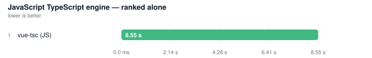

| Tool                                                    | **Median** | vs fastest |
| ------------------------------------------------------- | ---------: | ---------: |
| [vue-tsc (JS)](https://github.com/vuejs/language-tools) | **8.55 s** |      1.00x |

### Peak RSS

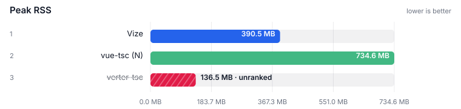

| Tool                                                    | **Peak RSS** |
| ------------------------------------------------------- | -----------: |
| [vue-tsc (JS)](https://github.com/vuejs/language-tools) |     505.3 MB |

### Native tsgo engines — ranked together

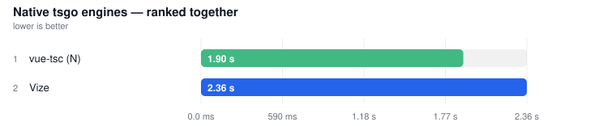

| Tool                                                                     | **Median** | vs fastest |
| ------------------------------------------------------------------------ | ---------: | ---------: |
| [vue-tsc (N)](https://github.com/johnsoncodehk/typescript-native-bridge) | **1.90 s** |      1.00x |
| [Vize](https://github.com/ubugeeei-prod/vize)                            | **2.36 s** |      1.24x |

**Not ranked**

- **[verter-tsc](https://github.com/pikax/verter)**: FAILED DIAGNOSTIC-CENSUS GATE — the baseline reported 0 diagnostics and exited 0, so a checker that agrees must also exit 0; this row exited 1 while reporting 11 diagnostic(s) against a clean reference — a non-zero exit …
- **[Golar typecheck](https://github.com/auvred/golar)**: skipped

### Peak RSS


| Tool                                                                     | **Peak RSS** |
| ------------------------------------------------------------------------ | -----------: |
| [verter-tsc](https://github.com/pikax/verter) ⚠                          |     136.5 MB |
| [Vize](https://github.com/ubugeeei-prod/vize)                            |     390.5 MB |
| [vue-tsc (N)](https://github.com/johnsoncodehk/typescript-native-bridge) |     734.6 MB |

**Not ranked**

- **[verter-tsc](https://github.com/pikax/verter)**: unranked

# vue-vben-admin

<!-- source: real-world-Linux-vue-vben-admin.md -->

> 📄 **[Full details →](docs/results/real-world-Linux-vue-vben-admin.md)** — methodology, per-row notes and raw runs (41 collapsed block(s) moved out of this page).

## Project test suite — vue-vben-admin:core-ui

Files: **330** · Bytes: **933,224**


| Tool                                                                               |  **Median** | vs fastest |
| ---------------------------------------------------------------------------------- | ----------: | ---------: |
| vben-admin-monorepo — project's own toolchain (baseline)                           | **10.77 s** |      1.00x |
| vben-admin-monorepo — unplugin-vue                                                 | **11.12 s** |      1.03x |
| [vben-admin-monorepo — @verter/unplugin](https://github.com/pikax/verter)          | **11.22 s** |      1.04x |
| [vben-admin-monorepo — @vizejs/vite-plugin](https://github.com/ubugeeei-prod/vize) | **41.94 s** |      3.90x |

### Peak RSS

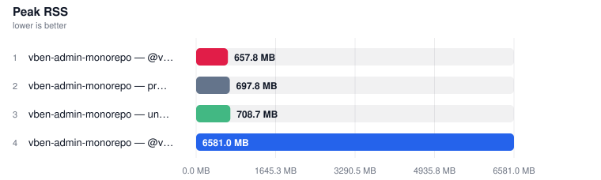

| Tool                                                                               | **Peak RSS** |
| ---------------------------------------------------------------------------------- | -----------: |
| [vben-admin-monorepo — @verter/unplugin](https://github.com/pikax/verter)          |     657.8 MB |
| vben-admin-monorepo — project's own toolchain (baseline)                           |     697.8 MB |
| vben-admin-monorepo — unplugin-vue                                                 |     708.7 MB |
| [vben-admin-monorepo — @vizejs/vite-plugin](https://github.com/ubugeeei-prod/vize) |    6581.0 MB |

## Project typecheck (own tsconfig) — vue-vben-admin:core-ui

Files: **330** · Bytes: **933,224**

### JavaScript TypeScript engine — ranked alone

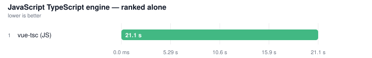

| Tool                                                    |  **Median** | vs fastest |
| ------------------------------------------------------- | ----------: | ---------: |
| [vue-tsc (JS)](https://github.com/vuejs/language-tools) | **21.14 s** |      1.00x |

### Peak RSS

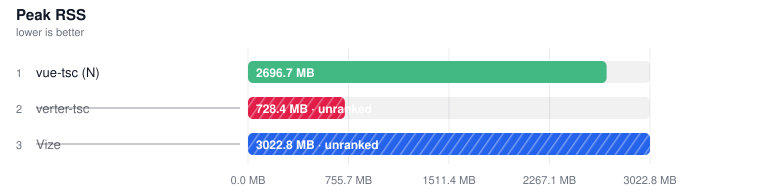

| Tool                                                    | **Peak RSS** |
| ------------------------------------------------------- | -----------: |
| [vue-tsc (JS)](https://github.com/vuejs/language-tools) |    1672.6 MB |

### Native tsgo engines — ranked together


| Tool                                                                     |  **Median** | vs fastest |
| ------------------------------------------------------------------------ | ----------: | ---------: |
| [vue-tsc (N)](https://github.com/johnsoncodehk/typescript-native-bridge) | **10.26 s** |      1.00x |

**Not ranked**

- **[verter-tsc](https://github.com/pikax/verter)**: FAILED DIAGNOSTIC-CENSUS GATE — the baseline reported 0 diagnostics and exited 0, so a checker that agrees must also exit 0; this row exited 1 while reporting 156 diagnostic(s) against a clean reference — a non-zero exit…
- **[Vize](https://github.com/ubugeeei-prod/vize)**: FAILED DIAGNOSTIC-CENSUS GATE — the baseline reported 0 diagnostics and exited 0, so a checker that agrees must also exit 0; this row exited 1 while reporting 21 diagnostic(s) against a clean reference — a non-zero exit …
- **[Golar typecheck](https://github.com/auvred/golar)**: skipped

### Peak RSS


| Tool                                                                     | **Peak RSS** |
| ------------------------------------------------------------------------ | -----------: |
| [verter-tsc](https://github.com/pikax/verter) ⚠                          |     728.4 MB |
| [vue-tsc (N)](https://github.com/johnsoncodehk/typescript-native-bridge) |    2696.7 MB |
| [Vize](https://github.com/ubugeeei-prod/vize) ⚠                          |    3022.8 MB |

**Not ranked**

- **[verter-tsc](https://github.com/pikax/verter)**: unranked
- **[Vize](https://github.com/ubugeeei-prod/vize)**: unranked

# vuetify

<!-- source: real-world-Linux-vuetify.md -->

> 📄 **[Full details →](docs/results/real-world-Linux-vuetify.md)** — methodology, per-row notes and raw runs (45 collapsed block(s) moved out of this page).

## Project test suite — vuetify:docs

Files: **1,246** · Bytes: **2,032,022**


| Tool                                                                   |  **Median** | vs fastest |
| ---------------------------------------------------------------------- | ----------: | ---------: |
| vuetify — unplugin-vue                                                 | **45.05 s** |      1.00x |
| [vuetify — @verter/unplugin](https://github.com/pikax/verter)          | **45.20 s** |      1.00x |
| vuetify — project's own toolchain (baseline)                           | **45.27 s** |      1.00x |
| [vuetify — @vizejs/vite-plugin](https://github.com/ubugeeei-prod/vize) | **46.06 s** |      1.02x |

### Peak RSS

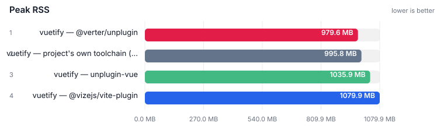

| Tool                                                                   | **Peak RSS** |
| ---------------------------------------------------------------------- | -----------: |
| [vuetify — @verter/unplugin](https://github.com/pikax/verter)          |     979.6 MB |
| vuetify — project's own toolchain (baseline)                           |     995.8 MB |
| vuetify — unplugin-vue                                                 |    1035.9 MB |
| [vuetify — @vizejs/vite-plugin](https://github.com/ubugeeei-prod/vize) |    1079.9 MB |

## Project typecheck (own tsconfig) — vuetify:docs

Files: **1,246** · Bytes: **2,032,022**

### JavaScript TypeScript engine — ranked alone


| Tool                                                    |  **Median** | vs fastest |
| ------------------------------------------------------- | ----------: | ---------: |
| [vue-tsc (JS)](https://github.com/vuejs/language-tools) | **31.12 s** |      1.00x |

### Peak RSS

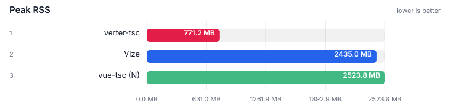

| Tool                                                    | **Peak RSS** |
| ------------------------------------------------------- | -----------: |
| [vue-tsc (JS)](https://github.com/vuejs/language-tools) |    2080.2 MB |

### Native tsgo engines — ranked together

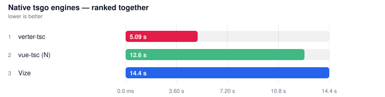

| Tool                                                                     |  **Median** | vs fastest |
| ------------------------------------------------------------------------ | ----------: | ---------: |
| [verter-tsc](https://github.com/pikax/verter)                            |  **5.09 s** |      1.00x |
| [vue-tsc (N)](https://github.com/johnsoncodehk/typescript-native-bridge) | **12.64 s** |      2.48x |
| [Vize](https://github.com/ubugeeei-prod/vize)                            | **14.39 s** |      2.83x |

**Not ranked**

- **[Golar typecheck](https://github.com/auvred/golar)**: skipped

### Peak RSS


| Tool                                                                     | **Peak RSS** |
| ------------------------------------------------------------------------ | -----------: |
| [verter-tsc](https://github.com/pikax/verter)                            |     771.2 MB |
| [Vize](https://github.com/ubugeeei-prod/vize)                            |    2435.0 MB |
| [vue-tsc (N)](https://github.com/johnsoncodehk/typescript-native-bridge) |    2523.8 MB |

<!-- REAL_WORLD_RESULTS_END -->

## Memory

<!-- MEMORY_SUMMARY_START -->

> Auto-updated 2026-08-19 from the **Benchmark** workflow (`memory` job). Peak RSS; isolated from timing.
> Peak RSS for compile / typecheck / format / lint / component-meta / LSP sits next to those timing tables. Full probe (every surface, min/max/avg, CPU): [MEMORY.md](MEMORY.md) · source `memory-linux-100.md`.

<!-- MEMORY_SUMMARY_END -->

## Contributing

See [CONTRIBUTING.md](./CONTRIBUTING.md). Security reports: [SECURITY.md](./SECURITY.md).

## License

[MIT](./LICENSE)
