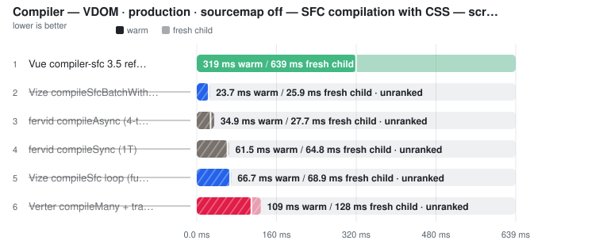
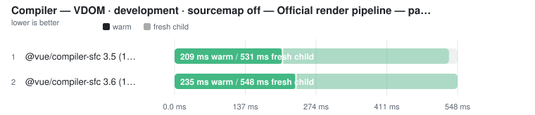
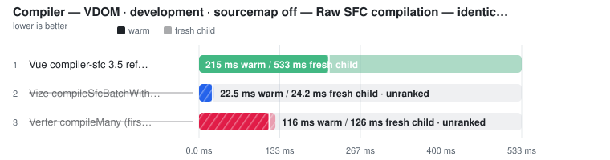
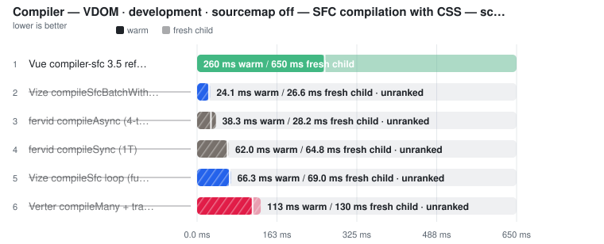
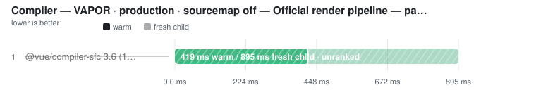
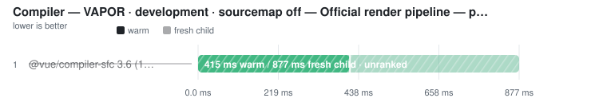
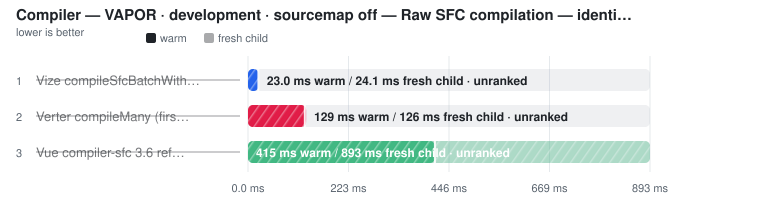
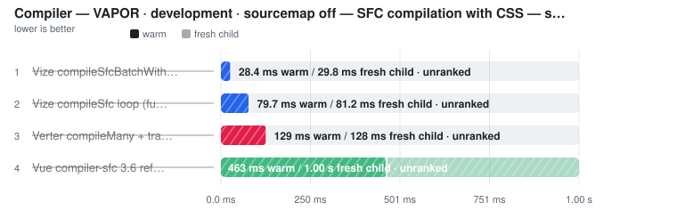
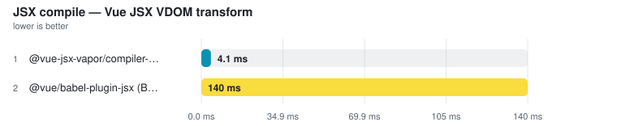

# Compiler

> Auto-generated from the JSON snapshots in [`results/benchmarks/`](../results/benchmarks/) and [`results/real_world/`](../results/real_world/) by `pnpm docs`. Do not edit by hand.

- **Generated:** 2026-08-27T10:24:48.274Z
- **Fixture:** `fixtures/200` (200 files)
- **Runs / warmups:** 5 / 1
- **Runner:** Linux · linux/x64 · 4 CPUs · Intel(R) Xeon(R) Platinum 8370C CPU @ 2.80GHz · 15.6 GB · Node v22.23.2
- **Commit:** [`abafafd`](https://github.com/pikax/vue-benchmarks/commit/abafafd07c14f26c07f1d0ed9da818102fdc97e1)
- **CI run:** https://github.com/pikax/vue-benchmarks/actions/runs/33062210774
- **Source:** `results/benchmarks/bench-Linux-200-bench.json`

## Results

Ranked on the **median of measured runs**. Warm series follow ≥1 discarded warmup and are the primary ordering and ranking metric wherever both series exist. Compiler and Component-meta additionally publish a separately sampled **Fresh child** column: the first timed row workload in a new child process, after excluded process startup and package imports. It is not called Cold and its ratio/noise gate never substitutes for Warm. What else the child excludes differs by surface and each surface states it in its own methodology — Compiler builds its compiler host outside the timer, Component-meta builds its checker/session inside it, because its warm timer does too. Every table sorts fastest-first and every ratio column is **vs fastest** — the fastest ranked row is the 1.00x denominator; no tool is pinned as a reference. One table per surface unless that surface declares explicit work-equivalence classes; engine, invocation and threading are row properties, not implicit table splits — rows tagged **(JS)** run the JavaScript TypeScript compiler (a cross-engine ratio measures TypeScript's rewrite as much as the tool), and a row's label/notes say whether it is a CLI (pays process startup every run), an in-process API, single-threaded or a thread pool. Name markers: ⚠ failed validation (time bracketed, unranked) · ❌ error · ⏭ skipped. A row above CV 50% with at least three warm samples is bracketed as TOO NOISY TO RANK, no tool exempted (a two-run spread has no third sample to adjudicate, so it is flagged, not bracketed). Per-row detail is under **Notes** below each table.

> **Peak RSS** on a timing row is the tool's peak resident set: measured in the timed session where the runner samples it (LSP servers, real-world CLIs), otherwise injected from the isolated memory probe below — the probe runs each tool in its own process, separate from timing.

### Compiler

Files: **200** · Bytes: **285,701**

**Vue-anchored apples-to-apples compiler results.** Each target/environment/source-map cell contains two candidate-comparison subsections: Raw SFC compilation gives Vue, Vize batch and Verter first-admission the same revised style-free SFC strings; SFC compilation with CSS gives the style-capable entrypoints the same revised style-bearing SFCs and counts both generated JS and CSS. Every measured row publishes Fresh child and Warm separately when both samplers succeed. Ratios never cross these subsections and always use the official Vue workload as 1.00x. A failed semantic gate leaves both measured times visible but unranked.

#### VDOM · production · sourcemap off

Target: `vdom` · Environment: `production` · Source map: `off`

##### Official render pipeline — parse + script + template

<picture>
  <source media="(prefers-color-scheme: dark)" srcset="charts/compiler-bench-linux-200-bench-compile-vdom-production-sourcemap-0pklqxc-dark.svg">
  
</picture>

| Tool | Fresh child | Fresh min | Fresh stddev | Fresh CV% | vs fastest fresh child | **Warm (primary)** | Warm min | Warm stddev | Warm CV% | vs fastest warm | Code bytes | Throughput | Peak RSS |
| --- | ---: | ---: | ---: | ---: | ---: | ---: | ---: | ---: | ---: | ---: | ---: | ---: | ---: |
| @vue/compiler-sfc 3.5 (1T) | 497.0 ms | 473.7 ms | 14.0 ms | 2.8% | 1.01x | **231.9 ms** | 202.1 ms | 27.3 ms | 11.8% ⚠ | 1.00x | 735,261 | 863 files/s | 63.7 MB |
| @vue/compiler-sfc 3.6 (1T) | 493.1 ms | 489.6 ms | 23.6 ms | 4.8% | 1.00x | **260.2 ms** | 254.8 ms | 10.9 ms | 4.2% | 1.12x | 735,261 | 769 files/s | 62.2 MB |

Notes

- **@vue/compiler-sfc 3.5 (1T)**: Official 3.5 VDOM, isProd=true, sourceMap=false, single-threaded ✓ RUNTIME SEMANTIC VALIDITY: 31/31 independent observable-behaviour plants passed through parse → compileScript(inlineTemplate=false) → compileTemplate.
- **@vue/compiler-sfc 3.6 (1T)**: Official 3.6 VDOM, isProd=true, sourceMap=false ✓ RUNTIME SEMANTIC VALIDITY: 31/31 independent observable-behaviour plants passed through parse → compileScript(inlineTemplate=false) → compileTemplate.

##### Raw SFC compilation — identical changed inputs; no output-cache reuse

<picture>
  <source media="(prefers-color-scheme: dark)" srcset="charts/compiler-bench-linux-200-bench-compile-vdom-production-sourcemap-0eptotg-dark.svg">
  
</picture>

| Tool | Fresh child | Fresh min | Fresh stddev | Fresh CV% | vs fastest fresh child | **Warm (primary)** | Warm min | Warm stddev | Warm CV% | vs fastest warm | Generated JS bytes | Throughput | Peak RSS |
| --- | ---: | ---: | ---: | ---: | ---: | ---: | ---: | ---: | ---: | ---: | ---: | ---: | ---: |
| Vue compiler-sfc 3.5 reference (raw render, 1T) | 493.0 ms | 478.3 ms | 28.7 ms | 5.8% | 1.00x | **238.5 ms** | 216.9 ms | 12.7 ms | 5.3% | 1.00x | 735,061 | 839 files/s | – |
| Vize compileSfcBatchWithResults (raw render) ⚠ | (23.6 ms) | (23.4 ms) | (0.2 ms) | (1.0%) | not ranked | (22.2 ms) | (21.8 ms) | (0.4 ms) | (1.9%) | not ranked | (673,914) | – | (17.4 MB) |
| Verter compileMany (first-admission stateless raw render) ⚠ | (120.5 ms) | (117.9 ms) | (2.5 ms) | (2.1%) | not ranked | (116.5 ms) | (115.8 ms) | (2.4 ms) | (2.0%) | not ranked | (528,623) | – | (35.7 MB) |

Notes

- **Vue compiler-sfc 3.5 reference (raw render, 1T)**: REFERENCE BASELINE: official @vue/compiler-sfc parse + compileScript + compileTemplate, sourceMap=false, isProd=true. Receives the same style-free, per-pass-revised SFC strings as the native candidates. Every script/template block changes on every pass; input construction is outside the timer. Vue is the ratio denominator even when a candidate is faster. ✓ RUNTIME SEMANTIC VALIDITY: 31/31 independent observable-behaviour plants passed through parse → compileScript(inlineTemplate=false) → compileTemplate.
- **Vize compileSfcBatchWithResults (raw render) ⚠**: CANDIDATE VS VUE RAW BASELINE: compileSfcBatchWithResults vapor=false, isTs=true, templateHoistStatic=true, templateCacheHandlers=true, includeSourceMap=false; receives the exact same style-free, per-pass-revised strings as Vue and Verter. Every input body differs between passes, so a previous whole-output artifact cannot directly satisfy the call. Source inspection finds per-call parse/compile/codegen and no generated-output cache on this standalone entry point; the harness does not claim more granular internal reuse than it can observe. Warm samples reuse the process-global Rayon pool. A Fresh-child sample excludes package import, so it does not prove the pool, allocator, JIT or all native state began untouched. Ordinary allocator reuse is not instrumented and remains UNKNOWN. Input construction is outside the timer. ⚠ RUNTIME SEMANTIC VALIDITY FAIL (26/31 passed) — runtime-props-defaults-reactivity [runtime]: reactive props: expected "updated:7", got "fallback:2"; object-dynamic-bindings-events [runtime]: initial dynamic argument: expected "idle", got undefined; dynamic-event-name-handler-removal [runtime]: initial dynamic event: expected "1", got "0"; +2 more (all retained in JSON). Generated text is not compared; these are observable runtime/API outcomes. Full per-plant results are retained in validation.compileSemantics.
- **Verter compileMany (first-admission stateless raw render) ⚠**: CANDIDATE VS VUE RAW BASELINE: runtime-render forceVapor=false, isProduction=true, forceJs=false, sourceMap=false, hmr=none, requestedMode=stateless, analysis=full. Receives the exact same style-free, per-pass-revised strings as Vue and Vize. Each pass gets a fresh workspace-backed host/project, created outside the timer, so the timed compileMany call measures first source admission rather than incremental edits on a populated host. cacheHit must remain zero. Warm samples retain process/native-library state; Fresh-child samples exclude package import and host construction, so neither metric claims wholly untouched global state. No host-owned parsed or semantic state crosses passes. ⚠ RUNTIME SEMANTIC VALIDITY FAIL (23/31 passed) — svg-namespace-reactivity [runtime]: reactive SVG attribute: expected "9", got "4"; dynamic-event-name-handler-removal [runtime]: initial dynamic event: expected "1", got "0"; template-refs-v-for-update [runtime]: itemElements.value.map is not a function; +5 more (all retained in JSON). Generated text is not compared; these are observable runtime/API outcomes. Full per-plant results are retained in validation.compileSemantics.

##### SFC compilation with CSS — script, template and style changed

<picture>
  <source media="(prefers-color-scheme: dark)" srcset="charts/compiler-bench-linux-200-bench-compile-vdom-production-sourcemap-13l0zgz-dark.svg">
  
</picture>

| Tool | Fresh child | Fresh min | Fresh stddev | Fresh CV% | vs fastest fresh child | **Warm (primary)** | Warm min | Warm stddev | Warm CV% | vs fastest warm | Generated JS + CSS bytes | Throughput | Peak RSS |
| --- | ---: | ---: | ---: | ---: | ---: | ---: | ---: | ---: | ---: | ---: | ---: | ---: | ---: |
| Vue compiler-sfc 3.5 reference (render + CSS, 1T) | 561.1 ms | 554.8 ms | 38.1 ms | 6.8% | 1.00x | **295.0 ms** | 254.7 ms | 26.4 ms | 8.9% | 1.00x | 769,363 | 678 files/s | 66.9 MB |
| Vize compileSfc loop (full SFC, 1T) ⚠ | (63.1 ms) | (62.6 ms) | (0.5 ms) | (0.7%) | not ranked | (62.5 ms) | (61.6 ms) | (1.7 ms) | (2.8%) | not ranked | (707,196) | – | (15.7 MB) |
| Vize compileSfcBatchWithResults (render + CSS, Rayon batch) ⚠ | (24.6 ms) | (24.5 ms) | (3.0 ms) | (12.1%) | not ranked | (23.3 ms) | (23.2 ms) | (0.4 ms) | (1.7%) | not ranked | (707,196) | – | (17.6 MB) |
| fervid compileSync (1T) ⚠ | (54.5 ms) | (54.1 ms) | (0.4 ms) | (0.8%) | not ranked | (52.5 ms) | (52.0 ms) | (0.4 ms) | (0.8%) | not ranked | (886,876) | – | (15.9 MB) |
| fervid compileAsync (4-thread libuv pool) ⚠ | (25.3 ms) | (25.0 ms) | (0.8 ms) | (3.2%) | not ranked | (26.0 ms) | (24.7 ms) | (1.3 ms) | (5.0%) | not ranked | (886,876) | – | – |
| Verter compileMany + processStyle (render + CSS) ⚠ | (127.7 ms) | (118.9 ms) | (4.7 ms) | (3.7%) | not ranked | (123.7 ms) | (120.3 ms) | (3.0 ms) | (2.4%) | not ranked | (592,613) | – | (38.0 MB) |

Notes

- **Vue compiler-sfc 3.5 reference (render + CSS, 1T)**: REFERENCE BASELINE: official @vue/compiler-sfc parse + compileScript + compileTemplate + compileStyle for every inline plain-CSS block, sourceMap=false, isProd=true. This is a composed official compiler-sfc pipeline (Vue exposes no one-call whole-SFC compile API). Every script, template and style block changes on every pass. The fixture scope is explicit: inline plain CSS only; no preprocessor, CSS Module or external-style work is being claimed. ✓ STYLE CORRECTNESS GATE: all 16 independent CSS semantics plants passed. ✓ RUNTIME SEMANTIC VALIDITY: 31/31 independent observable-behaviour plants passed through parse → compileScript(inlineTemplate=false) → compileTemplate.
- **Vize compileSfc loop (full SFC, 1T) ⚠**: CANDIDATE VS VUE STYLE BASELINE: compileSfc vapor=false, isTs=true, templateHoistStatic=true, templateCacheHandlers=true, sourceMap=false. Receives the same per-pass-revised full SFCs; compiles script, template and inline plain-CSS style blocks. The installed binding's production/development response is capability-probed before ranking. ⚠ FAILED STYLE CORRECTNESS GATE — [slotted] slotted: slotted target must receive the [data-v-…-s] attribute selector; [global-mixed-local] global-mixed-local: local selector fragments or a scope constraint leaked into Vue's global selector; [slotted-compound] slotted-compound: the slotted scope attribute was not attached to the final compound target; [scoped-keyframes] scoped-keyframes: scoped keyframe name was not rewritten; [v-bind-quoted] v-bind-quoted: margin-left was not rewritten to a CSS variable. All 16 independent CSS semantics plants are mandatory; measured but UNRANKED. ⚠ RUNTIME SEMANTIC VALIDITY FAIL (26/31 passed) — runtime-props-defaults-reactivity [runtime]: reactive props: expected "updated:7", got "fallback:2"; object-dynamic-bindings-events [runtime]: initial dynamic argument: expected "idle", got undefined; dynamic-event-name-handler-removal [runtime]: initial dynamic event: expected "1", got "0"; +2 more (all retained in JSON). Generated text is not compared; these are observable runtime/API outcomes. Full per-plant results are retained in validation.compileSemantics.
- **Vize compileSfcBatchWithResults (render + CSS, Rayon batch) ⚠**: CANDIDATE VS VUE STYLE BASELINE: compileSfcBatchWithResults vapor=false, isTs=true, templateHoistStatic=true, templateCacheHandlers=true, includeSourceMap=false; receives the same per-pass-revised full SFCs and emits JS plus compiled CSS. Script, template and CSS all change every pass, so a prior generated output cannot satisfy this call. Warm samples reuse the process-global Rayon pool; a Fresh-child sample may still inherit native/thread/allocator effects from the excluded package import and adapter setup. Input objects are built outside the timer. The installed binding's production/development response is capability-probed before ranking. ⚠ FAILED STYLE CORRECTNESS GATE — [slotted] slotted: slotted target must receive the [data-v-…-s] attribute selector; [global-mixed-local] global-mixed-local: local selector fragments or a scope constraint leaked into Vue's global selector; [slotted-compound] slotted-compound: the slotted scope attribute was not attached to the final compound target; [scoped-keyframes] scoped-keyframes: scoped keyframe name was not rewritten; [v-bind-quoted] v-bind-quoted: margin-left was not rewritten to a CSS variable. All 16 independent CSS semantics plants are mandatory; measured but UNRANKED. ⚠ RUNTIME SEMANTIC VALIDITY FAIL (26/31 passed) — runtime-props-defaults-reactivity [runtime]: reactive props: expected "updated:7", got "fallback:2"; object-dynamic-bindings-events [runtime]: initial dynamic argument: expected "idle", got undefined; dynamic-event-name-handler-removal [runtime]: initial dynamic event: expected "1", got "0"; +2 more (all retained in JSON). Generated text is not compared; these are observable runtime/API outcomes. Full per-plant results are retained in validation.compileSemantics.
- **fervid compileSync (1T) ⚠**: compileSync isProduction=true, sourceMap=false, single-threaded. Candidate against the Vue render+CSS baseline. Receives the same per-pass-revised SFC strings and returns generated JS plus compiled CSS. ⚠ emits non-fatal NonVoidHtmlElementStartTagWithTrailingSolidus diagnostics for self-closing non-void tags (&lt;div />, &lt;MyComp />) that Vue's SFC parser accepts; codegen is complete regardless, so the row is gated on codegen produced for every file, not on diagnostic silence. ⚠ FAILED CODEGEN VALIDITY GATE — 22/200 files compiled to output that is not parseable JavaScript/TypeScript (first: Comp00008.vue: Invalid parenthesized assignment pattern. (65:100)). Time is shown in brackets and excluded from ranking: a compiler that emits broken output for part of the corpus is not doing the same work as one that does not. The gate is re-run every benchmark, so a fixed release clears this automatically. ⚠ ADAPTER PARITY FAILED between fresh-child and warm paths: artifact. ⚠ FAILED STYLE CORRECTNESS GATE — [slotted] slotted: :slotted() pseudo-selector was left in generated CSS; [global] global: :global() pseudo-selector was left in generated CSS; [v-bind] v-bind: v-bind() was not rewritten to a CSS variable; [css-modules] css-modules: class mapping was not generated or does not match emitted CSS; [global-mixed-local] global-mixed-local: :global() pseudo-selector was left in generated CSS; [slotted-compound] slotted-compound: :slotted() pseudo-selector was left in generated CSS; [is-selector-list] is-selector-list: the scope attribute was not attached outside :is(); [where-selector-list] where-selector-list: the scope attribute was not attached outside :where(); [media-scoped] media-scoped: selector nested in @media was not scope-rewritten; [scoped-keyframes] scoped-keyframes: scoped keyframe name was not rewritten; [v-bind-multiple] v-bind-multiple: v-bind() was not rewritten to a CSS variable; [v-bind-quoted] v-bind-quoted: v-bind() was not rewritten to a CSS variable. All 16 independent CSS semantics plants are mandatory; measured but UNRANKED. ⚠ RUNTIME SEMANTIC VALIDITY FAIL (21/31 passed) — object-dynamic-bindings-events [runtime]: initial v-bind object: expected "first", got undefined; scoped-slot-props [runtime]: value is not defined; event-modifier-semantics [runtime]: event modifiers: expected "0|2|1|1", got "0|2|2|1"; +7 more (all retained in JSON). Generated text is not compared; these are observable runtime/API outcomes. Full per-plant results are retained in validation.compileSemantics.
- **fervid compileAsync (4-thread libuv pool) ⚠**: compileAsync isProduction=true, sourceMap=false, fanned out with Promise.all over libuv's threadpool (UV_THREADPOOL_SIZE=4, default 4 — NOT sized to core count like a Rayon pool, so on a runner with more than 4 cores this row is thread-capped below the batch rows beside it). Candidate against the Vue render+CSS baseline. Receives the same per-pass-revised SFC strings and returns generated JS plus compiled CSS. ⚠ emits non-fatal NonVoidHtmlElementStartTagWithTrailingSolidus diagnostics for self-closing non-void tags (&lt;div />, &lt;MyComp />) that Vue's SFC parser accepts; codegen is complete regardless, so the row is gated on codegen produced for every file, not on diagnostic silence. ⚠ FAILED CODEGEN VALIDITY GATE — 22/200 files compiled to output that is not parseable JavaScript/TypeScript (first: Comp00008.vue: Invalid parenthesized assignment pattern. (65:100)). Time is shown in brackets and excluded from ranking: a compiler that emits broken output for part of the corpus is not doing the same work as one that does not. The gate is re-run every benchmark, so a fixed release clears this automatically. ⚠ ADAPTER PARITY FAILED between fresh-child and warm paths: artifact. ⚠ FAILED STYLE CORRECTNESS GATE — [slotted] slotted: :slotted() pseudo-selector was left in generated CSS; [global] global: :global() pseudo-selector was left in generated CSS; [v-bind] v-bind: v-bind() was not rewritten to a CSS variable; [css-modules] css-modules: class mapping was not generated or does not match emitted CSS; [global-mixed-local] global-mixed-local: :global() pseudo-selector was left in generated CSS; [slotted-compound] slotted-compound: :slotted() pseudo-selector was left in generated CSS; [is-selector-list] is-selector-list: the scope attribute was not attached outside :is(); [where-selector-list] where-selector-list: the scope attribute was not attached outside :where(); [media-scoped] media-scoped: selector nested in @media was not scope-rewritten; [scoped-keyframes] scoped-keyframes: scoped keyframe name was not rewritten; [v-bind-multiple] v-bind-multiple: v-bind() was not rewritten to a CSS variable; [v-bind-quoted] v-bind-quoted: v-bind() was not rewritten to a CSS variable. All 16 independent CSS semantics plants are mandatory; measured but UNRANKED. ⚠ RUNTIME SEMANTIC VALIDITY FAIL (21/31 passed) — object-dynamic-bindings-events [runtime]: initial v-bind object: expected "first", got undefined; scoped-slot-props [runtime]: value is not defined; event-modifier-semantics [runtime]: event modifiers: expected "0|2|1|1", got "0|2|2|1"; +7 more (all retained in JSON). Generated text is not compared; these are observable runtime/API outcomes. Full per-plant results are retained in validation.compileSemantics.
- **Verter compileMany + processStyle (render + CSS) ⚠**: CANDIDATE VS VUE STYLE BASELINE: runtime-render plus one public processStyle call per style block; forceVapor=false, isProduction=true, forceJs=false, sourceMap=false, requestedMode=stateless, analysis=full. Receives the same per-pass-revised full SFCs and exact revised CSS contents as Vue/Vize. Each pass gets a fresh workspace-backed host/project, created outside the timer; compileMany performs first admission inside the timer. processStyle is synchronous and called serially on the JS thread. cacheHit must stay zero. ⚠ FAILED STYLE CORRECTNESS GATE — [deep] deep: scope attribute must remain on .deep-host while .deep-target becomes an unscoped descendant; [v-bind] v-bind: JS registers "--927b501a-color" but Vue's useCssVars runtime adds another -- prefix, so runtime output cannot match emitted CSS var(--927b501a-color); [global-mixed-local] global-mixed-local: local selector fragments or a scope constraint leaked into Vue's global selector; [slotted-compound] slotted-compound: the slotted scope attribute was not attached to the final compound target; [is-selector-list] is-selector-list: the complete :is() selector list was not preserved; [where-selector-list] where-selector-list: the complete :where() selector list was not preserved; [scoped-keyframes] scoped-keyframes: scoped keyframe name was not rewritten; [v-bind-multiple] v-bind-multiple: JS registers "--7d8c9d6c-color" but Vue's useCssVars runtime adds another -- prefix, so runtime output cannot match emitted CSS var(--7d8c9d6c-color); [v-bind-quoted] v-bind-quoted: JS registers "--ac901a1e-theme_gap" but Vue's useCssVars runtime adds another -- prefix, so runtime output cannot match emitted CSS var(--ac901a1e-theme_gap). All 16 independent CSS semantics plants are mandatory; measured but UNRANKED. ⚠ RUNTIME SEMANTIC VALIDITY FAIL (23/31 passed) — svg-namespace-reactivity [runtime]: reactive SVG attribute: expected "9", got "4"; dynamic-event-name-handler-removal [runtime]: initial dynamic event: expected "1", got "0"; template-refs-v-for-update [runtime]: itemElements.value.map is not a function; +5 more (all retained in JSON). Generated text is not compared; these are observable runtime/API outcomes. Full per-plant results are retained in validation.compileSemantics.

Raw runs

- **@vue/compiler-sfc 3.5 (1T)**: Fresh child (first timed row workload): 506.0 ms, 473.7 ms, 497.0 ms, 497.3 ms, 477.2 ms · Warm: 245.7 ms, 231.9 ms, 276.8 ms, 228.1 ms, 202.1 ms
- **@vue/compiler-sfc 3.6 (1T)**: Fresh child (first timed row workload): 545.8 ms, 489.6 ms, 499.0 ms, 493.1 ms, 492.5 ms · Warm: 279.8 ms, 274.9 ms, 259.1 ms, 254.8 ms, 260.2 ms
- **Vue compiler-sfc 3.5 reference (raw render, 1T)**: Fresh child (first timed row workload): 552.6 ms, 493.0 ms, 492.8 ms, 497.7 ms, 478.3 ms · Warm: 243.6 ms, 241.6 ms, 238.5 ms, 219.8 ms, 216.9 ms
- **Vize compileSfcBatchWithResults (raw render)**: Fresh child (first timed row workload): 23.9 ms, 23.6 ms, 23.4 ms, 23.4 ms, 23.8 ms · Warm: 21.8 ms, 22.2 ms, 22.8 ms, 22.6 ms, 22.0 ms
- **Verter compileMany (first-admission stateless raw render)**: Fresh child (first timed row workload): 124.6 ms, 120.5 ms, 121.0 ms, 119.4 ms, 117.9 ms · Warm: 121.2 ms, 115.8 ms, 116.5 ms, 119.4 ms, 116.2 ms
- **Vue compiler-sfc 3.5 reference (render + CSS, 1T)**: Fresh child (first timed row workload): 645.8 ms, 561.1 ms, 570.9 ms, 559.2 ms, 554.8 ms · Warm: 325.6 ms, 303.7 ms, 295.0 ms, 280.9 ms, 254.7 ms
- **Vize compileSfc loop (full SFC, 1T)**: Fresh child (first timed row workload): 63.1 ms, 63.3 ms, 62.8 ms, 63.8 ms, 62.6 ms · Warm: 63.5 ms, 61.6 ms, 62.5 ms, 61.8 ms, 65.8 ms
- **Vize compileSfcBatchWithResults (render + CSS, Rayon batch)**: Fresh child (first timed row workload): 31.4 ms, 24.6 ms, 24.5 ms, 24.5 ms, 25.6 ms · Warm: 23.3 ms, 23.2 ms, 24.1 ms, 23.9 ms, 23.3 ms
- **fervid compileSync (1T)**: Fresh child (first timed row workload): 54.5 ms, 54.4 ms, 55.0 ms, 54.1 ms, 55.1 ms · Warm: 52.5 ms, 52.0 ms, 52.6 ms, 52.1 ms, 53.1 ms
- **fervid compileAsync (4-thread libuv pool)**: Fresh child (first timed row workload): 26.0 ms, 25.1 ms, 26.9 ms, 25.0 ms, 25.3 ms · Warm: 27.2 ms, 24.7 ms, 27.9 ms, 26.0 ms, 25.3 ms
- **Verter compileMany + processStyle (render + CSS)**: Fresh child (first timed row workload): 130.2 ms, 130.6 ms, 127.5 ms, 118.9 ms, 127.7 ms · Warm: 124.6 ms, 120.3 ms, 122.4 ms, 128.2 ms, 123.7 ms

#### VDOM · development · sourcemap off

Target: `vdom` · Environment: `development` · Source map: `off`

##### Official render pipeline — parse + script + template

<picture>
  <source media="(prefers-color-scheme: dark)" srcset="charts/compiler-bench-linux-200-bench-compile-vdom-development-sourcema-0qe4p0q-dark.svg">
  
</picture>

| Tool | Fresh child | Fresh min | Fresh stddev | Fresh CV% | vs fastest fresh child | **Warm (primary)** | Warm min | Warm stddev | Warm CV% | vs fastest warm | Code bytes | Throughput |
| --- | ---: | ---: | ---: | ---: | ---: | ---: | ---: | ---: | ---: | ---: | ---: | ---: |
| @vue/compiler-sfc 3.5 (1T) | 476.8 ms | 470.3 ms | 11.7 ms | 2.4% | 1.00x | **220.6 ms** | 208.0 ms | 5.9 ms | 2.7% | 1.00x | 721,735 | 907 files/s |
| @vue/compiler-sfc 3.6 (1T) | 490.9 ms | 484.9 ms | 8.3 ms | 1.7% | 1.03x | **244.0 ms** | 236.1 ms | 8.7 ms | 3.6% | 1.11x | 721,735 | 820 files/s |

Notes

- **@vue/compiler-sfc 3.5 (1T)**: Official 3.5 VDOM, isProd=false, sourceMap=false, single-threaded ✓ RUNTIME SEMANTIC VALIDITY: 31/31 independent observable-behaviour plants passed through parse → compileScript(inlineTemplate=false) → compileTemplate.
- **@vue/compiler-sfc 3.6 (1T)**: Official 3.6 VDOM, isProd=false, sourceMap=false ✓ RUNTIME SEMANTIC VALIDITY: 31/31 independent observable-behaviour plants passed through parse → compileScript(inlineTemplate=false) → compileTemplate.

##### Raw SFC compilation — identical changed inputs; no output-cache reuse

<picture>
  <source media="(prefers-color-scheme: dark)" srcset="charts/compiler-bench-linux-200-bench-compile-vdom-development-sourcema-0nmx41y-dark.svg">
  
</picture>

| Tool | Fresh child | Fresh min | Fresh stddev | Fresh CV% | vs fastest fresh child | **Warm (primary)** | Warm min | Warm stddev | Warm CV% | vs fastest warm | Generated JS bytes | Throughput |
| --- | ---: | ---: | ---: | ---: | ---: | ---: | ---: | ---: | ---: | ---: | ---: | ---: |
| Vue compiler-sfc 3.5 reference (raw render, 1T) | 481.6 ms | 472.4 ms | 5.9 ms | 1.2% | 1.00x | **217.4 ms** | 210.2 ms | 13.5 ms | 6.2% | 1.00x | 721,535 | 920 files/s |
| Vize compileSfcBatchWithResults (raw render) ⚠ | (23.0 ms) | (22.6 ms) | (0.2 ms) | (1.0%) | not ranked | (22.5 ms) | (21.5 ms) | (2.5 ms) | (11.1%) | not ranked | (668,102) | – |
| Verter compileMany (first-admission stateless raw render) ⚠ | (119.7 ms) | (117.2 ms) | (2.0 ms) | (1.7%) | not ranked | (121.2 ms) | (114.7 ms) | (3.0 ms) | (2.5%) | not ranked | (691,121) | – |

Notes

- **Vue compiler-sfc 3.5 reference (raw render, 1T)**: REFERENCE BASELINE: official @vue/compiler-sfc parse + compileScript + compileTemplate, sourceMap=false, isProd=false. Receives the same style-free, per-pass-revised SFC strings as the native candidates. Every script/template block changes on every pass; input construction is outside the timer. Vue is the ratio denominator even when a candidate is faster. ✓ RUNTIME SEMANTIC VALIDITY: 31/31 independent observable-behaviour plants passed through parse → compileScript(inlineTemplate=false) → compileTemplate.
- **Vize compileSfcBatchWithResults (raw render) ⚠**: CANDIDATE VS VUE RAW BASELINE: compileSfcBatchWithResults vapor=false, isTs=true, templateHoistStatic=false, templateCacheHandlers=false, includeSourceMap=false; receives the exact same style-free, per-pass-revised strings as Vue and Verter. Every input body differs between passes, so a previous whole-output artifact cannot directly satisfy the call. Source inspection finds per-call parse/compile/codegen and no generated-output cache on this standalone entry point; the harness does not claim more granular internal reuse than it can observe. Warm samples reuse the process-global Rayon pool. A Fresh-child sample excludes package import, so it does not prove the pool, allocator, JIT or all native state began untouched. Ordinary allocator reuse is not instrumented and remains UNKNOWN. Input construction is outside the timer. ⚠ RUNTIME SEMANTIC VALIDITY FAIL (27/31 passed) — object-dynamic-bindings-events [runtime]: initial dynamic argument: expected "idle", got undefined; dynamic-event-name-handler-removal [runtime]: initial dynamic event: expected "1", got "0"; template-only-sfc [module-load]: compiled module has no default export; +1 more (all retained in JSON). Generated text is not compared; these are observable runtime/API outcomes. Full per-plant results are retained in validation.compileSemantics.
- **Verter compileMany (first-admission stateless raw render) ⚠**: CANDIDATE VS VUE RAW BASELINE: runtime-render forceVapor=false, isProduction=false, forceJs=false, sourceMap=false, hmr=vite, requestedMode=stateless, analysis=full. Receives the exact same style-free, per-pass-revised strings as Vue and Vize. Each pass gets a fresh workspace-backed host/project, created outside the timer, so the timed compileMany call measures first source admission rather than incremental edits on a populated host. cacheHit must remain zero. Warm samples retain process/native-library state; Fresh-child samples exclude package import and host construction, so neither metric claims wholly untouched global state. No host-owned parsed or semantic state crosses passes. ⚠ RUNTIME SEMANTIC VALIDITY FAIL (24/31 passed) — svg-namespace-reactivity [runtime]: reactive SVG attribute: expected "9", got "4"; dynamic-event-name-handler-removal [runtime]: initial dynamic event: expected "1", got "0"; template-refs-v-for-update [runtime]: itemElements.value.map is not a function; +4 more (all retained in JSON). Generated text is not compared; these are observable runtime/API outcomes. Full per-plant results are retained in validation.compileSemantics.

##### SFC compilation with CSS — script, template and style changed

<picture>
  <source media="(prefers-color-scheme: dark)" srcset="charts/compiler-bench-linux-200-bench-compile-vdom-development-sourcema-15udlyl-dark.svg">
  
</picture>

| Tool | Fresh child | Fresh min | Fresh stddev | Fresh CV% | vs fastest fresh child | **Warm (primary)** | Warm min | Warm stddev | Warm CV% | vs fastest warm | Generated JS + CSS bytes | Throughput |
| --- | ---: | ---: | ---: | ---: | ---: | ---: | ---: | ---: | ---: | ---: | ---: | ---: |
| Vue compiler-sfc 3.5 reference (render + CSS, 1T) | 555.5 ms | 550.8 ms | 7.9 ms | 1.4% | 1.00x | **254.2 ms** | 249.4 ms | 12.2 ms | 4.8% | 1.00x | 755,837 | 787 files/s |
| Vize compileSfc loop (full SFC, 1T) ⚠ | (61.9 ms) | (61.3 ms) | (0.6 ms) | (1.0%) | not ranked | (62.9 ms) | (60.8 ms) | (1.3 ms) | (2.1%) | not ranked | (701,384) | – |
| Vize compileSfcBatchWithResults (render + CSS, Rayon batch) ⚠ | (23.9 ms) | (23.9 ms) | (0.4 ms) | (1.5%) | not ranked | (23.9 ms) | (23.2 ms) | (0.6 ms) | (2.7%) | not ranked | (701,384) | – |
| fervid compileSync (1T) ⚠ | (55.0 ms) | (54.5 ms) | (0.5 ms) | (0.8%) | not ranked | (56.0 ms) | (53.4 ms) | (8.0 ms) | (14.3%) | not ranked | (897,281) | – |
| fervid compileAsync (4-thread libuv pool) ⚠ | (26.0 ms) | (25.3 ms) | (0.5 ms) | (1.9%) | not ranked | (26.3 ms) | (25.8 ms) | (12.5 ms) | (47.6%) | not ranked | (897,281) | – |
| Verter compileMany + processStyle (render + CSS) ⚠ | (132.4 ms) | (124.5 ms) | (3.6 ms) | (2.7%) | not ranked | (124.7 ms) | (122.6 ms) | (5.2 ms) | (4.2%) | not ranked | (755,511) | – |

Notes

- **Vue compiler-sfc 3.5 reference (render + CSS, 1T)**: REFERENCE BASELINE: official @vue/compiler-sfc parse + compileScript + compileTemplate + compileStyle for every inline plain-CSS block, sourceMap=false, isProd=false. This is a composed official compiler-sfc pipeline (Vue exposes no one-call whole-SFC compile API). Every script, template and style block changes on every pass. The fixture scope is explicit: inline plain CSS only; no preprocessor, CSS Module or external-style work is being claimed. ✓ STYLE CORRECTNESS GATE: all 16 independent CSS semantics plants passed. ✓ RUNTIME SEMANTIC VALIDITY: 31/31 independent observable-behaviour plants passed through parse → compileScript(inlineTemplate=false) → compileTemplate.
- **Vize compileSfc loop (full SFC, 1T) ⚠**: CANDIDATE VS VUE STYLE BASELINE: compileSfc vapor=false, isTs=true, templateHoistStatic=false, templateCacheHandlers=false, sourceMap=false. Receives the same per-pass-revised full SFCs; compiles script, template and inline plain-CSS style blocks. The installed binding's production/development response is capability-probed before ranking. ⚠ FAILED STYLE CORRECTNESS GATE — [slotted] slotted: slotted target must receive the [data-v-…-s] attribute selector; [global-mixed-local] global-mixed-local: local selector fragments or a scope constraint leaked into Vue's global selector; [slotted-compound] slotted-compound: the slotted scope attribute was not attached to the final compound target; [scoped-keyframes] scoped-keyframes: scoped keyframe name was not rewritten; [v-bind-quoted] v-bind-quoted: margin-left was not rewritten to a CSS variable. All 16 independent CSS semantics plants are mandatory; measured but UNRANKED. ⚠ RUNTIME SEMANTIC VALIDITY FAIL (27/31 passed) — object-dynamic-bindings-events [runtime]: initial dynamic argument: expected "idle", got undefined; dynamic-event-name-handler-removal [runtime]: initial dynamic event: expected "1", got "0"; template-only-sfc [module-load]: compiled module has no default export; +1 more (all retained in JSON). Generated text is not compared; these are observable runtime/API outcomes. Full per-plant results are retained in validation.compileSemantics.
- **Vize compileSfcBatchWithResults (render + CSS, Rayon batch) ⚠**: CANDIDATE VS VUE STYLE BASELINE: compileSfcBatchWithResults vapor=false, isTs=true, templateHoistStatic=false, templateCacheHandlers=false, includeSourceMap=false; receives the same per-pass-revised full SFCs and emits JS plus compiled CSS. Script, template and CSS all change every pass, so a prior generated output cannot satisfy this call. Warm samples reuse the process-global Rayon pool; a Fresh-child sample may still inherit native/thread/allocator effects from the excluded package import and adapter setup. Input objects are built outside the timer. The installed binding's production/development response is capability-probed before ranking. ⚠ FAILED STYLE CORRECTNESS GATE — [slotted] slotted: slotted target must receive the [data-v-…-s] attribute selector; [global-mixed-local] global-mixed-local: local selector fragments or a scope constraint leaked into Vue's global selector; [slotted-compound] slotted-compound: the slotted scope attribute was not attached to the final compound target; [scoped-keyframes] scoped-keyframes: scoped keyframe name was not rewritten; [v-bind-quoted] v-bind-quoted: margin-left was not rewritten to a CSS variable. All 16 independent CSS semantics plants are mandatory; measured but UNRANKED. ⚠ RUNTIME SEMANTIC VALIDITY FAIL (27/31 passed) — object-dynamic-bindings-events [runtime]: initial dynamic argument: expected "idle", got undefined; dynamic-event-name-handler-removal [runtime]: initial dynamic event: expected "1", got "0"; template-only-sfc [module-load]: compiled module has no default export; +1 more (all retained in JSON). Generated text is not compared; these are observable runtime/API outcomes. Full per-plant results are retained in validation.compileSemantics.
- **fervid compileSync (1T) ⚠**: compileSync isProduction=false, sourceMap=false, single-threaded. Candidate against the Vue render+CSS baseline. Receives the same per-pass-revised SFC strings and returns generated JS plus compiled CSS. ⚠ emits non-fatal NonVoidHtmlElementStartTagWithTrailingSolidus diagnostics for self-closing non-void tags (&lt;div />, &lt;MyComp />) that Vue's SFC parser accepts; codegen is complete regardless, so the row is gated on codegen produced for every file, not on diagnostic silence. ⚠ FAILED CODEGEN VALIDITY GATE — 22/200 files compiled to output that is not parseable JavaScript/TypeScript (first: Comp00008.vue: Invalid parenthesized assignment pattern. (41:97)). Time is shown in brackets and excluded from ranking: a compiler that emits broken output for part of the corpus is not doing the same work as one that does not. The gate is re-run every benchmark, so a fixed release clears this automatically. ⚠ ADAPTER PARITY FAILED between fresh-child and warm paths: artifact. ⚠ FAILED STYLE CORRECTNESS GATE — [slotted] slotted: :slotted() pseudo-selector was left in generated CSS; [global] global: :global() pseudo-selector was left in generated CSS; [v-bind] v-bind: v-bind() was not rewritten to a CSS variable; [css-modules] css-modules: class mapping was not generated or does not match emitted CSS; [global-mixed-local] global-mixed-local: :global() pseudo-selector was left in generated CSS; [slotted-compound] slotted-compound: :slotted() pseudo-selector was left in generated CSS; [is-selector-list] is-selector-list: the scope attribute was not attached outside :is(); [where-selector-list] where-selector-list: the scope attribute was not attached outside :where(); [media-scoped] media-scoped: selector nested in @media was not scope-rewritten; [scoped-keyframes] scoped-keyframes: scoped keyframe name was not rewritten; [v-bind-multiple] v-bind-multiple: v-bind() was not rewritten to a CSS variable; [v-bind-quoted] v-bind-quoted: v-bind() was not rewritten to a CSS variable. All 16 independent CSS semantics plants are mandatory; measured but UNRANKED. ⚠ RUNTIME SEMANTIC VALIDITY FAIL (19/31 passed) — object-dynamic-bindings-events [runtime]: initial v-bind object: expected "first", got undefined; scoped-slot-props [runtime]: value is not defined; event-modifier-semantics [runtime]: event modifiers: expected "0|2|1|1", got "0|2|2|1"; +9 more (all retained in JSON). Generated text is not compared; these are observable runtime/API outcomes. Full per-plant results are retained in validation.compileSemantics.
- **fervid compileAsync (4-thread libuv pool) ⚠**: compileAsync isProduction=false, sourceMap=false, fanned out with Promise.all over libuv's threadpool (UV_THREADPOOL_SIZE=4, default 4 — NOT sized to core count like a Rayon pool, so on a runner with more than 4 cores this row is thread-capped below the batch rows beside it). Candidate against the Vue render+CSS baseline. Receives the same per-pass-revised SFC strings and returns generated JS plus compiled CSS. ⚠ emits non-fatal NonVoidHtmlElementStartTagWithTrailingSolidus diagnostics for self-closing non-void tags (&lt;div />, &lt;MyComp />) that Vue's SFC parser accepts; codegen is complete regardless, so the row is gated on codegen produced for every file, not on diagnostic silence. ⚠ FAILED CODEGEN VALIDITY GATE — 22/200 files compiled to output that is not parseable JavaScript/TypeScript (first: Comp00008.vue: Invalid parenthesized assignment pattern. (41:97)). Time is shown in brackets and excluded from ranking: a compiler that emits broken output for part of the corpus is not doing the same work as one that does not. The gate is re-run every benchmark, so a fixed release clears this automatically. ⚠ ADAPTER PARITY FAILED between fresh-child and warm paths: artifact. ⚠ FAILED STYLE CORRECTNESS GATE — [slotted] slotted: :slotted() pseudo-selector was left in generated CSS; [global] global: :global() pseudo-selector was left in generated CSS; [v-bind] v-bind: v-bind() was not rewritten to a CSS variable; [css-modules] css-modules: class mapping was not generated or does not match emitted CSS; [global-mixed-local] global-mixed-local: :global() pseudo-selector was left in generated CSS; [slotted-compound] slotted-compound: :slotted() pseudo-selector was left in generated CSS; [is-selector-list] is-selector-list: the scope attribute was not attached outside :is(); [where-selector-list] where-selector-list: the scope attribute was not attached outside :where(); [media-scoped] media-scoped: selector nested in @media was not scope-rewritten; [scoped-keyframes] scoped-keyframes: scoped keyframe name was not rewritten; [v-bind-multiple] v-bind-multiple: v-bind() was not rewritten to a CSS variable; [v-bind-quoted] v-bind-quoted: v-bind() was not rewritten to a CSS variable. All 16 independent CSS semantics plants are mandatory; measured but UNRANKED. ⚠ RUNTIME SEMANTIC VALIDITY FAIL (19/31 passed) — object-dynamic-bindings-events [runtime]: initial v-bind object: expected "first", got undefined; scoped-slot-props [runtime]: value is not defined; event-modifier-semantics [runtime]: event modifiers: expected "0|2|1|1", got "0|2|2|1"; +9 more (all retained in JSON). Generated text is not compared; these are observable runtime/API outcomes. Full per-plant results are retained in validation.compileSemantics.
- **Verter compileMany + processStyle (render + CSS) ⚠**: CANDIDATE VS VUE STYLE BASELINE: runtime-render plus one public processStyle call per style block; forceVapor=false, isProduction=false, forceJs=false, sourceMap=false, requestedMode=stateless, analysis=full. Receives the same per-pass-revised full SFCs and exact revised CSS contents as Vue/Vize. Each pass gets a fresh workspace-backed host/project, created outside the timer; compileMany performs first admission inside the timer. processStyle is synchronous and called serially on the JS thread. cacheHit must stay zero. ⚠ FAILED STYLE CORRECTNESS GATE — [deep] deep: scope attribute must remain on .deep-host while .deep-target becomes an unscoped descendant; [v-bind] v-bind: JS registers "--927b501a-color" but Vue's useCssVars runtime adds another -- prefix, so runtime output cannot match emitted CSS var(--927b501a-color); [global-mixed-local] global-mixed-local: local selector fragments or a scope constraint leaked into Vue's global selector; [slotted-compound] slotted-compound: the slotted scope attribute was not attached to the final compound target; [is-selector-list] is-selector-list: the complete :is() selector list was not preserved; [where-selector-list] where-selector-list: the complete :where() selector list was not preserved; [scoped-keyframes] scoped-keyframes: scoped keyframe name was not rewritten; [v-bind-multiple] v-bind-multiple: JS registers "--7d8c9d6c-color" but Vue's useCssVars runtime adds another -- prefix, so runtime output cannot match emitted CSS var(--7d8c9d6c-color); [v-bind-quoted] v-bind-quoted: JS registers "--ac901a1e-theme_gap" but Vue's useCssVars runtime adds another -- prefix, so runtime output cannot match emitted CSS var(--ac901a1e-theme_gap). All 16 independent CSS semantics plants are mandatory; measured but UNRANKED. ⚠ RUNTIME SEMANTIC VALIDITY FAIL (24/31 passed) — svg-namespace-reactivity [runtime]: reactive SVG attribute: expected "9", got "4"; dynamic-event-name-handler-removal [runtime]: initial dynamic event: expected "1", got "0"; template-refs-v-for-update [runtime]: itemElements.value.map is not a function; +4 more (all retained in JSON). Generated text is not compared; these are observable runtime/API outcomes. Full per-plant results are retained in validation.compileSemantics.

Raw runs

- **@vue/compiler-sfc 3.5 (1T)**: Fresh child (first timed row workload): 474.0 ms, 483.2 ms, 476.8 ms, 499.9 ms, 470.3 ms · Warm: 221.6 ms, 208.0 ms, 222.1 ms, 220.0 ms, 220.6 ms
- **@vue/compiler-sfc 3.6 (1T)**: Fresh child (first timed row workload): 484.9 ms, 487.8 ms, 502.8 ms, 490.9 ms, 502.0 ms · Warm: 243.3 ms, 236.1 ms, 245.8 ms, 259.9 ms, 244.0 ms
- **Vue compiler-sfc 3.5 reference (raw render, 1T)**: Fresh child (first timed row workload): 481.6 ms, 485.5 ms, 472.4 ms, 483.7 ms, 473.8 ms · Warm: 222.1 ms, 211.9 ms, 210.2 ms, 243.6 ms, 217.4 ms
- **Vize compileSfcBatchWithResults (raw render)**: Fresh child (first timed row workload): 22.9 ms, 22.6 ms, 23.0 ms, 23.1 ms, 23.3 ms · Warm: 22.5 ms, 23.2 ms, 21.7 ms, 27.6 ms, 21.5 ms
- **Verter compileMany (first-admission stateless raw render)**: Fresh child (first timed row workload): 122.6 ms, 117.2 ms, 118.6 ms, 119.7 ms, 119.7 ms · Warm: 121.2 ms, 114.7 ms, 120.6 ms, 121.9 ms, 121.2 ms
- **Vue compiler-sfc 3.5 reference (render + CSS, 1T)**: Fresh child (first timed row workload): 569.2 ms, 565.7 ms, 555.5 ms, 554.7 ms, 550.8 ms · Warm: 249.4 ms, 254.2 ms, 253.3 ms, 280.0 ms, 260.7 ms
- **Vize compileSfc loop (full SFC, 1T)**: Fresh child (first timed row workload): 62.2 ms, 61.9 ms, 62.8 ms, 61.3 ms, 61.4 ms · Warm: 61.6 ms, 62.9 ms, 63.8 ms, 60.8 ms, 63.6 ms
- **Vize compileSfcBatchWithResults (render + CSS, Rayon batch)**: Fresh child (first timed row workload): 24.2 ms, 23.9 ms, 23.9 ms, 24.7 ms, 23.9 ms · Warm: 23.9 ms, 23.6 ms, 24.6 ms, 23.2 ms, 24.7 ms
- **fervid compileSync (1T)**: Fresh child (first timed row workload): 55.6 ms, 54.6 ms, 55.4 ms, 54.5 ms, 55.0 ms · Warm: 54.0 ms, 53.4 ms, 58.9 ms, 72.8 ms, 56.0 ms
- **fervid compileAsync (4-thread libuv pool)**: Fresh child (first timed row workload): 26.4 ms, 25.4 ms, 26.0 ms, 25.3 ms, 26.3 ms · Warm: 26.3 ms, 25.8 ms, 25.8 ms, 54.2 ms, 26.9 ms
- **Verter compileMany + processStyle (render + CSS)**: Fresh child (first timed row workload): 132.5 ms, 133.0 ms, 132.4 ms, 128.9 ms, 124.5 ms · Warm: 124.1 ms, 124.7 ms, 122.6 ms, 132.8 ms, 133.6 ms

#### VAPOR · production · sourcemap off

Target: `vapor` · Environment: `production` · Source map: `off`

##### Official render pipeline — parse + script + template

<picture>
  <source media="(prefers-color-scheme: dark)" srcset="charts/compiler-bench-linux-200-bench-compile-vapor-production-sourcema-1srejxm-dark.svg">
  
</picture>

| Tool | Fresh child | Fresh min | Fresh stddev | Fresh CV% | vs fastest fresh child | **Warm (primary)** | Warm min | Warm stddev | Warm CV% | vs fastest warm | Code bytes | Throughput | Peak RSS |
| --- | ---: | ---: | ---: | ---: | ---: | ---: | ---: | ---: | ---: | ---: | ---: | ---: | ---: |
| @vue/compiler-sfc 3.5 (vapor) ⏭ | skipped | – | – | – | – | – | – | – | – | – | – | – | – |
| @vue/compiler-sfc 3.6 (1T) ⚠ | (812.3 ms) | (800.5 ms) | (11.0 ms) | (1.3%) | not ranked | (411.5 ms) | (400.4 ms) | (10.3 ms) | (2.5%) | not ranked | (711,809) | – | (71.1 MB) |

Notes

- **@vue/compiler-sfc 3.5 (vapor) ⏭**: Vue 3.5 has no Vapor codegen path (Vapor ships with 3.6+). Not substituted with VDOM.
- **@vue/compiler-sfc 3.6 (1T) ⚠**: Official 3.6 Vapor (compileScript vapor + compileTemplate vapor=true), isProd=true, sourceMap=false ⚠ RUNTIME SEMANTIC VALIDITY FAIL (28/31 passed) — dynamic-event-name-handler-removal [runtime]: _ctx.currentHandler is not a function; custom-directive-value-argument-modifiers [runtime]: dir is not a function; v-memo-dependency-gating [runtime]: memoized subtree skipped: expected "0", got "1". Generated text is not compared; these are observable runtime/API outcomes. Full per-plant results are retained in validation.compileSemantics.

##### Raw SFC compilation — identical changed inputs; no output-cache reuse

<picture>
  <source media="(prefers-color-scheme: dark)" srcset="charts/compiler-bench-linux-200-bench-compile-vapor-production-sourcema-1hc66bq-dark.svg">
  
</picture>

| Tool | Fresh child | Fresh min | Fresh stddev | Fresh CV% | vs fastest fresh child | **Warm (primary)** | Warm min | Warm stddev | Warm CV% | vs fastest warm | Generated JS bytes | Throughput | Peak RSS |
| --- | ---: | ---: | ---: | ---: | ---: | ---: | ---: | ---: | ---: | ---: | ---: | ---: | ---: |
| Vue compiler-sfc 3.6 reference (raw render, 1T) ⚠ | (807.1 ms) | (786.9 ms) | (14.1 ms) | (1.7%) | not ranked | (405.5 ms) | (391.6 ms) | (11.9 ms) | (2.9%) | not ranked | (711,609) | – | – |
| Vize compileSfcBatchWithResults (raw render) ⚠ | (23.7 ms) | (23.4 ms) | (0.4 ms) | (1.6%) | not ranked | (23.3 ms) | (22.7 ms) | (0.6 ms) | (2.5%) | not ranked | (751,196) | – | (18.1 MB) |
| Verter compileMany (first-admission stateless raw render) ⚠ | (120.5 ms) | (117.3 ms) | (4.5 ms) | (3.7%) | not ranked | (125.1 ms) | (115.7 ms) | (4.4 ms) | (3.5%) | not ranked | (564,944) | – | (35.9 MB) |

Notes

- **Vue compiler-sfc 3.6 reference (raw render, 1T) ⚠**: REFERENCE BASELINE: official @vue/compiler-sfc parse + compileScript + compileTemplate, sourceMap=false, isProd=true. Receives the same style-free, per-pass-revised SFC strings as the native candidates. Every script/template block changes on every pass; input construction is outside the timer. Vue is the ratio denominator even when a candidate is faster. ⚠ RUNTIME SEMANTIC VALIDITY FAIL (28/31 passed) — dynamic-event-name-handler-removal [runtime]: _ctx.currentHandler is not a function; custom-directive-value-argument-modifiers [runtime]: dir is not a function; v-memo-dependency-gating [runtime]: memoized subtree skipped: expected "0", got "1". Generated text is not compared; these are observable runtime/API outcomes. Full per-plant results are retained in validation.compileSemantics.
- **Vize compileSfcBatchWithResults (raw render) ⚠**: CANDIDATE VS VUE RAW BASELINE: compileSfcBatchWithResults vapor=true, isTs=true, templateHoistStatic=true, templateCacheHandlers=true, includeSourceMap=false; receives the exact same style-free, per-pass-revised strings as Vue and Verter. Every input body differs between passes, so a previous whole-output artifact cannot directly satisfy the call. Source inspection finds per-call parse/compile/codegen and no generated-output cache on this standalone entry point; the harness does not claim more granular internal reuse than it can observe. Warm samples reuse the process-global Rayon pool. A Fresh-child sample excludes package import, so it does not prove the pool, allocator, JIT or all native state began untouched. Ordinary allocator reuse is not instrumented and remains UNKNOWN. Input construction is outside the timer. ⚠ RUNTIME SEMANTIC VALIDITY FAIL (22/31 passed) — object-dynamic-bindings-events [runtime]: initial v-bind object: expected "first", got undefined; template-ref-define-expose [runtime]: Cannot read properties of null (reading 'tagName'); dynamic-event-name-handler-removal [runtime]: old dynamic listener was not removed: expected "1", got "2"; +6 more (all retained in JSON). Generated text is not compared; these are observable runtime/API outcomes. Full per-plant results are retained in validation.compileSemantics. ⚠ COMPARISON REFERENCE INVALID: the Vue reference in this work-equivalence class did not clear mandatory validation, so no candidate ratio in the class may rank.
- **Verter compileMany (first-admission stateless raw render) ⚠**: CANDIDATE VS VUE RAW BASELINE: runtime-render forceVapor=true, isProduction=true, forceJs=false, sourceMap=false, hmr=none, requestedMode=stateless, analysis=full. Receives the exact same style-free, per-pass-revised strings as Vue and Vize. Each pass gets a fresh workspace-backed host/project, created outside the timer, so the timed compileMany call measures first source admission rather than incremental edits on a populated host. cacheHit must remain zero. Warm samples retain process/native-library state; Fresh-child samples exclude package import and host construction, so neither metric claims wholly untouched global state. No host-owned parsed or semantic state crosses passes. ⚠ RUNTIME SEMANTIC VALIDITY FAIL (4/31 passed) — runtime-props-defaults-reactivity [runtime]: _setText is not defined; define-emits-payload [runtime]: _setText is not defined; native-v-model-modifiers [runtime]: _setText is not defined; +24 more (all retained in JSON). Generated text is not compared; these are observable runtime/API outcomes. Full per-plant results are retained in validation.compileSemantics. ⚠ COMPARISON REFERENCE INVALID: the Vue reference in this work-equivalence class did not clear mandatory validation, so no candidate ratio in the class may rank.

##### SFC compilation with CSS — script, template and style changed

<picture>
  <source media="(prefers-color-scheme: dark)" srcset="charts/compiler-bench-linux-200-bench-compile-vapor-production-sourcema-1r4mje5-dark.svg">
  
</picture>

| Tool | Fresh child | Fresh min | Fresh stddev | Fresh CV% | vs fastest fresh child | **Warm (primary)** | Warm min | Warm stddev | Warm CV% | vs fastest warm | Generated JS + CSS bytes | Throughput | Peak RSS |
| --- | ---: | ---: | ---: | ---: | ---: | ---: | ---: | ---: | ---: | ---: | ---: | ---: | ---: |
| Vue compiler-sfc 3.6 reference (render + CSS, 1T) ⚠ | (898.0 ms) | (888.4 ms) | (11.9 ms) | (1.3%) | not ranked | (484.7 ms) | (455.9 ms) | (23.8 ms) | (4.9%) | not ranked | (791,235) | – | (78.0 MB) |
| Vize compileSfc loop (full SFC, 1T) ⚠ | (64.2 ms) | (63.5 ms) | (0.5 ms) | (0.8%) | not ranked | (64.1 ms) | (63.8 ms) | (0.2 ms) | (0.4%) | not ranked | (795,054) | – | (15.7 MB) |
| Vize compileSfcBatchWithResults (render + CSS, Rayon batch) ⚠ | (25.7 ms) | (24.9 ms) | (0.5 ms) | (1.8%) | not ranked | (25.1 ms) | (24.5 ms) | (1.6 ms) | (6.2%) | not ranked | (795,054) | – | (18.5 MB) |
| fervid (vapor) ⏭ | skipped | – | – | – | – | – | – | – | – | – | – | – | – |
| Verter compileMany + processStyle (render + CSS) ⚠ | (128.6 ms) | (125.5 ms) | (3.5 ms) | (2.7%) | not ranked | (128.4 ms) | (123.4 ms) | (5.1 ms) | (4.0%) | not ranked | (628,934) | – | (38.4 MB) |

Notes

- **Vue compiler-sfc 3.6 reference (render + CSS, 1T) ⚠**: REFERENCE BASELINE: official @vue/compiler-sfc parse + compileScript + compileTemplate + compileStyle for every inline plain-CSS block, sourceMap=false, isProd=true. This is a composed official compiler-sfc pipeline (Vue exposes no one-call whole-SFC compile API). Every script, template and style block changes on every pass. The fixture scope is explicit: inline plain CSS only; no preprocessor, CSS Module or external-style work is being claimed. ✓ STYLE CORRECTNESS GATE: all 16 independent CSS semantics plants passed. ⚠ RUNTIME SEMANTIC VALIDITY FAIL (28/31 passed) — dynamic-event-name-handler-removal [runtime]: _ctx.currentHandler is not a function; custom-directive-value-argument-modifiers [runtime]: dir is not a function; v-memo-dependency-gating [runtime]: memoized subtree skipped: expected "0", got "1". Generated text is not compared; these are observable runtime/API outcomes. Full per-plant results are retained in validation.compileSemantics.
- **Vize compileSfc loop (full SFC, 1T) ⚠**: CANDIDATE VS VUE STYLE BASELINE: compileSfc vapor=true, isTs=true, templateHoistStatic=true, templateCacheHandlers=true, sourceMap=false. Receives the same per-pass-revised full SFCs; compiles script, template and inline plain-CSS style blocks. The installed binding's production/development response is capability-probed before ranking. ⚠ FAILED STYLE CORRECTNESS GATE — [slotted] slotted: slotted target must receive the [data-v-…-s] attribute selector; [global-mixed-local] global-mixed-local: local selector fragments or a scope constraint leaked into Vue's global selector; [slotted-compound] slotted-compound: the slotted scope attribute was not attached to the final compound target; [scoped-keyframes] scoped-keyframes: scoped keyframe name was not rewritten; [v-bind-quoted] v-bind-quoted: margin-left was not rewritten to a CSS variable. All 16 independent CSS semantics plants are mandatory; measured but UNRANKED. ⚠ RUNTIME SEMANTIC VALIDITY FAIL (22/31 passed) — object-dynamic-bindings-events [runtime]: initial v-bind object: expected "first", got undefined; template-ref-define-expose [runtime]: Cannot read properties of null (reading 'tagName'); dynamic-event-name-handler-removal [runtime]: old dynamic listener was not removed: expected "1", got "2"; +6 more (all retained in JSON). Generated text is not compared; these are observable runtime/API outcomes. Full per-plant results are retained in validation.compileSemantics. ⚠ COMPARISON REFERENCE INVALID: the Vue reference in this work-equivalence class did not clear mandatory validation, so no candidate ratio in the class may rank.
- **Vize compileSfcBatchWithResults (render + CSS, Rayon batch) ⚠**: CANDIDATE VS VUE STYLE BASELINE: compileSfcBatchWithResults vapor=true, isTs=true, templateHoistStatic=true, templateCacheHandlers=true, includeSourceMap=false; receives the same per-pass-revised full SFCs and emits JS plus compiled CSS. Script, template and CSS all change every pass, so a prior generated output cannot satisfy this call. Warm samples reuse the process-global Rayon pool; a Fresh-child sample may still inherit native/thread/allocator effects from the excluded package import and adapter setup. Input objects are built outside the timer. The installed binding's production/development response is capability-probed before ranking. ⚠ FAILED STYLE CORRECTNESS GATE — [slotted] slotted: slotted target must receive the [data-v-…-s] attribute selector; [global-mixed-local] global-mixed-local: local selector fragments or a scope constraint leaked into Vue's global selector; [slotted-compound] slotted-compound: the slotted scope attribute was not attached to the final compound target; [scoped-keyframes] scoped-keyframes: scoped keyframe name was not rewritten; [v-bind-quoted] v-bind-quoted: margin-left was not rewritten to a CSS variable. All 16 independent CSS semantics plants are mandatory; measured but UNRANKED. ⚠ RUNTIME SEMANTIC VALIDITY FAIL (22/31 passed) — object-dynamic-bindings-events [runtime]: initial v-bind object: expected "first", got undefined; template-ref-define-expose [runtime]: Cannot read properties of null (reading 'tagName'); dynamic-event-name-handler-removal [runtime]: old dynamic listener was not removed: expected "1", got "2"; +6 more (all retained in JSON). Generated text is not compared; these are observable runtime/API outcomes. Full per-plant results are retained in validation.compileSemantics. ⚠ COMPARISON REFERENCE INVALID: the Vue reference in this work-equivalence class did not clear mandatory validation, so no candidate ratio in the class may rank.
- **fervid (vapor) ⏭**: fervid has no Vapor codegen path (VDOM only). Not substituted with VDOM, same treatment as @vue/compiler-sfc 3.5. ⚠ STYLE CORRECTNESS GATE NOT RUN for @fervid/napi; a render+CSS result without the 16-plant CSS semantics suite is not ranked.
- **Verter compileMany + processStyle (render + CSS) ⚠**: CANDIDATE VS VUE STYLE BASELINE: runtime-render plus one public processStyle call per style block; forceVapor=true, isProduction=true, forceJs=false, sourceMap=false, requestedMode=stateless, analysis=full. Receives the same per-pass-revised full SFCs and exact revised CSS contents as Vue/Vize. Each pass gets a fresh workspace-backed host/project, created outside the timer; compileMany performs first admission inside the timer. processStyle is synchronous and called serially on the JS thread. cacheHit must stay zero. ⚠ FAILED STYLE CORRECTNESS GATE — [deep] deep: scope attribute must remain on .deep-host while .deep-target becomes an unscoped descendant; [v-bind] v-bind: JS registers "--927b501a-color" but Vue's useCssVars runtime adds another -- prefix, so runtime output cannot match emitted CSS var(--927b501a-color); [global-mixed-local] global-mixed-local: local selector fragments or a scope constraint leaked into Vue's global selector; [slotted-compound] slotted-compound: the slotted scope attribute was not attached to the final compound target; [is-selector-list] is-selector-list: the complete :is() selector list was not preserved; [where-selector-list] where-selector-list: the complete :where() selector list was not preserved; [scoped-keyframes] scoped-keyframes: scoped keyframe name was not rewritten; [v-bind-multiple] v-bind-multiple: JS registers "--7d8c9d6c-color" but Vue's useCssVars runtime adds another -- prefix, so runtime output cannot match emitted CSS var(--7d8c9d6c-color); [v-bind-quoted] v-bind-quoted: JS registers "--ac901a1e-theme_gap" but Vue's useCssVars runtime adds another -- prefix, so runtime output cannot match emitted CSS var(--ac901a1e-theme_gap). All 16 independent CSS semantics plants are mandatory; measured but UNRANKED. ⚠ RUNTIME SEMANTIC VALIDITY FAIL (4/31 passed) — runtime-props-defaults-reactivity [runtime]: _setText is not defined; define-emits-payload [runtime]: _setText is not defined; native-v-model-modifiers [runtime]: _setText is not defined; +24 more (all retained in JSON). Generated text is not compared; these are observable runtime/API outcomes. Full per-plant results are retained in validation.compileSemantics. ⚠ COMPARISON REFERENCE INVALID: the Vue reference in this work-equivalence class did not clear mandatory validation, so no candidate ratio in the class may rank.

Raw runs

- **@vue/compiler-sfc 3.6 (1T)**: Fresh child (first timed row workload): 812.3 ms, 800.5 ms, 816.3 ms, 830.7 ms, 810.3 ms · Warm: 428.8 ms, 413.7 ms, 409.4 ms, 411.5 ms, 400.4 ms
- **Vue compiler-sfc 3.6 reference (raw render, 1T)**: Fresh child (first timed row workload): 807.1 ms, 826.3 ms, 808.3 ms, 802.8 ms, 786.9 ms · Warm: 424.3 ms, 400.9 ms, 406.3 ms, 405.5 ms, 391.6 ms
- **Vize compileSfcBatchWithResults (raw render)**: Fresh child (first timed row workload): 24.3 ms, 23.4 ms, 23.4 ms, 23.8 ms, 23.7 ms · Warm: 23.2 ms, 22.7 ms, 24.0 ms, 24.1 ms, 23.3 ms
- **Verter compileMany (first-admission stateless raw render)**: Fresh child (first timed row workload): 120.3 ms, 129.3 ms, 121.8 ms, 117.3 ms, 120.5 ms · Warm: 126.6 ms, 115.7 ms, 125.1 ms, 123.7 ms, 125.7 ms
- **Vue compiler-sfc 3.6 reference (render + CSS, 1T)**: Fresh child (first timed row workload): 898.0 ms, 920.5 ms, 888.4 ms, 900.2 ms, 896.9 ms · Warm: 496.3 ms, 484.7 ms, 516.0 ms, 466.7 ms, 455.9 ms
- **Vize compileSfc loop (full SFC, 1T)**: Fresh child (first timed row workload): 64.2 ms, 64.3 ms, 64.9 ms, 63.5 ms, 63.9 ms · Warm: 64.2 ms, 64.3 ms, 63.8 ms, 63.8 ms, 64.1 ms
- **Vize compileSfcBatchWithResults (render + CSS, Rayon batch)**: Fresh child (first timed row workload): 25.8 ms, 25.9 ms, 25.7 ms, 25.1 ms, 24.9 ms · Warm: 27.3 ms, 24.5 ms, 25.1 ms, 28.1 ms, 25.1 ms
- **Verter compileMany + processStyle (render + CSS)**: Fresh child (first timed row workload): 128.6 ms, 131.9 ms, 128.0 ms, 134.3 ms, 125.5 ms · Warm: 128.4 ms, 123.4 ms, 126.0 ms, 136.5 ms, 131.7 ms

#### VAPOR · development · sourcemap off

Target: `vapor` · Environment: `development` · Source map: `off`

##### Official render pipeline — parse + script + template

<picture>
  <source media="(prefers-color-scheme: dark)" srcset="charts/compiler-bench-linux-200-bench-compile-vapor-development-sourcem-1u3kpns-dark.svg">
  
</picture>

| Tool | Fresh child | Fresh min | Fresh stddev | Fresh CV% | vs fastest fresh child | **Warm (primary)** | Warm min | Warm stddev | Warm CV% | vs fastest warm | Code bytes | Throughput |
| --- | ---: | ---: | ---: | ---: | ---: | ---: | ---: | ---: | ---: | ---: | ---: | ---: |
| @vue/compiler-sfc 3.5 (vapor) ⏭ | skipped | – | – | – | – | – | – | – | – | – | – | – |
| @vue/compiler-sfc 3.6 (1T) ⚠ | (808.8 ms) | (783.7 ms) | (18.5 ms) | (2.3%) | not ranked | (403.6 ms) | (389.8 ms) | (25.1 ms) | (6.2%) | not ranked | (713,547) | – |

Notes

- **@vue/compiler-sfc 3.5 (vapor) ⏭**: Vue 3.5 has no Vapor codegen path (Vapor ships with 3.6+). Not substituted with VDOM.
- **@vue/compiler-sfc 3.6 (1T) ⚠**: Official 3.6 Vapor (compileScript vapor + compileTemplate vapor=true), isProd=false, sourceMap=false ⚠ RUNTIME SEMANTIC VALIDITY FAIL (28/31 passed) — dynamic-event-name-handler-removal [runtime]: _ctx.currentHandler is not a function; custom-directive-value-argument-modifiers [runtime]: dir is not a function; v-memo-dependency-gating [runtime]: memoized subtree skipped: expected "0", got "1". Generated text is not compared; these are observable runtime/API outcomes. Full per-plant results are retained in validation.compileSemantics.

##### Raw SFC compilation — identical changed inputs; no output-cache reuse

<picture>
  <source media="(prefers-color-scheme: dark)" srcset="charts/compiler-bench-linux-200-bench-compile-vapor-development-sourcem-0d57nho-dark.svg">
  
</picture>

| Tool | Fresh child | Fresh min | Fresh stddev | Fresh CV% | vs fastest fresh child | **Warm (primary)** | Warm min | Warm stddev | Warm CV% | vs fastest warm | Generated JS bytes | Throughput |
| --- | ---: | ---: | ---: | ---: | ---: | ---: | ---: | ---: | ---: | ---: | ---: | ---: |
| Vue compiler-sfc 3.6 reference (raw render, 1T) ⚠ | (819.2 ms) | (792.6 ms) | (15.1 ms) | (1.8%) | not ranked | (394.2 ms) | (388.7 ms) | (4.0 ms) | (1.0%) | not ranked | (713,347) | – |
| Vize compileSfcBatchWithResults (raw render) ⚠ | (24.0 ms) | (23.5 ms) | (0.4 ms) | (1.6%) | not ranked | (23.7 ms) | (22.6 ms) | (0.8 ms) | (3.4%) | not ranked | (751,196) | – |
| Verter compileMany (first-admission stateless raw render) ⚠ | (122.4 ms) | (119.1 ms) | (3.4 ms) | (2.8%) | not ranked | (127.4 ms) | (126.8 ms) | (2.9 ms) | (2.3%) | not ranked | (600,682) | – |

Notes

- **Vue compiler-sfc 3.6 reference (raw render, 1T) ⚠**: REFERENCE BASELINE: official @vue/compiler-sfc parse + compileScript + compileTemplate, sourceMap=false, isProd=false. Receives the same style-free, per-pass-revised SFC strings as the native candidates. Every script/template block changes on every pass; input construction is outside the timer. Vue is the ratio denominator even when a candidate is faster. ⚠ RUNTIME SEMANTIC VALIDITY FAIL (28/31 passed) — dynamic-event-name-handler-removal [runtime]: _ctx.currentHandler is not a function; custom-directive-value-argument-modifiers [runtime]: dir is not a function; v-memo-dependency-gating [runtime]: memoized subtree skipped: expected "0", got "1". Generated text is not compared; these are observable runtime/API outcomes. Full per-plant results are retained in validation.compileSemantics.
- **Vize compileSfcBatchWithResults (raw render) ⚠**: CANDIDATE VS VUE RAW BASELINE: compileSfcBatchWithResults vapor=true, isTs=true, templateHoistStatic=false, templateCacheHandlers=false, includeSourceMap=false; receives the exact same style-free, per-pass-revised strings as Vue and Verter. Every input body differs between passes, so a previous whole-output artifact cannot directly satisfy the call. Source inspection finds per-call parse/compile/codegen and no generated-output cache on this standalone entry point; the harness does not claim more granular internal reuse than it can observe. Warm samples reuse the process-global Rayon pool. A Fresh-child sample excludes package import, so it does not prove the pool, allocator, JIT or all native state began untouched. Ordinary allocator reuse is not instrumented and remains UNKNOWN. Input construction is outside the timer. ⚠ RUNTIME SEMANTIC VALIDITY FAIL (22/31 passed) — object-dynamic-bindings-events [runtime]: initial v-bind object: expected "first", got undefined; template-ref-define-expose [runtime]: Cannot read properties of null (reading 'tagName'); dynamic-event-name-handler-removal [runtime]: old dynamic listener was not removed: expected "1", got "2"; +6 more (all retained in JSON). Generated text is not compared; these are observable runtime/API outcomes. Full per-plant results are retained in validation.compileSemantics. ⚠ COMPARISON REFERENCE INVALID: the Vue reference in this work-equivalence class did not clear mandatory validation, so no candidate ratio in the class may rank.
- **Verter compileMany (first-admission stateless raw render) ⚠**: CANDIDATE VS VUE RAW BASELINE: runtime-render forceVapor=true, isProduction=false, forceJs=false, sourceMap=false, hmr=vite, requestedMode=stateless, analysis=full. Receives the exact same style-free, per-pass-revised strings as Vue and Vize. Each pass gets a fresh workspace-backed host/project, created outside the timer, so the timed compileMany call measures first source admission rather than incremental edits on a populated host. cacheHit must remain zero. Warm samples retain process/native-library state; Fresh-child samples exclude package import and host construction, so neither metric claims wholly untouched global state. No host-owned parsed or semantic state crosses passes. ⚠ RUNTIME SEMANTIC VALIDITY FAIL (4/31 passed) — runtime-props-defaults-reactivity [runtime]: _setText is not defined; define-emits-payload [runtime]: _setText is not defined; native-v-model-modifiers [runtime]: _setText is not defined; +24 more (all retained in JSON). Generated text is not compared; these are observable runtime/API outcomes. Full per-plant results are retained in validation.compileSemantics. ⚠ COMPARISON REFERENCE INVALID: the Vue reference in this work-equivalence class did not clear mandatory validation, so no candidate ratio in the class may rank.

##### SFC compilation with CSS — script, template and style changed

<picture>
  <source media="(prefers-color-scheme: dark)" srcset="charts/compiler-bench-linux-200-bench-compile-vapor-development-sourcem-1s4kyiz-dark.svg">
  
</picture>

| Tool | Fresh child | Fresh min | Fresh stddev | Fresh CV% | vs fastest fresh child | **Warm (primary)** | Warm min | Warm stddev | Warm CV% | vs fastest warm | Generated JS + CSS bytes | Throughput |
| --- | ---: | ---: | ---: | ---: | ---: | ---: | ---: | ---: | ---: | ---: | ---: | ---: |
| Vue compiler-sfc 3.6 reference (render + CSS, 1T) ⚠ | (898.2 ms) | (890.6 ms) | (10.9 ms) | (1.2%) | not ranked | (435.6 ms) | (432.1 ms) | (5.2 ms) | (1.2%) | not ranked | (792,973) | – |
| Vize compileSfc loop (full SFC, 1T) ⚠ | (63.5 ms) | (63.3 ms) | (0.3 ms) | (0.5%) | not ranked | (64.0 ms) | (63.3 ms) | (1.0 ms) | (1.6%) | not ranked | (795,054) | – |
| Vize compileSfcBatchWithResults (render + CSS, Rayon batch) ⚠ | (25.4 ms) | (25.0 ms) | (0.9 ms) | (3.5%) | not ranked | (24.7 ms) | (24.5 ms) | (1.2 ms) | (5.0%) | not ranked | (795,054) | – |
| fervid (vapor) ⏭ | skipped | – | – | – | – | – | – | – | – | – | – | – |
| Verter compileMany + processStyle (render + CSS) ⚠ | (126.1 ms) | (122.8 ms) | (6.2 ms) | (4.9%) | not ranked | (135.4 ms) | (129.8 ms) | (3.0 ms) | (2.2%) | not ranked | (664,672) | – |

Notes

- **Vue compiler-sfc 3.6 reference (render + CSS, 1T) ⚠**: REFERENCE BASELINE: official @vue/compiler-sfc parse + compileScript + compileTemplate + compileStyle for every inline plain-CSS block, sourceMap=false, isProd=false. This is a composed official compiler-sfc pipeline (Vue exposes no one-call whole-SFC compile API). Every script, template and style block changes on every pass. The fixture scope is explicit: inline plain CSS only; no preprocessor, CSS Module or external-style work is being claimed. ✓ STYLE CORRECTNESS GATE: all 16 independent CSS semantics plants passed. ⚠ RUNTIME SEMANTIC VALIDITY FAIL (28/31 passed) — dynamic-event-name-handler-removal [runtime]: _ctx.currentHandler is not a function; custom-directive-value-argument-modifiers [runtime]: dir is not a function; v-memo-dependency-gating [runtime]: memoized subtree skipped: expected "0", got "1". Generated text is not compared; these are observable runtime/API outcomes. Full per-plant results are retained in validation.compileSemantics.
- **Vize compileSfc loop (full SFC, 1T) ⚠**: CANDIDATE VS VUE STYLE BASELINE: compileSfc vapor=true, isTs=true, templateHoistStatic=false, templateCacheHandlers=false, sourceMap=false. Receives the same per-pass-revised full SFCs; compiles script, template and inline plain-CSS style blocks. The installed binding's production/development response is capability-probed before ranking. ⚠ FAILED STYLE CORRECTNESS GATE — [slotted] slotted: slotted target must receive the [data-v-…-s] attribute selector; [global-mixed-local] global-mixed-local: local selector fragments or a scope constraint leaked into Vue's global selector; [slotted-compound] slotted-compound: the slotted scope attribute was not attached to the final compound target; [scoped-keyframes] scoped-keyframes: scoped keyframe name was not rewritten; [v-bind-quoted] v-bind-quoted: margin-left was not rewritten to a CSS variable. All 16 independent CSS semantics plants are mandatory; measured but UNRANKED. ⚠ RUNTIME SEMANTIC VALIDITY FAIL (22/31 passed) — object-dynamic-bindings-events [runtime]: initial v-bind object: expected "first", got undefined; template-ref-define-expose [runtime]: Cannot read properties of null (reading 'tagName'); dynamic-event-name-handler-removal [runtime]: old dynamic listener was not removed: expected "1", got "2"; +6 more (all retained in JSON). Generated text is not compared; these are observable runtime/API outcomes. Full per-plant results are retained in validation.compileSemantics. ⚠ COMPARISON REFERENCE INVALID: the Vue reference in this work-equivalence class did not clear mandatory validation, so no candidate ratio in the class may rank.
- **Vize compileSfcBatchWithResults (render + CSS, Rayon batch) ⚠**: CANDIDATE VS VUE STYLE BASELINE: compileSfcBatchWithResults vapor=true, isTs=true, templateHoistStatic=false, templateCacheHandlers=false, includeSourceMap=false; receives the same per-pass-revised full SFCs and emits JS plus compiled CSS. Script, template and CSS all change every pass, so a prior generated output cannot satisfy this call. Warm samples reuse the process-global Rayon pool; a Fresh-child sample may still inherit native/thread/allocator effects from the excluded package import and adapter setup. Input objects are built outside the timer. The installed binding's production/development response is capability-probed before ranking. ⚠ FAILED STYLE CORRECTNESS GATE — [slotted] slotted: slotted target must receive the [data-v-…-s] attribute selector; [global-mixed-local] global-mixed-local: local selector fragments or a scope constraint leaked into Vue's global selector; [slotted-compound] slotted-compound: the slotted scope attribute was not attached to the final compound target; [scoped-keyframes] scoped-keyframes: scoped keyframe name was not rewritten; [v-bind-quoted] v-bind-quoted: margin-left was not rewritten to a CSS variable. All 16 independent CSS semantics plants are mandatory; measured but UNRANKED. ⚠ RUNTIME SEMANTIC VALIDITY FAIL (22/31 passed) — object-dynamic-bindings-events [runtime]: initial v-bind object: expected "first", got undefined; template-ref-define-expose [runtime]: Cannot read properties of null (reading 'tagName'); dynamic-event-name-handler-removal [runtime]: old dynamic listener was not removed: expected "1", got "2"; +6 more (all retained in JSON). Generated text is not compared; these are observable runtime/API outcomes. Full per-plant results are retained in validation.compileSemantics. ⚠ COMPARISON REFERENCE INVALID: the Vue reference in this work-equivalence class did not clear mandatory validation, so no candidate ratio in the class may rank.
- **fervid (vapor) ⏭**: fervid has no Vapor codegen path (VDOM only). Not substituted with VDOM, same treatment as @vue/compiler-sfc 3.5. ⚠ STYLE CORRECTNESS GATE NOT RUN for @fervid/napi; a render+CSS result without the 16-plant CSS semantics suite is not ranked.
- **Verter compileMany + processStyle (render + CSS) ⚠**: CANDIDATE VS VUE STYLE BASELINE: runtime-render plus one public processStyle call per style block; forceVapor=true, isProduction=false, forceJs=false, sourceMap=false, requestedMode=stateless, analysis=full. Receives the same per-pass-revised full SFCs and exact revised CSS contents as Vue/Vize. Each pass gets a fresh workspace-backed host/project, created outside the timer; compileMany performs first admission inside the timer. processStyle is synchronous and called serially on the JS thread. cacheHit must stay zero. ⚠ FAILED STYLE CORRECTNESS GATE — [deep] deep: scope attribute must remain on .deep-host while .deep-target becomes an unscoped descendant; [v-bind] v-bind: JS registers "--927b501a-color" but Vue's useCssVars runtime adds another -- prefix, so runtime output cannot match emitted CSS var(--927b501a-color); [global-mixed-local] global-mixed-local: local selector fragments or a scope constraint leaked into Vue's global selector; [slotted-compound] slotted-compound: the slotted scope attribute was not attached to the final compound target; [is-selector-list] is-selector-list: the complete :is() selector list was not preserved; [where-selector-list] where-selector-list: the complete :where() selector list was not preserved; [scoped-keyframes] scoped-keyframes: scoped keyframe name was not rewritten; [v-bind-multiple] v-bind-multiple: JS registers "--7d8c9d6c-color" but Vue's useCssVars runtime adds another -- prefix, so runtime output cannot match emitted CSS var(--7d8c9d6c-color); [v-bind-quoted] v-bind-quoted: JS registers "--ac901a1e-theme_gap" but Vue's useCssVars runtime adds another -- prefix, so runtime output cannot match emitted CSS var(--ac901a1e-theme_gap). All 16 independent CSS semantics plants are mandatory; measured but UNRANKED. ⚠ RUNTIME SEMANTIC VALIDITY FAIL (4/31 passed) — runtime-props-defaults-reactivity [runtime]: _setText is not defined; define-emits-payload [runtime]: _setText is not defined; native-v-model-modifiers [runtime]: _setText is not defined; +24 more (all retained in JSON). Generated text is not compared; these are observable runtime/API outcomes. Full per-plant results are retained in validation.compileSemantics. ⚠ COMPARISON REFERENCE INVALID: the Vue reference in this work-equivalence class did not clear mandatory validation, so no candidate ratio in the class may rank.

Raw runs

- **@vue/compiler-sfc 3.6 (1T)**: Fresh child (first timed row workload): 808.8 ms, 814.6 ms, 799.9 ms, 833.9 ms, 783.7 ms · Warm: 407.3 ms, 389.8 ms, 451.6 ms, 403.6 ms, 391.9 ms
- **Vue compiler-sfc 3.6 reference (raw render, 1T)**: Fresh child (first timed row workload): 792.6 ms, 819.2 ms, 823.3 ms, 795.6 ms, 822.0 ms · Warm: 399.0 ms, 390.5 ms, 394.6 ms, 394.2 ms, 388.7 ms
- **Vize compileSfcBatchWithResults (raw render)**: Fresh child (first timed row workload): 24.0 ms, 24.1 ms, 24.4 ms, 23.5 ms, 23.6 ms · Warm: 24.8 ms, 23.3 ms, 23.7 ms, 24.0 ms, 22.6 ms
- **Verter compileMany (first-admission stateless raw render)**: Fresh child (first timed row workload): 121.9 ms, 122.4 ms, 128.4 ms, 123.3 ms, 119.1 ms · Warm: 126.8 ms, 127.4 ms, 130.6 ms, 133.5 ms, 127.0 ms
- **Vue compiler-sfc 3.6 reference (render + CSS, 1T)**: Fresh child (first timed row workload): 905.8 ms, 891.8 ms, 890.6 ms, 898.2 ms, 917.0 ms · Warm: 443.8 ms, 442.1 ms, 433.7 ms, 435.6 ms, 432.1 ms
- **Vize compileSfc loop (full SFC, 1T)**: Fresh child (first timed row workload): 63.3 ms, 63.5 ms, 63.8 ms, 63.4 ms, 64.1 ms · Warm: 63.3 ms, 63.5 ms, 65.8 ms, 64.4 ms, 64.0 ms
- **Vize compileSfcBatchWithResults (render + CSS, Rayon batch)**: Fresh child (first timed row workload): 27.2 ms, 25.4 ms, 25.4 ms, 26.3 ms, 25.0 ms · Warm: 24.5 ms, 24.5 ms, 25.0 ms, 27.4 ms, 24.7 ms
- **Verter compileMany + processStyle (render + CSS)**: Fresh child (first timed row workload): 122.8 ms, 126.0 ms, 138.4 ms, 131.7 ms, 126.1 ms · Warm: 129.8 ms, 135.6 ms, 133.5 ms, 135.4 ms, 137.9 ms

Methodology

- Matrix: target ∈ {vdom, vapor} × env ∈ {production, development} × sourceMap ∈ {off, on}. Cells are independent — do not cross-compare cells.
- Corpus mode=unique: 200/200 unique content SHAs. The exact compileSfcBatchWithResults path measured here does not have Vize's stats-only batch API's duplicate-body grouping, so duplicate bodies are disclosed for corpus representativeness rather than described as output-cache hits.
- Ratio columns are vs fastest — the fastest ranked row in each comparison class is the 1.00x denominator; no tool is pinned as a reference. The official Vue workload competes on the same terms and its row is labelled: Vue 3.5 provides the VDOM workload; Vue 3.6 the Vapor one because 3.5 has no Vapor backend.
- Rows are split into explicit work-equivalence classes and ratios never cross those boundaries: official Vue-version context; Raw SFC compilation; and SFC compilation with CSS. The old unmatched Verter retained-host re-render row is not in the ranked surface; it remains available through diagnose:compile-warmth.
- The RAW RENDER class compares Vue, Vize and Verter on byte-identical, intentionally style-free SFC strings. &lt;style> blocks are removed from ALL three outside the timer by the class definition. This class measures SFC parse + script/template parse and analysis + render codegen, not CSS.
- Every raw-class cell/pass injects a distinct fixed-width semantically neutral comment into every present script and template block. This prevents Vue cross-cell source-cache contamination and previous whole-output reuse; all candidates in a cell receive the exact same revised strings. Revision and input-object construction happen outside the timer.
- Official Vue-version context rows use a separate fixed-width source namespace from the candidate raw class. This prevents the context row and Vue candidate baseline from lending each other same-compiler parse/template cache entries while preserving byte-identical Vue/Vize/Verter inputs inside the candidate class.
- The ranked raw Verter row creates a fresh workspace-backed host/project outside every timed pass, then measures first source admission through compileMany. requestedMode=stateless is explicit and cacheHit is asserted zero. Process/native-library state may remain warm, but no populated-host parsed, semantic, dependency-graph or output state crosses timed passes.
- The SFC RENDER + CSS class changes every present script, template and style block on every pass. Vue runs its official composed compiler-sfc pipeline (parse + compileScript + compileTemplate + compileStyle); Vize runs compileSfc/compileSfcBatchWithResults; Verter runs compileMany runtime-render plus one processStyle call per block. Generated JS and CSS bytes are both counted.
- TIMED STYLE CORPUS CENSUS: 177/200 files contain 177 style block(s): scoped=177, CSS Modules=0, v-bind=0, preprocessors=0, external src=0. The direct three-tool comparison currently requires inline plain CSS; the report never claims timed feature coverage absent from these counts.
- STYLE CORRECTNESS GATE (untimed, mandatory for style ranking): suite 2026-08-20.1 (0878259fbadc) runs 16 independent plants covering ordinary and compound scoped selectors; :deep(), :slotted(), :global(), :is() and :where() semantics; selectors nested in @media/@supports; scoped keyframe declaration/reference consistency; multiple and quoted v-bind() expression linkage; and CSS Modules mapping. Checks assert semantic relationships, never whole generated-CSS equality. Vize compileSfc and one real multi-input compileSfcBatchWithResults call have separate verdicts; Verter uses one fresh-host multi-input compileMany followed by serial processStyle; fervid sync and async are checked separately. Any failure is measured but UNRANKED and self-clears after a fixed upgrade. Plants execute after timing so they cannot pre-warm measured entrypoints; manifest metadata is retained in validation.styleCorrectnessManifest.
- SASS/SCSS CAPABILITY AUDIT (untimed, diagnostic): suite 2026-08-20.2 (e302bbad5972) runs 8 independent lang=scss/lang=sass plants for variables, mixins/nesting, scoped selectors, :deep() inside @media, v-bind linkage and CSS Modules. validation.stylePreprocessors keeps two non-interchangeable verdicts: exactEntrypoints says whether the measured compiler API directly accepts authored Sass and orchestrates the separately installed preprocessor in that call; sharedSassAdapter first runs the pinned sass dependency once per plant and then tests only each compiler's downstream Vue-style transform. Harness preprocessing can never turn an unsupported exact API into PASS. These diagnostic plants do not gate the separately defined timed inline-plain-CSS class.
- RUNTIME SEMANTIC GATE (untimed, mandatory): suite 2026-08-20.2 runs 31 independent valid-SFC plants against observable DOM/events/updates/public-instance behaviour, never generated-text equality. It certifies Vue's composed non-inline API, Vize single and real multi-input batch, fresh-host stateless multi-input Verter compileMany, and fervid sync/async separately with the exact target/env/map flags. Each API runs in an isolated child after all timings; every outcome and the manifest hash are retained in validation.compileSemantics. FAIL, crash, timeout, missing verdict and UNKNOWN are measured but UNRANKED. Vapor output is executed with Vue's pinned, version-matched 3.6 compiler/runtime and shipped createVaporApp path; each Vapor entrypoint receives its own PASS/FAIL verdict, while unsupported backends remain UNKNOWN individually. VDOM evidence is never borrowed.
- Scheduling is not disguised as equal: Vue's reference and Vize compileSfc loop are 1T; Vize's with-results API compiles inside the process-global Rayon pool; Verter compileMany uses its host pool but public processStyle is synchronous and is called serially; fervid async uses libuv. Each row says so.
- Imported-type resolution is PROVISIONED for every tool that accepts a provision: @vue/compiler-sfc gets an fs bridge (ts.sys semantics — fileExists is false for directories) AND a registered TypeScript module for non-relative sources, exactly as Vite's plugin-vue provides in real builds; Verter gets a workspace-backed host rooted at the project. Withholding either does not 'treat tools equally' — it uniquely disables the tools that resolve through the host and publishes the gap as their ❌.
- The TypeScript registered for @vue/compiler-sfc is THE HARNESS'S OWN (the declared JS arm), the same version for every corpus — not each project's pinned TS. Uniform resolution behaviour across corpora was chosen over per-project fidelity; the tsconfig consulted is still the project's own.
- ⚠ Imported-type resolution DEPTH differs by tool: @vue/compiler-sfc THROWS on an unresolvable prop type, Verter reports an error, Vize resolves what it can and silently emits a smaller runtime props object, and fervid emits NO props object at all while reporting a resolve diagnostic this harness otherwise tolerates. This is GATED for every compiler alike, not just disclosed: a baseline-anchored PROP-RESOLUTION CENSUS samples the corpus's type-only defineProps files, compares each compiler's emitted prop keys (Vize, fervid, Verter) with the prop names the baseline resolves, and unranks on any drop — fervid's missing props count as dropped when its own resolve diagnostic attributes them. Annotates instead when a compiler's emission shape cannot be read. Re-run every benchmark; self-clearing on a fixed release.
- VDOM = classic Virtual DOM render functions. Vapor = direct DOM codegen (Vue 3.6+ / native tool vapor flags).
- Source map is an INDEPENDENT dimension, requested from every compiler in a cell (Vue and Vize single-file: sourceMap; Vize batch: includeSourceMap; Verter: compileProfile.sourceMap/processStyle sourcemap; fervid: FervidJsCompilerOptions.sourceMap). Raw render requires a JS map. Style-inclusive rows emit two artifacts and therefore require both JS and CSS maps. Timed paths assert returned bytes whenever the installed capability exists. Current executable presence probe: Vize single JS=YES/CSS=NO, Vize batch JS=YES/CSS=NO, Verter runtime-render JS=NO/processStyle CSS=NO, fervid JS=YES/CSS=NO. Presence is not mapping correctness: all map-on timings remain UNRANKED until planted script/template/CSS positions are traced back to the correct input coordinates.
- TypeScript handling is ONE benchmark standard for the whole cell: PASSTHROUGH, requested identically from every compiler (Vue and fervid preserve annotations by their API behaviour; Vize via isTs:true; Verter via forceJs:false). The report describes the exact benchmark call rather than inferring behaviour from a separate Vite integration.
- Verter analysisLevel=full for every timed and validation call. The default benchmark setting is full; VERTER_ANALYSIS_LEVEL remains an explicit diagnostic override, and every Verter row prints the effective value so a tuned run cannot masquerade as the default. devMode follows the cell's isProduction value.
- Production vs development uses each tool's real semantic knobs: Vue isProd (hoistStatic + cacheHandlers); Vize templateHoistStatic + templateCacheHandlers; Verter isProduction + hmrStrategy; fervid isProduction.
- VIZE MODE CAPABILITY AUDIT (untimed): VDOM compileSfc=YES, VDOM compileSfcBatchWithResults=YES; Vapor compileSfc output changes=NO, Vapor batch output changes=NO. "NO" for the Vapor observation is not itself a failure: the current Vapor backend does not use these VDOM transforms. A VDOM row whose options stop affecting output is automatically unranked.
- VERTER API CAPABILITY AUDIT (untimed): runtime-render emits compiled CSS=NO. The style adapter composes runtime-render + processStyle only while runtime-render returns no CSS; if an upgrade starts emitting CSS, that row is automatically unranked pending adapter revalidation so CSS cannot be charged twice.
- fervid and Vize's full-SFC APIs, Vue's composed compiler-sfc reference, and Verter's composed render+processStyle path are classified in the style-inclusive class because each timed row emits both JS and CSS. API composition and scheduling differences remain explicit row properties.
- fervid may emit the non-fatal HTML-strictness diagnostic NonVoidHtmlElementStartTagWithTrailingSolidus on self-closing non-void tags accepted by Vue. Only that complete diagnostic code is tolerated, and only with generated output; every other fervid diagnostic fails the timed row. The exact tolerated count is captured from each run.
- fervid and Vue 3.5 have no Vapor path → skipped for vapor cells (not run as VDOM).
- fervid's compileAsync row fans out over libuv's threadpool (UV_THREADPOOL_SIZE=4), which is a fixed default of 4 rather than core count. It is reported, not tuned.
- Threading remains a row property inside a work-equivalence class. It never changes the reference: Vue stays the denominator even where a native batch is faster.
- Codegen validity gate: every compiler's output is parsed (TypeScript plugin enabled, since several rows legitimately emit TS) before any timing. A tool that emits unparseable output for part of the corpus is measured but UNRANKED — bytes-per-millisecond is not a result if the bytes do not parse. Applied to every compiler in the table, re-run each benchmark, and self-clearing on a fixed release.
- The gate runs ONCE PER (target × environment) cell, with that cell's flags. It previously ran once on vdom/production and stamped the verdict onto the Vapor and development cells it had never exercised — Vapor is a different codegen backend and development mode emits different code, so a pass on one is not evidence about the other. Source maps are not a gate dimension: a map is emitted beside the code and cannot change whether the code parses.
- The gate builds each tool's compiler handle inside its own try, so a constructor that throws cannot destroy every row for the corpus. Missing or unmeasured mandatory validity is UNKNOWN and unranked.
- @vue/compiler-sfc, Vize and Verter are held to ONE error policy in the timed path: any non-empty top-level or per-file `errors` array fails the measure. fervid's sole exception is the exact NonVoidHtmlElementStartTagWithTrailingSolidus diagnostic code when code was still generated; all other diagnostics fail.
- Tool order uses a paired forward/reverse schedule for fresh-child samples, discarded warmups and measured warm runs. A complete pair balances row positions even when the requested run count is smaller than the number of rows; the executed order is retained in JSON.
- FRESH CHILD is the median first timed row workload across new child processes, one child per row and sample. Among benchmarked compiler packages, each child loads only the selected row's; shared harness dependencies are still imported. Child startup, package import, shared-input materialisation and Verter host/workspace construction are outside the timer. Imports and setup may already change V8/native/thread/allocator state; the OS page/filesystem caches are not flushed. It is therefore not a Cold metric and Fresh-child minus Warm must not be interpreted as pure initialization overhead. WARM is the primary ranking: the median shared-benchmark-process series after >= 1 discarded pass. Both series have independent distribution/noise statistics and separate Vue ratios.

### JSX compile

Files: **200** · Bytes: **38,804**

##### Vue JSX Vapor transform

<picture>
  <source media="(prefers-color-scheme: dark)" srcset="charts/compiler-bench-linux-200-bench-jsx-compile-vue-jsx-vapor-transform-dark.svg">
  
</picture>

| Tool | **Median (primary)** | Min | Stddev | CV% | vs fastest | Code bytes | Throughput |
| --- | ---: | ---: | ---: | ---: | ---: | ---: | ---: |
| @vue-jsx-vapor/compiler-rs (vapor) ⚠ | (3.8 ms) | (3.5 ms) | – | – | not ranked | (96,924) | – |
| vue-jsx-vapor/api ⚠ | (4.2 ms) | (4.1 ms) | – | – | not ranked | (96,924) | – |

Notes

- **@vue-jsx-vapor/compiler-rs (vapor) ⚠**: Rust/Oxc transform; default vapor mode (see vuejs/vue-jsx-vapor). Same unique .jsx corpus as other JSX rows. ⚠ JSX RUNTIME SEMANTIC VALIDITY UNKNOWN (0/8 passed) — static-element-attributes [not-run]: Exact Vapor runtime mounting is not available with the benchmark's Vue 3.5 runtime; VDOM evidence and code-shape regexes are not borrowed; interpolation-and-prop-update [not-run]: Exact Vapor runtime mounting is not available with the benchmark's Vue 3.5 runtime; VDOM evidence and code-shape regexes are not borrowed.
- **vue-jsx-vapor/api ⚠**: transformVueJsxVapor() public API (vapor default). ⚠ JSX RUNTIME SEMANTIC VALIDITY UNKNOWN (0/8 passed) — static-element-attributes [not-run]: Exact Vapor runtime mounting is not available with the benchmark's Vue 3.5 runtime; VDOM evidence and code-shape regexes are not borrowed; interpolation-and-prop-update [not-run]: Exact Vapor runtime mounting is not available with the benchmark's Vue 3.5 runtime; VDOM evidence and code-shape regexes are not borrowed. ⚠ COMPARISON REFERENCE INVALID: the Vue baseline for this JSX target did not pass mandatory validation.

##### Vue JSX VDOM transform

<picture>
  <source media="(prefers-color-scheme: dark)" srcset="charts/compiler-bench-linux-200-bench-jsx-compile-vue-jsx-vdom-transform-dark.svg">
  
</picture>

| Tool | **Median (primary)** | Min | Stddev | CV% | vs fastest | Code bytes | Throughput |
| --- | ---: | ---: | ---: | ---: | ---: | ---: | ---: |
| @vue-jsx-vapor/compiler-rs (interop VDOM) | **3.1 ms** | 3.0 ms | 0.8 ms | 26.4% ⚠ | 1.00x | 94,084 | 64.5k files/s |
| @vue/babel-plugin-jsx (Babel VDOM) | **131.1 ms** | 115.1 ms | 12.3 ms | 9.4% | 42.31x | 57,284 | 1.5k files/s |

Notes

- **@vue-jsx-vapor/compiler-rs (interop VDOM)**: Rust/Oxc transform with interop: true (VDOM createElementBlock path). ✓ JSX RUNTIME SEMANTIC VALIDITY: 8/8 observable-behaviour plants passed through transform(source, { interop: true }).
- **@vue/babel-plugin-jsx (Babel VDOM)**: Official Babel Vue JSX plugin (createVNode). Reference VDOM JSX path; not Vapor. ✓ JSX RUNTIME SEMANTIC VALIDITY: 8/8 observable-behaviour plants passed through @babel/core transformSync(source, { plugins: [@vue/babel-plugin-jsx], sourceMaps:false, babelrc:false, configFile:false }).

Methodology

- Surface is JSX/TSX transform throughput — independent of SFC (.vue) compile.
- Corpus: fixtures/jsx-N unique .jsx files (generate.mjs --with-jsx).
- vue-jsx-vapor: https://github.com/vuejs/vue-jsx-vapor — Vapor Mode of Vue JSX (Oxc/Rust compiler-rs).
- compiler-rs vapor vs interop:true (VDOM) are different codegen targets.
- VDOM and Vapor are separate comparison classes. @vue/babel-plugin-jsx is the Vue VDOM baseline; compiler-rs is the lower-level Vue Vapor baseline for the Vapor API wrapper.
- Each measured row reports generated code bytes. Empty string output is rejected for object and string native return shapes; byte counts are informational and never a correctness threshold.
- POST-TIMING SEMANTIC GATE: suite 2026-08-20.1 (8 plants) executes the Babel VDOM and compiler-rs interop VDOM outputs against Vue using each row's exact transform call. It observes DOM, props, updates, keyed lists, fragments, spreads, component props and events; generated text is never compared. compiler-rs's emitted virtual VDOM id is resolved to @vue-jsx-vapor/runtime's shipped VDOM helper. Each entrypoint runs in an isolated child after timing. FAIL, crash, missing verdict and UNKNOWN are measured but UNRANKED, and a failed Vue baseline invalidates its comparison class.
- Vapor compiler-rs and vue-jsx-vapor/api timings are currently UNKNOWN/unranked: the benchmark's Vue 3.5 runtime cannot execute their Vue 3.6 Vapor output, and neither VDOM behaviour nor generated-code regexes are borrowed as correctness evidence.
- Do not compare JSX ms to SFC compile ms; different language and pipeline.
- Tool order is ROTATED on every warmup and measured run (not merely alternated), so no tool keeps a fixed position in the sequence.

Raw runs:

- **@vue-jsx-vapor/compiler-rs (vapor)**: 3.9 ms, 3.8 ms, 5.5 ms, 3.8 ms, 3.5 ms
- **vue-jsx-vapor/api**: 4.2 ms, 4.3 ms, 4.1 ms, 4.2 ms, 4.1 ms
- **@vue-jsx-vapor/compiler-rs (interop VDOM)**: 3.1 ms, 3.4 ms, 4.9 ms, 3.1 ms, 3.0 ms
- **@vue/babel-plugin-jsx (Babel VDOM)**: 131.1 ms, 138.0 ms, 120.8 ms, 145.3 ms, 115.1 ms

## Repeated-input study

A study, not a ranking: identical file bodies probe output-cache behaviour. Source: `results/benchmarks/bench-Linux-200-repeated-input-study.json`.

#### Compiler

Files: **200** · Bytes: **46,600**

**Vue-anchored apples-to-apples compiler results.** Each target/environment/source-map cell contains two candidate-comparison subsections: Raw SFC compilation gives Vue, Vize batch and Verter first-admission the same revised style-free SFC strings; SFC compilation with CSS gives the style-capable entrypoints the same revised style-bearing SFCs and counts both generated JS and CSS. Every measured row publishes Fresh child and Warm separately when both samplers succeed. Ratios never cross these subsections and always use the official Vue workload as 1.00x. A failed semantic gate leaves both measured times visible but unranked.

##### VDOM · production · sourcemap off

Target: `vdom` · Environment: `production` · Source map: `off`

###### Official render pipeline — parse + script + template

| Tool | Fresh child | Fresh min | Fresh stddev | Fresh CV% | vs fastest fresh child | **Warm (primary)** | Warm min | Warm stddev | Warm CV% | vs fastest warm | Code bytes | Throughput | Peak RSS |
| --- | ---: | ---: | ---: | ---: | ---: | ---: | ---: | ---: | ---: | ---: | ---: | ---: | ---: |
| @vue/compiler-sfc 3.5 (1T) | 113.5 ms | 113.1 ms | 0.6 ms | 0.5% | 1.00x | **52.4 ms** | 45.5 ms | 9.8 ms | 18.7% ⚠ | 1.00x | 214,800 | 3.8k files/s | 63.7 MB |
| @vue/compiler-sfc 3.6 (1T) | 119.7 ms | 119.2 ms | 0.8 ms | 0.6% | 1.05x | **65.7 ms** | 50.8 ms | 21.1 ms | 32.0% ⚠ | 1.25x | 214,800 | 3.0k files/s | 62.2 MB |

Notes

- **@vue/compiler-sfc 3.5 (1T)**: Official 3.5 VDOM, isProd=true, sourceMap=false, single-threaded ✓ RUNTIME SEMANTIC VALIDITY: 31/31 independent observable-behaviour plants passed through parse → compileScript(inlineTemplate=false) → compileTemplate.
- **@vue/compiler-sfc 3.6 (1T)**: Official 3.6 VDOM, isProd=true, sourceMap=false ✓ RUNTIME SEMANTIC VALIDITY: 31/31 independent observable-behaviour plants passed through parse → compileScript(inlineTemplate=false) → compileTemplate.

###### Raw SFC compilation — identical changed inputs; no output-cache reuse

| Tool | Fresh child | Fresh min | Fresh stddev | Fresh CV% | vs fastest fresh child | **Warm (primary)** | Warm min | Warm stddev | Warm CV% | vs fastest warm | Generated JS bytes | Throughput | Peak RSS |
| --- | ---: | ---: | ---: | ---: | ---: | ---: | ---: | ---: | ---: | ---: | ---: | ---: | ---: |
| Vue compiler-sfc 3.5 reference (raw render, 1T) | 114.7 ms | 113.4 ms | 1.8 ms | 1.6% | 1.00x | **47.0 ms** | 46.8 ms | 0.2 ms | 0.5% | 1.00x | 214,600 | 4.3k files/s | – |
| Vize compileSfcBatchWithResults (raw render) ⚠ | (7.6 ms) | (7.2 ms) | (0.5 ms) | (6.9%) | not ranked | (6.1 ms) | (5.9 ms) | (0.3 ms) | (4.2%) | not ranked | (156,600) | – | (17.4 MB) |
| Verter compileMany (first-admission stateless raw render) ⚠ | (103.0 ms) | (101.9 ms) | (1.6 ms) | (1.5%) | not ranked | (103.5 ms) | (102.8 ms) | (1.0 ms) | (1.0%) | not ranked | (114,800) | – | (35.7 MB) |

Notes

- **Vue compiler-sfc 3.5 reference (raw render, 1T)**: REFERENCE BASELINE: official @vue/compiler-sfc parse + compileScript + compileTemplate, sourceMap=false, isProd=true. Receives the same style-free, per-pass-revised SFC strings as the native candidates. Every script/template block changes on every pass; input construction is outside the timer. Vue is the ratio denominator even when a candidate is faster. ✓ RUNTIME SEMANTIC VALIDITY: 31/31 independent observable-behaviour plants passed through parse → compileScript(inlineTemplate=false) → compileTemplate.
- **Vize compileSfcBatchWithResults (raw render) ⚠**: CANDIDATE VS VUE RAW BASELINE: compileSfcBatchWithResults vapor=false, isTs=true, templateHoistStatic=true, templateCacheHandlers=true, includeSourceMap=false; receives the exact same style-free, per-pass-revised strings as Vue and Verter. Every input body differs between passes, so a previous whole-output artifact cannot directly satisfy the call. Source inspection finds per-call parse/compile/codegen and no generated-output cache on this standalone entry point; the harness does not claim more granular internal reuse than it can observe. Warm samples reuse the process-global Rayon pool. A Fresh-child sample excludes package import, so it does not prove the pool, allocator, JIT or all native state began untouched. Ordinary allocator reuse is not instrumented and remains UNKNOWN. Input construction is outside the timer. ⚠ RUNTIME SEMANTIC VALIDITY FAIL (26/31 passed) — runtime-props-defaults-reactivity [runtime]: reactive props: expected "updated:7", got "fallback:2"; object-dynamic-bindings-events [runtime]: initial dynamic argument: expected "idle", got undefined; dynamic-event-name-handler-removal [runtime]: initial dynamic event: expected "1", got "0"; +2 more (all retained in JSON). Generated text is not compared; these are observable runtime/API outcomes. Full per-plant results are retained in validation.compileSemantics.
- **Verter compileMany (first-admission stateless raw render) ⚠**: CANDIDATE VS VUE RAW BASELINE: runtime-render forceVapor=false, isProduction=true, forceJs=false, sourceMap=false, hmr=none, requestedMode=stateless, analysis=full. Receives the exact same style-free, per-pass-revised strings as Vue and Vize. Each pass gets a fresh workspace-backed host/project, created outside the timer, so the timed compileMany call measures first source admission rather than incremental edits on a populated host. cacheHit must remain zero. Warm samples retain process/native-library state; Fresh-child samples exclude package import and host construction, so neither metric claims wholly untouched global state. No host-owned parsed or semantic state crosses passes. ⚠ RUNTIME SEMANTIC VALIDITY FAIL (23/31 passed) — svg-namespace-reactivity [runtime]: reactive SVG attribute: expected "9", got "4"; dynamic-event-name-handler-removal [runtime]: initial dynamic event: expected "1", got "0"; template-refs-v-for-update [runtime]: itemElements.value.map is not a function; +5 more (all retained in JSON). Generated text is not compared; these are observable runtime/API outcomes. Full per-plant results are retained in validation.compileSemantics.

###### SFC compilation with CSS — script, template and style changed

| Tool | Fresh child | Fresh min | Fresh stddev | Fresh CV% | vs fastest fresh child | **Warm (primary)** | Warm min | Warm stddev | Warm CV% | vs fastest warm | Generated JS + CSS bytes | Throughput | Peak RSS |
| --- | ---: | ---: | ---: | ---: | ---: | ---: | ---: | ---: | ---: | ---: | ---: | ---: | ---: |
| Vue compiler-sfc 3.5 reference (render + CSS, 1T) | 183.7 ms | 182.4 ms | 1.9 ms | 1.0% | 1.00x | **109.1 ms** | 105.1 ms | 5.7 ms | 5.2% | 1.00x | 242,000 | 1.8k files/s | 66.9 MB |
| Vize compileSfc loop (full SFC, 1T) ⚠ | (20.6 ms) | (20.4 ms) | (0.3 ms) | (1.6%) | not ranked | (19.4 ms) | (19.3 ms) | (0.1 ms) | (0.5%) | not ranked | (183,200) | – | (15.7 MB) |
| Vize compileSfcBatchWithResults (render + CSS, Rayon batch) ⚠ | (8.2 ms) | (8.2 ms) | (0.1 ms) | (1.0%) | not ranked | (7.0 ms) | (6.8 ms) | (0.2 ms) | (3.5%) | not ranked | (183,200) | – | (17.6 MB) |
| fervid compileSync (1T) ⚠ | (13.0 ms) | (12.9 ms) | (0.1 ms) | (0.7%) | not ranked | (12.3 ms) | (12.1 ms) | (0.3 ms) | (2.4%) | not ranked | (199,361) | – | (15.9 MB) |
| fervid compileAsync (4-thread libuv pool) ⚠ | (6.8 ms) | (6.8 ms) | (0.1 ms) | (1.4%) | not ranked | (6.6 ms) | (5.8 ms) | (1.2 ms) | (17.7%) | not ranked | (199,361) | – | – |
| Verter compileMany + processStyle (render + CSS) ⚠ | (109.6 ms) | (108.2 ms) | (1.9 ms) | (1.7%) | not ranked | (105.5 ms) | (99.0 ms) | (9.2 ms) | (8.7%) | not ranked | (176,800) | – | (38.0 MB) |

Notes

- **Vue compiler-sfc 3.5 reference (render + CSS, 1T)**: REFERENCE BASELINE: official @vue/compiler-sfc parse + compileScript + compileTemplate + compileStyle for every inline plain-CSS block, sourceMap=false, isProd=true. This is a composed official compiler-sfc pipeline (Vue exposes no one-call whole-SFC compile API). Every script, template and style block changes on every pass. The fixture scope is explicit: inline plain CSS only; no preprocessor, CSS Module or external-style work is being claimed. ✓ STYLE CORRECTNESS GATE: all 16 independent CSS semantics plants passed. ✓ RUNTIME SEMANTIC VALIDITY: 31/31 independent observable-behaviour plants passed through parse → compileScript(inlineTemplate=false) → compileTemplate.
- **Vize compileSfc loop (full SFC, 1T) ⚠**: CANDIDATE VS VUE STYLE BASELINE: compileSfc vapor=false, isTs=true, templateHoistStatic=true, templateCacheHandlers=true, sourceMap=false. Receives the same per-pass-revised full SFCs; compiles script, template and inline plain-CSS style blocks. The installed binding's production/development response is capability-probed before ranking. ⚠ FAILED STYLE CORRECTNESS GATE — [slotted] slotted: slotted target must receive the [data-v-…-s] attribute selector; [global-mixed-local] global-mixed-local: local selector fragments or a scope constraint leaked into Vue's global selector; [slotted-compound] slotted-compound: the slotted scope attribute was not attached to the final compound target; [scoped-keyframes] scoped-keyframes: scoped keyframe name was not rewritten; [v-bind-quoted] v-bind-quoted: margin-left was not rewritten to a CSS variable. All 16 independent CSS semantics plants are mandatory; measured but UNRANKED. ⚠ RUNTIME SEMANTIC VALIDITY FAIL (26/31 passed) — runtime-props-defaults-reactivity [runtime]: reactive props: expected "updated:7", got "fallback:2"; object-dynamic-bindings-events [runtime]: initial dynamic argument: expected "idle", got undefined; dynamic-event-name-handler-removal [runtime]: initial dynamic event: expected "1", got "0"; +2 more (all retained in JSON). Generated text is not compared; these are observable runtime/API outcomes. Full per-plant results are retained in validation.compileSemantics.
- **Vize compileSfcBatchWithResults (render + CSS, Rayon batch) ⚠**: CANDIDATE VS VUE STYLE BASELINE: compileSfcBatchWithResults vapor=false, isTs=true, templateHoistStatic=true, templateCacheHandlers=true, includeSourceMap=false; receives the same per-pass-revised full SFCs and emits JS plus compiled CSS. Script, template and CSS all change every pass, so a prior generated output cannot satisfy this call. Warm samples reuse the process-global Rayon pool; a Fresh-child sample may still inherit native/thread/allocator effects from the excluded package import and adapter setup. Input objects are built outside the timer. The installed binding's production/development response is capability-probed before ranking. ⚠ FAILED STYLE CORRECTNESS GATE — [slotted] slotted: slotted target must receive the [data-v-…-s] attribute selector; [global-mixed-local] global-mixed-local: local selector fragments or a scope constraint leaked into Vue's global selector; [slotted-compound] slotted-compound: the slotted scope attribute was not attached to the final compound target; [scoped-keyframes] scoped-keyframes: scoped keyframe name was not rewritten; [v-bind-quoted] v-bind-quoted: margin-left was not rewritten to a CSS variable. All 16 independent CSS semantics plants are mandatory; measured but UNRANKED. ⚠ RUNTIME SEMANTIC VALIDITY FAIL (26/31 passed) — runtime-props-defaults-reactivity [runtime]: reactive props: expected "updated:7", got "fallback:2"; object-dynamic-bindings-events [runtime]: initial dynamic argument: expected "idle", got undefined; dynamic-event-name-handler-removal [runtime]: initial dynamic event: expected "1", got "0"; +2 more (all retained in JSON). Generated text is not compared; these are observable runtime/API outcomes. Full per-plant results are retained in validation.compileSemantics.
- **fervid compileSync (1T) ⚠**: compileSync isProduction=true, sourceMap=false, single-threaded. Candidate against the Vue render+CSS baseline. Receives the same per-pass-revised SFC strings and returns generated JS plus compiled CSS. ⚠ emits non-fatal NonVoidHtmlElementStartTagWithTrailingSolidus diagnostics for self-closing non-void tags (&lt;div />, &lt;MyComp />) that Vue's SFC parser accepts; codegen is complete regardless, so the row is gated on codegen produced for every file, not on diagnostic silence. ⚠ ADAPTER PARITY FAILED between fresh-child and warm paths: artifact. ⚠ FAILED STYLE CORRECTNESS GATE — [slotted] slotted: :slotted() pseudo-selector was left in generated CSS; [global] global: :global() pseudo-selector was left in generated CSS; [v-bind] v-bind: v-bind() was not rewritten to a CSS variable; [css-modules] css-modules: class mapping was not generated or does not match emitted CSS; [global-mixed-local] global-mixed-local: :global() pseudo-selector was left in generated CSS; [slotted-compound] slotted-compound: :slotted() pseudo-selector was left in generated CSS; [is-selector-list] is-selector-list: the scope attribute was not attached outside :is(); [where-selector-list] where-selector-list: the scope attribute was not attached outside :where(); [media-scoped] media-scoped: selector nested in @media was not scope-rewritten; [scoped-keyframes] scoped-keyframes: scoped keyframe name was not rewritten; [v-bind-multiple] v-bind-multiple: v-bind() was not rewritten to a CSS variable; [v-bind-quoted] v-bind-quoted: v-bind() was not rewritten to a CSS variable. All 16 independent CSS semantics plants are mandatory; measured but UNRANKED. ⚠ RUNTIME SEMANTIC VALIDITY FAIL (21/31 passed) — object-dynamic-bindings-events [runtime]: initial v-bind object: expected "first", got undefined; scoped-slot-props [runtime]: value is not defined; event-modifier-semantics [runtime]: event modifiers: expected "0|2|1|1", got "0|2|2|1"; +7 more (all retained in JSON). Generated text is not compared; these are observable runtime/API outcomes. Full per-plant results are retained in validation.compileSemantics.
- **fervid compileAsync (4-thread libuv pool) ⚠**: compileAsync isProduction=true, sourceMap=false, fanned out with Promise.all over libuv's threadpool (UV_THREADPOOL_SIZE=4, default 4 — NOT sized to core count like a Rayon pool, so on a runner with more than 4 cores this row is thread-capped below the batch rows beside it). Candidate against the Vue render+CSS baseline. Receives the same per-pass-revised SFC strings and returns generated JS plus compiled CSS. ⚠ emits non-fatal NonVoidHtmlElementStartTagWithTrailingSolidus diagnostics for self-closing non-void tags (&lt;div />, &lt;MyComp />) that Vue's SFC parser accepts; codegen is complete regardless, so the row is gated on codegen produced for every file, not on diagnostic silence. ⚠ ADAPTER PARITY FAILED between fresh-child and warm paths: artifact. ⚠ FAILED STYLE CORRECTNESS GATE — [slotted] slotted: :slotted() pseudo-selector was left in generated CSS; [global] global: :global() pseudo-selector was left in generated CSS; [v-bind] v-bind: v-bind() was not rewritten to a CSS variable; [css-modules] css-modules: class mapping was not generated or does not match emitted CSS; [global-mixed-local] global-mixed-local: :global() pseudo-selector was left in generated CSS; [slotted-compound] slotted-compound: :slotted() pseudo-selector was left in generated CSS; [is-selector-list] is-selector-list: the scope attribute was not attached outside :is(); [where-selector-list] where-selector-list: the scope attribute was not attached outside :where(); [media-scoped] media-scoped: selector nested in @media was not scope-rewritten; [scoped-keyframes] scoped-keyframes: scoped keyframe name was not rewritten; [v-bind-multiple] v-bind-multiple: v-bind() was not rewritten to a CSS variable; [v-bind-quoted] v-bind-quoted: v-bind() was not rewritten to a CSS variable. All 16 independent CSS semantics plants are mandatory; measured but UNRANKED. ⚠ RUNTIME SEMANTIC VALIDITY FAIL (21/31 passed) — object-dynamic-bindings-events [runtime]: initial v-bind object: expected "first", got undefined; scoped-slot-props [runtime]: value is not defined; event-modifier-semantics [runtime]: event modifiers: expected "0|2|1|1", got "0|2|2|1"; +7 more (all retained in JSON). Generated text is not compared; these are observable runtime/API outcomes. Full per-plant results are retained in validation.compileSemantics.
- **Verter compileMany + processStyle (render + CSS) ⚠**: CANDIDATE VS VUE STYLE BASELINE: runtime-render plus one public processStyle call per style block; forceVapor=false, isProduction=true, forceJs=false, sourceMap=false, requestedMode=stateless, analysis=full. Receives the same per-pass-revised full SFCs and exact revised CSS contents as Vue/Vize. Each pass gets a fresh workspace-backed host/project, created outside the timer; compileMany performs first admission inside the timer. processStyle is synchronous and called serially on the JS thread. cacheHit must stay zero. ⚠ FAILED STYLE CORRECTNESS GATE — [deep] deep: scope attribute must remain on .deep-host while .deep-target becomes an unscoped descendant; [v-bind] v-bind: JS registers "--927b501a-color" but Vue's useCssVars runtime adds another -- prefix, so runtime output cannot match emitted CSS var(--927b501a-color); [global-mixed-local] global-mixed-local: local selector fragments or a scope constraint leaked into Vue's global selector; [slotted-compound] slotted-compound: the slotted scope attribute was not attached to the final compound target; [is-selector-list] is-selector-list: the complete :is() selector list was not preserved; [where-selector-list] where-selector-list: the complete :where() selector list was not preserved; [scoped-keyframes] scoped-keyframes: scoped keyframe name was not rewritten; [v-bind-multiple] v-bind-multiple: JS registers "--7d8c9d6c-color" but Vue's useCssVars runtime adds another -- prefix, so runtime output cannot match emitted CSS var(--7d8c9d6c-color); [v-bind-quoted] v-bind-quoted: JS registers "--ac901a1e-theme_gap" but Vue's useCssVars runtime adds another -- prefix, so runtime output cannot match emitted CSS var(--ac901a1e-theme_gap). All 16 independent CSS semantics plants are mandatory; measured but UNRANKED. ⚠ RUNTIME SEMANTIC VALIDITY FAIL (23/31 passed) — svg-namespace-reactivity [runtime]: reactive SVG attribute: expected "9", got "4"; dynamic-event-name-handler-removal [runtime]: initial dynamic event: expected "1", got "0"; template-refs-v-for-update [runtime]: itemElements.value.map is not a function; +5 more (all retained in JSON). Generated text is not compared; these are observable runtime/API outcomes. Full per-plant results are retained in validation.compileSemantics.

Raw runs

- **@vue/compiler-sfc 3.5 (1T)**: Fresh child (first timed row workload): 114.0 ms, 113.1 ms · Warm: 59.4 ms, 45.5 ms
- **@vue/compiler-sfc 3.6 (1T)**: Fresh child (first timed row workload): 119.2 ms, 120.2 ms · Warm: 80.6 ms, 50.8 ms
- **Vue compiler-sfc 3.5 reference (raw render, 1T)**: Fresh child (first timed row workload): 113.4 ms, 116.0 ms · Warm: 46.8 ms, 47.1 ms
- **Vize compileSfcBatchWithResults (raw render)**: Fresh child (first timed row workload): 7.2 ms, 8.0 ms · Warm: 5.9 ms, 6.3 ms
- **Verter compileMany (first-admission stateless raw render)**: Fresh child (first timed row workload): 101.9 ms, 104.1 ms · Warm: 102.8 ms, 104.3 ms
- **Vue compiler-sfc 3.5 reference (render + CSS, 1T)**: Fresh child (first timed row workload): 185.1 ms, 182.4 ms · Warm: 113.1 ms, 105.1 ms
- **Vize compileSfc loop (full SFC, 1T)**: Fresh child (first timed row workload): 20.4 ms, 20.8 ms · Warm: 19.4 ms, 19.3 ms
- **Vize compileSfcBatchWithResults (render + CSS, Rayon batch)**: Fresh child (first timed row workload): 8.3 ms, 8.2 ms · Warm: 7.2 ms, 6.8 ms
- **fervid compileSync (1T)**: Fresh child (first timed row workload): 13.1 ms, 12.9 ms · Warm: 12.5 ms, 12.1 ms
- **fervid compileAsync (4-thread libuv pool)**: Fresh child (first timed row workload): 6.9 ms, 6.8 ms · Warm: 7.4 ms, 5.8 ms
- **Verter compileMany + processStyle (render + CSS)**: Fresh child (first timed row workload): 110.9 ms, 108.2 ms · Warm: 99.0 ms, 112.0 ms

Methodology

- Matrix: target ∈ {vdom, vapor} × env ∈ {production, development} × sourceMap ∈ {off, on}. Cells are independent — do not cross-compare cells.
- Corpus mode=repeated: 1/200 unique content SHAs. The exact compileSfcBatchWithResults path measured here does not have Vize's stats-only batch API's duplicate-body grouping, so duplicate bodies are disclosed for corpus representativeness rather than described as output-cache hits.
- Ratio columns are vs fastest — the fastest ranked row in each comparison class is the 1.00x denominator; no tool is pinned as a reference. The official Vue workload competes on the same terms and its row is labelled: Vue 3.5 provides the VDOM workload; Vue 3.6 the Vapor one because 3.5 has no Vapor backend.
- Rows are split into explicit work-equivalence classes and ratios never cross those boundaries: official Vue-version context; Raw SFC compilation; and SFC compilation with CSS. The old unmatched Verter retained-host re-render row is not in the ranked surface; it remains available through diagnose:compile-warmth.
- The RAW RENDER class compares Vue, Vize and Verter on byte-identical, intentionally style-free SFC strings. &lt;style> blocks are removed from ALL three outside the timer by the class definition. This class measures SFC parse + script/template parse and analysis + render codegen, not CSS.
- Every raw-class cell/pass injects a distinct fixed-width semantically neutral comment into every present script and template block. This prevents Vue cross-cell source-cache contamination and previous whole-output reuse; all candidates in a cell receive the exact same revised strings. Revision and input-object construction happen outside the timer.
- Official Vue-version context rows use a separate fixed-width source namespace from the candidate raw class. This prevents the context row and Vue candidate baseline from lending each other same-compiler parse/template cache entries while preserving byte-identical Vue/Vize/Verter inputs inside the candidate class.
- The ranked raw Verter row creates a fresh workspace-backed host/project outside every timed pass, then measures first source admission through compileMany. requestedMode=stateless is explicit and cacheHit is asserted zero. Process/native-library state may remain warm, but no populated-host parsed, semantic, dependency-graph or output state crosses timed passes.
- The SFC RENDER + CSS class changes every present script, template and style block on every pass. Vue runs its official composed compiler-sfc pipeline (parse + compileScript + compileTemplate + compileStyle); Vize runs compileSfc/compileSfcBatchWithResults; Verter runs compileMany runtime-render plus one processStyle call per block. Generated JS and CSS bytes are both counted.
- TIMED STYLE CORPUS CENSUS: 200/200 files contain 200 style block(s): scoped=200, CSS Modules=0, v-bind=0, preprocessors=0, external src=0. The direct three-tool comparison currently requires inline plain CSS; the report never claims timed feature coverage absent from these counts.
- STYLE CORRECTNESS GATE (untimed, mandatory for style ranking): suite 2026-08-20.1 (0878259fbadc) runs 16 independent plants covering ordinary and compound scoped selectors; :deep(), :slotted(), :global(), :is() and :where() semantics; selectors nested in @media/@supports; scoped keyframe declaration/reference consistency; multiple and quoted v-bind() expression linkage; and CSS Modules mapping. Checks assert semantic relationships, never whole generated-CSS equality. Vize compileSfc and one real multi-input compileSfcBatchWithResults call have separate verdicts; Verter uses one fresh-host multi-input compileMany followed by serial processStyle; fervid sync and async are checked separately. Any failure is measured but UNRANKED and self-clears after a fixed upgrade. Plants execute after timing so they cannot pre-warm measured entrypoints; manifest metadata is retained in validation.styleCorrectnessManifest.
- SASS/SCSS CAPABILITY AUDIT (untimed, diagnostic): suite 2026-08-20.2 (e302bbad5972) runs 8 independent lang=scss/lang=sass plants for variables, mixins/nesting, scoped selectors, :deep() inside @media, v-bind linkage and CSS Modules. validation.stylePreprocessors keeps two non-interchangeable verdicts: exactEntrypoints says whether the measured compiler API directly accepts authored Sass and orchestrates the separately installed preprocessor in that call; sharedSassAdapter first runs the pinned sass dependency once per plant and then tests only each compiler's downstream Vue-style transform. Harness preprocessing can never turn an unsupported exact API into PASS. These diagnostic plants do not gate the separately defined timed inline-plain-CSS class.
- RUNTIME SEMANTIC GATE (untimed, mandatory): suite 2026-08-20.2 runs 31 independent valid-SFC plants against observable DOM/events/updates/public-instance behaviour, never generated-text equality. It certifies Vue's composed non-inline API, Vize single and real multi-input batch, fresh-host stateless multi-input Verter compileMany, and fervid sync/async separately with the exact target/env/map flags. Each API runs in an isolated child after all timings; every outcome and the manifest hash are retained in validation.compileSemantics. FAIL, crash, timeout, missing verdict and UNKNOWN are measured but UNRANKED. Vapor output is executed with Vue's pinned, version-matched 3.6 compiler/runtime and shipped createVaporApp path; each Vapor entrypoint receives its own PASS/FAIL verdict, while unsupported backends remain UNKNOWN individually. VDOM evidence is never borrowed.
- Scheduling is not disguised as equal: Vue's reference and Vize compileSfc loop are 1T; Vize's with-results API compiles inside the process-global Rayon pool; Verter compileMany uses its host pool but public processStyle is synchronous and is called serially; fervid async uses libuv. Each row says so.
- Imported-type resolution is PROVISIONED for every tool that accepts a provision: @vue/compiler-sfc gets an fs bridge (ts.sys semantics — fileExists is false for directories) AND a registered TypeScript module for non-relative sources, exactly as Vite's plugin-vue provides in real builds; Verter gets a workspace-backed host rooted at the project. Withholding either does not 'treat tools equally' — it uniquely disables the tools that resolve through the host and publishes the gap as their ❌.
- The TypeScript registered for @vue/compiler-sfc is THE HARNESS'S OWN (the declared JS arm), the same version for every corpus — not each project's pinned TS. Uniform resolution behaviour across corpora was chosen over per-project fidelity; the tsconfig consulted is still the project's own.
- ⚠ Imported-type resolution DEPTH differs by tool: @vue/compiler-sfc THROWS on an unresolvable prop type, Verter reports an error, Vize resolves what it can and silently emits a smaller runtime props object, and fervid emits NO props object at all while reporting a resolve diagnostic this harness otherwise tolerates. This is GATED for every compiler alike, not just disclosed: a baseline-anchored PROP-RESOLUTION CENSUS samples the corpus's type-only defineProps files, compares each compiler's emitted prop keys (Vize, fervid, Verter) with the prop names the baseline resolves, and unranks on any drop — fervid's missing props count as dropped when its own resolve diagnostic attributes them. Annotates instead when a compiler's emission shape cannot be read. Re-run every benchmark; self-clearing on a fixed release.
- VDOM = classic Virtual DOM render functions. Vapor = direct DOM codegen (Vue 3.6+ / native tool vapor flags).
- Source map is an INDEPENDENT dimension, requested from every compiler in a cell (Vue and Vize single-file: sourceMap; Vize batch: includeSourceMap; Verter: compileProfile.sourceMap/processStyle sourcemap; fervid: FervidJsCompilerOptions.sourceMap). Raw render requires a JS map. Style-inclusive rows emit two artifacts and therefore require both JS and CSS maps. Timed paths assert returned bytes whenever the installed capability exists. Current executable presence probe: Vize single JS=YES/CSS=NO, Vize batch JS=YES/CSS=NO, Verter runtime-render JS=NO/processStyle CSS=NO, fervid JS=YES/CSS=NO. Presence is not mapping correctness: all map-on timings remain UNRANKED until planted script/template/CSS positions are traced back to the correct input coordinates.
- TypeScript handling is ONE benchmark standard for the whole cell: PASSTHROUGH, requested identically from every compiler (Vue and fervid preserve annotations by their API behaviour; Vize via isTs:true; Verter via forceJs:false). The report describes the exact benchmark call rather than inferring behaviour from a separate Vite integration.
- Verter analysisLevel=full for every timed and validation call. The default benchmark setting is full; VERTER_ANALYSIS_LEVEL remains an explicit diagnostic override, and every Verter row prints the effective value so a tuned run cannot masquerade as the default. devMode follows the cell's isProduction value.
- Production vs development uses each tool's real semantic knobs: Vue isProd (hoistStatic + cacheHandlers); Vize templateHoistStatic + templateCacheHandlers; Verter isProduction + hmrStrategy; fervid isProduction.
- VIZE MODE CAPABILITY AUDIT (untimed): VDOM compileSfc=YES, VDOM compileSfcBatchWithResults=YES; Vapor compileSfc output changes=NO, Vapor batch output changes=NO. "NO" for the Vapor observation is not itself a failure: the current Vapor backend does not use these VDOM transforms. A VDOM row whose options stop affecting output is automatically unranked.
- VERTER API CAPABILITY AUDIT (untimed): runtime-render emits compiled CSS=NO. The style adapter composes runtime-render + processStyle only while runtime-render returns no CSS; if an upgrade starts emitting CSS, that row is automatically unranked pending adapter revalidation so CSS cannot be charged twice.
- fervid and Vize's full-SFC APIs, Vue's composed compiler-sfc reference, and Verter's composed render+processStyle path are classified in the style-inclusive class because each timed row emits both JS and CSS. API composition and scheduling differences remain explicit row properties.
- fervid may emit the non-fatal HTML-strictness diagnostic NonVoidHtmlElementStartTagWithTrailingSolidus on self-closing non-void tags accepted by Vue. Only that complete diagnostic code is tolerated, and only with generated output; every other fervid diagnostic fails the timed row. The exact tolerated count is captured from each run.
- fervid and Vue 3.5 have no Vapor path → skipped for vapor cells (not run as VDOM).
- fervid's compileAsync row fans out over libuv's threadpool (UV_THREADPOOL_SIZE=4), which is a fixed default of 4 rather than core count. It is reported, not tuned.
- Threading remains a row property inside a work-equivalence class. It never changes the reference: Vue stays the denominator even where a native batch is faster.
- Codegen validity gate: every compiler's output is parsed (TypeScript plugin enabled, since several rows legitimately emit TS) before any timing. A tool that emits unparseable output for part of the corpus is measured but UNRANKED — bytes-per-millisecond is not a result if the bytes do not parse. Applied to every compiler in the table, re-run each benchmark, and self-clearing on a fixed release.
- The gate runs ONCE PER (target × environment) cell, with that cell's flags. It previously ran once on vdom/production and stamped the verdict onto the Vapor and development cells it had never exercised — Vapor is a different codegen backend and development mode emits different code, so a pass on one is not evidence about the other. Source maps are not a gate dimension: a map is emitted beside the code and cannot change whether the code parses.
- The gate builds each tool's compiler handle inside its own try, so a constructor that throws cannot destroy every row for the corpus. Missing or unmeasured mandatory validity is UNKNOWN and unranked.
- @vue/compiler-sfc, Vize and Verter are held to ONE error policy in the timed path: any non-empty top-level or per-file `errors` array fails the measure. fervid's sole exception is the exact NonVoidHtmlElementStartTagWithTrailingSolidus diagnostic code when code was still generated; all other diagnostics fail.
- Tool order uses a paired forward/reverse schedule for fresh-child samples, discarded warmups and measured warm runs. A complete pair balances row positions even when the requested run count is smaller than the number of rows; the executed order is retained in JSON.
- FRESH CHILD is the median first timed row workload across new child processes, one child per row and sample. Among benchmarked compiler packages, each child loads only the selected row's; shared harness dependencies are still imported. Child startup, package import, shared-input materialisation and Verter host/workspace construction are outside the timer. Imports and setup may already change V8/native/thread/allocator state; the OS page/filesystem caches are not flushed. It is therefore not a Cold metric and Fresh-child minus Warm must not be interpreted as pure initialization overhead. WARM is the primary ranking: the median shared-benchmark-process series after >= 1 discarded pass. Both series have independent distribution/noise statistics and separate Vue ratios.

## Validation (plants)

Executable correctness checks — planted errors that must be reported, clean fixtures that must stay clean. A fast tool that misses plants cannot rank as a correct one; gate failures surface as ⚠ in the timing tables.

pass **176** · fail **23** · warn **0** · skip **0**

| Case | vue-3.5 | vue-3.6 | vize | fervid | verter | compiler-rs-vapor | compiler-rs-vdom | babel-vue-jsx | vue-jsx-vapor-api |
| --- | :---: | :---: | :---: | :---: | :---: | :---: | :---: | :---: | :---: |
| `component-props` | – | – | – | – | – | ✓ | ✓ | ✓ | ✓ |
| `component-props (runtime)` | – | – | – | – | – | – | – | ✓ | – |
| `component-slot-children` | – | – | – | – | – | ✓ | ✓ | ✓ | ✓ |
| `component-slot-children (runtime)` | – | – | – | – | – | – | – | ✓ | – |
| `conditional` | – | – | – | – | – | ✓ | ✓ | ✓ | ✓ |
| `conditional (runtime)` | – | – | – | – | – | – | – | ✓ | – |
| `counter-click` | ✓ | ✓ | ✓ | ✓ | ✓ | – | – | – | – |
| `css-v-bind` | ✓ | ✓ | ✓ | **✗** | **✗** | – | – | – | – |
| `custom-directive` | ✓ | ✓ | **✗** | **✗** | **✗** | – | – | – | – |
| `define-model-modifiers` | ✓ | ✓ | ✓ | ✓ | **✗** | – | – | – | – |
| `dynamic-arg` | ✓ | ✓ | **✗** | **✗** | **✗** | – | – | – | – |
| `dynamic-component-is` | ✓ | ✓ | ✓ | **✗** | ✓ | – | – | – | – |
| `dynamic-slot-name` | ✓ | ✓ | ✓ | **✗** | ✓ | – | – | – | – |
| `event-handler` | – | – | – | – | – | ✓ | ✓ | ✓ | ✓ |
| `event-handler (runtime)` | – | – | – | – | – | – | – | ✓ | – |
| `event-modifiers` | ✓ | ✓ | ✓ | **✗** | ✓ | – | – | – | – |
| `fragment` | – | – | – | – | – | ✓ | ✓ | ✓ | ✓ |
| `fragment (runtime)` | – | – | – | – | – | – | – | ✓ | – |
| `inherit-attrs-false` | ✓ | ✓ | ✓ | ✓ | ✓ | – | – | – | – |
| `inherit-attrs-true` | ✓ | ✓ | ✓ | ✓ | ✓ | – | – | – | – |
| `interp-text` | – | – | – | – | – | ✓ | ✓ | ✓ | ✓ |
| `keep-alive` | ✓ | ✓ | ✓ | **✗** | ✓ | – | – | – | – |
| `list-map` | – | – | – | – | – | ✓ | ✓ | ✓ | ✓ |
| `list-map (runtime)` | – | – | – | – | – | – | – | ✓ | – |
| `props-echo` | ✓ | ✓ | ✓ | ✓ | ✓ | – | – | – | – |
| `slot-default` | ✓ | ✓ | ✓ | ✓ | ✓ | – | – | – | – |
| `slot-fallback` | ✓ | ✓ | ✓ | **✗** | ✓ | – | – | – | – |
| `spread-props` | – | – | – | – | – | ✓ | ✓ | ✓ | ✓ |
| `spread-props (runtime)` | – | – | – | – | – | – | – | ✓ | – |
| `static-div` | – | – | – | – | – | ✓ | ✓ | ✓ | ✓ |
| `static-div (runtime)` | – | – | – | – | – | – | – | ✓ | – |
| `teleport` | ✓ | ✓ | ✓ | ✓ | ✓ | – | – | – | – |
| `template-ref` | ✓ | ✓ | ✓ | ✓ | ✓ | – | – | – | – |
| `v-bind-object` | ✓ | ✓ | ✓ | **✗** | ✓ | – | – | – | – |
| `v-for-list` | ✓ | ✓ | ✓ | **✗** | ✓ | – | – | – | – |
| `v-for-template-destructure` | ✓ | ✓ | ✓ | **✗** | **✗** | – | – | – | – |
| `v-if-false` | ✓ | ✓ | ✓ | ✓ | ✓ | – | – | – | – |
| `v-if-true` | ✓ | ✓ | ✓ | ✓ | ✓ | – | – | – | – |
| `v-memo` | ✓ | ✓ | ✓ | ✓ | ✓ | – | – | – | – |
| `v-model-choice` | ✓ | ✓ | ✓ | ✓ | **✗** | – | – | – | – |
| `v-model-component` | ✓ | ✓ | ✓ | ✓ | ✓ | – | – | – | – |
| `v-model-modifiers` | ✓ | ✓ | ✓ | ✓ | ✓ | – | – | – | – |
| `v-model-native-input` | ✓ | ✓ | ✓ | ✓ | ✓ | – | – | – | – |
| `v-once` | ✓ | ✓ | ✓ | ✓ | **✗** | – | – | – | – |
| `v-pre` | ✓ | ✓ | ✓ | ✓ | ✓ | – | – | – | – |
| `v-show` | ✓ | ✓ | ✓ | **✗** | **✗** | – | – | – | – |
| `v-show-directive` | – | – | – | – | – | ✓ | ✓ | ✓ | ✓ |
| `v-show-directive (runtime)` | – | – | – | – | – | – | – | ✓ | – |
| `v-text-v-html` | ✓ | ✓ | ✓ | ✓ | **✗** | – | – | – | – |

Failure detail

- `v-for-list` · **fervid** — Invalid destructuring assignment target
- `slot-fallback` · **fervid** — fallback is not a function
- `dynamic-component-is` · **fervid** — &lt;component :is> did not render initial component
- `v-once` · **verter** — expected text "0", got "1"
- `v-text-v-html` · **verter** — expected text "compiled", got ""
- `keep-alive` · **fervid** — Unable to get [data-testid=count] within: &lt;div class="keep-alive-host">   &lt;component is="[object Object]">&lt;/component>&lt;button type="button" data-testid="toggle">t&lt;/button> &lt;/div>
- `custom-directive` · **vize** — vHighlight is not defined
- `custom-directive` · **fervid** — directive updated hook did not receive the new value
- `custom-directive` · **verter** — directive value not delivered: data-hit=undefined
- `dynamic-slot-name` · **fervid** — expected text "none", got "dyn-1"
- `event-modifiers` · **fervid** — expected text "0", got "1"
- `css-v-bind` · **fervid** — &lt;style> v-bind() did not inject useCssVars into setup()
- `css-v-bind` · **verter** — useCssVars key "--a91785dd-themeColor" is already "--"-prefixed; the runtime prepends "--", so the style var resolves to "----a91785dd-themeColor" and cannot match the emitted CSS
- `v-show` · **fervid** — v-show false must set display:none (element must stay in the DOM)
- `v-show` · **verter** — v-show false must set display:none (element must stay in the DOM)
- `define-model-modifiers` · **verter** — Cannot convert undefined or null to object
- `v-bind-object` · **fervid** — v-bind object attrs not applied: data-x=undefined, title=undefined
- `dynamic-arg` · **vize** — :[attrName] initial attr missing: data-a=undefined
- `dynamic-arg` · **fervid** — expected text "1", got "0"
- `dynamic-arg` · **verter** — expected text "1", got "0"
- `v-for-template-destructure` · **fervid** — Invalid destructuring assignment target
- `v-for-template-destructure` · **verter** — keyed &lt;template v-for> recreated the row instead of moving it (marker lost)
- `v-model-choice` · **verter** — expected text "a", got ""

> The same group measured on pinned third-party projects: [real-world.md](real-world.md).

## Memory (isolated probe)

Each tool in its own process so RSS, allocation proxies and CPU are not mixed with siblings or with timing. Full probe across every group: [memory.md](memory.md).

### compile

| Tool | RSS min / max / avg | Alloc min / max / avg | CPU ms | CPU % | Wall ms | Samples |
| --- | ---: | ---: | ---: | ---: | ---: | ---: |
| Vize compileSfc loop (render + CSS, 1T) vapor-prod | 15.68 / 15.68 / 15.68 | 0.98 / 0.98 / 0.98 | 44 | 109.7 | 40 | 3 |
| Vize compileSfc loop (render + CSS, 1T) vdom-prod | 15.59 / 15.59 / 15.59 | 0.93 / 0.93 / 0.93 | 43 | 107.9 | 39 | 3 |
| fervid compileSync (1T) vdom-prod | 15.87 / 15.87 / 15.87 | 0.83 / 0.83 / 0.83 | 42 | 108.3 | 39 | 3 |
| Vize compileSfcBatchWithResults (raw style-free render, Rayon global pool) vdom-prod | 17.39 / 17.39 / 17.39 | 0.81 / 0.81 / 0.81 | n/a | n/a | 19 | 3 |
| Vize compileSfcBatchWithResults (render + CSS, Rayon global pool) vdom-prod | 17.54 / 17.54 / 17.54 | 0.84 / 0.84 / 0.84 | n/a | n/a | 18 | 3 |
| Vize compileSfcBatchWithResults (raw style-free render, Rayon global pool) vapor-prod | 17.95 / 17.95 / 17.95 | 0.85 / 0.85 / 0.85 | n/a | n/a | 18 | 3 |
| Vize compileSfcBatchWithResults (render + CSS, Rayon global pool) vapor-prod | 18.02 / 18.02 / 18.02 | 0.89 / 0.89 / 0.89 | 58 | 285.9 | 19 | 3 |
| Verter compileMany (stateless raw render) vdom-prod | 35.57 / 35.57 / 35.57 | 0.80 / 0.80 / 0.80 | 100 | 148.3 | 68 | 3 |
| Verter compileMany (stateless raw render) vapor-prod | 35.86 / 35.86 / 35.86 | 0.82 / 0.82 / 0.82 | 98 | 153.6 | 64 | 3 |
| Verter compileMany + processStyle (render + CSS) vdom-prod | 37.84 / 37.84 / 37.84 | 1.00 / 1.00 / 1.00 | 108 | 151.6 | 71 | 3 |
| Verter compileMany + processStyle (render + CSS) vapor-prod | 37.92 / 37.92 / 37.92 | 1.02 / 1.02 / 1.02 | 107 | 159.1 | 69 | 3 |
| @vue/compiler-sfc 3.6 (1T) vdom-prod | 59.77 / 61.89 / 60.83 | 19.57 / 19.57 / 19.57 | 1009 | 196.9 | 513 | 3 |
| @vue/compiler-sfc 3.5 (1T) vdom-prod | 60.76 / 62.58 / 61.67 | 19.90 / 19.90 / 19.90 | 1013 | 199.1 | 508 | 3 |
| Vue compiler-sfc 3.5 reference (render + CSS, 1T) vdom-prod | 63.05 / 63.81 / 63.43 | 31.76 / 31.76 / 31.76 | 1114 | 191.3 | 576 | 3 |
| @vue/compiler-sfc 3.6 vapor (1T) vapor-prod | 70.33 / 70.33 / 70.33 | 39.86 / 39.86 / 39.86 | 1339 | 195.0 | 687 | 3 |
| Vue compiler-sfc 3.6 reference (render + CSS, 1T) vapor-prod | 75.98 / 76.05 / 76.05 | 42.46 / 42.46 / 42.46 | 1507 | 195.4 | 772 | 3 |

Notes

- **Vize compileSfc loop (render + CSS, 1T) vapor-prod** — RSS/heap deltas vs baseline after GC; CPU via process.cpuUsage() in isolated worker
- **Vize compileSfc loop (render + CSS, 1T) vdom-prod** — RSS/heap deltas vs baseline after GC; CPU via process.cpuUsage() in isolated worker
- **fervid compileSync (1T) vdom-prod** — RSS/heap deltas vs baseline after GC; CPU via process.cpuUsage() in isolated worker
- **Vize compileSfcBatchWithResults (raw style-free render, Rayon global pool) vdom-prod** — RSS/heap deltas vs baseline after GC; CPU via process.cpuUsage() in isolated worker
- **Vize compileSfcBatchWithResults (render + CSS, Rayon global pool) vdom-prod** — RSS/heap deltas vs baseline after GC; CPU via process.cpuUsage() in isolated worker
- **Vize compileSfcBatchWithResults (raw style-free render, Rayon global pool) vapor-prod** — RSS/heap deltas vs baseline after GC; CPU via process.cpuUsage() in isolated worker
- **Vize compileSfcBatchWithResults (render + CSS, Rayon global pool) vapor-prod** — RSS/heap deltas vs baseline after GC; CPU via process.cpuUsage() in isolated worker
- **Verter compileMany (stateless raw render) vdom-prod** — RSS/heap deltas vs baseline after GC; CPU via process.cpuUsage() in isolated worker
- **Verter compileMany (stateless raw render) vapor-prod** — RSS/heap deltas vs baseline after GC; CPU via process.cpuUsage() in isolated worker
- **Verter compileMany + processStyle (render + CSS) vdom-prod** — RSS/heap deltas vs baseline after GC; CPU via process.cpuUsage() in isolated worker
- **Verter compileMany + processStyle (render + CSS) vapor-prod** — RSS/heap deltas vs baseline after GC; CPU via process.cpuUsage() in isolated worker
- **@vue/compiler-sfc 3.6 (1T) vdom-prod** — RSS/heap deltas vs baseline after GC; CPU via process.cpuUsage() in isolated worker
- **@vue/compiler-sfc 3.5 (1T) vdom-prod** — RSS/heap deltas vs baseline after GC; CPU via process.cpuUsage() in isolated worker
- **Vue compiler-sfc 3.5 reference (render + CSS, 1T) vdom-prod** — RSS/heap deltas vs baseline after GC; CPU via process.cpuUsage() in isolated worker
- **@vue/compiler-sfc 3.6 vapor (1T) vapor-prod** — RSS/heap deltas vs baseline after GC; CPU via process.cpuUsage() in isolated worker
- **Vue compiler-sfc 3.6 reference (render + CSS, 1T) vapor-prod** — RSS/heap deltas vs baseline after GC; CPU via process.cpuUsage() in isolated worker

### jsx-compile

| Tool | RSS min / max / avg | Alloc min / max / avg | CPU ms | CPU % | Wall ms | Samples |
| --- | ---: | ---: | ---: | ---: | ---: | ---: |
| @vue-jsx-vapor/compiler-rs (interop VDOM) | 10.64 / 10.64 / 10.64 | 0.35 / 0.35 / 0.35 | n/a | n/a | 6 | 3 |
| @vue-jsx-vapor/compiler-rs (vapor) | 10.82 / 10.82 / 10.82 | 0.35 / 0.35 / 0.35 | n/a | n/a | 6 | 3 |
| @vue/babel-plugin-jsx | 68.41 / 69.36 / 68.89 | 24.73 / 24.73 / 24.73 | 767 | 171.9 | 445 | 3 |

Notes

- **@vue-jsx-vapor/compiler-rs (interop VDOM)** — RSS/heap deltas vs baseline after GC; CPU via process.cpuUsage() in isolated worker
- **@vue-jsx-vapor/compiler-rs (vapor)** — RSS/heap deltas vs baseline after GC; CPU via process.cpuUsage() in isolated worker
- **@vue/babel-plugin-jsx** — RSS/heap deltas vs baseline after GC; CPU via process.cpuUsage() in isolated worker

## Tool versions

Every pinned package in this run

| Package | Version |
| --- | --- |
| node | v22.23.2 |
| vue | 3.5.42 |
| vue-36 | 3.6.0-rc.5 |
| @vue/compiler-sfc | 3.5.42 |
| @vue/compiler-sfc-36 | 3.6.0-rc.5 |
| vize | 0.387.0 |
| @vizejs/native | 0.387.0 |
| @verter/native | 0.0.1-beta.3 |
| @fervid/napi | 0.4.1 |
| verter-tsc | 0.0.1-beta.3 |
| @verter/component-meta | 0.0.1-beta.3 |
| verter-lsp | 0.0.1-beta.3 |
| verter-mcp | 0.0.1-beta.3 |
| @vue/language-server | 3.3.11 |
| @vue/typescript-plugin | 3.3.11 |
| typescript-language-server | 6.0.0 |
| vue-tsc | 3.3.11 |
| vue-component-meta | 3.3.11 |
| golar | 0.1.10 |
| @golar/vue | 0.1.10 |
| prettier | 3.9.6 |
| oxfmt | 0.65.0 |
| oxlint | 1.80.0 |
| eslint-plugin-vue | 10.10.0 |
| @biomejs/biome | 2.5.10 |
| typescript | 6.0.3 |
| cli:vize | 0.387.0 |
| cli:vue-tsc | 6.0.3 |
| cli:verter-tsc | 0.0.1-beta.3 |
| cli:golar | 0.1.10 |
| cli:prettier | 3.9.6 |
| cli:oxfmt | 0.65.0 |
| cli:oxlint | 1.80.0 |
| cli:biome | 2.5.10 |
| vue-jsx-vapor | 3.2.22 |
| @vue-jsx-vapor/compiler-rs | 3.2.22 |
| @vue/babel-plugin-jsx | 3.0.0 |
| @babel/core | 8.0.1 |

