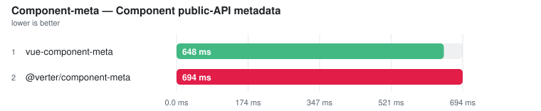
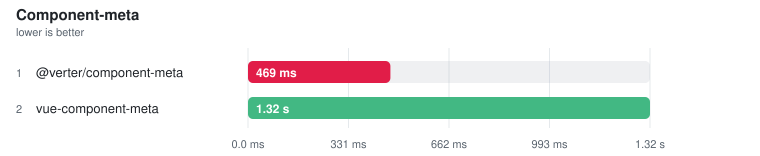

# Component-meta

> Auto-generated from the JSON snapshots in [`results/benchmarks/`](../results/benchmarks/) and [`results/real_world/`](../results/real_world/) by `pnpm docs`. Do not edit by hand.

- **Generated:** 2026-08-19T18:37:25.414Z
- **Fixture:** `fixtures/200` (200 files)
- **Runs / warmups:** 5 / 1
- **Runner:** Linux · linux/x64 · 4 CPUs · AMD EPYC 7763 64-Core Processor · 15.6 GB · Node v22.23.2
- **Commit:** [`94f6696`](https://github.com/pikax/vue-benchmarks/commit/94f6696b1c7b6f54928678126b9831febd70b4ff)
- **CI run:** https://github.com/pikax/vue-benchmarks/actions/runs/32287835178
- **Source:** `results/benchmarks/bench-Linux-200-bench.json`

## Results

Ranked on the **median of measured runs**. Warm series follow ≥1 discarded warmup and are the Compiler surface's primary ordering and ranking metric. Compiler additionally publishes a separately sampled **Fresh child** column: the first timed row workload after excluded process startup, imports and adapter setup. It is not called Cold and its ratio/noise gate never substitutes for Warm. Every table sorts fastest-first and every ratio column is **vs fastest** — the fastest ranked row is the 1.00x denominator; no tool is pinned as a reference. One table per surface unless that surface declares explicit work-equivalence classes; engine, invocation and threading are row properties, not implicit table splits — rows tagged **(JS)** run the JavaScript TypeScript compiler (a cross-engine ratio measures TypeScript's rewrite as much as the tool), and a row's label/notes say whether it is a CLI (pays process startup every run), an in-process API, single-threaded or a thread pool. Name markers: ⚠ failed validation (time bracketed, unranked) · ❌ error · ⏭ skipped. A row above CV 50% with at least three warm samples is bracketed as TOO NOISY TO RANK, no tool exempted (a two-run spread has no third sample to adjudicate, so it is flagged, not bracketed). Per-row detail is under **Notes** below each table.

> **Peak RSS** on a timing row is the tool's peak resident set: measured in the timed session where the runner samples it (LSP servers, real-world CLIs), otherwise injected from the isolated memory probe below — the probe runs each tool in its own process, separate from timing.

2026-08-20 · `fixtures/200` (200 files) · win32/x64 · source `bench-win32-200.json`

> ⚠ **Local run — not the published Linux CI series** (win32/x64 · **dirty worktree** — not attributable to a single commit). Shown because it is the newest data for this group; the next clean Linux Benchmark publish replaces it.

### Component-meta

Files: **100** · Bytes: **142,771**

| Tool | **Median (primary)** | Min | Stddev | CV% | vs fastest | Artifact | Throughput |
| --- | ---: | ---: | ---: | ---: | ---: | ---: | ---: |
| Vize component-meta ⏭ | skipped | – | – | – | – | – | – |

Notes

- **Vize component-meta ⏭**: No dedicated public component-meta API found on vize/@vizejs/native (declaration emit is a different surface and is not substituted).

##### Component public-API metadata

<picture>
  <source media="(prefers-color-scheme: dark)" srcset="charts/component-meta-bench-win32-200-component-meta-component-public-a-1k404hh-dark.svg">
  
</picture>

| Tool | **Median (primary)** | Min | Stddev | CV% | vs fastest | Meta members | Throughput | Peak RSS |
| --- | ---: | ---: | ---: | ---: | ---: | ---: | ---: | ---: |
| vue-component-meta | **648.4 ms** | 634.4 ms | 185.6 ms | 28.6% ⚠ | 1.00x | 1,343 | 154 files/s | 245.6 MB |
| @verter/component-meta | **694.2 ms** | 674.0 ms | 111.6 ms | 16.1% ⚠ | 1.07x | 88 | 144 files/s | 33.5 MB |

Notes

- **vue-component-meta**: createChecker(tsconfig) + getComponentMeta for each .vue file ✓ COMPONENT-META SEMANTIC VALIDITY: 11/11 named-API plants passed through createChecker(diskTsconfig, { forceUseTs:true }) once + getComponentMeta(diskFile) for every plant.
- **@verter/component-meta**: openComponentMetaSession(root, tsconfig) + disk-backed getComponentMeta for each .vue file; no updateFile overlay ✓ COMPONENT-META SEMANTIC VALIDITY: 11/11 named-API plants passed through openComponentMetaSession({ root, tsconfig }) once + getComponentMeta(diskFile) for every plant; no updateFile overlay.

Methodology

- Extract component public API metadata (props/events/slots where supported).
- Same subset of .vue files for every available tool.
- Schema depth and TypeScript program options may differ by tool — timings are throughput, not equivalence.
- Every tool is driven through its own published entry point. No payload is hand-decoded, and no row is measured through an API it does not ship.
- POST-TIMING SEMANTIC GATE: suite 2026-08-20.1 runs 11 existing component-meta cases in one isolated child per exact row. Vue creates one checker over a disk-backed tsconfig and calls getComponentMeta for every planted disk file. Verter opens one published session over the same disk-backed project and calls getComponentMeta for every file without updateFile overlays. Named props/events/slots/exposed members, coarse type facts, requiredness, defaults and deliberate absence are scored by one tool-neutral oracle; output objects and type strings are never byte-compared. FAIL, crash, missing verdict and UNKNOWN remain measured but UNRANKED, and a failed official Vue baseline invalidates the class.
- Each row reports the meta members it materialised. The counts are NOT equivalent between tools and no threshold is applied to them: on this corpus most generated SFCs declare no macros, and the tools differ on whether a component with no declared API still has implicit members. Read the member counts alongside the times rather than treating the ratio as like-for-like.
- Tool order is ROTATED on every warmup and measured run (not merely alternated), so no tool keeps a fixed position in the sequence.
- Tools without a real component-meta API are reported as skipped (no substitute workload).

Raw runs:

- **vue-component-meta**: 1.07 s, 750.7 ms, 645.6 ms, 648.4 ms, 634.4 ms
- **@verter/component-meta**: 923.7 ms, 832.5 ms, 682.3 ms, 674.0 ms, 694.2 ms

### bench-Linux-200-bench

2026-08-19 · `fixtures/200` (200 files) · linux/x64 · source `bench-Linux-200-bench.json`

#### Component-meta

<picture>
  <source media="(prefers-color-scheme: dark)" srcset="charts/component-meta-bench-linux-200-bench-component-meta-dark.svg">
  
</picture>

Files: **100** · Bytes: **142,771**

| Tool | **Median (primary)** | Min | Stddev | CV% | vs fastest | Meta members | Throughput | Peak RSS |
| --- | ---: | ---: | ---: | ---: | ---: | ---: | ---: | ---: |
| @verter/component-meta | **469.1 ms** | 432.7 ms | 50.5 ms | 10.8% ⚠ | 1.00x | 88 | 213 files/s | 33.5 MB |
| vue-component-meta | **1.32 s** | 1.07 s | 138.1 ms | 10.4% ⚠ | 2.82x | 1,343 | 76 files/s | 245.6 MB |
| Vize component-meta ⏭ | skipped | – | – | – | – | – | – | – |

Notes

- **@verter/component-meta**: openComponentMetaSession(root, tsconfig) + getComponentMeta for each .vue file
- **vue-component-meta**: createChecker(tsconfig) + getComponentMeta for each .vue file
- **Vize component-meta ⏭**: No dedicated public component-meta API found on vize/@vizejs/native (declaration emit is a different surface and is not substituted).

Methodology

- Extract component public API metadata (props/events/slots where supported).
- Same subset of .vue files for every available tool.
- Schema depth and TypeScript program options may differ by tool — timings are throughput, not equivalence.
- Every tool is driven through its own published entry point. No payload is hand-decoded, and no row is measured through an API it does not ship.
- Each row reports the meta members it materialised. The counts are NOT equivalent between tools and no threshold is applied to them: on this corpus most generated SFCs declare no macros, and the tools differ on whether a component with no declared API still has implicit members. Read the member counts alongside the times rather than treating the ratio as like-for-like.
- Tool order is ROTATED on every warmup and measured run (not merely alternated), so no tool keeps a fixed position in the sequence.
- Tools without a real component-meta API are reported as skipped (no substitute workload).

Raw runs:

- **@verter/component-meta**: 561.7 ms, 469.1 ms, 432.7 ms, 446.1 ms, 486.4 ms
- **vue-component-meta**: 1.41 s, 1.32 s, 1.39 s, 1.28 s, 1.07 s

## Validation (plants)

Executable correctness checks — planted errors that must be reported, clean fixtures that must stay clean. A fast tool that misses plants cannot rank as a correct one; gate failures surface as ⚠ in the timing tables.

> ⚠ **Local run — not the published Linux CI series** (win32/x64). Shown because it is the newest data for this group; the next clean Linux Benchmark publish replaces it.

pass **45** · fail **6** · warn **0** · skip **0**

| Case | vue-component-meta | verter-component-meta | vize-declaration-meta |
| --- | :---: | :---: | :---: |
| `basic-props` | ✓ | ✓ | ✓ |
| `complex-defaults` | ✓ | ✓ | **✗** |
| `define-model` | ✓ | ✓ | **✗** |
| `emits-multi-payload` | ✓ | ✓ | ✓ |
| `emits-overloads` | ✓ | ✓ | ✓ |
| `enum-props` | ✓ | ✓ | ✓ |
| `events-emits` | ✓ | ✓ | ✓ |
| `expose` | ✓ | ✓ | **✗** |
| `external-props-import` | ✓ | ✓ | **✗** |
| `full-api` | ✓ | ✓ | ✓ |
| `generic-props` | ✓ | ✓ | **✗** |
| `props-destructure` | ✓ | **✗** | ✓ |
| `recursive-props` | ✓ | ✓ | ✓ |
| `runtime-props` | ✓ | ✓ | ✓ |
| `slots` | ✓ | ✓ | ✓ |
| `union-intersection-props` | ✓ | ✓ | ✓ |
| `with-defaults` | ✓ | ✓ | ✓ |

Failure detail

- `complex-defaults` · **vize-declaration-meta** — generateDeclaration emitted unparseable TypeScript: '>' expected. (near "export type Props = <{ items?: string[]; config?: { r"); ';' expected. (near "rmatter?: (value: number) => string; }>; export type Emits = {}; export type S"); Expression expected. (near "matter?: (value: number) => string; }>; export type Emits = {}; export type Sl")
- `define-model` · **vize-declaration-meta** — props.modelValue: missing; props.count: missing; events.update:modelValue: missing; events.update:count: missing
- `expose` · **vize-declaration-meta** — capability gap — generateDeclaration does not emit defineExpose members
- `external-props-import` · **vize-declaration-meta** — props.name: missing; props.hint: missing; props.value: missing
- `generic-props` · **vize-declaration-meta** — generateDeclaration emitted unparseable TypeScript: '>' expected. (near "rops&lt;T extends { id: number } = any> = <{ items: T[]; selected?: T; keyOf:"); ';' expected. (near "cted?: T; keyOf: (row: T) => string; }>; export type Emits&lt;T extends { id: num"); Expression expected. (near "ted?: T; keyOf: (row: T) => string; }>; export type Emits&lt;T extends { id: numb")
- `props-destructure` · **verter-component-meta** — props.count: expected hasDefault; props.verbose: expected hasDefault

> The same group measured on pinned third-party projects: [real-world.md](real-world.md).

## Memory (isolated probe)

Each tool in its own process so RSS, allocation proxies and CPU are not mixed with siblings or with timing. Full probe across every group: [memory.md](memory.md).

### memory-linux-100

2026-08-19 · `fixtures/200` · source `memory-linux-100.json`

| Tool | RSS min / max / avg | Alloc min / max / avg | CPU ms | CPU % | Wall ms | Samples |
| --- | ---: | ---: | ---: | ---: | ---: | ---: |
| Verter ComponentMetaHost | 33.52 / 33.52 / 33.52 | 0.44 / 0.44 / 0.44 | 95 | 108.2 | 89 | 3 |
| vue-component-meta | 243.66 / 243.78 / 243.72 | 174.74 / 174.74 / 174.74 | 3249 | 227.2 | 1432 | 3 |

Notes

- **Verter ComponentMetaHost** — RSS/heap deltas vs baseline after GC; CPU via process.cpuUsage() in isolated worker
- **vue-component-meta** — RSS/heap deltas vs baseline after GC; CPU via process.cpuUsage() in isolated worker

### memory-win32-50

2026-07-26 · `fixtures/50` · source `memory-win32-50.json`

> ⚠ **Local run — not the published Linux CI series** (unknown platform). Shown because it is the newest data for this group; the next clean Linux Benchmark publish replaces it.

| Tool | RSS min / max / avg | Alloc min / max / avg | CPU ms | CPU % | Wall ms | Samples |
| --- | ---: | ---: | ---: | ---: | ---: | ---: |
| Verter ComponentMetaHost | 16.59 / 16.59 / 16.59 | 0.46 / 0.46 / 0.46 | n/a | n/a | 47 | 3 |
| vue-component-meta | 243.77 / 243.77 / 243.77 | 147.37 / 147.37 / 147.37 | 1781 | 202.3 | 880 | 3 |

Notes

- **Verter ComponentMetaHost** — RSS/heap deltas vs baseline after GC; CPU via process.cpuUsage() in isolated worker
- **vue-component-meta** — RSS/heap deltas vs baseline after GC; CPU via process.cpuUsage() in isolated worker

## Tool versions

Every pinned package in this run

| Package | Version |
| --- | --- |
| node | v22.23.2 |
| vue | 3.5.41 |
| @vue/compiler-sfc | 3.5.41 |
| @vue/compiler-sfc-36 | 3.6.0-rc.4 |
| vize | 0.350.2 |
| @vizejs/native | 0.350.2 |
| @verter/native | 0.0.1-beta.3 |
| @fervid/napi | 0.4.1 |
| verter-tsc | 0.0.1-beta.3 |
| @verter/component-meta | 0.0.1-beta.3 |
| verter-lsp | 0.0.1-beta.3 |
| verter-mcp | 0.0.1-beta.3 |
| @vue/language-server | 3.3.10 |
| @vue/typescript-plugin | 3.3.10 |
| typescript-language-server | 5.3.0 |
| vue-tsc | 3.3.10 |
| vue-component-meta | 3.3.10 |
| golar | 0.1.10 |
| @golar/vue | 0.1.10 |
| prettier | 3.9.6 |
| oxfmt | 0.64.0 |
| oxlint | 1.79.0 |
| eslint-plugin-vue | 10.10.0 |
| @biomejs/biome | 2.5.9 |
| typescript | 6.0.3 |
| cli:vize | 0.350.2 |
| cli:vue-tsc | 6.0.3 |
| cli:verter-tsc | 0.0.1-beta.3 |
| cli:golar | 0.1.10 |
| cli:prettier | 3.9.6 |
| cli:oxfmt | 0.64.0 |
| cli:oxlint | 1.79.0 |
| cli:biome | 2.5.9 |
| vue-jsx-vapor | 3.2.21 |
| @vue-jsx-vapor/compiler-rs | 3.2.21 |
| @vue/babel-plugin-jsx | 3.0.0 |
| @babel/core | 8.0.1 |

