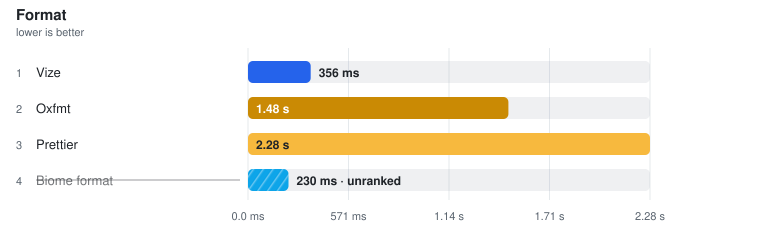

# Format

> Auto-generated from the JSON snapshots in [`results/benchmarks/`](../results/benchmarks/) and [`results/real_world/`](../results/real_world/) by `pnpm docs`. Do not edit by hand.

- **Generated:** 2026-08-19T18:37:25.414Z
- **Fixture:** `fixtures/200` (200 files)
- **Runs / warmups:** 5 / 1
- **Runner:** Linux · linux/x64 · 4 CPUs · AMD EPYC 7763 64-Core Processor · 15.6 GB · Node v22.23.2
- **Commit:** [`94f6696`](https://github.com/pikax/vue-benchmarks/commit/94f6696b1c7b6f54928678126b9831febd70b4ff)
- **CI run:** https://github.com/pikax/vue-benchmarks/actions/runs/32287835178
- **Source:** `results/benchmarks/bench-Linux-200-bench.json`

## Results

Ranked on the **median of measured runs**. Warm series follow ≥1 discarded warmup and are the Compiler surface's primary ordering and ranking metric. Compiler additionally publishes a separately sampled **Fresh child** column: the first timed row workload after excluded process startup, imports and adapter setup. It is not called Cold and its ratio/noise gate never substitutes for Warm. Every table sorts fastest-first and every ratio column is **vs fastest** — the fastest ranked row is the 1.00x denominator; no tool is pinned as a reference. One table per surface unless that surface declares explicit work-equivalence classes; engine, invocation and threading are row properties, not implicit table splits — rows tagged **(JS)** run the JavaScript TypeScript compiler (a cross-engine ratio measures TypeScript's rewrite as much as the tool), and a row's label/notes say whether it is a CLI (pays process startup every run), an in-process API, single-threaded or a thread pool. Name markers: ⚠ failed validation (time bracketed, unranked) · ❌ error · ⏭ skipped. A row above CV 50% with at least three warm samples is bracketed as TOO NOISY TO RANK, no tool exempted (a two-run spread has no third sample to adjudicate, so it is flagged, not bracketed). Per-row detail is under **Notes** below each table.

> **Peak RSS** on a timing row is the tool's peak resident set: measured in the timed session where the runner samples it (LSP servers, real-world CLIs), otherwise injected from the isolated memory probe below — the probe runs each tool in its own process, separate from timing.

2026-08-20 · `fixtures/200` (200 files) · win32/x64 · source `bench-win32-200.json`

> ⚠ **Local run — not the published Linux CI series** (win32/x64 · **dirty worktree** — not attributable to a single commit). Shown because it is the newest data for this group; the next clean Linux Benchmark publish replaces it.

### Format

<picture>
  <source media="(prefers-color-scheme: dark)" srcset="charts/format-bench-win32-200-format-dark.svg">
  
</picture>

Files: **200** · Bytes: **285,701**

Tools:

- **Prettier** — prettier --write over a fresh corpus copy; built-in Vue SFC support, single-threaded by design.
- **Oxfmt** — oxfmt --write — Oxc's Vue-capable formatter, multi-threaded.
- **Vize** — vize fmt --write.
- **Biome format** — biome format --write — multi-threaded; the exact pinned row rewrites none of the planted .vue corpus and is unranked on the full-SFC format surface.

| Tool | **Median (primary)** | Min | Stddev | CV% | vs fastest | Artifact | Throughput | Peak RSS |
| --- | ---: | ---: | ---: | ---: | ---: | ---: | ---: | ---: |
| Vize | **356.0 ms** | 304.3 ms | 170.7 ms | 47.9% ⚠ | 1.00x | n/a | 562 files/s | 68.1 MB |
| Oxfmt | **1.48 s** | 1.38 s | 56.9 ms | 3.8% | 4.15x | n/a | 135 files/s | 689.9 MB |
| Prettier | **2.28 s** | 2.25 s | 159.0 ms | 7.0% | 6.41x | n/a | 88 files/s | 195.6 MB |
| Biome format ⚠ | (229.8 ms) | (213.5 ms) | – | – | not ranked | – | – | (97.7 MB) |

Notes

- **Vize**: vize fmt --write (fresh copy each run) · does not report thread usage — not assumed single-threaded | ⓘ file coverage verified: rewrote 200/200 planted corpus files. | ✓ format validity 3/3: parseable, descriptor/template/script semantics preserved and exact invocation idempotent.
- **Oxfmt**: oxfmt --write (fresh copy each run) · pinned 0.64.0 routes a full .vue file through its bundled Prettier formatFile callback in worker threads; the native binding orchestrates the call, but Vue parsing/printing is the bundled Prettier path. Re-audit this package path after upgrades. | ⓘ file coverage verified: rewrote 200/200 planted corpus files. | ✓ format validity 3/3: parseable, descriptor/template/script semantics preserved and exact invocation idempotent.
- **Prettier**: prettier --write **/*.vue (fresh copy each run) · single-threaded by design | ⓘ file coverage verified: rewrote 200/200 planted corpus files. | ✓ format validity 3/3: parseable, descriptor/template/script semantics preserved and exact invocation idempotent.
- **Biome format ⚠**: biome format --write . (fresh copy each run) · multi-threaded (Rayon; honours RAYON_NUM_THREADS) · exact pinned row currently rewrites none of the planted .vue corpus | ⚠ FAILED FILE-COVERAGE GATE — rewrote 0 of 200 planted corpus files. A tool covering fewer files finishes sooner; that is a different job, not a faster one. Measured but UNRANKED. | ⚠ FORMAT SEMANTIC VALIDITY FAIL — template-behaviour: messy template block was not rewritten; descriptor-attributes: messy template block was not rewritten. Full per-plant evidence is retained in validation.formatSemantics.

Methodology

- Each invocation receives a fresh copy of the same Vue SFC corpus (formatters rewrite files).
- Prettier is the explicit established-reference denominator for the full-Vue-SFC CLI comparison class. A faster candidate never silently becomes the baseline.
- .prettierrc.json and biome.json are written only into disposable work copies; the input fixture or checked-out real-world project is never overwritten. Both configs set the same indent, width, quote, semicolon and trailing-comma choices.
- All four formatters are CLI invocations and share the same non-zero-exit policy — no tool is failed for a diagnostic another tool is forgiven for.
- Output style is NOT normalized across tools — this measures format throughput, not style identity. Spot-checked: on a messy SFC, oxfmt and Prettier produce byte-identical output and Vize reformats template + script + style, so no tool is winning by no-op.
- Oxfmt 0.64.0 is a hybrid native/JS package. Its shipped native binding delegates a full .vue file to the bundled JS formatFile callback, whose implementation calls bundled Prettier with parser=vue; worker orchestration remains oxfmt's. Its output is byte-identical to Prettier on the work-gate probe. This is pinned-version evidence and must be re-audited after an oxfmt upgrade rather than assumed forever.
- Every work copy and gate plant carries an empty .git dir as a repo-boundary marker: walk tools that honour ancestor .gitignore rules (oxfmt 0.63+) otherwise inherit THIS repo's exclusion of the work/ dir the copies live in, see zero files, and get unranked for walking reasons rather than formatting ones. A real project root has the boundary; the marker changes no tool's invocation.
- FORMAT SEMANTIC GATE (untimed, post-timing): suite 2026-08-20.1 runs 3 nested plants twice through each row's exact directory/glob command and shared configs. Every plant must remain parseable and idempotent; preserve SFC block attrs/custom blocks and template/script AST meaning; preserve scoped/module/v-bind/deep/slotted/global CSS constructs; and actually rewrite the messy template. Generated output is never compared between tools. Every outcome and the suite hash are retained in validation.formatSemantics.
- FILE-COVERAGE GATE, untimed, per tool with its exact timed invocation: every corpus file is planted with a mess (trailing spaces, stacked blank lines) that any formatter under the shared configs must undo, and files rewritten are counted by byte comparison — the same method for every tool. A ranked tool that rewrites fewer than every corpus file is measured but UNRANKED: tools walking different file sets are not doing the same job, however similar the clock looks. A walk-invoked tool that also rewrites a config file is disclosed, not gated (one extra tiny file is noise; skipping corpus files is not).
- Prettier, Oxfmt, and Vize format the whole SFC. On the pinned Biome, `biome format --write .` reports .vue files as formatted but applies NO fixes to any block of them (probed: 0 of 50 planted files rewritten, 'No fixes applied') — its bracketed time is a walk-and-parse, which both gates say on the row. Rule/option parity is not guaranteed for any tool.
- Tool order is rotated on every warmup and measured run; ranking metric is the median of warmed runs.

Raw runs:

- **Vize**: 356.0 ms, 317.4 ms, 304.3 ms, 360.7 ms, 712.4 ms
- **Oxfmt**: 1.51 s, 1.48 s, 1.38 s, 1.52 s, 1.43 s
- **Prettier**: 2.53 s, 2.28 s, 2.28 s, 2.25 s, 2.59 s
- **Biome format**: 233.5 ms, 213.5 ms, 250.0 ms, 229.8 ms, 213.5 ms

### bench-Linux-200-bench

2026-08-19 · `fixtures/200` (200 files) · linux/x64 · source `bench-Linux-200-bench.json`

#### Format

<picture>
  <source media="(prefers-color-scheme: dark)" srcset="charts/format-bench-linux-200-bench-format-dark.svg">
  
</picture>

Files: **200** · Bytes: **285,701**

Tools:

- **Prettier** — prettier --write over a fresh corpus copy; built-in Vue SFC support, single-threaded by design.
- **Oxfmt** — oxfmt --write — Oxc's Vue-capable formatter, multi-threaded.
- **Vize** — vize fmt --write.
- **Biome format** — biome format --write — multi-threaded; the exact pinned row rewrites none of the planted .vue corpus and is unranked on the full-SFC format surface.

| Tool | **Median (primary)** | Min | Stddev | CV% | vs fastest | Artifact | Throughput | Peak RSS |
| --- | ---: | ---: | ---: | ---: | ---: | ---: | ---: | ---: |
| Vize | **127.6 ms** | 124.3 ms | 2.5 ms | 1.9% | 1.00x | n/a | 1.6k files/s | 68.1 MB |
| Oxfmt | **3.27 s** | 3.25 s | 28.5 ms | 0.9% | 25.66x | n/a | 61 files/s | 689.9 MB |
| Prettier | **3.78 s** | 3.74 s | 15.9 ms | 0.4% | 29.60x | n/a | 53 files/s | 195.6 MB |
| Biome format ⚠ | (116.3 ms) | (114.6 ms) | – | – | not ranked | – | – | (97.7 MB) |

Notes

- **Vize**: vize fmt --write (fresh copy each run) · does not report thread usage — not assumed single-threaded | ⓘ file coverage verified: rewrote 200/200 planted corpus files.
- **Oxfmt**: oxfmt --write (fresh copy each run) · .vue files route through oxfmt's BUNDLED PRETTIER fallback in worker threads, not the Rust core (its dist ships Prettier and exposes Prettier's Vue options) — read this row as Prettier-with-workers until oxfmt formats SFCs natively | ⓘ file coverage verified: rewrote 200/200 planted corpus files.
- **Prettier**: prettier --write **/*.vue (fresh copy each run) · single-threaded by design | ⓘ file coverage verified: rewrote 200/200 planted corpus files.
- **Biome format ⚠**: biome format --write . (fresh copy each run) · multi-threaded (Rayon; honours RAYON_NUM_THREADS) · formats the &lt;script> block ONLY — template and style are returned byte-identical | ⚠ FAILED VALIDATION — time shown in brackets, excluded from ranking | ⓘ file-coverage census: rewrote 0 of 200 planted corpus files.

Methodology

- Each invocation receives a fresh copy of the same Vue SFC corpus (formatters rewrite files).
- .prettierrc.json and biome.json are copied into every work copy so each tool's config actually resolves (config left in the fixture root is not on the work dir's lookup path). Both configs set the same indent, width, quote, semicolon and trailing-comma choices.
- All four formatters are CLI invocations and share the same non-zero-exit policy — no tool is failed for a diagnostic another tool is forgiven for.
- Output style is NOT normalized across tools — this measures format throughput, not style identity. Spot-checked: on a messy SFC, oxfmt and Prettier produce byte-identical output and Vize reformats template + script + style, so no tool is winning by no-op.
- Oxfmt's .vue path is NOT its Rust core: oxfmt (verified through 0.63) bundles Prettier and routes SFCs through it in worker threads — which is also why its output is byte-identical to Prettier's. Its row measures that pipeline, disclosed in its label notes; Vize is currently the only ranked formatter compiling SFCs natively.
- Every work copy and gate plant carries an empty .git dir as a repo-boundary marker: walk tools that honour ancestor .gitignore rules (oxfmt 0.63+) otherwise inherit THIS repo's exclusion of the work/ dir the copies live in, see zero files, and get unranked for walking reasons rather than formatting ones. A real project root has the boundary; the marker changes no tool's invocation.
- The template-rewrite gate probe lives in a NESTED directory, so a tool invoked non-recursively fails the gate rather than being ranked on an empty match (this exact fault put Prettier at 1.00x on every nested corpus while formatting zero files).
- Template-rewrite work gate: each formatter is run against a messy SFC and must actually change the &lt;template> block, or it is measured but unranked.
- FILE-COVERAGE GATE, untimed, per tool with its exact timed invocation: every corpus file is planted with a mess (trailing spaces, stacked blank lines) that any formatter under the shared configs must undo, and files rewritten are counted by byte comparison — the same method for every tool. A ranked tool that rewrites fewer than every corpus file is measured but UNRANKED: tools walking different file sets are not doing the same job, however similar the clock looks. A walk-invoked tool that also rewrites a config file is disclosed, not gated (one extra tiny file is noise; skipping corpus files is not).
- Prettier, Oxfmt, and Vize format the whole SFC. On the pinned Biome, `biome format --write .` reports .vue files as formatted but applies NO fixes to any block of them (probed: 0 of 50 planted files rewritten, 'No fixes applied') — its bracketed time is a walk-and-parse, which both gates say on the row. Rule/option parity is not guaranteed for any tool.
- Tool order is rotated on every warmup and measured run; ranking metric is the median of warmed runs.

Raw runs:

- **Vize**: 124.3 ms, 129.7 ms, 127.6 ms, 126.9 ms, 130.6 ms
- **Oxfmt**: 3.25 s, 3.25 s, 3.31 s, 3.27 s, 3.31 s
- **Prettier**: 3.74 s, 3.76 s, 3.78 s, 3.78 s, 3.78 s
- **Biome format**: 114.6 ms, 115.2 ms, 120.4 ms, 119.5 ms, 116.3 ms

## Validation (plants)

Executable correctness checks — planted errors that must be reported, clean fixtures that must stay clean. A fast tool that misses plants cannot rank as a correct one; gate failures surface as ⚠ in the timing tables.

> ⚠ **Local run — not the published Linux CI series** (win32/x64). Shown because it is the newest data for this group; the next clean Linux Benchmark publish replaces it.

pass **50** · fail **2** · warn **0** · skip **0**

| Case | prettier | oxfmt | vize-fmt | biome-fmt |
| --- | :---: | :---: | :---: | :---: |
| `format-comments-preserved` | ✓ | ✓ | ✓ | ✓ |
| `format-generic-script-setup` | ✓ | ✓ | ✓ | ✓ |
| `format-i18n-custom-block` | ✓ | ✓ | ✓ | ✓ |
| `format-idempotent` | ✓ | ✓ | ✓ | ✓ |
| `format-multiline-expressions` | ✓ | ✓ | ✓ | ✓ |
| `format-parseable` | ✓ | ✓ | ✓ | ✓ |
| `format-pre-whitespace` | ✓ | ✓ | ✓ | ✓ |
| `format-pug-template` | ✓ | ✓ | **✗** | ✓ |
| `format-style-v-bind` | ✓ | ✓ | ✓ | ✓ |
| `format-top-level-comments` | ✓ | ✓ | **✗** | ✓ |
| `format-v-for-expression-preserved` | ✓ | ✓ | ✓ | ✓ |
| `format-v-pre-content` | ✓ | ✓ | ✓ | ✓ |
| `format-void-self-closing` | ✓ | ✓ | ✓ | ✓ |

Failure detail

- `format-pug-template` · **vize-fmt** — formatted output does not match /(^|[\r\n])\.wrapper\r?\n {2}h1\.title CONFIRM_PUG_TITLE\r?\n {2}ul\r?\n {4}li\(v-for="item in items" :key="item"\) \{\{ item \}\}/
- `format-top-level-comments` · **vize-fmt** — formatted output missing "CONFIRM_TOP_BETWEEN_BLOCKS"

> The same group measured on pinned third-party projects: [real-world.md](real-world.md).

## Memory (isolated probe)

Each tool in its own process so RSS, allocation proxies and CPU are not mixed with siblings or with timing. Full probe across every group: [memory.md](memory.md).

### memory-linux-100

2026-08-19 · `fixtures/200` · source `memory-linux-100.json`

| Tool | RSS min / max / avg | Alloc min / max / avg | CPU ms | CPU % | Wall ms | Samples |
| --- | ---: | ---: | ---: | ---: | ---: | ---: |
| Vize fmt | 14.61 / 67.95 / 44.20 | n/a | 50 | 97.4 | 51 | 3 |
| Biome format | 2.15 / 95.85 / 57.58 | n/a | 10 | 15.7 | 64 | 3 |
| Prettier | 13.13 / 186.23 / 139.99 | n/a | 3170 | 177.3 | 1782 | 3 |
| Oxfmt | 13.10 / 685.33 / 490.28 | n/a | 90 | 4.8 | 1872 | 3 |

Notes

- **Vize fmt** — RSS = child tree; CPU total from /proc when available (Linux)
- **Biome format** — RSS = child tree; CPU total from /proc when available (Linux)
- **Prettier** — RSS = child tree; CPU total from /proc when available (Linux)
- **Oxfmt** — RSS = child tree; CPU total from /proc when available (Linux)

### memory-win32-50

2026-07-26 · `fixtures/50` · source `memory-win32-50.json`

> ⚠ **Local run — not the published Linux CI series** (unknown platform). Shown because it is the newest data for this group; the next clean Linux Benchmark publish replaces it.

| Tool | RSS min / max / avg | Alloc min / max / avg | CPU ms | CPU % | Wall ms | Samples |
| --- | ---: | ---: | ---: | ---: | ---: | ---: |
| Vize fmt | 52.84 / 62.30 / 57.65 | 12.77 / 21.78 / 17.35 | 78 | 68.9 | 133 | 3 |
| Oxfmt | 52.20 / 77.74 / 72.66 | 10.82 / 113.42 / 91.63 | 328 | 41.3 | 817 | 3 |
| Prettier | 52.20 / 178.85 / 127.61 | 10.84 / 182.82 / 124.84 | 1313 | 161.0 | 831 | 3 |

Notes

- **Vize fmt** — RSS=WorkingSet; alloc≈PrivateMemorySize64; CPU=TotalProcessorTime (tool process only)
- **Oxfmt** — RSS=WorkingSet; alloc≈PrivateMemorySize64; CPU=TotalProcessorTime (tool process only)
- **Prettier** — RSS=WorkingSet; alloc≈PrivateMemorySize64; CPU=TotalProcessorTime (tool process only)

## Tool versions

Every pinned package in this run

| Package | Version |
| --- | --- |
| node | v22.23.2 |
| vue | 3.5.41 |
| @vue/compiler-sfc | 3.5.41 |
| @vue/compiler-sfc-36 | 3.6.0-rc.4 |
| vize | 0.350.2 |
| @vizejs/native | 0.350.2 |
| @verter/native | 0.0.1-beta.3 |
| @fervid/napi | 0.4.1 |
| verter-tsc | 0.0.1-beta.3 |
| @verter/component-meta | 0.0.1-beta.3 |
| verter-lsp | 0.0.1-beta.3 |
| verter-mcp | 0.0.1-beta.3 |
| @vue/language-server | 3.3.10 |
| @vue/typescript-plugin | 3.3.10 |
| typescript-language-server | 5.3.0 |
| vue-tsc | 3.3.10 |
| vue-component-meta | 3.3.10 |
| golar | 0.1.10 |
| @golar/vue | 0.1.10 |
| prettier | 3.9.6 |
| oxfmt | 0.64.0 |
| oxlint | 1.79.0 |
| eslint-plugin-vue | 10.10.0 |
| @biomejs/biome | 2.5.9 |
| typescript | 6.0.3 |
| cli:vize | 0.350.2 |
| cli:vue-tsc | 6.0.3 |
| cli:verter-tsc | 0.0.1-beta.3 |
| cli:golar | 0.1.10 |
| cli:prettier | 3.9.6 |
| cli:oxfmt | 0.64.0 |
| cli:oxlint | 1.79.0 |
| cli:biome | 2.5.9 |
| vue-jsx-vapor | 3.2.21 |
| @vue-jsx-vapor/compiler-rs | 3.2.21 |
| @vue/babel-plugin-jsx | 3.0.0 |
| @babel/core | 8.0.1 |

