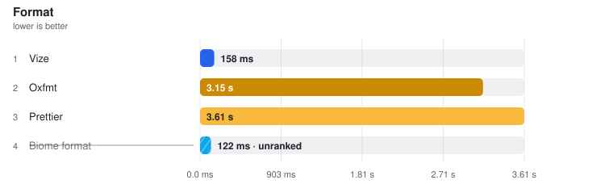

# Format

> Auto-generated from the JSON snapshots in [`results/benchmarks/`](../results/benchmarks/) and [`results/real_world/`](../results/real_world/) by `pnpm docs`. Do not edit by hand.

- **Generated:** 2026-09-29T12:56:26.892Z
- **Fixture:** `fixtures/200` (200 files)
- **Runs / warmups:** 5 / 1
- **Runner:** Linux · linux/x64 · 4 CPUs · INTEL(R) XEON(R) PLATINUM 8573C · 15.6 GB · Node v22.23.2
- **Commit:** [`8a88482`](https://github.com/pikax/vue-benchmarks/commit/8a8848276c52956d7e54e262e5846e41fc922288)
- **CI run:** https://github.com/pikax/vue-benchmarks/actions/runs/36570273148
- **Source:** `results/benchmarks/bench-Linux-200-bench.json`

## Results

Ranked on the **median of measured runs**. Warm series follow ≥1 discarded warmup and are the primary ordering and ranking metric wherever both series exist. Compiler and Component-meta additionally publish a separately sampled **Fresh child** column: the first timed row workload in a new child process, after excluded process startup and package imports. It is not called Cold and its ratio/noise gate never substitutes for Warm. What else the child excludes differs by surface and each surface states it in its own methodology — Compiler builds its compiler host outside the timer, Component-meta builds its checker/session inside it, because its warm timer does too. Every table sorts fastest-first and every ratio column is **vs fastest** — the fastest ranked row is the 1.00x denominator; no tool is pinned as a reference. One table per surface unless that surface declares explicit work-equivalence classes; engine, invocation and threading are row properties, not implicit table splits — rows tagged **(JS)** run the JavaScript TypeScript compiler (a cross-engine ratio measures TypeScript's rewrite as much as the tool), and a row's label/notes say whether it is a CLI (pays process startup every run), an in-process API, single-threaded or a thread pool. Name markers: ⚠ failed validation (time bracketed, unranked) · ❌ error · ⏭ skipped. A row above CV 50% with at least three warm samples is bracketed as TOO NOISY TO RANK, no tool exempted (a two-run spread has no third sample to adjudicate, so it is flagged, not bracketed). Per-row detail is under **Notes** below each table.

> **Peak RSS** on a timing row is the tool's peak resident set: measured in the timed session where the runner samples it (LSP servers, real-world CLIs), otherwise injected from the isolated memory probe below — the probe runs each tool in its own process, separate from timing.

### Format

<picture>
  <source media="(prefers-color-scheme: dark)" srcset="charts/format-bench-linux-200-bench-format-dark.svg">
  
</picture>

Files: **200** · Bytes: **285,701**

Tools:

- **Prettier** — prettier --write over a fresh corpus copy; built-in Vue SFC support, single-threaded by design.
- **Oxfmt** — oxfmt --write — Oxc's Vue-capable formatter, multi-threaded.
- **Vize** — vize fmt --write.
- **Biome format** — biome format --write — multi-threaded; the exact pinned row rewrites none of the planted .vue corpus and is unranked on the full-SFC format surface.

| Tool | **Median (primary)** | Min | Stddev | CV% | vs fastest | Artifact | Throughput | Peak RSS |
| --- | ---: | ---: | ---: | ---: | ---: | ---: | ---: | ---: |
| Vize | **158.1 ms** | 156.6 ms | 5.3 ms | 3.4% | 1.00x | n/a | 1.3k files/s | 70.3 MB |
| Oxfmt | **3.15 s** | 3.12 s | 64.7 ms | 2.1% | 19.94x | n/a | 63 files/s | 681.9 MB |
| Prettier | **3.61 s** | 3.59 s | 30.5 ms | 0.8% | 22.85x | n/a | 55 files/s | 188.7 MB |
| Biome format ⚠ | (121.9 ms) | (120.9 ms) | – | – | not ranked | – | – | (94.5 MB) |

Notes

- **Vize**: vize fmt --write (fresh copy each run) · does not report thread usage — not assumed single-threaded | ⓘ file coverage verified: rewrote 200/200 planted corpus files. | ✓ format validity 5/5: parseable, descriptor/template/script semantics preserved and exact invocation idempotent.
- **Oxfmt**: oxfmt --write (fresh copy each run) · pinned 0.65.0 routes a full .vue file through its bundled Prettier formatFile callback in worker threads; the native binding orchestrates the call, but Vue parsing/printing is the bundled Prettier path. Re-audit this package path after upgrades. | ⓘ file coverage verified: rewrote 200/200 planted corpus files. | ✓ format validity 5/5: parseable, descriptor/template/script semantics preserved and exact invocation idempotent.
- **Prettier**: prettier --write **/*.vue (fresh copy each run) · single-threaded by design | ⓘ file coverage verified: rewrote 200/200 planted corpus files. | ✓ format validity 5/5: parseable, descriptor/template/script semantics preserved and exact invocation idempotent.
- **Biome format ⚠**: biome format --write . (fresh copy each run) · multi-threaded (Rayon; honours RAYON_NUM_THREADS) · exact pinned row currently rewrites none of the planted .vue corpus | ⚠ FAILED FILE-COVERAGE GATE — rewrote 0 of 200 planted corpus files. A tool covering fewer files finishes sooner; that is a different job, not a faster one. Measured but UNRANKED. | ⚠ FORMAT SEMANTIC VALIDITY FAIL — css-and-custom-block-semantics: messy template block was not rewritten; template-behaviour: messy template block was not rewritten. Full per-plant evidence is retained in validation.formatSemantics.

Methodology

- Each invocation receives a fresh copy of the same Vue SFC corpus (formatters rewrite files).
- Prettier is the explicit established-reference denominator for the full-Vue-SFC CLI comparison class. A faster candidate never silently becomes the baseline.
- .prettierrc.json and biome.json are written only into disposable work copies; the input fixture or checked-out real-world project is never overwritten. Both configs set the same indent, width, quote, semicolon and trailing-comma choices.
- All four formatters are CLI invocations and share the same non-zero-exit policy — no tool is failed for a diagnostic another tool is forgiven for.
- Output style is NOT normalized across tools — this measures format throughput, not style identity. Spot-checked: on a messy SFC, oxfmt and Prettier produce byte-identical output and Vize reformats template + script + style, so no tool is winning by no-op.
- Oxfmt 0.65.0 is a hybrid native/JS package. Its shipped native binding delegates a full .vue file to the bundled JS formatFile callback, whose implementation calls bundled Prettier with parser=vue; worker orchestration remains oxfmt's. Its output is byte-identical to Prettier on the work-gate probe. This is pinned-version evidence and must be re-audited after an oxfmt upgrade rather than assumed forever.
- Every work copy and gate plant carries an empty .git dir as a repo-boundary marker: walk tools that honour ancestor .gitignore rules (oxfmt 0.63+) otherwise inherit THIS repo's exclusion of the work/ dir the copies live in, see zero files, and get unranked for walking reasons rather than formatting ones. A real project root has the boundary; the marker changes no tool's invocation.
- FORMAT SEMANTIC GATE (untimed, post-timing): suite 2026-09-12.3 runs 5 nested plants twice through each row's exact directory/glob command and shared configs. Every plant must remain parseable and idempotent; preserve SFC block attrs/custom blocks and template/script AST meaning; preserve scoped/module/v-bind/deep/slotted/global CSS constructs; and actually rewrite the messy template. Generated output is never compared between tools. Every outcome and the suite hash are retained in validation.formatSemantics.
- FILE-COVERAGE GATE, untimed, per tool with its exact timed invocation: every corpus file is planted with a mess (trailing spaces, stacked blank lines) that any formatter under the shared configs must undo, and files rewritten are counted by byte comparison — the same method for every tool. A ranked tool that rewrites fewer than every corpus file is measured but UNRANKED: tools walking different file sets are not doing the same job, however similar the clock looks. A walk-invoked tool that also rewrites a config file is disclosed, not gated (one extra tiny file is noise; skipping corpus files is not).
- Prettier, Oxfmt, and Vize format the whole SFC. On the pinned Biome, `biome format --write .` reports .vue files as formatted but applies NO fixes to any block of them (probed: 0 of 50 planted files rewritten, 'No fixes applied') — its bracketed time is a walk-and-parse, which both gates say on the row. Rule/option parity is not guaranteed for any tool.
- Tool order is rotated on every warmup and measured run; ranking metric is the median of warmed runs.

Raw runs:

- **Vize**: 158.1 ms, 169.2 ms, 156.7 ms, 161.8 ms, 156.6 ms
- **Oxfmt**: 3.15 s, 3.29 s, 3.17 s, 3.12 s, 3.15 s
- **Prettier**: 3.61 s, 3.67 s, 3.65 s, 3.61 s, 3.59 s
- **Biome format**: 131.0 ms, 125.6 ms, 120.9 ms, 121.9 ms, 121.4 ms

## Validation (plants)

Executable correctness checks — planted errors that must be reported, clean fixtures that must stay clean. A fast tool that misses plants cannot rank as a correct one; gate failures surface as ⚠ in the timing tables.

pass **66** · fail **6** · warn **0** · skip **0**

| Case | prettier | oxfmt | vize-fmt | biome-fmt |
| --- | :---: | :---: | :---: | :---: |
| `format-comments-preserved` | ✓ | ✓ | ✓ | ✓ |
| `format-generic-script-setup` | ✓ | ✓ | ✓ | ✓ |
| `format-i18n-custom-block` | ✓ | ✓ | ✓ | ✓ |
| `format-idempotent` | ✓ | ✓ | ✓ | ✓ |
| `format-multiline-expressions` | ✓ | ✓ | ✓ | ✓ |
| `format-parseable` | ✓ | ✓ | ✓ | ✓ |
| `format-pre-whitespace` | ✓ | ✓ | ✓ | ✓ |
| `format-pug-template` | ✓ | ✓ | **✗** | ✓ |
| `format-style-v-bind` | ✓ | ✓ | ✓ | ✓ |
| `format-top-level-comments` | ✓ | ✓ | ✓ | ✓ |
| `format-v-for-expression-preserved` | ✓ | ✓ | ✓ | ✓ |
| `format-v-pre-content` | ✓ | ✓ | ✓ | ✓ |
| `format-void-self-closing` | ✓ | ✓ | ✓ | ✓ |
| `shared-comments-and-svg` | ✓ | ✓ | ✓ | **✗** |
| `shared-css-and-custom-block-semantics` | ✓ | ✓ | ✓ | **✗** |
| `shared-descriptor-attributes` | ✓ | ✓ | ✓ | **✗** |
| `shared-significant-whitespace-and-regexp` | ✓ | ✓ | ✓ | **✗** |
| `shared-template-behaviour` | ✓ | ✓ | ✓ | **✗** |

Failure detail

- `format-pug-template` · **vize-fmt** — formatted output does not match /(^|[\r\n])\.wrapper\r?\n {2}h1\.title CONFIRM_PUG_TITLE\r?\n {2}ul\r?\n {4}li\(v-for="item in items" :key="item"\) \{\{ item \}\}/
- `shared-css-and-custom-block-semantics` · **biome-fmt** — messy template block was not rewritten
- `shared-template-behaviour` · **biome-fmt** — messy template block was not rewritten
- `shared-descriptor-attributes` · **biome-fmt** — messy template block was not rewritten
- `shared-significant-whitespace-and-regexp` · **biome-fmt** — messy template block was not rewritten
- `shared-comments-and-svg` · **biome-fmt** — messy template block was not rewritten

> The same group measured on pinned third-party projects: [real-world.md](real-world.md).

## Memory (isolated probe)

Each tool in its own process so RSS, allocation proxies and CPU are not mixed with siblings or with timing. Full probe across every group: [memory.md](memory.md).

| Tool | RSS min / max / avg | Alloc min / max / avg | CPU ms | CPU % | Wall ms | Samples |
| --- | ---: | ---: | ---: | ---: | ---: | ---: |
| Vize fmt | 14.50 / 70.28 / 56.42 | n/a | 100 | 110.5 | 91 | 3 |
| Biome format | 2.25 / 94.44 / 57.78 | n/a | 30 | 35.9 | 83 | 3 |
| Prettier | 14.16 / 188.60 / 139.49 | n/a | 4070 | 167.9 | 2375 | 3 |
| Oxfmt | 14.49 / 680.39 / 491.84 | n/a | 150 | 5.9 | 2515 | 3 |

Notes

- **Vize fmt** — RSS = child tree; CPU total from /proc when available (Linux); exit/output validity retained
- **Biome format** — RSS = child tree; CPU total from /proc when available (Linux); exit/output validity retained
- **Prettier** — RSS = child tree; CPU total from /proc when available (Linux); exit/output validity retained
- **Oxfmt** — RSS = child tree; CPU total from /proc when available (Linux); exit/output validity retained

## Tool versions

Every pinned package in this run

| Package | Version |
| --- | --- |
| node | v22.23.2 |
| vue | 3.5.43 |
| vue-36 | 3.6.0-rc.9 |
| @vue/compiler-sfc | 3.5.43 |
| @vue/compiler-sfc-36 | 3.6.0-rc.9 |
| vize | 0.429.1 |
| @vizejs/native | 0.429.1 |
| @verter/native | 0.0.1-beta.6 |
| @fervid/napi | 0.4.1 |
| verter-tsc | 0.0.1-beta.6 |
| @verter/component-meta | 0.0.1-beta.6 |
| verter-lsp | 0.0.1-beta.6 |
| verter-mcp | 0.0.1-beta.6 |
| @vue/language-server | 3.3.11 |
| @vue/typescript-plugin | 3.3.11 |
| typescript-language-server | 6.0.1 |
| vue-tsc | 3.3.11 |
| vue-component-meta | 3.3.11 |
| golar | 0.1.10 |
| @golar/vue | 0.1.10 |
| prettier | 3.9.9 |
| oxfmt | 0.71.0 |
| oxlint | 1.86.0 |
| eslint-plugin-vue | 10.11.1 |
| @biomejs/biome | 2.5.14 |
| typescript | 6.0.3 |
| cli:vize | 0.429.1 |
| cli:vue-tsc | 6.0.3 |
| cli:verter-tsc | 0.0.1-beta.6 |
| cli:golar | 0.1.10 |
| cli:prettier | 3.9.9 |
| cli:oxfmt | 0.71.0 |
| cli:oxlint | 1.86.0 |
| cli:biome | 2.5.14 |
| vue-jsx-vapor | 3.2.25 |
| @vue-jsx-vapor/compiler-rs | 3.2.25 |
| @vue/babel-plugin-jsx | 3.0.0 |
| @babel/core | 8.0.6 |

