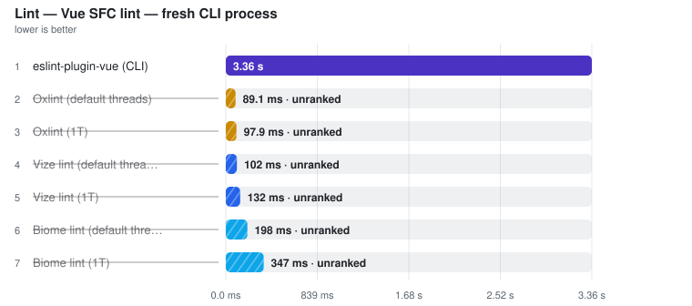

# Lint

> Auto-generated from the JSON snapshots in [`results/benchmarks/`](../results/benchmarks/) and [`results/real_world/`](../results/real_world/) by `pnpm docs`. Do not edit by hand.

- **Generated:** 2026-09-18T13:42:39.794Z
- **Fixture:** `fixtures/200` (200 files)
- **Runs / warmups:** 5 / 1
- **Runner:** Linux · linux/x64 · 4 CPUs · AMD EPYC 7763 64-Core Processor · 15.6 GB · Node v22.23.2
- **Commit:** [`9db7b15`](https://github.com/pikax/vue-benchmarks/commit/9db7b15d6a8266ab757541d4f5e3a2a6ae13d2b6)
- **CI run:** https://github.com/pikax/vue-benchmarks/actions/runs/35350720887
- **Source:** `results/benchmarks/bench-Linux-200-bench.json`

## Results

Ranked on the **median of measured runs**. Warm series follow ≥1 discarded warmup and are the primary ordering and ranking metric wherever both series exist. Compiler and Component-meta additionally publish a separately sampled **Fresh child** column: the first timed row workload in a new child process, after excluded process startup and package imports. It is not called Cold and its ratio/noise gate never substitutes for Warm. What else the child excludes differs by surface and each surface states it in its own methodology — Compiler builds its compiler host outside the timer, Component-meta builds its checker/session inside it, because its warm timer does too. Every table sorts fastest-first and every ratio column is **vs fastest** — the fastest ranked row is the 1.00x denominator; no tool is pinned as a reference. One table per surface unless that surface declares explicit work-equivalence classes; engine, invocation and threading are row properties, not implicit table splits — rows tagged **(JS)** run the JavaScript TypeScript compiler (a cross-engine ratio measures TypeScript's rewrite as much as the tool), and a row's label/notes say whether it is a CLI (pays process startup every run), an in-process API, single-threaded or a thread pool. Name markers: ⚠ failed validation (time bracketed, unranked) · ❌ error · ⏭ skipped. A row above CV 50% with at least three warm samples is bracketed as TOO NOISY TO RANK, no tool exempted (a two-run spread has no third sample to adjudicate, so it is flagged, not bracketed). Per-row detail is under **Notes** below each table.

> **Peak RSS** on a timing row is the tool's peak resident set: measured in the timed session where the runner samples it (LSP servers, real-world CLIs), otherwise injected from the isolated memory probe below — the probe runs each tool in its own process, separate from timing.

### Lint

Files: **200** · Bytes: **285,701**

Tools:

- **Biome lint (1T)** — biome lint with RAYON_NUM_THREADS=1 — script block only. No template rules, so it misses the planted vue/no-v-html and reports template-only variable uses as unused; unranked.
- **Biome lint (default threads)** — biome lint with its default pool size — script block only. No template rules, so it misses the planted Vue template rules and reports template-only variable uses as unused; unranked.
- **Oxlint (1T)** — oxlint --threads=1 with its vue plugin enabled — the exact pinned row is script-block-only on the planted Vue template capabilities and remains unranked.
- **Oxlint (default threads)** — oxlint with its default pool size and vue plugin enabled — script block only, so it misses the planted Vue template rules; unranked.

##### Vue SFC lint — fresh CLI process

<picture>
  <source media="(prefers-color-scheme: dark)" srcset="charts/lint-bench-linux-200-bench-lint-vue-sfc-lint-fresh-cli-process-dark.svg">
  
</picture>

| Tool | **Median (primary)** | Min | Stddev | CV% | vs fastest | Artifact | Throughput | Peak RSS |
| --- | ---: | ---: | ---: | ---: | ---: | ---: | ---: | ---: |
| eslint-plugin-vue (CLI) | **3.36 s** | 3.23 s | 71.0 ms | 2.1% | 1.00x | n/a | 60 files/s | – |
| Vize lint (1T) ⚠ | (131.6 ms) | (129.1 ms) | – | – | not ranked | – | – | – |
| Vize lint (default threads) ⚠ | (101.6 ms) | (99.1 ms) | – | – | not ranked | – | – | (69.3 MB) |
| Biome lint (1T) ⚠ | (347.1 ms) | (344.9 ms) | – | – | not ranked | – | – | – |
| Biome lint (default threads) ⚠ | (197.6 ms) | (191.8 ms) | – | – | not ranked | – | – | (103.4 MB) |
| Oxlint (1T) ⚠ | (97.9 ms) | (89.4 ms) | – | – | not ranked | – | – | – |
| Oxlint (default threads) ⚠ | (89.1 ms) | (87.4 ms) | – | – | not ranked | – | – | (98.9 MB) |

Notes

- **eslint-plugin-vue (CLI)**: eslint CLI over the same corpus — pays Node startup + config load per run, like the native CLIs | ⓘ file coverage verified: named 200/200 planted corpus files. | ✓ Vue template-lint validity 11/11: exact-row dirty/clean diagnostics were file, line and rule/concept attributed.
- **Vize lint (1T) ⚠**: vize lint . with RAYON_NUM_THREADS=1; diagnostics are not suppressed | ⓘ file coverage verified: named 200/200 planted corpus files. | ⚠ VUE TEMPLATE-LINT VALIDITY FAIL — v-html: dirty twin had no file+line+rule/concept-attributed diagnostic; v-for-key: dirty twin had no file+line+rule/concept-attributed diagnostic. Rows missing any mandatory planted capability remain contextual/unranked; all results are retained in validation.lintSemantics.
- **Vize lint (default threads) ⚠**: vize lint . using default Rayon pool; diagnostics are not suppressed | ⓘ file coverage verified: named 200/200 planted corpus files. | ⚠ VUE TEMPLATE-LINT VALIDITY FAIL — v-html: dirty twin had no file+line+rule/concept-attributed diagnostic; v-for-key: dirty twin had no file+line+rule/concept-attributed diagnostic. Rows missing any mandatory planted capability remain contextual/unranked; all results are retained in validation.lintSemantics.
- **Biome lint (1T) ⚠**: biome lint . with RAYON_NUM_THREADS=1 · script block only, no template rules | ⓘ file coverage verified: named 200/200 planted corpus files. | ⚠ VUE TEMPLATE-LINT VALIDITY FAIL — v-html: dirty twin had no file+line+rule/concept-attributed diagnostic; v-for-key: dirty twin had no file+line+rule/concept-attributed diagnostic. This exact row is script-block-only on the planted Vue template capabilities and remains contextual/unranked; all results are retained in validation.lintSemantics.
- **Biome lint (default threads) ⚠**: biome lint . using its undocumented default pool size · script block only | ⓘ file coverage verified: named 200/200 planted corpus files. | ⚠ VUE TEMPLATE-LINT VALIDITY FAIL — v-html: dirty twin had no file+line+rule/concept-attributed diagnostic; v-for-key: dirty twin had no file+line+rule/concept-attributed diagnostic. This exact row is script-block-only on the planted Vue template capabilities and remains contextual/unranked; all results are retained in validation.lintSemantics.
- **Oxlint (1T) ⚠**: oxlint . --threads=1, vue plugin enabled via .oxlintrc.json · script block only, no template rules | ⓘ file coverage verified: named 200/200 planted corpus files. | ⚠ VUE TEMPLATE-LINT VALIDITY FAIL — v-html: dirty twin had no file+line+rule/concept-attributed diagnostic; v-for-key: dirty twin had no file+line+rule/concept-attributed diagnostic. This exact row is script-block-only on the planted Vue template capabilities and remains contextual/unranked; all results are retained in validation.lintSemantics.
- **Oxlint (default threads) ⚠**: oxlint . on its default thread pool, vue plugin enabled · script block only | ⓘ file coverage verified: named 200/200 planted corpus files. | ⚠ VUE TEMPLATE-LINT VALIDITY FAIL — v-html: dirty twin had no file+line+rule/concept-attributed diagnostic; v-for-key: dirty twin had no file+line+rule/concept-attributed diagnostic. This exact row is script-block-only on the planted Vue template capabilities and remains contextual/unranked; all results are retained in validation.lintSemantics.

##### Vue SFC lint — in-process APIs

<picture>
  <source media="(prefers-color-scheme: dark)" srcset="charts/lint-bench-linux-200-bench-lint-vue-sfc-lint-in-process-apis-dark.svg">
  
</picture>

| Tool | **Median (primary)** | Min | Stddev | CV% | vs fastest | Artifact | Throughput | Peak RSS |
| --- | ---: | ---: | ---: | ---: | ---: | ---: | ---: | ---: |
| eslint-plugin-vue (1T) | **1.99 s** | 1.76 s | 159.0 ms | 8.0% | 1.00x | n/a | 100 files/s | 180.6 MB |
| eslint-plugin-vue (4 workers) | **3.70 s** | 3.67 s | 42.8 ms | 1.2% | 1.86x | n/a | 54 files/s | – |
| Verter host lint ⚠ | (686.6 ms) | (682.8 ms) | – | – | not ranked | – | – | (65.0 MB) |

Notes

- **eslint-plugin-vue (1T)**: ESLint flat config + eslint-plugin-vue recommended, single-threaded lintFiles | ⓘ file coverage by construction: this invocation is handed the 200 corpus files as an explicit list, not a directory walk. | ✓ Vue template-lint validity 11/11: exact-row dirty/clean diagnostics were file, line and rule/concept attributed.
- **eslint-plugin-vue (4 workers)**: ESLint worker_threads fan-out (one ESLint instance per worker) | ⓘ file coverage by construction: this invocation is handed the 200 corpus files as an explicit list, not a directory walk. | ✓ Vue template-lint validity 11/11: exact-row dirty/clean diagnostics were file, line and rule/concept attributed.
- **Verter host lint ⚠**: VerterHost.upsert + lint(canonicalId) for each file (if API available) | ⓘ file coverage by construction: this invocation is handed the 200 corpus files as an explicit list, not a directory walk. | ⚠ VUE TEMPLATE-LINT VALIDITY FAIL — duplicate-attributes: dirty twin had no file+line+rule/concept-attributed diagnostic; require-component-is: clean twin retained the planted diagnostic. Rows missing any mandatory planted capability remain contextual/unranked; all results are retained in validation.lintSemantics.

Methodology

- Every tool lints an identical isolated copy of the corpus (work/lint/…). That tools see the SAME FILES is enforced, not assumed: an untimed post-timing FILE-COVERAGE census plants a guaranteed-reportable issue in every corpus file and runs each directory-walk tool once — a ranked tool that fails to name every corpus file is measured but UNRANKED. Explicit-list invocations (the eslint API rows, VerterHost) are handed exactly the corpus by construction and say so. Census-only reporter changes (eslint JSON, biome unlimited diagnostics) alter what is printed, never what is linted; Vize and Oxlint use their exact timed commands and thread settings. A walk tool that also lints a config file beside the corpus is disclosed, not gated.
- Every work copy and gate plant carries an empty .git dir as a repo-boundary marker: walk tools that honour ancestor .gitignore rules (oxlint; oxfmt 0.63+ on the format surface) otherwise inherit THIS repo's exclusion of the work/ dir the copies live in and walk zero files. A real project root has the boundary; the marker changes no tool's invocation.
- In-process APIs and fresh CLI processes are separate comparison tables because a CLI pays process startup and config loading on every run while an in-process API amortises them. eslint-plugin-vue runs in both modes and is the explicit reference denominator in each table.
- Ranking is split into explicit in-process-API and fresh-CLI comparison classes. eslint-plugin-vue is the declared denominator in both; ratios never compare Verter's in-process host with native CLI startup or let the fastest candidate redefine the reference.
- No single invocation mode covers every tool — vize lint is CLI-only, VerterHost.lint is in-process-only — which is why the mode is on the row instead of one mode being dropped.
- eslint-plugin-vue uses flat recommended config generated with fixtures.
- Vize, Biome and Oxlint each get separate 1T and default-thread rows — a thread-count gap is not a linter gap. The benchmark does not rename an undocumented default pool size as 'all cores'.
- VUE TEMPLATE-LINT SEMANTIC GATE (untimed, post-timing): suite 2026-09-12.2 runs 11 dirty/clean differential plants through every exact row separately, including main-thread/worker/CLI ESLint, thread-limited/default native CLIs, and fresh VerterHost. A pass must name the planted file, overlap its line, identify the rule or narrow concept, and disappear for the clean twin. Exit status or an unrelated diagnostic never passes. Every result and suite hash is retained in validation.lintSemantics; FAIL/UNKNOWN is measured but UNRANKED.
- Oxlint runs with its vue plugin ON (.oxlintrc.json travels with the corpus and with the gate plant). The exact pinned row still misses every mandatory Vue template diagnostic plant, so it remains contextual/unranked; no hard-coded rule-count claim is carried across package upgrades.
- Oxlint ships no standalone executable — it is a NAPI addon loaded into a Node process — so its per-run startup is Node's, while vize and biome launch a native binary. All three pay startup every run; it is not the same constant.
- Biome's script-only view also produces false positives on this corpus: variables declared in &lt;script setup> and used only in &lt;template> are reported as unused. Oxlint avoids that by disabling no-unused-vars for .vue entirely — it reports neither the false positive nor a genuinely unused declaration. Neither tool's diagnostics are comparable to the Vue-aware linters'.
- Allow non-zero exit (style diagnostics do not abort timing).
- Rule sets are NOT identical across tools — throughput only, not diagnostic equivalence.
- Tool order is rotated on every warmup and measured run; ranking metric is the median of warmed runs.

Raw runs:

- **eslint-plugin-vue (CLI)**: 3.38 s, 3.32 s, 3.23 s, 3.36 s, 3.41 s
- **Vize lint (1T)**: 129.3 ms, 129.1 ms, 131.6 ms, 143.7 ms, 133.9 ms
- **Vize lint (default threads)**: 101.5 ms, 101.6 ms, 99.1 ms, 103.0 ms, 104.4 ms
- **Biome lint (1T)**: 344.9 ms, 345.3 ms, 349.5 ms, 349.3 ms, 347.1 ms
- **Biome lint (default threads)**: 191.8 ms, 195.7 ms, 197.6 ms, 205.3 ms, 201.5 ms
- **Oxlint (1T)**: 89.4 ms, 107.5 ms, 93.9 ms, 97.9 ms, 107.7 ms
- **Oxlint (default threads)**: 87.4 ms, 96.9 ms, 87.5 ms, 89.1 ms, 92.5 ms
- **eslint-plugin-vue (1T)**: 2.14 s, 2.10 s, 1.76 s, 1.86 s, 1.99 s
- **eslint-plugin-vue (4 workers)**: 3.78 s, 3.69 s, 3.70 s, 3.67 s, 3.73 s
- **Verter host lint**: 686.4 ms, 739.1 ms, 686.6 ms, 682.8 ms, 743.0 ms

## Validation (plants)

Executable correctness checks — planted errors that must be reported, clean fixtures that must stay clean. A fast tool that misses plants cannot rank as a correct one; gate failures surface as ⚠ in the timing tables.

pass **51** · fail **13** · warn **0** · skip **0**

| Case | eslint-plugin-vue | vize-lint | verter-lint | eslint-plugin-vue-1t | vize-lint-1t | verter-lint-host |
| --- | :---: | :---: | :---: | :---: | :---: | :---: |
| `async-computed` | ✓ | ✓ | ✓ | – | – | – |
| `clean` | ✓ | ✓ | ✓ | – | – | – |
| `computed-side-effect` | ✓ | **✗** | **✗** | – | – | – |
| `deprecated-slot-attr` | ✓ | ✓ | ✓ | – | – | – |
| `dupe-else-if` | ✓ | ✓ | **✗** | – | – | – |
| `duplicate-attributes` | ✓ | ✓ | **✗** | – | – | – |
| `img-no-alt` | ✓ | ✓ | ✓ | – | – | – |
| `invalid-v-model` | ✓ | ✓ | **✗** | – | – | – |
| `invalid-v-slot` | ✓ | **✗** | **✗** | – | – | – |
| `mutating-props` | ✓ | ✓ | **✗** | – | – | – |
| `mutating-props-shadowing` | – | – | – | ✓ | **✗** | **✗** |
| `prop-type-constructor` | ✓ | **✗** | ✓ | – | – | – |
| `require-component-is` | ✓ | ✓ | ✓ | – | – | – |
| `reserved-props` | ✓ | ✓ | ✓ | – | – | – |
| `template-key` | ✓ | ✓ | **✗** | – | – | – |
| `textarea-mustache` | ✓ | ✓ | ✓ | – | – | – |
| `unused-components` | ✓ | – | – | – | – | – |
| `v-for-no-key` | ✓ | ✓ | ✓ | – | – | – |
| `v-html` | ✓ | ✓ | ✓ | – | – | – |
| `v-if-with-v-for` | ✓ | ✓ | ✓ | – | – | – |
| `v-on-native-modifier` | ✓ | **✗** | ✓ | – | – | – |
| `v-text-on-component` | ✓ | ✓ | ✓ | – | – | – |

Failure detail

- `dupe-else-if` · **verter-lint** — missing rules no-dupe-v-else-if; got no-bare-strings-in-template, no-bare-strings-in-template, block-lang
- `duplicate-attributes` · **verter-lint** — missing rules no-duplicate-attributes; got no-bare-strings-in-template, block-lang
- `mutating-props` · **verter-lint** — missing rules no-mutating-props; got click-events-have-key-events, define-props-declaration, block-lang
- `template-key` · **verter-lint** — missing rules no-template-key; got no-bare-strings-in-template, no-useless-template-attributes, no-lone-template, block-lang
- `invalid-v-model` · **verter-lint** — missing rules valid-v-model; got block-lang
- `invalid-v-slot` · **vize-lint** — expected ≥1 issues, got 0
- `invalid-v-slot` · **verter-lint** — missing rules valid-v-slot; got no-undef-components, no-bare-strings-in-template, multi-word-component-names, block-lang
- `v-on-native-modifier` · **vize-lint** — expected ≥1 issues, got 0
- `computed-side-effect` · **vize-lint** — expected ≥1 issues, got 0
- `computed-side-effect` · **verter-lint** — missing rules no-side-effects-in-computed; got block-lang
- `prop-type-constructor` · **vize-lint** — expected ≥1 issues, got 0
- `mutating-props-shadowing` · **vize-lint-1t** — dirty twin had no file+line+rule/concept-attributed diagnostic
- `mutating-props-shadowing` · **verter-lint-host** — dirty twin had no file+line+rule/concept-attributed diagnostic

> The same group measured on pinned third-party projects: [real-world.md](real-world.md).

## Memory (isolated probe)

Each tool in its own process so RSS, allocation proxies and CPU are not mixed with siblings or with timing. Full probe across every group: [memory.md](memory.md).

| Tool | RSS min / max / avg | Alloc min / max / avg | CPU ms | CPU % | Wall ms | Samples |
| --- | ---: | ---: | ---: | ---: | ---: | ---: |
| Verter host lint | 64.83 / 64.83 / 64.83 | 0.55 / 0.55 / 0.55 | 255 | 106.7 | 239 | 3 |
| Vize lint (default threads) | 10.55 / 69.31 / 43.77 | n/a | 60 | 120.3 | 49 | 3 |
| Oxlint (default threads; Node host + NAPI addon) | 11.04 / 98.89 / 54.32 | n/a | 30 | 65.0 | 46 | 3 |
| Biome lint (default threads) | 0.77 / 101.48 / 76.16 | n/a | 20 | 20.1 | 99 | 3 |
| eslint-plugin-vue (1T) | 20.55 / 177.39 / 130.99 | 9.67 / 106.05 / 61.87 | 2709 | 167.2 | 1632 | 3 |

Notes

- **Verter host lint** — RSS/heap deltas vs baseline after GC; CPU via process.cpuUsage() in isolated worker
- **Vize lint (default threads)** — RSS = child tree; CPU total from /proc when available (Linux); exit/output validity retained
- **Oxlint (default threads; Node host + NAPI addon)** — RSS = child tree; CPU total from /proc when available (Linux); exit/output validity retained
- **Biome lint (default threads)** — RSS = child tree; CPU total from /proc when available (Linux); exit/output validity retained
- **eslint-plugin-vue (1T)** — RSS/heap deltas vs baseline after GC; CPU via process.cpuUsage() in isolated worker

## Tool versions

Every pinned package in this run

| Package | Version |
| --- | --- |
| node | v22.23.2 |
| vue | 3.5.43 |
| vue-36 | 3.6.0-rc.9 |
| @vue/compiler-sfc | 3.5.43 |
| @vue/compiler-sfc-36 | 3.6.0-rc.9 |
| vize | 0.424.10 |
| @vizejs/native | 0.424.10 |
| @verter/native | 0.0.1-beta.5 |
| @fervid/napi | 0.4.1 |
| verter-tsc | 0.0.1-beta.5 |
| @verter/component-meta | 0.0.1-beta.5 |
| verter-lsp | 0.0.1-beta.5 |
| verter-mcp | 0.0.1-beta.5 |
| @vue/language-server | 3.3.11 |
| @vue/typescript-plugin | 3.3.11 |
| typescript-language-server | 6.0.0 |
| vue-tsc | 3.3.11 |
| vue-component-meta | 3.3.11 |
| golar | 0.1.10 |
| @golar/vue | 0.1.10 |
| prettier | 3.9.7 |
| oxfmt | 0.68.0 |
| oxlint | 1.83.0 |
| eslint-plugin-vue | 10.11.0 |
| @biomejs/biome | 2.5.14 |
| typescript | 6.0.3 |
| cli:vize | 0.424.10 |
| cli:vue-tsc | 6.0.3 |
| cli:verter-tsc | 0.0.1-beta.5 |
| cli:golar | 0.1.10 |
| cli:prettier | 3.9.7 |
| cli:oxfmt | 0.68.0 |
| cli:oxlint | 1.83.0 |
| cli:biome | 2.5.14 |
| vue-jsx-vapor | 3.2.24 |
| @vue-jsx-vapor/compiler-rs | 3.2.24 |
| @vue/babel-plugin-jsx | 3.0.0 |
| @babel/core | 8.0.5 |

