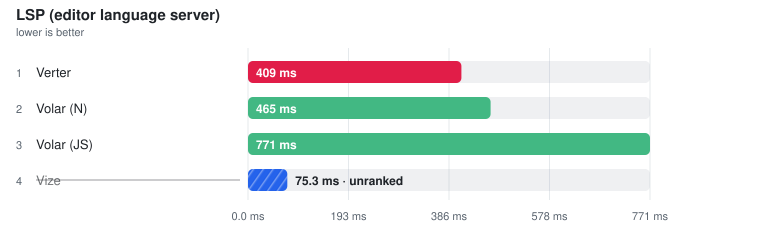

# LSP and IDE operations

> Auto-generated from the JSON snapshots in [`results/benchmarks/`](../results/benchmarks/) and [`results/real_world/`](../results/real_world/) by `pnpm docs`. Do not edit by hand.

- **Generated:** 2026-08-19T18:37:25.414Z
- **Fixture:** `fixtures/200` (200 files)
- **Runs / warmups:** 5 / 1
- **Runner:** Linux · linux/x64 · 4 CPUs · AMD EPYC 7763 64-Core Processor · 15.6 GB · Node v22.23.2
- **Commit:** [`94f6696`](https://github.com/pikax/vue-benchmarks/commit/94f6696b1c7b6f54928678126b9831febd70b4ff)
- **CI run:** https://github.com/pikax/vue-benchmarks/actions/runs/32287835178
- **Source:** `results/benchmarks/bench-Linux-200-bench.json`

## Results

Ranked on the **median of measured runs**. Warm series follow ≥1 discarded warmup and are the Compiler surface's primary ordering and ranking metric. Compiler additionally publishes a separately sampled **Fresh child** column: the first timed row workload after excluded process startup, imports and adapter setup. It is not called Cold and its ratio/noise gate never substitutes for Warm. Every table sorts fastest-first and every ratio column is **vs fastest** — the fastest ranked row is the 1.00x denominator; no tool is pinned as a reference. One table per surface unless that surface declares explicit work-equivalence classes; engine, invocation and threading are row properties, not implicit table splits — rows tagged **(JS)** run the JavaScript TypeScript compiler (a cross-engine ratio measures TypeScript's rewrite as much as the tool), and a row's label/notes say whether it is a CLI (pays process startup every run), an in-process API, single-threaded or a thread pool. Name markers: ⚠ failed validation (time bracketed, unranked) · ❌ error · ⏭ skipped. A row above CV 50% with at least three warm samples is bracketed as TOO NOISY TO RANK, no tool exempted (a two-run spread has no third sample to adjudicate, so it is flagged, not bracketed). Per-row detail is under **Notes** below each table.

> **Peak RSS** on a timing row is the tool's peak resident set: measured in the timed session where the runner samples it (LSP servers, real-world CLIs), otherwise injected from the isolated memory probe below — the probe runs each tool in its own process, separate from timing.

2026-08-20 · `fixtures/200` (200 files) · win32/x64 · source `bench-win32-200.json`

> ⚠ **Local run — not the published Linux CI series** (win32/x64 · **dirty worktree** — not attributable to a single commit). Shown because it is the newest data for this group; the next clean Linux Benchmark publish replaces it.

### LSP (editor language server)

<picture>
  <source media="(prefers-color-scheme: dark)" srcset="charts/lsp-bench-win32-200-lsp-dark.svg">
  
</picture>

Files: **1** · Bytes: **745**

Tools:

- **Volar (JS)** — @vue/language-server v3 hybrid pair — the Vue server plus typescript-language-server with @vue/typescript-plugin; both processes are measured and the slower half is charged.
- **Volar (N)** — the same Volar pair with its TypeScript half on typescript-native-bridge (tsgo) — same Vue layer, native engine.
- **Vize** — vize lsp --stdio from the npm package (native standalone server when found, Node entry otherwise — the row's notes say which). Runs its own bundled tsgo (Corsa).
- **Verter** — verter-lsp — the native server from the published npm package (version in the notes). Runs stable tsgo.

| Tool | **Median (primary)** | Min | Stddev | CV% | vs fastest | Hover bytes | Throughput | Peak RSS |
| --- | ---: | ---: | ---: | ---: | ---: | ---: | ---: | ---: |
| Verter | **409.4 ms** | 399.3 ms | 12.1 ms | 2.9% | 1.00x | 113 | 2 files/s | 263.7 MB |
| Volar (N) | **465.5 ms** | 415.8 ms | 25.1 ms | 5.4% | 1.14x | 114 | 2 files/s | – |
| Volar (JS) | **771.3 ms** | 729.3 ms | 55.7 ms | 7.2% | 1.88x | 114 | 1 files/s | 140.2 MB |
| Vize ⚠ | (75.3 ms) | (71.1 ms) | – | – | not ranked | (0) | – | (280.0 MB) |

<details><summary>Notes</summary>

- **Verter**: verter-lsp stdio, the native server from the published npm package. $/verter/ready is OBSERVED, never waited for — its workspace load is inside the timed open→hover window like every other server's. | engine: tsgo 7.0.2 (typescript-go@7.0.2 → @typescript/typescript-win32-x64) | init=27ms · ready=42ms · open→hover=409ms · hoverCold=13ms · hoverWarm=1ms · completion=1ms · definition=1ms | hover verified: returns a TypeScript type for `benchMarker` in &lt;script setup> AND the auto-unwrapped `string` inside {{ }} (template is really typechecked)
- **Volar (N)**: Identical to the Volar row above except the TypeScript half runs on typescript-native-bridge (tsgo) instead of the JavaScript TypeScript: same @vue/language-server, same @vue/typescript-plugin, same bridge, tsdk pointed at TNB 6.0.3-bridge.13.tsgo.7.0.2 tsdk. Isolates how much of Volar's latency is TypeScript's engine rather than the Vue layer. | engine: tsgo 7.0.2 via TNB 6.0.3-bridge.13.tsgo.7.0.2 | init=548ms · ready=n/a · open→hover=465ms · hoverCold=3ms · hoverWarm=1ms · completion=11ms · definition=4ms | hover verified: returns a TypeScript type for `benchMarker` in &lt;script setup> AND the auto-unwrapped `string` inside {{ }} (template is really typechecked)
- **Volar (JS)**: Official Vue language server v3, hybrid (two-process) mode — the only mode v3 has. Measured unit is the pair: @vue/language-server plus typescript-language-server with @vue/typescript-plugin, joined by the tsserver/request↔tsserver/response bridge (the VS Code/Neovim client contract). The .vue buffer is synced to both and both are asked for each feature, in parallel, with the slower one charged — a script-block hover is answered by the TypeScript half, since v3 ships no semantic TS provider in the Vue server. Startup and project load of BOTH processes are inside the timings. If hybrid wiring fails, row is error — not ranked as slow. Primary metric: didOpen→hover. | engine: TypeScript 6.0.3 (JS) | init=522ms · ready=n/a · open→hover=771ms · hoverCold=110ms · hoverWarm=1ms · completion=13ms · definition=7ms | hover verified: returns a TypeScript type for `benchMarker` in &lt;script setup> AND the auto-unwrapped `string` inside {{ }} (template is really typechecked)
- **Vize ⚠**: vize lsp --stdio, launched from the npm package's NODE entry (bin/vize → NAPI addon under Node) because no version-matched native server was found; this costs ~35ms of Node bootstrap per spawn, inside initialize (C:\nvm4w\nodejs\node.exe). Set VIZE_LSP_BIN to pin a specific binary. Same workspace/file/position as Volar. Ready signal: none standardized → workspaceReady = n/a. | engine: tsgo 7.0.0-dev.20260603.1 (nightly) | init=62ms · ready=n/a · open→hover=82ms · hoverCold=1ms · hoverWarm=0ms · completion=1ms · definition=0ms | ⚠ FAILED VALIDATION (script hover) — empty hover payload. Sample: "" | ⚠ BACKEND FALLBACK — tsgo/Corsa backend did not start — server answered from its own semantic analysis (OpenProject request returned no error but project not present in snapshot)

</details>

<details><summary>Methodology</summary>

- Apples-to-apples: identical workspace, LspTarget.vue, UTF-16 hover position on `const benchMarker`.
- Hover content is gated in TWO places, both required to be ranked: the `<script setup>` position (must return a TypeScript type) and the `{{ benchMarker }}` TEMPLATE position (must return the auto-unwrapped `string`). The template probe is the Vue-specific one — a server can satisfy the script probe by proxying to a TypeScript server, but resolving a ref's unwrapped type inside an interpolation requires actually modelling the template, which is the job a Vue language server exists to do. A payload naming the symbol with no type, or returning the `Ref<...>` script type, fails.
- The template probe runs OUTSIDE every timed window, so it gates ranking without changing what the latency column measures.
- Each measured run starts a fresh language-server process (tool process cold).
- Volar is measured as the two-process product it is in v3: @vue/language-server has no in-process TypeScript language service, so the harness also starts typescript-language-server with @vue/typescript-plugin, syncs the same .vue buffer to both, and asks both for every feature in parallel — Volar is charged the slower half plus both processes' startup and project load. This is the same wiring VS Code and Neovim implement; without it the Vue server returns null for a &lt;script setup> hover by design.
- Primary ranking column uses didOpen→hover latency (first semantic response after open), taken as the median over warmed runs — each run still starts a fresh server process, so per-process project load is measured every time.
- Hover retry budget is identical for every server (6 attempts, 60s each, same backoff). Retry sleeps fall inside the timed open→hover window, so an asymmetric budget would silently subsidise whichever server got the larger one.
- A fixed 50ms yield after didOpen is inside the timed window for every server alike — it is an additive constant, so it compresses ratios slightly but cannot reorder them.
- Phase breakdown in Notes: initialize, ready (n/a if no server signal), open→hover, hover cold, hover warm median(5), completion, definition.
- workspaceReady is OBSERVED, never waited for. A vendor ready notification (e.g. $/verter/ready) is recorded from session start as a diagnostic and never enters a ranked column — the harness does not pause on it. It previously did, which moved one server's workspace load OUT of the ranked open→hover window while every other server's stayed inside it. Missing signal = n/a, not 0.
- Readiness is established identically for every server and INSIDE the ranked window, via the shared didOpen→hover retry loop — the same content-gated approach the ide-ops suites use. Whoever needs project-load time pays for it in the metric.
- Rows share one table across TypeScript engines, tagged by the same resolver the typecheck surface uses: Volar (JS) runs the JavaScript TypeScript compiler, while Volar (N), Vize and Verter all run native tsgo. A cross-engine ratio measures TypeScript's Go rewrite as much as the Vue layer under test — the (JS) tag is there so you compare like with like.
- Process host (native executable vs Node) is NOT a comparison-class axis here — there is no native Volar and no Node-hosted Verter, so splitting on it would leave every table with one row. It is printed on the row instead.
- Vize is launched from the standalone native server the VS Code extension downloads (version-matched, discovered under VS Code globalStorage, or pinned with VIZE_LSP_BIN) — that is the process the shipped product runs. Where no native server exists, e.g. CI, the npm package's Node entry is used and the row says so, because the Node bootstrap it adds (~35ms/spawn, inside initialize) is not part of the product.
- Completion/definition are best-effort extras; null/n/a does not mean the tool is slower — capability may differ.
- typescript-native-bridge (TNB) is a drop-in typescript package for CLI/tsserver — NOT a Vue LSP in its own right. It appears here only as Volar's TypeScript engine: the `Volar (TNB / tsgo tsdk)` row is the same Volar binary with TNB supplying the tsserver half, so the pair isolates the TS engine from the Vue layer.
- Verter resolves from the installed `verter-lsp` package only; skipped when it is absent.
- VS Code extension host overhead is NOT measured — only the language server stdio protocol.
- Server order is rotated on every warmup and measured run; no server is pinned to first position.

Raw runs:

- **Verter**: 399.3 ms, 412.4 ms, 402.1 ms, 430.0 ms, 409.4 ms
- **Volar (N)**: 475.8 ms, 470.1 ms, 440.2 ms, 415.8 ms, 465.5 ms
- **Volar (JS)**: 876.1 ms, 778.7 ms, 729.3 ms, 756.3 ms, 771.3 ms
- **Vize**: 76.8 ms, 74.3 ms, 75.3 ms, 71.1 ms, 81.6 ms

</details>

### bench-Linux-200-bench

2026-08-19 · `fixtures/200` (200 files) · linux/x64 · source `bench-Linux-200-bench.json`

#### LSP (editor language server)

<picture>
  <source media="(prefers-color-scheme: dark)" srcset="charts/lsp-bench-linux-200-bench-lsp-dark.svg">
  
</picture>

Files: **1** · Bytes: **745**

Tools:

- **Volar (JS)** — @vue/language-server v3 hybrid pair — the Vue server plus typescript-language-server with @vue/typescript-plugin; both processes are measured and the slower half is charged.
- **Volar (N)** — the same Volar pair with its TypeScript half on typescript-native-bridge (tsgo) — same Vue layer, native engine.
- **Vize** — vize lsp --stdio from the npm package (native standalone server when found, Node entry otherwise — the row's notes say which). Runs its own bundled tsgo (Corsa).
- **Verter** — verter-lsp — the native server from the published npm package (version in the notes). Runs stable tsgo.

| Tool | **Median (primary)** | Min | Stddev | CV% | vs fastest | Hover bytes | Throughput | Peak RSS |
| --- | ---: | ---: | ---: | ---: | ---: | ---: | ---: | ---: |
| Verter | **303.1 ms** | 296.0 ms | 25.0 ms | 8.3% | 1.00x | 113 | 3 files/s | 263.7 MB |
| Vize | **355.7 ms** | 342.4 ms | 9.7 ms | 2.7% | 1.17x | 113 | 3 files/s | 280.0 MB |
| Volar (N) | **459.9 ms** | 441.5 ms | 10.6 ms | 2.3% | 1.52x | 114 | 2 files/s | – |
| Volar (JS) | **1.22 s** | 1.19 s | 95.5 ms | 7.8% | 4.04x | 114 | 1 files/s | 140.2 MB |

<details><summary>Notes</summary>

- **Verter**: verter-lsp stdio, the native server from the published npm package. $/verter/ready is OBSERVED, never waited for — its workspace load is inside the timed open→hover window like every other server's. | engine: tsgo 7.0.2 (typescript-go@7.0.2 → @typescript/typescript-linux-x64) | init=5ms · ready=30ms · open→hover=301ms · hoverCold=1ms · hoverWarm=1ms · completion=1ms · definition=1ms | hover verified: returns a TypeScript type for `benchMarker` in &lt;script setup> AND the auto-unwrapped `string` inside {{ }} (template is really typechecked)
- **Vize**: vize lsp --stdio, launched from the npm package's NODE entry (bin/vize → NAPI addon under Node) because no version-matched native server was found; this costs ~35ms of Node bootstrap per spawn, inside initialize (/opt/hostedtoolcache/node/22.23.2/x64/bin/node). Set VIZE_LSP_BIN to pin a specific binary. Same workspace/file/position as Volar. Ready signal: none standardized → workspaceReady = n/a. | engine: tsgo 7.0.0-dev.20260603.1 (nightly) | init=39ms · ready=n/a · open→hover=344ms · hoverCold=51ms · hoverWarm=5ms · completion=8ms · definition=3ms | hover verified: returns a TypeScript type for `benchMarker` in &lt;script setup> AND the auto-unwrapped `string` inside {{ }} (template is really typechecked)
- **Volar (N)**: Identical to the Volar row above except the TypeScript half runs on typescript-native-bridge (tsgo) instead of the JavaScript TypeScript: same @vue/language-server, same @vue/typescript-plugin, same bridge, tsdk pointed at TNB 6.0.3-bridge.13.tsgo.7.0.2 tsdk. Isolates how much of Volar's latency is TypeScript's engine rather than the Vue layer. | engine: tsgo 7.0.2 via TNB 6.0.3-bridge.13.tsgo.7.0.2 | init=571ms · ready=n/a · open→hover=456ms · hoverCold=20ms · hoverWarm=2ms · completion=5ms · definition=4ms | hover verified: returns a TypeScript type for `benchMarker` in &lt;script setup> AND the auto-unwrapped `string` inside {{ }} (template is really typechecked)
- **Volar (JS)**: Official Vue language server v3, hybrid (two-process) mode — the only mode v3 has. Measured unit is the pair: @vue/language-server plus typescript-language-server with @vue/typescript-plugin, joined by the tsserver/request↔tsserver/response bridge (the VS Code/Neovim client contract). The .vue buffer is synced to both and both are asked for each feature, in parallel, with the slower one charged — a script-block hover is answered by the TypeScript half, since v3 ships no semantic TS provider in the Vue server. Startup and project load of BOTH processes are inside the timings. If hybrid wiring fails, row is error — not ranked as slow. Primary metric: didOpen→hover. | engine: TypeScript 6.0.3 (JS) | init=570ms · ready=n/a · open→hover=1205ms · hoverCold=9ms · hoverWarm=2ms · completion=18ms · definition=9ms | hover verified: returns a TypeScript type for `benchMarker` in &lt;script setup> AND the auto-unwrapped `string` inside {{ }} (template is really typechecked)

</details>

<details><summary>Methodology</summary>

- Apples-to-apples: identical workspace, LspTarget.vue, UTF-16 hover position on `const benchMarker`.
- Hover content is gated in TWO places, both required to be ranked: the `<script setup>` position (must return a TypeScript type) and the `{{ benchMarker }}` TEMPLATE position (must return the auto-unwrapped `string`). The template probe is the Vue-specific one — a server can satisfy the script probe by proxying to a TypeScript server, but resolving a ref's unwrapped type inside an interpolation requires actually modelling the template, which is the job a Vue language server exists to do. A payload naming the symbol with no type, or returning the `Ref<...>` script type, fails.
- The template probe runs OUTSIDE every timed window, so it gates ranking without changing what the latency column measures.
- Each measured run starts a fresh language-server process (tool process cold).
- Volar is measured as the two-process product it is in v3: @vue/language-server has no in-process TypeScript language service, so the harness also starts typescript-language-server with @vue/typescript-plugin, syncs the same .vue buffer to both, and asks both for every feature in parallel — Volar is charged the slower half plus both processes' startup and project load. This is the same wiring VS Code and Neovim implement; without it the Vue server returns null for a &lt;script setup> hover by design.
- Primary ranking column uses didOpen→hover latency (first semantic response after open), taken as the median over warmed runs — each run still starts a fresh server process, so per-process project load is measured every time.
- Hover retry budget is identical for every server (6 attempts, 60s each, same backoff). Retry sleeps fall inside the timed open→hover window, so an asymmetric budget would silently subsidise whichever server got the larger one.
- A fixed 50ms yield after didOpen is inside the timed window for every server alike — it is an additive constant, so it compresses ratios slightly but cannot reorder them.
- Phase breakdown in Notes: initialize, ready (n/a if no server signal), open→hover, hover cold, hover warm median(5), completion, definition.
- workspaceReady is OBSERVED, never waited for. A vendor ready notification (e.g. $/verter/ready) is recorded from session start as a diagnostic and never enters a ranked column — the harness does not pause on it. It previously did, which moved one server's workspace load OUT of the ranked open→hover window while every other server's stayed inside it. Missing signal = n/a, not 0.
- Readiness is established identically for every server and INSIDE the ranked window, via the shared didOpen→hover retry loop — the same content-gated approach the ide-ops suites use. Whoever needs project-load time pays for it in the metric.
- Rows share one table across TypeScript engines, tagged by the same resolver the typecheck surface uses: Volar (JS) runs the JavaScript TypeScript compiler, while Volar (N), Vize and Verter all run native tsgo. A cross-engine ratio measures TypeScript's Go rewrite as much as the Vue layer under test — the (JS) tag is there so you compare like with like.
- Process host (native executable vs Node) is NOT a comparison-class axis here — there is no native Volar and no Node-hosted Verter, so splitting on it would leave every table with one row. It is printed on the row instead.
- Vize is launched from the standalone native server the VS Code extension downloads (version-matched, discovered under VS Code globalStorage, or pinned with VIZE_LSP_BIN) — that is the process the shipped product runs. Where no native server exists, e.g. CI, the npm package's Node entry is used and the row says so, because the Node bootstrap it adds (~35ms/spawn, inside initialize) is not part of the product.
- Completion/definition are best-effort extras; null/n/a does not mean the tool is slower — capability may differ.
- typescript-native-bridge (TNB) is a drop-in typescript package for CLI/tsserver — NOT a Vue LSP in its own right. It appears here only as Volar's TypeScript engine: the `Volar (TNB / tsgo tsdk)` row is the same Volar binary with TNB supplying the tsserver half, so the pair isolates the TS engine from the Vue layer.
- Verter resolves from the installed `verter-lsp` package only; skipped when it is absent.
- VS Code extension host overhead is NOT measured — only the language server stdio protocol.
- Server order is rotated on every warmup and measured run; no server is pinned to first position.

Raw runs:

- **Verter**: 331.0 ms, 354.9 ms, 303.1 ms, 296.0 ms, 301.5 ms
- **Vize**: 365.2 ms, 355.7 ms, 342.4 ms, 357.4 ms, 343.8 ms
- **Volar (N)**: 468.8 ms, 459.9 ms, 441.5 ms, 465.3 ms, 456.0 ms
- **Volar (JS)**: 1.31 s, 1.22 s, 1.19 s, 1.42 s, 1.20 s

</details>

## IDE operations

The same language servers, measured per editor operation over LSP. Ranked **per operation**, never pooled. These operations differ by orders of magnitude and answer unrelated questions, so one table each. Each request-style operation publishes **Cold** (first request after initialize+didOpen in a **fresh session dedicated to that operation** — later ops do not reuse a warmed server) and **Warm** (the same request immediately after). Ranking uses Cold; vs-fastest-cold sits next to it. A row that failed its content gate on the cold request is shown in brackets and excluded from ranking — latency without a correct answer is not a comparable measurement.

### IDE · initialize

Files: **1** · Bytes: **0**

Tools:

- **Volar (JS)** — @vue/language-server v3 hybrid pair — the Vue server plus typescript-language-server with @vue/typescript-plugin; both processes are measured and the slower half is charged.
- **Volar (N)** — the same Volar pair with its TypeScript half on typescript-native-bridge (tsgo) — same Vue layer, native engine.
- **Vize** — vize lsp --stdio from the npm package (native standalone server when found, Node entry otherwise — the row's notes say which). Runs its own bundled tsgo (Corsa).
- **Verter** — verter-lsp — the native server from the published npm package (version in the notes). Runs stable tsgo.

#### LSP initialize

<picture>
  <source media="(prefers-color-scheme: dark)" srcset="charts/lsp-ide-ide-initialize-lsp-initialize-dark.svg">
  
</picture>

| Tool | **Median (primary)** | Min | Stddev | CV% | vs fastest | Artifact | Throughput |
| --- | ---: | ---: | ---: | ---: | ---: | ---: | ---: |
| Verter | **31.1 ms** | 26.1 ms | 3.0 ms | 10.0% | 1.00x | n/a | n/a |
| Vize | **63.7 ms** | 56.7 ms | 6.5 ms | 10.2% ⚠ | 2.05x | n/a | n/a |
| Volar (JS) | **569.3 ms** | 530.0 ms | 28.5 ms | 4.9% | 18.29x | n/a | n/a |
| Volar (N) | **580.4 ms** | 537.8 ms | 41.5 ms | 7.1% | 18.64x | n/a | n/a |

<details><summary>Notes</summary>

- **Verter**: LSP initialize handshake after spawn (not first-request latency) | engine: tsgo 7.0.2 (typescript-go@7.0.2 → @typescript/typescript-win32-x64)
- **Vize**: LSP initialize handshake after spawn (not first-request latency) | ⚠ BACKEND FALLBACK — tsgo/Corsa backend did not start — server answered from its own semantic analysis (OpenProject request returned no error but project not present in snapshot) | engine: tsgo 7.0.0-dev.20260603.1 (nightly)
- **Volar (JS)**: LSP initialize handshake after spawn (not first-request latency) | engine: TypeScript 6.0.3 (JS)
- **Volar (N)**: LSP initialize handshake after spawn (not first-request latency) | engine: tsgo 7.0.2 via TNB 6.0.3-bridge.13.tsgo.7.0.2

</details>

<details><summary>Raw runs</summary>

- **Verter**: 30.9 ms, 33.3 ms, 33.7 ms, 26.1 ms, 33.5 ms, 34.1 ms, 31.7 ms, 30.7 ms, 26.1 ms, 31.3 ms, 27.7 ms, 27.0 ms
- **Vize**: 64.0 ms, 65.1 ms, 58.4 ms, 65.5 ms, 78.5 ms, 58.3 ms, 58.9 ms, 56.7 ms, 68.7 ms, 63.4 ms, 59.0 ms, 72.0 ms
- **Volar (JS)**: 530.0 ms, 579.1 ms, 558.6 ms, 643.2 ms, 594.2 ms, 569.1 ms, 564.7 ms, 569.5 ms, 568.2 ms, 581.0 ms, 608.7 ms, 559.4 ms
- **Volar (N)**: 609.4 ms, 589.1 ms, 695.2 ms, 596.0 ms, 562.5 ms, 553.1 ms, 577.3 ms, 537.8 ms, 583.6 ms, 559.4 ms, 547.3 ms, 598.6 ms

</details>

<details><summary>Methodology</summary>

- Time from process spawn through the LSP initialize/initialized handshake, pooled across the suites in this job (small purpose-built workspaces). This is server startup, not the first editor request — Cold on the operation tables is that first request.

</details>

### IDE · completion

Files: **1** · Bytes: **0**

Tools:

- **Volar (JS)** — @vue/language-server v3 hybrid pair — the Vue server plus typescript-language-server with @vue/typescript-plugin; both processes are measured and the slower half is charged.
- **Volar (N)** — the same Volar pair with its TypeScript half on typescript-native-bridge (tsgo) — same Vue layer, native engine.
- **Vize** — vize lsp --stdio from the npm package (native standalone server when found, Node entry otherwise — the row's notes say which). Runs its own bundled tsgo (Corsa).
- **Verter** — verter-lsp — the native server from the published npm package (version in the notes). Runs stable tsgo.

#### Completion: script member

<picture>
  <source media="(prefers-color-scheme: dark)" srcset="charts/lsp-ide-ide-completion-completion-script-member-dark.svg">
  
</picture>

| Tool | **Cold** | vs fastest cold | **Warm** | Min | Stddev | CV% | vs fastest | Artifact | Throughput |
| --- | ---: | ---: | ---: | ---: | ---: | ---: | ---: | ---: | ---: |
| Verter | **496.7 ms** | 1.00x | **24.9 ms** | 17.3 ms | 10.8 ms | 43.3% ⚠ | 1.69x | 3 | n/a |
| Volar (N) | **671.6 ms** | 1.35x | **17.1 ms** | 6.8 ms | 14.5 ms | 85.1% ⚠ | 1.16x | 3 | n/a |
| Volar (JS) | **795.1 ms** | 1.60x | **14.8 ms** | 12.4 ms | 3.4 ms | 22.8% ⚠ | 1.00x | 3 | n/a |
| Vize ⚠ | (0.7 ms) | not ranked | (0.2 ms) | (0.2 ms) | – | – | not ranked | (0) | – |

<details><summary>Notes</summary>

- **Verter**: content verified | engine: tsgo 7.0.2 (typescript-go@7.0.2 → @typescript/typescript-win32-x64)
- **Volar (N)**: content verified | engine: tsgo 7.0.2 via TNB 6.0.3-bridge.13.tsgo.7.0.2
- **Volar (JS)**: content verified | engine: TypeScript 6.0.3 (JS)
- **Vize ⚠**: ⚠ FAILED VALIDATION — cold: no `quaver` member of the local object in 0 items | Sample: "(empty list)" | ⚠ BACKEND FALLBACK — tsgo/Corsa backend did not start — server answered from its own semantic analysis (OpenProject request returned no error but project not present in snapshot) | engine: tsgo 7.0.0-dev.20260603.1 (nightly)

</details>

<details><summary>Raw runs</summary>

- **Verter**: 17.3 ms, 32.5 ms
- **Volar (N)**: 6.8 ms, 27.3 ms
- **Volar (JS)**: 17.1 ms, 12.4 ms
- **Vize**: 0.2 ms, 0.3 ms

</details>

#### Completion: component tag &lt;Ch

<picture>
  <source media="(prefers-color-scheme: dark)" srcset="charts/lsp-ide-ide-completion-completion-component-tag-ch-dark.svg">
  
</picture>

| Tool | **Cold** | vs fastest cold | **Warm** | Min | Stddev | CV% | vs fastest | Artifact | Throughput |
| --- | ---: | ---: | ---: | ---: | ---: | ---: | ---: | ---: | ---: |
| Volar (JS) | **74.0 ms** | 1.00x | **24.2 ms** | 23.0 ms | 1.8 ms | 7.3% | 1.00x | 192 | n/a |
| Volar (N) | **102.5 ms** | 1.38x | **57.5 ms** | 50.2 ms | 10.4 ms | 18.1% ⚠ | 2.37x | 192 | n/a |
| Verter | **136.8 ms** | 1.85x | **40.2 ms** | 34.6 ms | 8.0 ms | 19.8% ⚠ | 1.66x | 1,193 | n/a |
| Vize ⚠ | (0.6 ms) | not ranked | (0.5 ms) | (0.4 ms) | – | – | not ranked | (42) | – |

<details><summary>Notes</summary>

- **Volar (JS)**: content verified | engine: TypeScript 6.0.3 (JS)
- **Volar (N)**: content verified | engine: tsgo 7.0.2 via TNB 6.0.3-bridge.13.tsgo.7.0.2
- **Verter**: content verified | engine: tsgo 7.0.2 (typescript-go@7.0.2 → @typescript/typescript-win32-x64)
- **Vize ⚠**: ⚠ FAILED VALIDATION — cold: no `ChildCard` component tag in 42 items | Sample: "[v-if, v-else-if, v-else, v-for, v-on, v-bind, v-model, v-slot, v-show, v-pre, v-once, v-memo, …+30]" | ⚠ BACKEND FALLBACK — tsgo/Corsa backend did not start — server answered from its own semantic analysis (OpenProject request returned no error but project not present in snapshot) | engine: tsgo 7.0.0-dev.20260603.1 (nightly)

</details>

<details><summary>Raw runs</summary>

- **Volar (JS)**: 23.0 ms, 25.5 ms
- **Volar (N)**: 64.9 ms, 50.2 ms
- **Verter**: 45.9 ms, 34.6 ms
- **Vize**: 0.4 ms, 0.6 ms

</details>

#### Completion: prop name &lt;C :

<picture>
  <source media="(prefers-color-scheme: dark)" srcset="charts/lsp-ide-ide-completion-completion-prop-name-c-dark.svg">
  
</picture>

| Tool | **Cold** | vs fastest cold | **Warm** | Min | Stddev | CV% | vs fastest | Artifact | Throughput |
| --- | ---: | ---: | ---: | ---: | ---: | ---: | ---: | ---: | ---: |
| Vize | **0.7 ms** | 1.00x | **0.6 ms** | 0.5 ms | 0.2 ms | 24.6% ⚠ | 1.00x | 4 | n/a |
| Verter | **2.2 ms** | 3.32x | **1.3 ms** | 1.2 ms | 0.2 ms | 12.6% ⚠ | 1.99x | 16 | n/a |
| Volar (N) | **46.0 ms** | 69.12x | **5.3 ms** | 4.7 ms | 0.8 ms | 15.8% ⚠ | 8.26x | 26 | n/a |
| Volar (JS) | **82.4 ms** | 123.80x | **6.3 ms** | 5.8 ms | 0.7 ms | 10.6% ⚠ | 9.86x | 26 | n/a |

<details><summary>Notes</summary>

- **Vize**: content verified | ⚠ BACKEND FALLBACK — tsgo/Corsa backend did not start — server answered from its own semantic analysis (OpenProject request returned no error but project not present in snapshot) | engine: tsgo 7.0.0-dev.20260603.1 (nightly)
- **Verter**: content verified | engine: tsgo 7.0.2 (typescript-go@7.0.2 → @typescript/typescript-win32-x64)
- **Volar (N)**: content verified | engine: tsgo 7.0.2 via TNB 6.0.3-bridge.13.tsgo.7.0.2
- **Volar (JS)**: content verified | engine: TypeScript 6.0.3 (JS)

</details>

<details><summary>Raw runs</summary>

- **Vize**: 0.5 ms, 0.8 ms
- **Verter**: 1.4 ms, 1.2 ms
- **Volar (N)**: 4.7 ms, 5.9 ms
- **Volar (JS)**: 6.8 ms, 5.8 ms

</details>

#### Completion: event name &lt;C @

<picture>
  <source media="(prefers-color-scheme: dark)" srcset="charts/lsp-ide-ide-completion-completion-event-name-c-dark.svg">
  
</picture>

| Tool | **Cold** | vs fastest cold | **Warm** | Min | Stddev | CV% | vs fastest | Artifact | Throughput |
| --- | ---: | ---: | ---: | ---: | ---: | ---: | ---: | ---: | ---: |
| Volar (N) | **6.3 ms** | 1.00x | **5.6 ms** | 5.6 ms | 0.0 ms | 0.3% | 1.00x | 25 | n/a |
| Volar (JS) | **7.6 ms** | 1.22x | **6.8 ms** | 6.2 ms | 0.9 ms | 12.5% ⚠ | 1.21x | 25 | n/a |
| Vize ⚠ | (0.4 ms) | not ranked | (0.3 ms) | (0.3 ms) | – | – | not ranked | (12) | – |
| Verter ⚠ | (0.3 ms) | not ranked | (0.3 ms) | (0.3 ms) | – | – | not ranked | (0) | – |

<details><summary>Notes</summary>

- **Volar (N)**: content verified | engine: tsgo 7.0.2 via TNB 6.0.3-bridge.13.tsgo.7.0.2
- **Volar (JS)**: content verified | engine: TypeScript 6.0.3 (JS)
- **Vize ⚠**: ⚠ FAILED VALIDATION — cold: no `quench` declared emit in 12 items | Sample: "[v-on, @, @click, @input, @change, @submit, @keydown, @keyup, @focus, @blur, @mouseenter, @mouseleave]" | ⚠ BACKEND FALLBACK — tsgo/Corsa backend did not start — server answered from its own semantic analysis (OpenProject request returned no error but project not present in snapshot) | engine: tsgo 7.0.0-dev.20260603.1 (nightly)
- **Verter ⚠**: ⚠ FAILED VALIDATION — cold: no `quench` declared emit in 0 items | Sample: "(empty list)" | engine: tsgo 7.0.2 (typescript-go@7.0.2 → @typescript/typescript-win32-x64)

</details>

<details><summary>Raw runs</summary>

- **Volar (N)**: 5.6 ms, 5.6 ms
- **Volar (JS)**: 6.2 ms, 7.4 ms
- **Vize**: 0.3 ms, 0.3 ms
- **Verter**: 0.3 ms, 0.3 ms

</details>

#### Completion: directive v-

<picture>
  <source media="(prefers-color-scheme: dark)" srcset="charts/lsp-ide-ide-completion-completion-directive-v-dark.svg">
  
</picture>

| Tool | **Cold** | vs fastest cold | **Warm** | Min | Stddev | CV% | vs fastest | Artifact | Throughput |
| --- | ---: | ---: | ---: | ---: | ---: | ---: | ---: | ---: | ---: |
| Vize | **0.4 ms** | 1.00x | **0.4 ms** | 0.3 ms | 0.1 ms | 33.3% ⚠ | 1.00x | 15 | n/a |
| Volar (N) | **19.2 ms** | 52.64x | **10.7 ms** | 9.6 ms | 1.5 ms | 14.1% ⚠ | 30.00x | 498 | n/a |
| Volar (JS) | **22.2 ms** | 60.81x | **12.8 ms** | 11.8 ms | 1.4 ms | 11.2% ⚠ | 35.93x | 498 | n/a |
| Verter ⚠ | (0.3 ms) | not ranked | (0.3 ms) | (0.3 ms) | – | – | not ranked | (3) | – |

<details><summary>Notes</summary>

- **Vize**: content verified | ⚠ BACKEND FALLBACK — tsgo/Corsa backend did not start — server answered from its own semantic analysis (OpenProject request returned no error but project not present in snapshot) | engine: tsgo 7.0.0-dev.20260603.1 (nightly)
- **Volar (N)**: content verified | engine: tsgo 7.0.2 via TNB 6.0.3-bridge.13.tsgo.7.0.2
- **Volar (JS)**: content verified | engine: TypeScript 6.0.3 (JS)
- **Verter ⚠**: ⚠ FAILED VALIDATION — cold: no `v-if` directive in 3 items | Sample: "[style scoped, style, i18n]" | engine: tsgo 7.0.2 (typescript-go@7.0.2 → @typescript/typescript-win32-x64)

</details>

<details><summary>Raw runs</summary>

- **Vize**: 0.3 ms, 0.4 ms
- **Volar (N)**: 11.8 ms, 9.6 ms
- **Volar (JS)**: 11.8 ms, 13.8 ms
- **Verter**: 0.3 ms, 0.3 ms

</details>

#### Completion: slot name &lt;template #

<picture>
  <source media="(prefers-color-scheme: dark)" srcset="charts/lsp-ide-ide-completion-completion-slot-name-template-dark.svg">
  
</picture>

| Tool | **Cold** | vs fastest cold | **Warm** | Min | Stddev | CV% | vs fastest | Artifact | Throughput |
| --- | ---: | ---: | ---: | ---: | ---: | ---: | ---: | ---: | ---: |
| Verter | **0.3 ms** | 1.00x | **0.2 ms** | 0.2 ms | 0.0 ms | 7.9% | 1.00x | 2 | n/a |
| Vize | **0.8 ms** | 2.69x | **1.1 ms** | 0.7 ms | 0.5 ms | 42.6% ⚠ | 4.40x | 30 | n/a |
| Volar (N) | **9.8 ms** | 31.44x | **11.4 ms** | 10.3 ms | 1.5 ms | 13.3% ⚠ | 47.04x | 500 | n/a |
| Volar (JS) | **40.1 ms** | 128.99x | **11.6 ms** | 11.3 ms | 0.4 ms | 3.6% | 48.17x | 500 | n/a |

<details><summary>Notes</summary>

- **Verter**: content verified | engine: tsgo 7.0.2 (typescript-go@7.0.2 → @typescript/typescript-win32-x64)
- **Vize**: content verified | ⚠ BACKEND FALLBACK — tsgo/Corsa backend did not start — server answered from its own semantic analysis (OpenProject request returned no error but project not present in snapshot) | engine: tsgo 7.0.0-dev.20260603.1 (nightly)
- **Volar (N)**: content verified | engine: tsgo 7.0.2 via TNB 6.0.3-bridge.13.tsgo.7.0.2
- **Volar (JS)**: content verified | engine: TypeScript 6.0.3 (JS)

</details>

<details><summary>Raw runs</summary>

- **Verter**: 0.3 ms, 0.2 ms
- **Vize**: 1.4 ms, 0.7 ms
- **Volar (N)**: 12.4 ms, 10.3 ms
- **Volar (JS)**: 11.3 ms, 11.9 ms

</details>

#### Completion: auto-import

<picture>
  <source media="(prefers-color-scheme: dark)" srcset="charts/lsp-ide-ide-completion-completion-auto-import-dark.svg">
  
</picture>

| Tool | **Median (primary)** | Min | Stddev | CV% | vs fastest | Artifact | Throughput |
| --- | ---: | ---: | ---: | ---: | ---: | ---: | ---: |
| Volar (JS) | **21.0 ms** | 20.4 ms | 0.8 ms | 3.9% | 1.00x | 1,073 | n/a |
| Volar (N) | **55.2 ms** | 53.9 ms | 1.8 ms | 3.3% | 2.63x | 1,073 | n/a |
| Vize ⚠ | (0.8 ms) | (0.5 ms) | – | – | not ranked | (44) | – |
| Verter ⚠ | (0.4 ms) | (0.3 ms) | – | – | not ranked | (9) | – |

<details><summary>Notes</summary>

- **Volar (JS)**: content verified | engine: TypeScript 6.0.3 (JS)
- **Volar (N)**: content verified | engine: tsgo 7.0.2 via TNB 6.0.3-bridge.13.tsgo.7.0.2
- **Vize ⚠**: ⚠ FAILED VALIDATION — `computed` offered but no import edit on any entry, in the list or after resolve — see resolve-auto-import | Sample: "offered: \"computed\" kind=3 detail=\"function computed&lt;T>(getter: () => T): ComputedRef&lt;T>\" ; \"import computed\" kind=9 detail=\"Import computed from Vue\" insertTex" | ⚠ BACKEND FALLBACK — tsgo/Corsa backend did not start — server answered from its own semantic analysis (OpenProject request returned no error but project not present in snapshot) | engine: tsgo 7.0.0-dev.20260603.1 (nightly)
- **Verter ⚠**: ⚠ FAILED VALIDATION — no `computed` in 9 items | Sample: "[headline, visible, probe, chosen, onDismiss, derived, ref, ChildCard, SiblingCard]" | engine: tsgo 7.0.2 (typescript-go@7.0.2 → @typescript/typescript-win32-x64)

</details>

<details><summary>Raw runs</summary>

- **Volar (JS)**: 21.6 ms, 20.4 ms
- **Volar (N)**: 53.9 ms, 56.5 ms
- **Vize**: 1.1 ms, 0.5 ms
- **Verter**: 0.3 ms, 0.4 ms

</details>

#### Resolve: auto-import edit

<picture>
  <source media="(prefers-color-scheme: dark)" srcset="charts/lsp-ide-ide-completion-resolve-auto-import-edit-dark.svg">
  
</picture>

| Tool | **Median (primary)** | Min | Stddev | CV% | vs fastest | Artifact | Throughput |
| --- | ---: | ---: | ---: | ---: | ---: | ---: | ---: |
| Volar (JS) | **26.9 ms** | 23.6 ms | 4.6 ms | 17.2% ⚠ | 1.00x | 241 | n/a |
| Volar (N) | **67.1 ms** | 56.7 ms | 14.7 ms | 21.9% ⚠ | 2.49x | 241 | n/a |
| Vize ⚠ | (0.3 ms) | (0.2 ms) | – | – | not ranked | (223) | – |
| Verter ⚠ | (0.0 ms) | (0.0 ms) | – | – | not ranked | – | – |

<details><summary>Notes</summary>

- **Volar (JS)**: content verified | engine: TypeScript 6.0.3 (JS)
- **Volar (N)**: content verified | engine: tsgo 7.0.2 via TNB 6.0.3-bridge.13.tsgo.7.0.2
- **Vize ⚠**: ⚠ FAILED VALIDATION — resolve returned no import edit for `computed` | Sample: "\"computed\" kind=3 detail=\"function computed&lt;T>(getter: () => T): ComputedRef&lt;T>\"" | ⚠ BACKEND FALLBACK — tsgo/Corsa backend did not start — server answered from its own semantic analysis (OpenProject request returned no error but project not present in snapshot) | engine: tsgo 7.0.0-dev.20260603.1 (nightly)
- **Verter ⚠**: ⚠ FAILED VALIDATION — auto-import completion offered no `computed` item to resolve | Sample: "[headline, visible, probe, chosen, onDismiss, derived, ref, ChildCard, SiblingCard]" | engine: tsgo 7.0.2 (typescript-go@7.0.2 → @typescript/typescript-win32-x64)

</details>

<details><summary>Raw runs</summary>

- **Volar (JS)**: 23.6 ms, 30.2 ms
- **Volar (N)**: 77.5 ms, 56.7 ms
- **Vize**: 0.3 ms, 0.2 ms
- **Verter**: 0.0 ms, 0.0 ms

</details>

#### Resolve: script member detail

<picture>
  <source media="(prefers-color-scheme: dark)" srcset="charts/lsp-ide-ide-completion-resolve-script-member-detail-dark.svg">
  
</picture>

| Tool | **Median (primary)** | Min | Stddev | CV% | vs fastest | Artifact | Throughput |
| --- | ---: | ---: | ---: | ---: | ---: | ---: | ---: |
| Volar (JS) | **2.2 ms** | 2.2 ms | 0.1 ms | 2.6% | 1.00x | 25 | n/a |
| Verter | **5.4 ms** | 4.0 ms | 2.1 ms | 38.1% ⚠ | 2.43x | 25 | n/a |
| Volar (N) | **6.0 ms** | 5.3 ms | 1.1 ms | 18.4% ⚠ | 2.70x | 25 | n/a |
| Vize ⚠ | (0.0 ms) | (0.0 ms) | – | – | not ranked | – | – |

<details><summary>Notes</summary>

- **Volar (JS)**: content verified | engine: TypeScript 6.0.3 (JS)
- **Verter**: content verified | engine: tsgo 7.0.2 (typescript-go@7.0.2 → @typescript/typescript-win32-x64)
- **Volar (N)**: content verified | engine: tsgo 7.0.2 via TNB 6.0.3-bridge.13.tsgo.7.0.2
- **Vize ⚠**: ⚠ FAILED VALIDATION — script member completion offered no `quaver` item to resolve (0 items) | Sample: "(empty list)" | ⚠ BACKEND FALLBACK — tsgo/Corsa backend did not start — server answered from its own semantic analysis (OpenProject request returned no error but project not present in snapshot) | engine: tsgo 7.0.0-dev.20260603.1 (nightly)

</details>

<details><summary>Raw runs</summary>

- **Volar (JS)**: 2.3 ms, 2.2 ms
- **Verter**: 6.9 ms, 4.0 ms
- **Volar (N)**: 6.8 ms, 5.3 ms
- **Vize**: 0.0 ms, 0.0 ms

</details>

<details><summary>Methodology</summary>

- Every operation carries a content gate; the timing is only ranked when the answer was verified correct.
- Peak RSS is the whole language-server process tree during the timed session (Volar = Vue half + TypeScript half). It is sampled alongside the run, not from a separate memory job.
- Rows share one table across TypeScript engines; rows tagged (JS) run the JavaScript compiler — Volar (@vue/language-server) = TypeScript 6.0.3 (JS); Volar (TNB / tsgo tsdk) = tsgo 7.0.2 via TNB 6.0.3-bridge.13.tsgo.7.0.2; Vize LSP (Node shim) = tsgo 7.0.0-dev.20260603.1 (nightly); Verter LSP (npm 0.0.1-beta.3) = tsgo 7.0.2 (typescript-go@7.0.2 → @typescript/typescript-win32-x64). Volar on the stock JavaScript tsdk and Volar on the tsgo tsdk are the same Vue layer differing only in engine, so a cross-engine ratio measures TypeScript's Go rewrite as much as the server. Same axis, same resolver as the typecheck surface.
- Volar is measured as the two-process product it is: both halves are asked in parallel and the pair is charged the slower leg.
- A rejected leg counts as `no answer from this provider`, not as a failure of the pair — Volar's Vue half legitimately rejects methods it does not implement, and an editor routes those to the TypeScript half.
- Document URIs are compared normalised, never by string equality: the same file arrives percent-encoded and with a different drive-letter case from different servers.
- Each suite builds its own purpose-built workspace with an identical tsconfig, strictTemplates, the @vue/typescript-plugin tsserver entry, and Vize's opt-in Corsa/tsgo switches enabled.
- Fresh server process per run; warmups are discarded.

</details>

### IDE · edit-loop

Files: **1** · Bytes: **0**

Tools:

- **Volar (JS)** — @vue/language-server v3 hybrid pair — the Vue server plus typescript-language-server with @vue/typescript-plugin; both processes are measured and the slower half is charged.
- **Volar (N)** — the same Volar pair with its TypeScript half on typescript-native-bridge (tsgo) — same Vue layer, native engine.
- **Vize** — vize lsp --stdio from the npm package (native standalone server when found, Node entry otherwise — the row's notes say which). Runs its own bundled tsgo (Corsa).
- **Verter** — verter-lsp — the native server from the published npm package (version in the notes). Runs stable tsgo.

#### didOpen -> first diagnostics

| Tool | **Median (primary)** | Min | Stddev | CV% | vs fastest | Artifact | Throughput |
| --- | ---: | ---: | ---: | ---: | ---: | ---: | ---: |
| Volar (JS) | – | – | – | – | – | 0 | – |
| Volar (N) | – | – | – | – | – | 0 | – |
| Vize | – | – | – | – | – | 1 | – |
| Verter | – | – | – | – | – | 0 | – |

<details><summary>Notes</summary>

- **Volar (JS)**: content verified | NOT RANKED (informational) — measured 1.09 s, min 1.03 s, CV 7.3%: the fixture is a valid file, so the correct payload is empty and no gate can tell an analysed empty report from a server that publishes `[]` on open and analyses afterwards — the fastest number here can be the least work done. Read `Edit plants type error -> reported` and `Edit fixes it -> diagnostic clears`, which demand specific content, as the comparable diagnostics figures. | engine: TypeScript 6.0.3 (JS)
- **Volar (N)**: content verified | NOT RANKED (informational) — measured 940.7 ms, min 778.8 ms, CV 24.3%: the fixture is a valid file, so the correct payload is empty and no gate can tell an analysed empty report from a server that publishes `[]` on open and analyses afterwards — the fastest number here can be the least work done. Read `Edit plants type error -> reported` and `Edit fixes it -> diagnostic clears`, which demand specific content, as the comparable diagnostics figures. | engine: tsgo 7.0.2 via TNB 6.0.3-bridge.13.tsgo.7.0.2
- **Vize**: content verified | NOT RANKED (informational) — measured 44.9 ms, min 42.9 ms, CV 6.1%: the fixture is a valid file, so the correct payload is empty and no gate can tell an analysed empty report from a server that publishes `[]` on open and analyses afterwards — the fastest number here can be the least work done. Read `Edit plants type error -> reported` and `Edit fixes it -> diagnostic clears`, which demand specific content, as the comparable diagnostics figures. | ⚠ BACKEND FALLBACK — tsgo/Corsa backend did not start — server answered from its own semantic analysis | engine: tsgo 7.0.0-dev.20260603.1 (nightly)
- **Verter**: content verified | NOT RANKED (informational) — measured 13.4 ms, min 10.9 ms, CV 26.4%: the fixture is a valid file, so the correct payload is empty and no gate can tell an analysed empty report from a server that publishes `[]` on open and analyses afterwards — the fastest number here can be the least work done. Read `Edit plants type error -> reported` and `Edit fixes it -> diagnostic clears`, which demand specific content, as the comparable diagnostics figures. | engine: tsgo 7.0.2 (typescript-go@7.0.2 → @typescript/typescript-win32-x64)

</details>

<details><summary>Raw runs</summary>

- **Volar (JS)**: 1.03 s, 1.15 s
- **Volar (N)**: 1.10 s, 778.8 ms
- **Vize**: 42.9 ms, 46.8 ms
- **Verter**: 15.9 ms, 10.9 ms

</details>

#### Edit plants type error -> reported

<picture>
  <source media="(prefers-color-scheme: dark)" srcset="charts/lsp-ide-ide-edit-loop-edit-plants-type-error-reported-dark.svg">
   reported" src="charts/lsp-ide-ide-edit-loop-edit-plants-type-error-reported.svg">
</picture>

| Tool | **Median (primary)** | Min | Stddev | CV% | vs fastest | Artifact | Throughput |
| --- | ---: | ---: | ---: | ---: | ---: | ---: | ---: |
| Volar (JS) | **386.0 ms** | 385.2 ms | 1.2 ms | 0.3% | 1.00x | 1 | n/a |
| Volar (N) | **429.2 ms** | 411.3 ms | 25.3 ms | 5.9% | 1.11x | 1 | n/a |
| Verter | **890.2 ms** | 881.8 ms | 11.9 ms | 1.3% | 2.31x | 1 | n/a |
| Vize ⚠ | (4.01 s) | (4.01 s) | – | – | not ranked | (1) | – |

<details><summary>Notes</summary>

- **Volar (JS)**: content verified | engine: TypeScript 6.0.3 (JS)
- **Volar (N)**: content verified | engine: tsgo 7.0.2 via TNB 6.0.3-bridge.13.tsgo.7.0.2
- **Verter**: content verified | engine: tsgo 7.0.2 (typescript-go@7.0.2 → @typescript/typescript-win32-x64)
- **Vize ⚠**: ⚠ FAILED VALIDATION — no diagnostic referencing the planted error (`plantedTypeError` at line 3) in 4000ms across 2 publish(es) [model=push] — server itself reports type checking unavailable (typecheck-unavailable: Type checking is unavailable in this workspace. Make sure `tsconfig.json` exists and the C) | Sample: "vize/types:typecheck-unavailable@L0 Type checking is unavailable in this workspace. Make sure `tsconfig.js" | ⚠ BACKEND FALLBACK — tsgo/Corsa backend did not start — server answered from its own semantic analysis | engine: tsgo 7.0.0-dev.20260603.1 (nightly)

</details>

<details><summary>Raw runs</summary>

- **Volar (JS)**: 385.2 ms, 386.9 ms
- **Volar (N)**: 447.1 ms, 411.3 ms
- **Verter**: 898.6 ms, 881.8 ms
- **Vize**: 4.01 s, 4.01 s

</details>

#### Edit fixes it -> diagnostic clears

<picture>
  <source media="(prefers-color-scheme: dark)" srcset="charts/lsp-ide-ide-edit-loop-edit-fixes-it-diagnostic-clears-dark.svg">
   diagnostic clears" src="charts/lsp-ide-ide-edit-loop-edit-fixes-it-diagnostic-clears.svg">
</picture>

| Tool | **Median (primary)** | Min | Stddev | CV% | vs fastest | Artifact | Throughput |
| --- | ---: | ---: | ---: | ---: | ---: | ---: | ---: |
| Verter | **354.5 ms** | 350.8 ms | 5.3 ms | 1.5% | 1.00x | 0 | n/a |
| Volar (N) | **407.0 ms** | 400.4 ms | 9.3 ms | 2.3% | 1.15x | 0 | n/a |
| Volar (JS) | **436.8 ms** | 429.3 ms | 10.7 ms | 2.4% | 1.23x | 0 | n/a |
| Vize ⚠ | (0.1 ms) | (0.1 ms) | – | – | not ranked | (1) | – |

<details><summary>Notes</summary>

- **Verter**: content verified | engine: tsgo 7.0.2 (typescript-go@7.0.2 → @typescript/typescript-win32-x64)
- **Volar (N)**: content verified | engine: tsgo 7.0.2 via TNB 6.0.3-bridge.13.tsgo.7.0.2
- **Volar (JS)**: content verified | engine: TypeScript 6.0.3 (JS)
- **Vize ⚠**: ⚠ FAILED VALIDATION — the planted diagnostic was never reported, so its clearing cannot be measured — see the diagnostics-error row | Sample: "after fix (3 publish(es) for this file): vize/types:typecheck-unavailable@L0 Type checking is unavailable in this workspace. Make sure `tsconfig.js" | ⚠ BACKEND FALLBACK — tsgo/Corsa backend did not start — server answered from its own semantic analysis | engine: tsgo 7.0.0-dev.20260603.1 (nightly)

</details>

<details><summary>Raw runs</summary>

- **Verter**: 358.3 ms, 350.8 ms
- **Volar (N)**: 413.6 ms, 400.4 ms
- **Volar (JS)**: 429.3 ms, 444.4 ms
- **Vize**: 0.1 ms, 0.1 ms

</details>

#### Hover after retype -> NEW type

<picture>
  <source media="(prefers-color-scheme: dark)" srcset="charts/lsp-ide-ide-edit-loop-hover-after-retype-new-type-dark.svg">
   NEW type" src="charts/lsp-ide-ide-edit-loop-hover-after-retype-new-type.svg">
</picture>

| Tool | **Median (primary)** | Min | Stddev | CV% | vs fastest | Artifact | Throughput |
| --- | ---: | ---: | ---: | ---: | ---: | ---: | ---: |
| Volar (N) | **20.2 ms** | 18.5 ms | 2.5 ms | 12.4% ⚠ | 1.00x | 47 | n/a |
| Volar (JS) | **47.3 ms** | 45.9 ms | 2.1 ms | 4.4% | 2.34x | 47 | n/a |
| Vize ⚠ | (2.8 ms) | (2.6 ms) | – | – | not ranked | (183) | – |
| Verter ⚠ | (26.4 ms) | (26.4 ms) | – | – | not ranked | (0) | – |

<details><summary>Notes</summary>

- **Volar (N)**: content verified | engine: tsgo 7.0.2 via TNB 6.0.3-bridge.13.tsgo.7.0.2
- **Volar (JS)**: content verified | engine: TypeScript 6.0.3 (JS)
- **Vize ⚠**: ⚠ FAILED VALIDATION — hover names `probeValue` but carries no `number` type for it (the same position carried no type before the edit either, so it is unsupported rather than stale; never caught up) | Sample: "**probeValue**\n\n_Template binding_\n\nBinding from `<script setup>`.\n\n**Behavior**\n- Available directly in the template scope.\n- Vue automatically unwraps refs wh" | ⚠ BACKEND FALLBACK — tsgo/Corsa backend did not start — server answered from its own semantic analysis | engine: tsgo 7.0.0-dev.20260603.1 (nightly)
- **Verter ⚠**: ⚠ FAILED VALIDATION — empty hover payload for `probeValue` (the same position answered `string` before the edit, so the feature works here — this is the edit loop; caught up after 250ms) | engine: tsgo 7.0.2 (typescript-go@7.0.2 → @typescript/typescript-win32-x64)

</details>

<details><summary>Raw runs</summary>

- **Volar (N)**: 22.0 ms, 18.5 ms
- **Volar (JS)**: 45.9 ms, 48.8 ms
- **Vize**: 3.0 ms, 2.6 ms
- **Verter**: 26.4 ms, 26.5 ms

</details>

#### ... same hover, time to correct

<picture>
  <source media="(prefers-color-scheme: dark)" srcset="charts/lsp-ide-ide-edit-loop-same-hover-time-to-correct-dark.svg">
  
</picture>

| Tool | **Median (primary)** | Min | Stddev | CV% | vs fastest | Artifact | Throughput |
| --- | ---: | ---: | ---: | ---: | ---: | ---: | ---: |
| Volar (N) | **20.2 ms** | 18.5 ms | 2.5 ms | 12.4% ⚠ | 1.00x | 1 | n/a |
| Volar (JS) | **47.3 ms** | 45.9 ms | 2.1 ms | 4.4% | 2.34x | 1 | n/a |
| Verter | **248.3 ms** | 246.7 ms | 2.3 ms | 0.9% | 12.27x | 2 | n/a |
| Vize ⚠ | (3.13 s) | (3.12 s) | – | – | not ranked | (16) | – |

<details><summary>Notes</summary>

- **Volar (N)**: content verified | engine: tsgo 7.0.2 via TNB 6.0.3-bridge.13.tsgo.7.0.2
- **Volar (JS)**: content verified | engine: TypeScript 6.0.3 (JS)
- **Verter**: content verified | engine: tsgo 7.0.2 (typescript-go@7.0.2 → @typescript/typescript-win32-x64)
- **Vize ⚠**: ⚠ FAILED VALIDATION — hover never reported `probeValue: number` within 3000ms across 16 attempts — hover names `probeValue` but carries no `number` type for it | Sample: "**probeValue**\n\n_Template binding_\n\nBinding from `<script setup>`.\n\n**Behavior**\n- Available directly in the template scope.\n- Vue automatically unwraps refs wh" | ⚠ BACKEND FALLBACK — tsgo/Corsa backend did not start — server answered from its own semantic analysis | engine: tsgo 7.0.0-dev.20260603.1 (nightly)

</details>

<details><summary>Raw runs</summary>

- **Volar (N)**: 22.0 ms, 18.5 ms
- **Volar (JS)**: 45.9 ms, 48.8 ms
- **Verter**: 249.9 ms, 246.7 ms
- **Vize**: 3.15 s, 3.12 s

</details>

#### Steady state: edits 1-5 (median)

<picture>
  <source media="(prefers-color-scheme: dark)" srcset="charts/lsp-ide-ide-edit-loop-steady-state-edits-1-5-median-dark.svg">
  
</picture>

| Tool | **Median (primary)** | Min | Stddev | CV% | vs fastest | Artifact | Throughput |
| --- | ---: | ---: | ---: | ---: | ---: | ---: | ---: |
| Volar (N) | **21.5 ms** | 16.7 ms | 6.8 ms | 31.8% ⚠ | 1.00x | n/a | n/a |
| Volar (JS) | **29.6 ms** | 27.8 ms | 2.6 ms | 8.8% | 1.38x | n/a | n/a |
| Vize ⚠ | (2.7 ms) | (2.7 ms) | – | – | not ranked | – | – |
| Verter ⚠ | (38.9 ms) | (33.6 ms) | – | – | not ranked | – | – |

<details><summary>Notes</summary>

- **Volar (N)**: content verified | engine: tsgo 7.0.2 via TNB 6.0.3-bridge.13.tsgo.7.0.2
- **Volar (JS)**: content verified | engine: TypeScript 6.0.3 (JS)
- **Vize ⚠**: ⚠ FAILED VALIDATION — edit #1: hover names `probeValue` but carries no `'steady-0'` type for it | Sample: "**probeValue**\n\n_Template binding_\n\nBinding from `<script setup>`.\n\n**Behavior**\n- Available directly in the template scope.\n- Vue automatically unwraps refs wh" | ⚠ BACKEND FALLBACK — tsgo/Corsa backend did not start — server answered from its own semantic analysis | engine: tsgo 7.0.0-dev.20260603.1 (nightly)
- **Verter ⚠**: ⚠ FAILED VALIDATION — edit #1: empty hover payload for `probeValue` | engine: tsgo 7.0.2 (typescript-go@7.0.2 → @typescript/typescript-win32-x64)

</details>

<details><summary>Raw runs</summary>

- **Volar (N)**: 26.4 ms, 16.7 ms
- **Volar (JS)**: 27.8 ms, 31.5 ms
- **Vize**: 2.8 ms, 2.7 ms
- **Verter**: 44.2 ms, 33.6 ms

</details>

#### Steady state: edits 6-10 (median)

<picture>
  <source media="(prefers-color-scheme: dark)" srcset="charts/lsp-ide-ide-edit-loop-steady-state-edits-6-10-median-dark.svg">
  
</picture>

| Tool | **Median (primary)** | Min | Stddev | CV% | vs fastest | Artifact | Throughput |
| --- | ---: | ---: | ---: | ---: | ---: | ---: | ---: |
| Volar (N) | **24.0 ms** | 19.2 ms | 6.8 ms | 28.2% ⚠ | 1.00x | 2 | n/a |
| Volar (JS) | **26.2 ms** | 25.9 ms | 0.4 ms | 1.7% | 1.09x | -2 | n/a |
| Verter | **39.5 ms** | 37.6 ms | 2.7 ms | 6.7% | 1.65x | -3 | n/a |
| Vize ⚠ | (2.9 ms) | (2.0 ms) | – | – | not ranked | (1) | – |

<details><summary>Notes</summary>

- **Volar (N)**: content verified | engine: tsgo 7.0.2 via TNB 6.0.3-bridge.13.tsgo.7.0.2
- **Volar (JS)**: content verified | engine: TypeScript 6.0.3 (JS)
- **Verter**: content verified | engine: tsgo 7.0.2 (typescript-go@7.0.2 → @typescript/typescript-win32-x64)
- **Vize ⚠**: ⚠ FAILED VALIDATION — edit #6: hover names `probeValue` but carries no `'steady-5'` type for it | Sample: "**probeValue**\n\n_Template binding_\n\nBinding from `<script setup>`.\n\n**Behavior**\n- Available directly in the template scope.\n- Vue automatically unwraps refs wh" | ⚠ BACKEND FALLBACK — tsgo/Corsa backend did not start — server answered from its own semantic analysis | engine: tsgo 7.0.0-dev.20260603.1 (nightly)

</details>

<details><summary>Raw runs</summary>

- **Volar (N)**: 28.7 ms, 19.2 ms
- **Volar (JS)**: 25.9 ms, 26.5 ms
- **Verter**: 41.4 ms, 37.6 ms
- **Vize**: 3.7 ms, 2.0 ms

</details>

#### Child prop retype -> Parent diagnostic

<picture>
  <source media="(prefers-color-scheme: dark)" srcset="charts/lsp-ide-ide-edit-loop-child-prop-retype-parent-diagnostic-dark.svg">
   Parent diagnostic" src="charts/lsp-ide-ide-edit-loop-child-prop-retype-parent-diagnostic.svg">
</picture>

| Tool | **Median (primary)** | Min | Stddev | CV% | vs fastest | Artifact | Throughput |
| --- | ---: | ---: | ---: | ---: | ---: | ---: | ---: |
| Volar (JS) | **419.3 ms** | 417.1 ms | 3.1 ms | 0.7% | 1.00x | 1 | n/a |
| Volar (N) | **435.3 ms** | 432.0 ms | 4.7 ms | 1.1% | 1.04x | 1 | n/a |
| Vize ⚠ | (4.01 s) | (4.01 s) | – | – | not ranked | (1) | – |
| Verter ⚠ | (4.01 s) | (4.01 s) | – | – | not ranked | (0) | – |

<details><summary>Notes</summary>

- **Volar (JS)**: content verified | engine: TypeScript 6.0.3 (JS)
- **Volar (N)**: content verified | engine: tsgo 7.0.2 via TNB 6.0.3-bridge.13.tsgo.7.0.2
- **Vize ⚠**: ⚠ FAILED VALIDATION — Parent.vue never reported the now-invalid `:label` binding (line 7) in 4000ms; 2 publish(es) for Parent.vue since the session began, 1 diagnostic(s) now — server itself reports type checking unavailable (typecheck-unavailable: Type checking is unavailable in this workspace. Make sure `tsconfig.json` exists and the C) | Sample: "before: vize/types:typecheck-unavailable@L0 Type checking is unavailable in this workspace. Make sure `tsconfig.js || after: vize/types:typecheck-unavailable@L0" | ⚠ BACKEND FALLBACK — tsgo/Corsa backend did not start — server answered from its own semantic analysis | engine: tsgo 7.0.0-dev.20260603.1 (nightly)
- **Verter ⚠**: ⚠ FAILED VALIDATION — Parent.vue never reported the now-invalid `:label` binding (line 7) in 4000ms; 2 publish(es) for Parent.vue since the session began, 0 diagnostic(s) now | Sample: "before: [] || after: []" | engine: tsgo 7.0.2 (typescript-go@7.0.2 → @typescript/typescript-win32-x64)

</details>

<details><summary>Raw runs</summary>

- **Volar (JS)**: 421.5 ms, 417.1 ms
- **Volar (N)**: 438.6 ms, 432.0 ms
- **Vize**: 4.01 s, 4.01 s
- **Verter**: 4.01 s, 4.01 s

</details>

#### Child prop retype -> Parent hover

<picture>
  <source media="(prefers-color-scheme: dark)" srcset="charts/lsp-ide-ide-edit-loop-child-prop-retype-parent-hover-dark.svg">
   Parent hover" src="charts/lsp-ide-ide-edit-loop-child-prop-retype-parent-hover.svg">
</picture>

| Tool | **Median (primary)** | Min | Stddev | CV% | vs fastest | Artifact | Throughput |
| --- | ---: | ---: | ---: | ---: | ---: | ---: | ---: |
| Vize | **5.0 ms** | 5.0 ms | 0.1 ms | 1.1% | 1.00x | 239 | n/a |
| Volar (JS) | **62.7 ms** | 58.6 ms | 5.8 ms | 9.3% | 12.54x | 42 | n/a |
| Volar (N) | **79.7 ms** | 71.7 ms | 11.3 ms | 14.2% ⚠ | 15.94x | 42 | n/a |
| Verter ⚠ | (5.6 ms) | (5.0 ms) | – | – | not ranked | (42) | – |

<details><summary>Notes</summary>

- **Vize**: content verified | ⚠ BACKEND FALLBACK — tsgo/Corsa backend did not start — server answered from its own semantic analysis | engine: tsgo 7.0.0-dev.20260603.1 (nightly)
- **Volar (JS)**: content verified | engine: TypeScript 6.0.3 (JS)
- **Volar (N)**: content verified | engine: tsgo 7.0.2 via TNB 6.0.3-bridge.13.tsgo.7.0.2
- **Verter ⚠**: ⚠ FAILED VALIDATION — STALE: still reports `label: string` after the edit changed it to `number` (the same position answered `string` before the edit, so the feature works here — this is the edit loop; caught up after 473ms) | Sample: "```typescript\n(property) label: string\n```" | engine: tsgo 7.0.2 (typescript-go@7.0.2 → @typescript/typescript-win32-x64)

</details>

<details><summary>Raw runs</summary>

- **Vize**: 5.0 ms, 5.0 ms
- **Volar (JS)**: 66.8 ms, 58.6 ms
- **Volar (N)**: 87.7 ms, 71.7 ms
- **Verter**: 5.0 ms, 6.1 ms

</details>

#### ... Parent hover, time to correct

<picture>
  <source media="(prefers-color-scheme: dark)" srcset="charts/lsp-ide-ide-edit-loop-parent-hover-time-to-correct-dark.svg">
  
</picture>

| Tool | **Median (primary)** | Min | Stddev | CV% | vs fastest | Artifact | Throughput |
| --- | ---: | ---: | ---: | ---: | ---: | ---: | ---: |
| Vize | **5.0 ms** | 5.0 ms | 0.1 ms | 1.1% | 1.00x | 1 | n/a |
| Volar (JS) | **62.7 ms** | 58.6 ms | 5.8 ms | 9.3% | 12.54x | 1 | n/a |
| Volar (N) | **79.7 ms** | 71.7 ms | 11.3 ms | 14.2% ⚠ | 15.94x | 1 | n/a |
| Verter | **611.8 ms** | 473.5 ms | 195.6 ms | 32.0% ⚠ | 122.39x | 3 | n/a |

<details><summary>Notes</summary>

- **Vize**: content verified | ⚠ BACKEND FALLBACK — tsgo/Corsa backend did not start — server answered from its own semantic analysis | engine: tsgo 7.0.0-dev.20260603.1 (nightly)
- **Volar (JS)**: content verified | engine: TypeScript 6.0.3 (JS)
- **Volar (N)**: content verified | engine: tsgo 7.0.2 via TNB 6.0.3-bridge.13.tsgo.7.0.2
- **Verter**: content verified | engine: tsgo 7.0.2 (typescript-go@7.0.2 → @typescript/typescript-win32-x64)

</details>

<details><summary>Raw runs</summary>

- **Vize**: 5.0 ms, 5.0 ms
- **Volar (JS)**: 66.8 ms, 58.6 ms
- **Volar (N)**: 87.7 ms, 71.7 ms
- **Verter**: 473.5 ms, 750.1 ms

</details>

<details><summary>Methodology</summary>

- Every operation carries a content gate; the timing is only ranked when the answer was verified correct.
- Peak RSS is the whole language-server process tree during the timed session (Volar = Vue half + TypeScript half). It is sampled alongside the run, not from a separate memory job.
- `didOpen -> first diagnostics` is MEASURED BUT NOT RANKED: the fixture is a valid file, so the correct payload is empty and no gate can tell an analysed empty report from a server that publishes `[]` on open and analyses afterwards — the fastest number here can be the least work done. Read `Edit plants type error -> reported` and `Edit fixes it -> diagnostic clears`, which demand specific content, as the comparable diagnostics figures. Its median column is empty by design; the measured time is in the row's note and under Raw runs.
- Rows share one table across TypeScript engines; rows tagged (JS) run the JavaScript compiler — Volar (@vue/language-server) = TypeScript 6.0.3 (JS); Volar (TNB / tsgo tsdk) = tsgo 7.0.2 via TNB 6.0.3-bridge.13.tsgo.7.0.2; Vize LSP (Node shim) = tsgo 7.0.0-dev.20260603.1 (nightly); Verter LSP (npm 0.0.1-beta.3) = tsgo 7.0.2 (typescript-go@7.0.2 → @typescript/typescript-win32-x64). Volar on the stock JavaScript tsdk and Volar on the tsgo tsdk are the same Vue layer differing only in engine, so a cross-engine ratio measures TypeScript's Go rewrite as much as the server. Same axis, same resolver as the typecheck surface.
- Volar is measured as the two-process product it is: both halves are asked in parallel and the pair is charged the slower leg.
- A rejected leg counts as `no answer from this provider`, not as a failure of the pair — Volar's Vue half legitimately rejects methods it does not implement, and an editor routes those to the TypeScript half.
- Document URIs are compared normalised, never by string equality: the same file arrives percent-encoded and with a different drive-letter case from different servers.
- Each suite builds its own purpose-built workspace with an identical tsconfig, strictTemplates, the @vue/typescript-plugin tsserver entry, and Vize's opt-in Corsa/tsgo switches enabled.
- Fresh server process per run; warmups are discarded.

</details>

### IDE · navigation

Files: **1** · Bytes: **0**

Tools:

- **Volar (JS)** — @vue/language-server v3 hybrid pair — the Vue server plus typescript-language-server with @vue/typescript-plugin; both processes are measured and the slower half is charged.
- **Volar (N)** — the same Volar pair with its TypeScript half on typescript-native-bridge (tsgo) — same Vue layer, native engine.
- **Vize** — vize lsp --stdio from the npm package (native standalone server when found, Node entry otherwise — the row's notes say which). Runs its own bundled tsgo (Corsa).
- **Verter** — verter-lsp — the native server from the published npm package (version in the notes). Runs stable tsgo.

#### Definition: &lt;ChildCard/> tag

<picture>
  <source media="(prefers-color-scheme: dark)" srcset="charts/lsp-ide-ide-navigation-definition-childcard-tag-dark.svg">
   tag" src="charts/lsp-ide-ide-navigation-definition-childcard-tag.svg">
</picture>

| Tool | **Cold** | vs fastest cold | **Warm** | Min | Stddev | CV% | vs fastest | Artifact | Throughput |
| --- | ---: | ---: | ---: | ---: | ---: | ---: | ---: | ---: | ---: |
| Verter | **2.5 ms** | 1.00x | **0.5 ms** | 0.3 ms | 0.3 ms | 49.0% ⚠ | 1.29x | 1 | n/a |
| Vize | **59.4 ms** | 24.22x | **0.4 ms** | 0.4 ms | 0.0 ms | 11.4% ⚠ | 1.00x | 1 | n/a |
| Volar (N) | **645.6 ms** | 263.33x | **3.1 ms** | 2.4 ms | 1.0 ms | 32.1% ⚠ | 7.54x | 1 | n/a |
| Volar (JS) | **802.9 ms** | 327.45x | **87.2 ms** | 75.9 ms | 15.9 ms | 18.3% ⚠ | 213.41x | 1 | n/a |

<details><summary>Notes</summary>

- **Verter**: content verified | engine: tsgo 7.0.2 (typescript-go@7.0.2 → @typescript/typescript-win32-x64)
- **Vize**: content verified | ⚠ BACKEND FALLBACK — tsgo/Corsa backend did not start — server answered from its own semantic analysis (OpenProject request returned no error but project not present in snapshot) | engine: tsgo 7.0.0-dev.20260603.1 (nightly)
- **Volar (N)**: content verified | engine: tsgo 7.0.2 via TNB 6.0.3-bridge.13.tsgo.7.0.2
- **Volar (JS)**: content verified | engine: TypeScript 6.0.3 (JS)

</details>

<details><summary>Raw runs</summary>

- **Verter**: 0.3 ms, 0.7 ms
- **Vize**: 0.4 ms, 0.4 ms
- **Volar (N)**: 2.4 ms, 3.8 ms
- **Volar (JS)**: 75.9 ms, 98.5 ms

</details>

#### Definition: imported fn (script)

<picture>
  <source media="(prefers-color-scheme: dark)" srcset="charts/lsp-ide-ide-navigation-definition-imported-fn-script-dark.svg">
  
</picture>

| Tool | **Cold** | vs fastest cold | **Warm** | Min | Stddev | CV% | vs fastest | Artifact | Throughput |
| --- | ---: | ---: | ---: | ---: | ---: | ---: | ---: | ---: | ---: |
| Verter | **1.6 ms** | 1.00x | **0.5 ms** | 0.4 ms | 0.0 ms | 8.6% | 1.00x | 1 | n/a |
| Volar (N) | **662.4 ms** | 412.48x | **14.2 ms** | 6.3 ms | 11.3 ms | 79.3% ⚠ | 31.56x | 1 | n/a |
| Volar (JS) | **818.5 ms** | 509.65x | **72.7 ms** | 69.1 ms | 5.0 ms | 6.9% | 161.04x | 1 | n/a |
| Vize ⚠ | (64.0 ms) | not ranked | (0.3 ms) | (0.2 ms) | – | – | not ranked | (1) | – |

<details><summary>Notes</summary>

- **Verter**: content verified | engine: tsgo 7.0.2 (typescript-go@7.0.2 → @typescript/typescript-win32-x64)
- **Volar (N)**: content verified | engine: tsgo 7.0.2 via TNB 6.0.3-bridge.13.tsgo.7.0.2
- **Volar (JS)**: content verified | engine: TypeScript 6.0.3 (JS)
- **Vize ⚠**: ⚠ FAILED VALIDATION — cold: definition stayed inside Parent.vue — never crossed into helpers.ts | Sample: "parent.vue@8:9" | ⚠ BACKEND FALLBACK — tsgo/Corsa backend did not start — server answered from its own semantic analysis (OpenProject request returned no error but project not present in snapshot) | engine: tsgo 7.0.0-dev.20260603.1 (nightly)

</details>

<details><summary>Raw runs</summary>

- **Verter**: 0.5 ms, 0.4 ms
- **Volar (N)**: 22.2 ms, 6.3 ms
- **Volar (JS)**: 69.1 ms, 76.2 ms
- **Vize**: 0.3 ms, 0.2 ms

</details>

#### Type definition: typed binding

<picture>
  <source media="(prefers-color-scheme: dark)" srcset="charts/lsp-ide-ide-navigation-type-definition-typed-binding-dark.svg">
  
</picture>

| Tool | **Median (primary)** | Min | Stddev | CV% | vs fastest | Artifact | Throughput |
| --- | ---: | ---: | ---: | ---: | ---: | ---: | ---: |
| Volar (JS) | **3.9 ms** | 3.4 ms | 0.6 ms | 16.5% ⚠ | 1.00x | 1 | n/a |
| Volar (N) | **50.3 ms** | 48.9 ms | 2.0 ms | 4.0% | 13.02x | 1 | n/a |
| Verter | **274.6 ms** | 249.8 ms | 35.0 ms | 12.8% ⚠ | 71.01x | 1 | n/a |
| Vize ⚠ | (0.2 ms) | (0.2 ms) | – | – | not ranked | – | – |

<details><summary>Notes</summary>

- **Volar (JS)**: content verified | engine: TypeScript 6.0.3 (JS)
- **Volar (N)**: content verified | engine: tsgo 7.0.2 via TNB 6.0.3-bridge.13.tsgo.7.0.2
- **Verter**: content verified | engine: tsgo 7.0.2 (typescript-go@7.0.2 → @typescript/typescript-win32-x64)
- **Vize ⚠**: ⚠ FAILED VALIDATION — every provider rejected textDocument/typeDefinition: {"code":-32601,"message":"Method not found"} | Sample: "{\"code\":-32601,\"message\":\"Method not found\"}" | ⚠ BACKEND FALLBACK — tsgo/Corsa backend did not start — server answered from its own semantic analysis (OpenProject request returned no error but project not present in snapshot) | engine: tsgo 7.0.0-dev.20260603.1 (nightly)

</details>

<details><summary>Raw runs</summary>

- **Volar (JS)**: 3.4 ms, 4.3 ms
- **Volar (N)**: 48.9 ms, 51.8 ms
- **Verter**: 249.8 ms, 299.4 ms
- **Vize**: 0.2 ms, 0.3 ms

</details>

#### References: prop -> parent template

<picture>
  <source media="(prefers-color-scheme: dark)" srcset="charts/lsp-ide-ide-navigation-references-prop-parent-template-dark.svg">
   parent template" src="charts/lsp-ide-ide-navigation-references-prop-parent-template.svg">
</picture>

| Tool | **Median (primary)** | Min | Stddev | CV% | vs fastest | Artifact | Throughput |
| --- | ---: | ---: | ---: | ---: | ---: | ---: | ---: |
| Volar (JS) | **69.4 ms** | 60.2 ms | 13.0 ms | 18.8% ⚠ | 1.00x | 4 | n/a |
| Volar (N) | **72.3 ms** | 67.8 ms | 6.3 ms | 8.7% | 1.04x | 4 | n/a |
| Vize ⚠ | (0.3 ms) | (0.3 ms) | – | – | not ranked | (3) | – |
| Verter ⚠ | (121.6 ms) | (0.6 ms) | – | – | not ranked | (3) | – |

<details><summary>Notes</summary>

- **Volar (JS)**: content verified | engine: TypeScript 6.0.3 (JS)
- **Volar (N)**: content verified | engine: tsgo 7.0.2 via TNB 6.0.3-bridge.13.tsgo.7.0.2
- **Vize ⚠**: ⚠ FAILED VALIDATION — references missing Parent.vue — only found childcard.vue | Sample: "childcard.vue@2:11 childcard.vue@11:2 childcard.vue@15:38" | ⚠ BACKEND FALLBACK — tsgo/Corsa backend did not start — server answered from its own semantic analysis (OpenProject request returned no error but project not present in snapshot) | engine: tsgo 7.0.0-dev.20260603.1 (nightly)
- **Verter ⚠**: ⚠ FAILED VALIDATION — references missing Parent.vue — only found childcard.vue | Sample: "childcard.vue@11:2 childcard.vue@15:38 childcard.vue@2:11" | engine: tsgo 7.0.2 (typescript-go@7.0.2 → @typescript/typescript-win32-x64)

</details>

<details><summary>Raw runs</summary>

- **Volar (JS)**: 60.2 ms, 78.6 ms
- **Volar (N)**: 67.8 ms, 76.8 ms
- **Vize**: 0.3 ms, 0.3 ms
- **Verter**: 242.6 ms, 0.6 ms

</details>

#### Prepare rename: prop

<picture>
  <source media="(prefers-color-scheme: dark)" srcset="charts/lsp-ide-ide-navigation-prepare-rename-prop-dark.svg">
  
</picture>

| Tool | **Median (primary)** | Min | Stddev | CV% | vs fastest | Artifact | Throughput |
| --- | ---: | ---: | ---: | ---: | ---: | ---: | ---: |
| Vize | **0.2 ms** | 0.2 ms | 0.0 ms | 10.1% ⚠ | 1.00x | n/a | n/a |
| Volar (JS) | **3.9 ms** | 3.3 ms | 0.9 ms | 21.7% ⚠ | 20.63x | n/a | n/a |
| Volar (N) | **6.3 ms** | 6.0 ms | 0.5 ms | 7.1% | 33.12x | n/a | n/a |
| Verter ⚠ | (0.3 ms) | (0.2 ms) | – | – | not ranked | – | – |

<details><summary>Notes</summary>

- **Vize**: content verified | ⚠ BACKEND FALLBACK — tsgo/Corsa backend did not start — server answered from its own semantic analysis (OpenProject request returned no error but project not present in snapshot) | engine: tsgo 7.0.0-dev.20260603.1 (nightly)
- **Volar (JS)**: content verified | engine: TypeScript 6.0.3 (JS)
- **Volar (N)**: content verified | engine: tsgo 7.0.2 via TNB 6.0.3-bridge.13.tsgo.7.0.2
- **Verter ⚠**: ⚠ FAILED VALIDATION — prepareRename returned null — server declines to rename at this position | Sample: "null" | engine: tsgo 7.0.2 (typescript-go@7.0.2 → @typescript/typescript-win32-x64)

</details>

<details><summary>Raw runs</summary>

- **Vize**: 0.2 ms, 0.2 ms
- **Volar (JS)**: 3.3 ms, 4.6 ms
- **Volar (N)**: 6.7 ms, 6.0 ms
- **Verter**: 0.2 ms, 0.3 ms

</details>

#### Rename prop (cross-file edit)

<picture>
  <source media="(prefers-color-scheme: dark)" srcset="charts/lsp-ide-ide-navigation-rename-prop-cross-file-edit-dark.svg">
  
</picture>

| Tool | **Median (primary)** | Min | Stddev | CV% | vs fastest | Artifact | Throughput |
| --- | ---: | ---: | ---: | ---: | ---: | ---: | ---: |
| Volar (JS) | **4.4 ms** | 2.9 ms | 2.0 ms | 46.2% ⚠ | 1.00x | 4 | n/a |
| Volar (N) | **9.9 ms** | 3.4 ms | 9.2 ms | 92.4% ⚠ | 2.28x | 4 | n/a |
| Vize ⚠ | (0.3 ms) | (0.3 ms) | – | – | not ranked | (3) | – |
| Verter ⚠ | (115.4 ms) | (1.2 ms) | – | – | not ranked | (3) | – |

<details><summary>Notes</summary>

- **Volar (JS)**: content verified | engine: TypeScript 6.0.3 (JS)
- **Volar (N)**: content verified | engine: tsgo 7.0.2 via TNB 6.0.3-bridge.13.tsgo.7.0.2
- **Vize ⚠**: ⚠ FAILED VALIDATION — BROKEN REFACTOR: edited childcard.vue:3 but produced no edit in Parent.vue — the template usage is left behind | Sample: "childcard.vue:3 :: []" | ⚠ BACKEND FALLBACK — tsgo/Corsa backend did not start — server answered from its own semantic analysis (OpenProject request returned no error but project not present in snapshot) | engine: tsgo 7.0.0-dev.20260603.1 (nightly)
- **Verter ⚠**: ⚠ FAILED VALIDATION — BROKEN REFACTOR: edited childcard.vue:3 but produced no edit in Parent.vue — the template usage is left behind | Sample: "childcard.vue:3 :: []" | engine: tsgo 7.0.2 (typescript-go@7.0.2 → @typescript/typescript-win32-x64)

</details>

<details><summary>Raw runs</summary>

- **Volar (JS)**: 5.8 ms, 2.9 ms
- **Volar (N)**: 16.5 ms, 3.4 ms
- **Vize**: 0.3 ms, 0.3 ms
- **Verter**: 1.2 ms, 229.5 ms

</details>

#### Code action at diagnostic

<picture>
  <source media="(prefers-color-scheme: dark)" srcset="charts/lsp-ide-ide-navigation-code-action-at-diagnostic-dark.svg">
  
</picture>

| Tool | **Median (primary)** | Min | Stddev | CV% | vs fastest | Artifact | Throughput |
| --- | ---: | ---: | ---: | ---: | ---: | ---: | ---: |
| Volar (JS) | **17.7 ms** | 16.4 ms | 1.8 ms | 9.9% | 1.00x | 2 | n/a |
| Volar (N) | **384.3 ms** | 343.6 ms | 57.6 ms | 15.0% ⚠ | 21.74x | 2 | n/a |
| Vize ⚠ | (0.4 ms) | (0.4 ms) | – | – | not ranked | (0) | – |
| Verter ⚠ | (0.6 ms) | (0.5 ms) | – | – | not ranked | (0) | – |

<details><summary>Notes</summary>

- **Volar (JS)**: content verified | engine: TypeScript 6.0.3 (JS)
- **Volar (N)**: content verified | engine: tsgo 7.0.2 via TNB 6.0.3-bridge.13.tsgo.7.0.2
- **Vize ⚠**: ⚠ FAILED VALIDATION — codeAction returned nothing at the diagnostic | Sample: "null" | ⚠ BACKEND FALLBACK — tsgo/Corsa backend did not start — server answered from its own semantic analysis (OpenProject request returned no error but project not present in snapshot) | engine: tsgo 7.0.0-dev.20260603.1 (nightly)
- **Verter ⚠**: ⚠ FAILED VALIDATION — codeAction returned nothing at the diagnostic | Sample: "null" | engine: tsgo 7.0.2 (typescript-go@7.0.2 → @typescript/typescript-win32-x64)

</details>

<details><summary>Raw runs</summary>

- **Volar (JS)**: 16.4 ms, 18.9 ms
- **Volar (N)**: 343.6 ms, 425.0 ms
- **Vize**: 0.5 ms, 0.4 ms
- **Verter**: 0.5 ms, 0.6 ms

</details>

#### Signature help after `(`

<picture>
  <source media="(prefers-color-scheme: dark)" srcset="charts/lsp-ide-ide-navigation-signature-help-after-dark.svg">
  
</picture>

| Tool | **Median (primary)** | Min | Stddev | CV% | vs fastest | Artifact | Throughput |
| --- | ---: | ---: | ---: | ---: | ---: | ---: | ---: |
| Volar (JS) | **18.5 ms** | 14.8 ms | 5.1 ms | 27.8% ⚠ | 1.00x | 1 | n/a |
| Volar (N) | **26.9 ms** | 26.5 ms | 0.5 ms | 2.0% | 1.46x | 1 | n/a |
| Vize ⚠ | (3.9 ms) | (2.9 ms) | – | – | not ranked | (0) | – |
| Verter ⚠ | (3.9 ms) | (3.1 ms) | – | – | not ranked | (0) | – |

<details><summary>Notes</summary>

- **Volar (JS)**: content verified | engine: TypeScript 6.0.3 (JS)
- **Volar (N)**: content verified | engine: tsgo 7.0.2 via TNB 6.0.3-bridge.13.tsgo.7.0.2
- **Vize ⚠**: ⚠ FAILED VALIDATION — signatureHelp returned no signatures | Sample: "null" | ⚠ BACKEND FALLBACK — tsgo/Corsa backend did not start — server answered from its own semantic analysis (OpenProject request returned no error but project not present in snapshot) | engine: tsgo 7.0.0-dev.20260603.1 (nightly)
- **Verter ⚠**: ⚠ FAILED VALIDATION — signatureHelp returned no signatures | Sample: "null" | engine: tsgo 7.0.2 (typescript-go@7.0.2 → @typescript/typescript-win32-x64)

</details>

<details><summary>Raw runs</summary>

- **Volar (JS)**: 14.8 ms, 22.1 ms
- **Volar (N)**: 26.5 ms, 27.3 ms
- **Vize**: 5.0 ms, 2.9 ms
- **Verter**: 3.1 ms, 4.7 ms

</details>

#### Format unformatted SFC

<picture>
  <source media="(prefers-color-scheme: dark)" srcset="charts/lsp-ide-ide-navigation-format-unformatted-sfc-dark.svg">
  
</picture>

| Tool | **Median (primary)** | Min | Stddev | CV% | vs fastest | Artifact | Throughput |
| --- | ---: | ---: | ---: | ---: | ---: | ---: | ---: |
| Vize | **0.6 ms** | 0.4 ms | 0.2 ms | 36.4% ⚠ | 1.00x | 1 | n/a |
| Volar (JS) | **50.1 ms** | 48.5 ms | 2.2 ms | 4.4% | 84.15x | 1 | n/a |
| Volar (N) | **50.4 ms** | 46.4 ms | 5.6 ms | 11.1% ⚠ | 84.61x | 1 | n/a |
| Verter ⚠ | (0.3 ms) | (0.2 ms) | – | – | not ranked | (0) | – |

<details><summary>Notes</summary>

- **Vize**: content verified | ⚠ BACKEND FALLBACK — tsgo/Corsa backend did not start — server answered from its own semantic analysis (OpenProject request returned no error but project not present in snapshot) | engine: tsgo 7.0.0-dev.20260603.1 (nightly)
- **Volar (JS)**: content verified | engine: TypeScript 6.0.3 (JS)
- **Volar (N)**: content verified | engine: tsgo 7.0.2 via TNB 6.0.3-bridge.13.tsgo.7.0.2
- **Verter ⚠**: ⚠ FAILED VALIDATION — formatting returned null on a deliberately unformatted document | Sample: "null" | engine: tsgo 7.0.2 (typescript-go@7.0.2 → @typescript/typescript-win32-x64)

</details>

<details><summary>Raw runs</summary>

- **Vize**: 0.7 ms, 0.4 ms
- **Volar (JS)**: 48.5 ms, 51.7 ms
- **Volar (N)**: 46.4 ms, 54.3 ms
- **Verter**: 0.2 ms, 0.3 ms

</details>

<details><summary>Methodology</summary>

- Every operation carries a content gate; the timing is only ranked when the answer was verified correct.
- Peak RSS is the whole language-server process tree during the timed session (Volar = Vue half + TypeScript half). It is sampled alongside the run, not from a separate memory job.
- Rows share one table across TypeScript engines; rows tagged (JS) run the JavaScript compiler — Volar (@vue/language-server) = TypeScript 6.0.3 (JS); Volar (TNB / tsgo tsdk) = tsgo 7.0.2 via TNB 6.0.3-bridge.13.tsgo.7.0.2; Vize LSP (Node shim) = tsgo 7.0.0-dev.20260603.1 (nightly); Verter LSP (npm 0.0.1-beta.3) = tsgo 7.0.2 (typescript-go@7.0.2 → @typescript/typescript-win32-x64). Volar on the stock JavaScript tsdk and Volar on the tsgo tsdk are the same Vue layer differing only in engine, so a cross-engine ratio measures TypeScript's Go rewrite as much as the server. Same axis, same resolver as the typecheck surface.
- Volar is measured as the two-process product it is: both halves are asked in parallel and the pair is charged the slower leg.
- A rejected leg counts as `no answer from this provider`, not as a failure of the pair — Volar's Vue half legitimately rejects methods it does not implement, and an editor routes those to the TypeScript half.
- Document URIs are compared normalised, never by string equality: the same file arrives percent-encoded and with a different drive-letter case from different servers.
- Each suite builds its own purpose-built workspace with an identical tsconfig, strictTemplates, the @vue/typescript-plugin tsserver entry, and Vize's opt-in Corsa/tsgo switches enabled.
- Fresh server process per run; warmups are discarded.

</details>

### IDE · smoke

Files: **1** · Bytes: **0**

Tools:

- **Volar (JS)** — @vue/language-server v3 hybrid pair — the Vue server plus typescript-language-server with @vue/typescript-plugin; both processes are measured and the slower half is charged.
- **Volar (N)** — the same Volar pair with its TypeScript half on typescript-native-bridge (tsgo) — same Vue layer, native engine.
- **Vize** — vize lsp --stdio from the npm package (native standalone server when found, Node entry otherwise — the row's notes say which). Runs its own bundled tsgo (Corsa).
- **Verter** — verter-lsp — the native server from the published npm package (version in the notes). Runs stable tsgo.

#### Hover (script setup)

<picture>
  <source media="(prefers-color-scheme: dark)" srcset="charts/lsp-ide-ide-smoke-hover-script-setup-dark.svg">
  
</picture>

| Tool | **Cold** | vs fastest cold | **Warm** | Min | Stddev | CV% | vs fastest | Artifact | Throughput |
| --- | ---: | ---: | ---: | ---: | ---: | ---: | ---: | ---: | ---: |
| Verter | **276.9 ms** | 1.00x | **0.8 ms** | 0.7 ms | 0.1 ms | 8.6% | 1.00x | 89 | n/a |
| Volar (N) | **700.1 ms** | 2.53x | **4.7 ms** | 4.3 ms | 0.5 ms | 11.2% ⚠ | 6.17x | 90 | n/a |
| Volar (JS) | **819.3 ms** | 2.96x | **5.7 ms** | 5.3 ms | 0.5 ms | 9.3% | 7.50x | 90 | n/a |
| Vize ⚠ | (34.1 ms) | not ranked | (0.3 ms) | (0.3 ms) | – | – | not ranked | (221) | – |

<details><summary>Notes</summary>

- **Verter**: content verified | engine: tsgo 7.0.2 (typescript-go@7.0.2 → @typescript/typescript-win32-x64)
- **Volar (N)**: content verified | engine: tsgo 7.0.2 via TNB 6.0.3-bridge.13.tsgo.7.0.2
- **Volar (JS)**: content verified | engine: TypeScript 6.0.3 (JS)
- **Vize ⚠**: ⚠ FAILED VALIDATION — cold: no type for `marker` at the script position | Sample: "### 🟡 vue/sfc-element-order\n\n&lt;script> should come before &lt;template>\n\n**Help:** Recommended order: &lt;script> -> &lt;template> -> &lt;style>\n\n[📖 View rule documentatio" | ⚠ BACKEND FALLBACK — tsgo/Corsa backend did not start — server answered from its own semantic analysis (OpenProject request returned no error but project not present in snapshot) | engine: tsgo 7.0.0-dev.20260603.1 (nightly)

</details>

<details><summary>Raw runs</summary>

- **Verter**: 0.8 ms, 0.7 ms
- **Volar (N)**: 4.3 ms, 5.0 ms
- **Volar (JS)**: 5.3 ms, 6.1 ms
- **Vize**: 0.3 ms, 0.3 ms

</details>

#### Hover (template interpolation)

<picture>
  <source media="(prefers-color-scheme: dark)" srcset="charts/lsp-ide-ide-smoke-hover-template-interpolation-dark.svg">
  
</picture>

| Tool | **Cold** | vs fastest cold | **Warm** | Min | Stddev | CV% | vs fastest | Artifact | Throughput |
| --- | ---: | ---: | ---: | ---: | ---: | ---: | ---: | ---: | ---: |
| Verter | **289.9 ms** | 1.00x | **8.4 ms** | 0.5 ms | 11.3 ms | 133.5% ⚠ | 1.00x | 74 | n/a |
| Volar (N) | **638.0 ms** | 2.20x | **13.3 ms** | 7.8 ms | 7.7 ms | 58.2% ⚠ | 1.57x | 43 | n/a |
| Volar (JS) | **799.2 ms** | 2.76x | **40.3 ms** | 4.9 ms | 50.1 ms | 124.2% ⚠ | 4.78x | 43 | n/a |
| Vize ⚠ | (35.6 ms) | not ranked | (0.3 ms) | (0.3 ms) | – | – | not ranked | (179) | – |

<details><summary>Notes</summary>

- **Verter**: content verified | engine: tsgo 7.0.2 (typescript-go@7.0.2 → @typescript/typescript-win32-x64)
- **Volar (N)**: content verified | engine: tsgo 7.0.2 via TNB 6.0.3-bridge.13.tsgo.7.0.2
- **Volar (JS)**: content verified | engine: TypeScript 6.0.3 (JS)
- **Vize ⚠**: ⚠ FAILED VALIDATION — cold: no unwrapped `string` type at the template position | Sample: "**marker**\n\n_Template binding_\n\nBinding from `<script setup>`.\n\n**Behavior**\n- Available directly in the template scope.\n- Vue automatically unwraps refs when r" | ⚠ BACKEND FALLBACK — tsgo/Corsa backend did not start — server answered from its own semantic analysis (OpenProject request returned no error but project not present in snapshot) | engine: tsgo 7.0.0-dev.20260603.1 (nightly)

</details>

<details><summary>Raw runs</summary>

- **Verter**: 0.5 ms, 16.4 ms
- **Volar (N)**: 18.7 ms, 7.8 ms
- **Volar (JS)**: 75.7 ms, 4.9 ms
- **Vize**: 0.3 ms, 0.3 ms

</details>

<details><summary>Methodology</summary>

- Every operation carries a content gate; the timing is only ranked when the answer was verified correct.
- Peak RSS is the whole language-server process tree during the timed session (Volar = Vue half + TypeScript half). It is sampled alongside the run, not from a separate memory job.
- Rows share one table across TypeScript engines; rows tagged (JS) run the JavaScript compiler — Volar (@vue/language-server) = TypeScript 6.0.3 (JS); Volar (TNB / tsgo tsdk) = tsgo 7.0.2 via TNB 6.0.3-bridge.13.tsgo.7.0.2; Vize LSP (Node shim) = tsgo 7.0.0-dev.20260603.1 (nightly); Verter LSP (npm 0.0.1-beta.3) = tsgo 7.0.2 (typescript-go@7.0.2 → @typescript/typescript-win32-x64). Volar on the stock JavaScript tsdk and Volar on the tsgo tsdk are the same Vue layer differing only in engine, so a cross-engine ratio measures TypeScript's Go rewrite as much as the server. Same axis, same resolver as the typecheck surface.
- Volar is measured as the two-process product it is: both halves are asked in parallel and the pair is charged the slower leg.
- A rejected leg counts as `no answer from this provider`, not as a failure of the pair — Volar's Vue half legitimately rejects methods it does not implement, and an editor routes those to the TypeScript half.
- Document URIs are compared normalised, never by string equality: the same file arrives percent-encoded and with a different drive-letter case from different servers.
- Each suite builds its own purpose-built workspace with an identical tsconfig, strictTemplates, the @vue/typescript-plugin tsserver entry, and Vize's opt-in Corsa/tsgo switches enabled.
- Fresh server process per run; warmups are discarded.

</details>

### IDE · Typing loop (composite)

<picture>
  <source media="(prefers-color-scheme: dark)" srcset="charts/lsp-ide-ide-typing-loop-dark.svg">
  
</picture>

Files: **1** · Bytes: **0**

Tools:

- **Volar (JS)** — @vue/language-server v3 hybrid pair — the Vue server plus typescript-language-server with @vue/typescript-plugin; both processes are measured and the slower half is charged.
- **Volar (N)** — the same Volar pair with its TypeScript half on typescript-native-bridge (tsgo) — same Vue layer, native engine.
- **Vize** — vize lsp --stdio from the npm package (native standalone server when found, Node entry otherwise — the row's notes say which). Runs its own bundled tsgo (Corsa).
- **Verter** — verter-lsp — the native server from the published npm package (version in the notes). Runs stable tsgo.

| Tool | **Median (primary)** | Min | Stddev | CV% | vs fastest | Artifact | Throughput |
| --- | ---: | ---: | ---: | ---: | ---: | ---: | ---: |
| Volar (JS) | **448.1 ms** | 448.1 ms | n/a | n/a | 1.00x | n/a | n/a |
| Volar (N) | **466.5 ms** | 466.5 ms | n/a | n/a | 1.04x | n/a | n/a |
| Vize ⚠ | (4.01 s) | (4.01 s) | – | – | not ranked | – | – |
| Verter ⚠ | (941.5 ms) | (941.5 ms) | – | – | not ranked | – | – |

<details><summary>Notes</summary>

- **Volar (JS)**: all components verified · edit → diagnostic=386ms · hover after edit=47ms · completion=15ms
- **Volar (N)**: all components verified · edit → diagnostic=429ms · hover after edit=20ms · completion=17ms
- **Vize ⚠**: ⚠ FAILED VALIDATION — 3 of 3 components failed their gate (edit → diagnostic, hover after edit, completion); the sum is shown for reference only. edit → diagnostic=4012ms ✗ · hover after edit=3ms ✗ · completion=0ms ✗
- **Verter ⚠**: ⚠ FAILED VALIDATION — 1 of 3 components failed their gate (hover after edit); the sum is shown for reference only. edit → diagnostic=890ms · hover after edit=26ms ✗ · completion=25ms

</details>

<details><summary>Methodology</summary>

- Sum of three medians: edit-loop/diagnostics-error + edit-loop/hover-after-edit + completion/completion-script-member.
- Measured in separate sessions and added, NOT observed as one continuous cycle — it is an indicative cost of one edit-and-look cycle, not a single stopwatch reading.
- A server is ranked only if it passed the content gate on every component. Adding a fast hover to a diagnostics number the server never earned would flatter exactly the servers that do the least work.
- Servers that failed a component are shown in brackets with the failing part named.
- Composites share one table across TypeScript engines with (JS)-tagged rows, exactly as the per-operation tables do — a JS-engine composite against a tsgo composite is an engine comparison, not a server comparison.

Raw runs:

</details>

### IDE scale study

Operation latency as the workspace grows — one table, one column per workspace size. A study, not a ranking surface; **growth** is the 20→500-file multiplier. **Peak RSS** is the server process tree's peak over the whole scale session (one figure per server — it is not attributable to a single size, so it repeats across operations).

| Operation | Tool | @20 files | @100 files | @500 files | growth | Peak RSS |
| --- | --- | ---: | ---: | ---: | ---: | ---: |
| **Time-to-usable** | Vize LSP (Node shim) | 354 ms | 354 ms | 357 ms | ×1.01 | 63.4 MB |
|  | Verter LSP (npm 0.0.1-beta.3) | 232 ms | 286 ms | 405 ms | ×2.18 | 41.0 MB |
|  | Volar (TNB / tsgo tsdk) | 1.23 s | 1.40 s | 2.16 s | ×1.79 | 407.0 MB |
|  | Volar (@vue/language-server) | 2.00 s | 2.23 s | 3.24 s | ×1.6 | 329.8 MB |
| **Completion** | Vize LSP (Node shim) | 0.5 ms | 0.5 ms | 0.5 ms | ×0.98 | 63.4 MB |
|  | Verter LSP (npm 0.0.1-beta.3) | 159 ms | 195 ms | 170 ms | ×1.12 | 41.0 MB |
|  | Volar (TNB / tsgo tsdk) | 175 ms | 174 ms | 232 ms | ×1.25 | 407.0 MB |
|  | Volar (@vue/language-server) | 223 ms | 241 ms | 288 ms | ×1.4 | 329.8 MB |
| **References** | Volar (TNB / tsgo tsdk) | 168 ms | 677 ms | 11.9 s | ×69.45 | 407.0 MB |
|  | Volar (@vue/language-server) | 479 ms | 1.53 s | 17.8 s | ×38.44 | 329.8 MB |
|  | Vize LSP (Node shim) | (28.8 ms) ⚠ | (28.0 ms) ⚠ | (31.8 ms) ⚠ | – | 63.4 MB |
|  | Verter LSP (npm 0.0.1-beta.3) | (40.8 ms) ⚠ | (34.8 ms) ⚠ | (0.8 ms) ⚠ | – | 41.0 MB |
| **Hover warm** | Verter LSP (npm 0.0.1-beta.3) | 0.7 ms | 0.9 ms | 0.8 ms | ×1.61 | 41.0 MB |
|  | Volar (@vue/language-server) | 1.5 ms | 1.8 ms | 1.4 ms | ×0.95 | 329.8 MB |
|  | Vize LSP (Node shim) | 2.2 ms | 2.3 ms | 2.4 ms | ×1.08 | 63.4 MB |
|  | Volar (TNB / tsgo tsdk) | 1.6 ms | 1.9 ms | 4.8 ms | ×3.02 | 407.0 MB |

## Validation (plants)

Executable correctness checks — planted errors that must be reported, clean fixtures that must stay clean. A fast tool that misses plants cannot rank as a correct one; gate failures surface as ⚠ in the timing tables.

> ⚠ **Local run — not the published Linux CI series** (win32/x64). Shown because it is the newest data for this group; the next clean Linux Benchmark publish replaces it.

pass **19** · fail **3** · warn **0** · skip **5**

| Case | volar | vize | verter |
| --- | :---: | :---: | :---: |
| `completion-prop-template` | ✓ | ✓ | ✓ |
| `definition-component` | ✓ | ✓ | ✓ |
| `definition-prop-attr` | ✓ | ✓ | ✓ |
| `diagnostics-clear-after-fix` | ✓ | ○ | ✓ |
| `diagnostics-template` | ✓ | ○ | ✓ |
| `document-symbol-structure` | ✓ | **✗** | ✓ |
| `hover-template-binding` | ✓ | ○ | ✓ |
| `references-prop-template` | ✓ | ○ | **✗** |
| `rename-prop-template` | ✓ | ○ | **✗** |

<details><summary>Failure detail</summary>

- `document-symbol-structure` · **vize** — documentSymbol never names greeting — saw: template, script setup
- `references-prop-template` · **verter** — references missing App.vue — only found child.vue
- `rename-prop-template` · **verter** — BROKEN REFACTOR: edited child.vue:2 but produced no edit in App.vue — the template usage is left behind

</details>

> The same group measured on pinned third-party projects: [real-world.md](real-world.md).

## Memory (isolated probe)

Each tool in its own process so RSS, allocation proxies and CPU are not mixed with siblings or with timing. Full probe across every group: [memory.md](memory.md).

| Tool | RSS min / max / avg | Alloc min / max / avg | CPU ms | CPU % | Wall ms | Samples |
| --- | ---: | ---: | ---: | ---: | ---: | ---: |
| LSP volar (server process) | 122.42 / 140.17 / 122.42 | 0.96 / 2.03 / 1.37 | 570 | 4.3 | 1377 | 3 |
| LSP verter (server process, npm 0.0.1-beta.3) | 69.63 / 223.09 / 69.63 | 1.13 / 2.74 / 1.68 | 20 | 8.1 | 583 | 3 |
| LSP vize (server process, Node shim) | 226.40 / 276.09 / 226.40 | 0.88 / 2.58 / 1.49 | 60 | 7.7 | 728 | 3 |

<details><summary>Notes</summary>

- **LSP volar (server process)** — RSS/CPU are the LANGUAGE SERVER process, sampled by the session. Worker-process figures are reported separately as worker*. NOTE: for Volar this covers the Vue server only — its tsserver half is a separate, larger process and is NOT included.
- **LSP verter (server process, npm 0.0.1-beta.3)** — RSS/CPU are the LANGUAGE SERVER process, sampled by the session. Worker-process figures are reported separately as worker*. NOTE: for Volar this covers the Vue server only — its tsserver half is a separate, larger process and is NOT included.
- **LSP vize (server process, Node shim)** — RSS/CPU are the LANGUAGE SERVER process, sampled by the session. Worker-process figures are reported separately as worker*. NOTE: for Volar this covers the Vue server only — its tsserver half is a separate, larger process and is NOT included.

</details>

## Tool versions

<details><summary>Every pinned package in this run</summary>

| Package | Version |
| --- | --- |
| node | v22.23.2 |
| vue | 3.5.41 |
| @vue/compiler-sfc | 3.5.41 |
| @vue/compiler-sfc-36 | 3.6.0-rc.4 |
| vize | 0.350.2 |
| @vizejs/native | 0.350.2 |
| @verter/native | 0.0.1-beta.3 |
| @fervid/napi | 0.4.1 |
| verter-tsc | 0.0.1-beta.3 |
| @verter/component-meta | 0.0.1-beta.3 |
| verter-lsp | 0.0.1-beta.3 |
| verter-mcp | 0.0.1-beta.3 |
| @vue/language-server | 3.3.10 |
| @vue/typescript-plugin | 3.3.10 |
| typescript-language-server | 5.3.0 |
| vue-tsc | 3.3.10 |
| vue-component-meta | 3.3.10 |
| golar | 0.1.10 |
| @golar/vue | 0.1.10 |
| prettier | 3.9.6 |
| oxfmt | 0.64.0 |
| oxlint | 1.79.0 |
| eslint-plugin-vue | 10.10.0 |
| @biomejs/biome | 2.5.9 |
| typescript | 6.0.3 |
| cli:vize | 0.350.2 |
| cli:vue-tsc | 6.0.3 |
| cli:verter-tsc | 0.0.1-beta.3 |
| cli:golar | 0.1.10 |
| cli:prettier | 3.9.6 |
| cli:oxfmt | 0.64.0 |
| cli:oxlint | 1.79.0 |
| cli:biome | 2.5.9 |
| vue-jsx-vapor | 3.2.21 |
| @vue-jsx-vapor/compiler-rs | 3.2.21 |
| @vue/babel-plugin-jsx | 3.0.0 |
| @babel/core | 8.0.1 |

</details>
