# LSP and IDE operations

> Auto-generated from the JSON snapshots in [`results/benchmarks/`](../results/benchmarks/) and [`results/real_world/`](../results/real_world/) by `pnpm docs`. Do not edit by hand.

- **Generated:** 2026-09-29T12:56:26.892Z
- **Fixture:** `fixtures/200` (200 files)
- **Runs / warmups:** 5 / 1
- **Runner:** Linux · linux/x64 · 4 CPUs · INTEL(R) XEON(R) PLATINUM 8573C · 15.6 GB · Node v22.23.2
- **Commit:** [`8a88482`](https://github.com/pikax/vue-benchmarks/commit/8a8848276c52956d7e54e262e5846e41fc922288)
- **CI run:** https://github.com/pikax/vue-benchmarks/actions/runs/36570273148
- **Source:** `results/benchmarks/bench-Linux-200-bench.json`

## Results

Ranked on the **median of measured runs**. Warm series follow ≥1 discarded warmup and are the primary ordering and ranking metric wherever both series exist. Compiler and Component-meta additionally publish a separately sampled **Fresh child** column: the first timed row workload in a new child process, after excluded process startup and package imports. It is not called Cold and its ratio/noise gate never substitutes for Warm. What else the child excludes differs by surface and each surface states it in its own methodology — Compiler builds its compiler host outside the timer, Component-meta builds its checker/session inside it, because its warm timer does too. Every table sorts fastest-first and every ratio column is **vs fastest** — the fastest ranked row is the 1.00x denominator; no tool is pinned as a reference. One table per surface unless that surface declares explicit work-equivalence classes; engine, invocation and threading are row properties, not implicit table splits — rows tagged **(JS)** run the JavaScript TypeScript compiler (a cross-engine ratio measures TypeScript's rewrite as much as the tool), and a row's label/notes say whether it is a CLI (pays process startup every run), an in-process API, single-threaded or a thread pool. Name markers: ⚠ failed validation (time bracketed, unranked) · ❌ error · ⏭ skipped. A row above CV 50% with at least three warm samples is bracketed as TOO NOISY TO RANK, no tool exempted (a two-run spread has no third sample to adjudicate, so it is flagged, not bracketed). Per-row detail is under **Notes** below each table.

> **Peak RSS** on a timing row is the tool's peak resident set: measured in the timed session where the runner samples it (LSP servers, real-world CLIs), otherwise injected from the isolated memory probe below — the probe runs each tool in its own process, separate from timing.

### LSP (editor language server)

<picture>
  <source media="(prefers-color-scheme: dark)" srcset="charts/lsp-bench-linux-200-bench-lsp-dark.svg">
  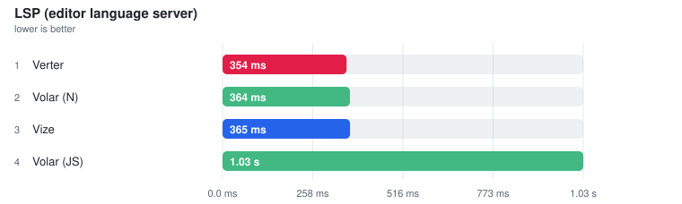
</picture>

Files: **1** · Bytes: **745**

Tools:

- **Volar (JS)** — @vue/language-server v3 hybrid pair — the Vue server plus typescript-language-server with @vue/typescript-plugin; both processes are measured and the slower half is charged.
- **Volar (N)** — the same Volar pair with its TypeScript half on typescript-native-bridge (tsgo) — same Vue layer, native engine.
- **Vize** — vize lsp --stdio from the npm package (native standalone server when found, Node entry otherwise — the row's notes say which). Runs its own bundled tsgo (Corsa).
- **Verter** — verter-lsp — the native server from the published npm package (version in the notes). Runs stable tsgo.

| Tool | **Median (primary)** | Min | Stddev | CV% | vs fastest | Hover bytes | Throughput | Peak RSS |
| --- | ---: | ---: | ---: | ---: | ---: | ---: | ---: | ---: |
| Verter | **354.4 ms** | 319.1 ms | 19.1 ms | 5.4% | 1.00x | 113 | 3 files/s | 135.4 + 137.9 = 273.4 MB |
| Volar (N) | **364.3 ms** | 354.4 ms | 8.0 ms | 2.2% | 1.03x | 114 | 3 files/s | – |
| Vize | **364.6 ms** | 357.8 ms | 4.3 ms | 1.2% | 1.03x | 114 | 3 files/s | 80.8 + 185.8 = 266.7 MB |
| Volar (JS) | **1.03 s** | 1.01 s | 17.7 ms | 1.7% | 2.91x | 114 | 1 files/s | 292.5 + 265.0 = 557.6 MB |

<details><summary>Notes</summary>

- **Verter**: verter-lsp stdio, the native server from the published npm package. $/verter/ready is OBSERVED, never waited for — its workspace load is inside the timed open→hover window like every other server's. | engine: tsgo 7.0.2 (typescript-go@7.0.2 → @typescript/typescript-linux-x64) | init=4ms · ready=198ms · open→hover=356ms · hoverCold=9ms · hoverWarm=1ms · completion=1ms · definition=1ms | hover verified: returns a TypeScript type for `benchMarker` in &lt;script setup> AND the auto-unwrapped `string` inside {{ }} (template is really typechecked)
- **Volar (N)**: Identical to the Volar row above except the TypeScript half runs on typescript-native-bridge (tsgo) instead of the JavaScript TypeScript: same @vue/language-server, same @vue/typescript-plugin, same bridge, tsdk pointed at TNB 6.0.3-bridge.18.tsgo.7.0.2 tsdk. Isolates how much of Volar's latency is TypeScript's engine rather than the Vue layer. | engine: tsgo 7.0.2 via TNB 6.0.3-bridge.18.tsgo.7.0.2 | init=486ms · ready=n/a · open→hover=364ms · hoverCold=13ms · hoverWarm=2ms · completion=6ms · definition=4ms | hover verified: returns a TypeScript type for `benchMarker` in &lt;script setup> AND the auto-unwrapped `string` inside {{ }} (template is really typechecked)
- **Vize**: vize lsp --stdio, launched from the npm package's NODE entry (bin/vize → NAPI addon under Node) because no version-matched native server was found; this costs ~35ms of Node bootstrap per spawn, inside initialize (/opt/hostedtoolcache/node/22.23.2/x64/bin/node). Set VIZE_LSP_BIN to pin a specific binary. Same workspace/file/position as Volar. Ready signal: none standardized → workspaceReady = n/a. | engine: tsgo (bundled) | init=38ms · ready=n/a · open→hover=358ms · hoverCold=3ms · hoverWarm=3ms · completion=4ms · definition=2ms | hover verified: returns a TypeScript type for `benchMarker` in &lt;script setup> AND the auto-unwrapped `string` inside {{ }} (template is really typechecked)
- **Volar (JS)**: Official Vue language server v3, hybrid (two-process) mode — the only mode v3 has. Measured unit is the pair: @vue/language-server plus typescript-language-server with @vue/typescript-plugin, joined by the tsserver/request↔tsserver/response bridge (the VS Code/Neovim client contract). The .vue buffer is synced to both and both are asked for each feature, in parallel, with the slower one charged — a script-block hover is answered by the TypeScript half, since v3 ships no semantic TS provider in the Vue server. Startup and project load of BOTH processes are inside the timings. If hybrid wiring fails, row is error — not ranked as slow. Primary metric: didOpen→hover. | engine: TypeScript 6.0.3 (JS) | init=507ms · ready=n/a · open→hover=1060ms · hoverCold=41ms · hoverWarm=2ms · completion=23ms · definition=5ms | hover verified: returns a TypeScript type for `benchMarker` in &lt;script setup> AND the auto-unwrapped `string` inside {{ }} (template is really typechecked)

</details>

<details><summary>Methodology</summary>

- Apples-to-apples: identical workspace, LspTarget.vue, UTF-16 hover position on `const benchMarker`.
- Hover content is gated in TWO places, both required to be ranked: the `<script setup>` position (must return a TypeScript type) and the `{{ benchMarker }}` TEMPLATE position (must return the auto-unwrapped `string`). The template probe is the Vue-specific one — a server can satisfy the script probe by proxying to a TypeScript server, but resolving a ref's unwrapped type inside an interpolation requires actually modelling the template, which is the job a Vue language server exists to do. A payload naming the symbol with no type, or returning the `Ref<...>` script type, fails.
- The template probe runs OUTSIDE every timed window, so it gates ranking without changing what the latency column measures.
- Each measured run starts a fresh language-server process (tool process cold).
- Volar is measured as the two-process product it is in v3: @vue/language-server has no in-process TypeScript language service, so the harness also starts typescript-language-server with @vue/typescript-plugin, syncs the same .vue buffer to both, and asks both for every feature in parallel — Volar is charged the slower half plus both processes' startup and project load. This is the same wiring VS Code and Neovim implement; without it the Vue server returns null for a &lt;script setup> hover by design.
- Primary ranking column uses didOpen→hover latency (first semantic response after open), taken as the median over warmed runs — each run still starts a fresh server process, so per-process project load is measured every time.
- Hover retry budget is identical for every server (6 attempts, 60s each, same backoff). Retry sleeps fall inside the timed open→hover window, so an asymmetric budget would silently subsidise whichever server got the larger one.
- A fixed 50ms yield after didOpen is inside the timed window for every server alike — it is an additive constant, so it compresses ratios slightly but cannot reorder them.
- Phase breakdown in Notes: initialize, ready (n/a if no server signal), open→hover, hover cold, hover warm median(5), completion, definition.
- workspaceReady is OBSERVED, never waited for. A vendor ready notification (e.g. $/verter/ready) is recorded from session start as a diagnostic and never enters a ranked column — the harness does not pause on it. It previously did, which moved one server's workspace load OUT of the ranked open→hover window while every other server's stayed inside it. Missing signal = n/a, not 0.
- Readiness is established identically for every server and INSIDE the ranked window, via the shared didOpen→hover retry loop — the same content-gated approach the ide-ops suites use. Whoever needs project-load time pays for it in the metric.
- Rows share one table across TypeScript engines, tagged by the same resolver the typecheck surface uses: Volar (JS) runs the JavaScript TypeScript compiler, while Volar (N), Vize and Verter all run native tsgo. A cross-engine ratio measures TypeScript's Go rewrite as much as the Vue layer under test — the (JS) tag is there so you compare like with like.
- Process host (native executable vs Node) is NOT a comparison-class axis here — there is no native Volar and no Node-hosted Verter, so splitting on it would leave every table with one row. It is printed on the row instead.
- Vize is launched from the standalone native server the VS Code extension downloads (version-matched, discovered under VS Code globalStorage, or pinned with VIZE_LSP_BIN) — that is the process the shipped product runs. Where no native server exists, e.g. CI, the npm package's Node entry is used and the row says so, because the Node bootstrap it adds (~35ms/spawn, inside initialize) is not part of the product.
- Completion/definition are best-effort extras; null/n/a does not mean the tool is slower — capability may differ.
- typescript-native-bridge (TNB) is a drop-in typescript package for CLI/tsserver — NOT a Vue LSP in its own right. It appears here only as Volar's TypeScript engine: the `Volar (TNB / tsgo tsdk)` row is the same Volar binary with TNB supplying the tsserver half, so the pair isolates the TS engine from the Vue layer.
- Verter resolves from the installed `verter-lsp` package only; skipped when it is absent.
- VS Code extension host overhead is NOT measured — only the language server stdio protocol.
- Server order is rotated on every warmup and measured run; no server is pinned to first position.

Raw runs:

- **Verter**: 319.1 ms, 355.4 ms, 354.4 ms, 321.9 ms, 356.2 ms
- **Volar (N)**: 367.7 ms, 354.4 ms, 359.2 ms, 375.1 ms, 364.3 ms
- **Vize**: 364.6 ms, 365.7 ms, 360.2 ms, 368.4 ms, 357.8 ms
- **Volar (JS)**: 1.03 s, 1.03 s, 1.01 s, 1.03 s, 1.06 s

</details>

## IDE operations

The same language servers, measured per editor operation over LSP. Ranked **per operation**, never pooled. These operations differ by orders of magnitude and answer unrelated questions, so one table each. Each request-style operation publishes **Cold** (first request after initialize+didOpen in a **fresh session dedicated to that operation** — later ops do not reuse a warmed server) and **Warm** (the same request immediately after). Ranking uses Cold; vs-fastest-cold sits next to it. A row that failed its content gate on the cold request is shown in brackets and excluded from ranking — latency without a correct answer is not a comparable measurement.

### IDE · initialize

Files: **1** · Bytes: **0**

Tools:

- **Volar (JS)** — @vue/language-server v3 hybrid pair — the Vue server plus typescript-language-server with @vue/typescript-plugin; both processes are measured and the slower half is charged.
- **Volar (N)** — the same Volar pair with its TypeScript half on typescript-native-bridge (tsgo) — same Vue layer, native engine.
- **Vize** — vize lsp --stdio from the npm package (native standalone server when found, Node entry otherwise — the row's notes say which). Runs its own bundled tsgo (Corsa).
- **Verter** — verter-lsp — the native server from the published npm package (version in the notes). Runs stable tsgo.

#### LSP initialize

<picture>
  <source media="(prefers-color-scheme: dark)" srcset="charts/lsp-ide-ide-initialize-lsp-initialize-dark.svg">
  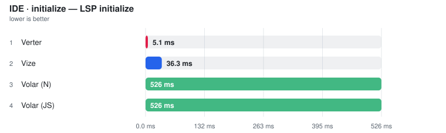
</picture>

| Tool | **Median (primary)** | Min | Stddev | CV% | vs fastest | Artifact | Throughput |
| --- | ---: | ---: | ---: | ---: | ---: | ---: | ---: |
| Verter | **5.1 ms** | 4.9 ms | 0.2 ms | 2.9% | 1.00x | n/a | n/a |
| Vize | **36.3 ms** | 35.3 ms | 1.3 ms | 3.4% | 7.07x | n/a | n/a |
| Volar (N) | **526.0 ms** | 518.7 ms | 6.6 ms | 1.3% | 102.50x | n/a | n/a |
| Volar (JS) | **526.2 ms** | 517.7 ms | 7.5 ms | 1.4% | 102.53x | n/a | n/a |

<details><summary>Notes</summary>

- **Verter**: LSP initialize handshake after spawn (not first-request latency) | engine: tsgo ? (none)
- **Vize**: LSP initialize handshake after spawn (not first-request latency) | engine: tsgo (bundled)
- **Volar (N)**: LSP initialize handshake after spawn (not first-request latency) | engine: tsgo ? via TNB ?
- **Volar (JS)**: LSP initialize handshake after spawn (not first-request latency) | engine: TypeScript ? (JS)

</details>

<details><summary>Raw runs</summary>

- **Verter**: 4.9 ms, 4.9 ms, 5.2 ms, 5.2 ms, 5.4 ms, 5.2 ms, 5.4 ms, 5.1 ms, 5.1 ms, 5.3 ms, 5.1 ms, 5.4 ms, 5.1 ms, 5.0 ms, 5.2 ms, 5.2 ms, 5.1 ms, 5.1 ms, 5.0 ms, 4.9 ms, 5.2 ms
- **Vize**: 37.2 ms, 37.4 ms, 36.7 ms, 37.2 ms, 35.4 ms, 35.8 ms, 36.2 ms, 36.3 ms, 36.3 ms, 38.4 ms, 38.7 ms, 40.7 ms, 36.0 ms, 35.3 ms, 37.0 ms, 37.8 ms, 35.9 ms, 36.1 ms, 36.7 ms, 35.9 ms, 36.1 ms
- **Volar (N)**: 538.6 ms, 528.4 ms, 543.0 ms, 526.0 ms, 529.1 ms, 520.8 ms, 525.9 ms, 527.2 ms, 526.8 ms, 537.1 ms, 521.0 ms, 531.7 ms, 519.5 ms, 523.2 ms, 528.4 ms, 518.7 ms, 523.1 ms, 520.4 ms, 529.9 ms, 523.4 ms, 519.9 ms
- **Volar (JS)**: 524.4 ms, 532.0 ms, 525.3 ms, 521.8 ms, 530.4 ms, 523.4 ms, 523.8 ms, 526.2 ms, 532.7 ms, 555.2 ms, 527.4 ms, 533.8 ms, 528.0 ms, 522.6 ms, 528.5 ms, 522.5 ms, 526.5 ms, 523.1 ms, 521.7 ms, 527.0 ms, 517.7 ms

</details>

<details><summary>Methodology</summary>

- Time from process spawn through the LSP initialize/initialized handshake, pooled across the suites in this job (small purpose-built workspaces). This is server startup, not the first editor request — Cold on the operation tables is that first request.

</details>

### IDE · Background (editor chatter)

Files: **1** · Bytes: **0**

Tools:

- **Volar (JS)** — @vue/language-server v3 hybrid pair — the Vue server plus typescript-language-server with @vue/typescript-plugin; both processes are measured and the slower half is charged.
- **Volar (N)** — the same Volar pair with its TypeScript half on typescript-native-bridge (tsgo) — same Vue layer, native engine.
- **Vize** — vize lsp --stdio from the npm package (native standalone server when found, Node entry otherwise — the row's notes say which). Runs its own bundled tsgo (Corsa).
- **Verter** — verter-lsp — the native server from the published npm package (version in the notes). Runs stable tsgo.

#### Semantic tokens (full)

<picture>
  <source media="(prefers-color-scheme: dark)" srcset="charts/lsp-ide-ide-background-semantic-tokens-full-dark.svg">
  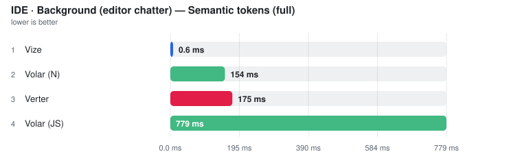
</picture>

| Tool | **Median (primary)** | Min | Stddev | CV% | vs fastest | Artifact | Throughput |
| --- | ---: | ---: | ---: | ---: | ---: | ---: | ---: |
| Vize | **0.6 ms** | 0.5 ms | 0.1 ms | 9.4% | 1.00x | 15 | n/a |
| Volar (N) | **154.1 ms** | 136.4 ms | 18.7 ms | 12.1% ⚠ | 269.41x | 48 | n/a |
| Verter | **175.0 ms** | 173.6 ms | 2.2 ms | 1.2% | 306.05x | 53 | n/a |
| Volar (JS) | **779.2 ms** | 762.3 ms | 14.8 ms | 1.9% | 1362.62x | 48 | n/a |

<details><summary>Notes</summary>

- **Vize**: content verified | engine: tsgo (bundled)
- **Volar (N)**: content verified | engine: tsgo ? via TNB ?
- **Verter**: content verified | engine: tsgo ? (none)
- **Volar (JS)**: content verified | engine: TypeScript ? (JS)

</details>

<details><summary>Raw runs</summary>

- **Vize**: 0.6 ms, 0.6 ms, 0.5 ms
- **Volar (N)**: 154.1 ms, 136.4 ms, 173.7 ms
- **Verter**: 175.0 ms, 173.6 ms, 177.9 ms
- **Volar (JS)**: 779.2 ms, 762.3 ms, 791.9 ms

</details>

#### Semantic tokens (delta after edit)

<picture>
  <source media="(prefers-color-scheme: dark)" srcset="charts/lsp-ide-ide-background-semantic-tokens-delta-after-edit-dark.svg">
  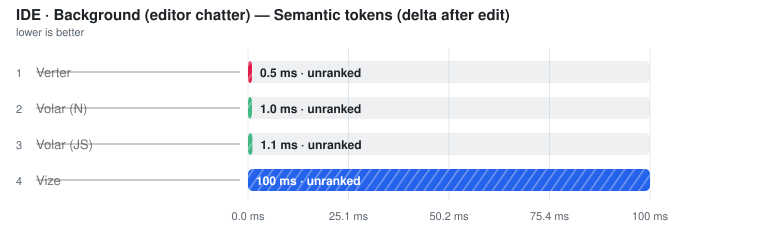
</picture>

| Tool | **Median (primary)** | Min | Stddev | CV% | vs fastest | Artifact | Throughput |
| --- | ---: | ---: | ---: | ---: | ---: | ---: | ---: |
| Volar (JS) ⚠ | (1.1 ms) | (1.1 ms) | – | – | not ranked | – | – |
| Volar (N) ⚠ | (1.0 ms) | (1.0 ms) | – | – | not ranked | – | – |
| Vize ⚠ | (100.5 ms) | (100.3 ms) | – | – | not ranked | – | – |
| Verter ⚠ | (0.5 ms) | (0.5 ms) | – | – | not ranked | – | – |

<details><summary>Notes</summary>

- **Volar (JS) ⚠**: ⚠ FAILED VALIDATION — not implemented (JSON-RPC -32601: Unhandled method textDocument/semanticTokens/full/delta); the full request DID return resultId "1790686003652", which invites a delta | Sample: "{\"code\":-32601,\"message\":\"Unhandled method textDocument/semanticTokens/full/delta\"}" | engine: TypeScript ? (JS)
- **Volar (N) ⚠**: ⚠ FAILED VALIDATION — not implemented (JSON-RPC -32601: Unhandled method textDocument/semanticTokens/full/delta); the full request DID return resultId "1790686012303", which invites a delta | Sample: "{\"code\":-32601,\"message\":\"Unhandled method textDocument/semanticTokens/full/delta\"}" | engine: tsgo ? via TNB ?
- **Vize ⚠**: ⚠ FAILED VALIDATION — not implemented (JSON-RPC -32601: Method not found); the full request returned no resultId | Sample: "{\"code\":-32601,\"message\":\"Method not found\"}" | engine: tsgo (bundled)
- **Verter ⚠**: ⚠ FAILED VALIDATION — not implemented (JSON-RPC -32601: Method not found); the full request returned no resultId | Sample: "{\"code\":-32601,\"message\":\"Method not found\"}" | engine: tsgo ? (none)

</details>

<details><summary>Raw runs</summary>

- **Volar (JS)**: 1.1 ms, 1.1 ms, 1.1 ms
- **Volar (N)**: 1.0 ms, 1.0 ms, 1.0 ms
- **Vize**: 100.5 ms, 100.3 ms, 101.0 ms
- **Verter**: 0.5 ms, 0.6 ms, 0.5 ms

</details>

#### Document symbols (outline)

<picture>
  <source media="(prefers-color-scheme: dark)" srcset="charts/lsp-ide-ide-background-document-symbols-outline-dark.svg">
  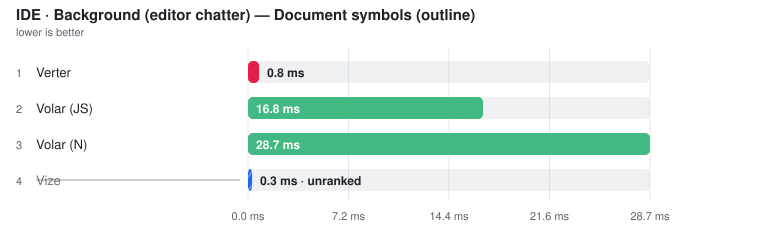
</picture>

| Tool | **Median (primary)** | Min | Stddev | CV% | vs fastest | Artifact | Throughput |
| --- | ---: | ---: | ---: | ---: | ---: | ---: | ---: |
| Verter | **0.8 ms** | 0.8 ms | 0.0 ms | 2.5% | 1.00x | 11 | n/a |
| Volar (JS) | **16.8 ms** | 16.4 ms | 4.1 ms | 21.7% ⚠ | 21.13x | 25 | n/a |
| Volar (N) | **28.7 ms** | 21.0 ms | 4.5 ms | 17.3% ⚠ | 36.15x | 25 | n/a |
| Vize ⚠ | (0.3 ms) | (0.3 ms) | – | – | not ranked | (2) | – |

<details><summary>Notes</summary>

- **Verter**: content verified | engine: tsgo ? (none)
- **Volar (JS)**: content verified | engine: TypeScript ? (JS)
- **Volar (N)**: content verified | engine: tsgo ? via TNB ?
- **Vize ⚠**: ⚠ FAILED VALIDATION — outline is missing 7/7 script symbols: heading, nextLabel, threshold, entries, visibleEntries, formatEntry, addEntry | Sample: "2 symbols: template, script setup" | engine: tsgo (bundled)

</details>

<details><summary>Raw runs</summary>

- **Verter**: 0.8 ms, 0.8 ms, 0.8 ms
- **Volar (JS)**: 16.4 ms, 23.7 ms, 16.8 ms
- **Volar (N)**: 21.0 ms, 28.7 ms, 29.0 ms
- **Vize**: 0.3 ms, 0.3 ms, 0.3 ms

</details>

#### Document highlight (caret move)

<picture>
  <source media="(prefers-color-scheme: dark)" srcset="charts/lsp-ide-ide-background-document-highlight-caret-move-dark.svg">
  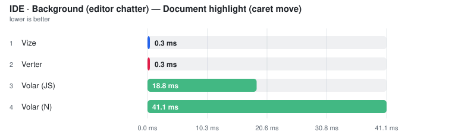
</picture>

| Tool | **Median (primary)** | Min | Stddev | CV% | vs fastest | Artifact | Throughput |
| --- | ---: | ---: | ---: | ---: | ---: | ---: | ---: |
| Vize | **0.3 ms** | 0.2 ms | 0.0 ms | 16.1% ⚠ | 1.00x | 4 | n/a |
| Verter | **0.3 ms** | 0.3 ms | 0.0 ms | 1.8% | 1.26x | 4 | n/a |
| Volar (JS) | **18.8 ms** | 17.4 ms | 0.9 ms | 4.7% | 68.79x | 5 | n/a |
| Volar (N) | **41.1 ms** | 37.7 ms | 3.2 ms | 7.8% | 150.72x | 5 | n/a |

<details><summary>Notes</summary>

- **Vize**: content verified | engine: tsgo (bundled)
- **Verter**: content verified | engine: tsgo ? (none)
- **Volar (JS)**: content verified | engine: TypeScript ? (JS)
- **Volar (N)**: content verified | engine: tsgo ? via TNB ?

</details>

<details><summary>Raw runs</summary>

- **Vize**: 0.3 ms, 0.3 ms, 0.2 ms
- **Verter**: 0.3 ms, 0.3 ms, 0.3 ms
- **Volar (JS)**: 17.4 ms, 19.1 ms, 18.8 ms
- **Volar (N)**: 37.7 ms, 44.1 ms, 41.1 ms

</details>

#### Inlay hints (document range)

<picture>
  <source media="(prefers-color-scheme: dark)" srcset="charts/lsp-ide-ide-background-inlay-hints-document-range-dark.svg">
  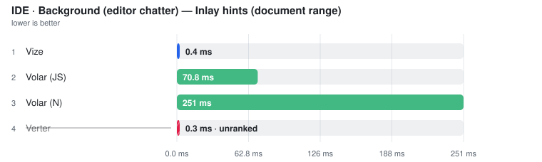
</picture>

| Tool | **Median (primary)** | Min | Stddev | CV% | vs fastest | Artifact | Throughput |
| --- | ---: | ---: | ---: | ---: | ---: | ---: | ---: |
| Vize | **0.4 ms** | 0.4 ms | 0.1 ms | 13.5% ⚠ | 1.00x | 2 | n/a |
| Volar (JS) | **70.8 ms** | 69.8 ms | 1.9 ms | 2.6% | 163.64x | 14 | n/a |
| Volar (N) | **251.0 ms** | 238.0 ms | 16.1 ms | 6.4% | 579.94x | 14 | n/a |
| Verter ⚠ | (0.3 ms) | (0.3 ms) | – | – | not ranked | – | – |

<details><summary>Notes</summary>

- **Vize**: content verified | engine: tsgo (bundled)
- **Volar (JS)**: content verified | engine: TypeScript ? (JS)
- **Volar (N)**: content verified | engine: tsgo ? via TNB ?
- **Verter ⚠**: ⚠ FAILED VALIDATION — returned null — no inlay hints for a document full of inferable bindings | Sample: "null" | engine: tsgo ? (none)

</details>

<details><summary>Raw runs</summary>

- **Vize**: 0.5 ms, 0.4 ms, 0.4 ms
- **Volar (JS)**: 70.8 ms, 69.8 ms, 73.5 ms
- **Volar (N)**: 238.0 ms, 251.0 ms, 270.0 ms
- **Verter**: 0.3 ms, 0.3 ms, 0.3 ms

</details>

#### Folding ranges

<picture>
  <source media="(prefers-color-scheme: dark)" srcset="charts/lsp-ide-ide-background-folding-ranges-dark.svg">
  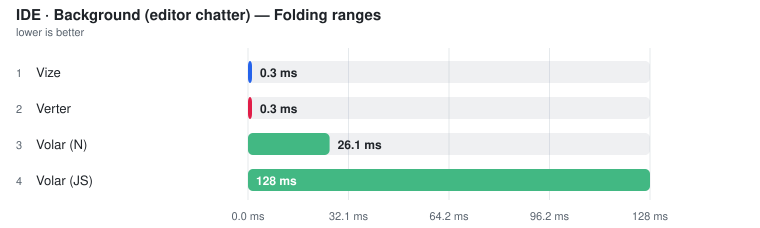
</picture>

| Tool | **Median (primary)** | Min | Stddev | CV% | vs fastest | Artifact | Throughput |
| --- | ---: | ---: | ---: | ---: | ---: | ---: | ---: |
| Vize | **0.3 ms** | 0.2 ms | 0.1 ms | 24.5% ⚠ | 1.00x | 9 | n/a |
| Verter | **0.3 ms** | 0.3 ms | 0.0 ms | 8.9% | 1.25x | 2 | n/a |
| Volar (N) | **26.1 ms** | 22.3 ms | 3.1 ms | 12.0% ⚠ | 95.03x | 13 | n/a |
| Volar (JS) ⚠ | (128.3 ms) | (12.8 ms) | – | – | not ranked | (13) | – |

<details><summary>Notes</summary>

- **Vize**: content verified | engine: tsgo (bundled)
- **Verter**: content verified | engine: tsgo ? (none)
- **Volar (N)**: content verified | engine: tsgo ? via TNB ?
- **Volar (JS) ⚠**: content verified | engine: TypeScript ? (JS) | ⚠ TOO NOISY TO RANK — CV 74.4% (ceiling 50%). The median of a series this unstable is a draw from noise, not a result; the time is bracketed and excluded from ranking exactly like a failed gate. Raw runs below.

</details>

<details><summary>Raw runs</summary>

- **Vize**: 0.4 ms, 0.2 ms, 0.3 ms
- **Verter**: 0.4 ms, 0.3 ms, 0.3 ms
- **Volar (N)**: 22.3 ms, 28.4 ms, 26.1 ms
- **Volar (JS)**: 12.8 ms, 130.7 ms, 128.3 ms

</details>

#### Peak RSS (process tree)

| Tool | Tool | tsgo / tsserver | **Total** |
| --- | ---: | ---: | ---: |
| Verter | 116.3 MB | 91.2 MB | **207.5 MB** |
| Vize | 80.4 MB | 174.1 MB | **254.5 MB** |
| Volar (JS) | 275.7 MB | 257.7 MB | **533.4 MB** |
| Volar (N) | 288.1 MB | 393.9 MB | **682.0 MB** |

Engine is a **child** `tsgo` / sibling `tsserver` process — the same attribution the typecheck surface uses. `—` = the server hosts its checker in-process.

<details><summary>Methodology</summary>

- Every operation carries a content gate; the timing is only ranked when the answer was verified correct.
- Peak RSS is the whole language-server process tree during the timed session (Volar = Vue half + TypeScript half). It is sampled alongside the run, not from a separate memory job.
- Rows share one table across TypeScript engines; rows tagged (JS) run the JavaScript compiler — Volar (@vue/language-server) = TypeScript ? (JS); Volar (TNB / tsgo tsdk) = tsgo ? via TNB ?; Vize LSP (Node shim) = tsgo (bundled); Verter LSP (npm 0.0.1-beta.6) = tsgo ? (none). Volar on the stock JavaScript tsdk and Volar on the tsgo tsdk are the same Vue layer differing only in engine, so a cross-engine ratio measures TypeScript's Go rewrite as much as the server. Same axis, same resolver as the typecheck surface.
- Volar is measured as the two-process product it is: both halves are asked in parallel and the pair is charged the slower leg.
- A rejected leg counts as `no answer from this provider`, not as a failure of the pair — Volar's Vue half legitimately rejects methods it does not implement, and an editor routes those to the TypeScript half.
- Document URIs are compared normalised, never by string equality: the same file arrives percent-encoded and with a different drive-letter case from different servers.
- Each suite builds its own purpose-built workspace with an identical tsconfig, strictTemplates, the @vue/typescript-plugin tsserver entry, and Vize's opt-in Corsa/tsgo switches enabled.
- Fresh server process per run; warmups are discarded.

</details>

### IDE · Completion (8 contexts, content-gated)

Files: **1** · Bytes: **0**

Tools:

- **Volar (JS)** — @vue/language-server v3 hybrid pair — the Vue server plus typescript-language-server with @vue/typescript-plugin; both processes are measured and the slower half is charged.
- **Volar (N)** — the same Volar pair with its TypeScript half on typescript-native-bridge (tsgo) — same Vue layer, native engine.
- **Vize** — vize lsp --stdio from the npm package (native standalone server when found, Node entry otherwise — the row's notes say which). Runs its own bundled tsgo (Corsa).
- **Verter** — verter-lsp — the native server from the published npm package (version in the notes). Runs stable tsgo.

#### Completion: script member

<picture>
  <source media="(prefers-color-scheme: dark)" srcset="charts/lsp-ide-ide-completion-completion-script-member-dark.svg">
  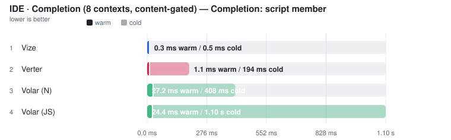
</picture>

| Tool | **Cold** | vs fastest cold | **Warm** | Min | Stddev | CV% | vs fastest | Artifact | Throughput |
| --- | ---: | ---: | ---: | ---: | ---: | ---: | ---: | ---: | ---: |
| Vize | **0.5 ms** | 1.00x | **0.3 ms** | 0.2 ms | 0.0 ms | 8.6% | 1.00x | 3 | n/a |
| Verter | **194.0 ms** | 364.36x | **1.1 ms** | 1.1 ms | 0.1 ms | 7.3% | 4.23x | 3 | n/a |
| Volar (N) | **407.5 ms** | 765.31x | **27.2 ms** | 17.4 ms | 6.9 ms | 27.4% ⚠ | 100.64x | 3 | n/a |
| Volar (JS) | **1.10 s** | 2072.88x | **24.4 ms** | 24.1 ms | 2.6 ms | 10.2% ⚠ | 90.36x | 3 | n/a |

<details><summary>Notes</summary>

- **Vize**: content verified | engine: tsgo (bundled)
- **Verter**: content verified | engine: tsgo ? (none)
- **Volar (N)**: content verified | engine: tsgo ? via TNB ?
- **Volar (JS)**: content verified | engine: TypeScript ? (JS)

</details>

<details><summary>Raw runs</summary>

- **Vize**: 0.2 ms, 0.3 ms, 0.3 ms
- **Verter**: 1.1 ms, 1.3 ms, 1.1 ms
- **Volar (N)**: 17.4 ms, 30.7 ms, 27.2 ms
- **Volar (JS)**: 28.7 ms, 24.4 ms, 24.1 ms

</details>

#### Completion: component tag &lt;Ch

<picture>
  <source media="(prefers-color-scheme: dark)" srcset="charts/lsp-ide-ide-completion-completion-component-tag-ch-dark.svg">
  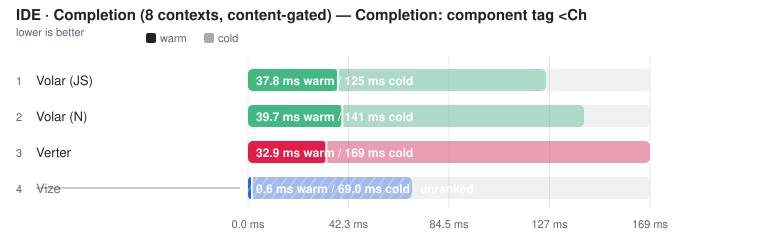
</picture>

| Tool | **Cold** | vs fastest cold | **Warm** | Min | Stddev | CV% | vs fastest | Artifact | Throughput |
| --- | ---: | ---: | ---: | ---: | ---: | ---: | ---: | ---: | ---: |
| Volar (JS) | **125.2 ms** | 1.00x | **37.8 ms** | 36.5 ms | 2.0 ms | 5.2% | 1.15x | 192 | n/a |
| Volar (N) | **141.3 ms** | 1.13x | **39.7 ms** | 39.0 ms | 1.6 ms | 4.0% | 1.20x | 192 | n/a |
| Verter | **169.0 ms** | 1.35x | **32.9 ms** | 25.4 ms | 8.1 ms | 24.4% ⚠ | 1.00x | 1,193 | n/a |
| Vize ⚠ | (69.0 ms) | not ranked | (0.6 ms) | (0.5 ms) | – | – | not ranked | (42) | – |

<details><summary>Notes</summary>

- **Volar (JS)**: content verified | engine: TypeScript ? (JS)
- **Volar (N)**: content verified | engine: tsgo ? via TNB ?
- **Verter**: content verified | engine: tsgo ? (none)
- **Vize ⚠**: ⚠ FAILED VALIDATION — cold: no `ChildCard` component tag in 42 items | Sample: "[v-if, v-else-if, v-else, v-for, v-on, v-bind, v-model, v-slot, v-show, v-pre, v-once, v-memo, …+30]" | engine: tsgo (bundled)

</details>

<details><summary>Raw runs</summary>

- **Volar (JS)**: 40.4 ms, 37.8 ms, 36.5 ms
- **Volar (N)**: 42.0 ms, 39.0 ms, 39.7 ms
- **Verter**: 32.9 ms, 41.7 ms, 25.4 ms
- **Vize**: 0.5 ms, 0.6 ms, 0.6 ms

</details>

#### Completion: prop name &lt;C :

<picture>
  <source media="(prefers-color-scheme: dark)" srcset="charts/lsp-ide-ide-completion-completion-prop-name-c-dark.svg">
  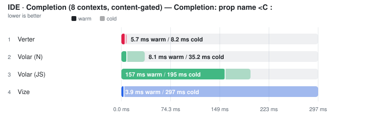
</picture>

| Tool | **Cold** | vs fastest cold | **Warm** | Min | Stddev | CV% | vs fastest | Artifact | Throughput |
| --- | ---: | ---: | ---: | ---: | ---: | ---: | ---: | ---: | ---: |
| Verter | **8.2 ms** | 1.00x | **5.7 ms** | 5.4 ms | 1.0 ms | 16.9% ⚠ | 1.48x | 201 | n/a |
| Volar (N) | **35.2 ms** | 4.29x | **8.1 ms** | 7.9 ms | 0.4 ms | 4.9% | 2.11x | 26 | n/a |
| Vize | **297.3 ms** | 36.16x | **3.9 ms** | 3.7 ms | 0.1 ms | 2.1% | 1.00x | 4 | n/a |
| Volar (JS) ⚠ | (195.1 ms) | not ranked | (156.7 ms) | (8.6 ms) | – | – | not ranked | (26) | – |

<details><summary>Notes</summary>

- **Verter**: content verified | engine: tsgo ? (none)
- **Volar (N)**: content verified | engine: tsgo ? via TNB ?
- **Vize**: content verified | engine: tsgo (bundled)
- **Volar (JS) ⚠**: content verified | engine: TypeScript ? (JS) | ⚠ TOO NOISY TO RANK — CV 83.9% (ceiling 50%). The median of a series this unstable is a draw from noise, not a result; the time is bracketed and excluded from ranking exactly like a failed gate. Raw runs below.

</details>

<details><summary>Raw runs</summary>

- **Verter**: 5.4 ms, 7.3 ms, 5.7 ms
- **Volar (N)**: 8.7 ms, 7.9 ms, 8.1 ms
- **Vize**: 3.9 ms, 3.7 ms, 3.9 ms
- **Volar (JS)**: 8.6 ms, 215.0 ms, 156.7 ms

</details>

#### Completion: event name &lt;C @

<picture>
  <source media="(prefers-color-scheme: dark)" srcset="charts/lsp-ide-ide-completion-completion-event-name-c-dark.svg">
  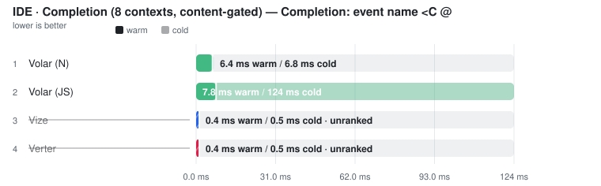
</picture>

| Tool | **Cold** | vs fastest cold | **Warm** | Min | Stddev | CV% | vs fastest | Artifact | Throughput |
| --- | ---: | ---: | ---: | ---: | ---: | ---: | ---: | ---: | ---: |
| Volar (N) | **6.8 ms** | 1.00x | **6.4 ms** | 6.2 ms | 0.1 ms | 2.3% | 1.00x | 25 | n/a |
| Volar (JS) | **124.0 ms** | 18.12x | **7.8 ms** | 6.1 ms | 1.9 ms | 23.5% ⚠ | 1.22x | 25 | n/a |
| Vize ⚠ | (0.5 ms) | not ranked | (0.4 ms) | (0.3 ms) | – | – | not ranked | (12) | – |
| Verter ⚠ | (0.5 ms) | not ranked | (0.4 ms) | (0.4 ms) | – | – | not ranked | (0) | – |

<details><summary>Notes</summary>

- **Volar (N)**: content verified | engine: tsgo ? via TNB ?
- **Volar (JS)**: content verified | engine: TypeScript ? (JS)
- **Vize ⚠**: ⚠ FAILED VALIDATION — cold: no `quench` declared emit in 12 items | Sample: "[v-on, @, @click, @input, @change, @submit, @keydown, @keyup, @focus, @blur, @mouseenter, @mouseleave]" | engine: tsgo (bundled)
- **Verter ⚠**: ⚠ FAILED VALIDATION — cold: no `quench` declared emit in 0 items | Sample: "(empty list)" | engine: tsgo ? (none)

</details>

<details><summary>Raw runs</summary>

- **Volar (N)**: 6.2 ms, 6.5 ms, 6.4 ms
- **Volar (JS)**: 9.8 ms, 7.8 ms, 6.1 ms
- **Vize**: 0.3 ms, 0.4 ms, 0.4 ms
- **Verter**: 0.4 ms, 0.4 ms, 0.5 ms

</details>

#### Completion: directive v-

<picture>
  <source media="(prefers-color-scheme: dark)" srcset="charts/lsp-ide-ide-completion-completion-directive-v-dark.svg">
  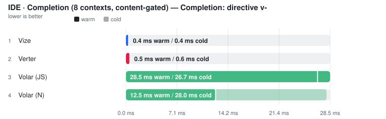
</picture>

| Tool | **Cold** | vs fastest cold | **Warm** | Min | Stddev | CV% | vs fastest | Artifact | Throughput |
| --- | ---: | ---: | ---: | ---: | ---: | ---: | ---: | ---: | ---: |
| Vize | **0.4 ms** | 1.00x | **0.4 ms** | 0.4 ms | 0.0 ms | 10.3% ⚠ | 1.00x | 15 | n/a |
| Verter | **0.6 ms** | 1.42x | **0.5 ms** | 0.5 ms | 0.0 ms | 8.6% | 1.48x | 29 | n/a |
| Volar (N) | **28.0 ms** | 67.84x | **12.5 ms** | 12.2 ms | 0.4 ms | 2.9% | 33.71x | 498 | n/a |
| Volar (JS) ⚠ | (26.7 ms) | not ranked | (28.5 ms) | (12.6 ms) | – | – | not ranked | (498) | – |

<details><summary>Notes</summary>

- **Vize**: content verified | engine: tsgo (bundled)
- **Verter**: content verified | engine: tsgo ? (none)
- **Volar (N)**: content verified | engine: tsgo ? via TNB ?
- **Volar (JS) ⚠**: content verified | engine: TypeScript ? (JS) | ⚠ TOO NOISY TO RANK — CV 64.1% (ceiling 50%). The median of a series this unstable is a draw from noise, not a result; the time is bracketed and excluded from ranking exactly like a failed gate. Raw runs below.

</details>

<details><summary>Raw runs</summary>

- **Vize**: 0.4 ms, 0.4 ms, 0.4 ms
- **Verter**: 0.5 ms, 0.5 ms, 0.6 ms
- **Volar (N)**: 12.5 ms, 12.9 ms, 12.2 ms
- **Volar (JS)**: 52.3 ms, 12.6 ms, 28.5 ms

</details>

#### Completion: slot name &lt;template #

<picture>
  <source media="(prefers-color-scheme: dark)" srcset="charts/lsp-ide-ide-completion-completion-slot-name-template-dark.svg">
  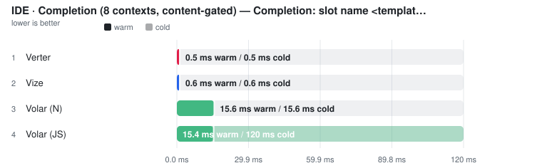
</picture>

| Tool | **Cold** | vs fastest cold | **Warm** | Min | Stddev | CV% | vs fastest | Artifact | Throughput |
| --- | ---: | ---: | ---: | ---: | ---: | ---: | ---: | ---: | ---: |
| Verter | **0.5 ms** | 1.00x | **0.5 ms** | 0.4 ms | 0.0 ms | 10.2% ⚠ | 1.00x | 2 | n/a |
| Vize | **0.6 ms** | 1.24x | **0.6 ms** | 0.5 ms | 0.0 ms | 5.2% | 1.24x | 30 | n/a |
| Volar (N) | **15.6 ms** | 33.17x | **15.6 ms** | 13.6 ms | 1.2 ms | 8.3% | 34.08x | 500 | n/a |
| Volar (JS) | **119.8 ms** | 254.43x | **15.4 ms** | 13.1 ms | 1.4 ms | 9.6% | 33.51x | 500 | n/a |

<details><summary>Notes</summary>

- **Verter**: content verified | engine: tsgo ? (none)
- **Vize**: content verified | engine: tsgo (bundled)
- **Volar (N)**: content verified | engine: tsgo ? via TNB ?
- **Volar (JS)**: content verified | engine: TypeScript ? (JS)

</details>

<details><summary>Raw runs</summary>

- **Verter**: 0.5 ms, 0.4 ms, 0.5 ms
- **Vize**: 0.6 ms, 0.6 ms, 0.5 ms
- **Volar (N)**: 13.6 ms, 15.6 ms, 15.9 ms
- **Volar (JS)**: 15.7 ms, 15.4 ms, 13.1 ms

</details>

#### Completion: auto-import

<picture>
  <source media="(prefers-color-scheme: dark)" srcset="charts/lsp-ide-ide-completion-completion-auto-import-dark.svg">
  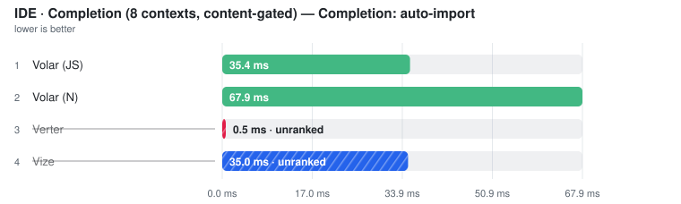
</picture>

| Tool | **Median (primary)** | Min | Stddev | CV% | vs fastest | Artifact | Throughput |
| --- | ---: | ---: | ---: | ---: | ---: | ---: | ---: |
| Volar (JS) | **35.4 ms** | 32.8 ms | 4.0 ms | 11.0% ⚠ | 1.00x | 1,073 | n/a |
| Volar (N) | **67.9 ms** | 39.5 ms | 17.3 ms | 29.2% ⚠ | 1.92x | 1,073 | n/a |
| Vize ⚠ | (35.0 ms) | (34.8 ms) | – | – | not ranked | (1,080) | – |
| Verter ⚠ | (0.5 ms) | (0.4 ms) | – | – | not ranked | (9) | – |

<details><summary>Notes</summary>

- **Volar (JS)**: content verified | engine: TypeScript ? (JS)
- **Volar (N)**: content verified | engine: tsgo ? via TNB ?
- **Vize ⚠**: ⚠ FAILED VALIDATION — `computed` offered but no import edit on any entry, in the list or after resolve — see resolve-auto-import | Sample: "offered: \"getComputedStyle\" kind=3 ; \"computed\" kind=6 ; \"computed\" kind=3 detail=\"function computed&lt;T>(getter: () => T): ComputedRef&lt;T>\"" | engine: tsgo (bundled)
- **Verter ⚠**: ⚠ FAILED VALIDATION — no `computed` in 9 items | Sample: "[headline, visible, probe, chosen, onDismiss, derived, ref, ChildCard, SiblingCard]" | engine: tsgo ? (none)

</details>

<details><summary>Raw runs</summary>

- **Volar (JS)**: 40.7 ms, 35.4 ms, 32.8 ms
- **Volar (N)**: 67.9 ms, 39.5 ms, 70.8 ms
- **Vize**: 34.8 ms, 35.0 ms, 35.4 ms
- **Verter**: 0.4 ms, 0.5 ms, 0.5 ms

</details>

#### Resolve: auto-import edit

<picture>
  <source media="(prefers-color-scheme: dark)" srcset="charts/lsp-ide-ide-completion-resolve-auto-import-edit-dark.svg">
  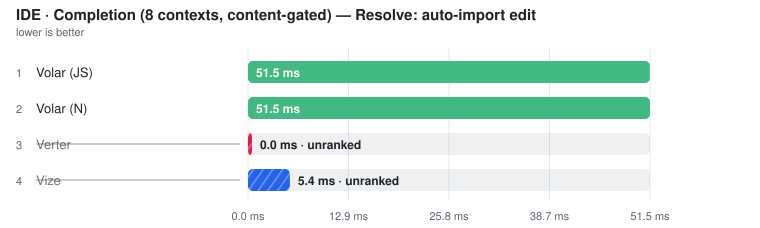
</picture>

| Tool | **Median (primary)** | Min | Stddev | CV% | vs fastest | Artifact | Throughput |
| --- | ---: | ---: | ---: | ---: | ---: | ---: | ---: |
| Volar (JS) | **51.5 ms** | 47.4 ms | 20.2 ms | 33.1% ⚠ | 1.00x | 241 | n/a |
| Volar (N) | **51.5 ms** | 50.5 ms | 0.7 ms | 1.3% | 1.00x | 241 | n/a |
| Vize ⚠ | (5.4 ms) | (5.2 ms) | – | – | not ranked | (67) | – |
| Verter ⚠ | (0.0 ms) | (0.0 ms) | – | – | not ranked | – | – |

<details><summary>Notes</summary>

- **Volar (JS)**: content verified | engine: TypeScript ? (JS)
- **Volar (N)**: content verified | engine: tsgo ? via TNB ?
- **Vize ⚠**: ⚠ FAILED VALIDATION — resolve returned no import edit for `computed` | Sample: "\"computed\" kind=6 detail=\"Update import from \\\"vue\\\"\"" | engine: tsgo (bundled)
- **Verter ⚠**: ⚠ FAILED VALIDATION — auto-import completion offered no `computed` item to resolve | Sample: "[headline, visible, probe, chosen, onDismiss, derived, ref, ChildCard, SiblingCard]" | engine: tsgo ? (none)

</details>

<details><summary>Raw runs</summary>

- **Volar (JS)**: 51.5 ms, 47.4 ms, 84.4 ms
- **Volar (N)**: 51.5 ms, 50.5 ms, 51.8 ms
- **Vize**: 5.2 ms, 5.4 ms, 5.8 ms
- **Verter**: 0.0 ms, 0.0 ms, 0.0 ms

</details>

#### Resolve: script member detail

<picture>
  <source media="(prefers-color-scheme: dark)" srcset="charts/lsp-ide-ide-completion-resolve-script-member-detail-dark.svg">
  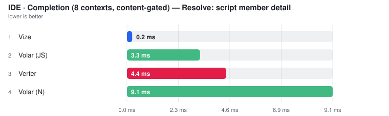
</picture>

| Tool | **Median (primary)** | Min | Stddev | CV% | vs fastest | Artifact | Throughput |
| --- | ---: | ---: | ---: | ---: | ---: | ---: | ---: |
| Vize | **0.2 ms** | 0.2 ms | 0.0 ms | 10.2% ⚠ | 1.00x | 75 | n/a |
| Volar (JS) | **3.3 ms** | 2.8 ms | 0.3 ms | 9.6% | 13.96x | 25 | n/a |
| Verter | **4.4 ms** | 4.3 ms | 0.2 ms | 5.2% | 18.95x | 25 | n/a |
| Volar (N) | **9.1 ms** | 9.1 ms | 0.1 ms | 1.4% | 39.30x | 25 | n/a |

<details><summary>Notes</summary>

- **Vize**: content verified | engine: tsgo (bundled)
- **Volar (JS)**: content verified | engine: TypeScript ? (JS)
- **Verter**: content verified | engine: tsgo ? (none)
- **Volar (N)**: content verified | engine: tsgo ? via TNB ?

</details>

<details><summary>Raw runs</summary>

- **Vize**: 0.2 ms, 0.2 ms, 0.2 ms
- **Volar (JS)**: 3.3 ms, 2.8 ms, 3.3 ms
- **Verter**: 4.3 ms, 4.8 ms, 4.4 ms
- **Volar (N)**: 9.1 ms, 9.3 ms, 9.1 ms

</details>

#### Peak RSS (process tree)

| Tool | Tool | tsgo / tsserver | **Total** |
| --- | ---: | ---: | ---: |
| Vize | 91.0 MB | 205.9 MB | **296.9 MB** |
| Verter | 133.1 MB | 165.7 MB | **298.8 MB** |
| Volar (JS) | 296.7 MB | 288.8 MB | **585.6 MB** |
| Volar (N) | 308.6 MB | 391.3 MB | **699.9 MB** |

Engine is a **child** `tsgo` / sibling `tsserver` process — the same attribution the typecheck surface uses. `—` = the server hosts its checker in-process.

<details><summary>Methodology</summary>

- Every operation carries a content gate; the timing is only ranked when the answer was verified correct.
- Peak RSS is the whole language-server process tree during the timed session (Volar = Vue half + TypeScript half). It is sampled alongside the run, not from a separate memory job.
- Rows share one table across TypeScript engines; rows tagged (JS) run the JavaScript compiler — Volar (@vue/language-server) = TypeScript ? (JS); Volar (TNB / tsgo tsdk) = tsgo ? via TNB ?; Vize LSP (Node shim) = tsgo (bundled); Verter LSP (npm 0.0.1-beta.6) = tsgo ? (none). Volar on the stock JavaScript tsdk and Volar on the tsgo tsdk are the same Vue layer differing only in engine, so a cross-engine ratio measures TypeScript's Go rewrite as much as the server. Same axis, same resolver as the typecheck surface.
- Volar is measured as the two-process product it is: both halves are asked in parallel and the pair is charged the slower leg.
- A rejected leg counts as `no answer from this provider`, not as a failure of the pair — Volar's Vue half legitimately rejects methods it does not implement, and an editor routes those to the TypeScript half.
- Document URIs are compared normalised, never by string equality: the same file arrives percent-encoded and with a different drive-letter case from different servers.
- Each suite builds its own purpose-built workspace with an identical tsconfig, strictTemplates, the @vue/typescript-plugin tsserver entry, and Vize's opt-in Corsa/tsgo switches enabled.
- Fresh server process per run; warmups are discarded.

</details>

### IDE · Edit loop (type, wait, hover)

Files: **1** · Bytes: **0**

Tools:

- **Volar (JS)** — @vue/language-server v3 hybrid pair — the Vue server plus typescript-language-server with @vue/typescript-plugin; both processes are measured and the slower half is charged.
- **Volar (N)** — the same Volar pair with its TypeScript half on typescript-native-bridge (tsgo) — same Vue layer, native engine.
- **Vize** — vize lsp --stdio from the npm package (native standalone server when found, Node entry otherwise — the row's notes say which). Runs its own bundled tsgo (Corsa).
- **Verter** — verter-lsp — the native server from the published npm package (version in the notes). Runs stable tsgo.

#### didOpen -> first diagnostics

| Tool | **Median (primary)** | Min | Stddev | CV% | vs fastest | Artifact | Throughput |
| --- | ---: | ---: | ---: | ---: | ---: | ---: | ---: |
| Volar (JS) | – | – | – | – | – | 0 | – |
| Volar (N) | – | – | – | – | – | 0 | – |
| Vize | – | – | – | – | – | 0 | – |
| Verter | – | – | – | – | – | 0 | – |

<details><summary>Notes</summary>

- **Volar (JS)**: content verified | NOT RANKED (informational) — measured 1.14 s, min 1.14 s, CV 1.0%: the fixture is a valid file, so the correct payload is empty and no gate can tell an analysed empty report from a server that publishes `[]` on open and analyses afterwards — the fastest number here can be the least work done. Read `Edit plants type error -> reported` and `Edit fixes it -> diagnostic clears`, which demand specific content, as the comparable diagnostics figures. | engine: TypeScript ? (JS)
- **Volar (N)**: content verified | NOT RANKED (informational) — measured 469.6 ms, min 464.3 ms, CV 1.2%: the fixture is a valid file, so the correct payload is empty and no gate can tell an analysed empty report from a server that publishes `[]` on open and analyses afterwards — the fastest number here can be the least work done. Read `Edit plants type error -> reported` and `Edit fixes it -> diagnostic clears`, which demand specific content, as the comparable diagnostics figures. | engine: tsgo ? via TNB ?
- **Vize**: content verified | NOT RANKED (informational) — measured 1.29 s, min 1.28 s, CV 0.7%: the fixture is a valid file, so the correct payload is empty and no gate can tell an analysed empty report from a server that publishes `[]` on open and analyses afterwards — the fastest number here can be the least work done. Read `Edit plants type error -> reported` and `Edit fixes it -> diagnostic clears`, which demand specific content, as the comparable diagnostics figures. | engine: tsgo (bundled)
- **Verter**: content verified | NOT RANKED (informational) — measured 839.3 ms, min 839.2 ms, CV 0.0%: the fixture is a valid file, so the correct payload is empty and no gate can tell an analysed empty report from a server that publishes `[]` on open and analyses afterwards — the fastest number here can be the least work done. Read `Edit plants type error -> reported` and `Edit fixes it -> diagnostic clears`, which demand specific content, as the comparable diagnostics figures. | engine: tsgo ? (none)

</details>

<details><summary>Raw runs</summary>

- **Volar (JS)**: 1.14 s, 1.16 s, 1.14 s
- **Volar (N)**: 469.6 ms, 475.7 ms, 464.3 ms
- **Vize**: 1.30 s, 1.28 s, 1.29 s
- **Verter**: 839.7 ms, 839.2 ms, 839.3 ms

</details>

#### Edit plants type error -> reported

<picture>
  <source media="(prefers-color-scheme: dark)" srcset="charts/lsp-ide-ide-edit-loop-edit-plants-type-error-reported-dark.svg">
   reported" src="charts/lsp-ide-ide-edit-loop-edit-plants-type-error-reported.svg">
</picture>

| Tool | **Median (primary)** | Min | Stddev | CV% | vs fastest | Artifact | Throughput |
| --- | ---: | ---: | ---: | ---: | ---: | ---: | ---: |
| Vize | **55.4 ms** | 55.0 ms | 10.9 ms | 17.7% ⚠ | 1.00x | 1 | n/a |
| Verter | **341.6 ms** | 337.6 ms | 4.2 ms | 1.2% | 6.17x | 1 | n/a |
| Volar (N) | **398.3 ms** | 397.3 ms | 0.8 ms | 0.2% | 7.19x | 1 | n/a |
| Volar (JS) | **403.2 ms** | 395.5 ms | 13.6 ms | 3.3% | 7.28x | 1 | n/a |

<details><summary>Notes</summary>

- **Vize**: content verified | engine: tsgo (bundled)
- **Verter**: content verified | engine: tsgo ? (none)
- **Volar (N)**: content verified | engine: tsgo ? via TNB ?
- **Volar (JS)**: content verified | engine: TypeScript ? (JS)

</details>

<details><summary>Raw runs</summary>

- **Vize**: 55.4 ms, 74.0 ms, 55.0 ms
- **Verter**: 346.0 ms, 337.6 ms, 341.6 ms
- **Volar (N)**: 397.3 ms, 398.9 ms, 398.3 ms
- **Volar (JS)**: 421.9 ms, 395.5 ms, 403.2 ms

</details>

#### Edit fixes it -> diagnostic clears

<picture>
  <source media="(prefers-color-scheme: dark)" srcset="charts/lsp-ide-ide-edit-loop-edit-fixes-it-diagnostic-clears-dark.svg">
   diagnostic clears" src="charts/lsp-ide-ide-edit-loop-edit-fixes-it-diagnostic-clears.svg">
</picture>

| Tool | **Median (primary)** | Min | Stddev | CV% | vs fastest | Artifact | Throughput |
| --- | ---: | ---: | ---: | ---: | ---: | ---: | ---: |
| Vize | **53.2 ms** | 53.0 ms | 0.2 ms | 0.5% | 1.00x | 0 | n/a |
| Verter | **307.2 ms** | 307.1 ms | 0.8 ms | 0.3% | 5.77x | 0 | n/a |
| Volar (N) | **440.0 ms** | 423.5 ms | 16.6 ms | 3.8% | 8.27x | 0 | n/a |
| Volar (JS) | **460.2 ms** | 456.9 ms | 2.2 ms | 0.5% | 8.65x | 0 | n/a |

<details><summary>Notes</summary>

- **Vize**: content verified | engine: tsgo (bundled)
- **Verter**: content verified | engine: tsgo ? (none)
- **Volar (N)**: content verified | engine: tsgo ? via TNB ?
- **Volar (JS)**: content verified | engine: TypeScript ? (JS)

</details>

<details><summary>Raw runs</summary>

- **Vize**: 53.5 ms, 53.2 ms, 53.0 ms
- **Verter**: 307.1 ms, 307.2 ms, 308.6 ms
- **Volar (N)**: 440.0 ms, 456.8 ms, 423.5 ms
- **Volar (JS)**: 460.2 ms, 461.1 ms, 456.9 ms

</details>

#### Hover after retype -> NEW type

<picture>
  <source media="(prefers-color-scheme: dark)" srcset="charts/lsp-ide-ide-edit-loop-hover-after-retype-new-type-dark.svg">
   NEW type" src="charts/lsp-ide-ide-edit-loop-hover-after-retype-new-type.svg">
</picture>

| Tool | **Median (primary)** | Min | Stddev | CV% | vs fastest | Artifact | Throughput |
| --- | ---: | ---: | ---: | ---: | ---: | ---: | ---: |
| Volar (N) | **16.9 ms** | 15.8 ms | 0.9 ms | 5.6% | 1.00x | 47 | n/a |
| Verter | **30.5 ms** | 30.3 ms | 3.2 ms | 9.9% | 1.81x | 40 | n/a |
| Volar (JS) | **50.4 ms** | 47.8 ms | 1.6 ms | 3.3% | 2.98x | 47 | n/a |
| Vize | **533.9 ms** | 529.5 ms | 4.7 ms | 0.9% | 31.60x | 40 | n/a |

<details><summary>Notes</summary>

- **Volar (N)**: content verified | engine: tsgo ? via TNB ?
- **Verter**: content verified | engine: tsgo ? (none)
- **Volar (JS)**: content verified | engine: TypeScript ? (JS)
- **Vize**: content verified | engine: tsgo (bundled)

</details>

<details><summary>Raw runs</summary>

- **Volar (N)**: 15.8 ms, 16.9 ms, 17.7 ms
- **Verter**: 35.9 ms, 30.5 ms, 30.3 ms
- **Volar (JS)**: 50.9 ms, 47.8 ms, 50.4 ms
- **Vize**: 529.5 ms, 538.9 ms, 533.9 ms

</details>

#### ... same hover, time to correct

<picture>
  <source media="(prefers-color-scheme: dark)" srcset="charts/lsp-ide-ide-edit-loop-same-hover-time-to-correct-dark.svg">
  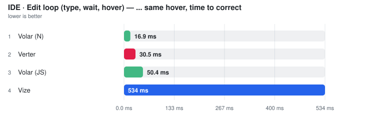
</picture>

| Tool | **Median (primary)** | Min | Stddev | CV% | vs fastest | Artifact | Throughput |
| --- | ---: | ---: | ---: | ---: | ---: | ---: | ---: |
| Volar (N) | **16.9 ms** | 15.8 ms | 0.9 ms | 5.6% | 1.00x | 1 | n/a |
| Verter | **30.5 ms** | 30.3 ms | 3.2 ms | 9.9% | 1.81x | 1 | n/a |
| Volar (JS) | **50.4 ms** | 47.8 ms | 1.6 ms | 3.3% | 2.98x | 1 | n/a |
| Vize | **533.9 ms** | 529.5 ms | 4.7 ms | 0.9% | 31.60x | 1 | n/a |

<details><summary>Notes</summary>

- **Volar (N)**: content verified | engine: tsgo ? via TNB ?
- **Verter**: content verified | engine: tsgo ? (none)
- **Volar (JS)**: content verified | engine: TypeScript ? (JS)
- **Vize**: content verified | engine: tsgo (bundled)

</details>

<details><summary>Raw runs</summary>

- **Volar (N)**: 15.8 ms, 16.9 ms, 17.7 ms
- **Verter**: 35.9 ms, 30.5 ms, 30.3 ms
- **Volar (JS)**: 50.9 ms, 47.8 ms, 50.4 ms
- **Vize**: 529.5 ms, 538.9 ms, 533.9 ms

</details>

#### Steady state: edits 1-5 (median)

<picture>
  <source media="(prefers-color-scheme: dark)" srcset="charts/lsp-ide-ide-edit-loop-steady-state-edits-1-5-median-dark.svg">
  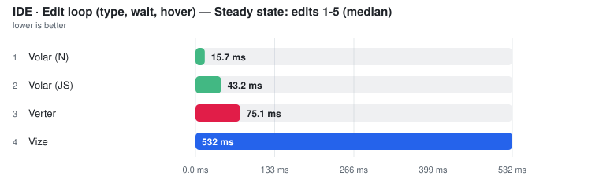
</picture>

| Tool | **Median (primary)** | Min | Stddev | CV% | vs fastest | Artifact | Throughput |
| --- | ---: | ---: | ---: | ---: | ---: | ---: | ---: |
| Volar (N) | **15.7 ms** | 15.5 ms | 0.6 ms | 3.9% | 1.00x | n/a | n/a |
| Volar (JS) | **43.2 ms** | 41.8 ms | 0.9 ms | 2.1% | 2.76x | n/a | n/a |
| Vize | **532.2 ms** | 526.6 ms | 3.5 ms | 0.7% | 33.98x | n/a | n/a |
| Verter ⚠ | (75.1 ms) | (70.9 ms) | – | – | not ranked | – | – |

<details><summary>Notes</summary>

- **Volar (N)**: content verified | engine: tsgo ? via TNB ?
- **Volar (JS)**: content verified | engine: TypeScript ? (JS)
- **Vize**: content verified | engine: tsgo (bundled)
- **Verter ⚠**: content verified | engine: tsgo ? (none) | ⚠ TOO NOISY TO RANK — CV 61.1% (ceiling 50%). The median of a series this unstable is a draw from noise, not a result; the time is bracketed and excluded from ranking exactly like a failed gate. Raw runs below.

</details>

<details><summary>Raw runs</summary>

- **Volar (N)**: 16.7 ms, 15.7 ms, 15.5 ms
- **Volar (JS)**: 43.2 ms, 43.5 ms, 41.8 ms
- **Vize**: 526.6 ms, 533.1 ms, 532.2 ms
- **Verter**: 192.3 ms, 75.1 ms, 70.9 ms

</details>

#### Steady state: edits 6-10 (median)

<picture>
  <source media="(prefers-color-scheme: dark)" srcset="charts/lsp-ide-ide-edit-loop-steady-state-edits-6-10-median-dark.svg">
  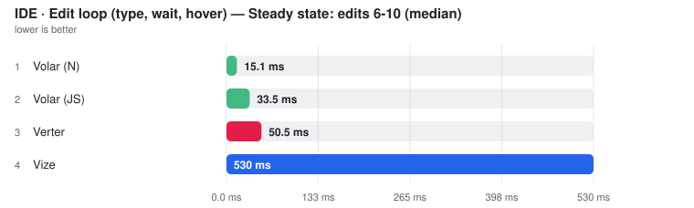
</picture>

| Tool | **Median (primary)** | Min | Stddev | CV% | vs fastest | Artifact | Throughput |
| --- | ---: | ---: | ---: | ---: | ---: | ---: | ---: |
| Volar (N) | **15.1 ms** | 14.4 ms | 1.2 ms | 7.7% | 1.00x | 0 | n/a |
| Volar (JS) | **33.5 ms** | 33.2 ms | 1.9 ms | 5.4% | 2.22x | -10 | n/a |
| Vize | **530.2 ms** | 529.7 ms | 0.5 ms | 0.1% | 35.18x | 4 | n/a |
| Verter ⚠ | (50.5 ms) | (48.7 ms) | – | – | not ranked | (-33) | – |

<details><summary>Notes</summary>

- **Volar (N)**: content verified | engine: tsgo ? via TNB ?
- **Volar (JS)**: content verified | engine: TypeScript ? (JS)
- **Vize**: content verified | engine: tsgo (bundled)
- **Verter ⚠**: content verified | engine: tsgo ? (none) | ⚠ TOO NOISY TO RANK — CV 73.4% (ceiling 50%). The median of a series this unstable is a draw from noise, not a result; the time is bracketed and excluded from ranking exactly like a failed gate. Raw runs below.

</details>

<details><summary>Raw runs</summary>

- **Volar (N)**: 16.8 ms, 15.1 ms, 14.4 ms
- **Volar (JS)**: 33.5 ms, 36.5 ms, 33.2 ms
- **Vize**: 530.6 ms, 529.7 ms, 530.2 ms
- **Verter**: 159.0 ms, 48.7 ms, 50.5 ms

</details>

#### Child prop retype -> Parent diagnostic

<picture>
  <source media="(prefers-color-scheme: dark)" srcset="charts/lsp-ide-ide-edit-loop-child-prop-retype-parent-diagnostic-dark.svg">
   Parent diagnostic" src="charts/lsp-ide-ide-edit-loop-child-prop-retype-parent-diagnostic.svg">
</picture>

| Tool | **Median (primary)** | Min | Stddev | CV% | vs fastest | Artifact | Throughput |
| --- | ---: | ---: | ---: | ---: | ---: | ---: | ---: |
| Volar (JS) | **378.3 ms** | 375.4 ms | 2.5 ms | 0.6% | 1.00x | 1 | n/a |
| Volar (N) | **382.3 ms** | 382.3 ms | 0.3 ms | 0.1% | 1.01x | 1 | n/a |
| Vize | **434.2 ms** | 423.0 ms | 49.3 ms | 10.8% ⚠ | 1.15x | 1 | n/a |
| Verter | **617.2 ms** | 616.5 ms | 0.8 ms | 0.1% | 1.63x | 1 | n/a |

<details><summary>Notes</summary>

- **Volar (JS)**: content verified | engine: TypeScript ? (JS)
- **Volar (N)**: content verified | engine: tsgo ? via TNB ?
- **Vize**: content verified | engine: tsgo (bundled)
- **Verter**: content verified | engine: tsgo ? (none)

</details>

<details><summary>Raw runs</summary>

- **Volar (JS)**: 380.2 ms, 375.4 ms, 378.3 ms
- **Volar (N)**: 382.3 ms, 382.3 ms, 382.9 ms
- **Vize**: 434.2 ms, 513.4 ms, 423.0 ms
- **Verter**: 616.5 ms, 617.2 ms, 618.1 ms

</details>

#### Child prop retype -> Parent hover

<picture>
  <source media="(prefers-color-scheme: dark)" srcset="charts/lsp-ide-ide-edit-loop-child-prop-retype-parent-hover-dark.svg">
   Parent hover" src="charts/lsp-ide-ide-edit-loop-child-prop-retype-parent-hover.svg">
</picture>

| Tool | **Median (primary)** | Min | Stddev | CV% | vs fastest | Artifact | Throughput |
| --- | ---: | ---: | ---: | ---: | ---: | ---: | ---: |
| Volar (N) | **70.2 ms** | 68.7 ms | 3.7 ms | 5.2% | 1.00x | 42 | n/a |
| Volar (JS) | **103.1 ms** | 99.6 ms | 6.7 ms | 6.4% | 1.47x | 42 | n/a |
| Vize | **760.8 ms** | 736.2 ms | 78.0 ms | 9.8% | 10.83x | 250 | n/a |
| Verter ⚠ | (1.5 ms) | (1.5 ms) | – | – | not ranked | (42) | – |

<details><summary>Notes</summary>

- **Volar (N)**: content verified | engine: tsgo ? via TNB ?
- **Volar (JS)**: content verified | engine: TypeScript ? (JS)
- **Vize**: content verified | engine: tsgo (bundled)
- **Verter ⚠**: ⚠ FAILED VALIDATION — STALE: still reports `label: string` after the edit changed it to `number` (the same position answered `string` before the edit, so the feature works here — this is the edit loop; caught up after 451ms) | Sample: "```typescript\n(property) label: string\n```" | engine: tsgo ? (none)

</details>

<details><summary>Raw runs</summary>

- **Volar (N)**: 68.7 ms, 75.8 ms, 70.2 ms
- **Volar (JS)**: 99.6 ms, 112.5 ms, 103.1 ms
- **Vize**: 760.8 ms, 881.9 ms, 736.2 ms
- **Verter**: 1.6 ms, 1.5 ms, 1.5 ms

</details>

#### ... Parent hover, time to correct

<picture>
  <source media="(prefers-color-scheme: dark)" srcset="charts/lsp-ide-ide-edit-loop-parent-hover-time-to-correct-dark.svg">
  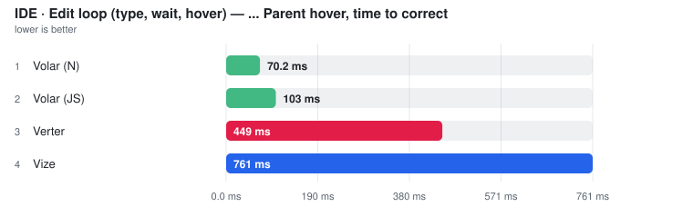
</picture>

| Tool | **Median (primary)** | Min | Stddev | CV% | vs fastest | Artifact | Throughput |
| --- | ---: | ---: | ---: | ---: | ---: | ---: | ---: |
| Volar (N) | **70.2 ms** | 68.7 ms | 3.7 ms | 5.2% | 1.00x | 1 | n/a |
| Volar (JS) | **103.1 ms** | 99.6 ms | 6.7 ms | 6.4% | 1.47x | 1 | n/a |
| Verter | **448.7 ms** | 448.5 ms | 1.7 ms | 0.4% | 6.39x | 3 | n/a |
| Vize | **760.8 ms** | 736.2 ms | 78.0 ms | 9.8% | 10.83x | 1 | n/a |

<details><summary>Notes</summary>

- **Volar (N)**: content verified | engine: tsgo ? via TNB ?
- **Volar (JS)**: content verified | engine: TypeScript ? (JS)
- **Verter**: content verified | engine: tsgo ? (none)
- **Vize**: content verified | engine: tsgo (bundled)

</details>

<details><summary>Raw runs</summary>

- **Volar (N)**: 68.7 ms, 75.8 ms, 70.2 ms
- **Volar (JS)**: 99.6 ms, 112.5 ms, 103.1 ms
- **Verter**: 451.5 ms, 448.7 ms, 448.5 ms
- **Vize**: 760.8 ms, 881.9 ms, 736.2 ms

</details>

#### Peak RSS (process tree)

| Tool | Tool | tsgo / tsserver | **Total** |
| --- | ---: | ---: | ---: |
| Vize | 82.3 MB | 183.2 MB | **265.5 MB** |
| Volar (JS) | 293.0 MB | 310.6 MB | **603.6 MB** |
| Volar (N) | 303.0 MB | 405.6 MB | **708.6 MB** |
| Verter | 37.6 MB | 805.4 MB | **842.9 MB** |

Engine is a **child** `tsgo` / sibling `tsserver` process — the same attribution the typecheck surface uses. `—` = the server hosts its checker in-process.

<details><summary>Methodology</summary>

- Every operation carries a content gate; the timing is only ranked when the answer was verified correct.
- Peak RSS is the whole language-server process tree during the timed session (Volar = Vue half + TypeScript half). It is sampled alongside the run, not from a separate memory job.
- `didOpen -> first diagnostics` is MEASURED BUT NOT RANKED: the fixture is a valid file, so the correct payload is empty and no gate can tell an analysed empty report from a server that publishes `[]` on open and analyses afterwards — the fastest number here can be the least work done. Read `Edit plants type error -> reported` and `Edit fixes it -> diagnostic clears`, which demand specific content, as the comparable diagnostics figures. Its median column is empty by design; the measured time is in the row's note and under Raw runs.
- Rows share one table across TypeScript engines; rows tagged (JS) run the JavaScript compiler — Volar (@vue/language-server) = TypeScript ? (JS); Volar (TNB / tsgo tsdk) = tsgo ? via TNB ?; Vize LSP (Node shim) = tsgo (bundled); Verter LSP (npm 0.0.1-beta.6) = tsgo ? (none). Volar on the stock JavaScript tsdk and Volar on the tsgo tsdk are the same Vue layer differing only in engine, so a cross-engine ratio measures TypeScript's Go rewrite as much as the server. Same axis, same resolver as the typecheck surface.
- Volar is measured as the two-process product it is: both halves are asked in parallel and the pair is charged the slower leg.
- A rejected leg counts as `no answer from this provider`, not as a failure of the pair — Volar's Vue half legitimately rejects methods it does not implement, and an editor routes those to the TypeScript half.
- Document URIs are compared normalised, never by string equality: the same file arrives percent-encoded and with a different drive-letter case from different servers.
- Each suite builds its own purpose-built workspace with an identical tsconfig, strictTemplates, the @vue/typescript-plugin tsserver entry, and Vize's opt-in Corsa/tsgo switches enabled.
- Fresh server process per run; warmups are discarded.

</details>

### IDE · Navigation & refactor (cross-file)

Files: **1** · Bytes: **0**

Tools:

- **Volar (JS)** — @vue/language-server v3 hybrid pair — the Vue server plus typescript-language-server with @vue/typescript-plugin; both processes are measured and the slower half is charged.
- **Volar (N)** — the same Volar pair with its TypeScript half on typescript-native-bridge (tsgo) — same Vue layer, native engine.
- **Vize** — vize lsp --stdio from the npm package (native standalone server when found, Node entry otherwise — the row's notes say which). Runs its own bundled tsgo (Corsa).
- **Verter** — verter-lsp — the native server from the published npm package (version in the notes). Runs stable tsgo.

#### Definition: &lt;ChildCard/> tag

<picture>
  <source media="(prefers-color-scheme: dark)" srcset="charts/lsp-ide-ide-navigation-definition-childcard-tag-dark.svg">
   tag" src="charts/lsp-ide-ide-navigation-definition-childcard-tag.svg">
</picture>

| Tool | **Cold** | vs fastest cold | **Warm** | Min | Stddev | CV% | vs fastest | Artifact | Throughput |
| --- | ---: | ---: | ---: | ---: | ---: | ---: | ---: | ---: | ---: |
| Vize | **69.6 ms** | 1.00x | **0.3 ms** | 0.3 ms | 0.0 ms | 2.7% | 1.00x | 1 | n/a |
| Volar (N) | **418.3 ms** | 6.01x | **16.6 ms** | 13.3 ms | 3.8 ms | 22.2% ⚠ | 62.55x | 1 | n/a |
| Volar (JS) | **1.11 s** | 15.99x | **181.1 ms** | 177.5 ms | 12.4 ms | 6.7% | 682.91x | 1 | n/a |
| Verter ⚠ | (49.2 ms) | not ranked | (15.7 ms) | (1.8 ms) | – | – | not ranked | (1) | – |

<details><summary>Notes</summary>

- **Vize**: content verified | engine: tsgo (bundled)
- **Volar (N)**: content verified | engine: tsgo ? via TNB ?
- **Volar (JS)**: content verified | engine: TypeScript ? (JS)
- **Verter ⚠**: content verified | engine: tsgo ? (none) | ⚠ TOO NOISY TO RANK — CV 74.1% (ceiling 50%). The median of a series this unstable is a draw from noise, not a result; the time is bracketed and excluded from ranking exactly like a failed gate. Raw runs below.

</details>

<details><summary>Raw runs</summary>

- **Vize**: 0.3 ms, 0.3 ms, 0.3 ms
- **Volar (N)**: 13.3 ms, 20.8 ms, 16.6 ms
- **Volar (JS)**: 177.5 ms, 181.1 ms, 200.6 ms
- **Verter**: 1.8 ms, 15.7 ms, 17.8 ms

</details>

#### Definition: imported fn (script)

<picture>
  <source media="(prefers-color-scheme: dark)" srcset="charts/lsp-ide-ide-navigation-definition-imported-fn-script-dark.svg">
  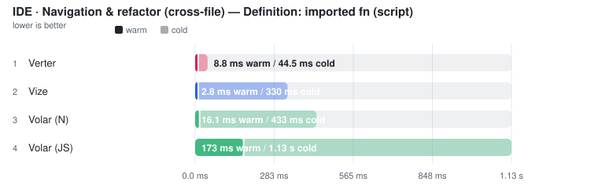
</picture>

| Tool | **Cold** | vs fastest cold | **Warm** | Min | Stddev | CV% | vs fastest | Artifact | Throughput |
| --- | ---: | ---: | ---: | ---: | ---: | ---: | ---: | ---: | ---: |
| Vize | **330.5 ms** | 1.00x | **2.8 ms** | 2.7 ms | 0.1 ms | 4.8% | 1.00x | 1 | n/a |
| Volar (JS) | **1.13 s** | 3.42x | **173.3 ms** | 173.0 ms | 3.9 ms | 2.2% | 62.89x | 1 | n/a |
| Volar (N) ⚠ | (433.5 ms) | not ranked | (16.1 ms) | (5.8 ms) | – | – | not ranked | (1) | – |
| Verter ⚠ | (44.5 ms) | not ranked | (8.8 ms) | (4.8 ms) | – | – | not ranked | (1) | – |

<details><summary>Notes</summary>

- **Vize**: content verified | engine: tsgo (bundled)
- **Volar (JS)**: content verified | engine: TypeScript ? (JS)
- **Volar (N) ⚠**: content verified | engine: tsgo ? via TNB ? | ⚠ TOO NOISY TO RANK — CV 55.2% (ceiling 50%). The median of a series this unstable is a draw from noise, not a result; the time is bracketed and excluded from ranking exactly like a failed gate. Raw runs below.
- **Verter ⚠**: content verified | engine: tsgo ? (none) | ⚠ TOO NOISY TO RANK — CV 54.7% (ceiling 50%). The median of a series this unstable is a draw from noise, not a result; the time is bracketed and excluded from ranking exactly like a failed gate. Raw runs below.

</details>

<details><summary>Raw runs</summary>

- **Vize**: 3.0 ms, 2.8 ms, 2.7 ms
- **Volar (JS)**: 173.0 ms, 173.3 ms, 179.9 ms
- **Volar (N)**: 5.8 ms, 21.5 ms, 16.1 ms
- **Verter**: 15.3 ms, 4.8 ms, 8.8 ms

</details>

#### Type definition: typed binding

<picture>
  <source media="(prefers-color-scheme: dark)" srcset="charts/lsp-ide-ide-navigation-type-definition-typed-binding-dark.svg">
  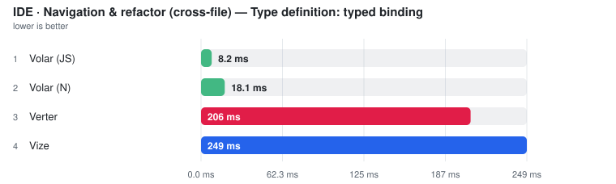
</picture>

| Tool | **Median (primary)** | Min | Stddev | CV% | vs fastest | Artifact | Throughput |
| --- | ---: | ---: | ---: | ---: | ---: | ---: | ---: |
| Volar (JS) | **8.2 ms** | 7.4 ms | 1.4 ms | 16.6% ⚠ | 1.00x | 1 | n/a |
| Volar (N) | **18.1 ms** | 17.9 ms | 10.3 ms | 43.0% ⚠ | 2.21x | 1 | n/a |
| Verter | **206.1 ms** | 191.2 ms | 8.9 ms | 4.4% | 25.12x | 1 | n/a |
| Vize | **249.1 ms** | 248.5 ms | 1.3 ms | 0.5% | 30.37x | 1 | n/a |

<details><summary>Notes</summary>

- **Volar (JS)**: content verified | engine: TypeScript ? (JS)
- **Volar (N)**: content verified | engine: tsgo ? via TNB ?
- **Verter**: content verified | engine: tsgo ? (none)
- **Vize**: content verified | engine: tsgo (bundled)

</details>

<details><summary>Raw runs</summary>

- **Volar (JS)**: 8.2 ms, 10.2 ms, 7.4 ms
- **Volar (N)**: 35.9 ms, 17.9 ms, 18.1 ms
- **Verter**: 207.3 ms, 206.1 ms, 191.2 ms
- **Vize**: 250.9 ms, 249.1 ms, 248.5 ms

</details>

#### References: prop -> parent template

<picture>
  <source media="(prefers-color-scheme: dark)" srcset="charts/lsp-ide-ide-navigation-references-prop-parent-template-dark.svg">
   parent template" src="charts/lsp-ide-ide-navigation-references-prop-parent-template.svg">
</picture>

| Tool | **Median (primary)** | Min | Stddev | CV% | vs fastest | Artifact | Throughput |
| --- | ---: | ---: | ---: | ---: | ---: | ---: | ---: |
| Volar (N) | **77.3 ms** | 68.5 ms | 10.5 ms | 13.4% ⚠ | 1.00x | 4 | n/a |
| Volar (JS) | **138.4 ms** | 132.9 ms | 3.6 ms | 2.6% | 1.79x | 4 | n/a |
| Vize ⚠ | (109.6 ms) | (106.8 ms) | – | – | not ranked | (2) | – |
| Verter ⚠ | (87.5 ms) | (67.2 ms) | – | – | not ranked | (3) | – |

<details><summary>Notes</summary>

- **Volar (N)**: content verified | engine: tsgo ? via TNB ?
- **Volar (JS)**: content verified | engine: TypeScript ? (JS)
- **Vize ⚠**: ⚠ FAILED VALIDATION — references missing ChildCard.vue + Parent.vue symbol ranges — found files childcard.vue | Sample: "childcard.vue@2:11 childcard.vue@11:2" | engine: tsgo (bundled)
- **Verter ⚠**: ⚠ FAILED VALIDATION — references missing Parent.vue symbol ranges — found files childcard.vue | Sample: "childcard.vue@11:2 childcard.vue@15:38 childcard.vue@2:11" | engine: tsgo ? (none)

</details>

<details><summary>Raw runs</summary>

- **Volar (N)**: 77.3 ms, 89.4 ms, 68.5 ms
- **Volar (JS)**: 139.6 ms, 132.9 ms, 138.4 ms
- **Vize**: 109.6 ms, 110.0 ms, 106.8 ms
- **Verter**: 88.9 ms, 67.2 ms, 87.5 ms

</details>

#### Prepare rename: prop

<picture>
  <source media="(prefers-color-scheme: dark)" srcset="charts/lsp-ide-ide-navigation-prepare-rename-prop-dark.svg">
  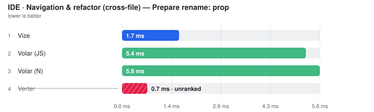
</picture>

| Tool | **Median (primary)** | Min | Stddev | CV% | vs fastest | Artifact | Throughput |
| --- | ---: | ---: | ---: | ---: | ---: | ---: | ---: |
| Volar (JS) | **5.4 ms** | 5.2 ms | 0.7 ms | 12.7% ⚠ | 1.00x | n/a | n/a |
| Volar (N) | **5.8 ms** | 4.9 ms | 0.6 ms | 11.2% ⚠ | 1.08x | n/a | n/a |
| Vize ⚠ | (1.7 ms) | (1.6 ms) | – | – | not ranked | – | – |
| Verter ⚠ | (0.7 ms) | (0.7 ms) | – | – | not ranked | – | – |

<details><summary>Notes</summary>

- **Volar (JS)**: content verified | engine: TypeScript ? (JS)
- **Volar (N)**: content verified | engine: tsgo ? via TNB ?
- **Vize ⚠**: content verified | engine: tsgo (bundled) | ⚠ TOO NOISY TO RANK — CV 52.0% (ceiling 50%). The median of a series this unstable is a draw from noise, not a result; the time is bracketed and excluded from ranking exactly like a failed gate. Raw runs below.
- **Verter ⚠**: ⚠ FAILED VALIDATION — prepareRename returned null — server declines to rename at this position | Sample: "null" | engine: tsgo ? (none)

</details>

<details><summary>Raw runs</summary>

- **Volar (JS)**: 6.5 ms, 5.2 ms, 5.4 ms
- **Volar (N)**: 4.9 ms, 6.1 ms, 5.8 ms
- **Vize**: 3.8 ms, 1.6 ms, 1.7 ms
- **Verter**: 0.7 ms, 2.3 ms, 0.7 ms

</details>

#### Rename prop (cross-file edit)

<picture>
  <source media="(prefers-color-scheme: dark)" srcset="charts/lsp-ide-ide-navigation-rename-prop-cross-file-edit-dark.svg">
  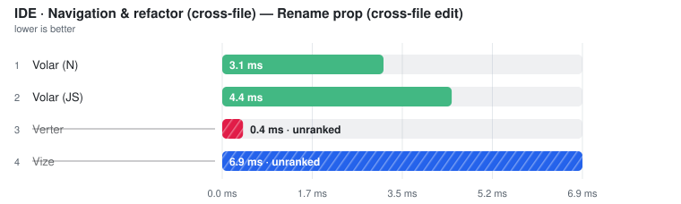
</picture>

| Tool | **Median (primary)** | Min | Stddev | CV% | vs fastest | Artifact | Throughput |
| --- | ---: | ---: | ---: | ---: | ---: | ---: | ---: |
| Volar (N) | **3.1 ms** | 3.0 ms | 0.2 ms | 7.1% | 1.00x | 4 | n/a |
| Volar (JS) | **4.4 ms** | 3.3 ms | 0.7 ms | 16.7% ⚠ | 1.42x | 4 | n/a |
| Vize ⚠ | (6.9 ms) | (6.8 ms) | – | – | not ranked | (3) | – |
| Verter ⚠ | (0.4 ms) | (0.4 ms) | – | – | not ranked | – | – |

<details><summary>Notes</summary>

- **Volar (N)**: content verified | engine: tsgo ? via TNB ?
- **Volar (JS)**: content verified | engine: TypeScript ? (JS)
- **Vize ⚠**: ⚠ FAILED VALIDATION — BROKEN REFACTOR: applied edits changed unrelated SFC semantics or failed to perform the intended edit | Sample: "childcard.vue:2, parent.vue:1 :: applied rename of captionText to renamedCaption; declaration, uses and decoys checked" | engine: tsgo (bundled)
- **Verter ⚠**: ⚠ FAILED VALIDATION — request failed: {"code":-32803,"message":"verter: rename is unavailable for public component props because complete cross-file usage proof is unavailable; no rename edit was produced."} | engine: tsgo ? (none)

</details>

<details><summary>Raw runs</summary>

- **Volar (N)**: 3.4 ms, 3.0 ms, 3.1 ms
- **Volar (JS)**: 4.5 ms, 4.4 ms, 3.3 ms
- **Vize**: 7.1 ms, 6.9 ms, 6.8 ms
- **Verter**: 0.4 ms, 0.4 ms, 0.4 ms

</details>

#### Code action at diagnostic

<picture>
  <source media="(prefers-color-scheme: dark)" srcset="charts/lsp-ide-ide-navigation-code-action-at-diagnostic-dark.svg">
  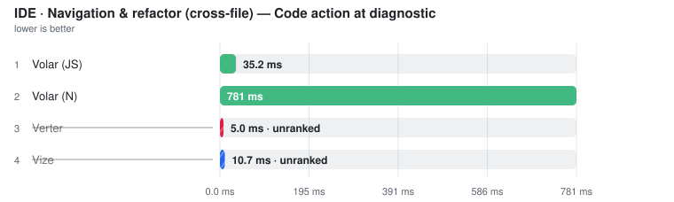
</picture>

| Tool | **Median (primary)** | Min | Stddev | CV% | vs fastest | Artifact | Throughput |
| --- | ---: | ---: | ---: | ---: | ---: | ---: | ---: |
| Volar (JS) | **35.2 ms** | 30.7 ms | 3.7 ms | 10.8% ⚠ | 1.00x | 2 | n/a |
| Volar (N) | **781.2 ms** | 760.2 ms | 13.8 ms | 1.8% | 22.22x | 2 | n/a |
| Vize ⚠ | (10.7 ms) | (10.5 ms) | – | – | not ranked | (0) | – |
| Verter ⚠ | (5.0 ms) | (4.8 ms) | – | – | not ranked | (0) | – |

<details><summary>Notes</summary>

- **Volar (JS)**: content verified | engine: TypeScript ? (JS)
- **Volar (N)**: content verified | engine: tsgo ? via TNB ?
- **Vize ⚠**: ⚠ FAILED VALIDATION — codeAction returned nothing at the diagnostic | Sample: "null" | engine: tsgo (bundled)
- **Verter ⚠**: ⚠ FAILED VALIDATION — codeAction returned nothing at the diagnostic | Sample: "null" | engine: tsgo ? (none)

</details>

<details><summary>Raw runs</summary>

- **Volar (JS)**: 35.2 ms, 38.2 ms, 30.7 ms
- **Volar (N)**: 781.2 ms, 760.2 ms, 786.1 ms
- **Vize**: 10.5 ms, 11.8 ms, 10.7 ms
- **Verter**: 7.3 ms, 5.0 ms, 4.8 ms

</details>

#### Signature help after `(`

<picture>
  <source media="(prefers-color-scheme: dark)" srcset="charts/lsp-ide-ide-navigation-signature-help-after-dark.svg">
  
</picture>

| Tool | **Median (primary)** | Min | Stddev | CV% | vs fastest | Artifact | Throughput |
| --- | ---: | ---: | ---: | ---: | ---: | ---: | ---: |
| Volar (JS) | **18.9 ms** | 18.7 ms | 0.3 ms | 1.8% | 1.00x | 1 | n/a |
| Verter | **20.1 ms** | 18.8 ms | 1.0 ms | 4.9% | 1.06x | 1 | n/a |
| Volar (N) | **28.3 ms** | 27.6 ms | 0.8 ms | 2.9% | 1.49x | 1 | n/a |
| Vize | **381.2 ms** | 380.6 ms | 1.8 ms | 0.5% | 20.12x | 1 | n/a |

<details><summary>Notes</summary>

- **Volar (JS)**: content verified | engine: TypeScript ? (JS)
- **Verter**: content verified | engine: tsgo ? (none)
- **Volar (N)**: content verified | engine: tsgo ? via TNB ?
- **Vize**: content verified | engine: tsgo (bundled)

</details>

<details><summary>Raw runs</summary>

- **Volar (JS)**: 18.7 ms, 18.9 ms, 19.4 ms
- **Verter**: 20.7 ms, 18.8 ms, 20.1 ms
- **Volar (N)**: 28.3 ms, 27.6 ms, 29.2 ms
- **Vize**: 380.6 ms, 381.2 ms, 383.9 ms

</details>

#### Format unformatted SFC

<picture>
  <source media="(prefers-color-scheme: dark)" srcset="charts/lsp-ide-ide-navigation-format-unformatted-sfc-dark.svg">
  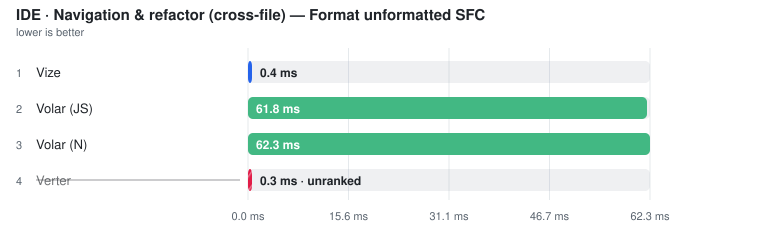
</picture>

| Tool | **Median (primary)** | Min | Stddev | CV% | vs fastest | Artifact | Throughput |
| --- | ---: | ---: | ---: | ---: | ---: | ---: | ---: |
| Vize | **0.4 ms** | 0.4 ms | 0.0 ms | 3.7% | 1.00x | 1 | n/a |
| Volar (JS) | **61.8 ms** | 61.1 ms | 0.5 ms | 0.8% | 160.91x | 1 | n/a |
| Volar (N) | **62.3 ms** | 61.6 ms | 3.1 ms | 4.9% | 162.12x | 1 | n/a |
| Verter ⚠ | (0.3 ms) | (0.2 ms) | – | – | not ranked | (0) | – |

<details><summary>Notes</summary>

- **Vize**: content verified | engine: tsgo (bundled)
- **Volar (JS)**: content verified | engine: TypeScript ? (JS)
- **Volar (N)**: content verified | engine: tsgo ? via TNB ?
- **Verter ⚠**: ⚠ FAILED VALIDATION — formatting returned null on a deliberately unformatted document | Sample: "null" | engine: tsgo ? (none)

</details>

<details><summary>Raw runs</summary>

- **Vize**: 0.4 ms, 0.4 ms, 0.4 ms
- **Volar (JS)**: 62.0 ms, 61.1 ms, 61.8 ms
- **Volar (N)**: 62.3 ms, 61.6 ms, 67.4 ms
- **Verter**: 0.4 ms, 0.3 ms, 0.2 ms

</details>

#### Peak RSS (process tree)

| Tool | Tool | tsgo / tsserver | **Total** |
| --- | ---: | ---: | ---: |
| Verter | 117.6 MB | 108.5 MB | **226.2 MB** |
| Vize | 81.5 MB | 185.3 MB | **266.8 MB** |
| Volar (JS) | 294.1 MB | 256.1 MB | **550.3 MB** |
| Volar (N) | 305.2 MB | 483.1 MB | **788.2 MB** |

Engine is a **child** `tsgo` / sibling `tsserver` process — the same attribution the typecheck surface uses. `—` = the server hosts its checker in-process.

<details><summary>Methodology</summary>

- Every operation carries a content gate; the timing is only ranked when the answer was verified correct.
- Peak RSS is the whole language-server process tree during the timed session (Volar = Vue half + TypeScript half). It is sampled alongside the run, not from a separate memory job.
- Rows share one table across TypeScript engines; rows tagged (JS) run the JavaScript compiler — Volar (@vue/language-server) = TypeScript ? (JS); Volar (TNB / tsgo tsdk) = tsgo ? via TNB ?; Vize LSP (Node shim) = tsgo (bundled); Verter LSP (npm 0.0.1-beta.6) = tsgo ? (none). Volar on the stock JavaScript tsdk and Volar on the tsgo tsdk are the same Vue layer differing only in engine, so a cross-engine ratio measures TypeScript's Go rewrite as much as the server. Same axis, same resolver as the typecheck surface.
- Volar is measured as the two-process product it is: both halves are asked in parallel and the pair is charged the slower leg.
- A rejected leg counts as `no answer from this provider`, not as a failure of the pair — Volar's Vue half legitimately rejects methods it does not implement, and an editor routes those to the TypeScript half.
- Document URIs are compared normalised, never by string equality: the same file arrives percent-encoded and with a different drive-letter case from different servers.
- Each suite builds its own purpose-built workspace with an identical tsconfig, strictTemplates, the @vue/typescript-plugin tsserver entry, and Vize's opt-in Corsa/tsgo switches enabled.
- Fresh server process per run; warmups are discarded.

</details>

### IDE · Smoke (reference suite)

Files: **1** · Bytes: **0**

Tools:

- **Volar (JS)** — @vue/language-server v3 hybrid pair — the Vue server plus typescript-language-server with @vue/typescript-plugin; both processes are measured and the slower half is charged.
- **Volar (N)** — the same Volar pair with its TypeScript half on typescript-native-bridge (tsgo) — same Vue layer, native engine.
- **Vize** — vize lsp --stdio from the npm package (native standalone server when found, Node entry otherwise — the row's notes say which). Runs its own bundled tsgo (Corsa).
- **Verter** — verter-lsp — the native server from the published npm package (version in the notes). Runs stable tsgo.

#### Hover (script setup)

<picture>
  <source media="(prefers-color-scheme: dark)" srcset="charts/lsp-ide-ide-smoke-hover-script-setup-dark.svg">
  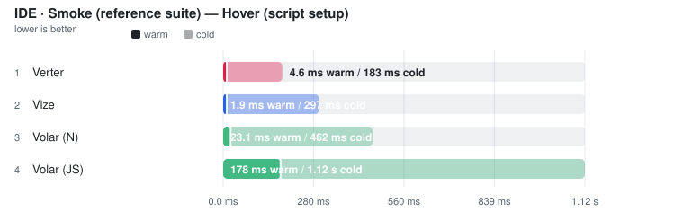
</picture>

| Tool | **Cold** | vs fastest cold | **Warm** | Min | Stddev | CV% | vs fastest | Artifact | Throughput |
| --- | ---: | ---: | ---: | ---: | ---: | ---: | ---: | ---: | ---: |
| Verter | **183.2 ms** | 1.00x | **4.6 ms** | 4.2 ms | 0.3 ms | 7.4% | 1.00x | 89 | n/a |
| Volar (N) | **462.4 ms** | 2.52x | **23.1 ms** | 22.8 ms | 2.1 ms | 8.9% | 5.06x | 90 | n/a |
| Volar (JS) ⚠ | (1.12 s) | not ranked | (177.6 ms) | (7.5 ms) | – | – | not ranked | (90) | – |
| Vize ⚠ | (296.7 ms) | not ranked | (1.9 ms) | (1.6 ms) | – | – | not ranked | (90) | – |

<details><summary>Notes</summary>

- **Verter**: content verified | engine: tsgo ? (none)
- **Volar (N)**: content verified | engine: tsgo ? via TNB ?
- **Volar (JS) ⚠**: content verified | engine: TypeScript ? (JS) | ⚠ TOO NOISY TO RANK — CV 81.4% (ceiling 50%). The median of a series this unstable is a draw from noise, not a result; the time is bracketed and excluded from ranking exactly like a failed gate. Raw runs below.
- **Vize ⚠**: content verified | engine: tsgo (bundled) | ⚠ TOO NOISY TO RANK — CV 104.1% (ceiling 50%). The median of a series this unstable is a draw from noise, not a result; the time is bracketed and excluded from ranking exactly like a failed gate. Raw runs below.

</details>

<details><summary>Raw runs</summary>

- **Verter**: 4.9 ms, 4.6 ms, 4.2 ms
- **Volar (N)**: 22.8 ms, 26.7 ms, 23.1 ms
- **Volar (JS)**: 184.9 ms, 7.5 ms, 177.6 ms
- **Vize**: 1.9 ms, 1.6 ms, 9.7 ms

</details>

#### Hover (template interpolation)

<picture>
  <source media="(prefers-color-scheme: dark)" srcset="charts/lsp-ide-ide-smoke-hover-template-interpolation-dark.svg">
  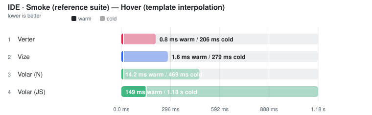
</picture>

| Tool | **Cold** | vs fastest cold | **Warm** | Min | Stddev | CV% | vs fastest | Artifact | Throughput |
| --- | ---: | ---: | ---: | ---: | ---: | ---: | ---: | ---: | ---: |
| Vize | **279.3 ms** | 1.00x | **1.6 ms** | 1.6 ms | 0.0 ms | 1.5% | 1.00x | 38 | n/a |
| Volar (N) | **469.4 ms** | 1.68x | **14.2 ms** | 11.0 ms | 5.2 ms | 33.7% ⚠ | 8.67x | 43 | n/a |
| Volar (JS) ⚠ | (1.18 s) | not ranked | (149.1 ms) | (7.9 ms) | – | – | not ranked | (43) | – |
| Verter ⚠ | (206.1 ms) | not ranked | (0.8 ms) | (0.8 ms) | – | – | not ranked | (74) | – |

<details><summary>Notes</summary>

- **Vize**: content verified | engine: tsgo (bundled)
- **Volar (N)**: content verified | engine: tsgo ? via TNB ?
- **Volar (JS) ⚠**: content verified | engine: TypeScript ? (JS) | ⚠ TOO NOISY TO RANK — CV 80.3% (ceiling 50%). The median of a series this unstable is a draw from noise, not a result; the time is bracketed and excluded from ranking exactly like a failed gate. Raw runs below.
- **Verter ⚠**: content verified | engine: tsgo ? (none) | ⚠ TOO NOISY TO RANK — CV 112.3% (ceiling 50%). The median of a series this unstable is a draw from noise, not a result; the time is bracketed and excluded from ranking exactly like a failed gate. Raw runs below.

</details>

<details><summary>Raw runs</summary>

- **Vize**: 1.6 ms, 1.6 ms, 1.7 ms
- **Volar (N)**: 14.2 ms, 21.2 ms, 11.0 ms
- **Volar (JS)**: 160.0 ms, 7.9 ms, 149.1 ms
- **Verter**: 5.2 ms, 0.8 ms, 0.8 ms

</details>

#### Peak RSS (process tree)

| Tool | Tool | tsgo / tsserver | **Total** |
| --- | ---: | ---: | ---: |
| Verter | 76.9 MB | 89.8 MB | **166.7 MB** |
| Vize | 79.8 MB | 175.3 MB | **255.1 MB** |
| Volar (JS) | 277.3 MB | 246.7 MB | **523.9 MB** |
| Volar (N) | 288.3 MB | 324.2 MB | **612.5 MB** |

Engine is a **child** `tsgo` / sibling `tsserver` process — the same attribution the typecheck surface uses. `—` = the server hosts its checker in-process.

<details><summary>Methodology</summary>

- Every operation carries a content gate; the timing is only ranked when the answer was verified correct.
- Peak RSS is the whole language-server process tree during the timed session (Volar = Vue half + TypeScript half). It is sampled alongside the run, not from a separate memory job.
- Rows share one table across TypeScript engines; rows tagged (JS) run the JavaScript compiler — Volar (@vue/language-server) = TypeScript ? (JS); Volar (TNB / tsgo tsdk) = tsgo ? via TNB ?; Vize LSP (Node shim) = tsgo (bundled); Verter LSP (npm 0.0.1-beta.6) = tsgo ? (none). Volar on the stock JavaScript tsdk and Volar on the tsgo tsdk are the same Vue layer differing only in engine, so a cross-engine ratio measures TypeScript's Go rewrite as much as the server. Same axis, same resolver as the typecheck surface.
- Volar is measured as the two-process product it is: both halves are asked in parallel and the pair is charged the slower leg.
- A rejected leg counts as `no answer from this provider`, not as a failure of the pair — Volar's Vue half legitimately rejects methods it does not implement, and an editor routes those to the TypeScript half.
- Document URIs are compared normalised, never by string equality: the same file arrives percent-encoded and with a different drive-letter case from different servers.
- Each suite builds its own purpose-built workspace with an identical tsconfig, strictTemplates, the @vue/typescript-plugin tsserver entry, and Vize's opt-in Corsa/tsgo switches enabled.
- Fresh server process per run; warmups are discarded.

</details>

### IDE · Typing loop (composite)

<picture>
  <source media="(prefers-color-scheme: dark)" srcset="charts/lsp-ide-ide-typing-loop-dark.svg">
  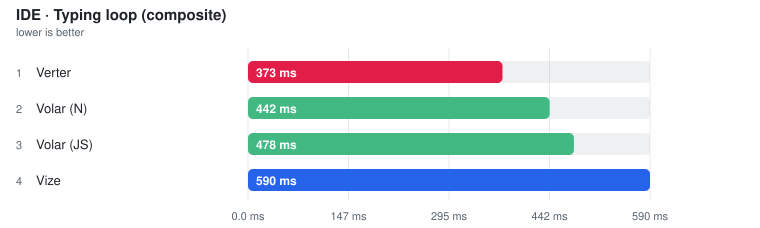
</picture>

Files: **1** · Bytes: **0**

Tools:

- **Volar (JS)** — @vue/language-server v3 hybrid pair — the Vue server plus typescript-language-server with @vue/typescript-plugin; both processes are measured and the slower half is charged.
- **Volar (N)** — the same Volar pair with its TypeScript half on typescript-native-bridge (tsgo) — same Vue layer, native engine.
- **Vize** — vize lsp --stdio from the npm package (native standalone server when found, Node entry otherwise — the row's notes say which). Runs its own bundled tsgo (Corsa).
- **Verter** — verter-lsp — the native server from the published npm package (version in the notes). Runs stable tsgo.

| Tool | **Median (primary)** | Min | Stddev | CV% | vs fastest | Artifact | Throughput |
| --- | ---: | ---: | ---: | ---: | ---: | ---: | ---: |
| Verter | **373.3 ms** | 373.3 ms | n/a | n/a | 1.00x | n/a | n/a |
| Volar (N) | **442.3 ms** | 442.3 ms | n/a | n/a | 1.18x | n/a | n/a |
| Volar (JS) | **478.0 ms** | 478.0 ms | n/a | n/a | 1.28x | n/a | n/a |
| Vize | **589.6 ms** | 589.6 ms | n/a | n/a | 1.58x | n/a | n/a |

<details><summary>Notes</summary>

- **Verter**: all components verified · edit → diagnostic=342ms · hover after edit=31ms · completion=1ms
- **Volar (N)**: all components verified · edit → diagnostic=398ms · hover after edit=17ms · completion=27ms
- **Volar (JS)**: all components verified · edit → diagnostic=403ms · hover after edit=50ms · completion=24ms
- **Vize**: all components verified · edit → diagnostic=55ms · hover after edit=534ms · completion=0ms

</details>

<details><summary>Methodology</summary>

- Sum of three medians: edit-loop/diagnostics-error + edit-loop/hover-after-edit + completion/completion-script-member.
- Measured in separate sessions and added, NOT observed as one continuous cycle — it is an indicative cost of one edit-and-look cycle, not a single stopwatch reading.
- A server is ranked only if it passed the content gate on every component. Adding a fast hover to a diagnostics number the server never earned would flatter exactly the servers that do the least work.
- Servers that failed a component are shown in brackets with the failing part named.
- Composites share one table across TypeScript engines with (JS)-tagged rows, exactly as the per-operation tables do — a JS-engine composite against a tsgo composite is an engine comparison, not a server comparison.

Raw runs:

</details>

### IDE scale study

Operation latency as the workspace grows — one table, one column per workspace size. A study, not a ranking surface; **growth** is the 20→500-file multiplier. **Peak RSS** is the server process tree's peak over the whole scale session (one figure per server — it is not attributable to a single size, so it repeats across operations).

| Operation | Tool | @20 files | @100 files | @500 files | growth | Peak RSS |
| --- | --- | ---: | ---: | ---: | ---: | ---: |
| **Time-to-usable** | Vize LSP (Node shim) | 343 ms | 343 ms | 356 ms | ×1.02 | 66.2 MB |
|  | Verter LSP (npm 0.0.1-beta.6) | 356 ms | 288 ms | 404 ms | ×0.86 | 68.6 MB |
|  | Volar (TNB / tsgo tsdk) | 1.17 s | 1.34 s | 2.02 s | ×1.75 | 270.7 + 137.4 = 408.1 MB |
|  | Volar (@vue/language-server) | 1.90 s | 2.10 s | 3.09 s | ×1.6 | 254.4 + 76.5 = 330.9 MB |
| **Completion** | Vize LSP (Node shim) | 0.4 ms | 0.4 ms | 0.4 ms | ×1.05 | 66.2 MB |
|  | Verter LSP (npm 0.0.1-beta.6) | 144 ms | 165 ms | 177 ms | ×1.23 | 68.6 MB |
|  | Volar (TNB / tsgo tsdk) | 181 ms | 198 ms | 245 ms | ×1.35 | 270.7 + 137.4 = 408.1 MB |
|  | Volar (@vue/language-server) | 209 ms | 192 ms | 291 ms | ×1.64 | 254.4 + 76.5 = 330.9 MB |
| **References** | Volar (TNB / tsgo tsdk) | 117 ms | 584 ms | 10.7 s | ×91.86 | 270.7 + 137.4 = 408.1 MB |
|  | Volar (@vue/language-server) | 445 ms | 1.06 s | 14.9 s | ×51.41 | 254.4 + 76.5 = 330.9 MB |
|  | Vize LSP (Node shim) | (3.0 ms) ⚠ | (3.1 ms) ⚠ | (2.9 ms) ⚠ | – | 66.2 MB |
|  | Verter LSP (npm 0.0.1-beta.6) | (0.4 ms) ⚠ | (0.5 ms) ⚠ | (0.9 ms) ⚠ | – | 68.6 MB |
| **Hover warm** | Verter LSP (npm 0.0.1-beta.6) | 0.7 ms | 0.7 ms | 0.8 ms | ×1.26 | 68.6 MB |
|  | Volar (@vue/language-server) | 1.3 ms | 2.5 ms | 1.3 ms | ×0.49 | 254.4 + 76.5 = 330.9 MB |
|  | Vize LSP (Node shim) | 1.7 ms | 1.7 ms | 1.7 ms | ×0.97 | 66.2 MB |
|  | Volar (TNB / tsgo tsdk) | 1.6 ms | 1.9 ms | 4.5 ms | ×2.48 | 270.7 + 137.4 = 408.1 MB |

## Validation (plants)

Executable correctness checks — planted errors that must be reported, clean fixtures that must stay clean. A fast tool that misses plants cannot rank as a correct one; gate failures surface as ⚠ in the timing tables.

pass **21** · fail **6** · warn **0** · skip **0**

| Case | volar | vize | verter |
| --- | :---: | :---: | :---: |
| `completion-prop-template` | ✓ | ✓ | ✓ |
| `definition-component` | ✓ | ✓ | ✓ |
| `definition-prop-attr` | ✓ | ✓ | ✓ |
| `diagnostics-clear-after-fix` | ✓ | **✗** | ✓ |
| `diagnostics-template` | ✓ | **✗** | ✓ |
| `document-symbol-structure` | ✓ | **✗** | ✓ |
| `hover-template-binding` | ✓ | ✓ | ✓ |
| `references-prop-template` | ✓ | **✗** | **✗** |
| `rename-prop-template` | ✓ | ✓ | **✗** |

<details><summary>Failure detail</summary>

- `document-symbol-structure` · **vize** — documentSymbol never names greeting — saw: template, script setup
- `references-prop-template` · **vize** — references missing App.vue symbol ranges — found files child.vue
- `diagnostics-template` · **vize** — no diagnostic mentioning plantedBadProp within 20000ms — no diagnostics published
- `diagnostics-clear-after-fix` · **vize** — cannot confirm clear: planted plantedBadProp never appeared
- `references-prop-template` · **verter** — references missing App.vue symbol ranges — found files child.vue
- `rename-prop-template` · **verter** — rename request failed: {"code":-32803,"message":"verter: rename is unavailable for public component props because complete cross-file usage proof is unavailable; no rename edit was produced."}

</details>

> The same group measured on pinned third-party projects: [real-world.md](real-world.md).

## Memory (isolated probe)

Each tool in its own process so RSS, allocation proxies and CPU are not mixed with siblings or with timing. Full probe across every group: [memory.md](memory.md).

| Tool | RSS min / max / avg | Alloc min / max / avg | CPU ms | CPU % | Wall ms | Samples |
| --- | ---: | ---: | ---: | ---: | ---: | ---: |
| LSP vize (server process, Node shim) | 181.26 / 266.52 / 181.26 | 0.88 / 1.79 / 1.28 | 90 | 13.2 | 491 | 3 |
| LSP verter (server process, npm 0.0.1-beta.6) | 89.49 / 202.80 / 89.49 | 1.13 / 2.59 / 1.63 | 260 | 13.5 | 545 | 3 |
| LSP Volar — Vue server process only (TypeScript half not sampled) | 394.78 / 532.84 / 394.78 | 0.92 / 2.65 / 1.72 | 780 | 10.7 | 1930 | 3 |

<details><summary>Notes</summary>

- **LSP vize (server process, Node shim)** — RSS/CPU are the LANGUAGE SERVER process, sampled by the session. Worker-process figures are reported separately as worker*. Volar is explicitly UNVERIFIED because this covers its Vue server only — its required tsserver half is a separate process and is NOT included.
- **LSP verter (server process, npm 0.0.1-beta.6)** — RSS/CPU are the LANGUAGE SERVER process, sampled by the session. Worker-process figures are reported separately as worker*. Volar is explicitly UNVERIFIED because this covers its Vue server only — its required tsserver half is a separate process and is NOT included.
- **LSP Volar — Vue server process only (TypeScript half not sampled)** — RSS/CPU are the LANGUAGE SERVER process, sampled by the session. Worker-process figures are reported separately as worker*. Volar is explicitly UNVERIFIED because this covers its Vue server only — its required tsserver half is a separate process and is NOT included.

</details>

## Tool versions

<details><summary>Every pinned package in this run</summary>

| Package | Version |
| --- | --- |
| node | v22.23.2 |
| vue | 3.5.43 |
| vue-36 | 3.6.0-rc.9 |
| @vue/compiler-sfc | 3.5.43 |
| @vue/compiler-sfc-36 | 3.6.0-rc.9 |
| vize | 0.429.1 |
| @vizejs/native | 0.429.1 |
| @verter/native | 0.0.1-beta.6 |
| @fervid/napi | 0.4.1 |
| verter-tsc | 0.0.1-beta.6 |
| @verter/component-meta | 0.0.1-beta.6 |
| verter-lsp | 0.0.1-beta.6 |
| verter-mcp | 0.0.1-beta.6 |
| @vue/language-server | 3.3.11 |
| @vue/typescript-plugin | 3.3.11 |
| typescript-language-server | 6.0.1 |
| vue-tsc | 3.3.11 |
| vue-component-meta | 3.3.11 |
| golar | 0.1.10 |
| @golar/vue | 0.1.10 |
| prettier | 3.9.9 |
| oxfmt | 0.71.0 |
| oxlint | 1.86.0 |
| eslint-plugin-vue | 10.11.1 |
| @biomejs/biome | 2.5.14 |
| typescript | 6.0.3 |
| cli:vize | 0.429.1 |
| cli:vue-tsc | 6.0.3 |
| cli:verter-tsc | 0.0.1-beta.6 |
| cli:golar | 0.1.10 |
| cli:prettier | 3.9.9 |
| cli:oxfmt | 0.71.0 |
| cli:oxlint | 1.86.0 |
| cli:biome | 2.5.14 |
| vue-jsx-vapor | 3.2.25 |
| @vue-jsx-vapor/compiler-rs | 3.2.25 |
| @vue/babel-plugin-jsx | 3.0.0 |
| @babel/core | 8.0.6 |

</details>
