# Real-world project results

> Auto-generated from the JSON snapshots in [`results/benchmarks/`](../results/benchmarks/) and [`results/real_world/`](../results/real_world/) by `pnpm docs`. Do not edit by hand.

One page per pinned open-source project; this page carries each project's headline numbers — its **own** test / build / typecheck (plugin swaps included). Everything else (compile, format, lint, bundle, HMR, LSP, per-row notes, raw runs) lives on the project page.

> Corpora are pinned checkouts of third-party open-source Vue projects; sources are unmodified and every page names its ref and resolved commit SHA.
> **Rank within a corpus, never across it.** The corpora differ in size and in kind — library source, application source and documentation demos are not the same code.
> **⚠ unranked** is a gate, not a verdict on the official toolchain. A project shipping **no lockfile** at the pinned ref cannot be installed frozen, so every row on that corpus is unranked equally — including vue-tsc.

## Projects

- [ant-design-vue](real-world/ant-design-vue.md) — **ant-design-vue:demos** — [`vueComponent/ant-design-vue`](https://github.com/vueComponent/ant-design-vue) 4.2.6 @ `4a37016f4e` · 695 files · **no lockfile** (unranked corpus)
- [element-plus](real-world/element-plus.md) — **element-plus:components** — [`element-plus/element-plus`](https://github.com/element-plus/element-plus) 2.14.3 @ `7a7bcfb66b` · 162 files
- [hoppscotch](real-world/hoppscotch.md) — **hoppscotch:common** — [`hoppscotch/hoppscotch`](https://github.com/hoppscotch/hoppscotch) a4395b3e7c… @ `a4395b3e7c` · 293 files
- [naive-ui](real-world/naive-ui.md) — **naive-ui:demos** — [`tusen-ai/naive-ui`](https://github.com/tusen-ai/naive-ui) v2.44.0 @ `a3e05c11db` · 1682 files · **no lockfile** (unranked corpus)
- [nuxt-ui](real-world/nuxt-ui.md) — **nuxt-ui:runtime** — [`nuxt/ui`](https://github.com/nuxt/ui) v4.10.0 @ `ada1580368` · 187 files
- [primevue](real-world/primevue.md) — **primevue:components** — [`primefaces/primevue`](https://github.com/primefaces/primevue) 4.5.3 @ `8600f6a3b2` · 279 files
- [quasar](real-world/quasar.md) — **quasar:playground** — [`quasarframework/quasar`](https://github.com/quasarframework/quasar) quasar-v2.23.3 @ `db082a4407` · 252 files
- [vue-vben-admin](real-world/vue-vben-admin.md) — **vue-vben-admin:core-ui** — [`vbenjs/vue-vben-admin`](https://github.com/vbenjs/vue-vben-admin) v5.7.0 @ `63a38dce49` · 330 files
- [vuetify](real-world/vuetify.md) — **vuetify:docs** — [`vuetifyjs/vuetify`](https://github.com/vuetifyjs/vuetify) v4.1.6 @ `f5d76f8ac4` · 1246 files

## element-plus

> 📄 Full report: [real-world/element-plus.md](real-world/element-plus.md)

### Project test suite — element-plus:components

<picture>
  <source media="(prefers-color-scheme: dark)" srcset="charts/real-world-element-plus-project-test-dark.svg">
  
</picture>

| Tool | **Median** | vs fastest | Peak RSS |
| --- | ---: | ---: | ---: |
| element-plus — unplugin-vue | **158.68 s** | 1.00x | 1598.9 MB |
| element-plus — project's own toolchain (baseline) | **160.27 s** | 1.01x | 1590.0 MB |
| [element-plus — @vizejs/vite-plugin](https://github.com/ubugeeei-prod/vize) | **160.30 s** | 1.01x | 1485.0 MB |
| [element-plus — @verter/unplugin](https://github.com/pikax/verter) ⚠ | (109.55 s) | not ranked | (1512.1 MB) |

> ⚠ rows failed a validation gate (time bracketed, unranked); errors, skips and per-row notes: [full results](real-world/element-plus.md).

### Project typecheck (own tsconfig) — element-plus:components

<picture>
  <source media="(prefers-color-scheme: dark)" srcset="charts/real-world-element-plus-project-typecheck-dark.svg">
  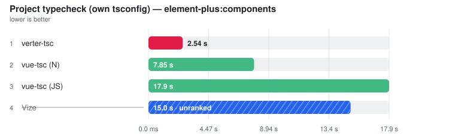
</picture>

| Tool | **Median** | vs fastest | Peak RSS |
| --- | ---: | ---: | ---: |
| [verter-tsc](https://github.com/pikax/verter) | **4.53 s** | 1.00x | 658.6 MB |
| [vue-tsc (N)](https://github.com/johnsoncodehk/typescript-native-bridge) | **13.45 s** | 2.97x | 2503.8 MB |
| [vue-tsc (JS)](https://github.com/vuejs/language-tools) | **29.66 s** | 6.55x | 1917.8 MB |
| [Vize](https://github.com/ubugeeei-prod/vize) | **46.24 s** | 10.21x | 5443.3 MB |

> Errors, skips and per-row notes: [full results](real-world/element-plus.md).

## hoppscotch

> 📄 Full report: [real-world/hoppscotch.md](real-world/hoppscotch.md)

### Project test suite — hoppscotch:common

<picture>
  <source media="(prefers-color-scheme: dark)" srcset="charts/real-world-hoppscotch-project-test-dark.svg">
  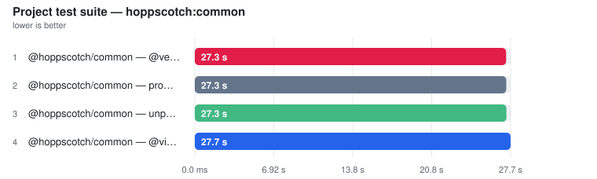
</picture>

| Tool | **Median** | vs fastest | Peak RSS |
| --- | ---: | ---: | ---: |
| [@hoppscotch/common — @verter/unplugin](https://github.com/pikax/verter) | **25.96 s** | 1.00x | 716.2 MB |
| @hoppscotch/common — project's own toolchain (baseline) | **25.99 s** | 1.00x | 698.7 MB |
| @hoppscotch/common — unplugin-vue | **26.59 s** | 1.02x | 724.2 MB |
| [@hoppscotch/common — @vizejs/vite-plugin](https://github.com/ubugeeei-prod/vize) | **26.60 s** | 1.02x | 742.8 MB |

> Errors, skips and per-row notes: [full results](real-world/hoppscotch.md).

### Project build (own config) — hoppscotch:common

<picture>
  <source media="(prefers-color-scheme: dark)" srcset="charts/real-world-hoppscotch-project-build-dark.svg">
  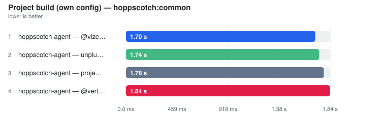
</picture>

| Tool | **Median** | vs fastest | Peak RSS |
| --- | ---: | ---: | ---: |
| [hoppscotch-agent — @vizejs/vite-plugin](https://github.com/ubugeeei-prod/vize) | **1.58 s** | 1.00x | 453.4 MB |
| hoppscotch-agent — unplugin-vue | **1.68 s** | 1.06x | 427.9 MB |
| hoppscotch-agent — project's own toolchain (baseline) | **1.72 s** | 1.09x | 437.7 MB |
| [hoppscotch-agent — @verter/unplugin](https://github.com/pikax/verter) | **1.77 s** | 1.12x | 457.0 MB |

> Errors, skips and per-row notes: [full results](real-world/hoppscotch.md).

### Project typecheck (own tsconfig) — hoppscotch:common

<picture>
  <source media="(prefers-color-scheme: dark)" srcset="charts/real-world-hoppscotch-project-typecheck-dark.svg">
  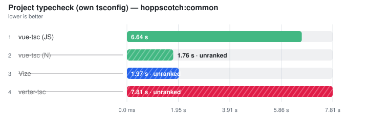
</picture>

| Tool | **Median** | vs fastest | Peak RSS |
| --- | ---: | ---: | ---: |
| [vue-tsc (JS)](https://github.com/vuejs/language-tools) | **6.37 s** | 1.00x | 628.7 MB |
| [vue-tsc (N)](https://github.com/johnsoncodehk/typescript-native-bridge) ⚠ | (1.75 s) | not ranked | (464.7 MB) |
| [verter-tsc](https://github.com/pikax/verter) ⚠ | (1.62 s) | not ranked | (348.3 MB) |
| [Vize](https://github.com/ubugeeei-prod/vize) ⚠ | (3.22 s) | not ranked | (494.0 MB) |

> ⚠ rows failed a validation gate (time bracketed, unranked); errors, skips and per-row notes: [full results](real-world/hoppscotch.md).

## naive-ui

> 📄 Full report: [real-world/naive-ui.md](real-world/naive-ui.md)

### Project test suite — naive-ui:demos

<picture>
  <source media="(prefers-color-scheme: dark)" srcset="charts/real-world-naive-ui-project-test-dark.svg">
  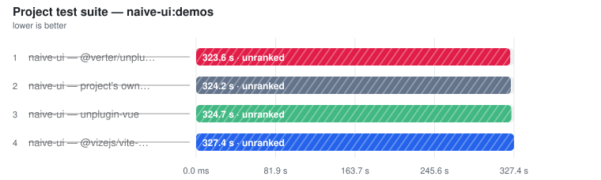
</picture>

| Tool | **Median** | vs fastest | Peak RSS |
| --- | ---: | ---: | ---: |
| naive-ui — project's own toolchain (baseline) ⚠ | (318.93 s) | not ranked | (1634.3 MB) |
| naive-ui — unplugin-vue ⚠ | (319.41 s) | not ranked | (1694.0 MB) |
| [naive-ui — @vizejs/vite-plugin](https://github.com/ubugeeei-prod/vize) ⚠ | (322.11 s) | not ranked | (1649.2 MB) |
| [naive-ui — @verter/unplugin](https://github.com/pikax/verter) ⚠ | (318.80 s) | not ranked | (1633.4 MB) |

> ⚠ rows failed a validation gate (time bracketed, unranked); errors, skips and per-row notes: [full results](real-world/naive-ui.md).

### Project typecheck (own tsconfig) — naive-ui:demos

<picture>
  <source media="(prefers-color-scheme: dark)" srcset="charts/real-world-naive-ui-project-typecheck-dark.svg">
  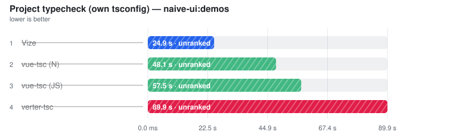
</picture>

| Tool | **Median** | vs fastest | Peak RSS |
| --- | ---: | ---: | ---: |
| [vue-tsc (JS)](https://github.com/vuejs/language-tools) ⚠ | (50.98 s) | not ranked | (2514.9 MB) |
| [vue-tsc (N)](https://github.com/johnsoncodehk/typescript-native-bridge) ⚠ | (44.85 s) | not ranked | (2991.9 MB) |
| [verter-tsc](https://github.com/pikax/verter) ⚠ | (11.37 s) | not ranked | (1359.3 MB) |
| [Vize](https://github.com/ubugeeei-prod/vize) ⚠ | (20.08 s) | not ranked | (3295.9 MB) |

> ⚠ rows failed a validation gate (time bracketed, unranked); errors, skips and per-row notes: [full results](real-world/naive-ui.md).

## nuxt-ui

> 📄 Full report: [real-world/nuxt-ui.md](real-world/nuxt-ui.md)

### Project typecheck (own tsconfig) — nuxt-ui:runtime

<picture>
  <source media="(prefers-color-scheme: dark)" srcset="charts/real-world-nuxt-ui-project-typecheck-dark.svg">
  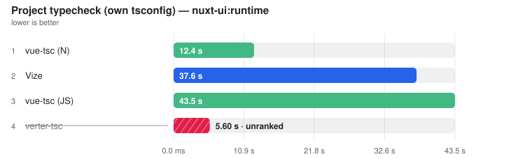
</picture>

| Tool | **Median** | vs fastest | Peak RSS |
| --- | ---: | ---: | ---: |
| [vue-tsc (N)](https://github.com/johnsoncodehk/typescript-native-bridge) | **12.45 s** | 1.00x | 4194.8 MB |
| [Vize](https://github.com/ubugeeei-prod/vize) | **37.56 s** | 3.02x | 4552.3 MB |
| [vue-tsc (JS)](https://github.com/vuejs/language-tools) | **43.50 s** | 3.50x | 3337.4 MB |
| [verter-tsc](https://github.com/pikax/verter) ⚠ | (5.60 s) | not ranked | (944.0 MB) |

> ⚠ rows failed a validation gate (time bracketed, unranked); errors, skips and per-row notes: [full results](real-world/nuxt-ui.md).

## primevue

> 📄 Full report: [real-world/primevue.md](real-world/primevue.md)

### Project test suite — primevue:components

<picture>
  <source media="(prefers-color-scheme: dark)" srcset="charts/real-world-primevue-project-test-dark.svg">
  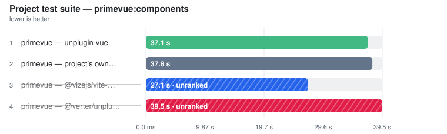
</picture>

| Tool | **Median** | vs fastest | Peak RSS |
| --- | ---: | ---: | ---: |
| primevue — project's own toolchain (baseline) | **41.06 s** | 1.00x | 891.3 MB |
| primevue — unplugin-vue | **41.47 s** | 1.01x | 791.3 MB |
| [primevue — @vizejs/vite-plugin](https://github.com/ubugeeei-prod/vize) ⚠ | (30.93 s) | not ranked | (459.8 MB) |
| [primevue — @verter/unplugin](https://github.com/pikax/verter) ⚠ | (38.23 s) | not ranked | (570.1 MB) |

> ⚠ rows failed a validation gate (time bracketed, unranked); errors, skips and per-row notes: [full results](real-world/primevue.md).

### Project typecheck (own tsconfig) — primevue:components

<picture>
  <source media="(prefers-color-scheme: dark)" srcset="charts/real-world-primevue-project-typecheck-dark.svg">
  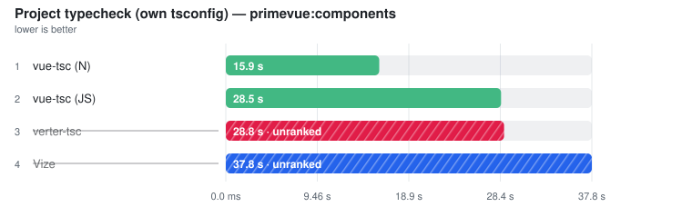
</picture>

| Tool | **Median** | vs fastest | Peak RSS |
| --- | ---: | ---: | ---: |
| [vue-tsc (N)](https://github.com/johnsoncodehk/typescript-native-bridge) | **16.10 s** | 1.00x | 3554.8 MB |
| [vue-tsc (JS)](https://github.com/vuejs/language-tools) | **29.89 s** | 1.86x | 2521.7 MB |
| [verter-tsc](https://github.com/pikax/verter) ⚠ | (3.30 s) | not ranked | (420.5 MB) |
| [Vize](https://github.com/ubugeeei-prod/vize) ⚠ | (43.30 s) | not ranked | (4882.5 MB) |

> ⚠ rows failed a validation gate (time bracketed, unranked); errors, skips and per-row notes: [full results](real-world/primevue.md).

## quasar

> 📄 Full report: [real-world/quasar.md](real-world/quasar.md)

### Project test suite — quasar:playground

<picture>
  <source media="(prefers-color-scheme: dark)" srcset="charts/real-world-quasar-project-test-dark.svg">
  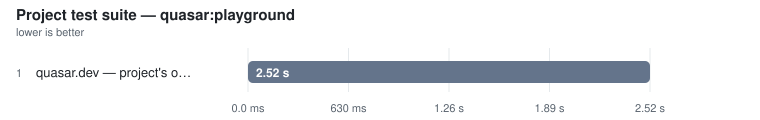
</picture>

| Tool | **Median** | vs fastest | Peak RSS |
| --- | ---: | ---: | ---: |
| quasar.dev — project's own toolchain (baseline) | **4.29 s** | 1.00x | 457.2 MB |

> Errors, skips and per-row notes: [full results](real-world/quasar.md).

### Project typecheck (own tsconfig) — quasar:playground

<picture>
  <source media="(prefers-color-scheme: dark)" srcset="charts/real-world-quasar-project-typecheck-dark.svg">
  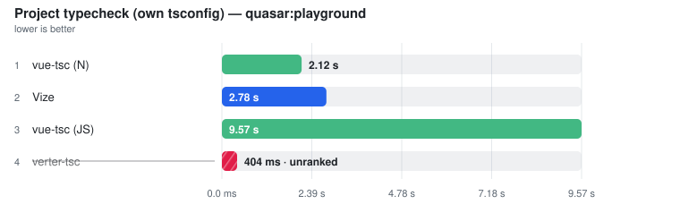
</picture>

| Tool | **Median** | vs fastest | Peak RSS |
| --- | ---: | ---: | ---: |
| [vue-tsc (N)](https://github.com/johnsoncodehk/typescript-native-bridge) | **2.21 s** | 1.00x | 714.4 MB |
| [Vize](https://github.com/ubugeeei-prod/vize) | **3.02 s** | 1.36x | 395.3 MB |
| [vue-tsc (JS)](https://github.com/vuejs/language-tools) | **10.19 s** | 4.60x | 505.5 MB |
| [verter-tsc](https://github.com/pikax/verter) ⚠ | (409.0 ms) | not ranked | (137.4 MB) |

> ⚠ rows failed a validation gate (time bracketed, unranked); errors, skips and per-row notes: [full results](real-world/quasar.md).

## vue-vben-admin

> 📄 Full report: [real-world/vue-vben-admin.md](real-world/vue-vben-admin.md)

### Project test suite — vue-vben-admin:core-ui

<picture>
  <source media="(prefers-color-scheme: dark)" srcset="charts/real-world-vue-vben-admin-project-test-dark.svg">
  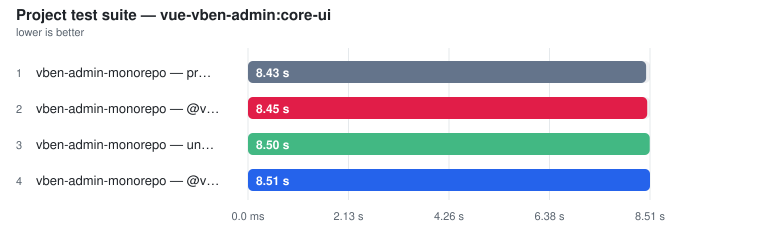
</picture>

| Tool | **Median** | vs fastest | Peak RSS |
| --- | ---: | ---: | ---: |
| vben-admin-monorepo — project's own toolchain (baseline) | **10.75 s** | 1.00x | 732.2 MB |
| [vben-admin-monorepo — @verter/unplugin](https://github.com/pikax/verter) | **10.92 s** | 1.02x | 741.3 MB |
| vben-admin-monorepo — unplugin-vue | **10.96 s** | 1.02x | 755.2 MB |
| [vben-admin-monorepo — @vizejs/vite-plugin](https://github.com/ubugeeei-prod/vize) | **40.66 s** | 3.78x | 6986.7 MB |

> Errors, skips and per-row notes: [full results](real-world/vue-vben-admin.md).

### Project typecheck (own tsconfig) — vue-vben-admin:core-ui

<picture>
  <source media="(prefers-color-scheme: dark)" srcset="charts/real-world-vue-vben-admin-project-typecheck-dark.svg">
  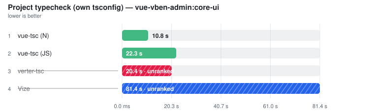
</picture>

| Tool | **Median** | vs fastest | Peak RSS |
| --- | ---: | ---: | ---: |
| [vue-tsc (N)](https://github.com/johnsoncodehk/typescript-native-bridge) | **10.10 s** | 1.00x | 2694.7 MB |
| [vue-tsc (JS)](https://github.com/vuejs/language-tools) | **20.94 s** | 2.07x | 1664.0 MB |
| [verter-tsc](https://github.com/pikax/verter) ⚠ | (3.68 s) | not ranked | (719.6 MB) |
| [Vize](https://github.com/ubugeeei-prod/vize) ⚠ | (82.93 s) | not ranked | (2940.2 MB) |

> ⚠ rows failed a validation gate (time bracketed, unranked); errors, skips and per-row notes: [full results](real-world/vue-vben-admin.md).

## vuetify

> 📄 Full report: [real-world/vuetify.md](real-world/vuetify.md)

### Project test suite — vuetify:docs

<picture>
  <source media="(prefers-color-scheme: dark)" srcset="charts/real-world-vuetify-project-test-dark.svg">
  
</picture>

| Tool | **Median** | vs fastest | Peak RSS |
| --- | ---: | ---: | ---: |
| vuetify — unplugin-vue | **46.56 s** | 1.00x | 1108.7 MB |
| vuetify — project's own toolchain (baseline) | **46.72 s** | 1.00x | 1069.0 MB |
| [vuetify — @verter/unplugin](https://github.com/pikax/verter) | **47.17 s** | 1.01x | 1000.4 MB |
| [vuetify — @vizejs/vite-plugin](https://github.com/ubugeeei-prod/vize) | **47.44 s** | 1.02x | 1057.1 MB |

> Errors, skips and per-row notes: [full results](real-world/vuetify.md).

### Project typecheck (own tsconfig) — vuetify:docs

<picture>
  <source media="(prefers-color-scheme: dark)" srcset="charts/real-world-vuetify-project-typecheck-dark.svg">
  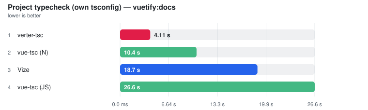
</picture>

| Tool | **Median** | vs fastest | Peak RSS |
| --- | ---: | ---: | ---: |
| [verter-tsc](https://github.com/pikax/verter) | **5.10 s** | 1.00x | 774.9 MB |
| [vue-tsc (N)](https://github.com/johnsoncodehk/typescript-native-bridge) | **13.04 s** | 2.56x | 2450.1 MB |
| [Vize](https://github.com/ubugeeei-prod/vize) | **16.54 s** | 3.24x | 2737.9 MB |
| [vue-tsc (JS)](https://github.com/vuejs/language-tools) | **33.85 s** | 6.63x | 1991.1 MB |

> Errors, skips and per-row notes: [full results](real-world/vuetify.md).
