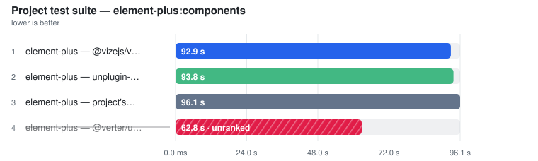
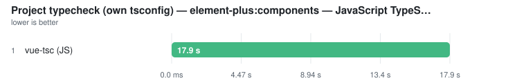
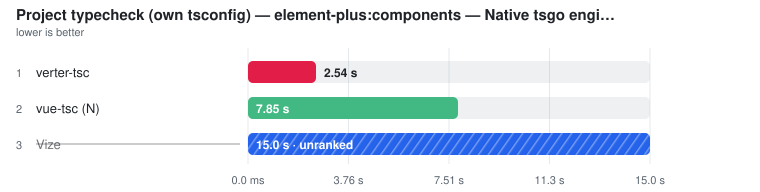

# Real-world: element-plus

> Auto-generated from the JSON snapshots in [`results/benchmarks/`](../../results/benchmarks/) and [`results/real_world/`](../../results/real_world/) by `pnpm docs`. Do not edit by hand.

**element-plus:components** — [`element-plus/element-plus`](https://github.com/element-plus/element-plus) 2.14.3 @ `7a7bcfb66b` · 162 files

- **Generated:** 2026-08-27T10:52:11.309Z
- **Fixture:** `fixtures/real` (162 files)
- **Runs / warmups:** 5 / 1
- **Runner:** Linux · linux/x64 · 4 CPUs · AMD EPYC 7763 64-Core Processor · 15.6 GB · Node v22.23.2
- **Commit:** [`abafafd`](https://github.com/pikax/vue-benchmarks/commit/abafafd07c14f26c07f1d0ed9da818102fdc97e1)
- **CI run:** https://github.com/pikax/vue-benchmarks/actions/runs/33062222081

Ranked on the **median of measured runs**. Warm series follow ≥1 discarded warmup and are the primary ordering and ranking metric wherever both series exist. Compiler and Component-meta additionally publish a separately sampled **Fresh child** column: the first timed row workload in a new child process, after excluded process startup and package imports. It is not called Cold and its ratio/noise gate never substitutes for Warm. What else the child excludes differs by surface and each surface states it in its own methodology — Compiler builds its compiler host outside the timer, Component-meta builds its checker/session inside it, because its warm timer does too. Every table sorts fastest-first and every ratio column is **vs fastest** — the fastest ranked row is the 1.00x denominator; no tool is pinned as a reference. One table per surface unless that surface declares explicit work-equivalence classes; engine, invocation and threading are row properties, not implicit table splits — rows tagged **(JS)** run the JavaScript TypeScript compiler (a cross-engine ratio measures TypeScript's rewrite as much as the tool), and a row's label/notes say whether it is a CLI (pays process startup every run), an in-process API, single-threaded or a thread pool. Name markers: ⚠ failed validation (time bracketed, unranked) · ❌ error · ⏭ skipped. A row above CV 50% with at least three warm samples is bracketed as TOO NOISY TO RANK, no tool exempted (a two-run spread has no third sample to adjudicate, so it is flagged, not bracketed). Per-row detail is under **Notes** below each table.

> Corpora are pinned checkouts of third-party open-source Vue projects; sources are unmodified and every page names its ref and resolved commit SHA.
> **Rank within a corpus, never across it.** The corpora differ in size and in kind — library source, application source and documentation demos are not the same code.
> **⚠ unranked** is a gate, not a verdict on the official toolchain. A project shipping **no lockfile** at the pinned ref cannot be installed frozen, so every row on that corpus is unranked equally — including vue-tsc.

### Compiler

Files: **162** · Bytes: **765,295**

> **Did not run — excluded from every table below.**
>
> These tools produced no measurement on this corpus, so they have no row: a ranking table is for things that were ranked. This is a harder failure than any bracketed row, not a softer one.
>
> - **fervid** (`@fervid/napi`) — aborted the benchmark process: killed by signal SIGABRT while compiling /home/runner/work/vue-benchmarks/vue-benchmarks/fixtures/real/element-plus/packages/components/countdown/src/countdown.vue — thread '&lt;unnamed>' panicked at crates/fervid_codegen/src/components/mod.rs:463:13:
>   fervid is a Rust compiler behind NAPI and signals unimplemented constructs with a panic. A panic on a NAPI thread cannot be caught from JavaScript — it aborts the host process — so fervid is probed in a child process and never loaded in-process for a corpus it cannot survive. This is a genuine tool finding on this corpus, not a harness gap.

**Vue-anchored apples-to-apples compiler results.** Each target/environment/source-map cell contains two candidate-comparison subsections: Raw SFC compilation gives Vue, Vize batch and Verter first-admission the same revised style-free SFC strings; SFC compilation with CSS gives the style-capable entrypoints the same revised style-bearing SFCs and counts both generated JS and CSS. Every measured row publishes Fresh child and Warm separately when both samplers succeed. Ratios never cross these subsections and always use the official Vue workload as 1.00x. A failed semantic gate leaves both measured times visible but unranked.

#### VDOM · production · sourcemap off

Target: `vdom` · Environment: `production` · Source map: `off`

##### Official render pipeline — parse + script + template

| Tool | Fresh child | Fresh min | Fresh stddev | Fresh CV% | vs fastest fresh child | **Warm (primary)** | Warm min | Warm stddev | Warm CV% | vs fastest warm | Code bytes | Throughput |
| --- | ---: | ---: | ---: | ---: | ---: | ---: | ---: | ---: | ---: | ---: | ---: | ---: |
| @vue/compiler-sfc 3.5 (1T) | 1.67 s | 1.65 s | 24.0 ms | 1.4% | 1.00x | **418.1 ms** | 403.2 ms | 11.4 ms | 2.7% | 1.00x | 1,241,345 | 387 files/s |
| @vue/compiler-sfc 3.6 (1T) | 2.18 s | 2.16 s | 20.2 ms | 0.9% | 1.30x | **615.3 ms** | 591.5 ms | 28.0 ms | 4.5% | 1.47x | 1,241,345 | 263 files/s |

Notes

- **@vue/compiler-sfc 3.5 (1T)**: Official 3.5 VDOM, isProd=true, sourceMap=false, single-threaded ✓ RUNTIME SEMANTIC VALIDITY: 31/31 independent observable-behaviour plants passed through parse → compileScript(inlineTemplate=false) → compileTemplate.
- **@vue/compiler-sfc 3.6 (1T)**: Official 3.6 VDOM, isProd=true, sourceMap=false ✓ RUNTIME SEMANTIC VALIDITY: 31/31 independent observable-behaviour plants passed through parse → compileScript(inlineTemplate=false) → compileTemplate.

##### Raw SFC compilation — identical changed inputs; no output-cache reuse

| Tool | Fresh child | Fresh min | Fresh stddev | Fresh CV% | vs fastest fresh child | **Warm (primary)** | Warm min | Warm stddev | Warm CV% | vs fastest warm | Generated JS bytes | Throughput |
| --- | ---: | ---: | ---: | ---: | ---: | ---: | ---: | ---: | ---: | ---: | ---: | ---: |
| Vue compiler-sfc 3.5 reference (raw render, 1T) | 1.68 s | 1.64 s | 16.4 ms | 1.0% | 1.00x | **410.2 ms** | 390.8 ms | 48.0 ms | 11.7% ⚠ | 1.00x | 1,241,183 | 395 files/s |
| Vize compileSfcBatchWithResults (raw render) ⚠ | (83.8 ms) | (83.2 ms) | (0.6 ms) | (0.8%) | not ranked | (52.8 ms) | (51.4 ms) | (3.5 ms) | (6.6%) | not ranked | (1,229,253) | – |
| Verter compileMany (first-admission stateless raw render) ⚠ | (1.37 s) | (742.8 ms) | (474.5 ms) | (34.6%) | not ranked | (1.29 s) | (904.8 ms) | (401.1 ms) | (31.0%) | not ranked | (976,947) | – |

Notes

- **Vue compiler-sfc 3.5 reference (raw render, 1T)**: REFERENCE BASELINE: official @vue/compiler-sfc parse + compileScript + compileTemplate, sourceMap=false, isProd=true. Receives the same style-free, per-pass-revised SFC strings as the native candidates. Every script/template block changes on every pass; input construction is outside the timer. Vue is the ratio denominator even when a candidate is faster. ✓ RUNTIME SEMANTIC VALIDITY: 31/31 independent observable-behaviour plants passed through parse → compileScript(inlineTemplate=false) → compileTemplate.
- **Vize compileSfcBatchWithResults (raw render) ⚠**: CANDIDATE VS VUE RAW BASELINE: compileSfcBatchWithResults vapor=false, isTs=true, templateHoistStatic=true, templateCacheHandlers=true, includeSourceMap=false; receives the exact same style-free, per-pass-revised strings as Vue and Verter. Every input body differs between passes, so a previous whole-output artifact cannot directly satisfy the call. Source inspection finds per-call parse/compile/codegen and no generated-output cache on this standalone entry point; the harness does not claim more granular internal reuse than it can observe. Warm samples reuse the process-global Rayon pool. A Fresh-child sample excludes package import, so it does not prove the pool, allocator, JIT or all native state began untouched. Ordinary allocator reuse is not instrumented and remains UNKNOWN. Input construction is outside the timer. ⚠ RUNTIME SEMANTIC VALIDITY FAIL (26/31 passed) — runtime-props-defaults-reactivity [runtime]: reactive props: expected "updated:7", got "fallback:2"; object-dynamic-bindings-events [runtime]: initial dynamic argument: expected "idle", got undefined; dynamic-event-name-handler-removal [runtime]: initial dynamic event: expected "1", got "0"; +2 more (all retained in JSON). Generated text is not compared; these are observable runtime/API outcomes. Full per-plant results are retained in validation.compileSemantics.
- **Verter compileMany (first-admission stateless raw render) ⚠**: CANDIDATE VS VUE RAW BASELINE: runtime-render forceVapor=false, isProduction=true, forceJs=false, sourceMap=false, hmr=none, requestedMode=stateless, analysis=full. Receives the exact same style-free, per-pass-revised strings as Vue and Vize. Each pass gets a fresh workspace-backed host/project, created outside the timer, so the timed compileMany call measures first source admission rather than incremental edits on a populated host. cacheHit must remain zero. Warm samples retain process/native-library state; Fresh-child samples exclude package import and host construction, so neither metric claims wholly untouched global state. No host-owned parsed or semantic state crosses passes. ⚠ FAILED CODEGEN VALIDITY GATE — 1/162 files compiled to output that is not parseable JavaScript/TypeScript (first: packages/components/select/src/select.vue: Unexpected token, expected "," (316:531)). Time is shown in brackets and excluded from ranking: a compiler that emits broken output for part of the corpus is not doing the same work as one that does not. The gate is re-run every benchmark, so a fixed release clears this automatically. ⚠ RUNTIME SEMANTIC VALIDITY FAIL (23/31 passed) — svg-namespace-reactivity [runtime]: reactive SVG attribute: expected "9", got "4"; dynamic-event-name-handler-removal [runtime]: initial dynamic event: expected "1", got "0"; template-refs-v-for-update [runtime]: itemElements.value.map is not a function; +5 more (all retained in JSON). Generated text is not compared; these are observable runtime/API outcomes. Full per-plant results are retained in validation.compileSemantics.

##### SFC compilation with CSS — script, template and style changed

| Tool | Fresh child | Fresh min | Fresh stddev | Fresh CV% | vs fastest fresh child | **Warm (primary)** | Warm min | Warm stddev | Warm CV% | vs fastest warm | Generated JS + CSS bytes | Throughput |
| --- | ---: | ---: | ---: | ---: | ---: | ---: | ---: | ---: | ---: | ---: | ---: | ---: |
| Vue compiler-sfc 3.5 reference (render + CSS, 1T) ❌ | error | – | – | – | – | – | – | – | – | – | – | – |
| Vize compileSfc loop (full SFC, 1T) ❌ | error | – | – | – | – | – | – | – | – | – | – | – |
| Vize compileSfcBatchWithResults (render + CSS, Rayon batch) ⚠ | (83.2 ms) | (82.4 ms) | (1.0 ms) | (1.2%) | not ranked | (52.9 ms) | (51.3 ms) | (1.8 ms) | (3.4%) | not ranked | (1,229,577) | – |
| Verter compileMany + processStyle (render + CSS) ❌ | error | – | – | – | – | – | – | – | – | – | – | – |

Notes

- **Vue compiler-sfc 3.5 reference (render + CSS, 1T) ❌**: Vue style reference emitted insufficient JS/CSS
- **Vize compileSfc loop (full SFC, 1T) ❌**: vize compile returned empty JS/CSS for corpus
- **Vize compileSfcBatchWithResults (render + CSS, Rayon batch) ⚠**: CANDIDATE VS VUE STYLE BASELINE: compileSfcBatchWithResults vapor=false, isTs=true, templateHoistStatic=true, templateCacheHandlers=true, includeSourceMap=false; receives the same per-pass-revised full SFCs and emits JS plus compiled CSS. Script, template and CSS all change every pass, so a prior generated output cannot satisfy this call. Warm samples reuse the process-global Rayon pool; a Fresh-child sample may still inherit native/thread/allocator effects from the excluded package import and adapter setup. Input objects are built outside the timer. The installed binding's production/development response is capability-probed before ranking. ⚠ FAILED STYLE CORRECTNESS GATE — [slotted] slotted: slotted target must receive the [data-v-…-s] attribute selector; [global-mixed-local] global-mixed-local: local selector fragments or a scope constraint leaked into Vue's global selector; [slotted-compound] slotted-compound: the slotted scope attribute was not attached to the final compound target; [scoped-keyframes] scoped-keyframes: scoped keyframe name was not rewritten; [v-bind-quoted] v-bind-quoted: margin-left was not rewritten to a CSS variable. All 16 independent CSS semantics plants are mandatory; measured but UNRANKED. ⚠ RUNTIME SEMANTIC VALIDITY FAIL (26/31 passed) — runtime-props-defaults-reactivity [runtime]: reactive props: expected "updated:7", got "fallback:2"; object-dynamic-bindings-events [runtime]: initial dynamic argument: expected "idle", got undefined; dynamic-event-name-handler-removal [runtime]: initial dynamic event: expected "1", got "0"; +2 more (all retained in JSON). Generated text is not compared; these are observable runtime/API outcomes. Full per-plant results are retained in validation.compileSemantics. ⚠ COMPARISON REFERENCE INVALID: the Vue reference in this work-equivalence class did not clear mandatory validation, so no candidate ratio in the class may rank.
- **Verter compileMany + processStyle (render + CSS) ❌**: verter style path emitted insufficient JS/CSS

Raw runs

- **@vue/compiler-sfc 3.5 (1T)**: Fresh child (first timed row workload): 1.67 s, 1.71 s, 1.67 s, 1.65 s, 1.69 s · Warm: 434.2 ms, 422.5 ms, 413.5 ms, 403.2 ms, 418.1 ms
- **@vue/compiler-sfc 3.6 (1T)**: Fresh child (first timed row workload): 2.20 s, 2.20 s, 2.18 s, 2.17 s, 2.16 s · Warm: 656.5 ms, 615.3 ms, 591.5 ms, 653.4 ms, 614.0 ms
- **Vue compiler-sfc 3.5 reference (raw render, 1T)**: Fresh child (first timed row workload): 1.64 s, 1.69 s, 1.68 s, 1.68 s, 1.67 s · Warm: 511.7 ms, 390.8 ms, 405.0 ms, 410.2 ms, 426.1 ms
- **Vize compileSfcBatchWithResults (raw render)**: Fresh child (first timed row workload): 83.4 ms, 83.8 ms, 84.9 ms, 83.8 ms, 83.2 ms · Warm: 51.4 ms, 53.9 ms, 52.8 ms, 60.0 ms, 52.0 ms
- **Verter compileMany (first-admission stateless raw render)**: Fresh child (first timed row workload): 1.37 s, 2.01 s, 1.73 s, 742.8 ms, 1.37 s · Warm: 904.8 ms, 1.53 s, 1.99 s, 1.29 s, 1.27 s
- **Vize compileSfcBatchWithResults (render + CSS, Rayon batch)**: Fresh child (first timed row workload): 84.6 ms, 82.7 ms, 84.4 ms, 82.4 ms, 83.2 ms · Warm: 51.3 ms, 53.0 ms, 56.2 ms, 52.8 ms, 52.9 ms

Methodology

- Matrix: target ∈ {vdom, vapor} × env ∈ {production, development} × sourceMap ∈ {off, on}. Cells are independent — do not cross-compare cells.
- Corpus mode=unique: 162/162 unique content SHAs. The exact compileSfcBatchWithResults path measured here does not have Vize's stats-only batch API's duplicate-body grouping, so duplicate bodies are disclosed for corpus representativeness rather than described as output-cache hits.
- Ratio columns are vs fastest — the fastest ranked row in each comparison class is the 1.00x denominator; no tool is pinned as a reference. The official Vue workload competes on the same terms and its row is labelled: Vue 3.5 provides the VDOM workload; Vue 3.6 the Vapor one because 3.5 has no Vapor backend.
- Rows are split into explicit work-equivalence classes and ratios never cross those boundaries: official Vue-version context; Raw SFC compilation; and SFC compilation with CSS. The old unmatched Verter retained-host re-render row is not in the ranked surface; it remains available through diagnose:compile-warmth.
- The RAW RENDER class compares Vue, Vize and Verter on byte-identical, intentionally style-free SFC strings. &lt;style> blocks are removed from ALL three outside the timer by the class definition. This class measures SFC parse + script/template parse and analysis + render codegen, not CSS.
- Every raw-class cell/pass injects a distinct fixed-width semantically neutral comment into every present script and template block. This prevents Vue cross-cell source-cache contamination and previous whole-output reuse; all candidates in a cell receive the exact same revised strings. Revision and input-object construction happen outside the timer.
- Official Vue-version context rows use a separate fixed-width source namespace from the candidate raw class. This prevents the context row and Vue candidate baseline from lending each other same-compiler parse/template cache entries while preserving byte-identical Vue/Vize/Verter inputs inside the candidate class.
- The ranked raw Verter row creates a fresh workspace-backed host/project outside every timed pass, then measures first source admission through compileMany. requestedMode=stateless is explicit and cacheHit is asserted zero. Process/native-library state may remain warm, but no populated-host parsed, semantic, dependency-graph or output state crosses timed passes.
- The SFC RENDER + CSS class changes every present script, template and style block on every pass. Vue runs its official composed compiler-sfc pipeline (parse + compileScript + compileTemplate + compileStyle); Vize runs compileSfc/compileSfcBatchWithResults; Verter runs compileMany runtime-render plus one processStyle call per block. Generated JS and CSS bytes are both counted.
- TIMED STYLE CORPUS CENSUS: 0/162 files contain 0 style block(s): scoped=0, CSS Modules=0, v-bind=0, preprocessors=0, external src=0. The direct three-tool comparison currently requires inline plain CSS; the report never claims timed feature coverage absent from these counts.
- STYLE CORRECTNESS GATE (untimed, mandatory for style ranking): suite 2026-08-20.1 (0878259fbadc) runs 16 independent plants covering ordinary and compound scoped selectors; :deep(), :slotted(), :global(), :is() and :where() semantics; selectors nested in @media/@supports; scoped keyframe declaration/reference consistency; multiple and quoted v-bind() expression linkage; and CSS Modules mapping. Checks assert semantic relationships, never whole generated-CSS equality. Vize compileSfc and one real multi-input compileSfcBatchWithResults call have separate verdicts; Verter uses one fresh-host multi-input compileMany followed by serial processStyle; fervid sync and async are checked separately. Any failure is measured but UNRANKED and self-clears after a fixed upgrade. Plants execute after timing so they cannot pre-warm measured entrypoints; manifest metadata is retained in validation.styleCorrectnessManifest.
- SASS/SCSS CAPABILITY AUDIT (untimed, diagnostic): suite 2026-08-20.2 (e302bbad5972) runs 8 independent lang=scss/lang=sass plants for variables, mixins/nesting, scoped selectors, :deep() inside @media, v-bind linkage and CSS Modules. validation.stylePreprocessors keeps two non-interchangeable verdicts: exactEntrypoints says whether the measured compiler API directly accepts authored Sass and orchestrates the separately installed preprocessor in that call; sharedSassAdapter first runs the pinned sass dependency once per plant and then tests only each compiler's downstream Vue-style transform. Harness preprocessing can never turn an unsupported exact API into PASS. These diagnostic plants do not gate the separately defined timed inline-plain-CSS class.
- RUNTIME SEMANTIC GATE (untimed, mandatory): suite 2026-08-20.2 runs 31 independent valid-SFC plants against observable DOM/events/updates/public-instance behaviour, never generated-text equality. It certifies Vue's composed non-inline API, Vize single and real multi-input batch, fresh-host stateless multi-input Verter compileMany, and fervid sync/async separately with the exact target/env/map flags. Each API runs in an isolated child after all timings; every outcome and the manifest hash are retained in validation.compileSemantics. FAIL, crash, timeout, missing verdict and UNKNOWN are measured but UNRANKED. Vapor output is executed with Vue's pinned, version-matched 3.6 compiler/runtime and shipped createVaporApp path; each Vapor entrypoint receives its own PASS/FAIL verdict, while unsupported backends remain UNKNOWN individually. VDOM evidence is never borrowed.
- Scheduling is not disguised as equal: Vue's reference and Vize compileSfc loop are 1T; Vize's with-results API compiles inside the process-global Rayon pool; Verter compileMany uses its host pool but public processStyle is synchronous and is called serially; fervid async uses libuv. Each row says so.
- Imported-type resolution is PROVISIONED for every tool that accepts a provision: @vue/compiler-sfc gets an fs bridge (ts.sys semantics — fileExists is false for directories) AND a registered TypeScript module for non-relative sources, exactly as Vite's plugin-vue provides in real builds; Verter gets a workspace-backed host rooted at the project. Withholding either does not 'treat tools equally' — it uniquely disables the tools that resolve through the host and publishes the gap as their ❌.
- The TypeScript registered for @vue/compiler-sfc is THE HARNESS'S OWN (the declared JS arm), the same version for every corpus — not each project's pinned TS. Uniform resolution behaviour across corpora was chosen over per-project fidelity; the tsconfig consulted is still the project's own.
- ⚠ Imported-type resolution DEPTH differs by tool: @vue/compiler-sfc THROWS on an unresolvable prop type, Verter reports an error, Vize resolves what it can and silently emits a smaller runtime props object, and fervid emits NO props object at all while reporting a resolve diagnostic this harness otherwise tolerates. This is GATED for every compiler alike, not just disclosed: a baseline-anchored PROP-RESOLUTION CENSUS samples the corpus's type-only defineProps files, compares each compiler's emitted prop keys (Vize, fervid, Verter) with the prop names the baseline resolves, and unranks on any drop — fervid's missing props count as dropped when its own resolve diagnostic attributes them. Annotates instead when a compiler's emission shape cannot be read. Re-run every benchmark; self-clearing on a fixed release.
- VDOM = classic Virtual DOM render functions. Vapor = direct DOM codegen (Vue 3.6+ / native tool vapor flags).
- Source map is an INDEPENDENT dimension, requested from every compiler in a cell (Vue and Vize single-file: sourceMap; Vize batch: includeSourceMap; Verter: compileProfile.sourceMap/processStyle sourcemap; fervid: FervidJsCompilerOptions.sourceMap). Raw render requires a JS map. Style-inclusive rows emit two artifacts and therefore require both JS and CSS maps. Timed paths assert returned bytes whenever the installed capability exists. Current executable presence probe: Vize single JS=YES/CSS=NO, Vize batch JS=YES/CSS=NO, Verter runtime-render JS=NO/processStyle CSS=NO, fervid JS=YES/CSS=NO. Presence is not mapping correctness: all map-on timings remain UNRANKED until planted script/template/CSS positions are traced back to the correct input coordinates.
- TypeScript handling is ONE benchmark standard for the whole cell: PASSTHROUGH, requested identically from every compiler (Vue and fervid preserve annotations by their API behaviour; Vize via isTs:true; Verter via forceJs:false). The report describes the exact benchmark call rather than inferring behaviour from a separate Vite integration.
- Verter analysisLevel=full for every timed and validation call. The default benchmark setting is full; VERTER_ANALYSIS_LEVEL remains an explicit diagnostic override, and every Verter row prints the effective value so a tuned run cannot masquerade as the default. devMode follows the cell's isProduction value.
- Production vs development uses each tool's real semantic knobs: Vue isProd (hoistStatic + cacheHandlers); Vize templateHoistStatic + templateCacheHandlers; Verter isProduction + hmrStrategy; fervid isProduction.
- VIZE MODE CAPABILITY AUDIT (untimed): VDOM compileSfc=YES, VDOM compileSfcBatchWithResults=YES; Vapor compileSfc output changes=NO, Vapor batch output changes=NO. "NO" for the Vapor observation is not itself a failure: the current Vapor backend does not use these VDOM transforms. A VDOM row whose options stop affecting output is automatically unranked.
- VERTER API CAPABILITY AUDIT (untimed): runtime-render emits compiled CSS=NO. The style adapter composes runtime-render + processStyle only while runtime-render returns no CSS; if an upgrade starts emitting CSS, that row is automatically unranked pending adapter revalidation so CSS cannot be charged twice.
- fervid and Vize's full-SFC APIs, Vue's composed compiler-sfc reference, and Verter's composed render+processStyle path are classified in the style-inclusive class because each timed row emits both JS and CSS. API composition and scheduling differences remain explicit row properties.
- fervid may emit the non-fatal HTML-strictness diagnostic NonVoidHtmlElementStartTagWithTrailingSolidus on self-closing non-void tags accepted by Vue. Only that complete diagnostic code is tolerated, and only with generated output; every other fervid diagnostic fails the timed row. The exact tolerated count is captured from each run.
- fervid and Vue 3.5 have no Vapor path → skipped for vapor cells (not run as VDOM).
- fervid's compileAsync row fans out over libuv's threadpool (UV_THREADPOOL_SIZE=4), which is a fixed default of 4 rather than core count. It is reported, not tuned.
- Threading remains a row property inside a work-equivalence class. It never changes the reference: Vue stays the denominator even where a native batch is faster.
- Codegen validity gate: every compiler's output is parsed (TypeScript plugin enabled, since several rows legitimately emit TS) before any timing. A tool that emits unparseable output for part of the corpus is measured but UNRANKED — bytes-per-millisecond is not a result if the bytes do not parse. Applied to every compiler in the table, re-run each benchmark, and self-clearing on a fixed release.
- The gate runs ONCE PER (target × environment) cell, with that cell's flags. It previously ran once on vdom/production and stamped the verdict onto the Vapor and development cells it had never exercised — Vapor is a different codegen backend and development mode emits different code, so a pass on one is not evidence about the other. Source maps are not a gate dimension: a map is emitted beside the code and cannot change whether the code parses.
- The gate builds each tool's compiler handle inside its own try, so a constructor that throws cannot destroy every row for the corpus. Missing or unmeasured mandatory validity is UNKNOWN and unranked.
- @vue/compiler-sfc, Vize and Verter are held to ONE error policy in the timed path: any non-empty top-level or per-file `errors` array fails the measure. fervid's sole exception is the exact NonVoidHtmlElementStartTagWithTrailingSolidus diagnostic code when code was still generated; all other diagnostics fail.
- Tool order uses a paired forward/reverse schedule for fresh-child samples, discarded warmups and measured warm runs. A complete pair balances row positions even when the requested run count is smaller than the number of rows; the executed order is retained in JSON.
- FRESH CHILD is the median first timed row workload across new child processes, one child per row and sample. Among benchmarked compiler packages, each child loads only the selected row's; shared harness dependencies are still imported. Child startup, package import, shared-input materialisation and Verter host/workspace construction are outside the timer. Imports and setup may already change V8/native/thread/allocator state; the OS page/filesystem caches are not flushed. It is therefore not a Cold metric and Fresh-child minus Warm must not be interpreted as pure initialization overhead. WARM is the primary ranking: the median shared-benchmark-process series after >= 1 discarded pass. Both series have independent distribution/noise statistics and separate Vue ratios.

### Format

Files: **162** · Bytes: **765,295**

Tools:

- **Prettier** — prettier --write over a fresh corpus copy; built-in Vue SFC support, single-threaded by design.
- **Oxfmt** — oxfmt --write — Oxc's Vue-capable formatter, multi-threaded.
- **Vize** — vize fmt --write.
- **Biome format** — biome format --write — multi-threaded; the exact pinned row rewrites none of the planted .vue corpus and is unranked on the full-SFC format surface.

| Tool | **Median (primary)** | Min | Stddev | CV% | vs fastest | Artifact | Throughput |
| --- | ---: | ---: | ---: | ---: | ---: | ---: | ---: |
| Vize | **135.3 ms** | 130.4 ms | 2.5 ms | 1.9% | 1.00x | n/a | 1.2k files/s |
| Oxfmt | **3.22 s** | 3.16 s | 49.5 ms | 1.5% | 23.83x | n/a | 50 files/s |
| Prettier | **5.18 s** | 5.02 s | 114.6 ms | 2.2% | 38.30x | n/a | 31 files/s |
| Biome format ⚠ | (171.8 ms) | (169.9 ms) | – | – | not ranked | – | – |

Notes

- **Vize**: vize fmt --write (fresh copy each run) · does not report thread usage — not assumed single-threaded | ⓘ file coverage verified: rewrote 162/162 planted corpus files. | ✓ format validity 3/3: parseable, descriptor/template/script semantics preserved and exact invocation idempotent.
- **Oxfmt**: oxfmt --write (fresh copy each run) · pinned 0.65.0 routes a full .vue file through its bundled Prettier formatFile callback in worker threads; the native binding orchestrates the call, but Vue parsing/printing is the bundled Prettier path. Re-audit this package path after upgrades. | ⓘ file coverage verified: rewrote 162/162 planted corpus files. | ✓ format validity 3/3: parseable, descriptor/template/script semantics preserved and exact invocation idempotent.
- **Prettier**: prettier --write **/*.vue (fresh copy each run) · single-threaded by design | ⓘ file coverage verified: rewrote 162/162 planted corpus files. | ✓ format validity 3/3: parseable, descriptor/template/script semantics preserved and exact invocation idempotent.
- **Biome format ⚠**: biome format --write . (fresh copy each run) · multi-threaded (Rayon; honours RAYON_NUM_THREADS) · exact pinned row currently rewrites none of the planted .vue corpus | ⚠ FAILED FILE-COVERAGE GATE — rewrote 0 of 162 planted corpus files. A tool covering fewer files finishes sooner; that is a different job, not a faster one. Measured but UNRANKED. | ⚠ FORMAT SEMANTIC VALIDITY FAIL — template-behaviour: messy template block was not rewritten; descriptor-attributes: messy template block was not rewritten. Full per-plant evidence is retained in validation.formatSemantics.

Methodology

- Each invocation receives a fresh copy of the same Vue SFC corpus (formatters rewrite files).
- Prettier is the explicit established-reference denominator for the full-Vue-SFC CLI comparison class. A faster candidate never silently becomes the baseline.
- .prettierrc.json and biome.json are written only into disposable work copies; the input fixture or checked-out real-world project is never overwritten. Both configs set the same indent, width, quote, semicolon and trailing-comma choices.
- All four formatters are CLI invocations and share the same non-zero-exit policy — no tool is failed for a diagnostic another tool is forgiven for.
- Output style is NOT normalized across tools — this measures format throughput, not style identity. Spot-checked: on a messy SFC, oxfmt and Prettier produce byte-identical output and Vize reformats template + script + style, so no tool is winning by no-op.
- Oxfmt 0.65.0 is a hybrid native/JS package. Its shipped native binding delegates a full .vue file to the bundled JS formatFile callback, whose implementation calls bundled Prettier with parser=vue; worker orchestration remains oxfmt's. Its output is byte-identical to Prettier on the work-gate probe. This is pinned-version evidence and must be re-audited after an oxfmt upgrade rather than assumed forever.
- Every work copy and gate plant carries an empty .git dir as a repo-boundary marker: walk tools that honour ancestor .gitignore rules (oxfmt 0.63+) otherwise inherit THIS repo's exclusion of the work/ dir the copies live in, see zero files, and get unranked for walking reasons rather than formatting ones. A real project root has the boundary; the marker changes no tool's invocation.
- FORMAT SEMANTIC GATE (untimed, post-timing): suite 2026-08-20.1 runs 3 nested plants twice through each row's exact directory/glob command and shared configs. Every plant must remain parseable and idempotent; preserve SFC block attrs/custom blocks and template/script AST meaning; preserve scoped/module/v-bind/deep/slotted/global CSS constructs; and actually rewrite the messy template. Generated output is never compared between tools. Every outcome and the suite hash are retained in validation.formatSemantics.
- FILE-COVERAGE GATE, untimed, per tool with its exact timed invocation: every corpus file is planted with a mess (trailing spaces, stacked blank lines) that any formatter under the shared configs must undo, and files rewritten are counted by byte comparison — the same method for every tool. A ranked tool that rewrites fewer than every corpus file is measured but UNRANKED: tools walking different file sets are not doing the same job, however similar the clock looks. A walk-invoked tool that also rewrites a config file is disclosed, not gated (one extra tiny file is noise; skipping corpus files is not).
- Prettier, Oxfmt, and Vize format the whole SFC. On the pinned Biome, `biome format --write .` reports .vue files as formatted but applies NO fixes to any block of them (probed: 0 of 50 planted files rewritten, 'No fixes applied') — its bracketed time is a walk-and-parse, which both gates say on the row. Rule/option parity is not guaranteed for any tool.
- Tool order is rotated on every warmup and measured run; ranking metric is the median of warmed runs.

Raw runs:

- **Vize**: 135.4 ms, 135.3 ms, 136.8 ms, 133.0 ms, 130.4 ms
- **Oxfmt**: 3.28 s, 3.22 s, 3.16 s, 3.28 s, 3.22 s
- **Prettier**: 5.33 s, 5.18 s, 5.18 s, 5.12 s, 5.02 s
- **Biome format**: 171.1 ms, 172.7 ms, 171.8 ms, 175.2 ms, 169.9 ms

### Lint

Files: **162** · Bytes: **765,295**

Tools:

- **Biome lint (1T)** — biome lint with RAYON_NUM_THREADS=1 — script block only. No template rules, so it misses the planted vue/no-v-html and reports template-only variable uses as unused; unranked.
- **Biome lint (default threads)** — biome lint with its default pool size — script block only. No template rules, so it misses the planted Vue template rules and reports template-only variable uses as unused; unranked.
- **Oxlint (1T)** — oxlint --threads=1 with its vue plugin enabled — the exact pinned row is script-block-only on the planted Vue template capabilities and remains unranked.
- **Oxlint (default threads)** — oxlint with its default pool size and vue plugin enabled — script block only, so it misses the planted Vue template rules; unranked.

##### Vue SFC lint — fresh CLI process

| Tool | **Median (primary)** | Min | Stddev | CV% | vs fastest | Artifact | Throughput |
| --- | ---: | ---: | ---: | ---: | ---: | ---: | ---: |
| eslint-plugin-vue (CLI) | **4.62 s** | 4.56 s | 84.6 ms | 1.8% | 1.00x | n/a | 35 files/s |
| Vize lint (1T) ⚠ | (135.9 ms) | (135.1 ms) | – | – | not ranked | – | – |
| Vize lint (default threads) ⚠ | (97.0 ms) | (95.3 ms) | – | – | not ranked | – | – |
| Biome lint (1T) ⚠ | (637.7 ms) | (623.3 ms) | – | – | not ranked | – | – |
| Biome lint (default threads) ⚠ | (293.0 ms) | (286.2 ms) | – | – | not ranked | – | – |
| Oxlint (1T) ⚠ | (94.0 ms) | (86.7 ms) | – | – | not ranked | – | – |
| Oxlint (default threads) ⚠ | (74.5 ms) | (72.4 ms) | – | – | not ranked | – | – |

Notes

- **eslint-plugin-vue (CLI)**: eslint CLI over the same corpus — pays Node startup + config load per run, like the native CLIs | ⓘ file coverage verified: named 162/162 planted corpus files. | ✓ Vue template-lint validity 10/10: exact-row dirty/clean diagnostics were file, line and rule/concept attributed.
- **Vize lint (1T) ⚠**: vize lint . with RAYON_NUM_THREADS=1; diagnostics are not suppressed | ⚠ FAILED FILE-COVERAGE GATE — named 160 of 162 planted corpus files. A tool covering fewer files finishes sooner; that is a different job, not a faster one. Measured but UNRANKED. | ✓ Vue template-lint validity 10/10: exact-row dirty/clean diagnostics were file, line and rule/concept attributed.
- **Vize lint (default threads) ⚠**: vize lint . using default Rayon pool; diagnostics are not suppressed | ⚠ FAILED FILE-COVERAGE GATE — named 160 of 162 planted corpus files. A tool covering fewer files finishes sooner; that is a different job, not a faster one. Measured but UNRANKED. | ✓ Vue template-lint validity 10/10: exact-row dirty/clean diagnostics were file, line and rule/concept attributed.
- **Biome lint (1T) ⚠**: biome lint . with RAYON_NUM_THREADS=1 · script block only, no template rules | ⓘ file coverage verified: named 162/162 planted corpus files. | ⚠ VUE TEMPLATE-LINT VALIDITY FAIL — v-html: dirty twin had no file+line+rule/concept-attributed diagnostic; v-for-key: dirty twin had no file+line+rule/concept-attributed diagnostic. This exact row is script-block-only on the planted Vue template capabilities and remains contextual/unranked; all results are retained in validation.lintSemantics.
- **Biome lint (default threads) ⚠**: biome lint . using its undocumented default pool size · script block only | ⓘ file coverage verified: named 162/162 planted corpus files. | ⚠ VUE TEMPLATE-LINT VALIDITY FAIL — v-html: dirty twin had no file+line+rule/concept-attributed diagnostic; v-for-key: dirty twin had no file+line+rule/concept-attributed diagnostic. This exact row is script-block-only on the planted Vue template capabilities and remains contextual/unranked; all results are retained in validation.lintSemantics.
- **Oxlint (1T) ⚠**: oxlint . --threads=1, vue plugin enabled via .oxlintrc.json · script block only, no template rules | ⚠ FAILED FILE-COVERAGE GATE — named 161 of 162 planted corpus files. A tool covering fewer files finishes sooner; that is a different job, not a faster one. Measured but UNRANKED. | ⚠ VUE TEMPLATE-LINT VALIDITY FAIL — v-html: dirty twin had no file+line+rule/concept-attributed diagnostic; v-for-key: dirty twin had no file+line+rule/concept-attributed diagnostic. This exact row is script-block-only on the planted Vue template capabilities and remains contextual/unranked; all results are retained in validation.lintSemantics.
- **Oxlint (default threads) ⚠**: oxlint . on its default thread pool, vue plugin enabled · script block only | ⚠ FAILED FILE-COVERAGE GATE — named 161 of 162 planted corpus files. A tool covering fewer files finishes sooner; that is a different job, not a faster one. Measured but UNRANKED. | ⚠ VUE TEMPLATE-LINT VALIDITY FAIL — v-html: dirty twin had no file+line+rule/concept-attributed diagnostic; v-for-key: dirty twin had no file+line+rule/concept-attributed diagnostic. This exact row is script-block-only on the planted Vue template capabilities and remains contextual/unranked; all results are retained in validation.lintSemantics.

##### Vue SFC lint — in-process APIs

| Tool | **Median (primary)** | Min | Stddev | CV% | vs fastest | Artifact | Throughput |
| --- | ---: | ---: | ---: | ---: | ---: | ---: | ---: |
| eslint-plugin-vue (1T) | **2.44 s** | 2.21 s | 483.1 ms | 19.8% ⚠ | 1.00x | n/a | 66 files/s |
| eslint-plugin-vue (4 workers) | **4.80 s** | 4.75 s | 61.7 ms | 1.3% | 1.96x | n/a | 34 files/s |
| Verter host lint ⚠ | (290.2 ms) | (288.0 ms) | – | – | not ranked | – | – |

Notes

- **eslint-plugin-vue (1T)**: ESLint flat config + eslint-plugin-vue recommended, single-threaded lintFiles | ⓘ file coverage by construction: this invocation is handed the 162 corpus files as an explicit list, not a directory walk. | ✓ Vue template-lint validity 10/10: exact-row dirty/clean diagnostics were file, line and rule/concept attributed.
- **eslint-plugin-vue (4 workers)**: ESLint worker_threads fan-out (one ESLint instance per worker) | ⓘ file coverage by construction: this invocation is handed the 162 corpus files as an explicit list, not a directory walk. | ✓ Vue template-lint validity 10/10: exact-row dirty/clean diagnostics were file, line and rule/concept attributed.
- **Verter host lint ⚠**: VerterHost.upsert + lint(canonicalId) for each file (if API available) | ⓘ file coverage by construction: this invocation is handed the 162 corpus files as an explicit list, not a directory walk. | ⚠ VUE TEMPLATE-LINT VALIDITY FAIL — duplicate-attributes: dirty twin had no file+line+rule/concept-attributed diagnostic; require-component-is: clean twin retained the planted diagnostic. Rows missing any mandatory planted capability remain contextual/unranked; all results are retained in validation.lintSemantics.

Methodology

- Every tool lints an identical isolated copy of the corpus (work/lint/…). That tools see the SAME FILES is enforced, not assumed: an untimed post-timing FILE-COVERAGE census plants a guaranteed-reportable issue in every corpus file and runs each directory-walk tool once — a ranked tool that fails to name every corpus file is measured but UNRANKED. Explicit-list invocations (the eslint API rows, VerterHost) are handed exactly the corpus by construction and say so. Census-only reporter changes (eslint JSON, biome unlimited diagnostics) alter what is printed, never what is linted; Vize and Oxlint use their exact timed commands and thread settings. A walk tool that also lints a config file beside the corpus is disclosed, not gated.
- Every work copy and gate plant carries an empty .git dir as a repo-boundary marker: walk tools that honour ancestor .gitignore rules (oxlint; oxfmt 0.63+ on the format surface) otherwise inherit THIS repo's exclusion of the work/ dir the copies live in and walk zero files. A real project root has the boundary; the marker changes no tool's invocation.
- In-process APIs and fresh CLI processes are separate comparison tables because a CLI pays process startup and config loading on every run while an in-process API amortises them. eslint-plugin-vue runs in both modes and is the explicit reference denominator in each table.
- Ranking is split into explicit in-process-API and fresh-CLI comparison classes. eslint-plugin-vue is the declared denominator in both; ratios never compare Verter's in-process host with native CLI startup or let the fastest candidate redefine the reference.
- No single invocation mode covers every tool — vize lint is CLI-only, VerterHost.lint is in-process-only — which is why the mode is on the row instead of one mode being dropped.
- eslint-plugin-vue uses flat recommended config generated with fixtures.
- Vize, Biome and Oxlint each get separate 1T and default-thread rows — a thread-count gap is not a linter gap. The benchmark does not rename an undocumented default pool size as 'all cores'.
- VUE TEMPLATE-LINT SEMANTIC GATE (untimed, post-timing): suite 2026-08-20.1 runs 10 dirty/clean differential plants through every exact row separately, including main-thread/worker/CLI ESLint, thread-limited/default native CLIs, and fresh VerterHost. A pass must name the planted file, overlap its line, identify the rule or narrow concept, and disappear for the clean twin. Exit status or an unrelated diagnostic never passes. Every result and suite hash is retained in validation.lintSemantics; FAIL/UNKNOWN is measured but UNRANKED.
- Oxlint runs with its vue plugin ON (.oxlintrc.json travels with the corpus and with the gate plant). The exact pinned row still misses every mandatory Vue template diagnostic plant, so it remains contextual/unranked; no hard-coded rule-count claim is carried across package upgrades.
- Oxlint ships no standalone executable — it is a NAPI addon loaded into a Node process — so its per-run startup is Node's, while vize and biome launch a native binary. All three pay startup every run; it is not the same constant.
- Biome's script-only view also produces false positives on this corpus: variables declared in &lt;script setup> and used only in &lt;template> are reported as unused. Oxlint avoids that by disabling no-unused-vars for .vue entirely — it reports neither the false positive nor a genuinely unused declaration. Neither tool's diagnostics are comparable to the Vue-aware linters'.
- Allow non-zero exit (style diagnostics do not abort timing).
- Rule sets are NOT identical across tools — throughput only, not diagnostic equivalence.
- Tool order is rotated on every warmup and measured run; ranking metric is the median of warmed runs.

Raw runs:

- **eslint-plugin-vue (CLI)**: 4.62 s, 4.74 s, 4.75 s, 4.56 s, 4.60 s
- **Vize lint (1T)**: 135.1 ms, 135.9 ms, 138.5 ms, 140.4 ms, 135.6 ms
- **Vize lint (default threads)**: 95.3 ms, 97.0 ms, 100.2 ms, 96.4 ms, 97.9 ms
- **Biome lint (1T)**: 637.7 ms, 637.7 ms, 658.2 ms, 625.3 ms, 623.3 ms
- **Biome lint (default threads)**: 293.0 ms, 295.4 ms, 294.9 ms, 286.2 ms, 286.7 ms
- **Oxlint (1T)**: 87.9 ms, 94.8 ms, 86.7 ms, 94.0 ms, 98.1 ms
- **Oxlint (default threads)**: 72.4 ms, 78.5 ms, 72.9 ms, 75.4 ms, 74.5 ms
- **eslint-plugin-vue (1T)**: 2.61 s, 3.39 s, 2.44 s, 2.23 s, 2.21 s
- **eslint-plugin-vue (4 workers)**: 4.80 s, 4.90 s, 4.75 s, 4.76 s, 4.80 s
- **Verter host lint**: 291.5 ms, 290.2 ms, 299.2 ms, 288.0 ms, 289.3 ms

### Bundle (production build) — element-plus:components

Files: **149** · Bytes: **765,295**

Grouped by **bundler**, ranked within each group by Vue integration. Rows from different bundlers are never ranked against each other: read **across a row** (same bundler, different integration) for the Vue layer, and **down a column** (same integration, different bundler) for bundler architecture — the second is context, not a verdict.

#### Vite 8 (Rolldown) — Vue integrations compared

| Tool | **Median (primary)** | Min | Stddev | CV% | vs fastest | output bytes | Throughput |
| --- | ---: | ---: | ---: | ---: | ---: | ---: | ---: |
| Vite 8 (Rolldown) × unplugin-vue | **476.8 ms** | 467.3 ms | 13.4 ms | 2.8% | 1.00x | 756,590 | 313 files/s |
| Vite 8 (Rolldown) × @vitejs/plugin-vue | **496.7 ms** | 437.7 ms | 83.5 ms | 16.8% ⚠ | 1.04x | 756,853 | 300 files/s |
| Vite 8 (Rolldown) × @vizejs/vite-plugin | **961.0 ms** | 951.5 ms | 13.5 ms | 1.4% | 2.02x | 829,868 | 155 files/s |
| Vite 8 (Rolldown) × @verter/unplugin ❌ | error | – | – | – | – | – | – |

Notes

- **Vite 8 (Rolldown) × unplugin-vue**: lazy per-module transform · compiled 149/149 corpus SFCs · 0 style sub-requests · 756,590 output bytes | Bundler-agnostic build of the official @vue/compiler-sfc pipeline. | Vite 8 bundles with Rolldown (depends on rolldown ~1.1). | ✓ BUNDLE STRUCTURAL VALIDITY: exact-cell SFC canary preserved render text, dynamic/event-bearing module structure, scoped CSS and v-bind() CSS-variable linkage.
- **Vite 8 (Rolldown) × @vitejs/plugin-vue**: lazy per-module transform · compiled 149/149 corpus SFCs · 0 style sub-requests · 756,853 output bytes | The official Vite Vue plugin — the reference implementation for this surface. | Vite 8 bundles with Rolldown (depends on rolldown ~1.1). | ✓ BUNDLE STRUCTURAL VALIDITY: exact-cell SFC canary preserved render text, dynamic/event-bearing module structure, scoped CSS and v-bind() CSS-variable linkage.
- **Vite 8 (Rolldown) × @vizejs/vite-plugin**: eager native batch pre-compile · compiled 149/149 corpus SFCs · 0 style sub-requests · 829,868 output bytes | Different strategy: compiles the whole corpus in a native batch when the plugin initialises, then serves each module from that result, handing the bundler `.vue.ts` sidecars rather than `.vue` ids. The pre-pass is inside the timed region, so the total is comparable to the lazy rows; what is not comparable is per-module cost, since this row front-loads what the others spread out. | Vite 8 bundles with Rolldown (depends on rolldown ~1.1). | ✓ BUNDLE STRUCTURAL VALIDITY: exact-cell SFC canary preserved render text, dynamic/event-bearing module structure, scoped CSS and v-bind() CSS-variable linkage.
- **Vite 8 (Rolldown) × @verter/unplugin ❌**: Build failed with 83 errors:  [plugin vite:vue] /home/runner/work/vue-benchmarks/vue-benchmarks/work-real/element-plus/bundle/element-plus-components/packages/components/menu/src/menu-item-group.vue

Raw runs

- **Vite 8 (Rolldown) × unplugin-vue**: 486.2 ms, 467.3 ms
- **Vite 8 (Rolldown) × @vitejs/plugin-vue**: 555.7 ms, 437.7 ms
- **Vite 8 (Rolldown) × @vizejs/vite-plugin**: 970.6 ms, 951.5 ms

#### Rolldown (no Vite) — Vue integrations compared

| Tool | **Median (primary)** | Min | Stddev | CV% | vs fastest | output bytes | Throughput |
| --- | ---: | ---: | ---: | ---: | ---: | ---: | ---: |
| Rolldown (no Vite) × unplugin-vue ⚠ | (748.9 ms) | (745.9 ms) | – | – | not ranked | (749,946) | – |
| Rolldown (no Vite) × @verter/unplugin ❌ | error | – | – | – | – | – | – |

Notes

- **Rolldown (no Vite) × unplugin-vue ⚠**: lazy per-module transform · compiled 149/149 corpus SFCs · 0 style sub-requests · 749,946 output bytes | Official compiler pipeline on Rolldown directly, with no Vite layer above it. | Rolldown's own build() with no Vite pipeline above it. The gap to the Vite 8 rows is what Vite itself costs, since both bundle with Rolldown. | ⓘ only cell that built for Rolldown (no Vite) — a "vs fastest" of 1.00x in this group means "the only row that ran", not "faster than the reference implementation". | ⚠ BUNDLE STRUCTURAL VALIDITY FAIL: Build failed with 1 error:. Time remains visible but is excluded from ranking. | ⚠ COMPARISON REFERENCE INVALID: this bundler's official/reference integration did not pass the same canary, so no peer ratio in the class may rank.
- **Rolldown (no Vite) × @verter/unplugin ❌**: Build failed with 84 errors:  [plugin unplugin-verter] /home/runner/work/vue-benchmarks/vue-benchmarks/work-real/element-plus/bundle/element-plus-components/packages/components/menu/src/menu-item-group.vue

Raw runs

- **Rolldown (no Vite) × unplugin-vue**: 745.9 ms, 751.9 ms

#### Rspack — Vue integrations compared

| Tool | **Median (primary)** | Min | Stddev | CV% | vs fastest | output bytes | Throughput |
| --- | ---: | ---: | ---: | ---: | ---: | ---: | ---: |
| Rspack × vue-loader ⚠ | (352.4 ms) | (350.6 ms) | – | – | not ranked | (2,117,560) | – |
| Rspack × unplugin-vue ⚠ | (810.5 ms) | (804.5 ms) | – | – | not ranked | (1,677,280) | – |
| Rspack × @vizejs/rspack-plugin ⚠ | (519.1 ms) | (431.4 ms) | – | – | not ranked | (1,799,264) | – |
| Rspack × @verter/unplugin ❌ | error | – | – | – | – | – | – |

Notes

- **Rspack × vue-loader ⚠**: loader chain · compiled 149/149 corpus SFCs · 0 style sub-requests · 2,117,560 output bytes | The official webpack Vue integration — a loader rule plus VueLoaderPlugin. The reference implementation for this family. | Rust webpack-compatible bundler. Loader/plugin architecture, not Rollup hooks. | ⚠ BUNDLE STRUCTURAL VALIDITY FAIL: cssVariableLinkage. Time remains visible but is excluded from ranking. | ⚠ COMPARISON REFERENCE INVALID: this bundler's official/reference integration did not pass the same canary, so no peer ratio in the class may rank.
- **Rspack × unplugin-vue ⚠**: lazy per-module transform · compiled 149/149 corpus SFCs · 0 style sub-requests · 1,677,280 output bytes | Official compiler pipeline as an unplugin, so the same code path the Vite rows use. | Rust webpack-compatible bundler. Loader/plugin architecture, not Rollup hooks. | ⚠ BUNDLE STRUCTURAL VALIDITY FAIL: cssVariableLinkage. Time remains visible but is excluded from ranking. | ⚠ COMPARISON REFERENCE INVALID: this bundler's official/reference integration did not pass the same canary, so no peer ratio in the class may rank. | ⚠ COMPARISON REFERENCE UNAVAILABLE/INVALID: Rspack's Vue reference row did not produce a valid ranked result, so candidate timings remain visible but no ratio in this class may rank.
- **Rspack × @vizejs/rspack-plugin ⚠**: eager native batch pre-compile · compiled 149/149 corpus SFCs · 0 style sub-requests · 1,799,264 output bytes | Vize's native compiler as an Rspack integration: a LOADER rule (`@vizejs/rspack-plugin/loader`) plus the `VizePlugin` class — the same two-part shape vue-loader has, and the setup its README documents. The plugin does not register the SFC loader itself; it clones the config's CSS rules for Vue style sub-requests and adds an swc post-pass for `.vue` TypeScript, both of which need the loader rule to already be there. | Rust webpack-compatible bundler. Loader/plugin architecture, not Rollup hooks. | ✓ BUNDLE STRUCTURAL VALIDITY: exact-cell SFC canary preserved render text, dynamic/event-bearing module structure, scoped CSS and v-bind() CSS-variable linkage. | ⚠ COMPARISON REFERENCE INVALID: this bundler's official/reference integration did not pass the same canary, so no peer ratio in the class may rank. | ⚠ COMPARISON REFERENCE UNAVAILABLE/INVALID: Rspack's Vue reference row did not produce a valid ranked result, so candidate timings remain visible but no ratio in this class may rank.
- **Rspack × @verter/unplugin ❌**:   × Module build failed (from ../../../../node_modules/.pnpm/unplugin@3.3.0_@rspack+core@2.2.0_esbuild@0.28.1_rolldown@1.2.6_vite@8.2.2_@types+node@_c9061723cb064c6c35e46062972d9ab5/node_modules/unplugin/dist/rspack/loaders/load.mjs):   ╰─▶   × Error: [verter] /home/runner/work/vue-benchmarks/vue-benchmarks/work-real/element-plus/bundle/element-plus-components/packages/components/affix/src/affix.v

Raw runs

- **Rspack × vue-loader**: 354.1 ms, 350.6 ms
- **Rspack × unplugin-vue**: 816.5 ms, 804.5 ms
- **Rspack × @vizejs/rspack-plugin**: 431.4 ms, 606.8 ms

#### webpack 5 — Vue integrations compared

| Tool | **Median (primary)** | Min | Stddev | CV% | vs fastest | output bytes | Throughput |
| --- | ---: | ---: | ---: | ---: | ---: | ---: | ---: |
| webpack 5 × vue-loader ⚠ | (652.0 ms) | (627.0 ms) | – | – | not ranked | (2,947,430) | – |
| webpack 5 × unplugin-vue ⚠ | (1.09 s) | (1.07 s) | – | – | not ranked | (2,300,148) | – |
| webpack 5 × @verter/unplugin ❌ | error | – | – | – | – | – | – |
| webpack 5 × @vizejs/rspack-plugin ⏭ | skipped | – | – | – | – | – | – |

Notes

- **webpack 5 × vue-loader ⚠**: loader chain · compiled 149/149 corpus SFCs · 0 style sub-requests · 2,947,430 output bytes | The official webpack Vue integration — a loader rule plus VueLoaderPlugin. The reference implementation for this family. | The reference webpack implementation. Loader/plugin architecture, not Rollup hooks. | ⚠ BUNDLE STRUCTURAL VALIDITY FAIL: cssVariableLinkage. Time remains visible but is excluded from ranking. | ⚠ COMPARISON REFERENCE INVALID: this bundler's official/reference integration did not pass the same canary, so no peer ratio in the class may rank.
- **webpack 5 × unplugin-vue ⚠**: lazy per-module transform · compiled 149/149 corpus SFCs · 0 style sub-requests · 2,300,148 output bytes | Official compiler pipeline as an unplugin, so the same code path the Vite rows use. | The reference webpack implementation. Loader/plugin architecture, not Rollup hooks. | ⚠ BUNDLE STRUCTURAL VALIDITY FAIL: cssVariableLinkage. Time remains visible but is excluded from ranking. | ⚠ COMPARISON REFERENCE INVALID: this bundler's official/reference integration did not pass the same canary, so no peer ratio in the class may rank. | ⚠ COMPARISON REFERENCE UNAVAILABLE/INVALID: webpack 5's Vue reference row did not produce a valid ranked result, so candidate timings remain visible but no ratio in this class may rank.
- **webpack 5 × @verter/unplugin ❌**: Module build failed (from ../../../../node_modules/.pnpm/unplugin@3.3.0_@rspack+core@2.2.0_esbuild@0.28.1_rolldown@1.2.6_vite@8.2.2_@types+node@_c9061723cb064c6c35e46062972d9ab5/node_modules/unplugin/dist/webpack/loaders/transform.mjs): Error: [verter] /home/runner/work/vue-benchmarks/vue-benchmarks/work-real/element-plus/bundle/element-plus-components/packages/components/affix/src/affix.vue: [/ho
- **webpack 5 × @vizejs/rspack-plugin ⏭**: @vizejs/rspack-plugin publishes no webpack entry point

Raw runs

- **webpack 5 × vue-loader**: 627.0 ms, 677.0 ms
- **webpack 5 × unplugin-vue**: 1.11 s, 1.07 s

Methodology

- Corpus: element-plus:components @ 7a7bcfb6 — 149 SFCs, library-source, MIT. Sources are third-party and unmodified.
- ⚠ 13 of 162 corpus SFCs are EXCLUDED from this surface's app for every cell alike: their macro prop types need the project's own workspace context (tsconfig paths / node_modules), which the staged copy deliberately does not depend on — plus any file whose relative imports reach one (transitive, each edge named in the JSON). Judged untimed by @vue/compiler-sfc with the same fs bridge and TS registration the compile surface provisions; CHALLENGER COMPILERS WERE NOT CONSULTED for the exclusion — a tool that handles these files shows it on the compile surface, which reads the real checkout with no exclusions. First: packages/components/autocomplete/src/autocomplete.vue ([@vue/compiler-sfc] Failed to resolve extends base type.)
- The staged copy carries the corpus SFCs' RELATIVE import closure (337 extra source files) so @vue/compiler-sfc can resolve imported prop types from disk, exactly as it can in the real checkout. Closure files exist for the COMPILER only: the bundler-facing resolvers externalise them, so the module graph is still exactly the corpus.
- Every cell builds the SAME generated entry over the SAME corpus. Each project's own build config is deliberately NOT used: it measures that project's chunking, asset and prerender choices far more than the Vue toolchain, and it cannot be held constant while the bundler is swapped.
- Module graph = the corpus. Any specifier that does not resolve to a real file outside node_modules is marked EXTERNAL and left in the output — so no cell is credited for resolving less or charged for a dependency another happened to have on disk. Implemented per bundler family (Rollup-shaped `resolveId` vs webpack `externals`) against the same rule.
- ⚠ One DISCLOSED per-integration graph-edge difference in the webpack family: a sibling-SFC import written inside an unplugin VIRTUAL module is deliberately externalised (webpack cannot re-base its resolver for a virtual issuer, so keeping it internal fails the build from the wrong directory), while vue-loader's real-path modules keep the same edge internal. The component named by the edge is still compiled exactly once in every cell — it enters through the generated entry — so the work difference is the edge itself, not the compilation.
- Externalising rather than stubbing is deliberate: an ESM stub cannot satisfy named imports, so a stubbing harness silently drops a different set of modules per bundler.
- SFC CUSTOM BLOCKS (&lt;markdown>, &lt;playground-*>, &lt;i18n>, …) are consumed by an inert harness-side sink in every cell — the generated shell drops each project's own build config and with it whatever plugin consumed those blocks, so without the sink the bundler's JS parser fails on prose and the census rule attributes a harness gap to the integration. Style blocks have their own handling per family; script and template always go to the integration under test.
- Vite 7 (Rollup) is an OPT-IN study, not part of the default matrix — enable with BENCH_BUNDLERS=vite8,vite7,rolldown,rspack,webpack. Vite 8 is the current release; the 7-vs-8 comparison measures Rollup vs Rolldown under Vite and does not change any integration's standing within a group.
- No minification and no tree-shaking/side-effect elimination in any cell. Minifying folds a second, bundler-specific tool into the number; dead-code elimination would reward a bundler for discarding corpus modules.
- BUNDLE STRUCTURAL VALIDITY PLANT (suite 2026-08-20.1, sha256 a9e142313871): after every timing has finished, each exact bundler × integration cell builds a separate one-SFC canary with static/dynamic render content, an event handler, scoped CSS and v-bind()-backed CSS. The gate checks relational markers in the emitted module/CSS — including agreement between the generated CSS-variable declaration and its var() use without prescribing the generated name — and a one-SFC transform census; it never compares whole output. This proves structural integration work, not browser runtime behaviour (project-test remains that oracle). FAIL/UNKNOWN is measured but UNRANKED, and a failed reference invalidates its whole bundler comparison class. Running last means the canary cannot pre-warm measured plugins or native libraries.
- Corpus-compile gate: one untimed build per cell counts how many corpus SFCs were compiled. A cell reaching fewer than the best cell FOR THE SAME BUNDLER — the same key the tables are grouped and ranked by — is measured but UNRANKED. The count is keyed on the source SFC, not the intermediate module id, because integrations rename them (Vize hands the bundler `.vue.ts` sidecars).
- Where a bundler has only ONE surviving cell, the peer anchor is that cell itself, so it is gated against the CORPUS instead: a lone cell that compiled part of the corpus is unranked, because nothing shows whether the rest is unreachable here or was skipped by that integration. A lone cell that did clear the corpus is ranked and labelled as the only row that ran, so its 1.00x is not read as beating a reference implementation that is absent.
- Where every surviving cell reached the same count and that count is below the corpus, the rows are ranked and the shortfall is disclosed: it is common to every cell, so it is treated as unreachable code in this corpus rather than as a fault of any integration.
- A cell whose build FAILED is classified on the transform census the driver recorded before it threw, never on the wording of the error. Corpus SFCs compiled and then a failure is ❌ attributable to the integration; zero corpus SFCs compiled is ⏭ NOT MEASURED, because a gap in this harness's wiring for that pair and a plugin that throws at init are indistinguishable from here — so no number and no verdict is published either way. The previous test looked for `?vue` in the error text, a sub-request shape only vue-loader emits, which meant the other integrations' codegen bugs were excused as harness gaps.
- Vize's plugin pre-compiles the whole corpus in a native batch at plugin-init and serves modules from that cache; the unplugin/loader rows compile lazily per module. The pre-pass is inside the timed region, so the totals are comparable; per-module cost is not. Every row's notes name its strategy — no row is excused on the strength of its strategy.
- No tool is exempt and none is given the benefit of the doubt. @vitejs/plugin-vue (Vite family) and vue-loader (webpack family) are the BASELINES, not the favourites: they are the reference each group is read against, and they are gated, bracketed and failed on exactly the same terms as everything else — the codegen gate has bracketed the official compiler on this corpus before now. Vize and Verter are under heavy development and are expected to fail cases; a failure is reported with its module and its diagnostic, and neither softened nor editorialised.
- Bundler families are not comparable line-for-line. A webpack build and a Rollup build of the same corpus differ in module runtime, chunk graph and output format as well as in Vue plugin, which is why they are separate groups.
- EXPRESSION dynamic imports (template-literal `import()`) whose static prefix does not resolve in the staged app are non-fatal in every family: the Rollup family externalises the unresolved specifier, and the webpack family ignores exactly those corpus-derived prefixes via IgnorePlugin — the one mechanism that reaches ContextModules, which never consult the externals callback (criticality parser flags only demote the warning, not the resolution error). A prefix that DOES resolve is never ignored, so a real missing module still fails. Before this was equalised, one such import in vuetify's docs failed the ENTIRE webpack family — its own baseline included — while the Vite cells passed, publishing an environment gap as six tool verdicts.
- Vite 8 IS the Rolldown migration (it depends on rolldown ~1.1); the standalone rolldown-vite package is deprecated in its favour. Vite 7 (Rollup) vs Vite 8 (Rolldown) is therefore the honest engine axis, and the bare Rolldown group shows what Vite's own pipeline costs on top of the same bundler.
- The corpus is copied into a work directory; the checked-out third-party repository is never written to.
- The DISCARDED WARM PASS is the corpus-compile gate build: every cell is built once, untimed, on the identical code path before any timing, which warms much of what a dedicated warmup would (module and OS caches; JIT tiering continues to settle over subsequent executions). The gate runs in fixed cell order — and so does measured run 0, which makes the gate-to-first-measure distance IDENTICAL for every cell; later runs rotate. Run 0 is each cell's second-ever execution and may carry a small residual that JS-implemented integrations feel more than native ones; at two measured runs the median averages it. Measured-run count is unchanged.
- Ranking metric is the median of measured runs.
- Measured runs capped at 2 for this surface (requested 5; per-surface runtime budget, 2026-07-30). Set BENCH_UNIFORM_RUNS=1 for equal run counts everywhere.

### HMR / dev server — element-plus:components

Files: **149** · Bytes: **765,295**

Two independent measurements. Cold start is paid once per session; HMR turnaround is paid on every save. Do not compare a row across the two tables.

#### Dev server cold start

##### ROLLDOWN — ranked alone

| Tool | **Median (primary)** | Min | Stddev | CV% | vs fastest | Artifact | Throughput |
| --- | ---: | ---: | ---: | ---: | ---: | ---: | ---: |
| Rolldown (no Vite) × @vitejs/plugin-vue ⏭ | skipped | – | – | – | – | – | – |
| Rolldown (no Vite) × unplugin-vue ⏭ | skipped | – | – | – | – | – | – |
| Rolldown (no Vite) × @vizejs/vite-plugin ⏭ | skipped | – | – | – | – | – | – |
| Rolldown (no Vite) × @verter/unplugin ⏭ | skipped | – | – | – | – | – | – |

Notes

- **Rolldown (no Vite) × @vitejs/plugin-vue ⏭**: ⏭ NOT MEASURED — rolldown exposes no in-process createServer() API for this probe to drive (its dev server lives in a separate package with a different protocol; see methodology: this surface is Vite-family only). Not a statement about @vitejs/plugin-vue.
- **Rolldown (no Vite) × unplugin-vue ⏭**: ⏭ NOT MEASURED — rolldown exposes no in-process createServer() API for this probe to drive (its dev server lives in a separate package with a different protocol; see methodology: this surface is Vite-family only). Not a statement about unplugin-vue.
- **Rolldown (no Vite) × @vizejs/vite-plugin ⏭**: ⏭ NOT MEASURED — rolldown exposes no in-process createServer() API for this probe to drive (its dev server lives in a separate package with a different protocol; see methodology: this surface is Vite-family only). Not a statement about @vizejs/vite-plugin.
- **Rolldown (no Vite) × @verter/unplugin ⏭**: ⏭ NOT MEASURED — rolldown exposes no in-process createServer() API for this probe to drive (its dev server lives in a separate package with a different protocol; see methodology: this surface is Vite-family only). Not a statement about @verter/unplugin.

##### RSPACK — ranked alone

| Tool | **Median (primary)** | Min | Stddev | CV% | vs fastest | Artifact | Throughput |
| --- | ---: | ---: | ---: | ---: | ---: | ---: | ---: |
| Rspack × @vitejs/plugin-vue ⏭ | skipped | – | – | – | – | – | – |
| Rspack × unplugin-vue ⏭ | skipped | – | – | – | – | – | – |
| Rspack × @vizejs/vite-plugin ⏭ | skipped | – | – | – | – | – | – |
| Rspack × @verter/unplugin ⏭ | skipped | – | – | – | – | – | – |

Notes

- **Rspack × @vitejs/plugin-vue ⏭**: ⏭ NOT MEASURED — @rspack/core exposes no in-process createServer() API for this probe to drive (its dev server lives in a separate package with a different protocol; see methodology: this surface is Vite-family only). Not a statement about @vitejs/plugin-vue.
- **Rspack × unplugin-vue ⏭**: ⏭ NOT MEASURED — @rspack/core exposes no in-process createServer() API for this probe to drive (its dev server lives in a separate package with a different protocol; see methodology: this surface is Vite-family only). Not a statement about unplugin-vue.
- **Rspack × @vizejs/vite-plugin ⏭**: ⏭ NOT MEASURED — @rspack/core exposes no in-process createServer() API for this probe to drive (its dev server lives in a separate package with a different protocol; see methodology: this surface is Vite-family only). Not a statement about @vizejs/vite-plugin.
- **Rspack × @verter/unplugin ⏭**: ⏭ NOT MEASURED — @rspack/core exposes no in-process createServer() API for this probe to drive (its dev server lives in a separate package with a different protocol; see methodology: this surface is Vite-family only). Not a statement about @verter/unplugin.

##### VITE8 — ranked alone

| Tool | **Median (primary)** | Min | Stddev | CV% | vs fastest | Artifact | Throughput |
| --- | ---: | ---: | ---: | ---: | ---: | ---: | ---: |
| Vite 8 (Rolldown) × unplugin-vue | **28.3 ms** | 27.6 ms | 1.0 ms | 3.6% | 1.00x | n/a | 5.3k files/s |
| Vite 8 (Rolldown) × @verter/unplugin | **35.3 ms** | 28.1 ms | 10.2 ms | 28.8% ⚠ | 1.25x | n/a | 4.2k files/s |
| Vite 8 (Rolldown) × @vitejs/plugin-vue | **41.6 ms** | 35.6 ms | 8.6 ms | 20.6% ⚠ | 1.47x | n/a | 3.6k files/s |
| Vite 8 (Rolldown) × @vizejs/vite-plugin | **53.3 ms** | 48.7 ms | 6.5 ms | 12.1% ⚠ | 1.88x | n/a | 2.8k files/s |

Notes

- **Vite 8 (Rolldown) × unplugin-vue**: createServer + listen + transformRequest('/bench-entry.js') — the ENTRY MODULE only: lazy plugins defer per-SFC compilation to first request, which is untimed here, while an eager plugin (Vize) pays its full 149-SFC batch inside this window. That strategy difference is the point of this table, not noise in it · lazy per-module transform
- **Vite 8 (Rolldown) × @verter/unplugin**: createServer + listen + transformRequest('/bench-entry.js') — the ENTRY MODULE only: lazy plugins defer per-SFC compilation to first request, which is untimed here, while an eager plugin (Vize) pays its full 149-SFC batch inside this window. That strategy difference is the point of this table, not noise in it · lazy per-module transform
- **Vite 8 (Rolldown) × @vitejs/plugin-vue**: createServer + listen + transformRequest('/bench-entry.js') — the ENTRY MODULE only: lazy plugins defer per-SFC compilation to first request, which is untimed here, while an eager plugin (Vize) pays its full 149-SFC batch inside this window. That strategy difference is the point of this table, not noise in it · lazy per-module transform
- **Vite 8 (Rolldown) × @vizejs/vite-plugin**: createServer + listen + transformRequest('/bench-entry.js') — the ENTRY MODULE only: lazy plugins defer per-SFC compilation to first request, which is untimed here, while an eager plugin (Vize) pays its full 149-SFC batch inside this window. That strategy difference is the point of this table, not noise in it · eager native batch pre-compile

##### WEBPACK — ranked alone

| Tool | **Median (primary)** | Min | Stddev | CV% | vs fastest | Artifact | Throughput |
| --- | ---: | ---: | ---: | ---: | ---: | ---: | ---: |
| webpack 5 × @vitejs/plugin-vue ⏭ | skipped | – | – | – | – | – | – |
| webpack 5 × unplugin-vue ⏭ | skipped | – | – | – | – | – | – |
| webpack 5 × @vizejs/vite-plugin ⏭ | skipped | – | – | – | – | – | – |
| webpack 5 × @verter/unplugin ⏭ | skipped | – | – | – | – | – | – |

Notes

- **webpack 5 × @vitejs/plugin-vue ⏭**: ⏭ NOT MEASURED — webpack exposes no in-process createServer() API for this probe to drive (its dev server lives in a separate package with a different protocol; see methodology: this surface is Vite-family only). Not a statement about @vitejs/plugin-vue.
- **webpack 5 × unplugin-vue ⏭**: ⏭ NOT MEASURED — webpack exposes no in-process createServer() API for this probe to drive (its dev server lives in a separate package with a different protocol; see methodology: this surface is Vite-family only). Not a statement about unplugin-vue.
- **webpack 5 × @vizejs/vite-plugin ⏭**: ⏭ NOT MEASURED — webpack exposes no in-process createServer() API for this probe to drive (its dev server lives in a separate package with a different protocol; see methodology: this surface is Vite-family only). Not a statement about @vizejs/vite-plugin.
- **webpack 5 × @verter/unplugin ⏭**: ⏭ NOT MEASURED — webpack exposes no in-process createServer() API for this probe to drive (its dev server lives in a separate package with a different protocol; see methodology: this surface is Vite-family only). Not a statement about @verter/unplugin.

Raw runs

- **Vite 8 (Rolldown) × unplugin-vue**: 27.6 ms, 29.0 ms
- **Vite 8 (Rolldown) × @verter/unplugin**: 28.1 ms, 42.5 ms
- **Vite 8 (Rolldown) × @vitejs/plugin-vue**: 35.6 ms, 47.7 ms
- **Vite 8 (Rolldown) × @vizejs/vite-plugin**: 57.9 ms, 48.7 ms

#### HMR update turnaround

##### ROLLDOWN — ranked alone

| Tool | **Median (primary)** | Min | Stddev | CV% | vs fastest | Artifact | Throughput |
| --- | ---: | ---: | ---: | ---: | ---: | ---: | ---: |
| Rolldown (no Vite) × @vitejs/plugin-vue ⏭ | skipped | – | – | – | – | – | – |
| Rolldown (no Vite) × unplugin-vue ⏭ | skipped | – | – | – | – | – | – |
| Rolldown (no Vite) × @vizejs/vite-plugin ⏭ | skipped | – | – | – | – | – | – |
| Rolldown (no Vite) × @verter/unplugin ⏭ | skipped | – | – | – | – | – | – |

Notes

- **Rolldown (no Vite) × @vitejs/plugin-vue ⏭**: ⏭ NOT MEASURED — rolldown exposes no in-process createServer() API for this probe to drive (its dev server lives in a separate package with a different protocol; see methodology: this surface is Vite-family only). Not a statement about @vitejs/plugin-vue.
- **Rolldown (no Vite) × unplugin-vue ⏭**: ⏭ NOT MEASURED — rolldown exposes no in-process createServer() API for this probe to drive (its dev server lives in a separate package with a different protocol; see methodology: this surface is Vite-family only). Not a statement about unplugin-vue.
- **Rolldown (no Vite) × @vizejs/vite-plugin ⏭**: ⏭ NOT MEASURED — rolldown exposes no in-process createServer() API for this probe to drive (its dev server lives in a separate package with a different protocol; see methodology: this surface is Vite-family only). Not a statement about @vizejs/vite-plugin.
- **Rolldown (no Vite) × @verter/unplugin ⏭**: ⏭ NOT MEASURED — rolldown exposes no in-process createServer() API for this probe to drive (its dev server lives in a separate package with a different protocol; see methodology: this surface is Vite-family only). Not a statement about @verter/unplugin.

##### RSPACK — ranked alone

| Tool | **Median (primary)** | Min | Stddev | CV% | vs fastest | Artifact | Throughput |
| --- | ---: | ---: | ---: | ---: | ---: | ---: | ---: |
| Rspack × @vitejs/plugin-vue ⏭ | skipped | – | – | – | – | – | – |
| Rspack × unplugin-vue ⏭ | skipped | – | – | – | – | – | – |
| Rspack × @vizejs/vite-plugin ⏭ | skipped | – | – | – | – | – | – |
| Rspack × @verter/unplugin ⏭ | skipped | – | – | – | – | – | – |

Notes

- **Rspack × @vitejs/plugin-vue ⏭**: ⏭ NOT MEASURED — @rspack/core exposes no in-process createServer() API for this probe to drive (its dev server lives in a separate package with a different protocol; see methodology: this surface is Vite-family only). Not a statement about @vitejs/plugin-vue.
- **Rspack × unplugin-vue ⏭**: ⏭ NOT MEASURED — @rspack/core exposes no in-process createServer() API for this probe to drive (its dev server lives in a separate package with a different protocol; see methodology: this surface is Vite-family only). Not a statement about unplugin-vue.
- **Rspack × @vizejs/vite-plugin ⏭**: ⏭ NOT MEASURED — @rspack/core exposes no in-process createServer() API for this probe to drive (its dev server lives in a separate package with a different protocol; see methodology: this surface is Vite-family only). Not a statement about @vizejs/vite-plugin.
- **Rspack × @verter/unplugin ⏭**: ⏭ NOT MEASURED — @rspack/core exposes no in-process createServer() API for this probe to drive (its dev server lives in a separate package with a different protocol; see methodology: this surface is Vite-family only). Not a statement about @verter/unplugin.

##### VITE8 — ranked alone

| Tool | **Median (primary)** | Min | Stddev | CV% | vs fastest | module bytes | Throughput |
| --- | ---: | ---: | ---: | ---: | ---: | ---: | ---: |
| Vite 8 (Rolldown) × @vitejs/plugin-vue | **8.9 ms** | 8.6 ms | 1.3 ms | 14.4% ⚠ | 1.00x | 30,605 | 16.8k files/s |
| Vite 8 (Rolldown) × unplugin-vue | **9.6 ms** | 8.5 ms | 0.5 ms | 5.7% | 1.08x | 30,607 | 15.6k files/s |
| Vite 8 (Rolldown) × @vizejs/vite-plugin ⏭ | skipped | – | – | – | – | – | – |
| Vite 8 (Rolldown) × @verter/unplugin ⏭ | skipped | – | – | – | – | – | – |

Notes

- **Vite 8 (Rolldown) × @vitejs/plugin-vue**: edit &lt;template> of packages/components/affix/src/affix.vue and packages/components/alert/src/alert.vue → update · lazy per-module transform · one warm server per row (cold start is the other table's question), ms = mean of 2 round trip(s) per run | measured region: change announced → update message → updated module fetched over HTTP | revision plant verified in /packages/components/affix/src/affix.vue
- **Vite 8 (Rolldown) × unplugin-vue**: edit &lt;template> of packages/components/affix/src/affix.vue and packages/components/alert/src/alert.vue → update · lazy per-module transform · one warm server per row (cold start is the other table's question), ms = mean of 2 round trip(s) per run | measured region: change announced → update message → updated module fetched over HTTP | revision plant verified in /packages/components/affix/src/affix.vue
- **Vite 8 (Rolldown) × @vizejs/vite-plugin ⏭**: ⏭ NOT MEASURED — no HMR message (headless probe limitation, not a tool result) exceeded 30000 ms. This is the harness declining to publish a number, not a statement about @vizejs/vite-plugin. The dev cold-start row for this cell is published regardless: that measurement succeeded, and discarding it would hide a working result behind a probe limitation.
- **Vite 8 (Rolldown) × @verter/unplugin ⏭**: ❌ HMR probe failed on this corpus — [verter] /home/runner/work/vue-benchmarks/vue-benchmarks/work-real/element-plus/bundle/element-plus-components-hmr/packages/components/affix/src/affix.vue: [/home/runner/work/vue-benchmarks/vue-benchmarks/work-real/element-plus/bundle/element-plus-components-hmr/packages/components/affix/src/affix.vue] Authoritative runtime semantics for macro syntax index 1 are unresolved (missing-declaration).. The probe file compiles under the reference compiler in this same staged app (the staging preflight excludes files that need project context), so this is attributable to the integration rather than to the staging.

##### WEBPACK — ranked alone

| Tool | **Median (primary)** | Min | Stddev | CV% | vs fastest | Artifact | Throughput |
| --- | ---: | ---: | ---: | ---: | ---: | ---: | ---: |
| webpack 5 × @vitejs/plugin-vue ⏭ | skipped | – | – | – | – | – | – |
| webpack 5 × unplugin-vue ⏭ | skipped | – | – | – | – | – | – |
| webpack 5 × @vizejs/vite-plugin ⏭ | skipped | – | – | – | – | – | – |
| webpack 5 × @verter/unplugin ⏭ | skipped | – | – | – | – | – | – |

Notes

- **webpack 5 × @vitejs/plugin-vue ⏭**: ⏭ NOT MEASURED — webpack exposes no in-process createServer() API for this probe to drive (its dev server lives in a separate package with a different protocol; see methodology: this surface is Vite-family only). Not a statement about @vitejs/plugin-vue.
- **webpack 5 × unplugin-vue ⏭**: ⏭ NOT MEASURED — webpack exposes no in-process createServer() API for this probe to drive (its dev server lives in a separate package with a different protocol; see methodology: this surface is Vite-family only). Not a statement about unplugin-vue.
- **webpack 5 × @vizejs/vite-plugin ⏭**: ⏭ NOT MEASURED — webpack exposes no in-process createServer() API for this probe to drive (its dev server lives in a separate package with a different protocol; see methodology: this surface is Vite-family only). Not a statement about @vizejs/vite-plugin.
- **webpack 5 × @verter/unplugin ⏭**: ⏭ NOT MEASURED — webpack exposes no in-process createServer() API for this probe to drive (its dev server lives in a separate package with a different protocol; see methodology: this surface is Vite-family only). Not a statement about @verter/unplugin.

Raw runs

- **Vite 8 (Rolldown) × @vitejs/plugin-vue**: 11.4 ms, 10.5 ms, 8.6 ms, 8.9 ms, 8.6 ms
- **Vite 8 (Rolldown) × unplugin-vue**: 9.0 ms, 9.7 ms, 8.5 ms, 9.8 ms, 9.6 ms

Methodology

- Corpus: element-plus:components @ 7a7bcfb6 — 149 SFCs, third-party and unmodified.
- ⚠ 13 of 162 corpus SFCs are EXCLUDED from this surface's app for every cell alike (workspace-context prop types, plus transitive relative importers). Judged untimed by @vue/compiler-sfc; challenger compilers were not consulted — a tool that handles these files shows it on the compile surface, which reads the real checkout with no exclusions. First: packages/components/autocomplete/src/autocomplete.vue ([@vue/compiler-sfc] Failed to resolve extends base type.)
- The staged copy carries the corpus SFCs' relative import closure (337 extra source files) for @vue/compiler-sfc's type resolution; the resolver still externalises them, so the module graph is exactly the corpus.
- HMR probes: a fixed-width hidden element carrying a unique revision token is inserted inside the &lt;template> block of packages/components/affix/src/affix.vue and then packages/components/alert/src/alert.vue — genuine template changes, one round trip per probe per run, ms = the mean. The token must appear in the announced transformed module or that SFC's own template submodule; a missing/stale revision is measured but UNRANKED. A &lt;script setup> edit would make Vue issue a full page reload instead of a hot update — a different and cheaper server path.
- The change is written to disk and then handed to the watcher directly. Waiting for chokidar would fold the OS file-watch debounce (platform-dependent, unrelated to any tool here) into every row.
- HMR turnaround is measured from the change being announced to the updated module being fetched over HTTP — the same two steps a browser performs. The WebSocket-notification half is reported separately in the run metadata, because a plugin can be quick to decide what changed and slow to recompile it.
- Revision validation runs AFTER the ranked clock stops. If the announced module is only a facade, the harness follows only that changed SFC's own template-module edges; architecture-dependent validation requests never lengthen the published update time. Generated output is not compared byte-for-byte — only the exact per-edit token is required.
- A cell whose edit produces a full reload rather than an update is measured but UNRANKED: discarding a module is much less work than patching one.
- Dev cold start is createServer + listen + transformRequest of the generated entry, so it includes the plugin's initialisation. Vize pre-compiles the whole corpus at plugin-init, so its cold-start row carries work the lazy plugins defer to first request — that is the real trade-off, and it is why both tables exist.
- Dependency pre-bundling is disabled (optimizeDeps.noDiscovery). Everything outside the corpus is external, so there is nothing to pre-bundle, and leaving discovery on would time a dependency scan this app does not have.
- Vite-family only. Webpack and Rspack implement HMR with a different protocol and a different unit of work (an incremental chunk, not a re-transformed module); those rows are absent rather than approximated.
- Vite 7 (Rollup) is an OPT-IN study, not part of the default matrix — enable with BENCH_BUNDLERS=vite8,vite7. Its known limitation here (the headless probe receives no HMR message from most plugins on Vite 7) is documented on the probe branch.
- SFC custom blocks are consumed by the same inert harness-side sink the bundle surface uses, so a dev server asked for a &lt;markdown> or &lt;playground-*> block the shell has no consumer for does not fail the probe against the Vue plugin.
- There is no browser executing the app, so no client-side `import.meta.hot.accept` handler is ever registered. Whether the server still announces an update in that state varies by Vite major AND plugin — observed: all four plugins answer on Vite 8; on Vite 7 some answer only with a full reload and some not at all. Rows where nothing arrived are marked ⏭ NOT MEASURED and are a limitation of this headless probe — they are not evidence that a plugin lacks HMR support.
- The two tables are gated INDEPENDENTLY. An HMR probe that produces no update does not remove that cell's dev-cold-start row: the server started and the entry transformed, which is the whole of what cold start measures. Previously one probe limitation deleted both rows, which on Vite 7 removed three plugins' cold-start numbers and left the fourth ranked against nothing.
- Where the baseline (@vitejs/plugin-vue) is not ranked in a bundler's table, every surviving row in that table says so: the vs-fastest column then compares challengers with each other only, and its 1.00x must not be read as beating the reference implementation.
- Dev cold start: each measured run starts a FRESH server — that row's question is what a cold session costs, so no run may inherit another's module graph. The DISCARDED WARM PASS is the gate probe, which already started a server and transformed the entry for every surviving cell on the identical code path. The probe runs in fixed cell order and so does measured run 0, so probe-to-first-measure distance is identical per cell; later runs rotate. Run 0 is each cell's second in-process execution and may carry a small JIT residual JS plugins feel more than native ones; the median over measured runs absorbs it.
- HMR turnaround: ONE WARM server per row, shared across warmup and measured runs. Real HMR only happens against a long-lived server; the per-run restart this replaced re-paid a corpus-scale startup to measure a milliseconds-long round trip (~31 of naive-ui's 89 sweep minutes were that ceremony). Each round trip edits from the pristine source with a unique marker and restores the file, so no run compounds another's edit.
- Run counts differ by table, deliberately: dev cold start ran 2 measured run(s) per cell (each is a corpus-scale server start — what the per-surface run cap protects), while the update table ran 5 measured run(s) per row (each is 2 millisecond-scale round trip(s) against the row's warm server, where a 2-run median left one contaminated round trip as half the number). BENCH_UNIFORM_RUNS=1 forces both tables to the caller's run count.
- The session's FIRST save is discarded: one untimed round trip per probe runs at session open, because a module transform alone does not warm the edit→update→fetch path and the first edit of a session costs a lazy plugin 100-900 ms it never pays again. Publishing that in a 2-run median made half of every lazy plugin's number a one-time cost the eager plugin had paid untimed at init — first-save cost is a cold-start question, and this table answers the every-save question.
- Measured runs capped at 2 for this surface (requested 5; per-surface runtime budget, 2026-07-30). Rows here carry 2 or 5 measured sample(s): a table may run MORE than the cap where its per-run cost is milliseconds — the surface's own methodology says which table and why. Set BENCH_UNIFORM_RUNS=1 for equal run counts everywhere.

### Project test suite — element-plus:components

<picture>
  <source media="(prefers-color-scheme: dark)" srcset="../charts/real-world-element-plus-project-test-dark.svg">
  
</picture>

Files: **162** · Bytes: **765,295**

| Tool | **Median (primary)** | Min | Stddev | CV% | vs fastest | tests passed | Throughput | Peak RSS |
| --- | ---: | ---: | ---: | ---: | ---: | ---: | ---: | ---: |
| element-plus — unplugin-vue | **158.68 s** | 158.68 s | n/a | n/a | 1.00x | 2,533 | 1 files/s | 1598.9 MB |
| element-plus — project's own toolchain (baseline) | **160.27 s** | 160.27 s | n/a | n/a | 1.01x | 2,533 | 1 files/s | 1590.0 MB |
| element-plus — @vizejs/vite-plugin | **160.30 s** | 160.30 s | n/a | n/a | 1.01x | 2,533 | 1 files/s | 1485.0 MB |
| element-plus — @verter/unplugin ⚠ | (109.55 s) | (109.55 s) | – | – | not ranked | (527) | – | (1512.1 MB) |

Notes

- **element-plus — unplugin-vue**: a generated config that imports the project's real config and replaces only the Vue plugin · extends vitest.config.mts · resolved with ConfigEnv {command:'serve', mode:'test'}, matching how vitest resolves it for the baseline · Same official @vue/compiler-sfc as the baseline, different plugin wrapper — a gap to baseline is wrapper cost, not compiler cost. · ⚠ NOT EQUAL WORK — the project's own vue({...}) options are DROPPED: the challenger is constructed with no options, because plugin-vue bakes them into the instance and exposes no way to read them back. The baseline row keeps them. This row may therefore be doing more or less work than the baseline, in an unmeasured direction | ⓘ SINGLE MEASURED RUN — the time is indicative (per-surface runtime budget); there is no median or spread behind it.
- **element-plus — project's own toolchain (baseline)**: the project's own toolchain, unmodified (baseline) · package . · script "test": vitest · config vitest.config.mts | ⓘ SINGLE MEASURED RUN — the time is indicative (per-surface runtime budget); there is no median or spread behind it.
- **element-plus — @vizejs/vite-plugin**: a generated config that imports the project's real config and replaces only the Vue plugin · extends vitest.config.mts · resolved with ConfigEnv {command:'serve', mode:'test'}, matching how vitest resolves it for the baseline · Vize's native compiler, substituted for the project's Vue plugin. · ⚠ NOT EQUAL WORK — the project's own vue({...}) options are DROPPED: the challenger is constructed with no options, because plugin-vue bakes them into the instance and exposes no way to read them back. The baseline row keeps them. This row may therefore be doing more or less work than the baseline, in an unmeasured direction | ⓘ SINGLE MEASURED RUN — the time is indicative (per-surface runtime budget); there is no median or spread behind it.
- **element-plus — @verter/unplugin ⚠**: a generated config that imports the project's real config and replaces only the Vue plugin · extends vitest.config.mts · resolved with ConfigEnv {command:'serve', mode:'test'}, matching how vitest resolves it for the baseline · Verter's universal bundler plugin, substituted for the project's Vue plugin. · ⚠ NOT EQUAL WORK — the project's own vue({...}) options are DROPPED: the challenger is constructed with no options, because plugin-vue bakes them into the instance and exposes no way to read them back. The baseline row keeps them. This row may therefore be doing more or less work than the baseline, in an unmeasured direction | ⓘ 79 of 162 test FILES failed to collect under this toolchain, so their tests never ran. The gate below compares tests PASSED, which is the quantity that shrinks when a file collapses; this line is here so a half-collected suite is visible rather than inferred from a file total that looks whole. | ⚠ FAILED TEST-COUNT GATE — passed 527 tests where the project's own toolchain passed 2533; failed 30 test(s) where the project's own toolchain failed 0 — a failing test is not a faster test. Measured but UNRANKED: a suite that passes fewer tests finishes sooner, and that is not a speed result. | ⚠ 30 test(s) FAILED under this toolchain that the project's own toolchain does not fail (baseline: 0) — a correctness finding about @verter/unplugin. | ⓘ SINGLE MEASURED RUN — the time is indicative (per-surface runtime budget); there is no median or spread behind it.

Methodology

- Target: element-plus (.) at 2.14.3 / 7a7bcfb6 — the project's own Vitest suite, unmodified test code.
- This surface EXECUTES compiled components rather than only bundling them, so it catches codegen that parses correctly and behaves wrongly — a class of defect no build surface can reach. It is also the only surface that answers whether a challenger would actually work in a real project.
- The first row is the project's suite run completely unmodified. That is the BASELINE — the reference the others are read against — and its pass/fail census is published exactly like every challenger's. If the project's own suite fails on this machine, the row says so.
- Swap mechanism is stated per row. Preferred: a generated config that imports the project's real config and replaces only the Vue plugin. The generated config replaces ONLY the plugin named 'vite:vue', at that plugin's own index in the array, and throws if it cannot find it — adding a second Vue plugin beside the original would have both compiling every SFC and report a number that means nothing, and hoisting the replacement to the front would change which other plugins see an .vue file first.
- KNOWN INEQUALITY, published on every override row: ⚠ NOT EQUAL WORK — the project's own vue({...}) options are DROPPED: the challenger is constructed with no options, because plugin-vue bakes them into the instance and exposes no way to read them back. The baseline row keeps them. This row may therefore be doing more or less work than the baseline, in an unmeasured direction. The direction of the resulting error is not measured, so it is not claimed to cancel out.
- The project's config is resolved with the same ConfigEnv vitest uses ({command:'serve', mode:'test'}). A function-form config branches on it, so resolving it as build/production — as an earlier revision did — gave the challengers a different plugin list and different aliases from the baseline while the table claimed one variable changed.
- Fallback, used only where a target has no importable config: resolution-hook override: the timed process runs with NODE_OPTIONS=--import pointing at a Node resolve hook that redirects every import of @vitejs/plugin-vue (and its subpaths) to the challenger's module, so a config generated at runtime picks the challenger up without being imported or edited. ⚠ NOT EQUAL WORK, in the opposite direction to the override mechanism: the project's own vue({...}) options DO reach the challenger here, and a challenger that does not understand plugin-vue's option shape may fail on the options rather than on the SFCs — an option-shape mismatch and a real incompatibility are hard to tell apart from the outside, and this surface does not tell them apart. The redirect is verified by a marker the hook writes; a row whose redirect never fired is ⏭ NOT MEASURED, never published, because a silent no-op would publish the baseline's number under the challenger's name.
- Alias-verification gate: an alias row is ⏭ NOT MEASURED unless the resolution hook recorded a redirect on EVERY measured run. A hook that matched nothing leaves the project running its own @vitejs/plugin-vue, and the run would be published under a challenger's name with nothing in the output to distinguish it — the worst failure available on this surface, and the only one that cannot be spotted after the fact.
- The census is read from the LAST summary block vitest prints, and the file and test lines are always taken from the SAME block. A run can print more than one (a reporter list naming `default` twice, a merged blob report), and the label lines are matched anchored at the start of a line — the previous parser matched each label anywhere in the output with `\s` able to span newlines, so it could pair a file count from one block with a test count from another and publish a census that describes no single run.
- The file census publishes files FAILED as well as the total, because the total alone is misleading. On Hoppscotch's `hoppscotch-common` vitest prints `Test Files 31 failed | 31 passed (62)`: half its 62 spec files never collect, because `@hoppscotch/data` is built by a postinstall that `pnpm fetch:real-world` skips. That is a property of the corpus on this machine and it hits the baseline too, so it is stated on every row rather than only where a challenger loses tests.
- Test-count gate: a challenger that PASSES fewer tests than the baseline is UNRANKED, as is one that FAILS more tests than the baseline (a pass-count tie does not clear extra failures — a toolchain can change what the suite collects), one that produced no test census at all, or one that exited non-zero having passed nothing. A suite that fails to collect — or collects and then fails — is faster, and rewarding that would invert the measurement. Passes and failures, not collections, are the gated quantities, and passes is the same number the artifact column publishes.
- Failing tests are reported as a correctness finding about the tool. The timing of a row that passed fewer tests than the baseline is bracketed and excluded from ranking by the gate above; the failure count is published next to it so the reader sees both.
- vitest is invoked directly rather than through the project's npm script, because --config must reach vitest itself; the script that was bypassed is named in the baseline row's notes.
- This is the ONE real-world surface that writes into the checkout — running a project's own suite means running inside it. One namespaced config file per challenger is written and removed in a finally; the clone is pinned, so residue from a hard kill clears with `pnpm fetch:real-world --force`.
- Vitest starts a fresh process per run, so no run inherits another's transform cache. Tool order is rotated on every warmup and measured run.
- Measured runs capped at 1 for this surface (requested 5; per-surface runtime budget, 2026-07-30). project-test is a correctness surface — its timing is INDICATIVE, not a ranking a median-of-5 would sharpen.

Raw runs:

- **element-plus — unplugin-vue**: 158.68 s
- **element-plus — project's own toolchain (baseline)**: 160.27 s
- **element-plus — @vizejs/vite-plugin**: 160.30 s
- **element-plus — @verter/unplugin**: 109.55 s

### Project build (own config) — element-plus:components

Files: **162** · Bytes: **765,295**

Methodology

- No build target in element-plus could build with its OWN toolchain in this environment, so there is no baseline to compare anything against and no rows are published.
- Candidate @element-plus/play (play, 1 SFCs) was REJECTED before measurement: own build exited 1 with 0 output files — error during build: Error: Build failed with 1 error:. No challenger rows are emitted for a target whose own build fails — that would report a broken target as three tool failures.
- A common cause is code generation: several projects import files produced by a `postinstall` script, and `pnpm fetch:real-world` installs with `--ignore-scripts` because postinstall scripts in this set download browsers and build native modules that no surface here uses. Such a package is not "easy and reliable" to build, which is the bar this surface holds itself to.

Raw runs:

### Project typecheck (own tsconfig) — element-plus:components

Files: **162** · Bytes: **765,295**

Tools:

- **vue-tsc (JS)** — the official Vue Language Tools CLI — vue-tsc --noEmit -p tsconfig.json, stock JavaScript TypeScript engine.
- **vue-tsc (N)** — the same vue-tsc with typescript aliased to typescript-native-bridge (tsgo) — same Vue layer, native engine.
- **verter-tsc** — verter-tsc --noEmit -p tsconfig.json from the published npm package; runs stable tsgo.
- **Vize** — vize check --tsconfig tsconfig.json (native, Corsa when available).
- **Golar typecheck** — golar typecheck — typescript-go with the @golar/vue plugin, pure typecheck.

Grouped by **TypeScript engine**, ranked within each group. The JS engine and native tsgo are never ranked against each other: that ratio measures TypeScript's own Go rewrite at least as much as the Vue tooling on top of it. Read WITHIN a group for the Vue layer, and across groups only as context on the rewrite.

#### JavaScript TypeScript engine — ranked alone

<picture>
  <source media="(prefers-color-scheme: dark)" srcset="../charts/real-world-element-plus-project-typecheck-javascript-typescript--0jk0c44-dark.svg">
  
</picture>

| Tool | **Median (primary)** | Min | Stddev | CV% | vs fastest | diagnostics | Throughput | Peak RSS |
| --- | ---: | ---: | ---: | ---: | ---: | ---: | ---: | ---: |
| vue-tsc (JS) | **29.66 s** | 29.47 s | 269.8 ms | 0.9% | 1.00x | 82 | 26 files/s | 1917.8 MB |

Notes

- **vue-tsc (JS)**: BASELINE · vue-tsc --noEmit -p tsconfig.json · the official Vue Language Tools CLI on the stock JavaScript TypeScript compiler | post-timing entrypoint plants: script=✓ template-prop=✓ template-event=✓

Raw runs

- **vue-tsc (JS)**: 29.86 s, 29.47 s

#### Native tsgo engines — ranked together

<picture>
  <source media="(prefers-color-scheme: dark)" srcset="../charts/real-world-element-plus-project-typecheck-native-tsgo-engines-ra-0dof5y6-dark.svg">
  
</picture>

| Tool | **Median (primary)** | Min | Stddev | CV% | vs fastest | diagnostics | Throughput | Peak RSS |
| --- | ---: | ---: | ---: | ---: | ---: | ---: | ---: | ---: |
| verter-tsc | **4.53 s** | 4.51 s | 22.1 ms | 0.5% | 1.00x | 1,645 | 172 files/s | 658.6 MB |
| vue-tsc (N) | **13.45 s** | 13.44 s | 18.3 ms | 0.1% | 2.97x | 85 | 58 files/s | 2503.8 MB |
| Vize | **46.24 s** | 46.13 s | 147.6 ms | 0.3% | 10.21x | 525 | 17 files/s | 5443.3 MB |
| Golar typecheck ⏭ | skipped | – | – | – | – | – | – | – |

Notes

- **verter-tsc**: verter-tsc --noEmit -p tsconfig.json | ⓘ reported 1645 diagnostics against the baseline's 82. Diagnostic equivalence is NOT asserted by this surface; a checker may legitimately be stricter. Read the counts, not just the times. | post-timing entrypoint plants: script=✓ template-prop=✓ template-event=✓
- **vue-tsc (N)**: Same vue-tsc 3.3.11 with typescript aliased to typescript-native-bridge 6.0.3-bridge.15.tsgo.7.0.2 (TS API 6.0.3 on tsgo 7.0.2, in-process NAPI/FFI) — exactly one variable against the (JS) row: the TypeScript engine. | post-timing entrypoint plants: script=✓ template-prop=✓ template-event=✓
- **Vize**: vize check --tsconfig tsconfig.json (no path pattern, so the file set comes from the tsconfig's include/exclude/files — the closest analogue of the -p invocation the other rows use) · ⚠ NOT ASSERTED EQUAL: Vize builds its own virtual project from that tsconfig rather than a TypeScript program, so which files end up checked may still differ; the diagnostic census below is what would expose a materially smaller set. | ⓘ reported 525 diagnostics against the baseline's 82. Diagnostic equivalence is NOT asserted by this surface; a checker may legitimately be stricter. Read the counts, not just the times. | post-timing entrypoint plants: script=✓ template-prop=✓ template-event=✓
- **Golar typecheck ⏭**: ⏭ NOT MEASURED — golar is not yet wired into the project-typecheck surface (its own-tsconfig invocation and diagnostic census have not been validated against real projects). A harness omission, not a verdict about golar; it ranks on the generated-corpus typecheck surface.

Raw runs

- **verter-tsc**: 4.51 s, 4.55 s
- **vue-tsc (N)**: 13.47 s, 13.44 s
- **Vize**: 46.13 s, 46.34 s

Methodology

- Target: @element-plus/docs (docs) — 779 SFCs, checked with the project's OWN tsconfig.json and its own installed dependencies.
- Corpus pin: 2.14.3 @ 7a7bcfb6, released 2026-07-10 (github-release), pinned 2026-07-29. Pins are updated by hand only.
- The target was pre-flighted: the baseline typechecked it untimed first, and it is measured only because that produced diagnostics across more than one file (or exited clean). A target the baseline merely aborts on publishes no rows at all — a fast abort is indistinguishable from a fast pass on a wall-clock table, and every other row would be gated against it.
- Every checker gets the same directory, the same tsconfig and the same non-zero-exit policy. Real projects have pre-existing type errors at their pinned release; a checker is not penalised for reporting them, and no row is forgiven a diagnostic another row is failed for.
- Rows are grouped and tagged by ENGINE. `vue-tsc` tagged **(JS)** runs the stock JavaScript TypeScript compiler; `vue-tsc (N)` is the SAME vue-tsc with typescript aliased to typescript-native-bridge (tsgo in-process). The pair isolates the engine, so a JS-vs-native gap should be read as TypeScript's own Go rewrite first and the Vue layer second — and because that gap is not a Vue-tooling result, the two engines are ranked in separate tables rather than one.
- Program-construction gate: every measured run of every row — the baseline's included — must either exit 0 or report diagnostics spanning at least two files. A checker that aborts while building the program returns one diagnostic very fast without checking anything, and a row that did that on any measured run is UNRANKED.
- TNB activation gate: the native row is UNRANKED unless the bridge printed its activation banner on EVERY measured run. A bridge that silently fell back to the JavaScript checker would still be labelled native, which is the mislabel the gates exist to prevent.
- Diagnostic-census gate: a checker reporting under half the baseline's diagnostics is UNRANKED — it may be skipping files or not checking templates, and doing less finishes sooner. When the baseline reports ZERO diagnostics and exits clean, the ratio test cannot fire, so the gate instead requires the row to exit 0 as well: reporting nothing while failing is not a clean pass. Reporting materially MORE is annotated, not gated: stricter is legitimate, but the reader needs to know the rows are not answering the same question.
- Diagnostic counts are read with one shared set of line patterns covering every output shape on this surface (tsc plain, tsc pretty, and Vize's heading-plus-indented-`error:line:col [TSxxxx]` layout). A per-tool parser is how one tool's formatting ends up flattering it — and under-counting is not neutral here, because the census gate would unrank the tool the harness failed to read.
- Vize is invoked with no path pattern so its file set comes from the tsconfig's include/exclude/files, which is the closest analogue of the `-p tsconfig.json` the other three rows use. It still builds its own virtual project rather than a TypeScript program, so identical file sets are NOT asserted; the diagnostic census is what would expose a materially smaller one.
- Diagnostic EQUIVALENCE is not asserted. This is a throughput surface with a work census, not a correctness suite; the counts are published so a suspicious row is visible rather than inferred.
- POST-TIMING ENTRYPOINT CAPABILITY PLANTS (suite 2026-08-20.1, sha256 d5523c21e8bd): each exact CLI row must independently report a script assignment error, a native-template prop mismatch, and a template event-handler mismatch. FAIL is measured but UNRANKED, and a failed native vue-tsc reference invalidates the native comparison class. These plants certify the entrypoint/configuration, not equivalence of diagnostics on the third-party project; that remains UNKNOWN and the project census is retained separately. Running last prevents the plant processes from warming executable/source/dependency pages for measured calls.
- Each measured run is a fresh CLI process, so every row pays process startup equally and none inherits another's incremental cache. Tool order is rotated on every warmup and measured run.
- The checkout is never written to by this surface — it only reads.
- Measured runs capped at 2 for this surface (requested 5; per-surface runtime budget, 2026-07-30). Set BENCH_UNIFORM_RUNS=1 for equal run counts everywhere.

### Project component-meta (own tsconfig) — element-plus:components

Files: **162** · Bytes: **765,295**

##### Project component public-API metadata

| Tool | **Median (primary)** | Min | Stddev | CV% | vs fastest | components resolved | Throughput |
| --- | ---: | ---: | ---: | ---: | ---: | ---: | ---: |
| vue-component-meta ⚠ | (6.36 s) | (5.65 s) | – | – | not ranked | (162) | – |
| @verter/component-meta ⚠ | (2.57 s) | (2.56 s) | – | – | not ranked | (160) | – |

Notes

- **vue-component-meta ⚠**: BASELINE · createChecker(tsconfig.web.json) + getComponentMeta for each of 162 corpus SFCs under ., using the project's own tsconfig and installed dependencies ⚠ COMPONENT-META SEMANTIC VALIDITY FAIL (27/29 passed) — external-props-import: props.name: missing; props.hint: missing; props.value: missing; options-api-component: events.increment: missing; events.reset: missing.
- **@verter/component-meta ⚠**: openComponentMetaSession({root: ., tsconfig: tsconfig.web.json}) + getComponentMeta for the same 162 corpus SFCs | ⚠ FAILED METADATA CENSUS — returned metadata for 160 components where the baseline returned 162 (of 162), failing on 2. Fewer components is less work, and less work finishes sooner. Measured but UNRANKED. ⚠ COMPONENT-META SEMANTIC VALIDITY FAIL (27/29 passed) — external-props-import: props.name: missing; props.hint: missing; props-destructure: props.count: expected hasDefault; props.verbose: expected hasDefault. ⚠ COMPARISON REFERENCE INVALID: the official Vue component-meta baseline did not pass mandatory validation.

##### PROJECT-COMPONENT-META — ranked alone

| Tool | **Median (primary)** | Min | Stddev | CV% | vs fastest | Artifact | Throughput |
| --- | ---: | ---: | ---: | ---: | ---: | ---: | ---: |
| Vize component-meta ⏭ | skipped | – | – | – | – | – | – |

Notes

- **Vize component-meta ⏭**: No component-meta API found on @vizejs/native in this install (loaded successfully, but exports no extractComponentMeta()). Declaration emit is a different job and is NOT substituted for metadata extraction.

Methodology

- Target: element-plus (.) — 162 corpus SFCs, read with the project's OWN tsconfig.web.json and its own installed dependencies.
- Corpus pin: 2.14.3 @ 7a7bcfb6, released 2026-07-10 (github-release), pinned 2026-07-29.
- The component set is the RESOLVED CORPUS restricted to the target package, not a private walk — so `--file-limit` and its truncation disclosure apply here exactly as they do to every other real-world surface. A private walk would quietly measure a different file set from the one the corpus line names.
- Both tools are given the same absolute file list, the same tsconfig and the same directory, and each is driven through its own published entry point. No payload is hand-decoded and no row is measured through an API it does not ship.
- POST-TIMING ENTRYPOINT-CAPABILITY GATE: suite 2026-08-20.2 runs 29 known generated cases through the same createChecker/getComponentMeta and openComponentMetaSession/getComponentMeta lifecycles in isolated children. It never reads or writes the third-party checkout and cannot warm its timed programs. A failure or UNKNOWN exact entrypoint is measured but UNRANKED; a failed Vue reference invalidates the class. This gate proves only that the published API handles the planted language features, not that this project's metadata is semantically equivalent.
- The target was pre-flighted: the baseline built a checker and extracted from a bounded sample untimed first, and the target is measured only because that resolved components AND found declared props on some of them. A target the baseline cannot read publishes no rows at all — every other row would be gated against a reference that did no work.
- Candidate @element-plus/docs (docs, 779 SFCs) was REJECTED before measurement: no corpus SFC lies under docs, so this target and this corpus do not overlap. No rows are published for a target the baseline cannot extract from — every other row would be gated against a reference that did no work, which marks the tools that DID as the anomalies.
- Metadata census gate: a row that resolved metadata for fewer components than the baseline is UNRANKED, and so is a row that resolved none at all — including the baseline's own row, which is gated identically. Returning `{}` is the fastest thing a metadata extractor can do.
- Prop-coverage gate: a row reporting ZERO props for any component the baseline found props on is UNRANKED. This is the gate that catches a fast, empty answer hiding behind a healthy-looking component count.
- Member totals (props+events+slots) are published but NEVER gated. The tools disagree about what belongs to a component's public API — vue-component-meta reports inherited and implicit surface, Verter reports the declared API — and gating on that would brand a tool for a schema definition rather than for doing less work. The per-component prop coverage above is the part that is not a schema disagreement.
- PROJECT METADATA EQUIVALENCE remains UNKNOWN and is not asserted: the generated capability plants do not supply an oracle for the third-party components, and nobody has written down their complete correct public APIs. This is a throughput surface with a project coverage census plus a separate entrypoint-capability gate.
- Each measured run constructs a fresh checker/session and Verter's pooled engine is evicted afterwards, so no run inherits another's warm program. Tool order is rotated on every warmup and measured run.
- The checkout is never written to by this surface — it only reads.

Raw runs:

- **vue-component-meta**: 6.56 s, 6.36 s, 5.65 s, 5.90 s, 6.40 s
- **@verter/component-meta**: 2.57 s, 2.56 s, 2.62 s, 2.57 s, 2.71 s

### Project LSP (project as workspace) — element-plus:components

Files: **1** · Bytes: **4,568**

Tools:

- **Volar (JS)** — @vue/language-server v3 hybrid pair — the Vue server plus typescript-language-server with @vue/typescript-plugin; both processes are measured and the slower half is charged.
- **Volar (N)** — the same Volar pair with its TypeScript half on typescript-native-bridge (tsgo) — same Vue layer, native engine.
- **Verter** — verter-lsp — the native server from the published npm package (version in the notes). Runs stable tsgo.
- **Vize** — vize lsp --stdio from the npm package (native standalone server when found, Node entry otherwise — the row's notes say which). Runs its own bundled tsgo (Corsa).

Hover is ranked per TypeScript engine; diagnostics is observational and always unranked. The operations differ by orders of magnitude and answer unrelated questions, a ratio across engines measures TypeScript's Go rewrite as much as the Vue layer, and the diagnostics products are unequal (Volar Vue-only LSP publication versus native combined Vue+TypeScript publication) with no known-correct answer in third-party source.

#### didOpen → diagnostics — JavaScript TypeScript engine, observational only

| Tool | **Median (primary)** | Min | Stddev | CV% | vs fastest | diagnostics published | Throughput |
| --- | ---: | ---: | ---: | ---: | ---: | ---: | ---: |
| Volar (JS) ⚠ | (4.67 s) | (4.61 s) | – | – | not ranked | (0) | – |

Notes

- **Volar (JS) ⚠**: BASELINE · official Vue language server v3 in hybrid (two-process) mode — the only mode v3 has. The measured unit is the pair: @vue/language-server plus typescript-language-server with @vue/typescript-plugin, joined by the tsserver bridge. Both processes' startup and project load of the real project are inside the timings. HOVER asks both halves in parallel and charges the slower; DIAGNOSTICS times the first publication for the document from either half (which may be an empty preliminary — the count it carried and the first NON-EMPTY publication are both published). · operation: didOpen → diagnostics · workspace ., document packages/components/affix/src/affix.vue | ⓘ DIAGNOSTIC-CONTENT GATE NOT RUN — every server published an EMPTY diagnostic list for this document. That is a legitimate answer, but not one any row can be measured against. Ranked, but unverified rather than verified-equal. | ⚠ OBSERVATIONAL ONLY — diagnostics correctness is UNKNOWN on this unplanted third-party document, and Volar's Vue-only LSP publication is not the same product as the native servers' combined Vue+TypeScript publication. Time and counts remain visible; no diagnostics row participates in ranking.

Raw runs

- **Volar (JS)**: 4.64 s, 4.61 s, 4.67 s, 4.76 s, 4.71 s

#### didOpen → diagnostics — native tsgo engines, observational only

| Tool | **Median (primary)** | Min | Stddev | CV% | vs fastest | diagnostics published | Throughput |
| --- | ---: | ---: | ---: | ---: | ---: | ---: | ---: |
| Volar (N) ⚠ | (3.18 s) | (3.10 s) | – | – | not ranked | (0) | – |
| Verter ⚠ | (431.6 ms) | (424.6 ms) | – | – | not ranked | (0) | – |
| Vize ⚠ | (3.02 s) | (3.01 s) | – | – | not ranked | (0) | – |

Notes

- **Volar (N) ⚠**: Identical to the Volar row except the TypeScript half runs on typescript-native-bridge (tsgo): same @vue/language-server, same @vue/typescript-plugin, same bridge, tsdk pointed at TNB 6.0.3-bridge.15.tsgo.7.0.2 tsdk. Exactly one variable against the baseline — the TypeScript engine — which is why the two are ranked in separate tables. · operation: didOpen → diagnostics · workspace ., document packages/components/affix/src/affix.vue | ⓘ DIAGNOSTIC-CONTENT GATE NOT RUN — every server published an EMPTY diagnostic list for this document. That is a legitimate answer, but not one any row can be measured against. Ranked, but unverified rather than verified-equal. | ⚠ OBSERVATIONAL ONLY — diagnostics correctness is UNKNOWN on this unplanted third-party document, and Volar's Vue-only LSP publication is not the same product as the native servers' combined Vue+TypeScript publication. Time and counts remain visible; no diagnostics row participates in ranking.
- **Verter ⚠**: verter-lsp stdio, the native server from the published npm package, given the project directory as its workspace root. $/verter/ready is not waited for — its workspace load is inside the measured window like every other server's. · operation: didOpen → diagnostics · workspace ., document packages/components/affix/src/affix.vue | ⓘ DIAGNOSTIC-CONTENT GATE NOT RUN — every server published an EMPTY diagnostic list for this document. That is a legitimate answer, but not one any row can be measured against. Ranked, but unverified rather than verified-equal. | ⚠ OBSERVATIONAL ONLY — diagnostics correctness is UNKNOWN on this unplanted third-party document, and Volar's Vue-only LSP publication is not the same product as the native servers' combined Vue+TypeScript publication. Time and counts remain visible; no diagnostics row participates in ranking. | ⚠ VUE REFERENCE UNAVAILABLE/INVALID — this operation × engine class has no valid official Vue reference, so candidate timing remains visible but cannot rank.
- **Vize ⚠**: vize lsp --stdio, launched from the npm package's NODE entry, because no version-matched native server was found; that costs ~35ms of Node bootstrap per spawn. Same workspace, file and position as every other row. · operation: didOpen → diagnostics · workspace ., document packages/components/affix/src/affix.vue | ⓘ DIAGNOSTIC-CONTENT GATE NOT RUN — every server published an EMPTY diagnostic list for this document. That is a legitimate answer, but not one any row can be measured against. Ranked, but unverified rather than verified-equal. | ⚠ OBSERVATIONAL ONLY — diagnostics correctness is UNKNOWN on this unplanted third-party document, and Volar's Vue-only LSP publication is not the same product as the native servers' combined Vue+TypeScript publication. Time and counts remain visible; no diagnostics row participates in ranking. | ⚠ VUE REFERENCE UNAVAILABLE/INVALID — this operation × engine class has no valid official Vue reference, so candidate timing remains visible but cannot rank.

Raw runs

- **Volar (N)**: 3.12 s, 3.20 s, 3.10 s, 3.18 s, 3.22 s
- **Verter**: 424.6 ms, 431.6 ms, 499.9 ms, 445.4 ms, 431.1 ms
- **Vize**: 3.05 s, 3.02 s, 3.01 s, 3.01 s, 3.10 s

#### hover on `COMPONENT_NAME` — JavaScript TypeScript engine, ranked alone

| Tool | **Median (primary)** | Min | Stddev | CV% | vs fastest | hover bytes | Throughput |
| --- | ---: | ---: | ---: | ---: | ---: | ---: | ---: |
| Volar (JS) | **4.9 ms** | 4.7 ms | 0.6 ms | 11.4% ⚠ | 1.00x | 49 | 203 files/s |

Notes

- **Volar (JS)**: BASELINE · official Vue language server v3 in hybrid (two-process) mode — the only mode v3 has. The measured unit is the pair: @vue/language-server plus typescript-language-server with @vue/typescript-plugin, joined by the tsserver bridge. Both processes' startup and project load of the real project are inside the timings. HOVER asks both halves in parallel and charges the slower; DIAGNOSTICS times the first publication for the document from either half (which may be an empty preliminary — the count it carried and the first NON-EMPTY publication are both published). · operation: hover on `COMPONENT_NAME` · workspace ., document packages/components/affix/src/affix.vue

Raw runs

- **Volar (JS)**: 6.1 ms, 4.9 ms, 4.7 ms, 4.8 ms, 4.9 ms

#### hover on `COMPONENT_NAME` — native tsgo engines, ranked together

| Tool | **Median (primary)** | Min | Stddev | CV% | vs fastest | hover bytes | Throughput |
| --- | ---: | ---: | ---: | ---: | ---: | ---: | ---: |
| Verter | **1.4 ms** | 1.2 ms | 0.1 ms | 9.5% | 1.00x | 49 | 733 files/s |
| Volar (N) | **22.1 ms** | 16.3 ms | 6.2 ms | 27.9% ⚠ | 16.21x | 49 | 45 files/s |
| Vize | **45.9 ms** | 45.4 ms | 0.5 ms | 1.0% | 33.65x | 49 | 22 files/s |

Notes

- **Verter**: verter-lsp stdio, the native server from the published npm package, given the project directory as its workspace root. $/verter/ready is not waited for — its workspace load is inside the measured window like every other server's. · operation: hover on `COMPONENT_NAME` · workspace ., document packages/components/affix/src/affix.vue
- **Volar (N)**: Identical to the Volar row except the TypeScript half runs on typescript-native-bridge (tsgo): same @vue/language-server, same @vue/typescript-plugin, same bridge, tsdk pointed at TNB 6.0.3-bridge.15.tsgo.7.0.2 tsdk. Exactly one variable against the baseline — the TypeScript engine — which is why the two are ranked in separate tables. · operation: hover on `COMPONENT_NAME` · workspace ., document packages/components/affix/src/affix.vue
- **Vize**: vize lsp --stdio, launched from the npm package's NODE entry, because no version-matched native server was found; that costs ~35ms of Node bootstrap per spawn. Same workspace, file and position as every other row. · operation: hover on `COMPONENT_NAME` · workspace ., document packages/components/affix/src/affix.vue

Raw runs

- **Verter**: 1.4 ms, 1.4 ms, 1.2 ms, 1.4 ms, 1.2 ms
- **Volar (N)**: 22.1 ms, 16.3 ms, 25.8 ms, 16.5 ms, 30.7 ms
- **Vize**: 45.9 ms, 45.4 ms, 45.8 ms, 45.9 ms, 46.7 ms

Methodology

- Workspace root: element-plus (.) — the project's own directory, its own tsconfig.json and its own installed dependencies, with 162 SFCs beneath it. Nothing is copied out and nothing is written in.
- Operation budget: 120 s, scaled by corpus size (+30 s per 500 SFCs past the first 500, capped at 300 s) and IDENTICAL for every server — a flat budget sized on small corpora turned "slow but real project load" into "the server never answered" on large ones, a harness budget in tool-verdict clothing.
- Every row runs a dedicated, discarded warmup session before its measured sessions. (The baseline preflight was considered as a substitute warm pass and rejected: it warms the shared workspace files for every server, but only the baseline's own binaries and tsdk — a per-server asymmetry a warm pass must not have.)
- Diagnostics rows time the FIRST publication for the opened document, which can be an empty preliminary; the count it carried and the first NON-EMPTY publication (time and count) are all published, and the diagnostic-content gate anchors on the maximum ANY ranked row reported across all samples so one racy empty message cannot disarm it.
- Document: packages/components/affix/src/affix.vue. Hover position: line 35, character 6 — the identifier `COMPONENT_NAME`, chosen by an untimed BASELINE pre-flight because it is a position the reference server actually answers at.
- Corpus pin: 2.14.3 @ 7a7bcfb6, released 2026-07-10 (github-release), pinned 2026-07-29.
- Two operations, each measured in its OWN fresh server session: `didOpen → diagnostics` (cold — the server must load the real project before it can say anything) and `hover` (warm, median of 3, document already open). Sharing one session between them would credit the hover row with a project load the diagnostics row already paid for.
- Volar is measured as the two-process product it is in v3: @vue/language-server has no in-process TypeScript language service, so typescript-language-server with @vue/typescript-plugin is started too, the same .vue buffer is synced to both, and each feature is asked of both in parallel with the SLOWER half charged. Both processes' startup and project load are inside the timings.
- Rows are grouped by TypeScript ENGINE as well as by operation. `Volar (JS)` runs the stock JavaScript TypeScript compiler; `Volar (TNB / tsgo tsdk)` is the SAME Volar with its tsserver half on typescript-native-bridge. The pair isolates the engine, and because a JS-vs-native gap is not a Vue-tooling result the two are ranked in separate tables rather than one.
- HOVER CONTENT GATE: a row is UNRANKED unless it returned a non-empty hover on EVERY measured run, at the single position the baseline answered at untimed. An empty or absent answer is not a fast answer.
- DIAGNOSTIC CONTENT GATE: a run that never published diagnostics for the opened document is an ❌ error, not a fast row — there is no latency to report. The anchor is the maximum ANY ranked row published (not the baseline alone: Volar v3 routes most TypeScript diagnostics over its tsserver half, and where that half is silent a baseline-only anchor never fires, ranking 0-diagnostic rows first against peers publishing dozens). Where any server published at least one diagnostic, a row publishing none on every run is UNRANKED — baseline included; the note names the anchoring server. Where every server published an empty list, the gate cannot fire and each row says so rather than rendering as though it had passed.
- ⚠ DIAGNOSTICS IS OBSERVATIONAL/UNRANKED. `textDocument/publishDiagnostics` from the Volar rows carries what the VUE server computes; Volar v3 delegates TypeScript to a separate tsserver that speaks the tsserver protocol rather than LSP, so TypeScript diagnostics reach a real editor through the extension and are NOT in this notification. A single-process server publishes Vue and TypeScript diagnostics together. Those are unequal products, and this third-party document has no planted known-correct diagnostic set. Times and counts are retained to expose behaviour, but no ratio is published. Hover does not have this product asymmetry: both Volar halves are asked and the slower is charged.
- ⚠ CORRECTNESS OF THE CONTENT IS NOT ASSERTED. These are third-party sources with no planted marker, so nobody has written down what the right hover text or the right diagnostic set is for them. This surface establishes that a server ANSWERED where the reference server answered, and nothing more. Content correctness is gated on the generated corpus (`lsp`), against a symbol whose type is known.
- The retry budget and per-request timeout are identical for every server, and retry sleeps fall inside the measured window — an asymmetric budget would silently subsidise whichever server got the larger one. Readiness is established the same way for every server, by retrying the operation until it answers, so whoever needs project-load time pays for it in the metric.
- A degraded type backend is detected from stderr and reported on any row, ranked or not (Vize logs a failed Corsa spawn, Verter logs verter-only mode). It is reported rather than used to fail a row on its own: the content gates decide ranking, and this is the explanation for the number in either direction.
- Each measured run starts a fresh server process, so per-process project load is paid every time and no run inherits another's cache. Server order is rotated on every warmup and measured run.
- VS Code extension-host overhead is NOT measured — only the language-server stdio protocol.

