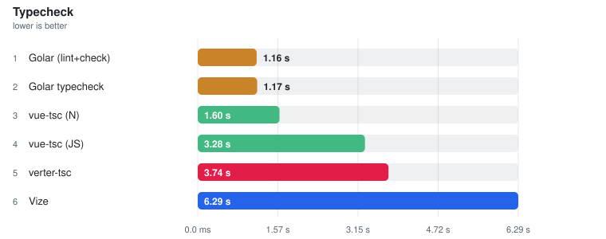
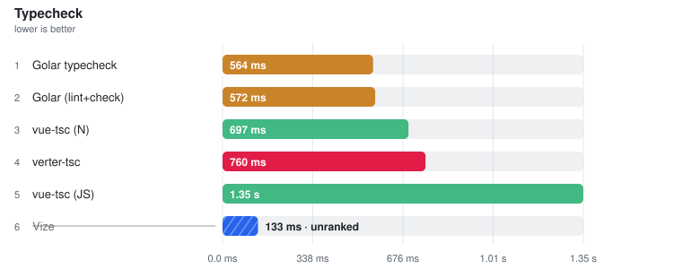
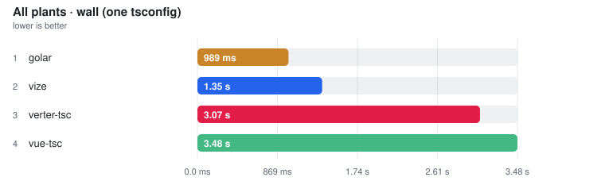
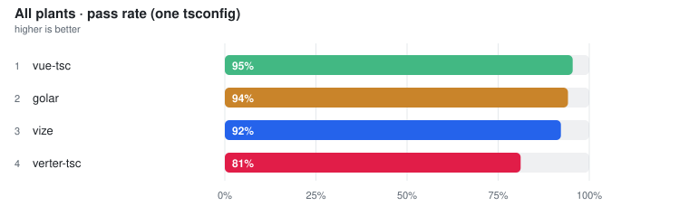

# Typecheck

> Auto-generated from the JSON snapshots in [`results/benchmarks/`](../results/benchmarks/) and [`results/real_world/`](../results/real_world/) by `pnpm docs`. Do not edit by hand.

- **Generated:** 2026-08-19T18:37:25.414Z
- **Fixture:** `fixtures/200` (200 files)
- **Runs / warmups:** 5 / 1
- **Runner:** Linux · linux/x64 · 4 CPUs · AMD EPYC 7763 64-Core Processor · 15.6 GB · Node v22.23.2
- **Commit:** [`94f6696`](https://github.com/pikax/vue-benchmarks/commit/94f6696b1c7b6f54928678126b9831febd70b4ff)
- **CI run:** https://github.com/pikax/vue-benchmarks/actions/runs/32287835178
- **Source:** `results/benchmarks/bench-Linux-200-bench.json`

## Results

Ranked on the **median of measured runs**. Warm series follow ≥1 discarded warmup and are the Compiler surface's primary ordering and ranking metric. Compiler additionally publishes a separately sampled **Fresh child** column: the first timed row workload after excluded process startup, imports and adapter setup. It is not called Cold and its ratio/noise gate never substitutes for Warm. Every table sorts fastest-first and every ratio column is **vs fastest** — the fastest ranked row is the 1.00x denominator; no tool is pinned as a reference. One table per surface unless that surface declares explicit work-equivalence classes; engine, invocation and threading are row properties, not implicit table splits — rows tagged **(JS)** run the JavaScript TypeScript compiler (a cross-engine ratio measures TypeScript's rewrite as much as the tool), and a row's label/notes say whether it is a CLI (pays process startup every run), an in-process API, single-threaded or a thread pool. Name markers: ⚠ failed validation (time bracketed, unranked) · ❌ error · ⏭ skipped. A row above CV 50% with at least three warm samples is bracketed as TOO NOISY TO RANK, no tool exempted (a two-run spread has no third sample to adjudicate, so it is flagged, not bracketed). Per-row detail is under **Notes** below each table.

> **Peak RSS** on a timing row is the tool's peak resident set: measured in the timed session where the runner samples it (LSP servers, real-world CLIs), otherwise injected from the isolated memory probe below — the probe runs each tool in its own process, separate from timing.

2026-08-20 · `fixtures/200` (200 files) · win32/x64 · source `bench-win32-200.json`

> ⚠ **Local run — not the published Linux CI series** (win32/x64 · **dirty worktree** — not attributable to a single commit). Shown because it is the newest data for this group; the next clean Linux Benchmark publish replaces it.

### Typecheck

<picture>
  <source media="(prefers-color-scheme: dark)" srcset="charts/typecheck-bench-win32-200-typecheck-dark.svg">
  
</picture>

Files: **200** · Bytes: **285,701**

Tools:

- **vue-tsc (JS)** — the official Vue Language Tools CLI — vue-tsc --noEmit -p tsconfig.json, stock JavaScript TypeScript engine.
- **vue-tsc (N)** — the same vue-tsc with typescript aliased to typescript-native-bridge (tsgo) — same Vue layer, native engine.
- **Golar typecheck** — golar typecheck — typescript-go with the @golar/vue plugin, pure typecheck.
- **Golar (lint+check)** — golar default mode — lint then typecheck in one pass, not a pure typecheck.
- **Vize** — vize check --tsconfig tsconfig.json (native, Corsa when available).
- **verter-tsc** — verter-tsc --noEmit -p tsconfig.json from the published npm package; runs stable tsgo.

| Tool | **Median (primary)** | Min | Stddev | CV% | vs fastest | Diagnostics | Throughput | Peak RSS |
| --- | ---: | ---: | ---: | ---: | ---: | ---: | ---: | ---: |
| Golar (lint+check) | **1.16 s** | 1.07 s | 76.3 ms | 6.6% | 1.00x | 0 | 173 files/s | – |
| Golar typecheck | **1.17 s** | 992.6 ms | 126.5 ms | 10.9% ⚠ | 1.01x | 0 | 172 files/s | 384.0 MB |
| vue-tsc (N) | **1.60 s** | 1.40 s | 156.9 ms | 9.8% | 1.39x | 0 | 125 files/s | – |
| vue-tsc (JS) | **3.28 s** | 2.81 s | 398.4 ms | 12.1% ⚠ | 2.84x | 0 | 61 files/s | 353.9 MB |
| verter-tsc | **3.74 s** | 3.09 s | 420.6 ms | 11.2% ⚠ | 3.23x | 22 | 53 files/s | 216.5 MB |
| Vize | **6.29 s** | 5.88 s | 387.7 ms | 6.2% | 5.44x | 0 | 32 files/s | 211.6 MB |

Notes

- **Golar (lint+check)**: golar default mode runs lint then typecheck — not a pure typecheck | engine: typescript-go 7.0.2 | gate: script=✓ tmpl-prop=✓ tmpl-event=✓ corpus=✓
- **Golar typecheck**: golar typecheck (typescript-go + @golar/vue plugin) | engine: typescript-go 7.0.2 | gate: script=✓ tmpl-prop=✓ tmpl-event=✓ corpus=✓
- **vue-tsc (N)**: vue-tsc 3.3.10 with typescript aliased to typescript-native-bridge 6.0.3-bridge.13.tsgo.7.0.2 (TS API 6.0.3 on tsgo 7.0.2, in-process NAPI/FFI) | engine: tsgo 7.0.2 via TNB 6.0.3-bridge.13.tsgo.7.0.2 | gate: script=✓ tmpl-prop=✓ tmpl-event=✓ corpus=✓
- **vue-tsc (JS)**: Official Vue Language Tools CLI: vue-tsc --noEmit -p tsconfig.json | engine: TypeScript 6.0.3 (JS) | gate: script=✓ tmpl-prop=✓ tmpl-event=✓ corpus=✓
- **verter-tsc**: verter-tsc --noEmit -p tsconfig.json · tsgo 7.0.2 (typescript-go@7.0.2 → @typescript/typescript-win32-x64) | engine: tsgo 7.0.2 (typescript-go@7.0.2 → @typescript/typescript-win32-x64) | gate: script=✓ tmpl-prop=✓ tmpl-event=✓ corpus=✓
- **Vize**: vize check . --tsconfig tsconfig.json (native + Corsa when available) | engine: tsgo 7.0.0-dev.20260603.1 (nightly) | gate: script=✓ tmpl-prop=✓ tmpl-event=✓ corpus=✓

Methodology

- Same on-disk fixture directory and tsconfig for every tool.
- Default check file limit is smaller than compile corpus (typecheck cost scales steeply).
- Each measurement is a full CLI process invocation — every tool here is a CLI, so process startup is paid by all of them equally.
- Warm runs still benefit from OS page cache of source files and node_modules.
- Tool order is rotated on every warmup and measured run; ranking metric is the median of warmed runs.
- POST-TIMING work gate has four independently reported checks, all required to be ranked: (1) a script-only planted error, (2) a native-template prop mismatch, (3) a template event-handler mismatch — proving the tool actually typechecks templates and does not just run tsc over extracted script blocks — and (4) the planted bug re-detected in the FULL timed corpus under the timed tsconfig, proving the tool does not degrade at scale. The gate runs only after every timing, so its extra CLI processes cannot warm executable pages, source files or dependency metadata for the measurements they qualify.
- Per-tool gate results are shown in Notes as script/template/corpus ✓✗.
- verter-tsc requires stable tsgo (typescript@7.0.x / typescript-go); set via VERTER_TSGO_BIN.
- Two engines are measured in ONE table: rows tagged (JS) run the JavaScript TypeScript compiler, untagged rows run native tsgo. `vue-tsc (JS)` and `vue-tsc (N)` are the SAME vue-tsc and the same Vue layer differing only in engine, so the pair isolates how much of any speed gap is TypeScript's Go rewrite rather than the Vue tooling on top of it — and a cross-engine ratio should be read as exactly that.
- The TNB row lives in envs/tnb as a standalone install, never a root `typescript` override, so the engine swap cannot leak into component-meta, lint or LSP surfaces; it must also print its activation banner or it is unranked.
- Diagnostic equivalence is NOT asserted — this is a throughput benchmark, not a correctness suite.
- golar default mode includes linting; golar typecheck is pure typecheck.
- Allow non-zero exit codes: generated fixtures may surface tool-specific diagnostics.

Raw runs:

- **Golar (lint+check)**: 1.07 s, 1.27 s, 1.16 s, 1.20 s, 1.12 s
- **Golar typecheck**: 1.04 s, 1.30 s, 1.21 s, 1.17 s, 992.6 ms
- **vue-tsc (N)**: 1.52 s, 1.60 s, 1.77 s, 1.75 s, 1.40 s
- **vue-tsc (JS)**: 2.81 s, 3.47 s, 3.77 s, 3.28 s, 2.91 s
- **verter-tsc**: 3.09 s, 4.00 s, 3.74 s, 3.84 s, 3.12 s
- **Vize**: 5.88 s, 6.28 s, 6.48 s, 6.29 s, 6.95 s

### bench-Linux-200-bench

2026-08-19 · `fixtures/200` (200 files) · linux/x64 · source `bench-Linux-200-bench.json`

#### Typecheck

<picture>
  <source media="(prefers-color-scheme: dark)" srcset="charts/typecheck-bench-linux-200-bench-typecheck-dark.svg">
  
</picture>

Files: **200** · Bytes: **285,701**

Tools:

- **vue-tsc (JS)** — the official Vue Language Tools CLI — vue-tsc --noEmit -p tsconfig.json, stock JavaScript TypeScript engine.
- **vue-tsc (N)** — the same vue-tsc with typescript aliased to typescript-native-bridge (tsgo) — same Vue layer, native engine.
- **Golar typecheck** — golar typecheck — typescript-go with the @golar/vue plugin, pure typecheck.
- **Golar (lint+check)** — golar default mode — lint then typecheck in one pass, not a pure typecheck.
- **Vize** — vize check --tsconfig tsconfig.json (native, Corsa when available).
- **verter-tsc** — verter-tsc --noEmit -p tsconfig.json from the published npm package; runs stable tsgo.

| Tool | **Median (primary)** | Min | Stddev | CV% | vs fastest | Diagnostics | Throughput | Peak RSS |
| --- | ---: | ---: | ---: | ---: | ---: | ---: | ---: | ---: |
| verter-tsc | **1.24 s** | 1.19 s | 76.7 ms | 6.2% | 1.00x | 420 | 162 files/s | 216.5 MB |
| Vize | **1.61 s** | 1.59 s | 17.8 ms | 1.1% | 1.30x | 0 | 124 files/s | 211.6 MB |
| Golar typecheck | **1.70 s** | 1.68 s | 14.0 ms | 0.8% | 1.37x | 0 | 118 files/s | 384.0 MB |
| Golar (lint+check) | **1.70 s** | 1.68 s | 22.9 ms | 1.3% | 1.37x | 0 | 118 files/s | – |
| vue-tsc (N) | **2.46 s** | 2.43 s | 18.0 ms | 0.7% | 1.99x | 0 | 81 files/s | – |
| vue-tsc (JS) | **5.18 s** | 5.13 s | 35.7 ms | 0.7% | 4.19x | 0 | 39 files/s | 353.9 MB |

Notes

- **verter-tsc**: verter-tsc --noEmit -p tsconfig.json · tsgo 7.0.2 (typescript-go@7.0.2 → @typescript/typescript-linux-x64) | engine: tsgo 7.0.2 (typescript-go@7.0.2 → @typescript/typescript-linux-x64) | gate: script=✓ tmpl-prop=✓ tmpl-event=✓ corpus=✓
- **Vize**: vize check . --tsconfig tsconfig.json (native + Corsa when available) | engine: tsgo 7.0.0-dev.20260603.1 (nightly) | gate: script=✓ tmpl-prop=✓ tmpl-event=✓ corpus=✓
- **Golar typecheck**: golar typecheck (typescript-go + @golar/vue plugin) | engine: typescript-go 7.0.2 | gate: script=✓ tmpl-prop=✓ tmpl-event=✓ corpus=✓
- **Golar (lint+check)**: golar default mode runs lint then typecheck — not a pure typecheck | engine: typescript-go 7.0.2 | gate: script=✓ tmpl-prop=✓ tmpl-event=✓ corpus=✓
- **vue-tsc (N)**: vue-tsc 3.3.10 with typescript aliased to typescript-native-bridge 6.0.3-bridge.13.tsgo.7.0.2 (TS API 6.0.3 on tsgo 7.0.2, in-process NAPI/FFI) | engine: tsgo 7.0.2 via TNB 6.0.3-bridge.13.tsgo.7.0.2 | gate: script=✓ tmpl-prop=✓ tmpl-event=✓ corpus=✓
- **vue-tsc (JS)**: Official Vue Language Tools CLI: vue-tsc --noEmit -p tsconfig.json | engine: TypeScript 6.0.3 (JS) | gate: script=✓ tmpl-prop=✓ tmpl-event=✓ corpus=✓

Methodology

- Same on-disk fixture directory and tsconfig for every tool.
- Default check file limit is smaller than compile corpus (typecheck cost scales steeply).
- Each measurement is a full CLI process invocation — every tool here is a CLI, so process startup is paid by all of them equally.
- Warm runs still benefit from OS page cache of source files and node_modules.
- Tool order is rotated on every warmup and measured run; ranking metric is the median of warmed runs.
- Work gate has three parts, all required to be ranked: (1) a script-only planted error, (2) a template-only planted error with strictTemplates — proving the tool actually typechecks templates and does not just run tsc over extracted script blocks, and (3) the same planted bug re-detected in the FULL timed corpus under the timed tsconfig, proving the tool does not degrade at scale.
- Per-tool gate results are shown in Notes as script/template/corpus ✓✗.
- verter-tsc requires stable tsgo (typescript@7.0.x / typescript-go); set via VERTER_TSGO_BIN.
- Two engines are measured in ONE table: rows tagged (JS) run the JavaScript TypeScript compiler, untagged rows run native tsgo. `vue-tsc (JS)` and `vue-tsc (N)` are the SAME vue-tsc and the same Vue layer differing only in engine, so the pair isolates how much of any speed gap is TypeScript's Go rewrite rather than the Vue tooling on top of it — and a cross-engine ratio should be read as exactly that.
- The TNB row lives in envs/tnb as a standalone install, never a root `typescript` override, so the engine swap cannot leak into component-meta, lint or LSP surfaces; it must also print its activation banner or it is unranked.
- Diagnostic equivalence is NOT asserted — this is a throughput benchmark, not a correctness suite.
- golar default mode includes linting; golar typecheck is pure typecheck.
- Allow non-zero exit codes: generated fixtures may surface tool-specific diagnostics.

Raw runs:

- **verter-tsc**: 1.24 s, 1.24 s, 1.38 s, 1.19 s, 1.21 s
- **Vize**: 1.64 s, 1.59 s, 1.60 s, 1.61 s, 1.61 s
- **Golar typecheck**: 1.71 s, 1.70 s, 1.68 s, 1.70 s, 1.68 s
- **Golar (lint+check)**: 1.74 s, 1.70 s, 1.68 s, 1.69 s, 1.70 s
- **vue-tsc (N)**: 2.47 s, 2.47 s, 2.44 s, 2.46 s, 2.43 s
- **vue-tsc (JS)**: 5.18 s, 5.19 s, 5.17 s, 5.13 s, 5.23 s

### engine-decomp

2026-07-27 · `fixtures/50` (50 files) · win32/x64 · source `engine-decomp.json`

> ⚠ **Local run — not the published Linux CI series** (win32/x64). Shown because it is the newest data for this group; the next clean Linux Benchmark publish replaces it.

#### Typecheck

<picture>
  <source media="(prefers-color-scheme: dark)" srcset="charts/typecheck-engine-decomp-typecheck-dark.svg">
  
</picture>

Files: **50** · Bytes: **68,285**

Tools:

- **vue-tsc (JS)** — the official Vue Language Tools CLI — vue-tsc --noEmit -p tsconfig.json, stock JavaScript TypeScript engine.
- **vue-tsc (N)** — the same vue-tsc with typescript aliased to typescript-native-bridge (tsgo) — same Vue layer, native engine.
- **Golar typecheck** — golar typecheck — typescript-go with the @golar/vue plugin, pure typecheck.
- **Golar (lint+check)** — golar default mode — lint then typecheck in one pass, not a pure typecheck.
- **Vize** — vize check --tsconfig tsconfig.json (native, Corsa when available).
- **verter-tsc** — verter-tsc --noEmit -p tsconfig.json from the published npm package; runs stable tsgo.

| Tool | **Median (primary)** | Min | Stddev | CV% | vs fastest | Diagnostics | Throughput | Peak RSS |
| --- | ---: | ---: | ---: | ---: | ---: | ---: | ---: | ---: |
| Golar typecheck | **564.1 ms** | 562.2 ms | 17.5 ms | 3.1% | 1.00x | 0 | 89 files/s | 384.0 MB |
| Golar (lint+check) | **572.0 ms** | 552.6 ms | 11.4 ms | 2.0% | 1.01x | 0 | 87 files/s | – |
| vue-tsc (N) | **696.6 ms** | 686.8 ms | 10.6 ms | 1.5% | 1.24x | 0 | 72 files/s | – |
| verter-tsc | **760.5 ms** | 731.2 ms | 15.4 ms | 2.0% | 1.35x | 105 | 66 files/s | 216.5 MB |
| vue-tsc (JS) | **1.35 s** | 1.28 s | 35.6 ms | 2.6% | 2.40x | 0 | 37 files/s | 353.9 MB |
| Vize ⚠ | (132.8 ms) | (127.7 ms) | – | – | not ranked | (0) | – | (211.6 MB) |

Notes

- **Golar typecheck**: golar typecheck (typescript-go + @golar/vue plugin) | engine: typescript-go 7.0.2 | gate: script=✓ tmpl-prop=✓ tmpl-event=✓ corpus=✓
- **Golar (lint+check)**: golar default mode runs lint then typecheck — not a pure typecheck | engine: typescript-go 7.0.2 | gate: script=✓ tmpl-prop=✓ tmpl-event=✓ corpus=✓
- **vue-tsc (N)**: vue-tsc 3.3.8 with typescript aliased to typescript-native-bridge 6.0.3-bridge.6.tsgo.7.0.2 (TS API 6.0.3 on tsgo 7.0.2, in-process NAPI/FFI) | engine: tsgo 7.0.2 via TNB 6.0.3-bridge.6.tsgo.7.0.2 | gate: script=✓ tmpl-prop=✓ tmpl-event=✓ corpus=✓
- **verter-tsc**: verter-tsc --noEmit -p tsconfig.json · tsgo 7.0.2 (typescript-go@7.0.2 → @typescript/typescript-win32-x64) | engine: tsgo 7.0.2 (typescript-go@7.0.2 → @typescript/typescript-win32-x64) | gate: script=✓ tmpl-prop=✓ tmpl-event=✓ corpus=✓
- **vue-tsc (JS)**: Official Vue Language Tools CLI: vue-tsc --noEmit -p tsconfig.json | engine: TypeScript 5.9.3 (JS) | gate: script=✓ tmpl-prop=✓ tmpl-event=✓ corpus=✓
- **Vize ⚠**: vize check . --tsconfig tsconfig.json (native + Corsa when available) | engine: tsgo 7.0.0-dev.20260602.1 (nightly) | ⚠ FAILED VALIDATION — time shown in brackets, excluded from ranking | gate: script=✓ tmpl-prop=✗ tmpl-event=✓ corpus=✗ (missed template prop-type plant (:disabled string→boolean))

Methodology

- Same on-disk fixture directory and tsconfig for every tool.
- Default check file limit is smaller than compile corpus (typecheck cost scales steeply).
- Each measurement is a full CLI process invocation — every tool here is a CLI, so process startup is paid by all of them equally.
- Warm runs still benefit from OS page cache of source files and node_modules.
- Tool order is rotated on every warmup and measured run; ranking metric is the median of warmed runs.
- Work gate has three parts, all required to be ranked: (1) a script-only planted error, (2) a template-only planted error with strictTemplates — proving the tool actually typechecks templates and does not just run tsc over extracted script blocks, and (3) the same planted bug re-detected in the FULL timed corpus under the timed tsconfig, proving the tool does not degrade at scale.
- Per-tool gate results are shown in Notes as script/template/corpus ✓✗.
- verter-tsc requires stable tsgo (typescript@7.0.x / typescript-go); set via VERTER_TSGO_BIN.
- Two engines are measured and ranked separately: the JavaScript TypeScript compiler and native tsgo. `vue-tsc` and `vue-tsc (TNB / tsgo)` are the SAME vue-tsc and the same Vue layer differing only in engine, so the pair isolates how much of any speed gap is TypeScript's Go rewrite rather than the Vue tooling on top of it.
- The TNB row lives in envs/tnb as a standalone install, never a root `typescript` override, so the engine swap cannot leak into component-meta, lint or LSP surfaces; it must also print its activation banner or it is unranked.
- Diagnostic equivalence is NOT asserted — this is a throughput benchmark, not a correctness suite.
- golar default mode includes linting; golar typecheck is pure typecheck.
- Allow non-zero exit codes: generated fixtures may surface tool-specific diagnostics.

Raw runs:

- **Golar typecheck**: 569.7 ms, 563.0 ms, 562.2 ms, 564.1 ms, 603.3 ms
- **Golar (lint+check)**: 552.6 ms, 572.3 ms, 583.5 ms, 572.0 ms, 564.3 ms
- **vue-tsc (N)**: 686.8 ms, 695.5 ms, 696.6 ms, 711.1 ms, 711.2 ms
- **verter-tsc**: 769.7 ms, 747.2 ms, 760.5 ms, 764.1 ms, 731.2 ms
- **vue-tsc (JS)**: 1.37 s, 1.28 s, 1.34 s, 1.35 s, 1.35 s
- **Vize**: 127.7 ms, 132.8 ms, 128.2 ms, 133.6 ms, 133.3 ms

## Validation (plants)

Executable correctness checks — planted errors that must be reported, clean fixtures that must stay clean. A fast tool that misses plants cannot rank as a correct one; gate failures surface as ⚠ in the timing tables.

> ⚠ **Local run — not the published Linux CI series** (win32/x64). Shown because it is the newest data for this group; the next clean Linux Benchmark publish replaces it.

### All plants (one tsconfig)

One spawn per tool over every plant with the shared `strictTemplates` tsconfig — no per-case overlays, no retries.

<picture>
  <source media="(prefers-color-scheme: dark)" srcset="charts/typecheck-all-wall-dark.svg">
  
</picture>

| Tool | **Median** | Avg | vs fastest | Peak RSS |
| --- | ---: | ---: | ---: | ---: |
| golar | **687 ms** | 675 ms | 1.00x | **335.5 MB** |
| vize | **1.11 s** | 1.09 s | 1.61x | 82.5 + 364.1 = **446.6 MB** |
| vue-tsc | **1.98 s** | 1.99 s | 2.89x | **345.8 MB** |
| verter-tsc | **2.66 s** | 2.66 s | 3.86x | 353.5 + 445.5 = **799.0 MB** |

Peak RSS is the separate memory pass, split `tool + tsgo/tsc = total` when the checker spawns a TypeScript engine; in-process engines cannot be split.

<picture>
  <source media="(prefers-color-scheme: dark)" srcset="charts/typecheck-all-pass-dark.svg">
  
</picture>

| Tool | **Pass rate** | pass / plants |
| --- | ---: | ---: |
| vue-tsc | **93%** | 139 / 150 |
| golar | **91%** | 137 / 150 |
| verter-tsc | **83%** | 125 / 150 |
| vize | **49%** | 73 / 150 |

An unclaimed capability is a **gap and counts as a fail** — every tool is scored over the same full plant set. Skip is reserved for a missing binary/engine.

### Plant matrix

A tool is compatible only if it reports the planted error (or stays clean) on every plant. vue-tsc (Volar) is the usual reference, but it is **not assumed perfect** — a plant it fails is a real gap and is listed as such.

### How plants are judged

- Each case is a tiny project under `tests/confirm/fixtures/typecheck/cases/<id>/`. CI scores the matrix from **one spawn per tool** (`--all`) over every plant. `pnpm confirm:typecheck` without `--all` still runs each plant as its own spawn (fallthrough / extra-tsconfig retries).
- **All plants (one tsconfig)** — extra check: every plant is copied under `cases/<id>/` and typechecked in **one** process with the shared `tsconfig.json` (no per-case overlay, no fallthroughAttributes retry). Wall is a speed pass (no RSS sampler). Peak RSS is a **separate** memory spawn. Pass rate is the per-plant score of the last speed dump, as a percentage of ALL plants — a capability gap counts as a fail.
- Every tool runs on the **same shared tsconfig** (`strictTemplates: true`). Extra TypeScript flags that only one tool needs are **not** added globally.
- `expectErrors: false` — the fixture is clean. Any diagnostic is a fail. A diagnostic that names the tool's own virtual code (`__VLS_`, `___VERTER___`, …) is called out as a codegen leak.
- `expectErrors: true` — at least one error, matching `mustMatch` when set. Dirty plants mark the bad line with a harness pin (`<!-- @plant-error -->` in template, `// @plant-error` in script). That is **not** TypeScript: HTML comments are ignored by every checker, so the pin always survives. The harness requires a diagnostic **on the next line** that mentions `expectMention` (e.g. the invalid prop name). A hit on the wrong line, or an error that does not name the plant, is a fail. `// @ts-expect-error` is only used in `.ts` where unused-directive is itself the plant.
- **skip** — the binary/engine is missing, so the tool never ran. A tool that runs but does not claim a capability (`meta.requires`) **fails** that plant: an unclaimed capability is a gap, not an exemption.
- **warn** — extra harness behaviour for one tool (today: verter-tsc retried with `allowArbitraryExtensions` + `allowImportingTsExtensions` that the others do not need). A warn is **not** a pass.
- Known upstream bugs live in `tests/confirm/known-failures.json`. They still show as **✗** here so the gap stays visible; they do not fail the PR gate until they start passing (stale entry) or a new unlisted fail appears.

### Shared vs extra vueCompilerOptions

The shared config does **not** set `fallthroughAttributes`. That flag is a Volar opt-in (default `false`). This suite does not put it in any case `tsconfig.json` — doing so would hide that a tool only types inheritAttrs fallthrough when given a non-default option.

Plants in **inheritAttrs + root shape** run **twice**: once on the shared tsconfig, then on an isolated `tsconfig.fallthrough.json`. Scoring:

- shared ✓ and extra ✓ → **pass** (no opt-in needed, or a dirty plant errors either way)
- shared ✗ and extra ✓ → **⚠ warn** (needed `fallthroughAttributes`; not a pass)
- shared ✓ and extra ✗ → **fail** (the opt-in revealed the plant was missed)
- shared ✗ and extra ✗ → **fail**

What those plants ask (the *correct* inheritAttrs/root-shape answer):

| Root shape | inheritAttrs | Call-site `id=` | Correct answer |
| --- | --- | --- | --- |
| Single element | default / true | native `id` | clean (falls through) |
| Single element | `false` | native `id` | error |
| Multi-root fragment | default / true | native `id` | error (no single target) |
| `v-if` / `v-else`, both single-root | default / true | native `id` | clean (always one root) |
| `v-if` single / `v-else` fragment | default / true | native `id` | error (not always one root) |
| `v-if="true"` or a literal-`true` prop, single branch | default / true | native `id` | clean if the checker resolves the condition statically |
| `v-if="true"` but that branch is a fragment | default / true | native `id` | error |

Static resolution (`v-if="true"`, `alwaysOn: true`) is the hard edge. A tool that only counts root nodes syntactically will fail it. That is a finding, including for vue-tsc.

### Status key

| Mark | Meaning |
| --- | --- |
| ✓ | pass — plant met on the shared (or disclosed case-local) config |
| **✗** | fail — plant not met. If listed in known-failures.json it is a documented upstream gap |
| ⚠ | warn — extra harness behaviour; not scored as a pass |
| ○ | skip — missing binary/engine (an unclaimed capability is a ✗ fail, not a skip) |
| – | no row (tool did not run this case) |

### Summary

- plants: **150**
- pass: **474** · fail: **126** · skip: **0** · warn: **0**
- one-spawn combined run: [All plants (one tsconfig)](#all-plants-one-tsconfig)

### Template narrowing

| Case | Expect | vue-tsc | vize | verter-tsc | golar | What it checks |
| --- | --- | --- | --- | --- | --- | --- |
| [`v-else-if-bad`](../tests/confirm/fixtures/typecheck/cases/v-else-if-bad/) | error | ✓ | **✗** | ✓ | ✓ | typeof === 'string' branch must reject number-only methods (toFixed) |
| [`v-else-if-ok`](../tests/confirm/fixtures/typecheck/cases/v-else-if-ok/) | clean | ✓ | ✓ | ✓ | ✓ | typeof guards on v-if / v-else-if narrow a string \| number union in the template |
| [`v-if-discriminant-bad`](../tests/confirm/fixtures/typecheck/cases/v-if-discriminant-bad/) | error | ✓ | **✗** | ✓ | ✓ | After narrowing to kind === 'dog', accessing cat-only meow() must error |
| [`v-if-discriminant-ok`](../tests/confirm/fixtures/typecheck/cases/v-if-discriminant-ok/) | clean | ✓ | ✓ | **✗**† | ✓ | v-if on a tagged-union discriminant narrows each branch to the matching variant |
| [`v-if-else-bad`](../tests/confirm/fixtures/typecheck/cases/v-if-else-bad/) | error | ✓ | **✗** | ✓ | ✓ | v-else branch must treat the nullable ref as null, so .name is an error |
| [`v-if-else-ok`](../tests/confirm/fixtures/typecheck/cases/v-if-else-ok/) | clean | ✓ | ✓ | ✓ | ✓ | v-if / v-else: narrowed user.name in the true branch, literal in the else |
| [`v-if-event-closure`](../tests/confirm/fixtures/typecheck/cases/v-if-event-closure/) | error | ✓ | **✗** | ✓ | ✓ | Script handler uses nullable ref without guard (event may run later) |
| [`v-if-in-narrow-bad`](../tests/confirm/fixtures/typecheck/cases/v-if-in-narrow-bad/) | error | ✓ | **✗** | ✓ | ✓ | After v-if="'a' in x", accessing x.b in the true branch must error |
| [`v-if-in-narrow-ok`](../tests/confirm/fixtures/typecheck/cases/v-if-in-narrow-ok/) | clean | ✓ | ✓ | ✓ | ✓ | v-if="'a' in x" narrows a {a} \| {b} union so x.a is a string (clean) |
| [`v-if-inline-event-bad`](../tests/confirm/fixtures/typecheck/cases/v-if-inline-event-bad/) | error | ✓ | **✗** | ✓ | ✓ | Inline @click reads .name on a nullable ref with no v-if guard |
| [`v-if-inline-event-ok`](../tests/confirm/fixtures/typecheck/cases/v-if-inline-event-ok/) | clean | ✓ | ✓ | ✓ | ✓ | v-if on an element narrows a nullable ref inside that element's @click and interpolation |
| [`v-if-narrow-bad`](../tests/confirm/fixtures/typecheck/cases/v-if-narrow-bad/) | error | ✓ | **✗** | ✓ | ✓ | Access nullable ref property without v-if guard |
| [`v-if-narrow-ok`](../tests/confirm/fixtures/typecheck/cases/v-if-narrow-ok/) | clean | ✓ | ✓ | ✓ | ✓ | v-if should narrow ref union in template (clean) |
| [`v-if-not-ok`](../tests/confirm/fixtures/typecheck/cases/v-if-not-ok/) | clean | ✓ | ✓ | ✓ | ✓ | v-if="!user" / v-else must narrow the else branch to the object |
| [`v-if-optional-prop-bad`](../tests/confirm/fixtures/typecheck/cases/v-if-optional-prop-bad/) | error | ✓ | **✗** | **✗** | ✓ | Optional prop used without v-if must report possibly undefined |
| [`v-if-optional-prop-ok`](../tests/confirm/fixtures/typecheck/cases/v-if-optional-prop-ok/) | clean | ✓ | ✓ | ✓ | ✓ | v-if on an optional prop narrows it to string before toUpperCase |
| [`v-if-prop-discriminant-ok`](../tests/confirm/fixtures/typecheck/cases/v-if-prop-discriminant-ok/) | clean | ✓ | ✓ | ✓ | ✓ | v-if on a union prop's discriminant narrows each branch (types imported from a .ts module) |
| [`v-if-typeof-bad`](../tests/confirm/fixtures/typecheck/cases/v-if-typeof-bad/) | error | ✓ | **✗** | ✓ | ✓ | string \| number without a typeof guard must reject toUpperCase |
| [`v-if-typeof-ok`](../tests/confirm/fixtures/typecheck/cases/v-if-typeof-ok/) | clean | ✓ | ✓ | ✓ | ✓ | typeof === 'number' in v-if narrows a string \| number ref for toFixed |
| [`v-show-no-narrow`](../tests/confirm/fixtures/typecheck/cases/v-show-no-narrow/) | error | ✓ | **✗** | ✓ | ✓ | v-show does not narrow; reading .name on a nullable ref must still error |

### inheritAttrs + root shape

| Case | Expect | vue-tsc | vize | verter-tsc | golar | What it checks |
| --- | --- | --- | --- | --- | --- | --- |
| [`fallthrough-mono-false-bad`](../tests/confirm/fixtures/typecheck/cases/fallthrough-mono-false-bad/) | error | ✓ | **✗**† | ✓ | ✓ | inheritAttrs:false + single root: undeclared id must still error under fallthroughAttributes · *may warn if fallthroughAttributes is required* |
| [`fallthrough-mono-ok`](../tests/confirm/fixtures/typecheck/cases/fallthrough-mono-ok/) | clean | **✗** | ✓ | ✓ | **✗** | inheritAttrs default + single root: native id falls through (fallthroughAttributes) · *may warn if fallthroughAttributes is required* |
| [`fallthrough-multi-bad`](../tests/confirm/fixtures/typecheck/cases/fallthrough-multi-bad/) | error | ✓ | **✗**† | ✓ | ✓ | inheritAttrs default + multi-root fragment: undeclared id must error (no single target) · *may warn if fallthroughAttributes is required* |
| [`fallthrough-multi-false-bad`](../tests/confirm/fixtures/typecheck/cases/fallthrough-multi-false-bad/) | error | ✓ | **✗**† | ✓ | ✓ | inheritAttrs:false + multi-root: undeclared id must error · *may warn if fallthroughAttributes is required* |
| [`fallthrough-native-type-bad`](../tests/confirm/fixtures/typecheck/cases/fallthrough-native-type-bad/) | error | ✓ | **✗**† | ✓ | ✓ | inheritAttrs default + single &lt;button&gt; root: fallthrough :disabled="string" must error · *may warn if fallthroughAttributes is required* |
| [`fallthrough-vif-both-mono-false-bad`](../tests/confirm/fixtures/typecheck/cases/fallthrough-vif-both-mono-false-bad/) | error | ✓ | **✗**† | ✓ | ✓ | inheritAttrs:false + v-if/v-else both single-root: undeclared id must still error · *may warn if fallthroughAttributes is required* |
| [`fallthrough-vif-both-mono-ok`](../tests/confirm/fixtures/typecheck/cases/fallthrough-vif-both-mono-ok/) | clean | **✗** | ✓ | ✓ | **✗** | inheritAttrs default + v-if/v-else both single-root: id may fall through (always one root) · *may warn if fallthroughAttributes is required* |
| [`fallthrough-vif-mono-multi-bad`](../tests/confirm/fixtures/typecheck/cases/fallthrough-vif-mono-multi-bad/) | error | ✓ | **✗**† | ✓ | ✓ | inheritAttrs default + v-if mono / v-else multi-root: undeclared id must error · *may warn if fallthroughAttributes is required* |
| [`fallthrough-vif-static-multi-bad`](../tests/confirm/fixtures/typecheck/cases/fallthrough-vif-static-multi-bad/) | error | ✓ | **✗**† | ✓ | ✓ | inheritAttrs default + v-if="true" whose branch is multi-root: undeclared id must error · *may warn if fallthroughAttributes is required* |
| [`fallthrough-vif-static-ok`](../tests/confirm/fixtures/typecheck/cases/fallthrough-vif-static-ok/) | clean | **✗** | ✓ | ✓ | **✗** | inheritAttrs default + v-if="true" (statically single root): id may fall through · *may warn if fallthroughAttributes is required* |
| [`fallthrough-vif-static-prop-ok`](../tests/confirm/fixtures/typecheck/cases/fallthrough-vif-static-prop-ok/) | clean | **✗** | ✓ | ✓ | **✗** | inheritAttrs default + v-if on a literal-true prop: statically single root, id may fall through · *may warn if fallthroughAttributes is required* |

### inheritAttrs / strictTemplates (no fallthrough typing)

| Case | Expect | vue-tsc | vize | verter-tsc | golar | What it checks |
| --- | --- | --- | --- | --- | --- | --- |
| [`attrs-aria-data-unknown`](../tests/confirm/fixtures/typecheck/cases/attrs-aria-data-unknown/) | error | ✓ | **✗**† | **✗**† | ✓ | Undeclared aria-*/data-* attributes on a component are not exempt from strictTemplates (isolates the root cause of inherit-attrs-false-unknown: the exemption is prefix-based, not inheritAttrs-based) |
| [`attrs-class-style-ok`](../tests/confirm/fixtures/typecheck/cases/attrs-class-style-ok/) | clean | ✓ | ✓ | ✓ | ✓ | class/style on component are AllowedComponentProps (clean under strictTemplates) |
| [`attrs-unknown-fallthrough`](../tests/confirm/fixtures/typecheck/cases/attrs-unknown-fallthrough/) | error | ✓ | **✗**† | **✗** | ✓ | Non-declared attribute (id) on component errors under strictTemplates regardless of inheritAttrs |
| [`inherit-attrs-default-class-style-ok`](../tests/confirm/fixtures/typecheck/cases/inherit-attrs-default-class-style-ok/) | clean | ✓ | ✓ | ✓ | ✓ | Default inheritAttrs still allows class and style (AllowedComponentProps) |
| [`inherit-attrs-default-unknown`](../tests/confirm/fixtures/typecheck/cases/inherit-attrs-default-unknown/) | error | ✓ | **✗**† | **✗** | ✓ | Default inheritAttrs (no defineOptions) still errors on undeclared attrs under strictTemplates |
| [`inherit-attrs-false-class-style-ok`](../tests/confirm/fixtures/typecheck/cases/inherit-attrs-false-class-style-ok/) | clean | ✓ | ✓ | ✓ | ✓ | inheritAttrs: false still allows class and style on the component |
| [`inherit-attrs-false-unknown`](../tests/confirm/fixtures/typecheck/cases/inherit-attrs-false-unknown/) | error | ✓ | **✗**† | **✗**† | ✓ | inheritAttrs:false still rejects unknown attrs at the call site under strictTemplates |
| [`unknown-prop-strict`](../tests/confirm/fixtures/typecheck/cases/unknown-prop-strict/) | error | ✓ | **✗**† | ✓ | ✓ | strictTemplates: undeclared prop on child component |

### Generics

| Case | Expect | vue-tsc | vize | verter-tsc | golar | What it checks |
| --- | --- | --- | --- | --- | --- | --- |
| [`generic-component-bad`](../tests/confirm/fixtures/typecheck/cases/generic-component-bad/) | error | ✓ | **✗** | ✓ | ✓ | Generic &lt;script setup&gt; component: `selected` must unify with the element type inferred from `items` |
| [`generic-component-ok`](../tests/confirm/fixtures/typecheck/cases/generic-component-ok/) | clean | ✓ | ✓ | **✗**† | ✓ | generic="T extends { id: number }" on &lt;script setup&gt;; parent passes a consistent T (clean) |
| [`generic-constraint-template-bad`](../tests/confirm/fixtures/typecheck/cases/generic-constraint-template-bad/) | error | ✓ | **✗** | ✓ | ✓ | Inside a generic SFC, T extends { id: number } must reject item.name |
| [`generic-default-ok`](../tests/confirm/fixtures/typecheck/cases/generic-default-ok/) | clean | ✓ | ✓ | ✓ | ✓ | Generic with a default type param (T = string) accepts a string value |
| [`generic-define-model-bad`](../tests/confirm/fixtures/typecheck/cases/generic-define-model-bad/) | error | ✓ | **✗** | **✗** | ✓ | generic defineModel&lt;T extends string \| number&gt; must reject an object v-model |
| [`generic-define-model-ok`](../tests/confirm/fixtures/typecheck/cases/generic-define-model-ok/) | clean | ✓ | ✓ | ✓ | ✓ | generic defineModel&lt;T extends string \| number&gt; accepts a string v-model (clean) |
| [`generic-emit-bad`](../tests/confirm/fixtures/typecheck/cases/generic-emit-bad/) | error | ✓ | **✗** | ✓ | ✓ | Generic emit payload inferred as number must reject a string handler |
| [`generic-emit-ok`](../tests/confirm/fixtures/typecheck/cases/generic-emit-ok/) | clean | ✓ | ✓ | ✓ | ✓ | Generic emit payload matches the inferred T from the value prop |
| [`generic-fallthrough-mono-ok`](../tests/confirm/fixtures/typecheck/cases/generic-fallthrough-mono-ok/) | clean | **✗** | ✓ | ✓ | **✗** | Generic + inheritAttrs default + single root: native id falls through · *may warn if fallthroughAttributes is required* |
| [`generic-inherit-false-class-ok`](../tests/confirm/fixtures/typecheck/cases/generic-inherit-false-class-ok/) | clean | ✓ | ✓ | **✗**† | ✓ | Generic + inheritAttrs:false still allows class |
| [`generic-inherit-false-unknown`](../tests/confirm/fixtures/typecheck/cases/generic-inherit-false-unknown/) | error | ✓ | **✗**† | ✓ | ✓ | Generic + inheritAttrs:false: undeclared extra attr must error |
| [`generic-multi-root-ok`](../tests/confirm/fixtures/typecheck/cases/generic-multi-root-ok/) | clean | ✓ | ✓ | ✓ | ✓ | Generic multi-root SFC with correct props stays clean (no extra attrs) |
| [`generic-slot-bad`](../tests/confirm/fixtures/typecheck/cases/generic-slot-bad/) | error | ✓ | **✗**† | ✓ | ✓ | Generic scoped slot: item.id (number) must reject a string-only consumer |
| [`generic-slot-ok`](../tests/confirm/fixtures/typecheck/cases/generic-slot-ok/) | clean | ✓ | ✓ | ✓ | ✓ | Generic scoped slot exposes T so item.label is a string |
| [`generic-two-params-bad`](../tests/confirm/fixtures/typecheck/cases/generic-two-params-bad/) | error | ✓ | **✗**† | ✓ | ✓ | Two-param generic: slot payload inferred as number must reject a string-only consumer |
| [`generic-two-params-ok`](../tests/confirm/fixtures/typecheck/cases/generic-two-params-ok/) | clean | ✓ | ✓ | ✓ | ✓ | Generic component with two type params and matching bindings |

### Emits

| Case | Expect | vue-tsc | vize | verter-tsc | golar | What it checks |
| --- | --- | --- | --- | --- | --- | --- |
| [`emit-ok`](../tests/confirm/fixtures/typecheck/cases/emit-ok/) | clean | ✓ | ✓ | ✓ | ✓ | defineEmits typed payload: correct event name and number arg |
| [`emit-unknown-event`](../tests/confirm/fixtures/typecheck/cases/emit-unknown-event/) | error | ✓ | **✗** | ✓ | ✓ | emit() of an undeclared event name must error |
| [`emit-wrong-arg`](../tests/confirm/fixtures/typecheck/cases/emit-wrong-arg/) | error | **✗** | **✗** | **✗** | **✗** | emit('change', string) where the payload is typed as number |
| [`event-emit-payload`](../tests/confirm/fixtures/typecheck/cases/event-emit-payload/) | error | ✓ | **✗** | ✓ | ✓ | Listener receives wrong payload type for typed emit |

### Native events / $event / modifiers

| Case | Expect | vue-tsc | vize | verter-tsc | golar | What it checks |
| --- | --- | --- | --- | --- | --- | --- |
| [`dollar-event-bad`](../tests/confirm/fixtures/typecheck/cases/dollar-event-bad/) | error | ✓ | **✗** | ✓ | ✓ | $event on native @click must reject an unknown method |
| [`dollar-event-ok`](../tests/confirm/fixtures/typecheck/cases/dollar-event-ok/) | clean | ✓ | ✓ | ✓ | ✓ | $event on native @click is a MouseEvent and has preventDefault |
| [`element-prop-type`](../tests/confirm/fixtures/typecheck/cases/element-prop-type/) | error | **✗** | **✗** | **✗** | **✗** | Native element / event handler type error in template |
| [`event-mod-click-ctrl-ok`](../tests/confirm/fixtures/typecheck/cases/event-mod-click-ctrl-ok/) | clean | ✓ | ✓ | ✓ | ✓ | System modifier @click.ctrl is still a MouseEvent handler (clean) |
| [`event-mod-click-prevent-bad`](../tests/confirm/fixtures/typecheck/cases/event-mod-click-prevent-bad/) | error | ✓ | **✗** | ✓ | ✓ | .prevent does not change @click from MouseEvent to KeyboardEvent |
| [`event-mod-click-prevent-dollar-bad`](../tests/confirm/fixtures/typecheck/cases/event-mod-click-prevent-dollar-bad/) | error | **✗** | **✗** | ✓ | **✗** | $event on @click.prevent is still MouseEvent (no .key) |
| [`event-mod-click-prevent-ok`](../tests/confirm/fixtures/typecheck/cases/event-mod-click-prevent-ok/) | clean | ✓ | ✓ | ✓ | ✓ | @click.prevent keeps the native MouseEvent handler type (clean) |
| [`event-mod-click-stop-prevent-ok`](../tests/confirm/fixtures/typecheck/cases/event-mod-click-stop-prevent-ok/) | clean | ✓ | ✓ | ✓ | ✓ | Chained @click.stop.prevent is still a MouseEvent handler (clean) |
| [`event-mod-component-once-bad`](../tests/confirm/fixtures/typecheck/cases/event-mod-component-once-bad/) | error | ✓ | **✗** | ✓ | ✓ | .once on a component emit does not erase the payload type |
| [`event-mod-component-once-ok`](../tests/confirm/fixtures/typecheck/cases/event-mod-component-once-ok/) | clean | ✓ | ✓ | ✓ | ✓ | @change.once on a typed emit still receives the number payload (clean) |
| [`event-mod-keyup-enter-bad`](../tests/confirm/fixtures/typecheck/cases/event-mod-keyup-enter-bad/) | error | ✓ | **✗** | ✓ | ✓ | @keyup.enter is still KeyboardEvent; a MouseEvent handler must error |
| [`event-mod-keyup-enter-ok`](../tests/confirm/fixtures/typecheck/cases/event-mod-keyup-enter-ok/) | clean | ✓ | ✓ | ✓ | ✓ | @keyup.enter keeps KeyboardEvent (key modifiers are not event-type rewrites) |
| [`event-mod-submit-prevent-ok`](../tests/confirm/fixtures/typecheck/cases/event-mod-submit-prevent-ok/) | clean | ✓ | ✓ | ✓ | ✓ | @submit.prevent accepts an Event handler (clean) |
| [`native-keyup-bad`](../tests/confirm/fixtures/typecheck/cases/native-keyup-bad/) | error | ✓ | **✗** | ✓ | ✓ | @keyup handler typed as MouseEvent must not accept a KeyboardEvent |

### v-model / defineModel

| Case | Expect | vue-tsc | vize | verter-tsc | golar | What it checks |
| --- | --- | --- | --- | --- | --- | --- |
| [`define-model-default-ok`](../tests/confirm/fixtures/typecheck/cases/define-model-default-ok/) | clean | ✓ | ✓ | ✓ | ✓ | Unnamed defineModel&lt;string&gt; accepts v-model on a string ref (clean) |
| [`define-model-get-set-ok`](../tests/confirm/fixtures/typecheck/cases/define-model-get-set-ok/) | clean | ✓ | ✓ | ✓ | ✓ | defineModel get/set transformers whose in/out types match T stay clean |
| [`define-model-modifiers-ok`](../tests/confirm/fixtures/typecheck/cases/define-model-modifiers-ok/) | clean | ✓ | **✗**† | **✗**† | ✓ | defineModel&lt;string, 'trim' \| 'capitalize'&gt; + v-model.trim; child reads modifiers.trim (clean) |
| [`define-model-modifiers-read-bad`](../tests/confirm/fixtures/typecheck/cases/define-model-modifiers-read-bad/) | error | ✓ | **✗**† | **✗**† | ✓ | Reading modifiers.nope must error when the union is 'trim' \| 'capitalize' |
| [`define-model-modifiers-unknown-bad`](../tests/confirm/fixtures/typecheck/cases/define-model-modifiers-unknown-bad/) | error | ✓ | **✗**† | **✗** | ✓ | v-model.nope must error when defineModel only declares 'trim' \| 'capitalize' |
| [`define-model-named`](../tests/confirm/fixtures/typecheck/cases/define-model-named/) | error | **✗** | **✗** | **✗** | **✗** | Named defineModel: v-model:title must be typechecked against the declared model type |
| [`define-model-named-modifiers-ok`](../tests/confirm/fixtures/typecheck/cases/define-model-named-modifiers-ok/) | clean | ✓ | **✗**† | **✗**† | ✓ | Named defineModel + v-model:title.trim matches the declared modifier (clean) |
| [`define-model-ok`](../tests/confirm/fixtures/typecheck/cases/define-model-ok/) | clean | ✓ | ✓ | ✓ | ✓ | Named defineModel bindings with matching ref types stay clean |
| [`define-model-set-bad`](../tests/confirm/fixtures/typecheck/cases/define-model-set-bad/) | error | ✓ | **✗** | ✓ | ✓ | defineModel&lt;number&gt; set() must not call string-only methods on the value |
| [`discriminated-union-v-model-bad`](../tests/confirm/fixtures/typecheck/cases/discriminated-union-v-model-bad/) | error | ✓ | **✗** | **✗** | ✓ | Discriminated union child: kind='num' must reject a bound s field |
| [`discriminated-union-v-model-ok`](../tests/confirm/fixtures/typecheck/cases/discriminated-union-v-model-ok/) | clean | ✓ | ✓ | ✓ | ✓ | Discriminated union child: kind='num' with v-model:n number stays clean |
| [`native-input-v-model-ok`](../tests/confirm/fixtures/typecheck/cases/native-input-v-model-ok/) | clean | ✓ | ✓ | ✓ | ✓ | Native &lt;input&gt; v-model accepts a string ref |
| [`native-v-model-lazy-ok`](../tests/confirm/fixtures/typecheck/cases/native-v-model-lazy-ok/) | clean | ✓ | ✓ | ✓ | ✓ | Native &lt;input v-model.lazy&gt; accepts a string ref (clean) |
| [`native-v-model-number-ok`](../tests/confirm/fixtures/typecheck/cases/native-v-model-number-ok/) | clean | ✓ | ✓ | ✓ | ✓ | Native &lt;input v-model.number&gt; accepts a number ref (clean) |
| [`native-v-model-trim-ok`](../tests/confirm/fixtures/typecheck/cases/native-v-model-trim-ok/) | clean | ✓ | ✓ | ✓ | ✓ | Native &lt;input v-model.trim&gt; accepts a string ref (clean) |
| [`v-model-type`](../tests/confirm/fixtures/typecheck/cases/v-model-type/) | error | ✓ | **✗** | **✗**† | ✓ | v-model type mismatch between parent ref and child model |

### Slots

| Case | Expect | vue-tsc | vize | verter-tsc | golar | What it checks |
| --- | --- | --- | --- | --- | --- | --- |
| [`define-slots-default-ok`](../tests/confirm/fixtures/typecheck/cases/define-slots-default-ok/) | clean | ✓ | ✓ | ✓ | ✓ | defineSlots default props flow into the parent's #default destructure (clean) |
| [`define-slots-fn-bad`](../tests/confirm/fixtures/typecheck/cases/define-slots-fn-bad/) | error | **✗** | **✗** | **✗** | **✗** | Slot callback typed (id: number) =&gt; void must reject a string argument |
| [`define-slots-fn-ok`](../tests/confirm/fixtures/typecheck/cases/define-slots-fn-ok/) | clean | ✓ | ✓ | ✓ | ✓ | Slot callback prop (id: number) =&gt; void called with a number (clean) |
| [`define-slots-named-ok`](../tests/confirm/fixtures/typecheck/cases/define-slots-named-ok/) | clean | ✓ | ✓ | ✓ | ✓ | Named + default defineSlots used at their declared payload types (clean) |
| [`required-slot-missing-bad`](../tests/confirm/fixtures/typecheck/cases/required-slot-missing-bad/) | error | **✗** | **✗** | **✗** | **✗** | Omitting a named header slot declared in defineSlots must error if the checker treats it as required |
| [`required-slot-ok`](../tests/confirm/fixtures/typecheck/cases/required-slot-ok/) | clean | ✓ | ✓ | ✓ | ✓ | Named header slot from defineSlots is provided with the declared title payload (clean) |
| [`slot-default-implicit-ok`](../tests/confirm/fixtures/typecheck/cases/slot-default-implicit-ok/) | clean | ✓ | ✓ | **✗**† | ✓ | Default slot without defineSlots accepts parent children (clean) |
| [`slot-provide-type-bad`](../tests/confirm/fixtures/typecheck/cases/slot-provide-type-bad/) | error | ✓ | **✗**† | ✓ | ✓ | Child &lt;slot :msg=number&gt; must error when defineSlots says msg: string |
| [`slot-provide-type-ok`](../tests/confirm/fixtures/typecheck/cases/slot-provide-type-ok/) | clean | ✓ | ✓ | ✓ | ✓ | Child &lt;slot :msg&gt; matches defineSlots default payload (clean) |
| [`slot-scope-ok`](../tests/confirm/fixtures/typecheck/cases/slot-scope-ok/) | clean | ✓ | ✓ | ✓ | ✓ | Scoped slot payload destructured and used at its declared type (clean) |
| [`slot-scope-payload`](../tests/confirm/fixtures/typecheck/cases/slot-scope-payload/) | error | ✓ | **✗** | ✓ | ✓ | Scoped slot payload type must flow into the parent's v-slot destructuring |
| [`slot-unknown-prop-bad`](../tests/confirm/fixtures/typecheck/cases/slot-unknown-prop-bad/) | error | ✓ | **✗**† | ✓ | ✓ | Scoped slot destructure must reject a property that is not on the payload |
| [`slot-v-bind-bad`](../tests/confirm/fixtures/typecheck/cases/slot-v-bind-bad/) | error | ✓ | **✗**† | **✗**† | ✓ | Child &lt;slot v-bind&gt; with item.id: string must not satisfy id: number |
| [`slot-v-bind-ok`](../tests/confirm/fixtures/typecheck/cases/slot-v-bind-ok/) | clean | ✓ | ✓ | **✗**† | ✓ | Child slot v-bind object whose fields match defineSlots stays clean |

### v-for

| Case | Expect | vue-tsc | vize | verter-tsc | golar | What it checks |
| --- | --- | --- | --- | --- | --- | --- |
| [`v-for-destructure-ok`](../tests/confirm/fixtures/typecheck/cases/v-for-destructure-ok/) | clean | ✓ | ✓ | ✓ | ✓ | Destructured v-for bindings keep their field types |
| [`v-for-item-type`](../tests/confirm/fixtures/typecheck/cases/v-for-item-type/) | error | ✓ | **✗** | ✓ | ✓ | v-for alias must carry the array element type into template expressions |
| [`v-for-ok`](../tests/confirm/fixtures/typecheck/cases/v-for-ok/) | clean | ✓ | ✓ | ✓ | ✓ | v-for item/index types and a nested v-for used correctly (clean) |
| [`v-for-tuple-ok`](../tests/confirm/fixtures/typecheck/cases/v-for-tuple-ok/) | clean | ✓ | ✓ | ✓ | ✓ | v-for over an as const [string, number] tuple uses the string element (clean) |
| [`v-for-tuple-type-bad`](../tests/confirm/fixtures/typecheck/cases/v-for-tuple-type-bad/) | error | ✓ | **✗** | ✓ | ✓ | v-for over an as const [string, number] tuple must reject toFixed on the string element |

### Dynamic / async / global components

| Case | Expect | vue-tsc | vize | verter-tsc | golar | What it checks |
| --- | --- | --- | --- | --- | --- | --- |
| [`async-component-prop-bad`](../tests/confirm/fixtures/typecheck/cases/async-component-prop-bad/) | error | ✓ | **✗** | ✓ | ✓ | defineAsyncComponent child must reject a string where count expects number |
| [`async-component-prop-ok`](../tests/confirm/fixtures/typecheck/cases/async-component-prop-ok/) | clean | ✓ | ✓ | ✓ | ✓ | defineAsyncComponent(() =&gt; import('./Child.vue')) with a matching number prop stays clean |
| [`dynamic-component-prop-bad`](../tests/confirm/fixtures/typecheck/cases/dynamic-component-prop-bad/) | error | ✓ | **✗** | ✓ | ✓ | &lt;component :is&gt; must reject a string where the resolved SFC expects count: number |
| [`dynamic-component-prop-ok`](../tests/confirm/fixtures/typecheck/cases/dynamic-component-prop-ok/) | clean | ✓ | ✓ | ✓ | ✓ | &lt;component :is&gt; with a typed SFC and a matching number prop stays clean |
| [`global-component-prop-bad`](../tests/confirm/fixtures/typecheck/cases/global-component-prop-bad/) | error | ✓ | **✗**† | **✗**† | ✓ | GlobalComponents Fancy must reject a number where title expects string |
| [`global-component-prop-ok`](../tests/confirm/fixtures/typecheck/cases/global-component-prop-ok/) | clean | ✓ | ✓ | **✗** | ✓ | GlobalComponents Fancy with title: string accepts a string attribute (clean) |

### Directives

| Case | Expect | vue-tsc | vize | verter-tsc | golar | What it checks |
| --- | --- | --- | --- | --- | --- | --- |
| [`custom-directive-value-bad`](../tests/confirm/fixtures/typecheck/cases/custom-directive-value-bad/) | error | ✓ | **✗** | ✓ | **✗** | Local directive typed DirectiveBinding&lt;number&gt; must reject a string value |
| [`custom-directive-value-ok`](../tests/confirm/fixtures/typecheck/cases/custom-directive-value-ok/) | clean | ✓ | ✓ | ✓ | ✓ | Local directive typed DirectiveBinding&lt;number&gt; accepts a numeric value (clean) |

### Props / v-bind

| Case | Expect | vue-tsc | vize | verter-tsc | golar | What it checks |
| --- | --- | --- | --- | --- | --- | --- |
| [`boolean-prop-attr-ok`](../tests/confirm/fixtures/typecheck/cases/boolean-prop-attr-ok/) | clean | ✓ | ✓ | ✓ | ✓ | Boolean presence attribute `&lt;Child enabled /&gt;` satisfies enabled: boolean |
| [`literal-union-prop-bad`](../tests/confirm/fixtures/typecheck/cases/literal-union-prop-bad/) | error | ✓ | **✗** | ✓ | ✓ | Static attribute value outside the declared string-literal union must error |
| [`literal-union-prop-ok`](../tests/confirm/fixtures/typecheck/cases/literal-union-prop-ok/) | clean | ✓ | ✓ | ✓ | ✓ | Static attribute value must narrow to a string literal type for a union prop (clean) |
| [`missing-required-prop`](../tests/confirm/fixtures/typecheck/cases/missing-required-prop/) | error | ✓ | **✗** | ✓ | **✗**† | Omitting a required child prop must error |
| [`props-destructure-bad`](../tests/confirm/fixtures/typecheck/cases/props-destructure-bad/) | error | ✓ | **✗** | ✓ | ✓ | A destructured prop (count?: number, default 0) must reject string-only methods in the template |
| [`props-destructure-ok`](../tests/confirm/fixtures/typecheck/cases/props-destructure-ok/) | clean | ✓ | ✓ | ✓ | ✓ | Reactive props destructure with defaults keeps prop types in the template (clean) |
| [`static-number-attr-bad`](../tests/confirm/fixtures/typecheck/cases/static-number-attr-bad/) | error | ✓ | **✗** | ✓ | ✓ | Static attribute count="1" is a string and must not satisfy count: number |
| [`v-bind-object-bad`](../tests/confirm/fixtures/typecheck/cases/v-bind-object-bad/) | error | ✓ | **✗** | ✓ | ✓ | v-bind object with count: string must not satisfy count: number |
| [`v-bind-object-ok`](../tests/confirm/fixtures/typecheck/cases/v-bind-object-ok/) | clean | ✓ | ✓ | ✓ | ✓ | v-bind="object" whose fields match the child props is clean |
| [`v-bind-same-name-bad`](../tests/confirm/fixtures/typecheck/cases/v-bind-same-name-bad/) | error | ✓ | **✗** | ✓ | ✓ | v-bind same-name shorthand :count must reject a string local bound to count: number |
| [`v-bind-same-name-ok`](../tests/confirm/fixtures/typecheck/cases/v-bind-same-name-ok/) | clean | ✓ | ✓ | ✓ | ✓ | v-bind same-name shorthand (:count :title) binds matching locals cleanly |
| [`with-defaults-ok`](../tests/confirm/fixtures/typecheck/cases/with-defaults-ok/) | clean | ✓ | ✓ | ✓ | ✓ | withDefaults makes an optional prop defined in the template (toUpperCase is safe) |
| [`wrong-prop-type`](../tests/confirm/fixtures/typecheck/cases/wrong-prop-type/) | error | ✓ | **✗** | ✓ | ✓ | Pass string where child prop expects number |

### Refs / expose / unwrap

| Case | Expect | vue-tsc | vize | verter-tsc | golar | What it checks |
| --- | --- | --- | --- | --- | --- | --- |
| [`component-ref-expose-bad`](../tests/confirm/fixtures/typecheck/cases/component-ref-expose-bad/) | error | ✓ | **✗**† | ✓ | ✓ | Calling a method that was not defineExpose'd on a component template ref must error |
| [`component-ref-expose-ok`](../tests/confirm/fixtures/typecheck/cases/component-ref-expose-ok/) | clean | ✓ | ✓ | ✓ | ✓ | useTemplateRef on a child can call a method declared in defineExpose |
| [`computed-unwrap-ok`](../tests/confirm/fixtures/typecheck/cases/computed-unwrap-ok/) | clean | ✓ | ✓ | ✓ | ✓ | Template auto-unwraps a computed number so toFixed is valid |
| [`ref-unwrap-bad`](../tests/confirm/fixtures/typecheck/cases/ref-unwrap-bad/) | error | ✓ | **✗** | ✓ | ✓ | Auto-unwrapped number ref must reject string methods in the template |
| [`ref-unwrap-ok`](../tests/confirm/fixtures/typecheck/cases/ref-unwrap-ok/) | clean | ✓ | ✓ | ✓ | ✓ | Template auto-unwraps a number ref so count + 1 is valid |
| [`template-ref-infer-bad`](../tests/confirm/fixtures/typecheck/cases/template-ref-infer-bad/) | error | ✓ | **✗** | ✓ | ✓ | useTemplateRef inferred from the template ref must reject a method missing on HTMLInputElement |
| [`template-ref-infer-ok`](../tests/confirm/fixtures/typecheck/cases/template-ref-infer-ok/) | clean | ✓ | ✓ | ✓ | ✓ | useTemplateRef without a type argument infers the element type from the template ref (clean) |
| [`template-ref-type`](../tests/confirm/fixtures/typecheck/cases/template-ref-type/) | error | ✓ | **✗** | ✓ | ✓ | useTemplateRef element type must be enforced on member access |

### Script / inject / options API

| Case | Expect | vue-tsc | vize | verter-tsc | golar | What it checks |
| --- | --- | --- | --- | --- | --- | --- |
| [`async-setup-await`](../tests/confirm/fixtures/typecheck/cases/async-setup-await/) | clean | ✓ | ✓ | ✓ | ✓ | Top-level await in &lt;script setup&gt; must typecheck cleanly (async setup wrapper) |
| [`async-setup-await-bad`](../tests/confirm/fixtures/typecheck/cases/async-setup-await-bad/) | error | ✓ | **✗** | ✓ | ✓ | A top-level awaited binding keeps its resolved type in the template (data.count must be rejected) |
| [`inject-key-type`](../tests/confirm/fixtures/typecheck/cases/inject-key-type/) | error | ✓ | **✗** | ✓ | ✓ | inject(InjectionKey) without a default is possibly undefined |
| [`options-api-prop-bad`](../tests/confirm/fixtures/typecheck/cases/options-api-prop-bad/) | error | ✓ | **✗** | ✓ | ✓ | Options API: assigning this.count (number) to a string must error |
| [`provide-inject-ok`](../tests/confirm/fixtures/typecheck/cases/provide-inject-ok/) | clean | ✓ | ✓ | ✓ | ✓ | inject(key, default) is a definite string when the default is provided |
| [`script-type-error`](../tests/confirm/fixtures/typecheck/cases/script-type-error/) | error | ✓ | **✗** | ✓ | ✓ | Planted TS error in &lt;script setup&gt; |

### .ts imports .vue

| Case | Expect | vue-tsc | vize | verter-tsc | golar | What it checks |
| --- | --- | --- | --- | --- | --- | --- |
| [`ts-import-vue-bad`](../tests/confirm/fixtures/typecheck/cases/ts-import-vue-bad/) | clean | ✓ | ✓ | ✓ | ✓ | .ts file imports an SFC; @ts-expect-error on a string assigned to a number prop (unused if the import is any) |
| [`ts-import-vue-ok`](../tests/confirm/fixtures/typecheck/cases/ts-import-vue-ok/) | clean | ✓ | ✓ | ✓ | ✓ | .ts file imports an SFC and passes correctly typed props |

### Other

| Case | Expect | vue-tsc | vize | verter-tsc | golar | What it checks |
| --- | --- | --- | --- | --- | --- | --- |
| [`clean-basic`](../tests/confirm/fixtures/typecheck/cases/clean-basic/) | clean | ✓ | ✓ | ✓ | ✓ | Valid script + template; no intentional errors |
| [`optional-chain-bad`](../tests/confirm/fixtures/typecheck/cases/optional-chain-bad/) | error | ✓ | **✗** | ✓ | ✓ | Unguarded member access on an optional property inside a template expression |
| [`optional-chain-ok`](../tests/confirm/fixtures/typecheck/cases/optional-chain-ok/) | clean | ✓ | ✓ | ✓ | ✓ | Optional chaining + nullish coalescing inside template expressions (clean) |
| [`style-binding-bad`](../tests/confirm/fixtures/typecheck/cases/style-binding-bad/) | error | ✓ | **✗** | ✓ | ✓ | :style bound to a number must error |
| [`template-undefined`](../tests/confirm/fixtures/typecheck/cases/template-undefined/) | error | ✓ | **✗** | ✓ | ✓ | Planted unknown identifier in &lt;template&gt; |

### Documented gaps (†)

These fails are real. They are allow-listed only so the PR gate stays a useful signal; the cell still shows **✗**.

- `typecheck/attrs-aria-data-unknown/verter-tsc` — expected ≥1 error(s), got 0
- `typecheck/attrs-aria-data-unknown/vize-check` — capability gap — tool does not claim: strict-component-attrs
- `typecheck/attrs-unknown-fallthrough/vize-check` — capability gap — tool does not claim: strict-component-attrs
- `typecheck/component-ref-expose-bad/vize-check` — expected ≥1 error(s), got 0
- `typecheck/define-model-modifiers-ok/verter-tsc` — expected clean (0 errors), got 2
- `typecheck/define-model-modifiers-ok/vize-check` — expected clean (0 errors), got 2
- `typecheck/define-model-modifiers-read-bad/verter-tsc` — no diagnostic at App.vue:6 (@plant-error)
- `typecheck/define-model-modifiers-read-bad/vize-check` — no diagnostic at App.vue:6 (@plant-error)
- `typecheck/define-model-modifiers-unknown-bad/vize-check` — no diagnostic at App.vue:11 (@plant-error)
- `typecheck/define-model-named-modifiers-ok/verter-tsc` — expected clean (0 errors), got 2
- `typecheck/define-model-named-modifiers-ok/vize-check` — expected clean (0 errors), got 2
- `typecheck/fallthrough-mono-false-bad/vize-check` — expected ≥1 error(s), got 0
- `typecheck/fallthrough-multi-bad/vize-check` — expected ≥1 error(s), got 0
- `typecheck/fallthrough-multi-false-bad/vize-check` — expected ≥1 error(s), got 0
- `typecheck/fallthrough-native-type-bad/vize-check` — expected ≥1 error(s), got 0
- `typecheck/fallthrough-vif-both-mono-false-bad/vize-check` — expected ≥1 error(s), got 0
- `typecheck/fallthrough-vif-mono-multi-bad/vize-check` — expected ≥1 error(s), got 0
- `typecheck/fallthrough-vif-static-multi-bad/vize-check` — expected ≥1 error(s), got 0
- `typecheck/generic-component-ok/verter-tsc` — expected clean (0 errors), got 1
- `typecheck/generic-inherit-false-class-ok/verter-tsc` — expected clean (0 errors), got 1
- `typecheck/generic-inherit-false-unknown/vize-check` — capability gap — tool does not claim: strict-component-attrs
- `typecheck/generic-slot-bad/vize-check` — no diagnostic at App.vue:13 (@plant-error)
- `typecheck/generic-two-params-bad/vize-check` — no diagnostic at App.vue:12 (@plant-error)
- `typecheck/global-component-prop-bad/verter-tsc` — plant at App.vue:6 did not mention one of: TS2322 \| number \| string
- `typecheck/global-component-prop-bad/vize-check` — expected ≥1 error(s), got 0
- `typecheck/inherit-attrs-default-unknown/vize-check` — capability gap — tool does not claim: strict-component-attrs
- `typecheck/inherit-attrs-false-unknown/verter-tsc` — expected ≥1 error(s), got 0
- `typecheck/inherit-attrs-false-unknown/vize-check` — capability gap — tool does not claim: strict-component-attrs
- `typecheck/missing-required-prop/golar-typecheck` — expected ≥1 error(s), got 0
- `typecheck/slot-default-implicit-ok/verter-tsc` — expected clean (0 errors), got 1
- `typecheck/slot-provide-type-bad/vize-check` — no diagnostic at App.vue:11 (@plant-error)
- `typecheck/slot-unknown-prop-bad/vize-check` — expected ≥1 error(s), got 0
- `typecheck/slot-v-bind-bad/verter-tsc` — plant at App.vue:13 did not mention one of: TS2322 \| TS2345 \| number \| string \| not assignable
- `typecheck/slot-v-bind-bad/vize-check` — no diagnostic at App.vue:13 (@plant-error)
- `typecheck/slot-v-bind-ok/verter-tsc` — expected clean (0 errors), got 1
- `typecheck/unknown-prop-strict/vize-check` — capability gap — tool does not claim: strict-component-attrs
- `typecheck/v-if-discriminant-ok/verter-tsc` — expected clean (0 errors), got 2
- `typecheck/v-model-type/verter-tsc` — no diagnostic at App.vue:11 (@plant-error)

> The same group measured on pinned third-party projects: [real-world.md](real-world.md).

## Memory (isolated probe)

Each tool in its own process so RSS, allocation proxies and CPU are not mixed with siblings or with timing. Full probe across every group: [memory.md](memory.md).

### memory-linux-100

2026-08-19 · `fixtures/200` · source `memory-linux-100.json`

| Tool | RSS min / max / avg | Alloc min / max / avg | CPU ms | CPU % | Wall ms | Samples |
| --- | ---: | ---: | ---: | ---: | ---: | ---: |
| Vize check | 13.17 / 211.50 / 129.29 | n/a | 170 | 39.5 | 431 | 3 |
| verter-tsc | 13.16 / 214.81 / 132.59 | n/a | 10 | 1.9 | 538 | 3 |
| vue-tsc | 12.96 / 353.81 / 263.79 | n/a | 6450 | 220.0 | 2932 | 3 |
| Golar typecheck | 13.13 / 382.57 / 223.50 | n/a | 2430 | 250.8 | 977 | 3 |

Notes

- **Vize check** — RSS = child tree; CPU total from /proc when available (Linux)
- **verter-tsc** — RSS = child tree; CPU total from /proc when available (Linux)
- **vue-tsc** — RSS = child tree; CPU total from /proc when available (Linux)
- **Golar typecheck** — RSS = child tree; CPU total from /proc when available (Linux)

### memory-win32-50

2026-07-26 · `fixtures/50` · source `memory-win32-50.json`

> ⚠ **Local run — not the published Linux CI series** (unknown platform). Shown because it is the newest data for this group; the next clean Linux Benchmark publish replaces it.

| Tool | RSS min / max / avg | Alloc min / max / avg | CPU ms | CPU % | Wall ms | Samples |
| --- | ---: | ---: | ---: | ---: | ---: | ---: |
| verter-tsc | 52.86 / 58.64 / 58.33 | 12.51 / 19.39 / 19.02 | 47 | 6.4 | 731 | 3 |
| Vize check | 53.95 / 62.67 / 59.48 | 14.03 / 20.88 / 18.48 | 109 | 78.9 | 158 | 3 |
| Golar typecheck | 52.77 / 290.77 / 148.57 | 12.43 / 311.54 / 137.30 | 1656 | 299.9 | 561 | 3 |
| vue-tsc | 52.99 / 355.61 / 249.37 | 12.91 / 326.04 / 227.63 | 2609 | 191.1 | 1332 | 3 |

Notes

- **verter-tsc** — RSS=WorkingSet; alloc≈PrivateMemorySize64; CPU=TotalProcessorTime (tool process only)
- **Vize check** — RSS=WorkingSet; alloc≈PrivateMemorySize64; CPU=TotalProcessorTime (tool process only)
- **Golar typecheck** — RSS=WorkingSet; alloc≈PrivateMemorySize64; CPU=TotalProcessorTime (tool process only)
- **vue-tsc** — RSS=WorkingSet; alloc≈PrivateMemorySize64; CPU=TotalProcessorTime (tool process only)

## Tool versions

Every pinned package in this run

| Package | Version |
| --- | --- |
| node | v22.23.2 |
| vue | 3.5.41 |
| @vue/compiler-sfc | 3.5.41 |
| @vue/compiler-sfc-36 | 3.6.0-rc.4 |
| vize | 0.350.2 |
| @vizejs/native | 0.350.2 |
| @verter/native | 0.0.1-beta.3 |
| @fervid/napi | 0.4.1 |
| verter-tsc | 0.0.1-beta.3 |
| @verter/component-meta | 0.0.1-beta.3 |
| verter-lsp | 0.0.1-beta.3 |
| verter-mcp | 0.0.1-beta.3 |
| @vue/language-server | 3.3.10 |
| @vue/typescript-plugin | 3.3.10 |
| typescript-language-server | 5.3.0 |
| vue-tsc | 3.3.10 |
| vue-component-meta | 3.3.10 |
| golar | 0.1.10 |
| @golar/vue | 0.1.10 |
| prettier | 3.9.6 |
| oxfmt | 0.64.0 |
| oxlint | 1.79.0 |
| eslint-plugin-vue | 10.10.0 |
| @biomejs/biome | 2.5.9 |
| typescript | 6.0.3 |
| cli:vize | 0.350.2 |
| cli:vue-tsc | 6.0.3 |
| cli:verter-tsc | 0.0.1-beta.3 |
| cli:golar | 0.1.10 |
| cli:prettier | 3.9.6 |
| cli:oxfmt | 0.64.0 |
| cli:oxlint | 1.79.0 |
| cli:biome | 2.5.9 |
| vue-jsx-vapor | 3.2.21 |
| @vue-jsx-vapor/compiler-rs | 3.2.21 |
| @vue/babel-plugin-jsx | 3.0.0 |
| @babel/core | 8.0.1 |

